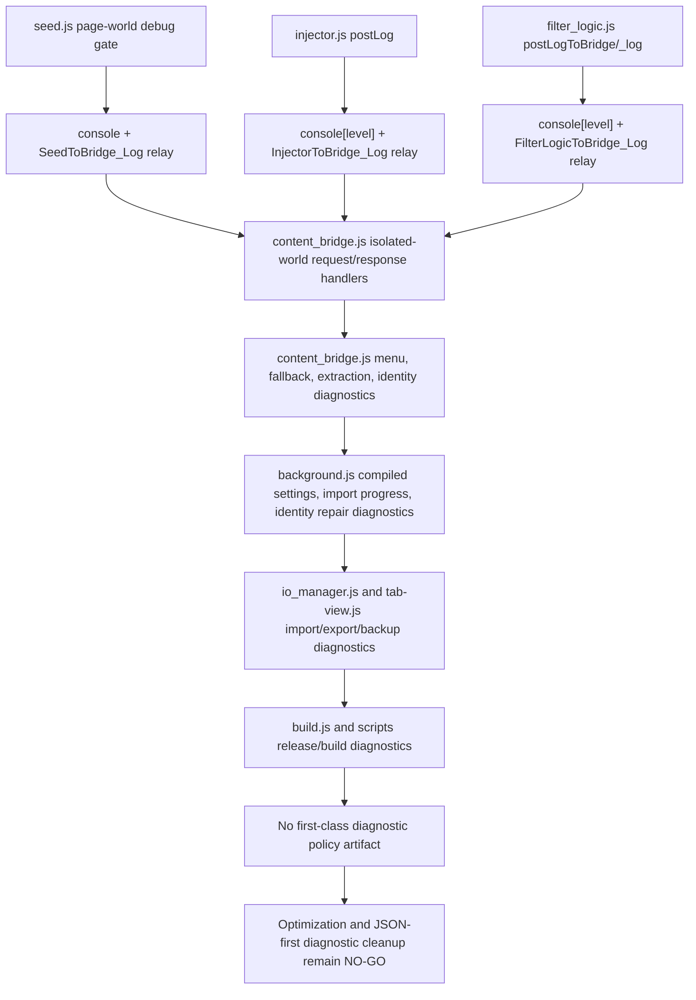
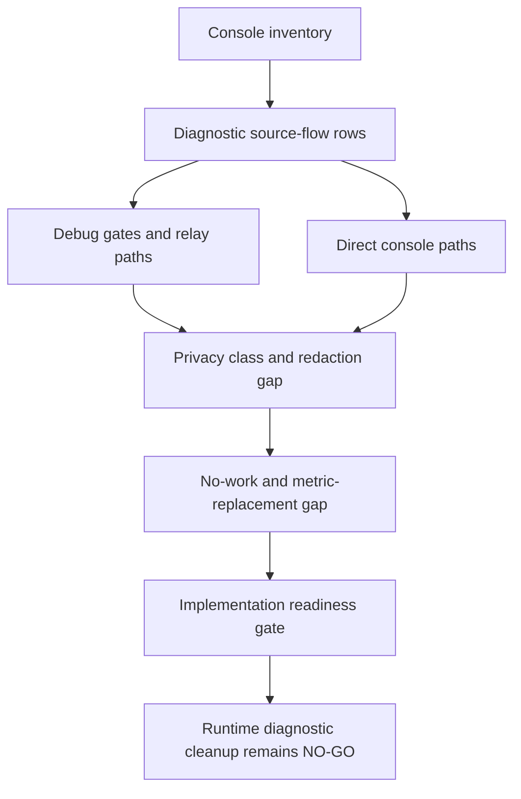
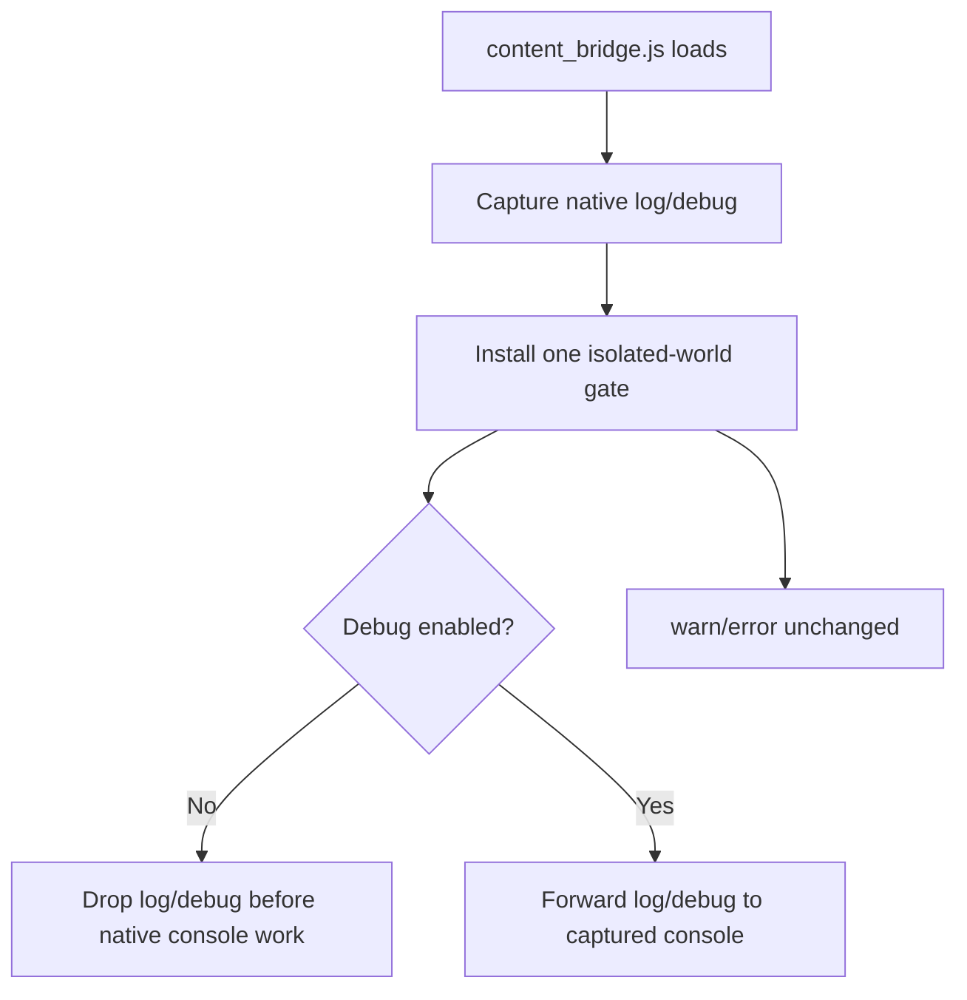
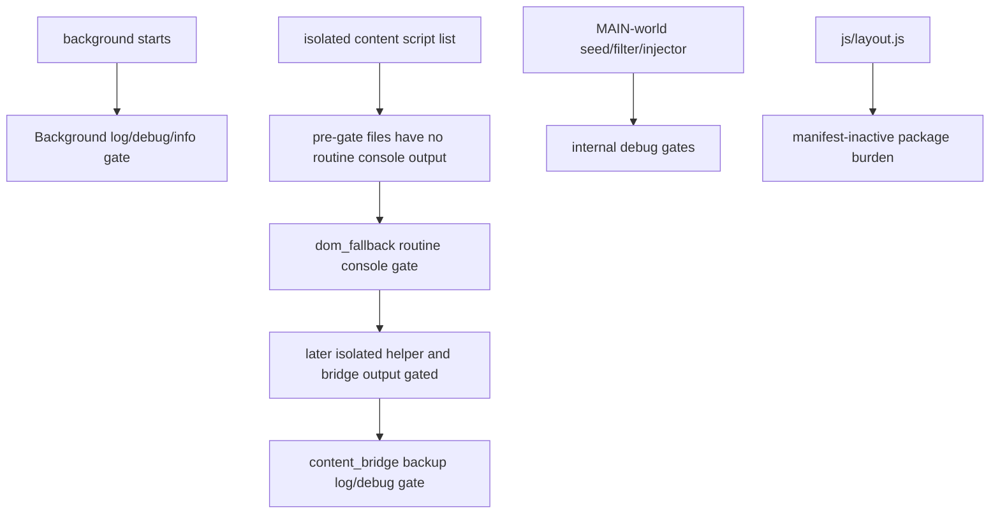
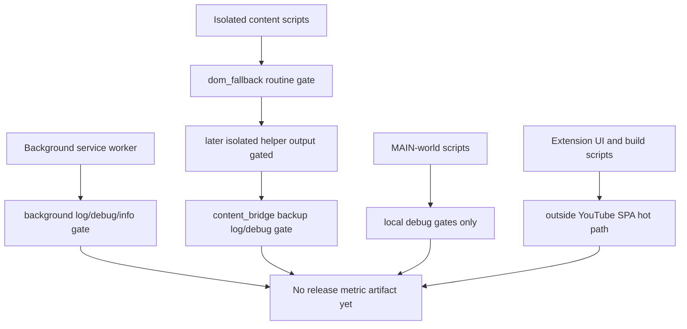
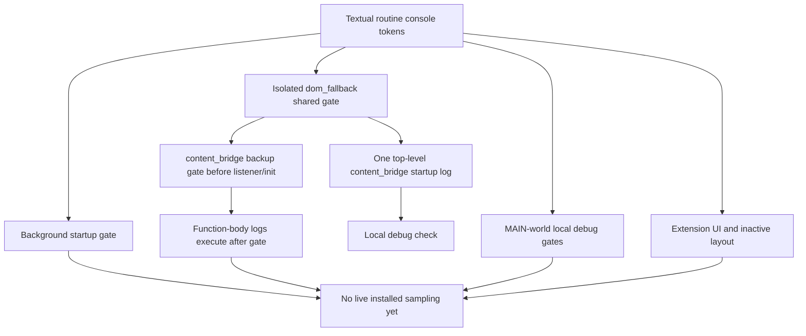

# FilterTube Runtime Diagnostic Logging Policy Matrix Current Behavior - 2026-05-24

Status: current-behavior proof slice with a production console-gate addendum.
The original 2026-05-24 inventory was audit-only and changed no runtime
behavior. The 2026-05-30 addendum adds a `content_bridge.js` bootstrap gate
for isolated content-script-world `console.log` and `console.debug` calls; it
is not a whitelist patch, JSON-first promotion, collector patch, or
release-claim proof.

## Purpose

This slice records the current diagnostic logging surface before optimization
or JSON-first changes. The source has many `console.*` callsites across page
runtime, background identity repair, import/export, dashboard, and build
scripts, but no first-class log policy tying each callsite to debug mode,
privacy class, route, profile, list mode, user action, or metric artifact.

This matters because future optimization work can move cost between seed JSON
processing, DOM fallback, network repair, storage writes, and diagnostics. It
also matters for JSON-first filtering because identity and collaborator logs can
include channel IDs, handles, names, profile targets, request URLs, and import
summaries before a structured privacy/performance policy exists.

## Source Scope

The matrix covers active `console.*` callsites in tracked JS/MJS source,
excluding tests, vendor bundles, generated UI shell output, generated source,
and website code. Lines whose trimmed text begins with `//` are excluded.

| Source file | Lines | Bytes | SHA-256 |
| --- | ---: | ---: | --- |
| `build.js` | 740 | 26978 | `c8485cb2600aad89f44015cd7e49ebe4746ebcc35c91c1ff2bf29aec2f087a04` |
| `js/background.js` | 6641 | 298986 | `837cc8e438b30f53cc14da0317262a0ed5e7c5ae2ece0026611a3963767ae6fd` |
| `js/content/block_channel.js` | 3189 | 127857 | `c040b57e0b107fd7b6fb0a18bc4ca014e5a22fbb82755f81e51a497eee387dba` |
| `js/content/bridge_settings.js` | 1113 | 44087 | `f29e6fab216e80cfd3ae9735088f79b36240331429aadbe85db52467be921853` |
| `js/content/collab_dialog.js` | 393 | 14623 | `dc34bba556b310da8b7516d106e9d67addea59d8a707a02f21607ac97af1f72a` |
| `js/content/dom_extractors.js` | 1137 | 46896 | `adf2c04f14f0f3bb44556e216af25aca8ff182dfa569c248ddb150d0cca38a4e` |
| `js/content/dom_fallback.js` | 5030 | 235555 | `fdc4391aed06849c1ba0a9afbb5b05e5e115b0929639e7014738d1462bf13ec5` |
| `js/content/handle_resolver.js` | 282 | 9785 | `67cc877a0a97e4c4c5aaf5a0d1c37c15000af5238f8f37d7c5dc6efee27e34ff` |
| `js/content_bridge.js` | 13636 | 604184 | `8d55d0c8995e5b68bb9142c41f95046a676f5af2b83f8545b00f91a6a5a3776d` |
| `js/filter_logic.js` | 3652 | 172174 | `953ef0f14970e6cfbc11215fe9eaa078ced34f001908e1c6d5903a8fd2d9a1f5` |
| `js/injector.js` | 3593 | 155830 | `634041581ec84db2edd4f07d46f4bfb9d3a7d97036a0fb83db7739856bdc3e04` |
| `js/io_manager.js` | 2097 | 100479 | `f6f4119992f63a92dd984cd5eb9d5d5c946c839f63abef070ad0dace77474d62` |
| `js/layout.js` | 680 | 30604 | `48831ccdc2d62c75818d9c6a153d7bfacec9d7be9f2408485f74b1a7c13c57c7` |
| `js/popup.js` | 1841 | 75587 | `cb2b30a8d22b08cbd538fdce4ae195b006405d0ceb02a91d92ed53c877aa402a` |
| `js/seed.js` | 1136 | 50026 | `a9d86cd973b998ffbd58faf316ca679267ce7267af36969683f32b760f49054d` |
| `js/settings_shared.js` | 1181 | 57535 | `9710ebb445ba11cc45fc98aced765d298226a8cd4a003600e106f908abc2162c` |
| `js/state_manager.js` | 2491 | 99780 | `509c559e35989c13cdded17c01eeaca8115addcd3848dbcda41514422e5bc7b6` |
| `js/tab-view.js` | 12097 | 548665 | `1d76562bc25f8baf1c134da48c6ab3e25cce80dc186f320378f22646ef6ddd74` |
| `scripts/build-extension-ui.mjs` | 50 | 1188 | `6326362ebf90f448ccdbf68945b3fb522b7b215edaf9b3e28589a4e166239cf3` |
| `scripts/build-nanah-vendor.mjs` | 65 | 1818 | `dae8d3ef29c4cd44b0bf975090e9d53f3bb05b523355f5038930fc03b27e921c` |
| `scripts/sync-native-runtime.mjs` | 34 | 1070 | `4f46c13bf6099092193712790d231ff4809b00b1b0061d04af71ac3ba6bf21c6` |

## Current Counts

```text
diagnostic logging policy matrix source files: 21
active console callsites: 419
console.log callsites: 203
console.warn callsites: 124
console.error callsites: 68
console.debug callsites: 24
console.info callsites: 0
runtime behavior changed by original 2026-05-24 inventory: no
runtime behavior changed by 2026-05-30 content bridge console gate: yes
not completion proof for diagnostic logging policy authority
```

## Build Release Rebaseline - 2026-06-01

The current-source inventory was rebaselined after the release artifact helper
grew one additional `console.warn` path in `build.js`. It was rebaselined again
after the mobile artifact directory prompt gained a default-input guard. The
prompt guard adds no `console.*` callsites. This is build/release script output,
not YouTube page runtime work. The release artifact helper changed the
diagnostic inventory from 418 to 419 active `console.*` callsites and the
warning count from 123 to 124; the prompt guard keeps those counts unchanged.

```text
runtime behavior changed by build warning rebaseline: no
YouTube SPA console quiet behavior changed: no
production console gate status: unchanged
diagnostic logging cleanup approval: NO-GO
```

## Console Callsite Matrix

| File | `log` | `warn` | `error` | `debug` | `info` | Total |
| --- | ---: | ---: | ---: | ---: | ---: | ---: |
| `build.js` | 14 | 6 | 8 | 0 | 0 | 28 |
| `js/background.js` | 49 | 28 | 12 | 13 | 0 | 102 |
| `js/content/block_channel.js` | 1 | 3 | 5 | 0 | 0 | 9 |
| `js/content/bridge_settings.js` | 3 | 3 | 0 | 0 | 0 | 6 |
| `js/content/collab_dialog.js` | 1 | 3 | 0 | 0 | 0 | 4 |
| `js/content/dom_extractors.js` | 0 | 0 | 1 | 0 | 0 | 1 |
| `js/content/dom_fallback.js` | 2 | 1 | 0 | 0 | 0 | 3 |
| `js/content/handle_resolver.js` | 2 | 3 | 0 | 0 | 0 | 5 |
| `js/content_bridge.js` | 114 | 46 | 14 | 8 | 0 | 182 |
| `js/filter_logic.js` | 2 | 5 | 2 | 1 | 0 | 10 |
| `js/injector.js` | 0 | 0 | 0 | 1 | 0 | 1 |
| `js/io_manager.js` | 3 | 5 | 0 | 0 | 0 | 8 |
| `js/layout.js` | 4 | 0 | 0 | 0 | 0 | 4 |
| `js/popup.js` | 1 | 1 | 0 | 0 | 0 | 2 |
| `js/seed.js` | 2 | 0 | 0 | 1 | 0 | 3 |
| `js/settings_shared.js` | 0 | 1 | 0 | 0 | 0 | 1 |
| `js/state_manager.js` | 3 | 14 | 3 | 0 | 0 | 20 |
| `js/tab-view.js` | 1 | 5 | 14 | 0 | 0 | 20 |
| `scripts/build-extension-ui.mjs` | 0 | 0 | 2 | 0 | 0 | 2 |
| `scripts/build-nanah-vendor.mjs` | 0 | 0 | 2 | 0 | 0 | 2 |
| `scripts/sync-native-runtime.mjs` | 1 | 0 | 5 | 0 | 0 | 6 |
| **Total** | **203** | **124** | **68** | **24** | **0** | **419** |

## Owner Family Totals

| Owner family | Current console callsites |
| --- | ---: |
| `page-runtime-core` | 196 |
| `background-storage-state` | 131 |
| `build-release-sync-scripts` | 38 |
| `content-helper` | 28 |
| `extension-ui` | 22 |
| `quarantined-legacy` | 4 |

## Current Behavior Boundaries

| Boundary | Current behavior | Missing proof before optimization |
| --- | --- | --- |
| Page runtime extraction | `js/content_bridge.js` logs extraction, collaborator, menu, fallback, and block action paths, including channel IDs, handles, names, and video IDs. | Debug/privacy policy by route, surface, user action, profile, list mode, and identity confidence. |
| Background identity repair | `js/background.js` logs compiled settings, channel fetch/parse, resolver, add-channel, identity, import, and storage paths. | Log redaction policy plus fetch/identity reason report before network optimization. |
| JSON filter engine | `js/filter_logic.js` has guarded debug logging plus warning/error paths for regex reconstruction, harvest, and map update failures. | Structured metric/report output separate from console diagnostics. |
| Seed interception | `js/seed.js` logs initialization and debug stats when debug is enabled. | Route/endpoint metric artifacts instead of console-only diagnostics. |
| Import/export/sync | `js/io_manager.js`, `js/tab-view.js`, and sync scripts log backup, import, Nanah, and native sync failures. | Machine-readable failure reports and payload privacy classes. |
| Build/release scripts | `build.js` and build scripts log release, badge, artifact, and upload steps. | Release artifact manifest and CI-readable build report. |

## Risk Boundary

- Reliability: log-only diagnostics are not durable evidence and cannot prove
  that optimization or JSON-first changes improved route behavior.
- False-hide/leak: identity logs can include UC IDs, handles, names, custom URLs,
  collaborator data, request URLs, and block inputs without a first-class privacy
  class or redaction policy.
- Performance: high-volume `console.log` paths in page runtime and background
  repair are not tied to a debug/metric budget, so console output can become
  accidental work while measuring JSON-first changes.
- Code burden: diagnostic policy is scattered across page runtime, background,
  filter engine, UI, import/export, and build scripts instead of one owner model.

## Future Proof Fields

```text
diagnosticLogPolicyReport
logOwner
logReason
logLevel
debugGate
privacyClass
redactionPolicy
route
surface
profileType
listMode
userActionReason
networkReason
storageReason
metricReplacement
samplePayloadClass
consoleBudget
machineReadableArtifact
fixtureProvenance
```

## First Optimization Metric Artifact Foundation Packet Addendum

First optimization metric artifact foundation packet addendum:
`docs/audit/FILTERTUBE_FIRST_OPTIMIZATION_METRIC_ARTIFACT_FOUNDATION_PACKET_CURRENT_BEHAVIOR_2026-05-24.md`
and
`tests/runtime/first-optimization-metric-artifact-foundation-packet-current-behavior.test.mjs`
define the audit-only packet for selected
`FT-BIND-00-metric-artifact-foundation`. The addendum pins 12 foundation packet
rows, 0 committed foundation metric artifacts, 0 runtime metric collectors
approved, and 0 implementation-ready foundation packet rows. It does not
approve instrumentation or runtime behavior changes.

## Missing Runtime Authority Symbols

No product runtime source currently defines:

```text
diagnosticLoggingPolicyMatrixContract
diagnosticLogPolicyReport
diagnosticLogDecision
diagnosticLogPrivacyClassReport
diagnosticLogRedactionPolicy
diagnosticLogNoWorkBudget
diagnosticLogMetricArtifact
diagnosticLogFixtureProvenance
diagnosticLogJsonFirstGate
diagnosticLogReleaseGate
diagnosticLoggingSourceFlowReport
diagnosticLogRouteSurfaceMatrix
diagnosticConsoleBudgetReport
diagnosticMetricReplacementPlan
```

## Verification

Current proof command:

```bash
node --test tests/runtime/runtime-diagnostic-logging-policy-matrix-current-behavior.test.mjs --test-reporter=spec
```

This matrix is not a completion claim. It records source-derived diagnostic
logging callsites and keeps logging, privacy, performance, and JSON-first
optimization policy gaps explicit.

## First Optimization Metric Collector Side-Effect Budget Matrix Addendum

First optimization metric collector side-effect budget matrix addendum:
`docs/audit/FILTERTUBE_FIRST_OPTIMIZATION_METRIC_COLLECTOR_SIDE_EFFECT_BUDGET_MATRIX_CURRENT_BEHAVIOR_2026-05-24.md`
and
`tests/runtime/first-optimization-metric-collector-side-effect-budget-matrix-current-behavior.test.mjs`
maps current diagnostic logging gaps to collector side-effect budget rows. The
addendum pins 12 collector side-effect budget rows, 12 collector no-work
preservation rows covered, 12 collector insertion rows covered, 7 evidence
side-effect rows covered, 12 required work-budget fields covered, 12
route/surface obligations covered, 0 runtime collector side-effect budgets
approved, and 0 implementation-ready side-effect rows. It keeps diagnostic
measurement blocked until console, privacy, redaction, debug-gate, metric
replacement, artifact, and rollout budgets are explicit.

## First Optimization Diagnostic Privacy Contract Addendum

First optimization diagnostic privacy contract addendum:
`docs/audit/FILTERTUBE_FIRST_OPTIMIZATION_DIAGNOSTIC_PRIVACY_CONTRACT_CURRENT_BEHAVIOR_2026-05-24.md`
and
`tests/runtime/first-optimization-diagnostic-privacy-contract-current-behavior.test.mjs`
turn this diagnostic logging matrix into the future `diagnostic-privacy.json`
contract without creating the packet or collector. The addendum pins 12
diagnostic privacy contract rows, 1 reserved diagnostic privacy path covered, 0
committed diagnostic privacy files, 0 runtime metric collector approvals, and 0
implementation-ready diagnostic privacy contract rows. It keeps logging,
privacy, redaction, no-work, metric replacement, artifact, fixture, and rollout
proof blocked until they are structured as audit evidence under `docs/audit`.

## First Optimization Source-Locus Diagnostic Privacy Ownership Boundary Addendum

First optimization source-locus diagnostic privacy ownership boundary addendum:
`docs/audit/FILTERTUBE_FIRST_OPTIMIZATION_SOURCE_LOCUS_DIAGNOSTIC_PRIVACY_OWNERSHIP_BOUNDARY_CURRENT_BEHAVIOR_2026-05-24.md`
and
`tests/runtime/first-optimization-source-locus-diagnostic-privacy-ownership-boundary-current-behavior.test.mjs`
maps this logging matrix into current source-locus diagnostic privacy ownership
without approving logging removal, runtime collectors, metric artifacts, or
optimization behavior. The addendum pins 12 source-locus diagnostic privacy
boundary rows, 12 diagnostic privacy contract rows covered, 21 diagnostic
logging policy source files covered, 419 active console callsites covered, 203
console.log callsites covered, 124 console.warn callsites covered, 68
console.error callsites covered, 24 console.debug callsites covered, 0
console.info callsites covered, 196 page-runtime-core callsites covered, 131
background-storage-state callsites covered, 35 current diagnostic privacy
anchors covered, 0 committed diagnostic privacy files, 0 runtime source-owner
approvals, 0 runtime metric collector approvals, 0 implementation-ready
source-locus diagnostic privacy rows, expected runtime audit tests: 4457,
expected runtime audit pass: 4457, and expected runtime audit fail 0. It keeps
diagnostic logging, privacy, redaction, metric replacement, and release/public
claim use blocked until source-locus diagnostic privacy ownership is approved
as a scoped packet.

## Method Semantic Proof Gap Boundary

`docs/audit/FILTERTUBE_METHOD_SEMANTIC_PROOF_GAP_INDEX_CURRENT_BEHAVIOR_2026-05-25.md`
is a required source input before this audit slice can support runtime
optimization or JSON-first promotion. Current proof pins:

```text
method semantic proof gap files covered: 69
method semantic proof gap lexical callables covered: 5797
files with complete per-callable semantic proof: 0
lexical callables requiring semantic proof before behavior changes: 5797
affected callable semantic proof: NO-GO
runtime behavior changed: no
```

These counts are audit-only blockers. They do not approve runtime optimization,
JSON-first behavior, method deletion, method merging, lifecycle cleanup, no-work
changes, or whitelist behavior changes.

## Runtime Diagnostic Source-Flow Addendum - 2026-05-27

This addendum records how current runtime diagnostics move through page-world,
isolated-world, background, dashboard, import/export, and build surfaces before
any logging cleanup or metric collector work. It is audit-only and does not
change runtime behavior.

```text
page main world
  seed.js debug gate -> console.log -> FilterTube_SeedToBridge_Log
  injector.js postLog -> console[level] -> FilterTube_InjectorToBridge_Log
  filter_logic.js postLogToBridge/_log -> console[level] -> FilterTube_FilterLogicToBridge_Log
        |
        v
isolated content bridge
  collaborator/channel/menu/identity diagnostics -> direct console.*
        |
        v
background/service worker
  compiled settings, identity repair, import progress, release prompts -> direct console.*
        |
        v
extension UI and import/export
  dashboard/export/import/backup diagnostics -> direct console.*
        |
        v
build and sync scripts
  release artifact/build/native-sync diagnostics -> direct console.*
        |
        v
missing first-class policy
  no log owner, reason, route, surface, profile, list-mode, privacy class,
  redaction, no-work budget, or metric-replacement artifact
```



| Flow row | Source owner | Current diagnostic path | Missing authority before cleanup/metrics |
| --- | --- | --- | --- |
| `diagnostic_flow_seed_gate_and_relay` | `js/seed.js:25-33`, `js/seed.js:139-168`, `js/seed.js:253-260`, `js/seed.js:983-1014` | Main-world seed logging is debug-gated, sequence-numbered, and relayed through `FilterTube_SeedToBridge_Log`; no-work JSON pass-through and settings replay decisions are console-only when debug is enabled. | Route/endpoint privacy class, endpoint work reason, payload-size budget, and metric artifact replacement. |
| `diagnostic_flow_injector_postlog_relay` | `js/injector.js:105-130`, `js/injector.js:1925-2047`, `js/injector.js:3382-3495` | `postLog()` suppresses `log` without `window.__filtertubeDebug`, keeps warn/error paths, relays through `FilterTube_InjectorToBridge_Log`, and reports settings, collaborator/channel lookups, seed connection, and queue processing. | Sender/receiver owner, route/surface reason, collaboration identity redaction, retry budget, and metric replacement. |
| `diagnostic_flow_filter_logic_engine` | `js/filter_logic.js:19-44`, `js/filter_logic.js:1566-1595`, `js/filter_logic.js:3588-3650` | `postLogToBridge()` and engine `_log()` split debug-gated engine diagnostics from direct warn/error paths for regex reconstruction, harvest, map writes, and renderer filtering. | Renderer privacy class, rule-decision metric, harvest/mutation split report, and structured JSON-first decision artifact. |
| `diagnostic_flow_bridge_request_response` | `js/content_bridge.js:5424-5524`, `js/content_bridge.js:5780-5986` | Isolated-world bridge logs collaborator/channel request timeouts, sent requests, responses, custom URL mapping persistence, and DOM stamping effects directly to console. | Same-window message owner, request reason, identity payload redaction, pending-request budget, and stale-card negative proof. |
| `diagnostic_flow_bridge_menu_identity` | `js/content_bridge.js:7303-7452`, `js/content_bridge.js:10010-10630`, `js/content_bridge.js:12237-13151` | Menu fallback, extraction, collaborator blocking, watch/Shorts recovery, and immediate-hide diagnostics are direct console paths on user-action hot flows. | Menu action reason, route/surface/list-mode budget, channel/collaborator privacy class, outside-click parity, and no-work proof. |
| `diagnostic_flow_background_settings_identity` | `js/background.js:2555-2620`, `js/background.js:2666-3267` | Background logs compiled settings, install/update prompts, watch/Shorts/Kids identity fetch failures, subscription import progress, and settings compilation requests. | Background log owner, profile/list-mode redaction, identity-network reason, credential policy link, and storage/write metric artifact. |
| `diagnostic_flow_import_export_backup` | `js/io_manager.js:1670-1987`, `js/tab-view.js:9100-9350` | Import/export, encrypted backup, auto-backup, download fallback, and backup-rotation diagnostics are direct console paths in user-data workflows. | Payload privacy class, encrypted/unencrypted backup redaction, trusted Nanah state policy, and machine-readable import/export report. |
| `diagnostic_flow_content_helper_menu` | `js/content/block_channel.js:7-14`, `js/content/block_channel.js:1744-2858`, `js/content/block_channel.js:3130-3130` | Quick-block/menu helper has one debug-gated wrapper plus warn/error paths for quick action, dropdown handling, Kids native block messages, and injection failure. | Menu helper owner, native dropdown state policy, Kids action reason, and route/surface no-work budget. |
| `diagnostic_flow_build_release_scripts` | `build.js:75-190`, `build.js:536-716`, `scripts/build-extension-ui.mjs:47-48`, `scripts/build-nanah-vendor.mjs:62-63`, `scripts/sync-native-runtime.mjs:12-30` | Build/release/native-sync scripts write human console output for artifact creation, badge updates, release publishing, and sync failures. | CI-readable release artifact manifest, build log policy, native sync parity report, and upload/release provenance artifact. |

```text
current diagnostic source-flow rows: 9
ASCII diagnostic source-flow diagram: present
Mermaid diagnostic source-flow diagram: present
diagnostic source-flow proof: PARTIAL
runtime diagnostic policy approvals: 0
implementation-ready diagnostic rows: 0
runtime behavior changed by this addendum: no
```

This keeps diagnostic cleanup blocked for the same reason as JSON-first and
whitelist optimization: console output is still local behavior, not a
structured owner decision. Future optimization can remove, downgrade, sample,
or replace logs only after a diagnostic policy packet names the exact owner,
route, surface, profile, list mode, user-action reason, privacy class,
redaction rule, no-work budget, metric replacement, fixture provenance, and
release rollback boundary.

## Diagnostic Logging Convergence Boundary - 2026-05-30

This convergence boundary joins the console callsite inventory, diagnostic
source-flow rows, debug-gated relay paths, direct console paths, identity and
import privacy exposure, JSON decision diagnostics, build/release diagnostics,
future diagnostic privacy contract, metric replacement blockers, and missing
authority symbols into one audit-only gate for future optimization work.

```text
console inventory
  21 source files, 419 active console callsites
        |
        v
diagnostic source flow
  9 current flow rows across seed, injector, filter logic, bridge, background,
  import/export, quick/menu helpers, and build scripts
        |
        v
privacy and metric gaps
  identity data, collaborator data, import/export payload context, route/mode
  reasons, and JSON decisions remain console-local
        |
        v
implementation gate
  diagnostic cleanup, metric replacement, whitelist/cache optimization,
  JSON-first promotion, and release claims remain NO-GO
```



| Convergence row | Current evidence | Missing authority before behavior changes |
| --- | --- | --- |
| `diagnostic_convergence_inventory` | 21 scoped source files and 419 active `console.*` callsites are source-counted. | Approved inventory owner and update policy for release-critical diagnostics. |
| `diagnostic_convergence_hot_runtime_files` | `js/content_bridge.js` has 182 callsites and `js/background.js` has 102 callsites. | Hot-file console budget tied to route, surface, list mode, and user action. |
| `diagnostic_convergence_level_split` | Current levels are 203 `log`, 124 `warn`, 68 `error`, 24 `debug`, and 0 `info`. | Level policy that separates debug-only cost from warning/error evidence. |
| `diagnostic_convergence_source_flow` | 9 source-flow rows map seed, injector, filter logic, bridge, background, import/export, quick/menu, and build scripts. | One owner decision report spanning relay paths and direct console paths. |
| `diagnostic_convergence_identity_privacy` | Bridge/background logs can include channel IDs, handles, names, URLs, collaborator data, and profile/list context. | Privacy class and redaction proof before metric or release use. |
| `diagnostic_convergence_json_decision` | Seed, injector, and filter logic diagnostics describe JSON admission, replay, renderer decisions, and whitelist filtering. | JSON-first metric replacement report instead of console-only evidence. |
| `diagnostic_convergence_no_work_budget` | No-work states can still reach diagnostic paths through local owners. | Disabled/empty-rule/list-mode no-work budget that includes logging cost. |
| `diagnostic_convergence_release_build` | Build, sync, and release scripts use human console output for artifact status and failures. | CI-readable release/build provenance report. |
| `diagnostic_convergence_metric_foundation` | First optimization diagnostic privacy and collector-side-effect docs reserve future proof shape without approving collectors. | Committed metric artifacts, fixture provenance, side-effect budgets, and rollout proof. |
| `diagnostic_convergence_authority_absence` | Product source lacks first-class diagnostic convergence authority symbols. | Approved authority packet before log removal, sampling, suppression, or metric replacement. |

```text
diagnostic logging convergence rows: 10
diagnostic logging policy source files covered by convergence: 21
active console callsites covered by convergence: 419
diagnostic source-flow rows covered by convergence: 9
implementation-ready diagnostic logging convergence rows: 0
runtime diagnostic logging convergence approvals: 0
diagnostic logging cleanup approval: NO-GO
diagnostic metric replacement approval: NO-GO
diagnostic privacy/redaction approval: NO-GO
diagnostic logging convergence authority product source symbol: absent
runtime behavior changed by this convergence boundary: no
```

Future runtime authority symbols remain absent from scoped product source:

```text
diagnosticLoggingConvergenceAuthority
diagnosticLoggingConvergenceReport
diagnosticLogWorkBudget
diagnosticMetricReplacementAuthority
diagnosticPrivacyRedactionAuthority
diagnosticConsoleResidualHotPathReport
diagnosticProductionConsoleRuntimeSample
diagnosticConsoleReleaseSamplingArtifact
diagnosticConsoleResidualOwnerBudget
```

## Content Bridge Production Console Gate Addendum - 2026-05-30

This addendum records the targeted production logging change made after the
YouTube SPA lag fix. The gate is installed from `js/content_bridge.js` and
guards isolated content-script-world `console.log` and `console.debug` calls
unless `window.__filtertubeDebug` is true or `data-filtertube-debug="true"` is
present. The manifest-loaded `js/content/dom_fallback.js` routine gate already
runs before `content_bridge.js`; this addendum keeps the content bridge
bootstrap quiet even if that earlier routine gate is bypassed or overwritten.
It intentionally does not gate `console.warn` or `console.error`.

```text
content_bridge.js startup
  -> capture native log/debug functions
  -> install isolated-world log/debug gate once
  -> debug disabled: log/debug return before native console work
  -> debug enabled: log/debug pass through to captured native console
  -> warn/error remain native
```



| Gate row | Current behavior | Regression boundary |
| --- | --- | --- |
| `content_bridge_console_gate_scope` | Installed from `js/content_bridge.js` in the isolated content-script world after its top-level bootstrap runs. | Does not override page-world `seed.js`, `injector.js`, `filter_logic.js`, or YouTube page console. |
| `content_bridge_console_gate_levels` | Gates `console.log` and `console.debug` dynamically through `isFilterTubeDebugEnabled()`. | Leaves `console.warn` and `console.error` available for unexpected failures. |
| `content_bridge_console_gate_idempotency` | Uses `window.__filtertubeContentBridgeConsoleGateInstalled` to avoid repeated installation on duplicate content-script execution. | Duplicate SPA/script injection does not stack wrappers. |
| `content_bridge_console_gate_debug_escape` | Debug can be enabled through `window.__filtertubeDebug` or the document `data-filtertube-debug` attribute. | Developer diagnostics remain available after reload/debug flag setup. |
| `content_bridge_console_gate_behavior_surface` | Blocks production console output cost from bridge extraction, menu, collaborator, fallback, and immediate-hide log/debug paths. | Does not change blocklist, whitelist, quick-block, channel identity, JSON filtering, or hidden-state decisions. |

```text
production console gate source file: js/content_bridge.js
production console gate test file: tests/runtime/content-bridge-production-console-gate-current-behavior.test.mjs
content_bridge production log/debug gate: GO
warn/error suppression: NO
page-world console override: NO
blocking/whitelist behavior change intended: NO
runtime behavior changed by this addendum: yes, content_bridge-installed isolated-world log/debug gate only
release/public-claim proof from this addendum: NO-GO
broad audit completion from this addendum: NO-GO
```

## Production Console Gate Load-Order Addendum - 2026-05-30

This addendum records the load-order boundary for the remaining routine
`console.log`, `console.debug`, and `console.info` surface after the production
console gate patch. It is audit-only and makes no runtime change. The goal is
to prove whether the remaining routine diagnostic tokens can still execute on
YouTube hot paths with debug disabled.

```text
background.js
  -> installFilterTubeBackgroundConsoleGate()
  -> later background log/debug/info calls are gated

manifest isolated content scripts
  -> identity/menu/dom helpers/extractors have no routine log/debug/info calls
  -> dom_fallback installs installFilterTubeRoutineConsoleGate()
  -> later isolated helpers/content_bridge log/debug/info calls are gated
  -> content_bridge installs a backup log/debug gate before message listener/init

MAIN world
  -> seed/filter_logic/injector routine logs are internally debug-gated
  -> warn/error remain active for failures

legacy layout
  -> js/layout.js has routine logs but has 0 active manifest load/exposure refs
```



| Load-order row | Current proof | Risk boundary |
| --- | --- | --- |
| `production_console_gate_background` | `js/background.js` installs `installFilterTubeBackgroundConsoleGate()` before the first active routine `log/debug/info` token. | Background warn/error remain active; service-worker logs are not YouTube DOM work. |
| `production_console_gate_isolated_manifest_order` | All four active manifests load `js/content/dom_state.js` before `js/content/dom_fallback.js`, then load `js/content/dom_fallback.js` before `js/content/block_channel.js`, `js/content/bridge_settings.js`, `js/content/handle_resolver.js`, `js/content/collab_dialog.js`, and `js/content_bridge.js` in the isolated list. | If a future manifest reorders or injects routine logging helpers before `dom_fallback`, routine logs can reappear before the gate. |
| `production_console_gate_isolated_pre_gate_silence` | The isolated files before `dom_fallback` have 0 active routine `console.log`, `console.debug`, or `console.info` tokens. | This does not cover `console.warn` or `console.error`, by design. |
| `production_console_gate_content_bridge_backup` | `js/content_bridge.js` installs its backup gate before `window.addEventListener('message', ...)` and `initialize()`. | The backup gate is redundant with `dom_fallback`; it is not a filtering decision authority. |
| `production_console_gate_main_world` | `js/seed.js`, `js/filter_logic.js`, and `js/injector.js` routine logs are debug-gated in their own MAIN-world code paths. | MAIN-world console is not overridden globally, so future unconditional logs there remain a risk. |
| `production_console_gate_legacy_layout` | `js/layout.js` still has 4 routine logs, but active manifests have 0 `js/layout.js` refs and 0 web-accessible exposure refs. | It remains package/code-burden until deleted or given release-cleanup authority. |
| `production_console_gate_extension_ui` | `js/popup.js` and `js/tab-view.js` each have 1 routine log outside YouTube page content scripts. | These are dashboard/popup diagnostics, not YouTube SPA scroll/click hot-path work. |
| `production_console_gate_open_risks` | Current gates are source-order proof, not a release metric artifact. | Live installed-tab byte freshness, production console sampling, and route/mode budgets remain `NO-GO`. |

```text
active manifests checked: 4
selected routine log/debug/info token rows: 210
background routine log/debug/info token rows: 62
content_bridge routine log/debug/info token rows: 126
isolated pre-dom_fallback routine log/debug/info token rows: 0
active manifest js/layout.js refs: 0
runtime behavior changed by load-order addendum: no
production console load-order release proof: NO-GO
broad audit completion from load-order addendum: NO-GO
```

## Production Console Gate Coverage Reconciliation - 2026-05-31

This addendum reconciles the earlier content-bridge-specific patch note with
the current source-order proof. The production console state is not "only
content_bridge is gated." Current source has three runtime gate owners:
`background.js`, `js/content/dom_fallback.js`, and `js/content_bridge.js`.
Those gates suppress routine production `log`/`debug`/`info` work on the
covered hot paths while preserving `warn`/`error`.

This is still not full diagnostic logging cleanup. MAIN-world scripts, extension
UI, build/release scripts, and failure diagnostics remain separate policy
surfaces, and there is still no first-class diagnostic logging authority,
privacy/redaction report, route/surface console budget, live installed-tab
sampling artifact, or release proof.

```text
background/service worker
  -> installFilterTubeBackgroundConsoleGate()
  -> gates background log/debug/info
  -> warn/error remain active

isolated YouTube content scripts
  -> js/content/dom_fallback.js installs installFilterTubeRoutineConsoleGate()
  -> gates later isolated log/debug/info across shared isolated console
  -> js/content_bridge.js installs backup log/debug gate
  -> warn/error remain active

MAIN world and extension UI
  -> seed/filter/injector use local debug gates for selected routine output
  -> popup/tab-view/build scripts remain outside YouTube SPA hot-path gates
  -> future unconditional logs remain diagnostic-policy debt
```



| Coverage row | Current source-backed status | Remaining risk |
| --- | --- | --- |
| `production_console_gate_coverage_background` | `js/background.js` installs `installFilterTubeBackgroundConsoleGate()` at startup before selected routine background `log/debug/info` rows. | Background warnings/errors still emit by design, and there is no service-worker route/profile console budget. |
| `production_console_gate_coverage_dom_fallback` | `js/content/dom_fallback.js` installs `installFilterTubeRoutineConsoleGate()` before later isolated content helpers and bridge code. | This relies on manifest order staying stable and does not govern MAIN-world scripts. |
| `production_console_gate_coverage_content_bridge` | `js/content_bridge.js` installs a backup `log/debug` gate before bridge message/listener/init work. | Backup gate is not a diagnostic policy authority and does not suppress warn/error. |
| `production_console_gate_coverage_main_world` | `js/seed.js`, `js/filter_logic.js`, and `js/injector.js` keep selected routine output behind local debug checks. | MAIN-world console is not globally wrapped; future unconditional logs can bypass this proof. |
| `production_console_gate_coverage_extension_ui` | `js/popup.js`, `js/tab-view.js`, `build.js`, and scripts are outside the YouTube SPA content hot path. | They remain release/build/UI diagnostic policy debt. |
| `production_console_gate_coverage_release_gap` | Current proof is static source-order plus VM slice tests. | Live installed-tab console sampling, byte freshness, route/mode budgets, and release/public-claim use remain `NO-GO`. |

```text
runtime console gate owner files: 3
background gate levels: log/debug/info
dom_fallback routine gate levels: log/debug/info
content_bridge backup gate levels: log/debug
warn/error suppression: NO
MAIN-world global console override: NO
extension UI console cleanup approval: NO-GO
live installed-tab console sampling proof: NO-GO
runtime behavior changed by this reconciliation: no
diagnostic logging cleanup approval: NO-GO
broad audit completion from this reconciliation: NO-GO
```

## Production Console Residual Hot-Path Preflight - 2026-05-31

This preflight is audit-only. It separates textual `console.log`/`console.debug`/
`console.info` callsites from execution-time console work after the production
gate changes, so future cleanup does not mistake function-body definitions for
pre-gate runtime output.

Current source still has many routine diagnostic tokens, but the YouTube SPA
hot-path residual is narrower than the raw count:

```text
background/service worker
  -> startup console gate installs before 62 routine background log/debug/info rows

isolated YouTube content scripts
  -> dom_fallback console gate installs first in active manifest order
  -> content helper routine rows and content_bridge routine rows share that gate
  -> content_bridge backup gate installs before message listener and initialize timer
  -> content_bridge top-level executed startup log is locally debug-gated

MAIN world
  -> seed/filter_logic/injector routine rows rely on local debug gates
  -> no global MAIN-world console override exists

extension UI / inactive layout
  -> routine rows are outside the YouTube page hot path
  -> still release/code-burden debt
```



| Residual row | Source pins | Current behavior | Missing proof before release cleanup |
| --- | --- | --- | --- |
| `production_console_residual_bridge_preface` | `js/content_bridge.js:11-37`; `js/content_bridge.js:13596-13630` | `content_bridge.js` has 126 textual routine rows before the backup gate install, but only one top-level executed routine log before that gate and it is locally debug-gated; the helper definition also checks debug before logging. | Live installed-tab proof that debug-disabled startup emits no content-bridge log/debug output. |
| `production_console_residual_bridge_function_bodies` | `js/content_bridge.js:702-13594`; `js/content_bridge.js:13608-13628` | The remaining 124 content-bridge routine rows are function-body diagnostics; the backup gate installs before `message` listener registration and the `initialize()` timer. | Route/profile/list-mode sampling proving menu, collaborator, fallback, quick-block, and identity paths stay quiet with debug disabled. |
| `production_console_residual_background_gate` | `js/background.js:12`; `js/background.js:1770-6303`; `js/background.js:6305-6318` | The background console gate is invoked at startup before 62 routine background `log/debug/info` rows. | Service-worker sample showing routine logs stay suppressed while warnings/errors still surface. |
| `production_console_residual_isolated_shared_gate` | `js/content/dom_fallback.js:5`; active manifest isolated script order; `js/content/dom_fallback.js:4559-4706` | Active manifests load `dom_fallback` before helper and bridge scripts, so 135 manifest-isolated routine rows are behind the shared isolated console gate. | Installed manifest/order byte proof plus live YouTube page sampling after reload. |
| `production_console_residual_main_world_local_debug` | `js/seed.js:11-153`; `js/filter_logic.js:11-1590`; `js/injector.js:97` | MAIN-world code has 7 routine rows behind local debug checks, but no global MAIN-world console override. | Endpoint/route fixture proving no unconditional MAIN-world routine log is added before JSON-first promotion. |
| `production_console_residual_non_hotpath_ui_layout` | `js/popup.js:1544`; `js/tab-view.js:8959`; `js/layout.js:71-483` | Popup/tab-view routine rows are extension UI diagnostics, and `layout.js` routine rows are not active-manifest loaded. | Release cleanup decision for UI diagnostics and inactive layout package burden. |
| `production_console_residual_release_gate` | this addendum; coverage reconciliation above | Static source proof is not a production console sampling artifact. | `diagnosticProductionConsoleRuntimeSample`, route/mode console budget, installed-byte freshness, rollback packet, and release/public-claim approval. |

```text
production console residual preflight rows: 7
selected routine log/debug/info token rows: 210
content_bridge textual routine rows before backup install: 126
content_bridge top-level executed routine rows before backup install: 1
content_bridge debug helper routine definition rows: 1
content_bridge post-gate function-body routine rows: 124
background routine log/debug/info rows behind startup gate: 62
manifest-isolated routine rows behind dom_fallback gate: 135
MAIN-world local-debug routine rows: 7
extension UI/layout routine rows outside YouTube hot path: 6
warn/error suppression: NO
live installed-tab console sampling proof: NO-GO
diagnostic logging cleanup approval from residual preflight: NO-GO
runtime behavior changed by this preflight: no
```

## Connected Chrome Console Sampling Precondition Recheck - 2026-05-31

The Chrome connector was reachable, but the read-only tab inventory exposed no
YouTube, YouTube Kids, FilterTube dashboard, or installed extension tab to use
for runtime console sampling. No tab was claimed, no page was reloaded, and no
raw unrelated tab titles/URLs were committed.

```text
connected Chrome endpoint reachable: yes
connected open top-level tabs observed: 45
connected relevant YouTube/FilterTube tabs observed: 0
tab claimed for console sampling: no
raw tab titles or URLs committed: no
production console runtime sample collected: no
diagnostic console release sampling artifact written: no
live installed-tab console sampling proof: NO-GO
diagnostic logging cleanup approval from connector recheck: NO-GO
runtime behavior changed by connector recheck: no
```

This recheck narrows the blocker from "browser connector unknown" to "no
relevant live target available through the connected inventory." It still does
not prove that production YouTube tabs are quiet with debug disabled, and it
does not approve removal of diagnostic calls.
