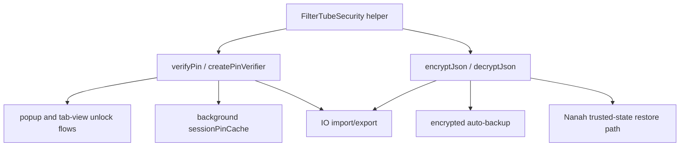

# FilterTube Security Manager Method Semantic Register - Current Behavior - 2026-05-21

Status: audit-only current-behavior register. Runtime behavior is unchanged.

This register promotes `js/security_manager.js` from broad UI/settings callable
accounting to a source-derived method inventory. It covers the shared
`FilterTubeSecurity` helpers used by profile/PIN lock, import/export, encrypted
backup, and Nanah restore callers: WebCrypto availability checks, string and
object normalization, base64 byte encoding, PBKDF2 derivation, PIN verifier
creation/verification, and encrypted JSON serialization/deserialization.

This is not completion proof for every caller authorization path, profile lock
gate, parent/child mutation gate, import preview, Nanah trust decision, backup
rotation effect, encrypted payload compatibility case, wrong-PIN UX, timing
comparison policy, or browser WebCrypto compatibility path. It is a
current-behavior boundary before PIN, encrypted backup, import/export, Nanah,
profile lock, or security-gated mutation behavior changes.

## Source-Derived Summary

```text
source file: js/security_manager.js
line count: 198
named declarations: 12
plain function declarations: 6
async function declarations: 6
const arrow helper declarations: 0
public FilterTubeSecurity entries: 4
semantic method groups: 5
TextEncoder constructions: 3
TextDecoder constructions: 1
btoa calls: 1
atob calls: 1
cryptoApi.getRandomValues calls: 1
subtle.importKey calls: 2
subtle.deriveBits calls: 1
subtle.deriveKey calls: 1
subtle.encrypt calls: 1
subtle.decrypt calls: 1
JSON.stringify calls: 1
JSON.parse calls: 1
throw new Error statements: 7
Number.isFinite calls: 2
setTimeout calls: 0
addEventListener calls: 0
document references: 0
window references: 0
global.FilterTubeSecurity assignments: 1
module.exports references: 0
runtime behavior changed: no
```

## Method Group Counts

```text
securityByteEncodingHelpers: 2
securityCryptoDefensiveHelpers: 4
securityEncryptedJsonLifecycle: 2
securityPbkdf2Derivation: 2
securityPinVerifierLifecycle: 2
```

## Semantic Group Summary

| Semantic group | Declarations | Current owner/effect shape | Missing proof before behavior changes |
| --- | ---: | --- | --- |
| `securityCryptoDefensiveHelpers` | 4 | Reads `globalThis.crypto`, fails closed when `subtle` is missing, trims caller passwords/PINs, generates random bytes, and coerces payloads to plain objects. | Browser compatibility fixture, empty-string policy proof, random-byte availability proof, and caller-visible failure contract. |
| `securityByteEncodingHelpers` | 2 | Converts byte arrays to base64 with `btoa()` and normalizes base64 input through `atob()` into `Uint8Array` payloads. | Invalid base64 failure fixture, Unicode/byte boundary proof, and encoded payload compatibility report. |
| `securityPbkdf2Derivation` | 2 | Imports normalized passphrases into PBKDF2 and derives either raw verifier bits or AES-GCM keys with SHA-256. | KDF/version compatibility matrix, iteration-floor policy, empty-passphrase caller policy, and browser algorithm fixture. |
| `securityPinVerifierLifecycle` | 2 | Creates PBKDF2/SHA-256 PIN verifier objects with a random or injected 16-byte salt, then verifies by recomputing bits and comparing base64 strings. | Timing-comparison policy, wrong-PIN fixture, malformed-verifier fixture, iteration bounds, and profile-lock caller gate. |
| `securityEncryptedJsonLifecycle` | 2 | Encrypts JSON with PBKDF2-derived AES-GCM using random or injected salt/IV, and decrypts only supported PBKDF2/SHA-256/AES-GCM containers before `JSON.parse()`. | Encrypted payload schema validator, wrong-password fixture, tamper fixture, import preview boundary, Nanah restore policy, and caller mutation gate. |

## Current Method Inventory

| Source line | Kind | Method or function | Semantic group |
| ---: | --- | --- | --- |
| 7 | `function` | `ensureCrypto` | `securityCryptoDefensiveHelpers` |
| 13 | `function` | `normalizeString` | `securityCryptoDefensiveHelpers` |
| 17 | `function` | `toBase64` | `securityByteEncodingHelpers` |
| 26 | `function` | `fromBase64` | `securityByteEncodingHelpers` |
| 37 | `function` | `randomBytes` | `securityCryptoDefensiveHelpers` |
| 44 | `function` | `safeObject` | `securityCryptoDefensiveHelpers` |
| 48 | `async function` | `deriveBitsPBKDF2` | `securityPbkdf2Derivation` |
| 71 | `async function` | `deriveAesKeyPBKDF2` | `securityPbkdf2Derivation` |
| 97 | `async function` | `createPinVerifier` | `securityPinVerifierLifecycle` |
| 112 | `async function` | `verifyPin` | `securityPinVerifierLifecycle` |
| 125 | `async function` | `encryptJson` | `securityEncryptedJsonLifecycle` |
| 156 | `async function` | `decryptJson` | `securityEncryptedJsonLifecycle` |

## Current Public API Surface

```text
createPinVerifier
verifyPin
encryptJson
decryptJson
```

## Current Crypto And Data Surface

```text
crypto source: globalThis.crypto
subtle source: cryptoApi?.subtle
failure when unavailable: throw new Error('WebCrypto unavailable')
PIN verifier KDF: PBKDF2
PIN verifier hash: SHA-256
default iterations: 150000
PIN salt length: randomBytes(16) unless injected
PIN comparison: got === expected
encrypted JSON KDF: PBKDF2
encrypted JSON cipher: AES-GCM
encrypted JSON salt length: randomBytes(16) unless injected
encrypted JSON IV length: randomBytes(12) unless injected
encrypted JSON payload shape: kdf, cipher, data
unsupported KDF failure: throw new Error('Unsupported KDF')
unsupported cipher failure: throw new Error('Unsupported cipher')
invalid payload failure: throw new Error('Invalid encrypted payload')
```

## Current Entrypoints And Dependencies

```text
module entrypoint: (function (global) { ... })(typeof window !== 'undefined' ? window : this)
browser/global export: global.FilterTubeSecurity
external callers: popup, tab-view, io_manager, nanah/import/export/security PIN paths
no DOM selector ownership: true
no listener ownership: true
no timer ownership: true
no storage mutation ownership inside this file: true
```

## Caller Boundary Snapshot - 2026-05-27

This addendum ties the pure security helper methods to the current caller
authority paths. It is audit-only and does not approve profile, import/export,
Nanah, backup, or PIN behavior changes.

```text
Security manager method
        |
        +--> creates/verifies PIN material or encrypts/decrypts JSON
        |
        v
caller decides authority
        |
        +--> dashboard/popup profile unlock
        +--> background session cache
        +--> IO import/export PIN checks
        +--> encrypted backup creation/decryption
        +--> Nanah trusted-state restore decisions
```



| Caller boundary | Current source | Current security-manager use | Remaining authority gap |
| --- | --- | --- | --- |
| Popup unlock wrapper | `js/popup.js:1226-1262` | Calls `FilterTubeSecurity.verifyPin()` after prompting for the profile PIN, then marks the profile unlocked and notifies background. | Popup unlock does not make lower-level mutation helpers safe by itself. |
| Dashboard unlock wrapper | `js/tab-view.js:8349-8397` | Calls `verifyPin()`, records `sessionMasterPin` for Default, and forwards session auth to background. | Dashboard session state is local and not a shared mutation authority. |
| Background session cache | `js/background.js:634-655`, `js/background.js:3268-3284`, `js/background.js:3571-3579` | Extracts profile/Master verifier, caches authorized profile ids after `FilterTube_SessionPinAuth`, and only some actions consult `isProfileSessionAuthorized()`. | Session checks are not applied consistently to every rule/list/profile mutation action. |
| IO PIN requirement | `js/io_manager.js:190-212`, `js/io_manager.js:1241-1289` | Uses `verifyPin()` through `requirePinOrThrow()` for local/incoming Master PIN checks on Default-target import paths. | PIN success is not an import mutation plan, target-profile revision, or rollback report. |
| IO encrypted export/import | `js/io_manager.js:1729-1770` | Calls `encryptJson()` and `decryptJson()` around backup payloads; encrypted import delegates to `importV3()` without forwarding `targetProfileId`. | Encrypted payload validity is not profile targeting authority or Nanah trust authority. |
| Background encrypted backup | `js/background.js:819-837` | Calls `encryptJson()` with the cached active-profile PIN or skips with `missing_session_pin`. | Backup scheduling, skip reporting, and rotation authority are owned outside `security_manager.js`. |
| Dashboard encrypted import decrypt | `js/tab-view.js:9299-9315` | Calls `decryptJson()` after prompting for the file password/PIN. | Decryption success still needs import preview, trusted-state choice, and mutation authority. |

Current approval state:

```text
security manager caller mutation authority: NO-GO
security manager encrypted payload caller authority: NO-GO
security manager profile unlock authority: NO-GO
runtime behavior changed by this addendum: no
```

The security manager remains intentionally pure: no DOM selectors, listeners,
timers, storage writes, or filtering decisions live in this file. That makes it
easier to test cryptographic payloads, but it also means every behavior change
that relies on successful PIN verification or decryption must cite the caller
path and prove the mutation gate separately.

## Future Proof Fields

Each security manager method row must eventually be backed by a source line,
fixture, caller path, and observed success/failure effect before PIN or
encrypted backup behavior changes can claim semantic coverage:

```text
methodReference
sourceLine
semanticGroup
publicApiEntry
callerSurface
cryptoDependency
kdfName
hashAlgorithm
cipherName
iterationsPolicy
saltSource
ivSource
passwordNormalization
encodedPayloadShape
failureMode
callerMutationGate
timingComparisonPolicy
browserCompatibilityFixture
positiveFixture
negativeMissingCryptoFixture
negativeWrongPinFixture
negativeWrongPasswordFixture
negativeMalformedPayloadFixture
negativeUnsupportedKdfFixture
negativeUnsupportedCipherFixture
importPreviewBoundary
profileLockBoundary
fixtureProvenance
```

## Missing Runtime Authorities

These names intentionally do not exist in runtime source yet. They name the
contracts that would be needed before implementation changes can be treated as
covered:

```text
securityManagerMethodAuthority
securityManagerCryptoAvailabilityContract
securityManagerPinVerifierContract
securityManagerEncryptedJsonContract
securityManagerKdfCompatibilityReport
securityManagerTimingComparisonPolicy
securityManagerPayloadValidationReport
securityManagerCallerMutationGate
securityManagerFixtureProvenance
```

## Method Semantic Proof Gap Boundary

`docs/audit/FILTERTUBE_METHOD_SEMANTIC_PROOF_GAP_INDEX_CURRENT_BEHAVIOR_2026-05-25.md`
is a required source input before this method semantic register can support
runtime optimization or JSON-first promotion. Current proof pins:

```text
method semantic proof gap files covered: 69
method semantic proof gap lexical callables covered: 5836
files with complete per-callable semantic proof: 0
lexical callables requiring semantic proof before behavior changes: 5836
affected callable semantic proof: NO-GO
runtime behavior changed: no
```

These counts are audit-only blockers. They do not approve runtime
optimization, JSON-first behavior, method deletion, method merging, lifecycle
cleanup, no-work changes, or whitelist behavior changes.
