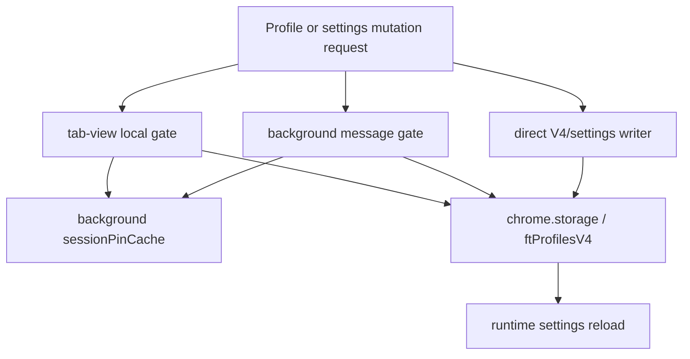

# FilterTube Security, PIN, And Lock Authority Audit - 2026-05-18

Status: current-behavior audit. This is not an implementation patch.

This slice audits who is allowed to unlock profiles, mutate rules/settings,
export/import state, and send or receive Nanah sync payloads. It is separate
from the message-trust audit because PIN/parent authority is a product policy
boundary, not only a sender-validation boundary.

## Executive Finding

FilterTube has real PIN primitives and several UI guards, but lock authority is
not yet centralized. Some paths require an unlocked profile or Master PIN, while
other mutation paths only require that the sender is an extension page, and a
few content-script message paths still mutate rules with no trusted-UI check.

That makes simultaneous allow/block migration unsafe until there is one
security authority contract for:

```text
profile + surface + action
        |
        v
securityLockAuthority
        |
        +--> allowed as current viewer?
        +--> requires active profile PIN?
        +--> requires parent/account unlock?
        +--> requires Default/Master unlock?
        +--> allowed through background/content/Nanah/import?
```

## Current PIN Primitives

| Source | Current behavior | Proof |
| --- | --- | --- |
| `js/security_manager.js:97` | `createPinVerifier()` stores PBKDF2/SHA-256 verifier data with 150000 iterations and random 16-byte salt. | `tests/runtime/security-pin-lock-authority-current-behavior.test.mjs` |
| `js/security_manager.js:112` | `verifyPin()` recomputes PBKDF2 bits and compares base64 strings. | same |
| `js/security_manager.js:125` | `encryptJson()` encrypts backup JSON with PBKDF2-derived AES-GCM and random 12-byte IV. | same |
| `js/security_manager.js:156` | `decryptJson()` rejects unsupported KDF/cipher and decrypts AES-GCM payloads. | same |

The cryptographic primitive is not the primary gap in this audit. The gap is
which callers are allowed to reach write paths after a PIN has been checked.

## Background Session Cache

`js/background.js:634` extracts master/profile PIN verifiers from
`ftProfilesV4`. `js/background.js:647` stores unlocked session state in
`sessionPinCache`, and `js/background.js:655` verifies the submitted PIN before
caching the profile id.

The message path for unlocking is guarded by extension-page sender origin:

```text
FilterTube_SessionPinAuth
  -> isTrustedUiSender(sender)
  -> verifyAndCacheSessionPin(profileId, pin)
  -> sessionPinCache.set(profileId, pin)
```

Proof: `js/background.js:3266-3278`.

Risk: this creates a background session cache, but only some later mutation
paths consult it.

## Mutation Paths With Session Checks

| Path | Current guard | Proof |
| --- | --- | --- |
| `FilterTube_BatchImportWhitelistChannels` | Requires trusted UI sender, active profile still equals target profile, and `isProfileSessionAuthorized()` before writing imported whitelist channels. | `js/background.js:3537-3570` |
| `StateManager.importSubscribedChannelsToWhitelist()` | Checks `isUiLocked()` before and after fetching subscriptions, and verifies active profile did not change. | `js/state_manager.js:1711-1771` |
| Export/import full/default backups | `io_manager.exportV3()` and `io_manager.importV3()` require Master PIN when the effective target is Default and a verifier exists. | `js/io_manager.js:1147-1153`, `1255-1269` |
| Account policy edits | Tab view requires Default active profile and `ensureAdminUnlocked()`. | `js/tab-view.js:9720-9731` |
| Master PIN set/clear | Tab view blocks child profiles, requires Default, and requires current Master unlock before changing or clearing an existing Master PIN. | `js/tab-view.js:10017-10135` |

These are good local guards and should be preserved.

## Mutation Paths Without A Shared Lock Contract

| Path | Current guard | Gap |
| --- | --- | --- |
| `FilterTube_SetListMode` | `isTrustedUiSender(sender)` only. | It changes active profile Main/Kids modes and can merge/clear lists without checking `isProfileSessionAuthorized()`, active child/parent role, or Master/admin authority. Proof: `js/background.js:3290-3492`. |
| `addWhitelistChannelPersistent` | `isTrustedUiSender(sender)` only. | It writes Main whitelist entries through `handleAddFilteredChannel()` without a background session/role check. Proof: `js/background.js:3498-3536`. |
| `FilterTube_KidsWhitelistChannel` | `isTrustedUiSender(sender)` only. | It writes Kids whitelist entries without a background session/role check. Proof: `js/background.js:3706-3758`. |
| `FilterTube_TransferWhitelistToBlocklist` | `isTrustedUiSender(sender)` only. | It moves whitelist entries back into blocklist and clears allow lists without a background session/role check. Proof: `js/background.js:3759-3915`. |
| `addFilteredChannel` secondary listener | No trusted UI sender guard. | A content-script shaped message can call `handleAddFilteredChannel()` and write rule state. Proof: `js/background.js:5209-5246`. |
| `toggleChannelFilterAll` secondary listener | No trusted UI sender guard in the secondary listener family. | It toggles row behavior through a split message shape. Proof starts at `js/background.js:5249`. |
| `StateManager.setSetting('syncKidsToMain')` | Caller/UI layer usually gates locked UI, but the setter itself writes V4/V3 directly. | A future caller can mutate cross-surface policy without a local lock assertion inside the mutation primitive. Proof: `js/state_manager.js:2048-2085`. |
| Scoped Nanah apply | Writes active/target profile Main/Kids state directly through `io.saveProfilesV4()`. | Permission is expected to be enforced by the sending/receiving UI flow, not by `applyScopedPortablePayload()` itself. Proof: `js/nanah_sync_adapter.js:168-249`. |

This is the same disease as the runtime filtering bugs: authority is split
across UI state, background sender checks, profile session cache, state manager
helpers, and import/sync adapters.

## UI Lock Gate

The dashboard/popup UI does hide or disable many controls when locked.

Evidence:

- `js/tab-view.js:5055-5125` installs a lock gate for locked profiles.
- `js/tab-view.js:10527-10535` disables list-mode controls when `isUiLocked()`.
- `js/tab-view.js:11034-11043` blocks keyword adds when locked.
- `js/tab-view.js:11131-11144` blocks channel adds when locked.
- `js/popup.js:1234-1261` prompts for PIN and notifies background session unlock.
- `js/popup.js:1622-1640` disables popup controls when locked.

UI gating is necessary but insufficient. The authority check must also live at
the mutation boundary, because future UI surfaces, page messages, imports, sync,
or extension-page routes can reach the same write helpers.

## Import, Export, And Nanah Boundary

The import/export side has stronger Master PIN handling than ordinary list-mode
mutation, but it still lacks one mutation report/revision authority:

- `io_manager.exportV3()` requires local Master PIN for full Default export if a
  Master verifier exists.
- `io_manager.importV3()` requires local Master PIN and incoming backup Master
  PIN when importing into Default and matching verifiers exist.
- `io_manager.importV3Encrypted()` decrypts and forwards to `importV3()`, but
  the existing import/export audit already proves `targetProfileId` is not
  forwarded.
- `nanah_sync_adapter.applyScopedPortablePayload()` writes V4 directly and
  returns `{ ok: true }` without refresh/revision authority.

Security implication: future simultaneous allow/block schema changes must not
add another direct importer/sync writer. They need one shared dry-run mutation
report that includes profile target, current lock state, required unlock class,
and affected surfaces.

## Profile/PIN Mutation Gate Snapshot - 2026-05-27

This addendum pins the current profile/PIN mutation boundary after the release
lag and whitelist fixes. It is audit-only and does not approve any runtime,
schema, settings, import, Nanah, or managed-child behavior change.

```text
Profile or settings mutation request
        |
        +--> Dashboard local gate
        |       -> child/admin view gate
        |       -> active profile locked?
        |       -> Master/profile PIN prompt?
        |
        +--> Background message gate
        |       -> trusted UI sender?
        |       -> sessionPinCache consulted by some actions only
        |
        +--> Direct writer
                -> io.saveProfilesV4 / StateManager setter / Nanah scoped apply
                -> storage refresh and runtime settings reload happen later
```



| Boundary | Current source | Current behavior | Approval |
| --- | --- | --- | --- |
| Dashboard session state | `js/tab-view.js:3000-3106` | Keeps `sessionMasterPin` and `unlockedProfiles` in the dashboard, then notifies background with `FilterTube_SessionPinAuth` or `FilterTube_ClearSessionPin`. | NO-GO |
| PIN verifier lookup | `js/tab-view.js:3909-3932`, `js/security_manager.js:97-123` | Default uses Master verifier; non-default profiles use profile verifier; PBKDF2/SHA-256 verification is local to the caller. | NO-GO |
| Profile unlock prompt | `js/tab-view.js:8357-8397` | `ensureProfileUnlocked()` prompts, verifies the PIN, mutates dashboard unlock state, and forwards session auth to background. | NO-GO |
| Child/admin capability UI | `js/tab-view.js:4440-4514`, `js/tab-view.js:4590-4597` | Child profiles have admin/backup/import controls disabled and locked profiles are treated as UI-locked, but this remains a UI-level gate. | NO-GO |
| Account policy writes | `js/tab-view.js:9720-9784` | Account policy changes require Default active profile and `ensureAdminUnlocked()` before saving `accountPolicy`. | NO-GO |
| Account creation | `js/tab-view.js:9787-9905` | Account creation rejects child admin surfaces, requires Default active profile, checks Master unlock, and enforces `allowAccountCreation` / `maxAccounts`. | NO-GO |
| Child profile creation | `js/tab-view.js:9908-10013` | Child creation rejects child admin surfaces, requires an active account profile, and calls `ensureProfileUnlocked()` for that parent account. | NO-GO |
| Master PIN set/clear | `js/tab-view.js:10016-10140` | Master PIN mutation requires Default active profile; changing/clearing an existing PIN requires Master unlock, then updates V4 security state. | NO-GO |
| Managed child surface writes | `js/tab-view.js:4207-4278`, `js/tab-view.js:10314-10419`, `js/tab-view.js:10532-10647`, `js/tab-view.js:11410-11428` | Parent-managed child edits check parent/Default management relationship, then write child Main/Kids rules/settings through `saveManagedChildSurface()`. They do not share a background mutation authority. | NO-GO |
| Import/export UI auth | `js/tab-view.js:9132-9391`, `js/tab-view.js:9418-9450` | UI export/import blocks child surfaces and prompts for local/incoming Master PINs for full Default backup flows. | NO-GO |
| Import/export writer auth | `js/io_manager.js:190-212`, `js/io_manager.js:1241-1289`, `js/io_manager.js:1691-1770` | IO verifies local/incoming Master PINs for Default-target full imports and optionally restores Nanah trusted state only for encrypted full Default imports when explicitly requested. Encrypted import still forwards only `{ strategy, scope, auth }`. | NO-GO |
| Nanah send/receive auth | `js/tab-view.js:7488-7580`, `js/tab-view.js:9663-9709`, `js/nanah_sync_adapter.js:186-277` | UI send/incoming flows perform profile/Master unlock and child receive-only checks, but scoped Nanah apply writes target V4 directly after payload normalization. | NO-GO |

Current approval state:

```text
profile/PIN mutation authority approval: NO-GO
managed child mutation authority approval: NO-GO
import/Nanah trust restoration authority approval: NO-GO
runtime behavior changed by this addendum: no
```

This snapshot does not weaken existing release fixes. It says the opposite:
performance work may keep no-work gates and menu fixes, but broader
optimization, JSON-first promotion, simultaneous allow/block schema changes,
profile import targeting, and managed-child editor changes still need one
shared mutation authority with negative fixtures for locked, child, stale
profile, wrong-target, spoofed-sender, trusted-link, and replay cases.

## Risk For Current User Reports

This slice is not the direct cause of empty-install YouTube lag. The direct lag
cause remains split active-rule/lifecycle/endpoint authority. But security lock
drift can explain why future UI migrations are risky:

```text
locked or child profile
        |
        +--> UI may disable a control
        |
        +--> background action may still accept trusted extension page sender
        |
        +--> secondary listener may accept content-script message shape
        |
        +--> StateManager/Nanah/import helper can write V4 directly
```

If allow/block rows become more powerful before this is centralized, a locked
or child-managed profile could end up with state transitions that the UI did
not intend to allow.

## Required Future Contract

Add a `securityLockAuthority` or equivalent implementation-neutral contract
before changing list semantics:

```text
Input:
  action: addRule | removeRule | moveRule | setMode | import | export | syncSend | syncApply | profileSwitch | policyChange
  actor: trustedUi | contentScript | pageWorld | nanahPeer | importFile | backgroundInternal
  activeProfileId
  targetProfileId
  profileType: default | account | child
  surface: main | kids | both | profile | accountPolicy

Output:
  allowed: boolean
  requiredUnlock: none | activeProfilePin | parentAccountPin | masterPin
  reason
  mutationScope
```

Minimum fixtures before behavior changes:

```text
locked_profile_rejects_set_list_mode
locked_profile_rejects_add_whitelist_channel
locked_profile_rejects_transfer_whitelist_to_blocklist
child_profile_rejects_parent_policy_mutation
content_script_rejects_add_filtered_channel_without_ui_owner
nanah_apply_requires_target_profile_authority
encrypted_import_preserves_target_profile_id
sync_kids_to_main_setter_requires_unlocked_ui_or_background_authority
```

## Verdict

Security/PIN lock authority is not ready for broad behavior changes. Current
PIN crypto is usable and several UI flows are well guarded, but mutation
authority is not centralized. This must be solved before simultaneous
allow/block UI, profile-level rule migration, or broader Nanah/import schema
changes.

## Method Semantic Proof Gap Boundary

`docs/audit/FILTERTUBE_METHOD_SEMANTIC_PROOF_GAP_INDEX_CURRENT_BEHAVIOR_2026-05-25.md`
is a required source input before this security PIN lock authority audit can
support runtime optimization or JSON-first promotion. Current proof pins:

```text
method semantic proof gap files covered: 69
method semantic proof gap lexical callables covered: 5812
files with complete per-callable semantic proof: 0
lexical callables requiring semantic proof before behavior changes: 5812
affected callable semantic proof: NO-GO
runtime behavior changed: no
```

These counts are audit-only blockers. They do not approve runtime
optimization, JSON-first behavior, method deletion, method merging, lifecycle
cleanup, no-work changes, or whitelist behavior changes.
