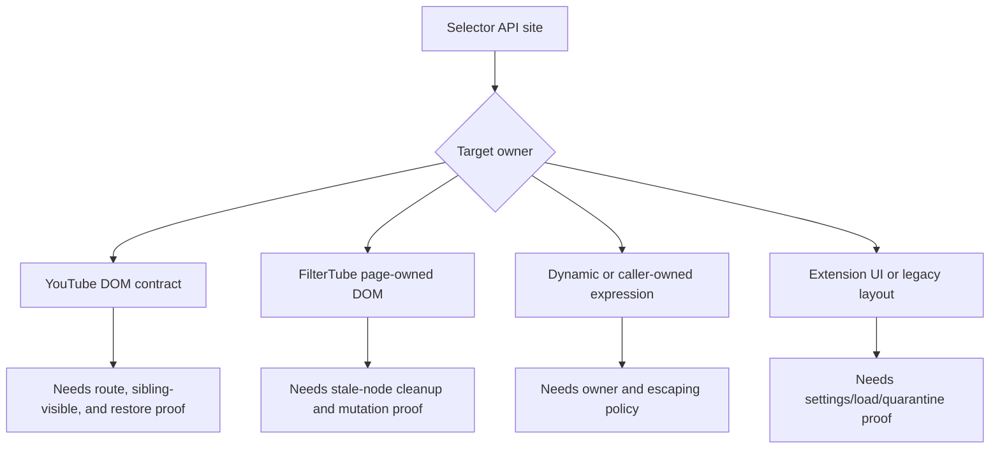
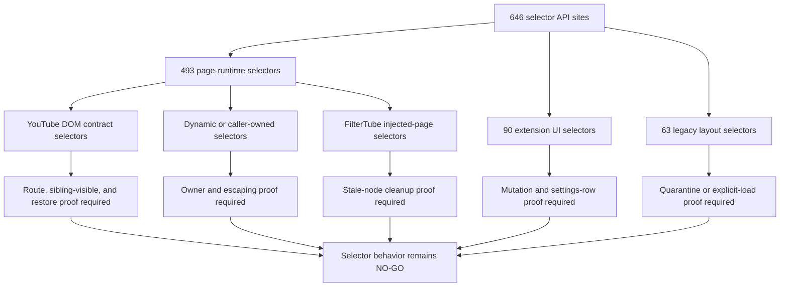

# FilterTube Selector Authority Audit - 2026-05-18

Status: current-behavior audit. This is not an implementation patch.

This slice pins the source-level DOM selector surface. It complements the
route-scope audit by counting selector API call sites in tracked product source
and by separating executable source truth from historical renderer/capture
inventories.

## Verdict

```text
Selector authority is not centralized.

Current tracked non-vendor JavaScript has 646 DOM selector API call sites
across 11 files. Page-runtime selectors dominate the total. The largest owners
are content_bridge.js, dom_fallback.js, tab-view.js, layout.js,
block_channel.js, and dom_extractors.js.

The existing selector inventory and YouTube renderer inventory are useful
evidence maps, but they are not an executable selector registry and they do not
prove route-scoped runtime behavior.
```

## Current Selector Counts

Counted APIs:

```text
querySelectorAll()
querySelector()
closest()
matches()
```

Tracked non-vendor JavaScript totals:

| Metric | Count |
| --- | ---: |
| Tracked non-vendor JS/JSX/MJS files scanned | 61 |
| Files with selector API calls | 11 |
| Total selector API call sites | 646 |
| `querySelectorAll()` call sites | 145 |
| `querySelector()` call sites | 399 |
| `closest()` call sites | 96 |
| `matches()` call sites | 6 |

Per-file selector API call sites:

| File | Total | `querySelectorAll` | `querySelector` | `closest` | `matches` | Current authority concern |
| --- | ---: | ---: | ---: | ---: | ---: | --- |
| `js/content_bridge.js` | 246 | 29 | 191 | 25 | 1 | Native menu, fallback menu, prefetch, identity, collaborator, and optimistic hide selectors share one large file. |
| `js/content/dom_fallback.js` | 161 | 39 | 92 | 30 | 0 | Main DOM fallback mixes route cleanup, comments, watch controls, members/playlist/mix hides, card scanning, and shelf cleanup. |
| `js/tab-view.js` | 68 | 27 | 30 | 11 | 0 | Extension UI settings selectors, not YouTube runtime selectors, but still part of rule mutation authority. |
| `js/layout.js` | 63 | 18 | 42 | 3 | 0 | Legacy/supporting layout code with old default-hide assumptions; keep quarantined unless explicitly loaded. |
| `js/content/block_channel.js` | 39 | 13 | 10 | 13 | 3 | Quick-block and 3-dot affordance selectors; lifecycle and action gates are split. |
| `js/content/dom_extractors.js` | 27 | 4 | 21 | 1 | 1 | Shared card/title/channel extraction and recycled-node cleanup. |
| `js/popup.js` | 16 | 6 | 4 | 6 | 0 | Extension UI, not YouTube page runtime. |
| `js/content/collab_dialog.js` | 11 | 2 | 6 | 2 | 1 | Collaborator dialog extraction and DOM metadata application. |
| `js/injector.js` | 6 | 3 | 2 | 1 | 0 | Page-world injector and JSON collaboration bridge helpers. |
| `js/ui_components.js` | 6 | 3 | 1 | 2 | 0 | Extension UI helper selectors. |
| `js/content/dom_helpers.js` | 3 | 1 | 0 | 2 | 0 | Hide/container helper selectors. |

Family totals:

| Family | Files | Selector call sites | Meaning |
| --- | --- | ---: | --- |
| Page runtime | `content_bridge`, `dom_fallback`, `block_channel`, `dom_extractors`, `collab_dialog`, `injector`, `dom_helpers` | 493 | Highest risk for YouTube lag, false hides, stale DOM state, and route drift. |
| Extension UI | `tab-view`, `popup`, `ui_components` | 90 | Lower YouTube-page risk but still important for settings mutation and list-mode behavior. |
| Legacy/supporting layout | `layout.js` | 63 | Must remain classified before any old CSS/DOM behavior is relied on. |

## Selector Target Ownership Addendum - 2026-05-27

This addendum classifies the same 646 selector API sites by current target
ownership. It is source-derived proof only; it does not approve selector
rewrites, DOM cleanup, fallback deletion, or route widening.

| Target ownership class | Sites | Static literal args | Dynamic/non-literal args | Unique static selector literals | Current interpretation |
| --- | ---: | ---: | ---: | ---: | --- |
| `youtube-dom-contract` | 251 | 244 | 7 | 178 | Selectors depend on YouTube tags, ids, Polymer/Paper/Iron shells, or YouTube page structure and require real route/sibling fixtures before edits. |
| `dynamic-or-caller-owned` | 147 | 105 | 42 | 76 | Constants, joined selector arrays, runtime id templates, or caller-provided selector variables need explicit owner and escaping proof. |
| `filtertube-page-owned` | 92 | 74 | 18 | 30 | Selectors target FilterTube-injected page DOM such as quick/menu rows or data attributes, but still need stale-node cleanup and restore proof. |
| `extension-ui-owned` | 90 | 90 | 0 | 42 | Selectors target FilterTube popup/dashboard UI, outside YouTube page runtime but inside settings mutation authority. |
| `legacy-layout-owned` | 63 | 63 | 0 | 52 | Selectors are in packaged legacy/supporting layout code and must remain quarantined unless explicit load proof says otherwise. |
| `generic-dom` | 3 | 3 | 0 | 2 | Generic selectors such as media/link primitives must be proven caller-scoped before use in page runtime changes. |

Page-runtime ownership split:

```text
page-runtime selector sites: 493
  -> YouTube DOM contract: 251
  -> dynamic/caller-owned: 147
  -> FilterTube page-owned: 92
  -> generic DOM: 3
central selector authority in product source: absent
selector ownership behavior-change approval: NO-GO
runtime behavior changed by this addendum: no
```



## Evidence Boundary

The following are evidence maps, not selector authority:

- `docs/audit/FILTERTUBE_SELECTOR_LIFECYCLE_INVENTORY_2026-05-17.md`
- `docs/youtube_renderer_inventory.md`
- `docs/json_paths_encyclopedia.md`
- ignored root capture files listed in `.gitignore`

They are still valuable because they tell us where to extract real fixtures,
but a row in those docs does not prove that:

1. the current runtime selector exists,
2. the selector is route-scoped,
3. the selector is gated by active rules,
4. the selector has a restore path,
5. the selector is safe in blocklist and whitelist modes.

## Current High-Risk Selector Families

| Family | Source | Why it matters |
| --- | --- | --- |
| Global card selector | `js/content/dom_extractors.js:10-60` | One selector string mixes Main desktop, Main mobile, YTM-style mobile, playlist, radio, watch-card, Shorts, channel, and Kids tags. |
| DOM fallback global scan | `js/content/dom_fallback.js:2325-2328` | Active DOM fallback scans `VIDEO_CARD_SELECTORS` rather than a route-scoped selector family. |
| Quick-block selector family | `js/content/block_channel.js` | Quick-block has route guards, but setup and resolver selectors remain broad and page-resident. |
| Fallback menu selectors | `js/content_bridge.js` | Fallback menu scan and row creation do not share the same list-mode/show-block gate as primary menu injection. |
| Watch/member selectors | `js/content/dom_fallback.js` | Watch metadata, selected playlist rows, members-only badge hosts, and shelf containers can become broad hide targets. |
| Legacy layout selectors | `js/layout.js` | Old default-hide style/DOM logic can mislead audits if treated as active content-page runtime. |

## Future Contract Token

```text
selectorAuthority
```

The token intentionally does not exist in product source today. It names the
missing future boundary:

```text
selectorAuthority.resolve({
  surface,
  route,
  action,
  targetKind,
  listMode,
  featureGate,
  sourceFamily,
  falseHideBoundary
})
```

## Required P0 Fixtures Before Selector Behavior Changes

```text
selector_authority_global_card_selector_split_by_surface_route_action
selector_authority_dom_fallback_no_rule_zero_card_scan
selector_authority_quick_block_disabled_zero_selector_scan
selector_authority_fallback_menu_uses_primary_menu_action_gate
selector_authority_watch_selectors_do_not_target_primary_player_shell_without_policy
selector_authority_members_only_badge_does_not_hide_watch_shell_without_fixture
selector_authority_playlist_selected_row_preserves_current_watch_card
selector_authority_kids_selectors_have_kids_surface_gate
selector_authority_ytm_selectors_are_not_claimed_for_main_release_without_fixture
selector_authority_legacy_layout_selectors_remain_quarantined_or_loaded_explicitly
selector_authority_inventory_rows_require_runtime_source_or_fixture_status
selector_authority_raw_capture_extracts_minimal_committed_dom_fixture
```

## Safe Improvement Direction

Do not start by deleting selectors. The safer path is:

1. build `selectorAuthority` records for the existing broad families,
2. attach active-rule, route, surface, and action gates,
3. prove no-rule zero-scan behavior,
4. split broad Main/mobile/Kids/YTM selector families only after fixtures exist,
5. preserve recycled-node cleanup and playlist/Mix identity guards.

## Raw Capture Note

The ignored root HTML/JSON/TXT files remain valid evidence inputs, especially
for YouTube DOM tag drift. They must stay ignored. Any selector fix should
extract the smallest representative DOM or JSON fragment into
`tests/runtime/fixtures/` with source-family metadata.

## Selector Convergence Boundary - 2026-05-30

This addendum joins the selector authority, selector instance, content bridge
selector semantics, DOM fallback selector semantics, route scope, hide/restore,
release hot-path, legacy layout, and inventory evidence-map rows into one
audit-only convergence boundary. It changes no runtime behavior and does not
approve selector rewrites, DOM fallback pruning, quick/menu selector changes,
watch-shell cleanup, legacy layout reactivation, JSON-first promotion, or
release claims.

Source inputs:

| Source input | Boundary contribution |
| --- | --- |
| `docs/audit/FILTERTUBE_DOM_SELECTOR_INSTANCE_REGISTER_2026-05-18.md` | Source-derived enumeration of all 646 current selector API sites. |
| `docs/audit/FILTERTUBE_CONTENT_BRIDGE_SELECTOR_SEMANTIC_REGISTER_2026-05-21.md` | Hot-file selector/effect grouping for `content_bridge.js`. |
| `docs/audit/FILTERTUBE_DOM_FALLBACK_SELECTOR_SEMANTIC_REGISTER_2026-05-21.md` | DOM fallback/helper selector/effect grouping and dynamic selector families. |
| `docs/audit/FILTERTUBE_DOM_ROUTE_SCOPE_AUDIT_2026-05-18.md` | Route scope proof gap for broad page selectors. |
| `docs/audit/FILTERTUBE_DOM_HIDE_SIDE_EFFECT_AUDIT_2026-05-18.md` | Hide/restore side-effect risks tied to selector targets. |
| `docs/audit/FILTERTUBE_QUICK_BLOCK_HOVER_LIFECYCLE_TIMER_BOUNDARY_CURRENT_BEHAVIOR_2026-05-23.md` | Quick-block hover/lifecycle selector work that can affect YouTube responsiveness. |
| `docs/audit/FILTERTUBE_MENU_OBSERVER_KIDS_PASSIVE_LIFECYCLE_BOUNDARY_CURRENT_BEHAVIOR_2026-05-23.md` | Native menu/dropdown selector timing and stale-node cleanup risks. |
| `docs/audit/FILTERTUBE_WATCH_PLAYER_CONTROL_AUTHORITY_AUDIT_2026-05-18.md` | Watch shell, playlist selected-row, end-screen, and fullscreen selector boundaries. |
| `docs/audit/FILTERTUBE_LEGACY_LAYOUT_QUARANTINE_PACKAGE_BOUNDARY_CURRENT_BEHAVIOR_2026-05-22.md` | Quarantine proof for packaged legacy selector logic. |
| `docs/youtube_renderer_inventory.md` | Evidence map only; does not prove executable selector behavior. |

| Convergence row | Current source-backed finding | Risk if optimized or rewritten now |
| --- | --- | --- |
| `selector_convergence_instance_census` | 646 tracked selector API sites across 11 non-vendor files, with 579 static literal argument sites and 67 dynamic expressions. | Manual selector cleanup can miss another active selector path targeting the same DOM. |
| `selector_convergence_page_runtime_dominance` | Page-runtime files own 493 selector sites, while extension UI owns 90 and legacy layout owns 63. | YouTube lag and false-hide risk mostly sit in page-runtime selectors, not dashboard selectors. |
| `selector_convergence_youtube_dom_contract` | 251 selector sites target YouTube DOM contracts and need route/sibling/restore proof before behavior changes. | A selector that works on one YouTube surface can hide or scan the wrong sibling on another surface. |
| `selector_convergence_dynamic_expression_authority` | 147 selector sites are dynamic or caller-owned; 67 current selector API calls use non-literal expressions. | Dynamic constants, joined arrays, and runtime templates need owner/escaping proof before narrowing or reuse. |
| `selector_convergence_content_bridge_hot_file` | `content_bridge.js` owns 246 selector sites across fallback menu, native menu, collaborator, identity, optimistic hide, and whitelist pending paths. | A local bridge selector edit can affect menu reliability, collaborator identity, whitelist pending-hide, and visible-card mutation together. |
| `selector_convergence_dom_fallback_hot_file` | DOM fallback/helper code owns 164 selector sites across global card scans, comments, watch controls, shelf cleanup, and restore paths. | DOM fallback pruning can leave stale hidden nodes, miss sibling-visible proof, or still pay selector traversal elsewhere. |
| `selector_convergence_quick_menu_release_hot_path` | Release hot-path proof pins 12 selector rows in `block_channel.js` and `content_bridge.js` for quick-block, native dropdown, fallback menu, and whitelist pending intake. | The exact area behind recent lag/menu regressions remains selector-sensitive and needs one action/route report before edits. |
| `selector_convergence_watch_comment_playlist_boundaries` | Watch shell, members-only, comments, playlist selected-row, and end-screen selectors are split across DOM fallback, watch/player, and route-scope audits. | Watch/player false hides and media side effects are larger than feed-card hide effects. |
| `selector_convergence_extension_ui_and_mutation` | Extension UI selectors are lower YouTube-page risk but still drive profile, list-mode, import, Nanah, and rule mutation surfaces. | Treating UI selectors as harmless can miss mutation or stale-row risks. |
| `selector_convergence_legacy_inventory_boundary` | Legacy layout owns 63 packaged selector sites, while renderer/JSON/capture inventories remain evidence maps rather than executable authority. | Old layout selectors or inventory rows can be mistaken for active, safe runtime behavior. |

```text
646 selector API sites
        |
        +--> 493 page-runtime selectors
        |       +--> YouTube DOM contract selectors
        |       +--> dynamic/caller-owned selectors
        |       +--> FilterTube injected-page selectors
        |
        +--> 90 extension UI selectors
        +--> 63 legacy layout selectors
        |
        v
NO-GO until selectorAuthority reports owner, route, target, gate,
false-hide boundary, restore owner, and fixture status
```



Current boundary status:

```text
selector convergence rows: 10
implementation-ready selector convergence rows: 0
selectorAuthority product source symbol: absent
selectorEffectReport product source symbol: absent
selectorTargetDecision product source symbol: absent
selectorRouteSurfaceAuthority product source symbol: absent
selectorRestoreAuthority product source symbol: absent
runtime behavior changed by this addendum: no
selector rewrite approval: NO-GO
DOM fallback selector pruning approval: NO-GO
quick/menu selector rewrite approval: NO-GO
watch-shell selector behavior approval: NO-GO
legacy layout selector reactivation approval: NO-GO
JSON-first selector promotion approval: NO-GO
release/public-claim use: NO-GO
```

## Method Semantic Proof Gap Boundary

`docs/audit/FILTERTUBE_METHOD_SEMANTIC_PROOF_GAP_INDEX_CURRENT_BEHAVIOR_2026-05-25.md`
is a required source input before this DOM cleanup/selector surface can support
runtime optimization. Current proof pins:

```text
method semantic proof gap files covered: 69
method semantic proof gap lexical callables covered: 5720
files with complete per-callable semantic proof: 0
lexical callables requiring semantic proof before behavior changes: 5720
affected callable semantic proof: NO-GO
runtime behavior changed: no
```

These counts are audit-only blockers. They do not approve runtime
optimization, JSON-first behavior, DOM cleanup behavior, selector lifecycle
behavior, visibility side effects, whitelist behavior, metric collectors,
artifact creation, native sync, release package changes, or public claims.
