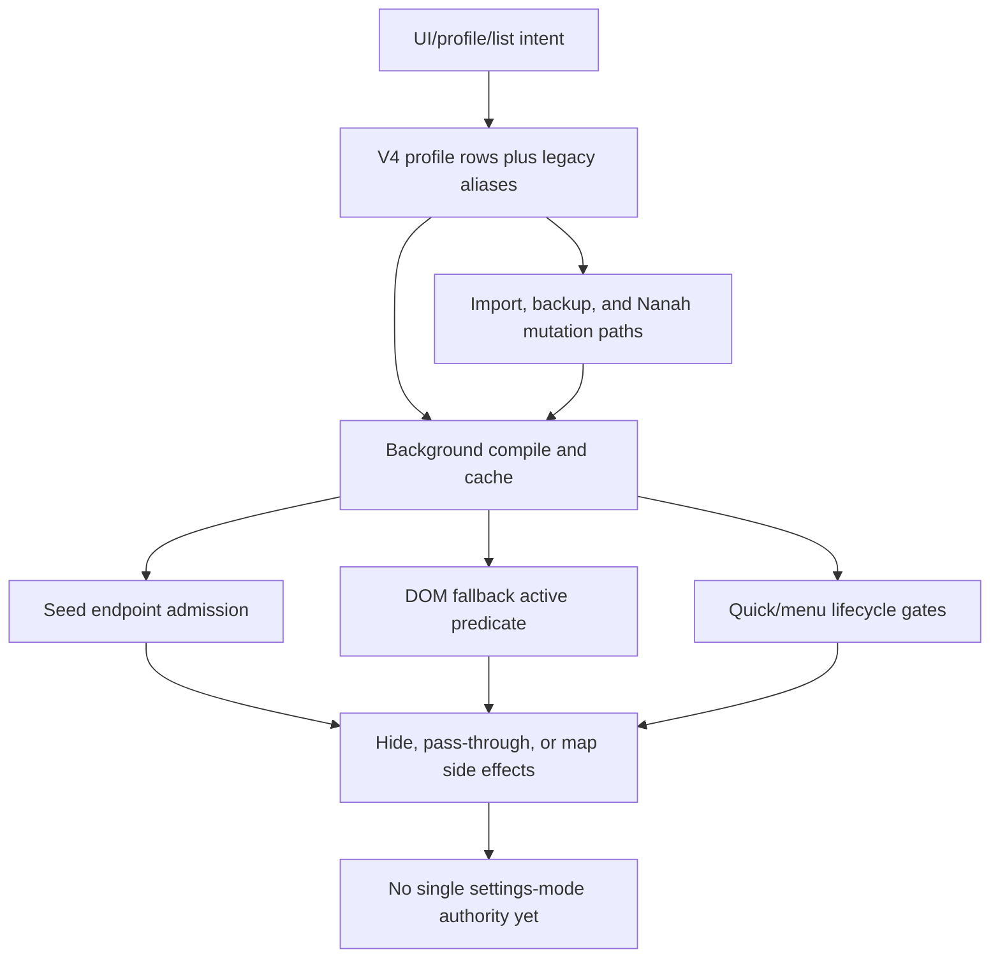

# FilterTube Settings Mode Coverage Matrix - 2026-05-18

Status: audit matrix. This is not an implementation patch.

Completion is not proven. This matrix does not say the settings-mode audit is
complete. It says which settings modes have current proof, which modes are only
partially classified, and which missing fixtures still block behavior changes.
The current state is not-ready-for-behavior-change.

The broad objective ledger tracks `every settings mode` as a required audit
term. This file expands that row so empty-install lag, false hides, whitelist
fail-closed behavior, Kids/Main separation, and future simultaneous allow/block
work are not mixed together under one vague "mode" label.

## Source Boundary

The root HTML/JSON/TXT captures listed in `.gitignore` are still evidence
inputs only. They helped build `docs/json_paths_encyclopedia.md` and
`docs/youtube_renderer_inventory.md`, but they do not prove a settings mode by
themselves. A settings-mode claim needs a committed minimal fixture under
`tests/runtime/fixtures/captures/` or a source-backed current-behavior test.

## Status Vocabulary

- `proof-started`: at least one focused audit/test pins the current behavior.
- `partial`: the mode has proof for some routes or actions, but not enough
  positive, negative, route, lifecycle, mutation, and side-effect fixtures.
- `current-gap-pinned`: the audit proves a risky current behavior that should
  not be optimized around casually.
- `not-ready-for-behavior-change`: the mode is blocked until future fixtures
  define the intended behavior.

## Settings Mode Semantic Boundary

This matrix is a coverage map, not semantic completion proof. A settings mode
row is not safe to change merely because it appears in the matrix or because a
single current-behavior fixture exists.

A settings mode is considered behavior-covered only when the audit records the
full route from user-visible intent to runtime effect:

```text
mode dimension and exact value
profile id, profile type, lock/session state, and viewing space
surface and route family
UI row source and displayed canonical lists
legacy alias fields and migration/conflict policy
storage keys read and written
background compiler source fields
compiled settings payload and cache source/revision
content bridge refresh/invalidation behavior
JSON endpoint policy and DOM fallback active predicate
menu/quick-block/native-app action gate
mutation actor, target profile, backup/revision side effect
positive fixture and negative no-rule/non-matching sibling-visible fixture
```

This boundary is especially important for the reported class where YouTube
content disappears while the visible blocklist looks empty. That class cannot be
ruled out by checking the dashboard rows alone, because current runtime behavior
can still come from stale aliases, background compilation, pushed compiled
settings, cached settings, Kids-to-Main sync, import/Nanah writes, or a
route-specific DOM/JSON predicate.

## Current Proof Artifacts

This matrix depends on the current authority audits:

- `docs/audit/FILTERTUBE_ACTIVE_RULE_AUTHORITY_AUDIT_2026-05-18.md`
- `docs/audit/FILTERTUBE_UI_ROW_LIST_MODE_AUTHORITY_AUDIT_2026-05-18.md`
- `docs/audit/FILTERTUBE_SETTINGS_MUTATION_AUTHORITY_2026-05-17.md`
- `docs/audit/FILTERTUBE_PROFILE_VIEWING_SPACE_AUTHORITY_AUDIT_2026-05-18.md`
- `docs/audit/FILTERTUBE_CONTENT_CATEGORY_PREDICATE_AUTHORITY_AUDIT_2026-05-18.md`
- `docs/audit/FILTERTUBE_KEYWORD_MATCH_AUTHORITY_AUDIT_2026-05-18.md`
- `docs/audit/FILTERTUBE_WATCH_PLAYER_CONTROL_AUTHORITY_AUDIT_2026-05-18.md`
- `docs/audit/FILTERTUBE_SECURITY_PIN_LOCK_AUTHORITY_AUDIT_2026-05-18.md`
- `docs/audit/FILTERTUBE_IMPORT_EXPORT_NANAH_AUTHORITY_AUDIT_2026-05-18.md`
- `docs/audit/FILTERTUBE_OBJECTIVE_COVERAGE_LEDGER_2026-05-18.md`

## Settings Mode Matrix

| Mode dimension | Current proof artifacts | Current status | Missing proof before completion |
| --- | --- | --- | --- |
| Extension enabled vs disabled | Empty-install, endpoint, seed-network, lifecycle, and readiness fixtures prove disabled mode still pays some endpoint interception cost before no-op decisions. | current-gap-pinned | Disabled mode needs zero parse, zero DOM scan, zero observer affordance work, zero storage writes, and no page-message side-effect fixtures on Main, Kids, YTM, watch, search, home, and Shorts. |
| Main mode: blocklist vs whitelist | Active-rule, UI row/list-mode, engine, DOM fallback, watch/player, and settings mutation audits prove blocklist and whitelist are inferred differently across JSON, DOM, UI rows, and background mode switching. | partial | Main mode needs route-scoped blocklist and whitelist fixtures for home, search, watch, playlist, channel, posts, Shorts, comments, and end-screen surfaces. |
| Kids mode: blocklist vs whitelist | Profile/viewing-space, active-rule, settings mutation, import/export/Nanah, and Kids capture traceability docs start the split, but Kids mode has less fixture proof than Main. | partial | Kids needs public Kids browse/search/watch fixtures for blocklist, explicit whitelist, empty whitelist, Kids-to-Main sync off/on, parent gate, reload, and app/native sync paths. |
| Empty blocklist | Engine proves simple JSON cards remain; endpoint and lifecycle audits prove empty blocklist is not a single no-work state because mobile browse, `/player`, `/next`, `/guide`, DOM fallback, quick block, and fallback menu can still wake work. | current-gap-pinned | Empty blocklist needs zero-work counters per route/surface and negative fixtures proving non-matching content remains visible with no YouTube-visible side effects. |
| Explicit empty whitelist | Engine and DOM fallback prove whitelist mode is fail-closed for normal cards and always active for DOM fallback. | current-gap-pinned | Empty whitelist must be explicit and confirmed in UI, import, Nanah, migration, profile switch, Kids/Main sync, and release docs before any migration or optimization relies on it. |
| Non-empty blocklist | Existing engine fixtures prove common video/comment/channel matches, but renderer gaps and DOM fallback authority are still split. | partial | Non-empty blocklist needs JSON-first direct/nested fixtures for every high-risk renderer plus DOM fallback negative sibling-visible fixtures where JSON cannot prove identity. |
| Non-empty whitelist | Existing engine and pending-whitelist audits prove fail-closed behavior and identity-pending hides, but watch rails, search RHS, Kids, YTM, and unresolved identity still need proof. | partial | Non-empty whitelist needs allow-match, unresolved identity, pending TTL, restore, watch scaffolding, and route-specific negative fixtures. |
| Main viewing allowed/denied | Profile/viewing-space audit proves allowed viewing-space fields are UI policy fields more than runtime compile enforcement today. | current-gap-pinned | Main denied needs fixtures proving Main runtime compile, navigation, mutation, quick/menu action, and import/Nanah apply are blocked or visibly gated. |
| Kids viewing allowed/denied | Profile/viewing-space and native sync audits start coverage; public Kids access has app proof elsewhere, but extension/runtime policy still needs stronger mode fixtures. | partial | Kids denied needs fixtures for Kids route entry, public Kids web access, Kids rule mutation, profile lock, and Kids-to-Main sync authority. |
| Profile type: master/account/child/managed-child | Security/PIN and profile/viewing-space audits prove split gates across UI, StateManager, background, managed-child edits, import/export, and Nanah. | partial | Each profile type needs mutation, viewing-space, list-mode, sync, export/import, quick/menu, and runtime compile fixtures. |
| Locked vs unlocked profile/session PIN | Security/PIN audit proves crypto/session gates exist but not all mutation primitives share a lock contract. | current-gap-pinned | Locked state needs negative fixtures for list-mode changes, row mutations, content-script quick/menu actions, child policy changes, imports, Nanah apply, and backup restore. |
| `syncKidsToMain` enabled/disabled | Settings-authority and profile/viewing-space audits prove Kids rules can merge into Main compiled state only under some matching mode paths, while StateManager recomputation can persist channel-derived keyword changes. | current-gap-pinned | Sync needs mode compatibility, source/action metadata, lock authority, profile authority, and non-persistence fixtures before behavior changes. |
| `showBlockMenuItem` enabled/disabled | Active-rule and content-bridge audits prove normal 3-dot menu respects the flag, while fallback menu lifecycle does not share the same gate. | current-gap-pinned | Both normal and fallback menu entry points need one action gate and zero lifecycle work when off. |
| Quick block enabled/disabled | Active-rule, lifecycle, empty-install, and block-channel audits prove quick-block rendering checks settings, but observer/listener/timer setup is broader than the visible affordance. | current-gap-pinned | Quick block needs no-observer/no-listener/no-timer fixtures when disabled, hidden by whitelist, hidden by native overlay, or route-ineligible. |
| Fallback menu enabled/disabled | Active-rule and lifecycle audits prove fallback menu scans/listeners can be active without the normal list-mode and `showBlockMenuItem` gates. | current-gap-pinned | Fallback menu needs shared action authority, list-mode gate, feature flag gate, route gate, native overlay quiet proof, and teardown/pause fixtures. |
| Content category filters enabled with selected/empty categories | Content/category predicate audit proves raw `categoryFilters.enabled` can wake work even when selected categories are empty. | current-gap-pinned | Empty selected categories must be inactive in compiled state, endpoint policy, DOM fallback, UI save, import, and Nanah apply. |
| Upload date enabled with valid/blank dates | Content/category and engine fixtures prove blank dates no-op late while raw enabled state can still wake endpoint/DOM work. | current-gap-pinned | Blank dates need inactive compiled state, UI clearing, route-scoped endpoint proof, and stale-threshold migration fixtures. |
| Duration filter enabled with meaningful/zero thresholds | Engine fixtures prove `longer` with zero threshold can hide parsed-duration videos; seed/DOM can wake on raw duration enabled. | current-gap-pinned | Zero and blank thresholds need inactive compiled state and negative false-hide fixtures across JSON and DOM. |
| Exact keyword vs substring keyword | Keyword-match audit proves JSON regex, exactness metadata, Unicode boundaries, and DOM normalized fallback do not share one authority yet. | partial | Exactness needs JSON/DOM parity, Unicode boundary, import/export/Nanah round-trip, and UI row edit fixtures. |
| Comments keyword scope vs global keyword scope | Keyword-match and watch/player audits prove serialized comment keywords can be ignored while global keywords can still affect comments. | current-gap-pinned | Comment-only and global-only policies need explicit product fixtures for JSON continuations, DOM comments, hide-all comments, and watch scaffolding. |
| Filter All channel-derived keywords | Keyword-match and settings-authority audits prove channel-derived keywords can carry source metadata and be recomputed into other surfaces. | current-gap-pinned | Channel-derived entries need source/action metadata, profile/surface scope, syncKidsToMain, import/export/Nanah, and delete/edit fixtures. |
| Shorts controls | Renderer, endpoint, DOM route-scope, and watch/player audits start coverage, but Shorts owner identity and route policy remain incomplete. | partial | Shorts needs JSON owner identity, DOM owner identity, quick/menu action, whitelist, blocklist, empty mode, and no-rule endpoint fixtures. |
| Comments controls | Watch/player and keyword-match audits cover hide-all, continuation shape gaps, and keyword/comment scope drift. | partial | Comments need append/reload/replace continuation fixtures, serialized keyword reconstruction, global-vs-comment policy, and DOM negative fixtures. |
| Watch recommendations/sidebar/player controls | Watch/player authority proves many controls are split across UI catalog, compile, seed `/next` and `/player`, JSON rules, DOM fallback, and fullscreen quiet mode. | partial | Watch needs route-scoped controls, end-screen wall proof, compact autoplay proof, player metadata-only proof, fullscreen quiet proof, and no broad player hide reliance. |
| YTM/Kids/Main surface modes | JSON/DOM inventory, capture traceability, native sync, and renderer audits prove some surface-specific fixtures exist, but not full parity. | partial | Each surface needs blocklist/whitelist/empty/disabled, route, renderer, DOM selector, menu, quick action, import/export, and release-claim fixtures. |
| Route modes: home/search/watch/shorts/comments/playlist/channel/posts | Endpoint, DOM route-scope, renderer, watch/player, and selector audits prove route behavior is split and incomplete. | partial | Every route needs positive/negative JSON, DOM, no-rule, disabled, whitelist, blocklist, and lifecycle fixtures. |
| Backup/import/Nanah apply modes | Import/export/Nanah audit proves broad mutation surfaces, target-profile drift, direct V4 writes, and runtime invalidation gaps. | partial | Apply modes need target profile/surface/list, lock, revision, backup trigger, compiled refresh, schema, and rollback fixtures. |
| Future simultaneous allow/block mode | UI row/list-mode, mutation, security, import/export/Nanah, quick/menu, and objective-ledger audits all say current either/or behavior cannot absorb simultaneous allow/block without a schema and migration contract. | not-ready-for-behavior-change | Requires canonical per-entry action schema, migration from current blocklist/whitelist users, row actions, quick/menu default actions, import/export/Nanah schema, app sync, release rollback, and UI proof. |

## Current Source Findings That Keep This Matrix Open

```text
UI intent:      copyBlocklist false/true
        |
        v
background:    shouldCopyBlocklist is read
        |
        v
mode switch:   requestedMode === whitelist
        |
        v
current code:  mergeAndClearBlocklistIntoWhitelist(requestedProfile)
               runs regardless of shouldCopyBlocklist
```

```text
settings mode
        |
        +--> seed: raw enabled category/date/duration can wake JSON work
        +--> DOM fallback: whitelist is always active; raw content flags wake scans
        +--> quick block: lifecycle installs page listeners before one shared budget exists
        +--> fallback menu: lifecycle does not share normal whitelist/showBlockMenuItem gate
        +--> background compile: Kids/Main sync and list modes are recomputed separately
```

These are current-behavior findings, not fixes. They explain why the user
symptoms can show up as "YouTube feels slower" or "content was hidden even when
my visible list looked empty."

## Future Fixture Gates

The following fixtures must exist before settings-mode behavior changes:

```text
settings_mode_disabled_extension_zero_work_all_surfaces
settings_mode_empty_blocklist_zero_work_main_home_mobile_watch
settings_mode_explicit_empty_whitelist_fail_closed_ui_confirmed
settings_mode_main_blocklist_and_kids_whitelist_independent
settings_mode_sync_kids_to_main_requires_mode_compatibility
settings_mode_locked_profile_rejects_all_rule_mutations
settings_mode_child_profile_cannot_mutate_parent_policy
settings_mode_content_enabled_empty_values_inactive
settings_mode_keyword_exactness_json_dom_parity
settings_mode_comment_keywords_do_not_leak_global_policy
settings_mode_show_block_menu_and_quick_block_zero_lifecycle_when_off
settings_mode_watch_controls_route_scoped
settings_mode_import_nanah_preserves_target_profile_and_mode
settings_mode_simultaneous_allow_block_schema_migration_gate
```

## Current Verdict

```text
Completion is not proven.
Settings mode coverage remains partial.
The settings-mode area is not-ready-for-behavior-change.
```

## Method Semantic Proof Gap Boundary

`docs/audit/FILTERTUBE_METHOD_SEMANTIC_PROOF_GAP_INDEX_CURRENT_BEHAVIOR_2026-05-25.md`
is a required source input before this list/settings-mode surface can support
runtime optimization. Current proof pins:

```text
method semantic proof gap files covered: 69
method semantic proof gap lexical callables covered: 5736
files with complete per-callable semantic proof: 0
lexical callables requiring semantic proof before behavior changes: 5736
affected callable semantic proof: NO-GO
runtime behavior changed: no
```

These counts are audit-only blockers. They do not approve runtime
optimization, JSON-first behavior, whitelist behavior, settings-mode behavior,
metric collectors, artifact creation, native sync, release package changes, or
public claims.

## Settings Mode Current-Source Convergence Boundary - 2026-05-31

This continuation joins the split settings-mode coverage rows into one
current-source convergence boundary. It is audit-only. It does not approve a
settings rewrite, list-mode migration, empty-state shortcut, lifecycle pruning,
JSON-first promotion, whitelist/cache optimization, release claim, or public
claim.

| Convergence row | Current source/evidence pins | Current proof meaning | Boundary held open |
| --- | --- | --- | --- |
| `settings_mode_dimension_inventory` | This matrix; `docs/audit/FILTERTUBE_OBJECTIVE_COVERAGE_LEDGER_2026-05-18.md`; `tests/runtime/settings-mode-coverage-matrix-current-behavior.test.mjs` | The audit names 28 mode dimensions and 14 future fixture gates, but dimensions are not behavior approvals. | Each mode still needs positive, negative, route, surface, mutation, lifecycle, and no-work proof. |
| `settings_mode_visible_alias_boundary` | `js/background.js` `getCompiledSettings`; `js/settings_shared.js` `saveSettings`; `js/state_manager.js` `saveSettings` | Current source has visible canonical rows plus legacy aliases, and background/runtime/UI writers do not collapse them into one authoritative report. | Visible UI rows alone cannot prove runtime blocklist/whitelist truth. |
| `settings_mode_list_mode_mutation_boundary` | `js/background.js` `FilterTube_SetListMode`; `docs/audit/FILTERTUBE_LIST_MODE_TRANSITION_PERSISTENCE_BOUNDARY_CURRENT_BEHAVIOR_2026-05-22.md` | List-mode transition code still carries destructive movement, cache invalidation, backup, and tab-refresh effects in one branch family. | `copyBlocklist`, rollback, revision, and actor/target proof are still required before migration work. |
| `settings_mode_endpoint_admission_boundary` | `js/seed.js` `shouldBypassYouTubeiNetworkResponse`; `js/seed.js` `shouldSkipEngineProcessing` | Network JSON work now has cheap active-work gates, but endpoint admission remains source-local instead of one shared settings-mode authority. | Disabled, empty blocklist, empty whitelist, comments, `/next`, `/player`, `/guide`, Kids, and YTM still need route counters. |
| `settings_mode_dom_fallback_predicate_boundary` | `js/content/dom_fallback.js` `hasActiveDOMFallbackWork`; `docs/audit/FILTERTUBE_DOM_FALLBACK_RUN_STATE_BOUNDARY_CURRENT_BEHAVIOR_2026-05-22.md` | DOM fallback has its own active predicate; whitelist mode and raw content-control booleans can admit work outside endpoint policy. | DOM selector pruning and whitelist pending-hide changes need independent no-work and sibling-visible proof. |
| `settings_mode_affordance_lifecycle_boundary` | `js/content/block_channel.js` `setupQuickBlockObserver`; `js/content_bridge.js` `ensureFallbackMenuButtons` | Quick-block and fallback-menu lifecycles are gated locally and not by a single settings-mode action authority. | 3-dot, quick cross, fallback popover, playlist, posts, Kids, and Shorts need shared action/lifecycle proof. |
| `settings_mode_content_predicate_boundary` | `docs/audit/FILTERTUBE_CONTENT_FILTER_FIELD_EFFECT_ROUTE_SURFACE_MATRIX_CURRENT_BEHAVIOR_2026-05-29.md`; `js/seed.js`; `js/content/dom_fallback.js` | Category/date/duration settings can differ between field availability, active-work admission, and hide decision effects. | Blank/zero/empty content-control predicates still need inactive compiled-state and false-hide proof. |
| `settings_mode_profile_sync_import_boundary` | `js/settings_shared.js` `ftProfilesV4`; `js/state_manager.js` `syncKidsToMain`; `js/io_manager.js`; `js/nanah_sync_adapter.js` | V4 profiles, Kids-to-Main sync, import, backup, and Nanah apply remain separate mutation paths. | Target profile, lock/session, list mode, backup/revision, and runtime refresh proof remain required. |
| `settings_mode_refresh_cache_boundary` | `js/content/bridge_settings.js` `scheduleSettingsRefreshFromStorage`; `js/background.js` storage/cache invalidation paths | Settings refresh can carry map-only or forced reprocess semantics, while background compile/cache invalidation has its own key set. | Cache optimization needs producer/consumer dirty-key parity and visible-card reprocess evidence per mode. |
| `settings_mode_authority_absence_boundary` | Product JS source absence for `settingsModeRuntimeAuthority`, `settingsModeEffectReport`, `listModeMutationContract`, `compiledRuleStateAuthority`, `settingsModeNoWorkBudget`, `settingsModeCrossFeatureAuthority`, and `settingsModeFixtureAuthority` | The current codebase still lacks a first-class settings-mode authority object/report. | Behavior changes remain `NO-GO` until the missing authority is replaced by fixture-backed proof or implemented deliberately. |

Current settings convergence status:

```text
settings-mode convergence rows: 10
settings-mode dimensions covered by this matrix: 28
future settings fixture gates named: 14
implementation-ready settings convergence rows: 0
first-class settings-mode runtime authority in product source: absent
runtime behavior changed by this addendum: no
settings-mode implementation approval: NO-GO
whitelist/cache optimization approval: NO-GO
JSON-first first-class promotion: NO-GO
release/public-claim use: NO-GO
```

ASCII flow:

```text
UI/profile/list intent
    |
    v
V4 profile rows + legacy aliases + import/Nanah writes
    |
    v
background compile/cache + content refresh
    |
    +--> seed endpoint admission
    +--> DOM fallback predicate
    +--> quick/menu lifecycle and action gates
    |
    v
visible hide/restore, map writes, stats, backups, release claims
```

Mermaid flow:


