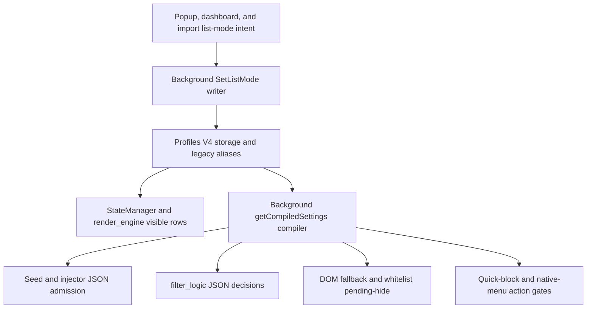
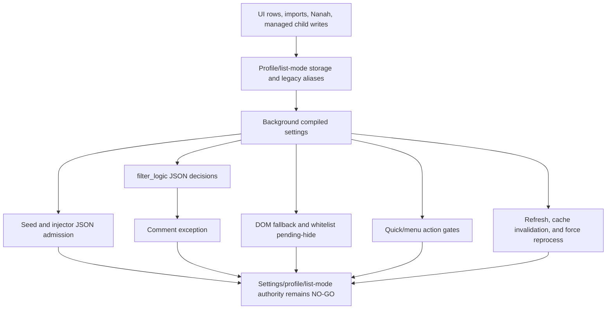

# FilterTube Settings Mode Source/Effect Current Behavior - 2026-05-20

Status: audit-only proof. Runtime behavior is unchanged.

This slice connects the identity waterfall to the settings-mode question. The
waterfall names where information can come from. Settings mode decides what that
information is allowed to do.

```text
profile + surface URL
        |
        v
background compiler chooses Main or Kids
        |
        v
profile mode chooses blocklist or whitelist
        |
        +--> source selection: canonical rows, legacy aliases, whitelist rows,
        |                     Kids rows, syncKidsToMain merges, learned maps
        |
        +--> effect semantics: block matching content, allow matching content,
                              fail closed, skip JSON mutation, rerun DOM fallback
```

The current product does not yet have one object that says:

```text
this profile/list/source produced this compiled rule and this source is allowed
to hide, allow, persist, enrich, or do no work on this route
```

## Current Source/Effect Matrix

| Area | Current behavior | Risk |
| --- | --- | --- |
| Profile source | `background.js` chooses `profileType` from explicit request, otherwise from the sender URL. | A caller and a route can disagree unless the compiled payload records sender, route, and chosen profile. |
| Main blocklist source | Runtime compile now prefers canonical `activeMain.keywords` before migration alias `activeMain.blockedKeywords` and canonical `activeMain.channels` before migration alias `activeMain.blockedChannels`. | The reported keyword/channel masking path is fixed for normal Main blocklist compilation, but import/Nanah/direct profile writes still need alias conflict-policy proof. |
| Main visible row source | `render_engine.js` renders Main blocklist rows from `state.keywords` / `state.channels`. | Visible UI can show a different source than the compiler used. |
| Shared save path | `settings_shared.js` writes canonical `main.keywords` / `main.channels` and mirrors `main.blockedKeywords` / `main.blockedChannels` when Main is in blocklist mode. | Normal settings saves now refresh Main blocklist aliases; direct mutation paths still need one schema authority. |
| Whitelist source | Runtime compiles `whitelistKeywords` / `whitelistChannels` separately and uses them when `listMode === 'whitelist'`. | Whitelist rows are a distinct source, not a modifier on blocklist rows. |
| Whitelist effect | JSON and DOM fallback are fail-closed: no whitelist rules, unresolved identity, or no match can hide content. | Empty whitelist is intentionally active, while empty blocklist is intended no-rule. They cannot share one "empty list" optimization. |
| Comment effect | JSON filtering skips the whitelist branch for comment renderers, so compiled blocklist keyword/channel rules can still matter on comment surfaces. | A mode cleanup must prove comment behavior separately from video/card behavior. |
| Seed no-work effect | Search/channel JSON fast-skip is only retained when mode is not whitelist and there are no active JSON/content/category rules. | Whitelist mode can still parse/process large payloads even when the visible whitelist is empty, because empty whitelist is an active fail-closed policy. |
| Kids mode | Kids blocklist uses `activeKids.blockedKeywords` / `activeKids.blockedChannels`; Kids whitelist uses `activeKids.whitelistKeywords` / `activeKids.whitelistChannels`. | Main/Kids mode parity needs separate fixtures because Main has legacy canonical aliases while Kids already names blocked lists explicitly. |
| `syncKidsToMain` | Main compilation can merge Kids blocklist rows into Main when both modes are blocklist, or merge Kids whitelist rows when both modes are whitelist. | Cross-profile rules can appear in Main runtime without being visually obvious in the Main row list. |

## Release Hot-Path Settings-Mode Addendum - 2026-05-27

This addendum records the settings-mode source/effect rows touched by the
release lag, visible blocklist, whitelist pending-hide, quick-block, and
native-menu stabilization work. It is audit-only. It does not approve a broader
settings-mode rewrite, simultaneous allow/block mode, JSON-first promotion, or
new whitelist semantics.

| Settings-mode row | Source pins | Mode/effect contract | Release risk controlled |
| --- | --- | --- | --- |
| `release_settings_main_keyword_alias_precedence` | `js/background.js:2391-2398` | Main blocklist compilation reads canonical `activeMain.keywords` before legacy `activeMain.blockedKeywords`; Kids still reads `activeKids.blockedKeywords`. | Popup-visible Main keywords such as `shakira` cannot be masked by a stale empty alias during normal background compilation. |
| `release_settings_main_save_alias_mirror` | `js/settings_shared.js:918-927` | Normal Main settings saves persist canonical `main.channels`/`main.keywords` and mirror `main.blockedChannels`/`main.blockedKeywords` only while Main is in blocklist mode. | Keeps dashboard/popup saves aligned with compiler aliases without moving whitelist rows into blocklist rows. |
| `release_settings_seed_json_no_work_gate` | `js/seed.js:234-260` | Disabled/missing/no-active-json blocklist settings bypass fetch/XHR clone/parse/replay; whitelist mode remains active JSON work. | Empty blocklist installs avoid JSON overhead while empty whitelist remains fail-closed instead of being optimized away. |
| `release_settings_injector_json_no_work_gate` | `js/injector.js:185-188` | MAIN-world injector uses the same `enabled:false`, whitelist-active, and active-JSON-rule predicate. | Prevents page-world JSON processing from diverging from the seed transport gate. |
| `release_settings_main_world_runtime_gate` | `js/content_bridge.js:1057-1063` | MAIN-world runtime injection is disabled for no-work blocklist settings but active for whitelist, content filters, category filters, and JSON rules. | Reduces empty SPA work without losing whitelist or rule-bearing JSON behavior. |
| `release_settings_storage_force_reprocess_upgrade` | `js/content/bridge_settings.js:1019-1044` | A pending map-only refresh is upgraded when a later settings/profile/list mutation requires `forceReprocess:true`. | Already-rendered cards are reprocessed after blocklist/whitelist changes instead of waiting for another user interaction. |
| `release_settings_whitelist_pending_admission_gate` | `js/content_bridge.js:6233-6275` | Pending-hide queue rejects overlay quiet mode, non-whitelist mode, excluded routes, and over-limit queues before selector traversal and timer arming. | Keeps whitelist fail-closed repair available without making blocklist/empty routes pay nested selector costs. |
| `release_settings_quick_block_blocklist_only` | `js/content/block_channel.js:1212-1225` | Quick-block affordances require enabled settings, `showQuickBlockButton === true`, and non-whitelist mode. | Preserves blocklist quick-add creation while avoiding whitelist-mode block affordances. |
| `release_settings_dom_fallback_whitelist_active` | `js/content/dom_fallback.js:2117-2122` | DOM fallback treats whitelist mode as active work even when allow lists are empty. | Prevents empty whitelist from sharing empty-blocklist no-work semantics. |

Current release hot-path status:

```text
release settings-mode semantic rows: 9
unified settingsModeSourceEffectAuthority in product source: absent
settings-mode rewrite approval from this addendum: NO-GO
runtime behavior changed by this addendum: no
```

## List-Mode Owner Flow Addendum - 2026-05-27

This addendum answers the release question "where did list-mode behavior
change, and which layer owns the next optimization gate?" It is audit-only.
It does not approve a settings rewrite, alias cleanup, simultaneous allow/block
mode, or first-class JSON promotion.

```text
popup / dashboard / import intent
        |
        v
background mode transition writer
        |
        v
V4 profile storage + legacy alias mirror
        |
        +--> StateManager + render_engine visible rows
        |
        +--> background compiled settings cache
                 |
                 +--> seed/injector JSON admission
                 +--> filter_logic JSON decisions
                 +--> DOM fallback and whitelist pending-hide
                 +--> quick-block and native-menu action gates
```



| Owner row | Source pins | Current contract | Optimization risk controlled |
| --- | --- | --- | --- |
| `list_mode_ui_intent` | `js/popup.js:816-860`; `js/tab-view.js:5350-5362`; `js/tab-view.js:11388-11478` | Popup/dashboard/import compute the target mode, ask copy/transfer questions, and send `FilterTube_SetListMode`; managed-child dashboard state can mutate the target surface locally. | User-visible "copy blocklist into whitelist" intent is not the same authority as the background transition writer. |
| `list_mode_transition_writer` | `js/background.js:3629-3837` | Background accepts trusted UI senders, reads `copyBlocklist`, writes Main/Kids mode, merges blocklist rows into whitelist whenever `requestedMode === 'whitelist'`, clears Main legacy aliases/storage lists on Main whitelist transition, invalidates both compiled caches, schedules backup, and refreshes matching tabs. | Mode transition semantics and cache invalidation are centralized, but `copyBlocklist` still needs conflict-policy proof before transition cleanup. |
| `list_mode_visible_row_owner` | `js/state_manager.js:315-348`; `js/render_engine.js:189-224`; `js/render_engine.js:572-604` | StateManager hydrates Main mode and canonical/legacy rows; render_engine chooses visible keyword/channel rows by profile, mode, and `syncKidsToMain`. | Visible dashboard rows can diverge from compiled runtime rows unless the compiler emits the same source report. |
| `list_mode_import_alias_owner` | `js/io_manager.js:848-863` | Import/export normalization mirrors `channels`/`keywords` into `blocked*` aliases only in blocklist mode and clears `blocked*` aliases in whitelist mode. | External import and Nanah paths cannot be optimized with UI-only assumptions. |
| `list_mode_compile_owner` | `js/background.js:2292-2356`; `js/background.js:2390-2410`; `js/background.js:2546-2558` | Background compiles `profileType`, `listMode`, whitelist allow sources, and blocklist canonical-then-alias sources, with Kids-to-Main merge only when modes match. | Runtime block/allow behavior depends on compiled source selection, not only stored UI rows. |
| `list_mode_transport_gate_owner` | `js/seed.js:220-260`; `js/injector.js:171-188` | Seed/injector skip JSON clone/parse/replay when disabled or empty blocklist has no active JSON/content work; whitelist mode remains active work. | Empty blocklist no-work and empty whitelist fail-closed behavior must remain separate. |
| `list_mode_json_decision_owner` | `js/filter_logic.js:1868-2249` | JSON decisions run whitelist fail-closed logic for non-comment renderers before blocklist channel/keyword rules; comment renderers use a separate comment branch. | JSON-first promotion must not collapse comments, watch scaffolding, allow matches, unresolved identity, and blocklist matches into one mode check. |
| `list_mode_dom_action_owner` | `js/content/dom_fallback.js:2117-2183`; `js/content/dom_fallback.js:2219-2273`; `js/content_bridge.js:6233-6285`; `js/content/block_channel.js:1212-1229`; `js/content_bridge.js:10738-10750` | DOM fallback treats whitelist mode as active, skips no-work blocklist scans after stale cleanup, gates whitelist pending-hide before selector traversal, and hides quick/native block actions in whitelist mode. | DOM and action surfaces must stay low-work in no-rule blocklist mode without weakening whitelist pending-hide or blocklist quick actions. |

Current owner-flow status:

```text
list-mode owner flow rows: 8
ASCII list-mode owner flow diagram: present
Mermaid list-mode owner flow diagram: present
settings-mode owner-flow source proof: PARTIAL
settings-mode optimization approval from owner flow: NO-GO
runtime behavior changed by this addendum: no
```

## Why This Matters

The identity waterfall is not enough to make a hide decision. A UC id from JSON,
a name from DOM, or a `videoId -> channelId` learned map must be evaluated under
the active mode:

```text
blocklist mode:
  match a blocked rule -> hide
  no matching blocked rule -> show
  no visible rules -> should be no-rule, except stale aliases can still compile

whitelist mode:
  match an allow rule -> show
  no allow rules -> hide
  unresolved identity on many surfaces -> hide or pending-hide
```

That means optimizations must not treat "empty list" as one universal no-work
state. Empty blocklist and empty whitelist have opposite meanings.

## Current False-Hide / Lag Connections

1. **Visible-empty runtime-active**: Main blocklist rows can be empty while stale
   `blocked*` aliases compile active rules.
2. **Whitelist fail-closed**: unresolved cards can be hidden before full identity
   arrives.
3. **Mode-specific endpoint cost**: blocklist no-rule search/channel payloads can
   skip JSON mutation, but whitelist mode cannot use that same fast path today.
4. **Cross-profile merge**: `syncKidsToMain` can make Kids rules affect Main when
   modes match.
5. **Comment exception**: comment renderers need separate proof because they do
   not follow the same whitelist branch as normal video cards.

## Required Future Authority

Before fixing stale aliases, introducing simultaneous allow/block rules, pruning
JSON/DOM work, or changing whitelist behavior, the compiler needs one
source/effect report:

```text
settingsModeSourceEffectAuthority {
  profileId,
  profileType,
  routeSurface,
  senderClass,
  listMode,
  visibleKeywordSource,
  visibleChannelSource,
  blockKeywordSource,
  blockChannelSource,
  allowKeywordSource,
  allowChannelSource,
  syncKidsToMainApplied,
  legacyAliasConflict,
  compiledBlockKeywordCount,
  compiledBlockChannelCount,
  compiledAllowKeywordCount,
  compiledAllowChannelCount,
  emptyPolicy,
  commentPolicy,
  jsonEndpointPolicy,
  domFallbackPolicy,
  allowedEffects,
  decision
}
```

Minimum future fixtures:

1. Empty visible Main blocklist with stale aliases reports conflict before hiding.
2. Empty Main blocklist without aliases compiles zero block rules and skips
   nonessential endpoint/DOM work.
3. Empty whitelist remains an explicit fail-closed policy and does not reuse the
   empty-blocklist no-work path.
4. Whitelist allow rules prove positive allow and negative hide behavior per
   route and renderer family.
5. Comments prove their separate behavior under whitelist mode.
6. `syncKidsToMain` merges are visible, attributed, and reversible.
7. Quick block, fallback menu, imports, Nanah apply, profile switching, and
   native sync cannot recreate hidden alias authority.

## Settings/Profile/List-Mode Convergence Boundary - 2026-05-30

This addendum joins the settings-mode, profile/list-mode, mode/surface,
compiled settings, content-control, list-mode, and refresh evidence into one
audit-only convergence boundary. It does not change runtime behavior and does
not approve a settings rewrite, alias cleanup, whitelist/cache optimization,
JSON-first promotion, simultaneous allow/block mode, or release claim.

Source inputs:

| Source input | Boundary contribution |
| --- | --- |
| `docs/audit/FILTERTUBE_SETTINGS_MODE_COVERAGE_MATRIX_2026-05-18.md` | Enumerates mode dimensions and missing proof before completion. |
| `docs/audit/FILTERTUBE_MODE_SURFACE_EFFECT_MATRIX_CURRENT_BEHAVIOR_2026-05-20.md` | Separates source availability from allowed effects. |
| `docs/audit/FILTERTUBE_COMPILED_SETTINGS_PROFILE_LIST_MODE_ASSEMBLY_BOUNDARY_CURRENT_BEHAVIOR_2026-05-23.md` | Pins compiler profile/list-mode assembly and Kids/Main merge behavior. |
| `docs/audit/FILTERTUBE_JSON_FIRST_LIST_MODE_MATRIX_BOUNDARY_CURRENT_BEHAVIOR_2026-05-22.md` | Pins blocklist versus whitelist runtime invariants across JSON/DOM consumers. |
| `docs/audit/FILTERTUBE_CONTENT_CONTROL_ACTIVE_WORK_MATRIX_CURRENT_BEHAVIOR_2026-05-22.md` | Shows content controls can create active work without keyword/channel rows. |
| `docs/audit/FILTERTUBE_ENABLED_MASTER_SWITCH_DISABLED_RUNTIME_BOUNDARY_CURRENT_BEHAVIOR_2026-05-22.md` | Keeps disabled runtime behavior separate from empty list behavior. |
| `docs/audit/FILTERTUBE_SETTINGS_REFRESH_KEY_PARITY_REGISTER_CURRENT_BEHAVIOR_2026-05-22.md` | Names the dirty-key parity gap between producers and consumers. |
| `docs/audit/FILTERTUBE_SETTINGS_REFRESH_CROSS_CONTEXT_CONSUMER_BOUNDARY_CURRENT_BEHAVIOR_2026-05-23.md` | Pins cross-context refresh consumers that can rerun JSON/DOM/menu work. |
| `docs/audit/FILTERTUBE_SETTINGS_REFRESH_OPTIMIZATION_READINESS_BOUNDARY_CURRENT_BEHAVIOR_2026-05-29.md` | Blocks refresh pruning without producer/consumer evidence packets. |
| `docs/audit/FILTERTUBE_RULE_MUTATION_ENTRYPOINT_AUTHORITY_AUDIT_2026-05-18.md` | Shows rule writers still lack one profile/list target report. |

| Convergence row | Current source-backed finding | Risk if optimized or rewritten now |
| --- | --- | --- |
| `settings_convergence_visible_rows_vs_compile_sources` | Dashboard/popup rows can come from canonical Main lists while background compile can still consider aliases or synced Kids rows. | Visible-empty UI could be mistaken for runtime-inactive state. |
| `settings_convergence_empty_policy_split` | Empty blocklist is a no-rule candidate; empty whitelist is active fail-closed policy. | A single "empty list" shortcut can either leak blocked content or false-hide all cards. |
| `settings_convergence_profile_surface_selection` | Background, bridge, Kids host normalization, and content runtime can each infer Main/Kids profile from different inputs. | Main/Kids behavior can drift across storage, compiled settings, JSON transport, and DOM fallback. |
| `settings_convergence_sync_kids_to_main_merge` | `syncKidsToMain` can merge Kids rows into Main only when list modes match, including whitelist rows. | Runtime rules can appear in Main without a visible Main row unless attribution is reported. |
| `settings_convergence_list_mode_transition_storage` | `FilterTube_SetListMode`, imports, Nanah apply, shared saves, and managed-child writes all touch list-mode storage differently. | Alias cleanup or simultaneous allow/block migration can silently change target profile/list semantics. |
| `settings_convergence_transport_json_admission` | Seed and injector skip JSON work for disabled/no-rule blocklist states but keep whitelist and content-control work active. | JSON-first no-work promotion can break fail-closed whitelist or leave lag work unmeasured. |
| `settings_convergence_json_decision_comment_exception` | JSON whitelist behavior is fail-closed for normal cards, while comment renderers follow separate comment keyword/channel logic. | Video-card parity proof does not prove comments, continuation comments, or comment-scope rules. |
| `settings_convergence_dom_pending_action_admission` | DOM fallback treats whitelist as active, pending-hide gates before selector traversal, and quick/menu block actions are mode-gated locally. | Removing DOM/action work from one gate can break whitelist pending-hide or blocklist quick/menu behavior. |
| `settings_convergence_content_control_active_work` | Duration, upload date, category, uppercase, comments, Shorts, watch, playlist, and shell flags can wake work without row rules. | Empty blocklist optimization can still miss active content-control work. |
| `settings_convergence_refresh_revision_fanout` | Storage listeners, compiled caches, bridge refresh, background broadcasts, StateManager reload, and map-only refresh coalescing lack one revisioned dirty-key report. | Cache pruning can keep stale rules visible or skip forced reprocessing after a real mode/rule change. |

```text
UI rows / imports / Nanah / managed child writes
        |
        v
profile + list-mode storage + legacy aliases
        |
        v
background compiled settings
        |
        +--> seed/injector JSON admission
        +--> filter_logic JSON decisions and comment exception
        +--> DOM fallback / whitelist pending-hide / quick-menu gates
        +--> settings refresh, cache invalidation, and force reprocess
        |
        v
NO-GO until one settingsModeSourceEffectAuthority report exists
```



Current boundary status:

```text
settings/profile/list-mode convergence rows: 10
implementation-ready settings/profile/list-mode convergence rows: 0
settingsModeSourceEffectAuthority product source symbol: absent
settingsSourceEffectDecision product source symbol: absent
modeSurfaceEffectAuthority product source symbol: absent
runtime behavior changed by this addendum: no
settings-mode implementation approval: NO-GO
settings-mode alias cleanup approval: NO-GO
settings-mode simultaneous allow/block approval: NO-GO
settings-mode whitelist/cache optimization approval: NO-GO
settings-mode JSON-first promotion approval: NO-GO
settings-mode refresh pruning approval: NO-GO
release/public-claim use: NO-GO
```

## Executable Proof

Current behavior is pinned by:

```bash
node --test tests/runtime/settings-mode-source-effect-current-behavior.test.mjs
```

## Method Semantic Proof Gap Boundary

`docs/audit/FILTERTUBE_METHOD_SEMANTIC_PROOF_GAP_INDEX_CURRENT_BEHAVIOR_2026-05-25.md`
is a required source input before this list/settings-mode surface can support
runtime optimization. Current proof pins:

```text
method semantic proof gap files covered: 69
method semantic proof gap lexical callables covered: 5836
files with complete per-callable semantic proof: 0
lexical callables requiring semantic proof before behavior changes: 5836
affected callable semantic proof: NO-GO
runtime behavior changed: no
```

These counts are audit-only blockers. They do not approve runtime
optimization, JSON-first behavior, whitelist behavior, settings-mode behavior,
metric collectors, artifact creation, native sync, release package changes, or
public claims.
