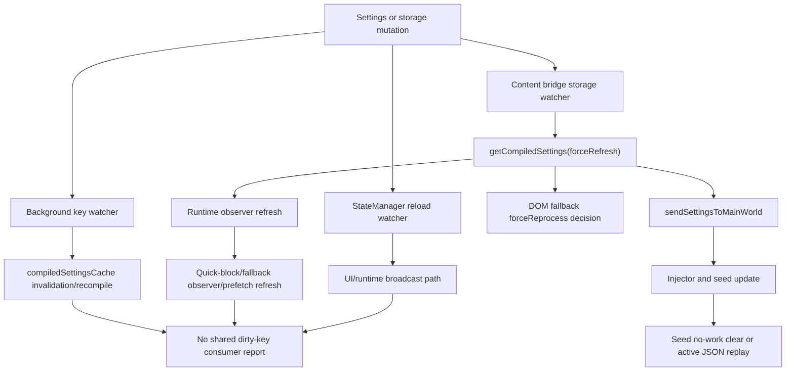

# FilterTube Settings Refresh Dirty-Key Consumer Matrix - Current Behavior - 2026-05-29

Status: audit-only current-behavior settings refresh dirty-key consumer
matrix. Runtime behavior is unchanged. This is not a settings refactor,
storage-key refactor, cache optimization, JSON-first patch, DOM fallback patch,
whitelist optimization, release package patch, public-claim patch, or
first-class settings refresh authority.

## Purpose

The lag investigation showed that a settings refresh can be more expensive than
the changed key suggests. This slice records the current dirty-key to consumer
fanout before any optimization: UI/settings writes, storage changes, background
cache invalidation, content bridge refresh, seed replay, DOM fallback, runtime
observer refresh, quick-block/menu lifecycle, and StateManager refresh do not
share one revisioned no-op report.

Current answer:

```text
settings refresh dirty-key consumer matrix rows: 13
settings refresh consumer work families covered: 7
dirty-key special cases covered: 3
runtime dirty-key authority approvals: 0
settings refresh dirty-key consumer matrix approval: NO-GO
runtime behavior changed: no
```

## Source Inputs

| Input | Current proof used |
| --- | --- |
| `docs/audit/FILTERTUBE_SETTINGS_REFRESH_FANOUT_CURRENT_BEHAVIOR_2026-05-19.md` | Records refresh entrances, storage coalescing, seed delivery, and missing revision/no-op authority. |
| `docs/audit/FILTERTUBE_SETTINGS_REFRESH_KEY_PARITY_REGISTER_CURRENT_BEHAVIOR_2026-05-22.md` | Records the current key sets and key-list drift across background, shared settings, content bridge, and StateManager. |
| `docs/audit/FILTERTUBE_SETTINGS_REFRESH_CROSS_CONTEXT_CONSUMER_BOUNDARY_CURRENT_BEHAVIOR_2026-05-23.md` | Records background, bridge, injector, seed, DOM fallback, and filter logic consumer fanout. |
| `docs/audit/FILTERTUBE_SEED_SETTINGS_REPLAY_PROVENANCE_BOUNDARY_CURRENT_BEHAVIOR_2026-05-23.md` | Records seed queued-data and raw-snapshot replay behavior without revision or dirty-key proof. |
| `docs/audit/FILTERTUBE_CONTENT_FILTER_ROUTE_SURFACE_NO_WORK_BUDGET_CURRENT_BEHAVIOR_2026-05-29.md` | Records current no-work gates and why broad route/surface optimization remains blocked. |
| `docs/audit/FILTERTUBE_OPTIMIZATION_STOP_GO_DECISION_RECORD_CURRENT_BEHAVIOR_2026-05-24.md` | Keeps stop-now whitelist optimization and JSON-first promotion at NO-GO while the audit continues. |

## Current Flow

ASCII flow:

```text
settings/storage/UI mutation
  -> split key owners decide independently
  -> background cache may invalidate and recompile
  -> content bridge may force-refresh compiled settings
  -> sendSettingsToMainWorld posts to injector and seed
  -> seed clears or replays queued/raw snapshots based on active JSON work
  -> DOM fallback may force reprocess visible cards
  -> runtime observers, quick-block, fallback observer, and prefetch can refresh
  -> no shared dirty-key consumer report exists
```

Mermaid flow:



## Matrix Rows

| Row | Current owner | Current behavior | Missing proof before optimization |
| --- | --- | --- | --- |
| `FT-SRDK-00-scope` | Audit gate | Binds storage/UI/profile mutations to background, content bridge, seed, DOM, observer, and StateManager consumers. | One revisioned dirty-key consumer report with no-op proof. |
| `FT-SRDK-01-ui-pushed-settings` | `js/background.js`, `js/content/bridge_settings.js` | UI-pushed `FilterTube_ApplySettings` invalidates one profile cache, recompiles with `forceRefresh:true`, broadcasts compiled settings to matching tabs, then bridge can push settings and force DOM fallback. | Sender class, changed-key set, profile target, and consumer-specific work decision. |
| `FT-SRDK-02-background-storage-invalidation` | `js/background.js` | Background storage listener watches a shorter key list, clears both profile caches, and recompiles both profiles without broadcasting. | Shared key manifest and cache revision proof across profiles. |
| `FT-SRDK-03-bridge-channel-map-only` | `js/content/bridge_settings.js` | A single `channelMap` storage change returns before background settings pull, seed delivery, DOM fallback, and observer refresh. | Proof that no visible channel-match decision depends on immediate `channelMap` refresh. |
| `FT-SRDK-04-bridge-video-map-only` | `js/content/bridge_settings.js` | Single `videoChannelMap` or `videoMetaMap` change still pulls compiled settings with `forceRefresh:true`, sends settings to main world, refreshes observers, but applies DOM fallback with `forceReprocess:false`. | Map-only consumer budget and stale visible-card proof. |
| `FT-SRDK-05-bridge-rule-or-ui-key` | `js/content/bridge_settings.js` | Any relevant non-map key schedules a forced background pull and DOM fallback `forceReprocess:true`; coalescing preserves pending forced reprocess. | Dirty-key to JSON/DOM/menu/quick/prefetch consumer matrix. |
| `FT-SRDK-06-runtime-refreshnow` | `js/content/bridge_settings.js` | `FilterTube_RefreshNow` pulls settings and forces DOM fallback reprocess without a changed-key payload. | Background mutation payload with changed keys and no-op reason. |
| `FT-SRDK-07-runtime-applysettings` | `js/content/bridge_settings.js` | Runtime `FilterTube_ApplySettings` normalizes settings, posts to main world, updates seed, refreshes observers, and forces DOM fallback. Profile mismatch pulls from background first. | Profile-scoped revision and consumer report. |
| `FT-SRDK-08-main-world-delivery` | `js/content/bridge_settings.js` | `sendSettingsToMainWorld()` always posts `FilterTube_SettingsToInjector`, tries seed update, starts a 250 ms retry loop when seed is not ready, and refreshes runtime observers. | Main-world capability gate and seed retry budget per dirty-key class. |
| `FT-SRDK-09-seed-no-json-work` | `js/seed.js` | `updateSettings()` clears queued seed data and raw snapshots when `hasNetworkJsonWork()` is false. | Revision proof that clearing snapshots cannot suppress needed later replay. |
| `FT-SRDK-10-seed-active-json-work` | `js/seed.js` | Active JSON work drains queued data and can reprocess stored `ytInitialData` and `ytInitialPlayerResponse` snapshots through installed setters. | Duplicate delivery/no-op replay policy and raw snapshot provenance. |
| `FT-SRDK-11-runtime-observer-refresh` | `js/content/bridge_settings.js` | Observer refresh can call `refreshFilterTubeRuntimeObservers`, `FilterTube_refreshRuntimeObservers`, quick-block availability refresh, DOM fallback observer refresh, and prefetch scan. | Per-consumer no-work counters and lifecycle budget. |
| `FT-SRDK-12-state-manager-refresh` | `js/state_manager.js` | `requestRefresh()` asks background for compiled settings with `forceRefresh:true` and broadcasts the result through `FilterTube_ApplySettings`. | UI/settings write revision, dirty-key, no-op, and tab-target report. |

## Dirty-Key Consumer Chain Closure

This closure table proves the audit chain is structurally complete from each
dirty-key consumer row to its source input family and current missing proof. It
is not a revisioned dirty-key report and does not create cache, no-op, DOM,
seed, observer, whitelist, JSON-first, or release authority.

Current consumer-closure answer:

```text
settings refresh dirty-key consumer closure rows: 13
consumer matrix rows linked by closure: 13
consumer work families linked by closure: 7
dirty-key special cases linked by closure: 3
source input families linked by consumer closure: 6
runtime dirty-key consumer closure approvals: 0
implementation-ready dirty-key consumer rows: 0
settings refresh dirty-key consumer closure: CONSUMER-CHAIN-CLOSED
settings refresh consumer implementation readiness from closure: NO-GO
runtime behavior changed: no
```

Consumer closure rows:

| Closure row | Consumer row | Source input family | Current state |
| --- | --- | --- | --- |
| `FT-SRDK-CLOSURE-00-scope` | `FT-SRDK-00-scope` | Settings refresh fanout, key parity, cross-context consumer, seed replay, no-work budget, and stop/go docs. | Chain linked; revisioned dirty-key consumer report absent. |
| `FT-SRDK-CLOSURE-01-ui-pushed-settings` | `FT-SRDK-01-ui-pushed-settings` | Settings refresh fanout and cross-context consumer docs. | Chain linked; sender class, changed-key set, profile target, and work decision missing. |
| `FT-SRDK-CLOSURE-02-background-storage-invalidation` | `FT-SRDK-02-background-storage-invalidation` | Settings refresh fanout and key parity docs. | Chain linked; shared key manifest and compiled-cache revision proof missing. |
| `FT-SRDK-CLOSURE-03-bridge-channel-map-only` | `FT-SRDK-03-bridge-channel-map-only` | Key parity, cross-context consumer, and no-work budget docs. | Chain linked; visible channel-match immediate-refresh proof missing. |
| `FT-SRDK-CLOSURE-04-bridge-video-map-only` | `FT-SRDK-04-bridge-video-map-only` | Key parity, cross-context consumer, and no-work budget docs. | Chain linked; stale visible-card proof and map-only consumer budget missing. |
| `FT-SRDK-CLOSURE-05-bridge-rule-or-ui-key` | `FT-SRDK-05-bridge-rule-or-ui-key` | Settings refresh fanout, key parity, and cross-context consumer docs. | Chain linked; dirty-key to JSON/DOM/menu/quick/prefetch consumer matrix missing. |
| `FT-SRDK-CLOSURE-06-runtime-refreshnow` | `FT-SRDK-06-runtime-refreshnow` | Settings refresh fanout and cross-context consumer docs. | Chain linked; changed-key payload and no-op reason missing. |
| `FT-SRDK-CLOSURE-07-runtime-applysettings` | `FT-SRDK-07-runtime-applysettings` | Settings refresh fanout and cross-context consumer docs. | Chain linked; profile-scoped revision and consumer report missing. |
| `FT-SRDK-CLOSURE-08-main-world-delivery` | `FT-SRDK-08-main-world-delivery` | Cross-context consumer and seed replay provenance docs. | Chain linked; main-world capability gate and seed retry budget missing. |
| `FT-SRDK-CLOSURE-09-seed-no-json-work` | `FT-SRDK-09-seed-no-json-work` | Seed replay provenance and no-work budget docs. | Chain linked; snapshot-clear revision proof missing. |
| `FT-SRDK-CLOSURE-10-seed-active-json-work` | `FT-SRDK-10-seed-active-json-work` | Seed replay provenance and no-work budget docs. | Chain linked; duplicate replay/no-op policy and raw snapshot provenance missing. |
| `FT-SRDK-CLOSURE-11-runtime-observer-refresh` | `FT-SRDK-11-runtime-observer-refresh` | Cross-context consumer and no-work budget docs. | Chain linked; per-consumer no-work counters and lifecycle budget missing. |
| `FT-SRDK-CLOSURE-12-state-manager-refresh` | `FT-SRDK-12-state-manager-refresh` | Settings refresh fanout and key parity docs. | Chain linked; UI/settings write revision, dirty-key, no-op, and tab-target report missing. |

Consumer closure decision:

```text
close settings refresh dirty-key consumer documentation chain now: GO
accept consumer closure as dirty-key consumer authority now: NO-GO
accept consumer closure as compiled-cache revision authority now: NO-GO
accept consumer closure as settings no-op refresh authority now: NO-GO
accept consumer closure as seed replay budget evidence now: NO-GO
accept consumer closure as DOM fallback budget evidence now: NO-GO
accept consumer closure as observer/menu/quick budget evidence now: NO-GO
accept consumer closure as whitelist optimization approval now: NO-GO
accept consumer closure as JSON-first promotion approval now: NO-GO
accept consumer closure as release/public-claim approval now: NO-GO
continue proof-backed audit: GO
```

## Current Decision

```text
define settings refresh dirty-key consumer matrix: GO
approve settings refresh dirty-key authority now: NO-GO
approve compiled-cache revision authority now: NO-GO
approve settings no-op refresh authority now: NO-GO
approve broad whitelist optimization from current settings refresh gates: NO-GO
approve JSON-first promotion from current settings refresh gates: NO-GO
runtime behavior changed by this matrix: no
continue proof-backed audit: GO
```

## Missing Product Authority Symbols

No product runtime, build, script, website, manifest, CSS, source, or asset file
currently defines:

```text
settingsRefreshDirtyKeyConsumerMatrix
settingsRefreshConsumerDecisionReport
settingsRefreshRevisionedNoOpReport
settingsRefreshCompiledCacheRevision
settingsRefreshSeedReplayBudget
settingsRefreshDomFallbackBudgetReport
settingsRefreshObserverWorkBudget
settingsRefreshMainWorldCapabilityReport
settingsRefreshDirtyKeyMetricArtifact
settingsRefreshRollbackReport
settingsRefreshDirtyKeyConsumerClosure
settingsRefreshDirtyKeyConsumerClosureRuntimeApproval
settingsRefreshDirtyKeyConsumerImplementationReadiness
```

## Verification

Current proof command:

```bash
node --test tests/runtime/settings-refresh-dirty-key-consumer-matrix-current-behavior.test.mjs --test-reporter=spec
```

This matrix is not a completion claim. It records the current settings refresh
consumer fanout and the exact no-op authority gaps that must be closed before a
future optimization can safely narrow settings refresh work without breaking
blocklist, whitelist, channel blocking, JSON filtering, menus, quick-block, YTM,
Kids, or comments behavior.
