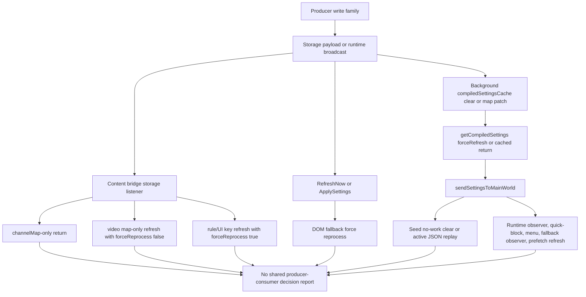

# FilterTube Settings Refresh Dirty-Key Producer Consumer Join Matrix - Current Behavior - 2026-05-29

Status: audit-only current-behavior settings refresh dirty-key producer-consumer
join matrix. Runtime behavior is unchanged. This is not a settings refactor,
storage-key refactor, cache optimization, JSON-first patch, DOM fallback patch,
whitelist optimization, release package patch, public-claim patch, or
first-class settings refresh authority.

## Purpose

The producer matrix records how dirty keys are written. The consumer matrix
records how dirty keys wake background cache, content bridge, seed, DOM
fallback, runtime observers, menus, quick-block, and StateManager. This join
slice records the current end-to-end path between those two sides before any
optimization narrows work.

Current answer:

```text
settings refresh producer-consumer join matrix rows: 14
settings refresh producer families joined: 8
settings refresh consumer work families joined: 7
join refresh/broadcast shapes covered: 5
runtime producer-consumer join authority approvals: 0
settings refresh producer-consumer join matrix approval: NO-GO
runtime behavior changed: no
```

## Source Inputs

| Input | Current proof used |
| --- | --- |
| `docs/audit/FILTERTUBE_SETTINGS_REFRESH_DIRTY_KEY_PRODUCER_MATRIX_CURRENT_BEHAVIOR_2026-05-29.md` | Records producer write paths, persistence shapes, broadcast shapes, and producer authority gaps. |
| `docs/audit/FILTERTUBE_SETTINGS_REFRESH_DIRTY_KEY_CONSUMER_MATRIX_CURRENT_BEHAVIOR_2026-05-29.md` | Records dirty-key consumer fanout and no-op authority gaps. |
| `docs/audit/FILTERTUBE_SETTINGS_REFRESH_KEY_PARITY_REGISTER_CURRENT_BEHAVIOR_2026-05-22.md` | Records key-list drift across background, shared settings, content bridge, and StateManager. |
| `docs/audit/FILTERTUBE_SETTINGS_REFRESH_FANOUT_CURRENT_BEHAVIOR_2026-05-19.md` | Records refresh entrances, storage coalescing, seed delivery, and missing revision/no-op authority. |
| `docs/audit/FILTERTUBE_SETTINGS_REFRESH_CROSS_CONTEXT_CONSUMER_BOUNDARY_CURRENT_BEHAVIOR_2026-05-23.md` | Records background, bridge, injector, seed, DOM fallback, and filter logic consumer fanout. |
| `docs/audit/FILTERTUBE_SEED_SETTINGS_REPLAY_PROVENANCE_BOUNDARY_CURRENT_BEHAVIOR_2026-05-23.md` | Records seed queued-data and raw-snapshot replay behavior without revision or dirty-key proof. |
| `docs/audit/FILTERTUBE_OPTIMIZATION_STOP_GO_DECISION_RECORD_CURRENT_BEHAVIOR_2026-05-24.md` | Keeps stop-now whitelist optimization and JSON-first promotion at NO-GO while the audit continues. |

## Current Flow

ASCII flow:

```text
producer writes storage or broadcasts settings
  -> background cache may clear, patch maps, or recompile
  -> content bridge storage listener classifies the dirty key
  -> rule/UI keys force background pull and DOM fallback reprocess
  -> video map keys pull settings but avoid forced DOM reprocess
  -> channelMap-only keys return early in the bridge
  -> RefreshNow and ApplySettings still force DOM fallback without changed-key payload
  -> seed either clears queued JSON snapshots or replays active JSON data
  -> observers, quick-block, menu, fallback observer, and prefetch may refresh
  -> no shared producer-consumer decision report ties writer, key, no-op,
     profile/list mode, JSON work, DOM work, menu work, or observer work
```

Mermaid flow:



## Matrix Rows

| Row | Joined path | Current behavior | Missing proof before optimization |
| --- | --- | --- | --- |
| `FT-SRDJ-00-scope` | Audit gate | Joins settings/profile/map/import producers to background, content bridge, seed, DOM, observer, menu, quick-block, and StateManager consumers. | One revisioned producer-consumer report with no-op and work-budget decisions. |
| `FT-SRDJ-01-shared-save-applysettings` | `SettingsAPI.saveSettings()` -> StateManager broadcast -> background/bridge ApplySettings | Shared save writes top-level keys plus `ftProfilesV4`; StateManager can broadcast `FilterTube_ApplySettings`; background recompiles and bridge forces DOM fallback. | Changed-key set, compiled-rule delta, and list-target proof for ApplySettings. |
| `FT-SRDJ-02-direct-profile-save-requestrefresh` | `persistMainProfiles()` / `persistKidsProfiles()` -> caller `requestRefresh()` | Direct profile writes save V3/V4 through IO; callers separately request forced background compile and broadcast `FilterTube_ApplySettings`. | Caller-to-refresh join proof and no-op direct-write report. |
| `FT-SRDJ-03-background-set-list-mode-refreshnow` | Background set-list-mode -> storage write -> cache clear -> `RefreshNow` | Mode changes write `ftProfilesV4`, may clear Main legacy blocklist keys, clear both compiled caches, and send `FilterTube_RefreshNow`. | Mode transition report with copied/cleared list decisions and dirty keys. |
| `FT-SRDJ-04-background-batch-whitelist-import-refreshnow` | Batch whitelist import -> profile/channelMap write -> cache clear -> `RefreshNow` | Import writes `ftProfilesV4`, `ftProfilesV3`, optionally `channelMap`, clears caches, and sends `FilterTube_RefreshNow`. | Import request/session report, map-write no-op proof, and target tabs. |
| `FT-SRDJ-05-single-channel-rule-mutation-storage-listener` | Single channel add/remove/toggle -> storage write -> storage listeners | Channel mutations can write profile lists, legacy lists, and maps; background clears caches and bridge reacts through storage/refresh paths. | Rule mutation report tying profile, listType, optimistic hide, storage keys, and reprocess budget. |
| `FT-SRDJ-06-filter-all-toggle-storage-listener` | Filter-all toggle -> derived list writes -> storage listeners | Toggle writes `filterChannels` and optionally `ftProfilesV4`; cache clears rely on consumers to re-request settings. | Channel-derived keyword/list diff and no-op toggle proof. |
| `FT-SRDJ-07-channel-map-only-producer-consumer` | Channel map queues/custom URL map -> `channelMap` dirty key | Background map queues patch compiled cache and flush after 250 ms; bridge returns early on single `channelMap` change; StateManager also ignores channelMap-only reload. | Proof that visible channel-match decisions never require immediate channelMap-only reprocess. |
| `FT-SRDJ-08-video-channel-map-only-producer-consumer` | Video-channel map queues -> `videoChannelMap` dirty key | Background map queue patches compiled cache and flushes after 50 ms; bridge pulls compiled settings and refreshes observers but DOM fallback uses `forceReprocess:false`. | Stale visible-card proof for Shorts/watch/playlist cards that depend on video-to-channel identity. |
| `FT-SRDJ-09-video-meta-map-only-producer-consumer` | Video metadata map queues -> `videoMetaMap` dirty key | Content bridge can target touched DOM cards and debounce a rerun; background flushes after 75 ms; bridge storage listener uses non-forced DOM fallback for map-only changes. | Metadata-field effect budget for duration/date/category filters. |
| `FT-SRDJ-10-content-bridge-custom-url-map` | Main-world learned custom URL -> content bridge storage write | Content bridge writes `channelMap` directly from `FilterTube_UpdateCustomUrlMap`; the bridge storage listener then treats the single map key as no DOM/settings refresh. | Sender/source trust and map-only no-op proof. |
| `FT-SRDJ-11-import-sync-profile-write` | Backup/import/Nanah profile writes -> storage listeners/request refresh | IO and Nanah can write `ftProfilesV4`; full imports can write `channelMap`; consumers depend on storage listeners and caller-specific refresh behavior. | Actor trust, rollback, changed-key report, and profile/list revision. |
| `FT-SRDJ-12-seed-json-active-vs-no-work` | Any settings delivery -> seed settings update | Seed clears queued/raw JSON snapshots when no active JSON work exists; active JSON work replays queued and raw snapshots through installed setters. | Dirty-key JSON-work reason and replay/no-op provenance. |
| `FT-SRDJ-13-observer-menu-quick-work-budget` | Any settings delivery -> observer/menu/quick-block refresh | Main-world delivery refreshes runtime observers, quick-block availability, DOM fallback observer, and prefetch scan without a per-key work budget. | Observer/menu/quick-block budget tied to changed keys, mode, active rules, and route. |

## Producer-Consumer Chain Closure

Current answer:

```text
settings refresh producer-consumer chain closure rows: 14
producer rows linked by closure: 14
consumer rows linked by closure: 13
join rows linked by closure: 14
committed producer-consumer join artifacts: 0
runtime producer-consumer chain approvals: 0
settings refresh producer-consumer chain closure: CHAIN-CLOSED
settings refresh producer-consumer implementation readiness from closure: NO-GO
runtime behavior changed: no
```

| Closure row | Producer rows linked | Consumer rows linked | Join row | Current state |
| --- | --- | --- | --- | --- |
| `FT-SRDJ-CLOSURE-00-scope` | `FT-SRDP-00-scope` | `FT-SRDK-00-scope` | `FT-SRDJ-00-scope` | Chain linked; producer-consumer report absent. |
| `FT-SRDJ-CLOSURE-01-shared-save-applysettings` | `FT-SRDP-01-shared-save-settings`, `FT-SRDP-02-state-manager-save-broadcast` | `FT-SRDK-01-ui-pushed-settings`, `FT-SRDK-07-runtime-applysettings` | `FT-SRDJ-01-shared-save-applysettings` | Chain linked; changed-key/list-target proof absent. |
| `FT-SRDJ-CLOSURE-02-direct-profile-save-requestrefresh` | `FT-SRDP-03-state-manager-direct-main-profile`, `FT-SRDP-04-state-manager-direct-kids-profile` | `FT-SRDK-12-state-manager-refresh`, `FT-SRDK-07-runtime-applysettings` | `FT-SRDJ-02-direct-profile-save-requestrefresh` | Chain linked; caller-to-refresh no-op proof absent. |
| `FT-SRDJ-CLOSURE-03-background-set-list-mode-refreshnow` | `FT-SRDP-05-background-set-list-mode` | `FT-SRDK-02-background-storage-invalidation`, `FT-SRDK-06-runtime-refreshnow`, `FT-SRDK-05-bridge-rule-or-ui-key` | `FT-SRDJ-03-background-set-list-mode-refreshnow` | Chain linked; mode transition report absent. |
| `FT-SRDJ-CLOSURE-04-background-batch-whitelist-import-refreshnow` | `FT-SRDP-06-background-batch-whitelist-import` | `FT-SRDK-06-runtime-refreshnow`, `FT-SRDK-03-bridge-channel-map-only` | `FT-SRDJ-04-background-batch-whitelist-import-refreshnow` | Chain linked; import session and map no-op proof absent. |
| `FT-SRDJ-CLOSURE-05-single-channel-rule-mutation-storage-listener` | `FT-SRDP-07-background-add-channel-helper` | `FT-SRDK-05-bridge-rule-or-ui-key`, `FT-SRDK-04-bridge-video-map-only` | `FT-SRDJ-05-single-channel-rule-mutation-storage-listener` | Chain linked; rule mutation report absent. |
| `FT-SRDJ-CLOSURE-06-filter-all-toggle-storage-listener` | `FT-SRDP-08-background-filter-all-toggle` | `FT-SRDK-05-bridge-rule-or-ui-key` | `FT-SRDJ-06-filter-all-toggle-storage-listener` | Chain linked; channel-derived diff/no-op proof absent. |
| `FT-SRDJ-CLOSURE-07-channel-map-only-producer-consumer` | `FT-SRDP-09-background-channel-map-queue`, `FT-SRDP-12-content-bridge-custom-url-map` | `FT-SRDK-03-bridge-channel-map-only` | `FT-SRDJ-07-channel-map-only-producer-consumer` | Chain linked; visible channel-match immediate reprocess proof absent. |
| `FT-SRDJ-CLOSURE-08-video-channel-map-only-producer-consumer` | `FT-SRDP-10-background-video-channel-map-queue` | `FT-SRDK-04-bridge-video-map-only` | `FT-SRDJ-08-video-channel-map-only-producer-consumer` | Chain linked; stale visible-card proof absent. |
| `FT-SRDJ-CLOSURE-09-video-meta-map-only-producer-consumer` | `FT-SRDP-11-background-video-meta-map-queue` | `FT-SRDK-04-bridge-video-map-only` | `FT-SRDJ-09-video-meta-map-only-producer-consumer` | Chain linked; metadata field-effect budget absent. |
| `FT-SRDJ-CLOSURE-10-content-bridge-custom-url-map` | `FT-SRDP-12-content-bridge-custom-url-map` | `FT-SRDK-03-bridge-channel-map-only` | `FT-SRDJ-10-content-bridge-custom-url-map` | Chain linked; sender/source trust proof absent. |
| `FT-SRDJ-CLOSURE-11-import-sync-profile-write` | `FT-SRDP-13-import-sync-profile-write` | `FT-SRDK-12-state-manager-refresh`, `FT-SRDK-05-bridge-rule-or-ui-key` | `FT-SRDJ-11-import-sync-profile-write` | Chain linked; actor trust and rollback report absent. |
| `FT-SRDJ-CLOSURE-12-seed-json-active-vs-no-work` | `FT-SRDP-01-shared-save-settings`, `FT-SRDP-13-import-sync-profile-write` | `FT-SRDK-08-main-world-delivery`, `FT-SRDK-09-seed-no-json-work`, `FT-SRDK-10-seed-active-json-work` | `FT-SRDJ-12-seed-json-active-vs-no-work` | Chain linked; dirty-key JSON-work reason/replay provenance absent. |
| `FT-SRDJ-CLOSURE-13-observer-menu-quick-work-budget` | `FT-SRDP-01-shared-save-settings`, `FT-SRDP-02-state-manager-save-broadcast` | `FT-SRDK-08-main-world-delivery`, `FT-SRDK-11-runtime-observer-refresh` | `FT-SRDJ-13-observer-menu-quick-work-budget` | Chain linked; observer/menu/quick budget absent. |

## Current Join Classes

```text
forced reprocess joins:
  RefreshNow, ApplySettings, rule/UI storage keys, StateManager requestRefresh

non-forced map refresh joins:
  videoChannelMap, videoMetaMap

early-return map joins:
  channelMap-only

producer-local map joins:
  background channelMap/videoChannelMap/videoMetaMap cache patch before flush

seed joins:
  no active JSON work clears snapshots; active JSON work replays queued/raw data
```

## Risk Notes

Reliability risk follows from the missing producer-consumer contract. A future
optimization could correctly identify a write as "map only" but still skip the
only consumer path that makes a visible card re-evaluate a blocklist or
whitelist decision.

False-hide/leak risk follows from mixed list and identity writes. The same user
action can write profile lists, legacy lists, `channelMap`, `videoChannelMap`,
and a runtime refresh. Those writes currently lack one list-mode/profile proof,
so a narrow optimization could leave already-rendered cards stale.

Performance risk follows from broad forced refresh shapes. `RefreshNow` and
`ApplySettings` do not carry changed keys, so the bridge must treat them as
forced DOM work even when a field-level no-op might have been safe.

Code-burden risk follows from split ownership. Settings, StateManager,
background, IO, Nanah, content bridge, seed, DOM fallback, menu, quick-block,
and observer code each define part of the refresh story. JSON-first filtering
needs this join contract before JSON becomes the first-class authority.

## Current Decision

```text
define settings refresh producer-consumer join matrix: GO
approve settings refresh producer-consumer join authority now: NO-GO
approve settings refresh write-consumer revision now: NO-GO
approve JSON/DOM consumer work budget now: NO-GO
approve seed replay budget from current joins now: NO-GO
approve observer/menu/quick-block work budget now: NO-GO
approve broad whitelist optimization from current joins: NO-GO
approve JSON-first promotion from current joins: NO-GO
runtime behavior changed by this matrix: no
close settings refresh producer-consumer chain documentation now: GO
accept chain closure as producer-consumer join authority now: NO-GO
accept chain closure as write-consumer revision evidence now: NO-GO
accept chain closure as JSON/DOM work-budget evidence now: NO-GO
accept chain closure as seed replay budget evidence now: NO-GO
accept chain closure as observer/menu/quick budget evidence now: NO-GO
accept chain closure as whitelist optimization approval now: NO-GO
accept chain closure as JSON-first promotion approval now: NO-GO
accept chain closure as release/public-claim approval now: NO-GO
continue proof-backed audit: GO
```

## Missing Product Authority Symbols

No product runtime, build, script, website, manifest, CSS, source, or asset file
currently defines:

```text
settingsRefreshDirtyKeyProducerConsumerJoinMatrix
settingsRefreshProducerConsumerDecisionReport
settingsRefreshWriteConsumerRevision
settingsRefreshJsonDomConsumerBudget
settingsRefreshSeedJoinBudget
settingsRefreshObserverJoinBudget
settingsRefreshMenuQuickJoinBudget
settingsRefreshMapOnlyJoinReport
settingsRefreshImportSyncJoinReport
settingsRefreshProducerConsumerRollbackReport
settingsRefreshProducerConsumerChainClosure
settingsRefreshProducerConsumerChainRuntimeApproval
settingsRefreshProducerConsumerImplementationReadiness
```

## Verification

Current proof command:

```bash
node --test tests/runtime/settings-refresh-dirty-key-producer-consumer-join-matrix-current-behavior.test.mjs --test-reporter=spec
```

This matrix is not a completion claim. It records the current producer-consumer
join gaps that must be closed before a future optimization can safely narrow
settings refresh work without breaking blocklist, whitelist, channel blocking,
JSON filtering, menus, quick-block, YTM, Kids, comments, import/sync, or
installed-extension behavior.
