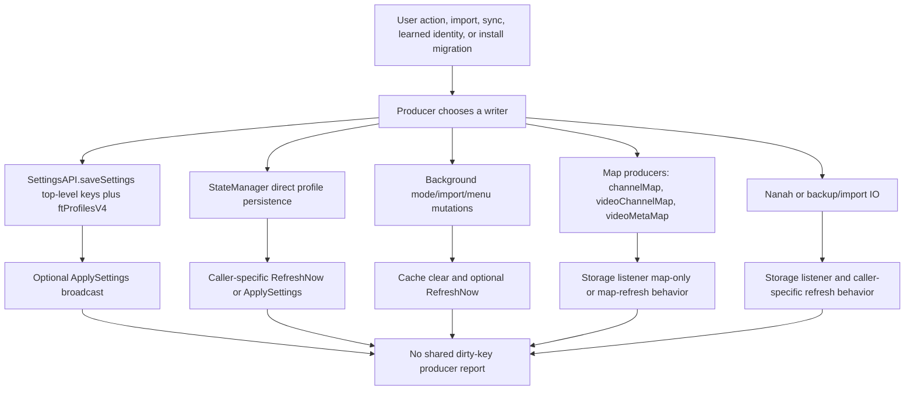

# FilterTube Settings Refresh Dirty-Key Producer Matrix - Current Behavior - 2026-05-29

Status: audit-only current-behavior settings refresh dirty-key producer
matrix. Runtime behavior is unchanged. This is not a settings refactor,
storage-key refactor, cache optimization, JSON-first patch, DOM fallback patch,
whitelist optimization, release package patch, public-claim patch, or
first-class settings refresh authority.

## Purpose

The previous consumer matrix records how storage changes fan out after a key is
dirty. This companion slice records how the dirty keys are produced today:
dashboard/popup state saves, direct profile writes, background mode changes,
whitelist imports, menu/quick channel mutations, learned map writes, and Nanah
or backup imports do not emit one normalized write report.

Current answer:

```text
settings refresh dirty-key producer matrix rows: 14
settings refresh producer work families covered: 8
producer persistence shapes covered: 4
producer broadcast shapes covered: 4
runtime dirty-key producer authority approvals: 0
settings refresh dirty-key producer matrix approval: NO-GO
runtime behavior changed: no
```

## Source Inputs

| Input | Current proof used |
| --- | --- |
| `docs/audit/FILTERTUBE_SETTINGS_REFRESH_DIRTY_KEY_CONSUMER_MATRIX_CURRENT_BEHAVIOR_2026-05-29.md` | Records current dirty-key consumer fanout and no-op authority gaps. |
| `docs/audit/FILTERTUBE_SETTINGS_REFRESH_KEY_PARITY_REGISTER_CURRENT_BEHAVIOR_2026-05-22.md` | Records the current key sets and key-list drift across background, shared settings, content bridge, and StateManager. |
| `docs/audit/FILTERTUBE_SETTINGS_REFRESH_FANOUT_CURRENT_BEHAVIOR_2026-05-19.md` | Records refresh entrances, storage coalescing, seed delivery, and missing revision/no-op authority. |
| `docs/audit/FILTERTUBE_SINGLE_CHANNEL_RULE_MUTATION_PERSISTENCE_BOUNDARY_CURRENT_BEHAVIOR_2026-05-22.md` | Records single-channel rule mutation persistence, list target, and refresh gaps. |
| `docs/audit/FILTERTUBE_BATCH_WHITELIST_IMPORT_PERSISTENCE_BOUNDARY_CURRENT_BEHAVIOR_2026-05-22.md` | Records batch whitelist import storage, profile, and channelMap behavior. |
| `docs/audit/FILTERTUBE_NANAH_VENDOR_RUNTIME_SESSION_LIFECYCLE_BOUNDARY_CURRENT_BEHAVIOR_2026-05-22.md` | Records Nanah sync lifecycle boundaries and profile write trust gaps. |
| `docs/audit/FILTERTUBE_OPTIMIZATION_STOP_GO_DECISION_RECORD_CURRENT_BEHAVIOR_2026-05-24.md` | Keeps stop-now whitelist optimization and JSON-first promotion at NO-GO while the audit continues. |

## Current Flow

ASCII flow:

```text
UI action / import / sync / learned identity / install migration
  -> one of several producer paths writes storage
  -> payload may include ftProfilesV4, ftProfilesV3, legacy compiled keys,
     channelMap, videoChannelMap, videoMetaMap, stats, theme, or release keys
  -> producer may or may not clear compiledSettingsCache
  -> producer may broadcast FilterTube_ApplySettings or FilterTube_RefreshNow
  -> content bridge storage listener may also react to the dirty key
  -> no shared producer report connects writer, keys, list target, profile,
     changed values, no-op result, broadcast, or consumer budget
```

Mermaid flow:



## Matrix Rows

| Row | Current producer | Current behavior | Missing proof before optimization |
| --- | --- | --- | --- |
| `FT-SRDP-00-scope` | Audit gate | Binds storage/settings writers to the consumer matrix before optimization. | One revisioned producer report joined to consumer decisions. |
| `FT-SRDP-01-shared-save-settings` | `js/settings_shared.js` | `saveSettings()` writes top-level compiled keys, `ftProfilesV4`, and auto-backup preference. It preserves existing category filters unless caller supplies them. | Per-field old/new diff, no-op result, and active-rule delta. |
| `FT-SRDP-02-state-manager-save-broadcast` | `js/state_manager.js` | `saveSettings()` calls shared save, then broadcasts `FilterTube_ApplySettings` when compiled settings are returned. | Sender/surface class and profile/list-target report. |
| `FT-SRDP-03-state-manager-direct-main-profile` | `js/state_manager.js`, `js/io_manager.js` | `persistMainProfiles()` writes profile V3 and V4 aliases directly through IO without emitting compiled top-level keys. Callers are responsible for `requestRefresh('main')`. | Caller-to-refresh join proof and no-op direct-write proof. |
| `FT-SRDP-04-state-manager-direct-kids-profile` | `js/state_manager.js`, `js/io_manager.js` | `persistKidsProfiles()` writes Kids V3/V4 directly. Callers are responsible for `requestRefresh('kids')`. | Kids tab-target proof and profile-scoped revision. |
| `FT-SRDP-05-background-set-list-mode` | `js/background.js` | `FilterTube_SetListMode` writes `ftProfilesV4`; Main whitelist mode also clears legacy blocklist top-level keys. It clears both compiled caches and sends `FilterTube_RefreshNow` to matching tabs. | Mode transition report with copied/cleared list decisions. |
| `FT-SRDP-06-background-batch-whitelist-import` | `js/background.js` | Batch import writes `ftProfilesV4`, `ftProfilesV3`, and optionally `channelMap`; then clears both compiled caches and sends `FilterTube_RefreshNow` to YouTube tabs. | Import request profile/session report and channelMap no-op proof. |
| `FT-SRDP-07-background-add-channel-helper` | `js/background.js` | `handleAddFilteredChannel()` can write `channelMap`, `ftProfilesV4`, `ftProfilesV3`, `filterChannels`, and `uiChannels`; it clears compiled caches only when the channel list mutates. | One rule mutation report with profile, listType, optimistic hide, and refresh decision. |
| `FT-SRDP-08-background-filter-all-toggle` | `js/background.js` | Filter-all toggle writes `filterChannels` and optionally `ftProfilesV4`, then clears both compiled caches. | Channel-derived keyword diff and no-op toggle proof. |
| `FT-SRDP-09-background-channel-map-queue` | `js/background.js` | Channel identity mapping queues lowercased key/value pairs, updates compiled cache map fields in memory, and flushes `channelMap` after 250 ms. | Map producer budget and visible-card dependency proof. |
| `FT-SRDP-10-background-video-channel-map-queue` | `js/background.js` | Video-to-channel mapping queues updates, patches compiled cache video maps, caps at 1000 entries, and flushes `videoChannelMap` after 50 ms. | Map-only stale-card proof and eviction provenance. |
| `FT-SRDP-11-background-video-meta-map-queue` | `js/background.js` | Video metadata mapping sanitizes duration/date/category fields, patches compiled cache maps, caps at 2000 entries, and flushes `videoMetaMap` after 75 ms. | Metadata field-effect budget and DOM rerun proof. |
| `FT-SRDP-12-content-bridge-custom-url-map` | `js/content_bridge.js` | Main-world learned custom URL mappings can write `channelMap` directly from the content bridge. | Sender/source trust and channelMap-only no-op proof. |
| `FT-SRDP-13-import-sync-profile-write` | `js/io_manager.js`, `js/nanah_sync_adapter.js` | Backup/import and Nanah scoped payloads write `ftProfilesV4`; full import can also write `channelMap` separately. | Import/sync actor trust, rollback, and refresh report. |

## Dirty-Key Producer Chain Closure

This closure table proves the audit chain is structurally complete from each
dirty-key producer row to its source input family, persistence shape, broadcast
shape, and missing proof. It is not a normalized producer report and does not
create write-revision, no-op, map-budget, import/sync, whitelist, JSON-first, or
release authority.

Current producer-closure answer:

```text
settings refresh dirty-key producer closure rows: 14
producer matrix rows linked by closure: 14
producer work families linked by closure: 8
producer persistence shapes linked by closure: 4
producer broadcast shapes linked by closure: 4
source input families linked by producer closure: 7
runtime dirty-key producer closure approvals: 0
implementation-ready dirty-key producer rows: 0
settings refresh dirty-key producer closure: PRODUCER-CHAIN-CLOSED
settings refresh producer implementation readiness from closure: NO-GO
runtime behavior changed: no
```

Producer closure rows:

| Closure row | Producer row | Persistence shape | Broadcast shape | Current state |
| --- | --- | --- | --- | --- |
| `FT-SRDP-CLOSURE-00-scope` | `FT-SRDP-00-scope` | All persistence shapes. | All broadcast shapes. | Chain linked; normalized producer report absent. |
| `FT-SRDP-CLOSURE-01-shared-save-settings` | `FT-SRDP-01-shared-save-settings` | Top-level compiled keys plus `ftProfilesV4`. | Storage-listener and optional downstream broadcast. | Chain linked; per-field old/new diff, no-op result, and active-rule delta missing. |
| `FT-SRDP-CLOSURE-02-state-manager-save-broadcast` | `FT-SRDP-02-state-manager-save-broadcast` | Shared save payload. | Direct `FilterTube_ApplySettings` broadcast. | Chain linked; sender/surface class and profile/list-target report missing. |
| `FT-SRDP-CLOSURE-03-state-manager-direct-main-profile` | `FT-SRDP-03-state-manager-direct-main-profile` | Direct `ftProfilesV3` and `ftProfilesV4` profile writes. | Caller-specific `requestRefresh('main')`. | Chain linked; caller-to-refresh and no-op direct-write proof missing. |
| `FT-SRDP-CLOSURE-04-state-manager-direct-kids-profile` | `FT-SRDP-04-state-manager-direct-kids-profile` | Direct `ftProfilesV3` and `ftProfilesV4` profile writes. | Caller-specific `requestRefresh('kids')`. | Chain linked; Kids tab-target and profile-scoped revision proof missing. |
| `FT-SRDP-CLOSURE-05-background-set-list-mode` | `FT-SRDP-05-background-set-list-mode` | `ftProfilesV4` plus optional legacy blocklist clear. | `FilterTube_RefreshNow`. | Chain linked; mode transition and copied/cleared list decision report missing. |
| `FT-SRDP-CLOSURE-06-background-batch-whitelist-import` | `FT-SRDP-06-background-batch-whitelist-import` | `ftProfilesV4`, `ftProfilesV3`, optional `channelMap`. | `FilterTube_RefreshNow`. | Chain linked; import session and channelMap no-op proof missing. |
| `FT-SRDP-CLOSURE-07-background-add-channel-helper` | `FT-SRDP-07-background-add-channel-helper` | Profile, legacy list, UI list, and map writes. | Storage listener plus cache clear. | Chain linked; rule mutation report and optimistic-hide refresh decision missing. |
| `FT-SRDP-CLOSURE-08-background-filter-all-toggle` | `FT-SRDP-08-background-filter-all-toggle` | `filterChannels` plus optional `ftProfilesV4`. | Storage listener plus cache clear. | Chain linked; channel-derived keyword diff and no-op toggle proof missing. |
| `FT-SRDP-CLOSURE-09-background-channel-map-queue` | `FT-SRDP-09-background-channel-map-queue` | Debounced `channelMap`. | Producer-local compiled-cache patch plus storage listener. | Chain linked; map producer budget and visible-card dependency proof missing. |
| `FT-SRDP-CLOSURE-10-background-video-channel-map-queue` | `FT-SRDP-10-background-video-channel-map-queue` | Debounced capped `videoChannelMap`. | Producer-local compiled-cache patch plus storage listener. | Chain linked; map-only stale-card proof and eviction provenance missing. |
| `FT-SRDP-CLOSURE-11-background-video-meta-map-queue` | `FT-SRDP-11-background-video-meta-map-queue` | Debounced capped `videoMetaMap`. | Producer-local compiled-cache patch plus storage listener. | Chain linked; metadata field-effect budget and DOM rerun proof missing. |
| `FT-SRDP-CLOSURE-12-content-bridge-custom-url-map` | `FT-SRDP-12-content-bridge-custom-url-map` | Direct `channelMap`. | Storage listener map-only path. | Chain linked; sender/source trust and channelMap-only no-op proof missing. |
| `FT-SRDP-CLOSURE-13-import-sync-profile-write` | `FT-SRDP-13-import-sync-profile-write` | `ftProfilesV4` plus optional `channelMap`. | Storage listener and caller-specific refresh behavior. | Chain linked; actor trust, rollback, and refresh report missing. |

Producer closure decision:

```text
close settings refresh dirty-key producer documentation chain now: GO
accept producer closure as dirty-key producer authority now: NO-GO
accept producer closure as producer-to-consumer revision authority now: NO-GO
accept producer closure as settings no-op write authority now: NO-GO
accept producer closure as rule mutation report evidence now: NO-GO
accept producer closure as import/sync write report evidence now: NO-GO
accept producer closure as map producer budget evidence now: NO-GO
accept producer closure as whitelist optimization approval now: NO-GO
accept producer closure as JSON-first promotion approval now: NO-GO
accept producer closure as release/public-claim approval now: NO-GO
continue proof-backed audit: GO
```

## Current Persistence Shapes

```text
profile/list writes:
  ftProfilesV4, ftProfilesV3

legacy compiled-key writes:
  enabled, uiKeywords, filterKeywords, filterChannels, contentFilters,
  hide* booleans, disable* booleans, showQuickBlockButton, showBlockMenuItem

learned map writes:
  channelMap, videoChannelMap, videoMetaMap

non-filter storage writes:
  stats, statsBySurface, theme, release notes, first-run flags, backup state
```

## Current Broadcast Shapes

```text
direct ApplySettings broadcast:
  StateManager save path when shared save returns compiled settings

RefreshNow broadcast:
  background mode changes, whitelist import, and caller-specific refresh paths

storage-listener-only refresh:
  direct IO writes, map writes, import/sync writes, install/update writes

producer-local cache patch:
  background channelMap, videoChannelMap, and videoMetaMap queues patch
  compiledSettingsCache in memory before debounced storage flush
```

## Risk Notes

Reliability risk follows from producer drift. A rule-changing write can arrive
through StateManager, background helpers, IO import, Nanah sync, or map queues,
and each path has its own cache clearing and broadcast behavior.

False-hide/leak risk follows from list target ambiguity. Some producers write
both V4 and legacy keys; some write only profile objects; map producers update
identity evidence without a list-mode payload. A future optimization must not
skip a refresh that is the only path making a new blocklist or whitelist rule
visible to already-rendered cards.

Performance risk follows from missing no-op proof. Producers often write whole
profile objects or maps, then consumers react to the changed key without a
field-level diff. That makes it hard to skip expensive DOM or JSON work without
proof that the effective compiled decision did not change.

Code-burden risk follows from split writer APIs. Settings, StateManager,
background, IO, Nanah, content bridge, and install/update paths all encode
storage payloads directly. A first-class JSON filter model needs a producer
manifest before fields can be merged, deleted, or moved safely.

## Current Decision

```text
define settings refresh dirty-key producer matrix: GO
approve settings refresh dirty-key producer authority now: NO-GO
approve producer-to-consumer revision authority now: NO-GO
approve settings no-op write authority now: NO-GO
approve broad whitelist optimization from current producer gates: NO-GO
approve JSON-first promotion from current producer gates: NO-GO
runtime behavior changed by this matrix: no
continue proof-backed audit: GO
```

## Missing Runtime Authority Symbols

No product runtime, build, script, website, manifest, CSS, source, or asset file
currently defines:

```text
settingsRefreshDirtyKeyProducerMatrix
settingsRefreshProducerDecisionReport
settingsRefreshProducerConsumerJoinReport
settingsRefreshWriteRevision
settingsRefreshNoOpWriteReport
settingsRefreshRuleMutationReport
settingsRefreshImportSyncWriteReport
settingsRefreshMapProducerBudget
settingsRefreshProducerMetricArtifact
settingsRefreshProducerRollbackReport
settingsRefreshDirtyKeyProducerClosure
settingsRefreshDirtyKeyProducerClosureRuntimeApproval
settingsRefreshDirtyKeyProducerImplementationReadiness
```

## Verification

Current proof command:

```bash
node --test tests/runtime/settings-refresh-dirty-key-producer-matrix-current-behavior.test.mjs --test-reporter=spec
```

This matrix is not a completion claim. It records the current settings refresh
producer fanout and the exact authority gaps that must be closed before a
future optimization can safely narrow settings refresh work without breaking
blocklist, whitelist, channel blocking, JSON filtering, menus, quick-block, YTM,
Kids, comments, import/sync, or installed-extension behavior.
