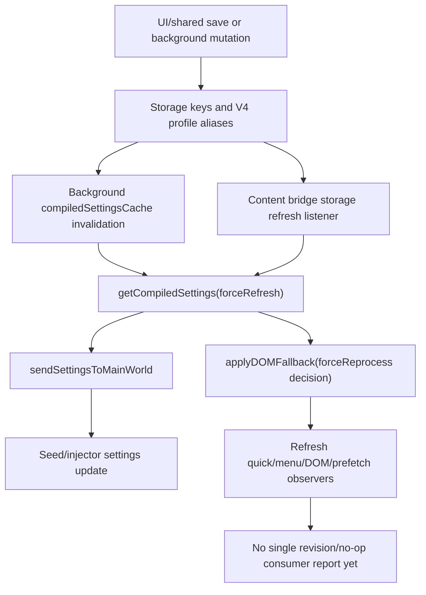

# FilterTube Settings Refresh Fanout Current Behavior - 2026-05-19

Status: audit-only proof. Runtime behavior is unchanged.

This slice pins how settings refresh requests fan out into main-world settings
delivery, seed updates, DOM fallback reprocessing, fallback menu lifecycle, and
background tab broadcasts. It exists because empty-install lag and false hides
can be caused by a settings refresh that wakes too many subsystems even when no
effective rule changed.

## Current Flow

```text
UI/background/storage/page event
        |
        +--> requestSettingsFromBackground()
        |       |
        |       +--> runtime.getCompiledSettings(profileType, forceRefresh?)
        |       +--> normalizeSettingsForHost()
        |       +--> sendSettingsToMainWorld()
        |               |
        |               +--> window.postMessage(FilterTube_SettingsToInjector)
        |               +--> window.filterTube.updateSettings(settings)
        |               +--> retry every 250ms until seed is ready
        |
        +--> applyDOMFallback(..., { forceReprocess: true })
        |
        +--> initializeDOMFallback()/mutation observers/menu refreshes may add
             more applyDOMFallback(null) passes later
```

There is no single `settingsRefreshFanoutAuthority`, no compiled settings
revision carried through all refresh paths, and no current no-op report proving
that a refresh did not need JSON, DOM, menu, or seed work.

## Proven Entrances

| Entrance | Source proof | Current downstream behavior | Risk |
| --- | --- | --- | --- |
| Runtime refresh broadcast | `js/content/bridge_settings.js:223-229` handles `FilterTube_RefreshNow`. | Calls `requestSettingsFromBackground()` and then `applyDOMFallback(result.settings, { forceReprocess: true })`. | Any background broadcast can wake a full DOM fallback pass. |
| UI-pushed settings | `js/content/bridge_settings.js:283-314` handles `FilterTube_ApplySettings`. | Same-profile settings go through `sendSettingsToMainWorld()` and forced DOM fallback; cross-profile settings pull background settings and forced DOM fallback. | Push, pull, seed, and DOM paths are coupled. |
| Background settings pull | `js/content/bridge_settings.js:806-918`. | Sends `getCompiledSettings`; profile mismatch retries with `forceRefresh: true`; successful responses call `sendSettingsToMainWorld()`. | Pulling settings is also a main-world/seed delivery event. |
| Main-world refresh message | `js/content_bridge.js:5472-5478`. | Same-window `FilterTube_Refresh` calls `requestSettingsFromBackground()` and forced DOM fallback. | Page-message refresh shares the same expensive hammer as trusted background refresh. |
| Startup fallback initialization | `js/content_bridge.js:5889-5900`. | Startup pulls settings, loads the main-world runtime only when those settings need JSON/identity work, waits 1000ms, applies DOM fallback, then installs fallback menu buttons. | First settings delivery can still lead into DOM/menu lifecycle setup, while empty/no-work settings avoid unnecessary main-world runtime injection. |
| Mutation fallback lifecycle | `js/content_bridge.js:5730-5797`. | Mutation scheduling can call `applyDOMFallback(null)` and whitelist pending rechecks after settings startup. | Refreshes and mutations can stack without one owner report. |
| Storage changes | `js/content/bridge_settings.js:1018-1108`. | Relevant key changes schedule a forced background settings pull; most keys force DOM reprocess; map-only keys can still pull settings. Immediate and coalesced refreshes preserve the caller's force-reprocess decision and refresh runtime observers after DOM fallback. | Storage refresh has a 250ms throttle, but no revision/no-op authority. |
| Background broadcasts | `js/background.js:3482-3488`, `js/background.js:3666-3685`, `js/background.js:3929-3935`, `js/background.js:6113-6119`. | Several rule/list/profile mutations broadcast `FilterTube_RefreshNow` to YouTube or Kids tabs. | Mutations broadcast broad tab refreshes without a payload describing what changed. |

## Current Behavior Fixtures

| Fixture | What it pins |
| --- | --- |
| `settings_refresh_doc_lists_fanout_entries` | This doc lists all fanout entrances and keeps the audit-only boundary explicit. |
| `settings_refreshnow_forces_background_pull_and_dom_reprocess` | Runtime `FilterTube_RefreshNow` forces settings pull plus DOM fallback reprocess. |
| `settings_applysettings_has_push_pull_and_dom_paths` | UI-pushed settings can either push directly or pull from background, and both routes force DOM fallback. |
| `settings_request_pull_also_delivers_to_main_world` | `requestSettingsFromBackground()` is also a main-world/seed settings delivery path. |
| `settings_send_to_main_world_has_seed_retry_loop` | `sendSettingsToMainWorld()` posts to injector and retries seed updates every 250ms. |
| `settings_storage_change_refresh_has_key_policy_but_no_revision_authority` | Storage changes are filtered by keys and throttled, but not by a shared revision/no-op report. |
| `settings_page_refresh_message_uses_same_forced_dom_hammer` | `FilterTube_Refresh` in page messaging uses the same forced DOM fallback behavior. |
| `settings_initialize_dom_fallback_links_startup_to_menu_and_mutation_work` | Startup fallback initialization applies fallback and installs menu/mutation lifecycle. |
| `settings_background_mutations_broadcast_refreshnow_without_change_payload` | Background mutation paths broadcast `FilterTube_RefreshNow` without a structured change payload. |

## Settings Runtime Refresh Authority Snapshot - 2026-05-27

This dated snapshot ties the release-lag refresh repair back to the broader
settings/cache audit. It is audit-only: it records the current refresh shape
after the no-work and `forceReprocess` fixes, but it does not approve a
settings refresh refactor, cache optimization, or JSON-first promotion.

```text
UI/shared save or background mutation
        |
        v
storage keys and profile aliases
        |
        +--> background compiledSettingsCache invalidation/recompile
        |
        +--> content bridge storage refresh throttle
                |
                v
        getCompiledSettings(forceRefresh)
                |
                +--> main-world settings delivery
                +--> seed retry / injector update
                +--> DOM fallback reprocess decision
                +--> quick/menu/prefetch observer refresh
```



| Boundary | Source proof | Current behavior | Missing authority before optimization |
| --- | --- | --- | --- |
| Shared load and V4 migration | `js/settings_shared.js:564-738` | Loads legacy/root keys plus `ftProfilesV4`, fills missing active-profile settings, and can write V4 defaults during read. | Read/write revision report and migration side-effect budget. |
| Shared save and alias mirroring | `js/settings_shared.js:742-954` | Writes root compatibility keys, active V4 profile settings, canonical `main.keywords/channels`, and blocklist aliases when mode is blocklist. | One mutation report covering root/V4/alias writes and list-mode intent. |
| StateManager refresh request | `js/state_manager.js:1231-1258` | Broadcasts pushed settings and can request background `getCompiledSettings` with `forceRefresh:true`. | Caller-class, profile target, dirty-key, and no-op refresh report. |
| Background compiled cache | `js/background.js:1356`, `js/background.js:2059-2065`, `js/background.js:3570-3582` | Holds one cached compiled payload per profile and bypasses storage reads unless `forceRefresh` is true. | Cache revision/provenance token carried to all consumers. |
| Background apply-settings branch | `js/background.js:4716-4737` | Treats pushed settings as invalidation, recompiles background-owned settings, and broadcasts compiled payloads to profile-matching tabs. | Sender gate plus structured changed-key and consumer matrix. |
| Background storage invalidation | `js/background.js:4806-4841` | Watches a shorter key list, clears both compiled caches, and recompiles both profiles without broadcasting. | Shared storage-key authority aligned with content bridge keys. |
| Bridge runtime apply/refresh | `js/content/bridge_settings.js:198-315` | Runtime refresh and ApplySettings messages pull/push settings and force DOM fallback. | Trusted source, revision, no-op, and consumer-specific work report. |
| Bridge settings pull and main-world delivery | `js/content/bridge_settings.js:806-978` | Pulls background compiled settings, normalizes host/profile, posts to the injector, updates seed, applies managed route/time gates, and refreshes runtime observers. | Main-world capability gate, seed replay budget, and managed time-limit delivery side effects. |
| Bridge storage coalescing | `js/content/bridge_settings.js:1018-1108` | Uses a 250 ms throttle, preserves pending `forceReprocess`, treats map-only video changes as non-forcing, and refreshes observers after successful pulls. | Dirty-key to JSON/DOM/menu/quick/prefetch consumer matrix. |

Current refresh authority decision:

```text
settings/runtime refresh authority approval: NO-GO
compiled-cache revision authority approval: NO-GO
storage-key consumer matrix approval: NO-GO
runtime behavior changed by this addendum: no
```

The release fix made one stale-card symptom better by preserving
`forceReprocess` when a rule-changing storage event arrives behind a pending
map-only refresh. The broader risk remains: background invalidation, bridge
storage refresh, seed delivery, DOM fallback, and observer refresh still do not
share one revisioned report proving which consumer work is required.

## Stabilization Implication

Before optimizing YouTube Main performance or fixing false hides, the future
patch should introduce a refresh authority that reports:

- settings revision and profile/surface target,
- whether active rules changed,
- whether JSON interception must reprocess,
- whether DOM fallback must reprocess,
- whether menu/quick-block lifecycle must refresh,
- whether learned maps changed only passively,
- whether seed queue replay is required,
- and why a refresh is a no-op when nothing user-visible changed.

Until that exists, changing individual call sites is risky because one path may
look idle while another still scans, hides, posts settings, or replays seed data.

## Method Semantic Proof Gap Boundary

`docs/audit/FILTERTUBE_METHOD_SEMANTIC_PROOF_GAP_INDEX_CURRENT_BEHAVIOR_2026-05-25.md`
is a required source input before this background/settings/storage surface can
support runtime optimization. Current proof pins:

```text
method semantic proof gap files covered: 69
method semantic proof gap lexical callables covered: 5830
files with complete per-callable semantic proof: 0
lexical callables requiring semantic proof before behavior changes: 5830
affected callable semantic proof: NO-GO
runtime behavior changed: no
```

These counts are audit-only blockers. They do not approve runtime
optimization, JSON-first behavior, settings behavior, background message
behavior, storage behavior, cache invalidation behavior, whitelist behavior,
metric collectors, artifact creation, native sync, release package changes, or
public claims.
