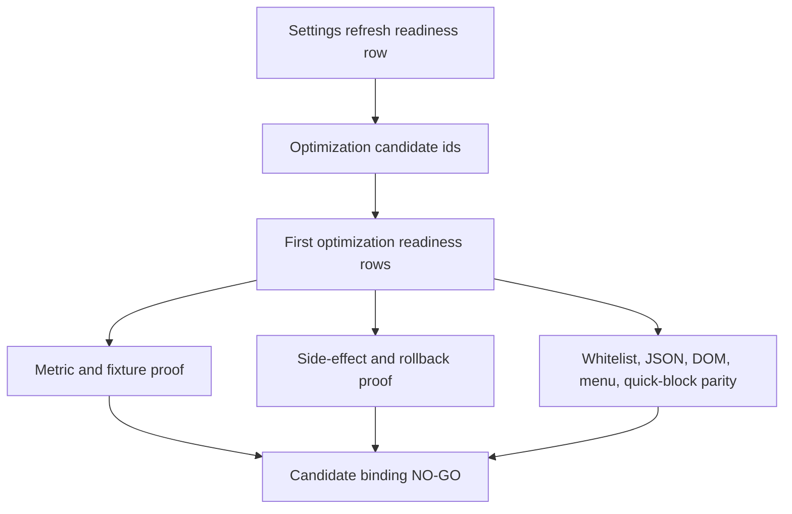

# FilterTube Settings Refresh Optimization Candidate Binding Matrix - Current Behavior - 2026-05-29

Status: audit-only current-behavior settings refresh optimization candidate
binding matrix. Runtime behavior is unchanged. This is not a settings refresh
patch, storage listener patch, JSON-first patch, DOM fallback patch, metric
collector patch, whitelist optimization patch, release package patch, public
claim patch, or first optimization approval.

## Purpose

The settings refresh optimization readiness boundary classifies each refresh
join as forced, map-only, seed, lifecycle, import/sync, or first-optimization
binding work. This slice binds those classes back to the existing ranked
optimization candidates and first-optimization gates so future optimization work
cannot treat settings refresh as a standalone shortcut.

Current answer:

```text
settings refresh optimization candidate binding rows: 12
settings refresh readiness rows covered: 12
optimization candidates referenced: 12
first optimization readiness gates referenced: 14
implementation-ready settings refresh candidate bindings: 0
runtime settings refresh candidate binding approvals: 0
settings refresh candidate binding approval: NO-GO
runtime behavior changed: no
```

## Source Inputs

| Input | Current proof used |
| --- | --- |
| `docs/audit/FILTERTUBE_SETTINGS_REFRESH_OPTIMIZATION_READINESS_BOUNDARY_CURRENT_BEHAVIOR_2026-05-29.md` | Records 12 settings refresh optimization readiness rows and 0 implementation-ready rows. |
| `docs/audit/FILTERTUBE_OPTIMIZATION_CANDIDATE_PRIORITY_REGISTER_CURRENT_BEHAVIOR_2026-05-24.md` | Records 12 ranked optimization candidates, 0 implementation-ready candidates, and the release-stabilized order. |
| `docs/audit/FILTERTUBE_FIRST_OPTIMIZATION_IMPLEMENTATION_READINESS_GATE_CURRENT_BEHAVIOR_2026-05-24.md` | Records 14 implementation readiness rows and 0 runtime first optimization approvals. |
| `docs/audit/FILTERTUBE_CANDIDATE_OBLIGATION_BINDING_MATRIX_CURRENT_BEHAVIOR_2026-05-24.md` | Records candidate-to-obligation bindings and 0 implementation-ready bindings. |
| `docs/audit/FILTERTUBE_OPTIMIZATION_STOP_GO_DECISION_RECORD_CURRENT_BEHAVIOR_2026-05-24.md` | Keeps whitelist optimization and JSON-first promotion at NO-GO. |
| `docs/audit/FILTERTUBE_WHITELIST_OPTIMIZATION_READINESS_GAP_MATRIX_CURRENT_BEHAVIOR_2026-05-24.md` | Records 10 whitelist readiness gaps and 0 implementation-ready whitelist optimization rows. |

## Binding Flow

ASCII flow:

```text
settings refresh readiness row
  -> bind to ranked optimization candidate ids
  -> bind to first optimization readiness gate rows
  -> require metric, fixture, side-effect, rollback, and parity proof
  -> current answer: 0 settings-refresh candidate bindings are implementation-ready
```

Mermaid flow:



## Candidate Binding Rows

| Binding row | Settings refresh row | Optimization candidates | First optimization gates | Current decision |
| --- | --- | --- | --- | --- |
| `FT-SRCB-00-scope` | `FT-SROR-00-scope` | `FT-OPT-00-metric-artifact-gate`, `FT-OPT-03-active-work-decision` | `FT-FIRSTOPT-READY-00-stop-go-decision`, `FT-FIRSTOPT-READY-05-evidence-packet` | `GO` for audit binding, `NO-GO` for runtime behavior. |
| `FT-SRCB-01-applysettings-forced` | `FT-SROR-01-applysettings-forced-reprocess` | `FT-OPT-03-active-work-decision`, `FT-OPT-05-list-mode-empty-policy` | `FT-FIRSTOPT-READY-02-p0-work-authority`, `FT-FIRSTOPT-READY-10-no-work-preservation`, `FT-FIRSTOPT-READY-11-side-effect-budget` | `NO-GO`; forced ApplySettings is correctness-critical until changed-key, list-mode, no-op, and side-effect proof exists. |
| `FT-SRCB-02-refreshnow-forced` | `FT-SROR-02-refreshnow-forced-reprocess` | `FT-OPT-00-metric-artifact-gate`, `FT-OPT-03-active-work-decision` | `FT-FIRSTOPT-READY-05-evidence-packet`, `FT-FIRSTOPT-READY-07-metric-artifact-schema`, `FT-FIRSTOPT-READY-09-collector-insertion` | `NO-GO`; RefreshNow lacks producer reason and target-tab work budget. |
| `FT-SRCB-03-rule-ui-storage` | `FT-SROR-03-rule-ui-storage-force` | `FT-OPT-05-list-mode-empty-policy`, `FT-OPT-06-dom-lifecycle-budget` | `FT-FIRSTOPT-READY-04-whitelist-readiness`, `FT-FIRSTOPT-READY-10-no-work-preservation`, `FT-FIRSTOPT-READY-12-fixture-provenance` | `NO-GO`; visible blocklist/whitelist rule changes must still force reprocess. |
| `FT-SRCB-04-channelmap-only` | `FT-SROR-04-channelmap-only-early-return` | `FT-OPT-04-harvest-mutation-split`, `FT-OPT-03-active-work-decision` | `FT-FIRSTOPT-READY-08-source-owner`, `FT-FIRSTOPT-READY-10-no-work-preservation`, `FT-FIRSTOPT-READY-12-fixture-provenance` | `GATED`; future pruning needs visible-card stale-proof and map-write provenance. |
| `FT-SRCB-05-videochannelmap-only` | `FT-SROR-05-videochannelmap-nonforced-refresh` | `FT-OPT-04-harvest-mutation-split`, `FT-OPT-06-dom-lifecycle-budget` | `FT-FIRSTOPT-READY-03-route-surface-obligation`, `FT-FIRSTOPT-READY-10-no-work-preservation`, `FT-FIRSTOPT-READY-12-fixture-provenance` | `GATED`; Shorts, watch, playlist, and visible identity parity remain required. |
| `FT-SRCB-06-videometamap-targeted` | `FT-SROR-06-videometamap-targeted-rerun` | `FT-OPT-09-category-metadata-fetch-gate`, `FT-OPT-06-dom-lifecycle-budget` | `FT-FIRSTOPT-READY-03-route-surface-obligation`, `FT-FIRSTOPT-READY-11-side-effect-budget`, `FT-FIRSTOPT-READY-12-fixture-provenance` | `GATED`; duration/date/category field-effect metrics are still missing. |
| `FT-SRCB-07-seed-no-json-clear` | `FT-SROR-07-seed-no-json-clear` | `FT-OPT-01-seed-fetch-pass-through`, `FT-OPT-02-seed-xhr-pass-through`, `FT-OPT-04-harvest-mutation-split` | `FT-FIRSTOPT-READY-02-p0-work-authority`, `FT-FIRSTOPT-READY-10-no-work-preservation`, `FT-FIRSTOPT-READY-11-side-effect-budget` | `GATED`; snapshot clearing needs replay-suppression and harvest side-effect proof. |
| `FT-SRCB-08-seed-active-replay` | `FT-SROR-08-seed-active-json-replay` | `FT-OPT-01-seed-fetch-pass-through`, `FT-OPT-02-seed-xhr-pass-through`, `FT-OPT-03-active-work-decision` | `FT-FIRSTOPT-READY-02-p0-work-authority`, `FT-FIRSTOPT-READY-07-metric-artifact-schema`, `FT-FIRSTOPT-READY-12-fixture-provenance` | `NO-GO`; active JSON replay needs duplicate replay, mutation, and route/surface budget. |
| `FT-SRCB-09-observer-menu-quick` | `FT-SROR-09-observer-menu-quick-refresh` | `FT-OPT-06-dom-lifecycle-budget`, `FT-OPT-07-fallback-menu-lifecycle-budget`, `FT-OPT-08-quick-block-lifecycle-budget` | `FT-FIRSTOPT-READY-03-route-surface-obligation`, `FT-FIRSTOPT-READY-10-no-work-preservation`, `FT-FIRSTOPT-READY-11-side-effect-budget` | `NO-GO`; action affordance and lifecycle budgets are still separate. |
| `FT-SRCB-10-import-sync-profile` | `FT-SROR-10-import-sync-profile-write` | `FT-OPT-05-list-mode-empty-policy`, `FT-OPT-11-native-release-parity-rollout` | `FT-FIRSTOPT-READY-04-whitelist-readiness`, `FT-FIRSTOPT-READY-13-parity-rollout`, `FT-FIRSTOPT-READY-11-side-effect-budget` | `NO-GO`; profile writes need actor trust, rollback, list revision, native parity, and no-op proof. |
| `FT-SRCB-11-diagnostic-rollout-binding` | `FT-SROR-11-first-optimization-binding` | `FT-OPT-00-metric-artifact-gate`, `FT-OPT-10-diagnostic-logging-policy`, `FT-OPT-11-native-release-parity-rollout` | `FT-FIRSTOPT-READY-05-evidence-packet`, `FT-FIRSTOPT-READY-07-metric-artifact-schema`, `FT-FIRSTOPT-READY-13-parity-rollout` | `NO-GO`; first optimization still starts with metric foundation and diagnostic privacy, not settings-refresh pruning. |

## Candidate Binding Chain Closure

This closure table proves the audit chain is structurally complete from
settings-refresh readiness row to candidate binding row to the existing
optimization candidate and first-optimization readiness gate set. It is not a
runtime implementation packet and does not create metric artifacts, collector
insertion authority, or pruning approval.

Current binding-chain answer:

```text
settings refresh candidate binding chain closure rows: 12
settings refresh readiness rows linked by binding closure: 12
candidate binding rows linked by binding closure: 12
optimization candidate ids linked by binding closure: 12
first optimization readiness gates referenced by binding closure: 14
runtime settings refresh binding chain approvals: 0
implementation-ready settings refresh binding chain rows: 0
settings refresh candidate binding chain closure: BINDING-CHAIN-CLOSED
settings refresh implementation readiness from binding closure: NO-GO
runtime behavior changed: no
```

Binding chain closure rows:

| Chain row | Settings refresh readiness row | Candidate binding row | Optimization candidate family | First optimization gate family | Current state |
| --- | --- | --- | --- | --- | --- |
| `FT-SRCBC-00-scope` | `FT-SROR-00-scope` | `FT-SRCB-00-scope` | Metric and active-work decision candidates. | Stop/go and evidence-packet gates. | Chain linked; runtime approval absent. |
| `FT-SRCBC-01-applysettings-forced` | `FT-SROR-01-applysettings-forced-reprocess` | `FT-SRCB-01-applysettings-forced` | Active-work and list-mode candidates. | P0 work, no-work, and side-effect gates. | Chain linked; forced ApplySettings pruning remains `NO-GO`. |
| `FT-SRCBC-02-refreshnow-forced` | `FT-SROR-02-refreshnow-forced-reprocess` | `FT-SRCB-02-refreshnow-forced` | Metric artifact and active-work candidates. | Evidence, metric schema, and collector insertion gates. | Chain linked; producer reason and target-tab budget missing. |
| `FT-SRCBC-03-rule-ui-storage` | `FT-SROR-03-rule-ui-storage-force` | `FT-SRCB-03-rule-ui-storage` | List-mode and DOM lifecycle candidates. | Whitelist, no-work, and fixture provenance gates. | Chain linked; visible rule refresh proof missing. |
| `FT-SRCBC-04-channelmap-only` | `FT-SROR-04-channelmap-only-early-return` | `FT-SRCB-04-channelmap-only` | Harvest split and active-work candidates. | Source owner, no-work, and fixture provenance gates. | Chain linked; visible-card stale proof missing. |
| `FT-SRCBC-05-videochannelmap-only` | `FT-SROR-05-videochannelmap-nonforced-refresh` | `FT-SRCB-05-videochannelmap-only` | Harvest split and DOM lifecycle candidates. | Route/surface, no-work, and fixture provenance gates. | Chain linked; visible identity parity missing. |
| `FT-SRCBC-06-videometamap-targeted` | `FT-SROR-06-videometamap-targeted-rerun` | `FT-SRCB-06-videometamap-targeted` | Metadata fetch and DOM lifecycle candidates. | Route/surface, side-effect, and fixture provenance gates. | Chain linked; metadata field-effect metrics missing. |
| `FT-SRCBC-07-seed-no-json-clear` | `FT-SROR-07-seed-no-json-clear` | `FT-SRCB-07-seed-no-json-clear` | Seed fetch, XHR, and harvest split candidates. | P0 work, no-work, and side-effect gates. | Chain linked; replay-suppression proof missing. |
| `FT-SRCBC-08-seed-active-replay` | `FT-SROR-08-seed-active-json-replay` | `FT-SRCB-08-seed-active-replay` | Seed fetch, XHR, and active-work candidates. | P0 work, metric schema, and fixture provenance gates. | Chain linked; active replay mutation budget missing. |
| `FT-SRCBC-09-observer-menu-quick` | `FT-SROR-09-observer-menu-quick-refresh` | `FT-SRCB-09-observer-menu-quick` | DOM lifecycle, fallback menu, and quick-block candidates. | Route/surface, no-work, and side-effect gates. | Chain linked; action-affordance lifecycle budget missing. |
| `FT-SRCBC-10-import-sync-profile` | `FT-SROR-10-import-sync-profile-write` | `FT-SRCB-10-import-sync-profile` | List-mode and native release parity candidates. | Whitelist, parity rollout, and side-effect gates. | Chain linked; actor trust, rollback, and native parity missing. |
| `FT-SRCBC-11-diagnostic-rollout` | `FT-SROR-11-first-optimization-binding` | `FT-SRCB-11-diagnostic-rollout-binding` | Metric artifact, diagnostic logging, and native release parity candidates. | Evidence, metric schema, and parity rollout gates. | Chain linked; metric foundation and diagnostic privacy proof missing. |

Binding chain closure decision:

```text
close settings refresh candidate binding chain documentation now: GO
accept binding closure as settings refresh optimization approval now: NO-GO
accept binding closure as forced refresh pruning approval now: NO-GO
accept binding closure as map-only pruning approval now: NO-GO
accept binding closure as seed replay pruning approval now: NO-GO
accept binding closure as observer/menu/quick pruning approval now: NO-GO
accept binding closure as import/sync pruning approval now: NO-GO
accept binding closure as metric collector insertion approval now: NO-GO
accept binding closure as whitelist optimization approval now: NO-GO
accept binding closure as JSON-first promotion approval now: NO-GO
accept binding closure as release/public-claim approval now: NO-GO
continue proof-backed audit: GO
```

## Required Binding Proof Before Any Settings Refresh Optimization

```text
settingsRefreshRowId
optimizationCandidateId
firstOptimizationGateId
producerPath
consumerPath
changedKeys
route
surface
profileType
listMode
ruleState
workDecision
noOpDecision
metricArtifact
positiveFixture
negativeSiblingFixture
sideEffectBudget
rollbackProof
parityReport
diagnosticPrivacyClass
```

## Current Decision

```text
define settings refresh optimization candidate binding matrix: GO
approve settings refresh candidate binding authority now: NO-GO
approve forced refresh candidate pruning now: NO-GO
approve map-only candidate pruning now: NO-GO
approve seed replay candidate pruning now: NO-GO
approve observer/menu/quick candidate pruning now: NO-GO
approve import/sync candidate pruning now: NO-GO
approve metric collector insertion from this matrix now: NO-GO
approve whitelist optimization from this matrix now: NO-GO
approve JSON-first promotion from this matrix now: NO-GO
approve release/public claims from this matrix now: NO-GO
runtime behavior changed by this matrix: no
continue proof-backed audit: GO
```

## Missing Product Authority Symbols

No product runtime, build, script, website, manifest, CSS, source, or asset file
currently defines:

```text
settingsRefreshOptimizationCandidateBindingMatrix
settingsRefreshOptimizationCandidateDecisionReport
settingsRefreshCandidateMetricArtifact
settingsRefreshCandidateWorkDecision
settingsRefreshCandidateNoOpReport
settingsRefreshCandidateSideEffectBudget
settingsRefreshCandidateRollbackProof
settingsRefreshCandidateParityReport
settingsRefreshCandidateDiagnosticPrivacyReport
settingsRefreshCandidateRuntimeApproval
settingsRefreshCandidateBindingChainClosure
settingsRefreshCandidateBindingChainRuntimeApproval
settingsRefreshCandidateBindingImplementationReadiness
```

## Verification

Current proof command:

```bash
node --test tests/runtime/settings-refresh-optimization-candidate-binding-matrix-current-behavior.test.mjs --test-reporter=spec
```

This matrix is not a completion claim. It records that settings-refresh
optimization remains tied to the existing candidate, metric, fixture,
side-effect, rollback, whitelist, JSON-first, native parity, diagnostic privacy,
and release/public-claim gates before any runtime behavior can change.
