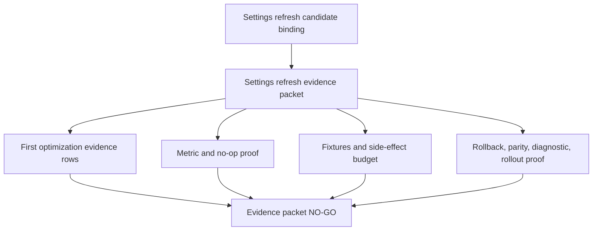

# FilterTube Settings Refresh Optimization Candidate Evidence Packet Contract - Current Behavior - 2026-05-29

Status: audit-only current-behavior settings refresh optimization candidate
evidence packet contract. Runtime behavior is unchanged. This is not a settings
refresh patch, storage listener patch, JSON-first patch, DOM fallback patch,
metric collector patch, whitelist optimization patch, release package patch,
public-claim patch, or first optimization approval.

## Purpose

The settings-refresh candidate binding matrix maps refresh rows to ranked
optimization candidates and first-optimization gates. This contract defines the
evidence packet a future scoped patch must provide before any settings refresh
optimization can move from audit to runtime behavior.

Current answer:

```text
settings refresh candidate evidence packet rows: 12
settings refresh candidate binding rows covered: 12
settings refresh readiness rows covered: 12
first optimization evidence packet rows referenced: 10
required settings refresh packet fields: 29
implementation-ready settings refresh evidence packets: 0
runtime settings refresh evidence packet approvals: 0
settings refresh evidence packet approval: NO-GO
runtime behavior changed: no
```

## Source Inputs

| Input | Current proof used |
| --- | --- |
| `docs/audit/FILTERTUBE_SETTINGS_REFRESH_OPTIMIZATION_CANDIDATE_BINDING_MATRIX_CURRENT_BEHAVIOR_2026-05-29.md` | Records 12 settings-refresh candidate bindings and 0 implementation-ready bindings. |
| `docs/audit/FILTERTUBE_SETTINGS_REFRESH_OPTIMIZATION_READINESS_BOUNDARY_CURRENT_BEHAVIOR_2026-05-29.md` | Records 12 settings refresh readiness rows and 0 runtime optimization approvals. |
| `docs/audit/FILTERTUBE_FIRST_OPTIMIZATION_PATCH_EVIDENCE_PACKET_CONTRACT_CURRENT_BEHAVIOR_2026-05-24.md` | Defines the generic first optimization evidence packet rows `FT-EVIDENCE-00` through `FT-EVIDENCE-09`. |
| `docs/audit/FILTERTUBE_FIRST_OPTIMIZATION_IMPLEMENTATION_READINESS_GATE_CURRENT_BEHAVIOR_2026-05-24.md` | Records 14 first-optimization readiness rows and 0 runtime first optimization approvals. |
| `docs/audit/FILTERTUBE_OPTIMIZATION_STOP_GO_DECISION_RECORD_CURRENT_BEHAVIOR_2026-05-24.md` | Keeps whitelist optimization and JSON-first promotion at NO-GO until measured evidence exists. |
| `docs/audit/FILTERTUBE_WHITELIST_OPTIMIZATION_READINESS_GAP_MATRIX_CURRENT_BEHAVIOR_2026-05-24.md` | Records 10 whitelist readiness gaps and 0 implementation-ready whitelist optimization rows. |

## Evidence Packet Flow

ASCII flow:

```text
settings refresh candidate binding
  -> settings-refresh evidence packet contract
  -> attach first-optimization evidence rows
  -> attach metric, fixture, no-op, side-effect, rollback, parity, and diagnostic proof
  -> current answer: 0 settings-refresh evidence packets are implementation-ready
```

Mermaid flow:



## Evidence Packet Rows

| Evidence row | Candidate binding | Required first-optimization evidence rows | Settings-refresh packet burden | Current decision |
| --- | --- | --- | --- | --- |
| `FT-SRCEP-00-scope` | `FT-SRCB-00-scope` | `FT-EVIDENCE-00-candidate-obligation-binding`, `FT-EVIDENCE-01-route-surface-mode-scope`, `FT-EVIDENCE-02-metric-artifact` | Packet must name one settings-refresh row, one candidate binding, one candidate id, one first-optimization gate set, and one metric artifact path. | `GO` for audit contract, `NO-GO` for runtime behavior. |
| `FT-SRCEP-01-applysettings-forced` | `FT-SRCB-01-applysettings-forced` | `FT-EVIDENCE-01-route-surface-mode-scope`, `FT-EVIDENCE-07-settings-mutation-profile`, `FT-EVIDENCE-04-false-hide-leak-restore` | Must prove changed-key handling, list-mode policy, forceReprocess need, no-op decision, visible blocklist/whitelist refresh, and restore safety. | `NO-GO`; forced ApplySettings cannot be pruned from current evidence. |
| `FT-SRCEP-02-refreshnow-forced` | `FT-SRCB-02-refreshnow-forced` | `FT-EVIDENCE-00-candidate-obligation-binding`, `FT-EVIDENCE-02-metric-artifact`, `FT-EVIDENCE-06-lifecycle-budget` | Must prove producer reason, target tab, background pull cost, DOM reprocess cost, and lifecycle fanout budget. | `NO-GO`; RefreshNow has no producer-specific work budget. |
| `FT-SRCEP-03-rule-ui-storage` | `FT-SRCB-03-rule-ui-storage` | `FT-EVIDENCE-03-positive-negative-fixtures`, `FT-EVIDENCE-04-false-hide-leak-restore`, `FT-EVIDENCE-07-settings-mutation-profile` | Must prove visible rule updates for blocklist, whitelist, channel rules, profile transitions, no-rule state, and negative siblings. | `NO-GO`; visible rule correctness currently depends on forced refresh. |
| `FT-SRCEP-04-channelmap-only` | `FT-SRCB-04-channelmap-only` | `FT-EVIDENCE-02-metric-artifact`, `FT-EVIDENCE-03-positive-negative-fixtures`, `FT-EVIDENCE-07-settings-mutation-profile` | Must prove map-only no-op, visible-card stale behavior, map-write provenance, and no false hide from stale channel identity. | `GATED`; possible future pruning requires stale-card proof. |
| `FT-SRCEP-05-videochannelmap-only` | `FT-SRCB-05-videochannelmap-only` | `FT-EVIDENCE-01-route-surface-mode-scope`, `FT-EVIDENCE-03-positive-negative-fixtures`, `FT-EVIDENCE-05-json-dom-native-parity` | Must prove watch, Shorts, playlist, YTM, Kids, and visible identity parity before changing non-forced refresh. | `GATED`; route/surface identity parity is missing. |
| `FT-SRCEP-06-videometamap-targeted` | `FT-SRCB-06-videometamap-targeted` | `FT-EVIDENCE-02-metric-artifact`, `FT-EVIDENCE-04-false-hide-leak-restore`, `FT-EVIDENCE-06-lifecycle-budget` | Must prove duration/date/category field effects, metadata fetch budget, targeted rerun cost, and stale marker cleanup. | `GATED`; field-effect metrics are missing. |
| `FT-SRCEP-07-seed-no-json-clear` | `FT-SRCB-07-seed-no-json-clear` | `FT-EVIDENCE-02-metric-artifact`, `FT-EVIDENCE-06-lifecycle-budget`, `FT-EVIDENCE-07-settings-mutation-profile` | Must prove snapshot clearing cannot suppress later required replay, harvest side effects, and no-work preservation. | `GATED`; replay-suppression proof is missing. |
| `FT-SRCEP-08-seed-active-replay` | `FT-SRCB-08-seed-active-replay` | `FT-EVIDENCE-02-metric-artifact`, `FT-EVIDENCE-03-positive-negative-fixtures`, `FT-EVIDENCE-05-json-dom-native-parity` | Must prove active JSON replay, duplicate replay policy, mutation budget, route/surface fixture packet, and JSON/DOM parity. | `NO-GO`; active replay mutation budget is missing. |
| `FT-SRCEP-09-observer-menu-quick` | `FT-SRCB-09-observer-menu-quick` | `FT-EVIDENCE-03-positive-negative-fixtures`, `FT-EVIDENCE-06-lifecycle-budget`, `FT-EVIDENCE-08-diagnostic-privacy` | Must prove DOM observer, menu repair, quick-block availability, prefetch, action affordance, and diagnostic budget. | `NO-GO`; lifecycle/action budgets are still split. |
| `FT-SRCEP-10-import-sync-profile` | `FT-SRCB-10-import-sync-profile` | `FT-EVIDENCE-07-settings-mutation-profile`, `FT-EVIDENCE-05-json-dom-native-parity`, `FT-EVIDENCE-09-rollout-claim-boundary` | Must prove actor trust, rollback, list revision, profile mirror, import/sync no-op, native parity, and release claim limits. | `NO-GO`; import/sync rollback and parity proof are missing. |
| `FT-SRCEP-11-diagnostic-rollout` | `FT-SRCB-11-diagnostic-rollout-binding` | `FT-EVIDENCE-02-metric-artifact`, `FT-EVIDENCE-08-diagnostic-privacy`, `FT-EVIDENCE-09-rollout-claim-boundary` | Must prove metric foundation, diagnostic privacy, artifact verification, native/release/public claim boundaries, and rollback monitoring. | `NO-GO`; first optimization still starts with metric foundation, not pruning. |

## Evidence Chain Closure

This closure table proves the audit chain is structurally complete from
settings-refresh readiness row to candidate binding row to evidence packet row.
It is not an implementation packet and does not create metric artifacts,
runtime collectors, or approval authority.

Current chain-closure answer:

```text
settings refresh evidence chain closure rows: 12
settings refresh readiness rows linked: 12
candidate binding rows linked: 12
evidence packet rows linked: 12
first optimization evidence row families referenced: 10
committed settings refresh evidence artifacts: 0
runtime settings refresh chain approvals: 0
settings refresh evidence chain closure: CHAIN-CLOSED
settings refresh implementation readiness from chain closure: NO-GO
runtime behavior changed: no
```

Chain closure rows:

| Chain row | Settings refresh readiness row | Candidate binding row | Evidence packet row | Current state |
| --- | --- | --- | --- | --- |
| `FT-SRCEC-00-scope` | `FT-SROR-00-scope` | `FT-SRCB-00-scope` | `FT-SRCEP-00-scope` | Chain linked; implementation packet absent. |
| `FT-SRCEC-01-applysettings-forced` | `FT-SROR-01-applysettings-forced-reprocess` | `FT-SRCB-01-applysettings-forced` | `FT-SRCEP-01-applysettings-forced` | Chain linked; forced refresh pruning remains `NO-GO`. |
| `FT-SRCEC-02-refreshnow-forced` | `FT-SROR-02-refreshnow-forced-reprocess` | `FT-SRCB-02-refreshnow-forced` | `FT-SRCEP-02-refreshnow-forced` | Chain linked; producer reason and target-tab budget missing. |
| `FT-SRCEC-03-rule-ui-storage` | `FT-SROR-03-rule-ui-storage-force` | `FT-SRCB-03-rule-ui-storage` | `FT-SRCEP-03-rule-ui-storage` | Chain linked; visible rule refresh proof missing. |
| `FT-SRCEC-04-channelmap-only` | `FT-SROR-04-channelmap-only-early-return` | `FT-SRCB-04-channelmap-only` | `FT-SRCEP-04-channelmap-only` | Chain linked; visible-card stale proof missing. |
| `FT-SRCEC-05-videochannelmap-only` | `FT-SROR-05-videochannelmap-nonforced-refresh` | `FT-SRCB-05-videochannelmap-only` | `FT-SRCEP-05-videochannelmap-only` | Chain linked; route/surface identity parity missing. |
| `FT-SRCEC-06-videometamap-targeted` | `FT-SROR-06-videometamap-targeted-rerun` | `FT-SRCB-06-videometamap-targeted` | `FT-SRCEP-06-videometamap-targeted` | Chain linked; metadata field-effect metrics missing. |
| `FT-SRCEC-07-seed-no-json-clear` | `FT-SROR-07-seed-no-json-clear` | `FT-SRCB-07-seed-no-json-clear` | `FT-SRCEP-07-seed-no-json-clear` | Chain linked; replay-suppression proof missing. |
| `FT-SRCEC-08-seed-active-replay` | `FT-SROR-08-seed-active-json-replay` | `FT-SRCB-08-seed-active-replay` | `FT-SRCEP-08-seed-active-replay` | Chain linked; active replay mutation budget missing. |
| `FT-SRCEC-09-observer-menu-quick` | `FT-SROR-09-observer-menu-quick-refresh` | `FT-SRCB-09-observer-menu-quick` | `FT-SRCEP-09-observer-menu-quick` | Chain linked; lifecycle/action budget missing. |
| `FT-SRCEC-10-import-sync-profile` | `FT-SROR-10-import-sync-profile-write` | `FT-SRCB-10-import-sync-profile` | `FT-SRCEP-10-import-sync-profile` | Chain linked; actor trust, rollback, and native parity missing. |
| `FT-SRCEC-11-diagnostic-rollout` | `FT-SROR-11-first-optimization-binding` | `FT-SRCB-11-diagnostic-rollout-binding` | `FT-SRCEP-11-diagnostic-rollout` | Chain linked; metric foundation and rollout proof missing. |

Chain closure decision:

```text
close settings refresh evidence chain documentation now: GO
accept chain closure as implementation-ready evidence now: NO-GO
accept chain closure as metric artifact evidence now: NO-GO
accept chain closure as collector insertion approval now: NO-GO
accept chain closure as forced refresh pruning approval now: NO-GO
accept chain closure as whitelist optimization approval now: NO-GO
accept chain closure as JSON-first promotion approval now: NO-GO
accept chain closure as release/public-claim approval now: NO-GO
continue proof-backed audit: GO
```

## Required Settings Refresh Evidence Packet Fields

```text
packetId
settingsRefreshRowId
candidateBindingRowId
optimizationCandidateId
firstOptimizationGateIds
producerPath
consumerPath
changedKeys
route
surface
profileType
listMode
ruleState
activeJsonWork
activeDomWork
activeMenuOrQuickWork
forceReprocessPolicy
mapOnlyStaleProof
seedReplayBudget
lifecycleBudget
importSyncRollbackProof
noOpDecision
metricArtifact
positiveFixture
negativeSiblingFixture
sideEffectBudget
parityReport
diagnosticPrivacyClass
rolloutClaimBoundary
```

## Current Decision

```text
define settings refresh candidate evidence packet contract: GO
approve settings refresh evidence packet authority now: NO-GO
approve forced refresh evidence packet now: NO-GO
approve map-only evidence packet now: NO-GO
approve seed replay evidence packet now: NO-GO
approve observer/menu/quick evidence packet now: NO-GO
approve import/sync evidence packet now: NO-GO
approve metric collector insertion from this contract now: NO-GO
approve whitelist optimization from this contract now: NO-GO
approve JSON-first promotion from this contract now: NO-GO
approve release/public claims from this contract now: NO-GO
runtime behavior changed by this contract: no
continue proof-backed audit: GO
```

## Missing Product Authority Symbols

No product runtime, build, script, website, manifest, CSS, source, or asset file
currently defines:

```text
settingsRefreshOptimizationCandidateEvidencePacketContract
settingsRefreshOptimizationCandidateEvidencePacket
settingsRefreshEvidencePacketApproval
settingsRefreshEvidencePacketMetricArtifact
settingsRefreshEvidencePacketNoOpDecision
settingsRefreshEvidencePacketSideEffectBudget
settingsRefreshEvidencePacketRollbackProof
settingsRefreshEvidencePacketParityReport
settingsRefreshEvidencePacketDiagnosticPrivacy
settingsRefreshEvidencePacketRuntimeApproval
settingsRefreshEvidenceChainClosure
settingsRefreshEvidenceChainRuntimeApproval
```

## Verification

Current proof command:

```bash
node --test tests/runtime/settings-refresh-optimization-candidate-evidence-packet-contract-current-behavior.test.mjs --test-reporter=spec
```

This contract is not a completion claim. It records the exact proof packet that
must exist before settings-refresh optimization can touch forced refresh,
map-only refresh, seed replay, observer/menu/quick-block work, import/sync
profile writes, metric collectors, whitelist behavior, JSON-first promotion, or
release/public claims.
