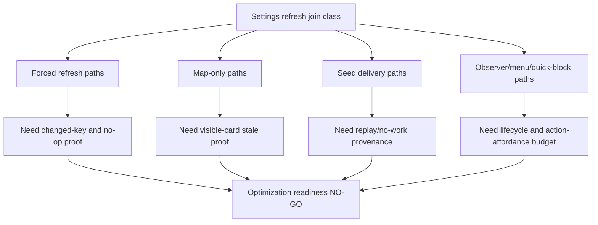
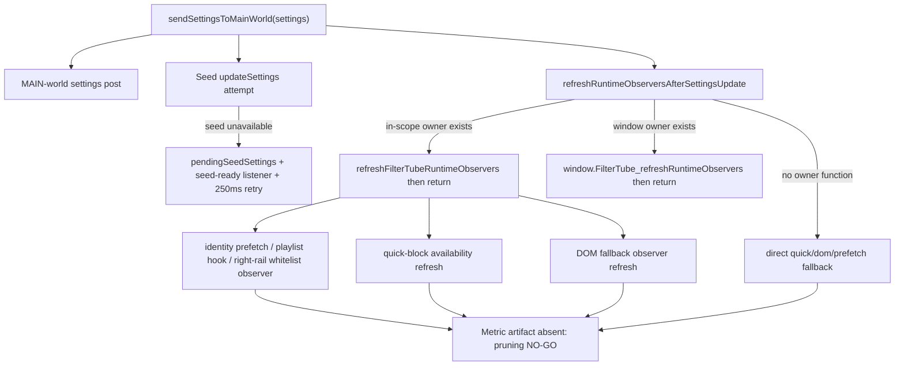

# FilterTube Settings Refresh Optimization Readiness Boundary - Current Behavior - 2026-05-29

Status: audit-only current-behavior settings refresh optimization readiness
boundary. Runtime behavior is unchanged. This is not a settings refactor,
storage-key refactor, cache optimization, JSON-first patch, DOM fallback patch,
whitelist optimization, release package patch, public-claim patch, or
first-class settings refresh optimization authority.

## Purpose

The producer-consumer join matrix proves how settings writes wake work today.
This slice classifies those joins into optimization readiness classes before any
runtime change: forced refresh paths, storage dirty-key paths, map-only paths,
seed replay paths, and observer/menu/quick-block paths do not yet share one
measured work-decision authority.

Current answer:

```text
settings refresh optimization readiness rows: 12
settings refresh readiness classes covered: 6
settings refresh blocked proof families: 8
settings refresh implementation-ready optimization rows: 0
runtime settings refresh optimization approvals: 0
settings refresh optimization readiness approval: NO-GO
runtime behavior changed: no
```

## Source Inputs

| Input | Current proof used |
| --- | --- |
| `docs/audit/FILTERTUBE_SETTINGS_REFRESH_DIRTY_KEY_PRODUCER_CONSUMER_JOIN_MATRIX_CURRENT_BEHAVIOR_2026-05-29.md` | Records end-to-end producer-consumer refresh joins and missing work-budget authority. |
| `docs/audit/FILTERTUBE_SETTINGS_REFRESH_DIRTY_KEY_PRODUCER_MATRIX_CURRENT_BEHAVIOR_2026-05-29.md` | Records producer write paths, persistence shapes, and broadcast shapes. |
| `docs/audit/FILTERTUBE_SETTINGS_REFRESH_DIRTY_KEY_CONSUMER_MATRIX_CURRENT_BEHAVIOR_2026-05-29.md` | Records dirty-key consumer fanout and special cases. |
| `tests/runtime/storage-refresh-force-reprocess-coalescing-current-behavior.test.mjs` | Records that forced storage refresh survives coalescing after map-only refreshes. |
| `docs/audit/FILTERTUBE_CONTENT_FILTER_ROUTE_SURFACE_NO_WORK_BUDGET_CURRENT_BEHAVIOR_2026-05-29.md` | Records current no-work gates and route/surface over-work gaps. |
| `docs/audit/FILTERTUBE_OPTIMIZATION_STOP_GO_DECISION_RECORD_CURRENT_BEHAVIOR_2026-05-24.md` | Keeps stop-now whitelist optimization, JSON-first promotion, and metricless optimization at NO-GO. |
| `docs/audit/FILTERTUBE_OPTIMIZATION_CANDIDATE_PRIORITY_REGISTER_CURRENT_BEHAVIOR_2026-05-24.md` | Keeps first optimization candidates source-backed but implementation-blocked. |

## Current Flow

ASCII flow:

```text
settings refresh join class
  -> forced path: ApplySettings, RefreshNow, rule/UI storage key
  -> map path: channelMap early return, video map non-forced refresh
  -> seed path: no-json clear or active-json replay
  -> observer path: runtime observers, quick-block, menu, fallback observer, prefetch
  -> optimization question
  -> current answer: every class is audit-only; 0 classes are implementation-ready
```

Mermaid flow:



## Matrix Rows

| Row | Readiness class | Current behavior | Optimization decision |
| --- | --- | --- | --- |
| `FT-SROR-00-scope` | Audit gate | Converts current settings refresh joins into optimization readiness rows. | `GO` for audit, `NO-GO` for runtime behavior change. |
| `FT-SROR-01-applysettings-forced-reprocess` | Forced refresh | `FilterTube_ApplySettings` can recompile in background, deliver settings to main world, and force DOM fallback without changed-key proof. | `NO-GO`; needs changed-key, list-mode, and no-op report. |
| `FT-SROR-02-refreshnow-forced-reprocess` | Forced refresh | `FilterTube_RefreshNow` pulls compiled settings and forces DOM fallback with no producer payload. | `NO-GO`; needs producer reason, target tab, and work budget. |
| `FT-SROR-03-rule-ui-storage-force` | Storage dirty key | Rule/UI keys schedule forced background pull and forced DOM fallback; coalescing preserves later `forceReprocess:true`. | `NO-GO`; current behavior is correctness-critical for visible blocklist/whitelist refresh. |
| `FT-SROR-04-channelmap-only-early-return` | Map-only | A single `channelMap` storage change returns early in content bridge and StateManager. | `GATED`; possible future optimization only after visible-card stale-proof. |
| `FT-SROR-05-videochannelmap-nonforced-refresh` | Map-only | A single `videoChannelMap` change refreshes settings/observers but avoids forced DOM fallback. | `GATED`; needs Shorts/watch/playlist stale identity fixtures. |
| `FT-SROR-06-videometamap-targeted-rerun` | Map-only plus targeted DOM | Video metadata writes can touch cards and debounce a rerun, while storage listener treats the map key as non-forced. | `GATED`; needs duration/date/category field-effect metrics. |
| `FT-SROR-07-seed-no-json-clear` | Seed no-work | Settings delivery clears queued/raw seed data when no active JSON work exists. | `GATED`; needs proof that clearing snapshots cannot suppress a later required replay. |
| `FT-SROR-08-seed-active-json-replay` | Seed active work | Active JSON work replays queued and raw `ytInitialData` / player snapshots through installed setters. | `NO-GO`; needs duplicate replay, mutation, and route/surface budget. |
| `FT-SROR-09-observer-menu-quick-refresh` | Lifecycle fanout | Settings delivery refreshes runtime observers, quick-block availability, DOM fallback observer, and prefetch scan without a per-key budget. | `NO-GO`; needs lifecycle/action-affordance budget. |
| `FT-SROR-10-import-sync-profile-write` | Import/sync | IO, backup/import, and Nanah can write profile objects and rely on storage listeners or caller refresh. | `NO-GO`; needs actor trust, rollback, profile/list revision, and no-op proof. |
| `FT-SROR-11-first-optimization-binding` | Candidate binding | Existing optimization candidates remain source-backed but not implementation-ready. | `NO-GO`; first future patch must cite one candidate, one obligation, metric artifact, fixtures, side-effect budget, and rollback proof. |

## Readiness Classification Closure

This closure table proves the audit chain is structurally complete from the
settings-refresh producer-consumer join rows into the 12 optimization readiness
rows. It is not a runtime work-decision report and does not approve pruning,
collector insertion, or behavior changes.

Current classification-closure answer:

```text
settings refresh readiness classification closure rows: 12
producer-consumer join rows linked by readiness closure: 14
settings refresh readiness rows linked by readiness closure: 12
settings refresh readiness classes linked by closure: 6
settings refresh blocked proof families linked by closure: 8
runtime settings refresh readiness classification approvals: 0
implementation-ready readiness classification rows: 0
settings refresh readiness classification closure: READINESS-CHAIN-CLOSED
settings refresh implementation readiness from classification closure: NO-GO
runtime behavior changed: no
```

Readiness classification closure rows:

| Closure row | Producer-consumer join row(s) | Readiness row | Readiness class | Current state |
| --- | --- | --- | --- | --- |
| `FT-SRORC-00-scope` | `FT-SRDJ-00-scope` | `FT-SROR-00-scope` | Audit gate | Chain linked; runtime work-decision report absent. |
| `FT-SRORC-01-applysettings-forced` | `FT-SRDJ-01-shared-save-applysettings`, `FT-SRDJ-02-direct-profile-save-requestrefresh` | `FT-SROR-01-applysettings-forced-reprocess` | Forced refresh | Chain linked; changed-key, list-mode, no-op, and side-effect proof missing. |
| `FT-SRORC-02-refreshnow-forced` | `FT-SRDJ-03-background-set-list-mode-refreshnow`, `FT-SRDJ-04-background-batch-whitelist-import-refreshnow` | `FT-SROR-02-refreshnow-forced-reprocess` | Forced refresh | Chain linked; producer reason, target tab, and work budget missing. |
| `FT-SRORC-03-rule-ui-storage` | `FT-SRDJ-05-single-channel-rule-mutation-storage-listener`, `FT-SRDJ-06-filter-all-toggle-storage-listener` | `FT-SROR-03-rule-ui-storage-force` | Storage dirty key | Chain linked; visible blocklist/whitelist refresh proof missing. |
| `FT-SRORC-04-channelmap-only` | `FT-SRDJ-07-channel-map-only-producer-consumer`, `FT-SRDJ-10-content-bridge-custom-url-map` | `FT-SROR-04-channelmap-only-early-return` | Map-only | Chain linked; visible-card stale proof and sender/source trust missing. |
| `FT-SRORC-05-videochannelmap-only` | `FT-SRDJ-08-video-channel-map-only-producer-consumer` | `FT-SROR-05-videochannelmap-nonforced-refresh` | Map-only | Chain linked; Shorts/watch/playlist visible identity parity missing. |
| `FT-SRORC-06-videometamap-targeted` | `FT-SRDJ-09-video-meta-map-only-producer-consumer` | `FT-SROR-06-videometamap-targeted-rerun` | Map-only plus targeted DOM | Chain linked; duration/date/category field-effect metrics missing. |
| `FT-SRORC-07-seed-no-json-clear` | `FT-SRDJ-12-seed-json-active-vs-no-work` | `FT-SROR-07-seed-no-json-clear` | Seed no-work | Chain linked; replay-suppression proof missing. |
| `FT-SRORC-08-seed-active-replay` | `FT-SRDJ-12-seed-json-active-vs-no-work` | `FT-SROR-08-seed-active-json-replay` | Seed active work | Chain linked; duplicate replay, mutation, and route/surface budget missing. |
| `FT-SRORC-09-observer-menu-quick` | `FT-SRDJ-13-observer-menu-quick-work-budget` | `FT-SROR-09-observer-menu-quick-refresh` | Lifecycle fanout | Chain linked; lifecycle/action-affordance budget missing. |
| `FT-SRORC-10-import-sync-profile` | `FT-SRDJ-11-import-sync-profile-write` | `FT-SROR-10-import-sync-profile-write` | Import/sync | Chain linked; actor trust, rollback, profile/list revision, and no-op proof missing. |
| `FT-SRORC-11-first-optimization-binding` | `FT-SRDJ-00-scope` | `FT-SROR-11-first-optimization-binding` | Candidate binding | Chain linked; metric artifact, fixture, side-effect, rollback, and parity proof missing. |

Readiness classification closure decision:

```text
close settings refresh readiness classification documentation now: GO
accept readiness classification closure as settings refresh optimization approval now: NO-GO
accept readiness classification closure as forced refresh pruning approval now: NO-GO
accept readiness classification closure as map-only pruning approval now: NO-GO
accept readiness classification closure as seed replay pruning approval now: NO-GO
accept readiness classification closure as observer/menu/quick pruning approval now: NO-GO
accept readiness classification closure as import/sync pruning approval now: NO-GO
accept readiness classification closure as metric collector insertion approval now: NO-GO
accept readiness classification closure as whitelist optimization approval now: NO-GO
accept readiness classification closure as JSON-first promotion approval now: NO-GO
accept readiness classification closure as release/public-claim approval now: NO-GO
continue proof-backed audit: GO
```

## Current Readiness Classes

```text
blocked forced-refresh classes:
  ApplySettings, RefreshNow, rule/UI storage keys

gated map-only classes:
  channelMap-only, videoChannelMap-only, videoMetaMap-only

blocked lifecycle classes:
  observer refresh, quick-block availability, menu/fallback observer, prefetch

blocked import/sync classes:
  IO import, backup import, Nanah profile writes

blocked seed active-work classes:
  queued/raw ytInitialData and ytInitialPlayerResponse replay

gated seed no-work classes:
  no-active-JSON snapshot clear
```

## Settings Refresh Runtime Fanout Detail - 2026-05-30

This addendum expands `FT-SROR-09-observer-menu-quick-refresh` from a broad
lifecycle row into concrete current-source fanout. It is audit-only. It does
not prune refreshes, change settings delivery, change JSON replay, change
quick-block behavior, change menu behavior, change DOM fallback behavior, add
metric collectors, or approve whitelist optimization.

Current fanout answer:

```text
settings refresh runtime fanout detail rows: 9
settings delivery seed retry delay: 250ms
settings observer owner-return paths: 2
settings direct fallback fanout calls: 3
committed settings refresh fanout metric artifacts: 0
observer/menu/quick fanout pruning approval: NO-GO
runtime behavior changed by this fanout detail: no
```

ASCII flow:

```text
sendSettingsToMainWorld(settings)
  -> post settings to MAIN world
  -> try seed.updateSettings(settings)
     -> if unavailable: store pending settings, attach seed-ready listener, retry every 250ms
  -> refreshRuntimeObserversAfterSettingsUpdate()
     -> prefer in-scope refreshFilterTubeRuntimeObservers() and return
     -> else prefer window.FilterTube_refreshRuntimeObservers() and return
     -> else directly force quick-block, DOM fallback observer, and prefetch scan

refreshFilterTubeRuntimeObservers()
  -> identity prefetch work gate
  -> playlist panel prefetch hook / right-rail whitelist observer when applicable
  -> force quick-block availability refresh
  -> refresh DOM fallback observer
```

Mermaid flow:



Fanout detail rows:

| Fanout row | Source owner | Current behavior | Optimization boundary |
| --- | --- | --- | --- |
| `FT-SRFO-00-settings-main-world-post` | `js/content/bridge_settings.js::sendSettingsToMainWorld` | Updates isolated-world settings and posts `FilterTube_SettingsToInjector` to MAIN world. | Cannot be skipped without proving injector, seed, and DOM fallback all have fresh settings. |
| `FT-SRFO-01-seed-direct-update` | `js/content/bridge_settings.js::tryApplySettingsToSeed` | Calls `window.filterTube.updateSettings(settings)` when seed is ready. | Cannot be merged with DOM refresh until JSON replay/no-work behavior is measured. |
| `FT-SRFO-02-seed-pending-retry` | `js/content/bridge_settings.js::ensureSeedReadyListener`, `scheduleSeedRetry` | Stores pending seed settings, listens for `filterTubeSeedReady`, and retries every 250 ms while pending settings remain. | Needs retry cap, seed-ready timing, and no-work replay-suppression proof before pruning. |
| `FT-SRFO-03-owner-return-selection` | `js/content/bridge_settings.js::refreshRuntimeObserversAfterSettingsUpdate` | Calls the first available runtime observer owner and returns before direct fallback calls. | Any optimization must preserve owner precedence and direct-fallback behavior. |
| `FT-SRFO-04-identity-prefetch-fanout` | `js/content_bridge.js::refreshFilterTubeRuntimeObservers`, `schedulePrefetchScan` | Starts card prefetch observation only when identity prefetch work is needed; otherwise clears the prefetch queue. | Needs route/surface/list-mode identity budget before changing prefetch scheduling. |
| `FT-SRFO-05-playlist-and-rail-observers` | `js/content_bridge.js::installPlaylistPanelPrefetchHook`, `installRightRailWhitelistObserver` | May install playlist scroll/mutation hooks or right-rail whitelist mutation/timer refreshes. | Needs watch/non-watch whitelist and playlist route metrics before pruning. |
| `FT-SRFO-06-quick-block-refresh` | `window.FilterTube_refreshQuickBlockAvailability` | Forces quick-block availability refresh from settings fanout when available. | Needs explicit action-affordance proof so quick-cross/menu controls do not disappear. |
| `FT-SRFO-07-dom-fallback-observer-refresh` | `window.FilterTube_refreshDOMFallbackObserver` | Refreshes DOM fallback observation after settings delivery. | Needs DOM fallback route/surface parity before deleting or deferring observer refresh. |
| `FT-SRFO-08-metric-artifact-gap` | settings-refresh optimization gate | No committed metric artifact records the per-route cost of these fanout paths. | Observer/menu/quick pruning remains `NO-GO`; first optimization still requires metric artifact proof. |

Fanout pruning decision:

```text
define settings refresh fanout detail now: GO
accept fanout detail as metric artifact now: NO-GO
accept fanout detail as seed retry pruning approval now: NO-GO
accept fanout detail as identity prefetch pruning approval now: NO-GO
accept fanout detail as right-rail whitelist observer pruning approval now: NO-GO
accept fanout detail as quick-block availability pruning approval now: NO-GO
accept fanout detail as DOM fallback observer pruning approval now: NO-GO
accept fanout detail as whitelist optimization approval now: NO-GO
accept fanout detail as JSON-first promotion approval now: NO-GO
runtime behavior changed by this fanout detail: no
```

## Required Proof Before Any Settings Refresh Optimization

```text
candidateId
producerPath
consumerPath
changedKeys
profileType
listMode
ruleState
route
surface
activeJsonWork
activeDomWork
activeMenuOrQuickWork
mapOnlyClass
noOpDecision
visibleCardStaleProof
positiveFixture
negativeSiblingFixture
metricArtifact
rollbackProof
```

## Current Decision

```text
define settings refresh optimization readiness boundary: GO
approve settings refresh optimization authority now: NO-GO
approve forced refresh pruning now: NO-GO
approve map-only refresh pruning now: NO-GO
approve seed replay pruning now: NO-GO
approve observer/menu/quick-block pruning now: NO-GO
approve import/sync refresh pruning now: NO-GO
approve broad whitelist optimization from settings refresh readiness: NO-GO
approve JSON-first promotion from settings refresh readiness: NO-GO
runtime behavior changed by this boundary: no
continue proof-backed audit: GO
```

## Missing Product Authority Symbols

No product runtime, build, script, website, manifest, CSS, source, or asset file
currently defines:

```text
settingsRefreshOptimizationReadinessBoundary
settingsRefreshOptimizationDecisionReport
settingsRefreshForcedRefreshBudget
settingsRefreshMapOnlyStaleProof
settingsRefreshSeedReplayOptimizationBudget
settingsRefreshLifecycleFanoutBudget
settingsRefreshImportSyncNoOpReport
settingsRefreshVisibleCardStaleProof
settingsRefreshOptimizationMetricArtifact
settingsRefreshOptimizationRollbackReport
settingsRefreshReadinessClassificationClosure
settingsRefreshReadinessClassificationRuntimeApproval
settingsRefreshReadinessClassificationImplementationReadiness
```

## Verification

Current proof command:

```bash
node --test tests/runtime/settings-refresh-optimization-readiness-boundary-current-behavior.test.mjs --test-reporter=spec
```

This boundary is not a completion claim. It records that settings-refresh
optimization remains blocked until a future scoped patch proves its producer,
consumer, route, surface, mode, rule-state, no-op, metric, side-effect, fixture,
and rollback evidence without weakening blocklist, whitelist, channel blocking,
JSON filtering, menus, quick-block, YTM, Kids, comments, import/sync, or
installed-extension behavior.
