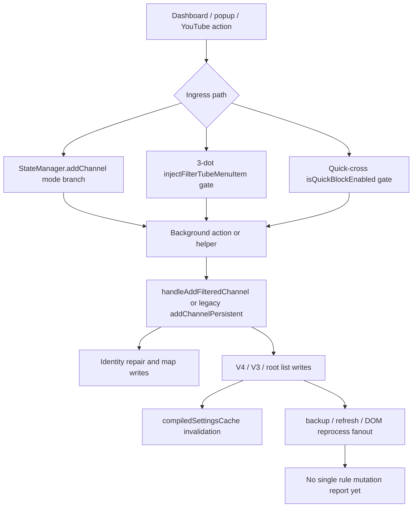

# FilterTube Single Channel Rule Mutation Persistence Boundary Current Behavior - 2026-05-22

Status: current-behavior proof slice. Updated after the 2026-05-31 receiver
fix that forwards explicit secondary `addFilteredChannel` list targets.

This slice narrows the single-channel allow/block mutation boundary after the
batch whitelist import and list-mode transition slices. It covers the paths that
add one channel row from UI state, content quick-block flows, Kids native block
flows, direct background actions, and the shared persistence helper. These paths
are high-risk for JSON-first filtering because they decide list target, profile,
network identity repair, storage writes, cache invalidation, backup scheduling,
and whether a later JSON decision sees a blocklist or whitelist row.

## Source Fingerprints

| File | Lines | Bytes | SHA-256 |
| --- | ---: | ---: | --- |
| `js/background.js` | 6641 | 298986 | `837cc8e438b30f53cc14da0317262a0ed5e7c5ae2ece0026611a3963767ae6fd` |
| `js/state_manager.js` | 2,491 | 99,780 | `509c559e35989c13cdded17c01eeaca8115addcd3848dbcda41514422e5bc7b6` |
| `js/content_bridge.js` | 13,636 | 604,184 | `8d55d0c8995e5b68bb9142c41f95046a676f5af2b83f8545b00f91a6a5a3776d` |

## Source/Effect Blocks Pinned

```text
3 single-channel rule mutation persistence source files
9 source/effect blocks

StateManager addChannel block: 75 lines, 3276 bytes
StateManager addKidsChannel block: 79 lines, 3400 bytes
background addWhitelistChannelPersistent block: 40 lines, 1329 bytes
background FilterTube_KidsWhitelistChannel block: 54 lines, 2107 bytes
background FilterTube_KidsBlockChannel block: 43 lines, 1769 bytes
background addChannelPersistent action block: 287 lines, 13345 bytes
background secondary addFilteredChannel receiver block: 39 lines, 1579 bytes
background handleAddFilteredChannel block: 894 lines, 45226 bytes
content_bridge addChannelDirectly block: 55 lines, 2662 bytes

selected background mutation tokens:
  isTrustedUiSender: 2
  isProfileSessionAuthorized: 0
  handleAddFilteredChannel: 5
  addChannelPersistent: 1
  addFilteredChannel: 1
  storage.local.set: 5
  browserAPI.storage.local.set: 5
  compiledSettingsCache: 2
  scheduleAutoBackupInBackground: 5
  FilterTube_RefreshNow: 1
  tabs.query: 1
  sendMessageToTabQuietly: 1
  channelMap: 39
  fetchChannelInfo: 6
  performWatchIdentityFetch: 7
  performKidsWatchIdentityFetch: 3
  performShortsIdentityFetch: 2
  enqueueChannelMapUpdate: 2
  enqueueVideoChannelMapUpdate: 1
  schedulePostBlockEnrichment: 1
  targetListType: 17
  whitelistChannels: 12
  blockedChannels: 8
  filterChannels: 7
  ftProfilesV3: 5
  FT_PROFILES_V4_KEY: 6
  sendResponse: 20
```

## Runtime Fixtures Pinned

```text
state_manager_add_channel_chooses_background_action_from_main_mode
state_manager_add_kids_channel_chooses_background_action_from_kids_mode
main_whitelist_single_add_is_trusted_sender_gated_but_not_session_locked
kids_whitelist_single_add_is_trusted_sender_gated_but_not_session_locked
kids_block_single_add_uses_background_helper_without_trusted_sender_gate
legacy_addChannelPersistent_uses_separate_inline_persistence_path
secondary_addFilteredChannel_forwards_explicit_list_type
handle_add_filtered_channel_writes_v4_v3_root_maps_and_cache_invalidation
content_bridge_addChannelDirectly_schedules_a_second_backup_request_after_success
```

## Current Findings

| Boundary | Current behavior | Current proof | Risk before JSON-first or optimization work |
| --- | --- | --- | --- |
| Main UI channel add | `StateManager.addChannel()` chooses `addWhitelistChannelPersistent` when `state.mode === 'whitelist'`; otherwise it sends `addChannelPersistent`. | `tests/runtime/single-channel-rule-mutation-persistence-boundary-current-behavior.test.mjs` | List target is inferred from current UI state, not from one shared mutation authority. |
| Kids UI channel add | `StateManager.addKidsChannel()` chooses `FilterTube_KidsWhitelistChannel` when Kids mode is whitelist; otherwise it sends `FilterTube_KidsBlockChannel`. | Same runtime test. | Kids Main parity is split across separate action names and sender gates. |
| Main whitelist single add | `addWhitelistChannelPersistent` checks `isTrustedUiSender(sender)`, validates input, then calls `handleAddFilteredChannel(..., 'main', '', 'whitelist')` and schedules `whitelist_channel_added` backup on success. | Same runtime test. | It has trusted UI sender gating, but the pinned block has no session authorization check or mutation report. |
| Kids whitelist single add | `FilterTube_KidsWhitelistChannel` checks `isTrustedUiSender(sender)`, builds input from channel identity or `watch:<videoId>`, calls the helper with profile `kids` and list type `whitelist`, and schedules `kids_whitelist_channel_added`. | Same runtime test. | It is sender-gated but still not profile-session gated in the pinned block. |
| Kids block single add | `FilterTube_KidsBlockChannel` calls `handleAddFilteredChannel(..., 'kids', rawVideoId)` and relies on the helper default `listType = 'blocklist'`. The pinned block has no local `isTrustedUiSender(sender)` token. | Same runtime test. | Kids block and Kids whitelist do not share the same sender policy. |
| Legacy Main block add | `addChannelPersistent` is a separate inline background implementation. It normalizes input, reads root storage, fetches channel info, writes `filterChannels`, may write V4, may write `channelMap`, schedules `channel_added`, and does not call `handleAddFilteredChannel()`. | Same runtime test. | Main blocklist single-add behavior is not the same code path as whitelist, Kids, or content quick-block additions. |
| Content quick-block add | `content_bridge.addChannelDirectly()` sends `type: 'addFilteredChannel'` with profile inferred from hostname. The secondary background receiver now normalizes `message.listType` and forwards explicit `whitelist` requests to `handleAddFilteredChannel()`; callers that omit `listType` still default to blocklist. | Same runtime test. | Content quick-block remains blocklist-shaped today, but the receiver no longer drops an explicit list target from list-aware callers. |
| Shared helper persistence | `handleAddFilteredChannel()` normalizes URL/handle/UC/custom URL input, can call channel page fetch and watch/Shorts/Kids identity fetches, updates channel/video maps, writes V4, V3, root blocklist mirrors, or whitelist rows depending on `profile` and `targetListType`, invalidates both compiled caches, and may schedule post-block enrichment. | Same runtime test. | This helper mixes network identity repair, schema writes, cache invalidation, and future enrichment; optimization changes need side-effect budgets. |
| Backup duplication | The secondary background receiver schedules backup after success, and `content_bridge.addChannelDirectly()` can also send `FilterTube_ScheduleAutoBackup` after the same success response. | Same runtime test. | Backup scheduling is not owned by one mutation report, so side-effect counts can drift. |

## Required Future Authority Before Behavior Changes

No product runtime source currently defines:

```text
singleChannelRuleMutationPersistenceContract
singleChannelRuleMutationReport
singleChannelRuleMutationSenderPolicy
singleChannelRuleMutationProfileLockReport
singleChannelRuleMutationListTypePolicy
singleChannelRuleMutationStorageWriteReport
singleChannelRuleMutationCacheInvalidationReport
singleChannelRuleMutationNetworkBudget
singleChannelRuleMutationBackupPolicy
singleChannelRuleMutationPostEnrichmentPolicy
singleChannelRuleMutationFixtureProvenance
singleChannelRuleMutationMetricArtifact
```

## Current Verdict

```text
Single-channel rule mutation persistence is proof-pinned.
Main, Kids, content quick-block, and legacy background additions do not share one mutation path.
Trusted sender and profile-session gates are inconsistent across sibling single-row channel additions.
Runtime behavior changed by the 2026-05-31 receiver fix: explicit addFilteredChannel listType is now forwarded.
```

## Menu And Quick-Block Rule Mutation Ingress Snapshot - 2026-05-27

This dated snapshot ties the release-facing quick-cross and 3-dot menu action
paths back to the single-channel mutation persistence boundary. It is
audit-only. It does not change quick-block behavior, menu behavior, blocklist
behavior, whitelist behavior, cache invalidation, or storage writes.

```text
visible user action
        |
        +--> dashboard/popup add channel
        |       |
        |       +--> action chosen from current list mode
        |
        +--> YouTube 3-dot menu action
        |       |
        |       +--> injected only when blocklist menu action is allowed
        |
        +--> quick-cross action
                |
                +--> disabled in whitelist mode, preserved for empty blocklist
        |
        v
background channel mutation path
        |
        +--> identity repair / map writes
        +--> V4/V3/root storage writes
        +--> compiled cache invalidation
        +--> backup scheduling / refresh fanout
```



| Ingress boundary | Source proof | Current behavior | Missing authority before behavior changes |
| --- | --- | --- | --- |
| Quick-cross enabled gate | `js/content/block_channel.js:1205-1222` | Requires settings, enabled state, `showQuickBlockButton === true`, and not whitelist mode; keeps the first-rule affordance alive for empty blocklists. | Route/surface action report proving why quick-cross work is allowed. |
| Quick-cross mutation handoff | `js/content/block_channel.js:1648-1748` | Preferentially calls `handleBlockChannelClick`; fallback sends `type: 'addFilteredChannel'` with profile from host, then can hide immediately and rerun DOM fallback. | One quick-action mutation report covering list target, profile, optimistic hide, backup, and refresh. |
| 3-dot menu injected gate | `js/content_bridge.js:10517-10529` | Returns in whitelist mode and clears FilterTube menu rows when `showBlockMenuItem === false`. | A repeated downstream mutation gate or signed action token for stale/synthetic menu rows. |
| 3-dot block handler | `js/content_bridge.js:11985-12054` | Derives filter-all from the DOM toggle, captures card identity, and prepares optimistic hide state before later persistence. | Menu action actor/list-target/profile/optimistic-hide decision artifact. |
| Direct content mutation payload | `js/content_bridge.js:13219-13237` | Sends `type: 'addFilteredChannel'`, inferred profile, filter-all metadata, collaborator data, and schedules a second backup on success. | Explicit list target and single backup ownership. |
| Dashboard Main add | `js/state_manager.js:1635-1653` | Chooses `addWhitelistChannelPersistent` in whitelist mode and `addChannelPersistent` otherwise; whitelist success triggers `requestRefresh('main')`. | UI mutation report with active profile, list target, storage keys, and refresh requirement. |
| Dashboard Main remove | `js/state_manager.js:1856-1869` | In whitelist mode mutates `whitelistChannels`, persists Main profiles, requests refresh, and schedules backup. | Shared add/remove rule mutation authority with rollback and no-op proof. |
| Background Main whitelist add | `js/background.js:3518-3544` | Calls shared helper with profile `main` and list type `whitelist`, then schedules `whitelist_channel_added` backup. | Session/actor/list-target proof and backup dedupe. |
| Background legacy block add | `js/background.js:4205-4372` | Separate inline path reads storage, fetches channel details, writes channel map/V4/root mirrors, and schedules `channel_added`. | Parity proof before replacing with the shared helper. |
| Shared helper storage/cache fanout | `js/background.js:5309-6192` | Handles input normalization, identity repair, map writes, V4/V3/root writes, both compiled-cache invalidations, and post-block enrichment. | Rule mutation side-effect budget and revisioned storage/cache report. |

Current rule mutation ingress decision:

```text
menu/quick rule mutation ingress authority: NO-GO
single-channel list-target authority: NO-GO
single-channel side-effect budget authority: NO-GO
runtime behavior changed by this addendum: no
```

The release fix restored the quick-cross and menu behavior that users exercise
manually, but these paths are still policy-split. Dashboard actions choose
blocklist versus whitelist from StateManager mode; injected menu actions rely
on an entry gate; quick-cross is blocklist-only and can call the same menu
handler or a direct fallback; background has both a legacy inline block path
and a shared helper. A future optimization must keep all of those paths
consistent before changing JSON-first filtering, DOM fallback, cache
invalidation, or list-mode semantics.

This does not close settings-mode, rule-mutation, profile-lock, storage/cache,
network, backup, false-hide/leak, performance, code-burden, cross-feature, or
JSON-first rows. It adds current-behavior evidence only.

## Method Semantic Proof Gap Boundary

`docs/audit/FILTERTUBE_METHOD_SEMANTIC_PROOF_GAP_INDEX_CURRENT_BEHAVIOR_2026-05-25.md`
is a required source input before this single-channel rule mutation persistence
boundary can support runtime optimization or JSON-first promotion. Current
proof pins:

```text
method semantic proof gap files covered: 69
method semantic proof gap lexical callables covered: 5789
files with complete per-callable semantic proof: 0
lexical callables requiring semantic proof before behavior changes: 5789
affected callable semantic proof: NO-GO
runtime behavior changed: no
```

These counts are audit-only blockers. They do not approve runtime
optimization, JSON-first behavior, method deletion, method merging, lifecycle
cleanup, no-work changes, or whitelist behavior changes.
