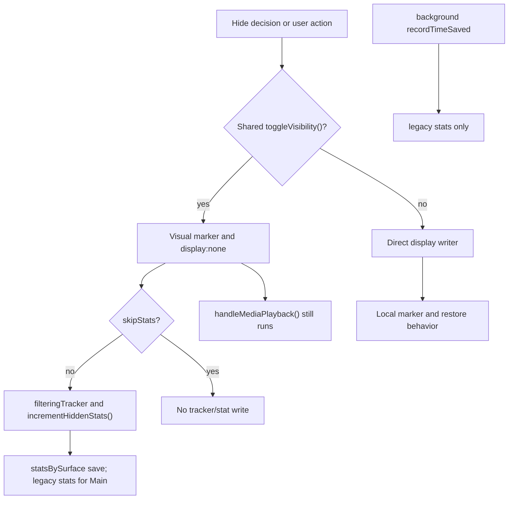

# FilterTube Stats / Time-Saved Authority Audit - 2026-05-18

Status: current-behavior audit. This is not an implementation patch.

This pass isolates the stats and time-saved surface because it is coupled to
the same hide operations that can cause false-hide, no-rule, or performance
symptoms. The core product behavior should be filtering correctness first;
stats must be a consequence of a proven hide decision, not another independent
runtime authority.

## Current Authority Shape

```text
shared hide helper
  |
  +--> class/inline display mutation
  +--> filteringTracker hide/restore record
  +--> increment/decrement stats
  +--> media pause/resume side effects
  |
  +--> content bridge saveStats()
        |
        +--> statsBySurface[surface]
        +--> legacy stats for main

background recordTimeSaved message
  |
  +--> caller seconds
  +--> legacy stats.savedSeconds only

dashboard
  |
  +--> StateManager state.statsBySurface
  +--> fallback state.stats for Main
```

The main finding is split stats authority. Runtime hide paths, background
message paths, dashboard read paths, and storage reload paths do not use one
shared metric contract.

## Hide Path Stats Coupling

Source reference: `js/content/dom_helpers.js:67-148`.

`toggleVisibility()` currently owns more than visual state:

- adds/removes `.filtertube-hidden`,
- writes/removes `data-filtertube-hidden`,
- sets/removes inline `display`,
- records hide/restore with `filteringTracker`,
- increments/decrements hidden stats,
- pauses/resumes media through `handleMediaPlayback()`.

`skipStats` suppresses `filteringTracker` and stats calls, but it does not
suppress media side effects. A future no-rule or cleanup optimization therefore
cannot reason about stats separately from media/player behavior until the hide
side-effect contract is explicit.

## Content Bridge Stats Behavior

Source references:

- `js/content_bridge.js:3668-3697` initializes stats from `statsBySurface` and
  falls back to legacy `stats` for Main.
- `js/content_bridge.js:3699-3748` classifies the content type for stats.
- `js/content_bridge.js:3782-3853` increments hidden count and time-saved state.
- `js/content_bridge.js:3855-3876` decrements stats when a counted element is
  restored.
- `js/content_bridge.js:3878-3915` writes `statsBySurface` and legacy `stats`
  for Main.

Current boundary checks exist inside `incrementHiddenStats()`:

- shelf/playlist/mix containers are ignored,
- rows with no watch/Shorts link are ignored,
- common layout headers such as `Unknown`, `Albums`, and `Results for` are
  ignored.

Those checks reduce bad counting, but they happen after a hide side effect has
already been requested. The stats code still trusts the caller that a valid
hide happened and that the element belongs to the intended surface/route.

## Background Record-Time Path

Source reference: `js/background.js:4423-4434`.

The background `recordTimeSaved` branch currently:

- accepts `request.seconds`,
- adds it directly into `stats.savedSeconds`,
- writes only legacy `stats`,
- has no sender class check,
- has no finite, positive, maximum, or surface validation,
- does not update `statsBySurface`.

That branch may be legacy or low-impact, but it is still a second stats writer.
It should be treated as part of the same mutation authority problem as learned
identity maps and caller-supplied runtime settings.

## Surface Storage Shape

Source references:

- `js/settings_shared.js:51-52` includes `stats` and `statsBySurface` in shared
  setting keys.
- `js/settings_shared.js:729-730` loads both stats shapes into UI state.
- `js/state_manager.js:89-90` has defaults for both stats shapes.
- `js/state_manager.js:242-244` loads both shapes.
- `js/state_manager.js:1009-1055` ordinary `saveSettings()` does not write
  stats, which is a useful separation from rule saves.
- `js/state_manager.js:2358-2398` external reload watches `stats` but currently
  omits `statsBySurface`.

Current verdict:

- ordinary settings saves do not directly overwrite stats,
- content runtime writes surface-aware stats,
- the UI can miss a pure `statsBySurface` storage change unless another watched
  key changes,
- legacy `stats` can still be mutated independently by background messages.

## Dashboard Read Path

Source reference: `js/tab-view.js:10740-10955`.

The dashboard reads stats through `getDashboardSurfaceStats(surface, state)`.
It prefers `state.statsBySurface[surface]`, falls back to `state.stats` for
Main, and formats `savedSeconds` defensively for display.

The display formatter clamps negative and non-finite values at render time, but
that is not storage authority. Bad metric values should be rejected before they
enter storage, not only hidden in the dashboard.

## Why This Matters For The Reported Disease

The user-visible disease is not "stats are wrong" by itself. The disease is
that false hide, empty-install work, and runtime side effects are currently
entangled.

If a broad DOM selector or stale predicate hides the wrong item:

1. the item can disappear,
2. media can be paused/resumed,
3. hide tracker state can be recorded,
4. hidden count and time-saved can increase,
5. dashboard stats can make the false hide look like successful filtering.

That makes debugging harder and can make performance/false-hide bugs look like
legitimate product activity.

## Hide/Stats Side-Effect Snapshot - 2026-05-27

This current-source checkpoint pins the hide and stats side effects that are
still coupled after the release-lag fixes. It is documentation only; it does
not change runtime behavior.

```text
hide request
        |
        +--> shared toggleVisibility()
        |       + visual marker and display:none
        |       + tracker/stat writes when skipStats is false
        |       + media pause/autoplay side effects regardless of skipStats
        |
        +--> direct display writer
        |       + local marker/restore behavior
        |       + no shared stats/media/write-policy report
        |
        +--> stats storage
                + statsBySurface for current surface
                + legacy stats mirror for Main only
                + background recordTimeSaved legacy writer remains separate
```



| Side-effect path | Current source | Current behavior pinned | Remaining risk |
| --- | --- | --- | --- |
| Shared hide helper | `js/content/dom_helpers.js:67-148` | Adds/removes visual markers and inline display; tracker/stat writes are behind `!skipStats`; `handleMediaPlayback()` runs on hide and restore outside the `skipStats` checks. | A future cleanup/no-rule optimization cannot treat `skipStats` as a full side-effect off switch. |
| Whitelist pending hide | `js/content_bridge.js:6090-6120` | Directly adds hidden markers, `data-filtertube-whitelist-pending`, and inline `display:none` while identity is pending. | Needs TTL, identity-outcome, restore owner, and no false success stat proof before policy changes. |
| Content stats increment | `js/content_bridge.js:3786-3853` | Performs local layout/link/type rejects, then increments count/time and writes `data-filtertube-time-saved` before `saveStats()`. | Still trusts that the caller supplied a valid hide decision; no `hideDecisionId` or route-scoped authority exists. |
| Content stats restore | `js/content_bridge.js:3859-3875` | Decrements only from the element's `data-filtertube-time-saved` value. | Prior-counted state is stored on a reusable DOM node, not in a shared restore authority. |
| Surface stats storage | `js/content_bridge.js:3881-3913` | Writes `statsBySurface[surface]` and mirrors legacy `stats` only for Main. | Storage writes are not yet batched behind a stats write authority. |
| Media side effects | `js/content_bridge.js:3917-3933`; `js/content/dom_helpers.js:107,147` | Pauses media on hide and restores autoplay state on unhide; shared helper calls it even when `skipStats` is true. | Media engagement budget remains separate from stats correctness and still needs owner/max-per-navigation proof. |
| Current watch owner block | `js/content/dom_fallback.js:819-875` | Can pause the player, hide a selected playlist row with `skipStats`, and click the next allowed playlist item. | Powerful route-specific behavior needs explicit playback/navigation policy proof before further optimization. |
| Background time writer | `js/background.js:4449-4458` | Adds caller-provided seconds to legacy `stats.savedSeconds` only. | No sender, finite/positive/max, surface, or `statsBySurface` validation on this legacy path. |

Current approval state:

```text
hide/stats side-effect policy approval: NO-GO
media side-effect budget approval: NO-GO
background recordTimeSaved authority approval: NO-GO
runtime behavior changed by this addendum: no
```

## Required Future Contract

Add one implementation-neutral stats side-effect report before changing stats
or hide behavior:

```text
statsSideEffectAuthority({
  actorClass,
  surface: "main" | "kids" | "ytm",
  route,
  profileId,
  source: "dom-hide" | "background-message" | "import" | "migration",
  hideDecisionId,
  elementKind,
  videoId,
  channelId,
  counted: true | false,
  savedSeconds,
  reason,
  storageKeys,
  validation: {
    trustedSender,
    finiteSeconds,
    positiveSeconds,
    maxSeconds,
    routeScoped,
    priorCountedElement
  }
})
```

Stats should be a validated side-effect of a structured hide decision. They
should not be an independent caller-provided metric write.

## Proof Gates Before Fixing

Add and flip behavior fixtures only after these current-behavior baselines are
covered:

```text
stats_rejects_untrusted_record_time_saved
stats_rejects_negative_or_nonfinite_seconds
stats_records_only_structured_hide_decisions
stats_restore_decrements_only_prior_counted_hide
stats_skipstats_does_not_pause_media_without_side_effect_reason
stats_surface_scope_main_and_kids_are_separate
stats_dashboard_refreshes_on_stats_by_surface_change
stats_storage_write_is_batched_or_debounced
stats_legacy_background_path_cannot_override_surface_stats
stats_no_rule_hide_path_does_not_increment_dashboard
```

The first safe implementation direction is:

1. keep current counting behavior pinned,
2. add a structured hide decision id,
3. make stats increment require that decision id,
4. move background metric writes behind sender and range validation,
5. refresh dashboard state from both `stats` and `statsBySurface`,
6. separate media side effects from `skipStats`.

## Method Semantic Proof Gap Boundary

`docs/audit/FILTERTUBE_METHOD_SEMANTIC_PROOF_GAP_INDEX_CURRENT_BEHAVIOR_2026-05-25.md`
is a required source input before this stats time-saved authority can support
runtime optimization or JSON-first promotion. Current proof pins:

```text
method semantic proof gap files covered: 69
method semantic proof gap lexical callables covered: 5789
files with complete per-callable semantic proof: 0
lexical callables requiring semantic proof before behavior changes: 5789
affected callable semantic proof: NO-GO
runtime behavior changed: no
```

These counts are audit-only blockers. They do not approve runtime
optimization, JSON-first behavior, method deletion, method merging, lifecycle
cleanup, no-work changes, or whitelist behavior changes.
