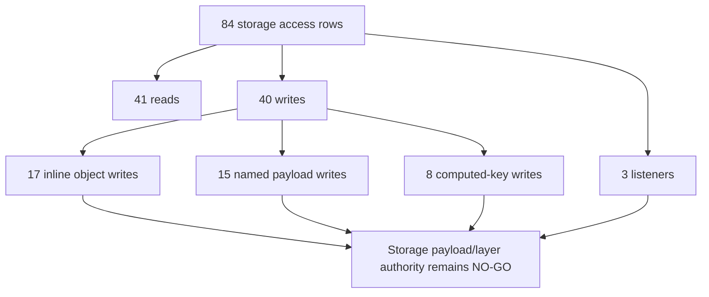

# FilterTube Storage Access Callsite Register - Current Behavior - 2026-05-21

Status: audit-only current-behavior register. Runtime behavior is unchanged.

This slice promotes the existing storage-key overview into a source-derived
callsite register for current tracked non-vendor JavaScript storage access. It
covers direct `storage.local` reads/writes, storage-change listeners, shared
`STORAGE_NAMESPACE` UI wrappers, `background.js` `storageGet(...)` wrapper
callers, and `io_manager.js` `readStorage(...)` / `writeStorage(...)` callers.

This is not completion proof for settings-mode authority, profile revision
ownership, learned-map write safety, UI/runtime refresh parity, storage schema
classification, or no-work optimization. It is a current-behavior boundary
before storage access, storage refresh, settings save, import/export, Nanah,
map-write, migration, or cache-invalidation changes.

## Source Boundary

```text
tracked non-vendor JavaScript files with current storage access: 8
raw direct storage rows: 57
wrapper callsite rows: 27
combined current storage access rows: 84
direct local.get rows: 21
direct local.set rows: 33
direct onChanged.addListener rows: 3
wrapper storageGet rows: 16
wrapper readStorage rows: 4
wrapper writeStorage rows: 7
runtime behavior changed: no
```

## Source Fingerprints

| Source file | Lines | Bytes | SHA-256 |
| --- | ---: | ---: | --- |
| `js/background.js` | 6641 | 298986 | `837cc8e438b30f53cc14da0317262a0ed5e7c5ae2ece0026611a3963767ae6fd` |
| `js/content/bridge_settings.js` | 1113 | 44087 | `f29e6fab216e80cfd3ae9735088f79b36240331429aadbe85db52467be921853` |
| `js/content/handle_resolver.js` | 282 | 9785 | `67cc877a0a97e4c4c5aaf5a0d1c37c15000af5238f8f37d7c5dc6efee27e34ff` |
| `js/content_bridge.js` | 13,636 | 604,184 | `8d55d0c8995e5b68bb9142c41f95046a676f5af2b83f8545b00f91a6a5a3776d` |
| `js/io_manager.js` | 2030 | 96914 | `d04bfd75d061ee405c1dfa4cab8c9d0fa6a2f072d046add33e4b6782b1f58a21` |
| `js/settings_shared.js` | 1181 | 57535 | `9710ebb445ba11cc45fc98aced765d298226a8cd4a003600e106f908abc2162c` |
| `js/state_manager.js` | 2491 | 99780 | `509c559e35989c13cdded17c01eeaca8115addcd3848dbcda41514422e5bc7b6` |
| `js/tab-view.js` | 11617 | 526763 | `1b7f621d48d16247aecc4c7ee57cbc3db9efd3e597e6f0a4fc188228470648f7` |

## Operation Counts

| Family | File | Count |
| --- | --- | ---: |
| direct | `js/background.js` | 36 |
| direct | `js/content/bridge_settings.js` | 1 |
| direct | `js/content/handle_resolver.js` | 1 |
| direct | `js/content_bridge.js` | 6 |
| direct | `js/io_manager.js` | 2 |
| direct | `js/settings_shared.js` | 8 |
| direct | `js/state_manager.js` | 1 |
| direct | `js/tab-view.js` | 2 |
| wrapper | `js/background.js` | 16 |
| wrapper | `js/io_manager.js` | 11 |

| Operation | Count |
| --- | ---: |
| `local.get` | 21 |
| `local.set` | 33 |
| `onChanged.addListener` | 3 |
| `storageGet` | 16 |
| `readStorage` | 4 |
| `writeStorage` | 7 |

## Direct Storage Rows

```text
js/background.js:224:local.get:autoBackupSnapshot
js/background.js:662:local.get:activeProfileRead
js/background.js:970:local.get:quickBlockMigrationRead
js/background.js:1013:local.set:quickBlockMigrationWrite
js/background.js:1015:local.set:quickBlockMigrationFailureMarker
js/background.js:1023:local.get:keywordCommentsMigrationRead
js/background.js:1100:local.set:keywordCommentsMigrationWrite
js/background.js:1102:local.set:keywordCommentsMigrationFailureMarker
js/background.js:1481:local.set:channelMapFlushWrite
js/background.js:1604:local.set:videoChannelMapFlushWrite
js/background.js:1626:local.set:videoMetaMapFlushWrite
js/background.js:1784:local.get:compiledSettingsRead
js/background.js:2081:local.set:compiledSettingsReadPathWrite
js/background.js:2399:local.set:profileMigrationWrite
js/background.js:2578:local.set:profileMutationWrite
js/background.js:2628:local.set:profileMutationWrite
js/background.js:2737:local.get:storageGetWrapperImplementation
js/background.js:3192:local.set:releaseNotesPayloadWrite
js/background.js:3202:local.set:releaseNotesSeenWrite
js/background.js:3216:local.set:firstRunRefreshWrite
js/background.js:3480:local.set:listModeMutationWrite
js/background.js:3664:local.set:keywordMutationWrite
js/background.js:3938:local.set:importMutationWrite
js/background.js:4208:local.get:backgroundActionRead
js/background.js:4248:local.get:backgroundChannelMapRead
js/background.js:4323:local.get:backgroundChannelMapRead
js/background.js:4332:local.set:backgroundChannelMapDirectWrite
js/background.js:4379:local.set:backgroundActionWrite
js/background.js:4451:local.get:statsRead
js/background.js:4458:local.set:statsWrite
js/background.js:4485:onChanged.addListener:backgroundCacheInvalidationListener
js/background.js:6041:local.set:addChannelCustomUrlMapWrite
js/background.js:6066:local.set:addChannelHandleMapWrite
js/background.js:6175:local.set:addChannelListWrite
js/background.js:6212:local.get:filterAllToggleRead
js/background.js:6287:local.set:filterAllToggleWrite
js/content/bridge_settings.js:650:onChanged.addListener:contentSettingsRefreshListener
js/content/handle_resolver.js:167:local.get:handleResolverChannelMapRead
js/content_bridge.js:3713:local.get:statsRead
js/content_bridge.js:3926:local.get:statsRead
js/content_bridge.js:3952:local.set:statsBySurfaceWrite
js/content_bridge.js:5929:local.get:subscriptionImportChannelMapRead
js/content_bridge.js:5933:local.set:subscriptionImportChannelMapWrite
js/content_bridge.js:11928:local.get:quickBlockFilterChannelsAndMapRead
js/io_manager.js:413:local.get:ioReadStorageImplementation
js/io_manager.js:425:local.set:ioWriteStorageImplementation
js/settings_shared.js:566:local.get:sharedSettingsLoad
js/settings_shared.js:650:local.set:sharedSettingsProfileMigrationWrite
js/settings_shared.js:676:local.set:sharedSettingsProfileMigrationWrite
js/settings_shared.js:789:local.get:sharedSettingsSaveExistingProfilesRead
js/settings_shared.js:951:local.set:sharedSettingsSaveWrite
js/settings_shared.js:1074:local.set:sharedSettingsSaveWrite
js/settings_shared.js:1131:local.get:themePreferenceRead
js/settings_shared.js:1140:local.set:themePreferenceWrite
js/state_manager.js:2356:onChanged.addListener:dashboardExternalReloadListener
js/tab-view.js:6672:local.get:nanahTrustedLinkRead
js/tab-view.js:6696:local.set:nanahTrustedLinkWrite
```

## Wrapper Callsite Rows

```text
js/background.js:1458:storageGet:channelMapCacheRead
js/background.js:1534:storageGet:videoChannelMapCacheRead
js/background.js:1554:storageGet:videoMetaMapCacheRead
js/background.js:2801:storageGet:watchlistOrSettingsRead
js/background.js:2880:storageGet:videoChannelMapRead
js/background.js:2985:storageGet:videoChannelMapRead
js/background.js:3090:storageGet:videoChannelMapRead
js/background.js:3172:storageGet:releaseNotesRead
js/background.js:3211:storageGet:firstRunRefreshRead
js/background.js:3307:storageGet:settingsMutationRead
js/background.js:3556:storageGet:profileChannelMapRead
js/background.js:3778:storageGet:importOrMutationRead
js/background.js:5472:storageGet:channelMapRead
js/background.js:5739:storageGet:addChannelRead
js/background.js:6032:storageGet:addChannelMapRead
js/background.js:6052:storageGet:addChannelMapRead
js/io_manager.js:440:readStorage:profilesV3ExportRead
js/io_manager.js:474:writeStorage:profilesV3RestoreWrite
js/io_manager.js:562:readStorage:profilesV4RestoreRead
js/io_manager.js:607:writeStorage:profilesV4SanitizedWrite
js/io_manager.js:616:writeStorage:profilesV4MigratedWrite
js/io_manager.js:622:writeStorage:emptyRestoreWrite
js/io_manager.js:624:writeStorage:profilesV4RestoreWrite
js/io_manager.js:1688:writeStorage:nanahChannelMapMergeWrite
js/io_manager.js:1698:readStorage:nanahTrustedLinkRead
js/io_manager.js:1722:writeStorage:nanahTrustedLinkWrite
js/io_manager.js:1737:readStorage:nanahTrustedLinkRead
```

## Current Behavior Boundaries

- `js/background.js` remains the largest storage owner with 36 direct rows and
  16 `storageGet(...)` wrapper callsites.
- `js/io_manager.js` owns the generic import/export wrapper layer with 2 raw
  wrapper implementation rows and 11 wrapper callsites.
- Storage listeners are split across background cache invalidation, content
  settings refresh, and dashboard external reload; there is no shared listener
  parity report.
- Learned identity maps are written through queued background flushes, direct
  background action paths, content-bridge subscription import repair, and
  `io_manager.js` Nanah merge helpers.
- Several writes are payload-shaped (`updates`, `storageUpdates`,
  `writePayload`, `payload`, and `[key]`), so static key detection alone cannot
  prove settings-mode ownership or revision safety.
- `getCompiledSettings()` still has a read-path write at
  `js/background.js:2081`, so compile/read behavior is also mutation behavior.
- Dashboard Nanah trusted-link helpers use a dynamic `[key]` storage shape at
  `js/tab-view.js:6672` and `js/tab-view.js:6696`.

## Storage Cache Write-Pressure Snapshot - 2026-05-27

This addendum records the storage/cache write pressure that matters for the
current lag and stale-cache audit. It is audit-only. It does not approve
changing cache invalidation, map-only refresh behavior, storage listeners,
revision policy, import/export writes, Nanah writes, or settings/profile
persistence.

```text
write-capable storage rows: 40
direct local.set rows: 33
wrapper writeStorage rows: 7
storage change listener rows: 3
map/cache write labels pinned: 8
shared storage key authority present: no
shared storage write revision contract present: no
runtime behavior changed by this addendum: no
```

Pinned map/cache write labels:

| Label | Row | Cache/staleness risk |
| --- | --- | --- |
| `channelMapFlushWrite` | `js/background.js:1481:local.set` | Background channel identity cache is persisted from queued map state. |
| `videoChannelMapFlushWrite` | `js/background.js:1604:local.set` | Learned video-to-channel identity can update storage without requiring every UI/runtime layer to reprocess DOM. |
| `videoMetaMapFlushWrite` | `js/background.js:1626:local.set` | Learned video metadata can refresh storage separately from visible-card filtering. |
| `backgroundChannelMapDirectWrite` | `js/background.js:4332:local.set` | Background actions can write channel map state outside the queued flush helpers. |
| `addChannelCustomUrlMapWrite` | `js/background.js:6041:local.set` | Add-channel enrichment can persist custom URL map aliases. |
| `addChannelHandleMapWrite` | `js/background.js:6066:local.set` | Add-channel enrichment can persist handle map aliases. |
| `subscriptionImportChannelMapWrite` | `js/content_bridge.js:5933:local.set` | Page-runtime subscription import can persist channel map state from the content bridge. |
| `nanahChannelMapMergeWrite` | `js/io_manager.js:1688:writeStorage` | Nanah merge helpers can persist channel map state through the import/export wrapper layer. |

Current interpretation:

- The storage plane has 40 write-capable rows before counting downstream
  storage-change reactions.
- Three independent storage-change listeners exist today: background cache
  invalidation, content settings refresh, and dashboard external reload.
- The map/cache write labels cross background, content bridge, and IO/Nanah
  owners, so stale-cache and lag fixes need one storage key/revision authority
  before changing listener lists or map-only refresh behavior.
- This snapshot is a source-pinned risk ledger, not a storage optimization or
  cleanup approval.

## Storage Payload Shape and Owner Layer Addendum - 2026-05-27

This addendum classifies the same 84 storage access rows by payload shape and
runtime owner layer. It is source-derived proof only. It does not approve a
storage schema rewrite, direct/wrapper consolidation, listener-list change,
profile/list-mode migration, cache invalidation change, or JSON-first
promotion.

Payload shape census:

| Shape | Rows | Current interpretation |
| --- | ---: | --- |
| `read` | 41 | Reads can hydrate settings, profile state, maps, stats, or release prompts without producing a local mutation report. |
| `inline-object-write` | 17 | The write keys are visible at the callsite, but downstream consumers still lack one revision contract. |
| `named-payload-write` | 15 | The keys are assembled away from the callsite, so row-level storage authority needs payload-shape proof. |
| `inline-computed-key-write` | 8 | Computed-key writes cover profile/theme/Nanah cases and require dynamic-key policy before cleanup. |
| `listener` | 3 | Storage-change listeners remain split across background, content runtime, and dashboard state. |

Owner layer census:

| Owner layer | Read rows | Write rows | Listener rows | Total rows | Current risk |
| --- | ---: | ---: | ---: | ---: | --- |
| `background` | 27 | 24 | 1 | 52 | Background owns the largest storage surface and can mutate compiled settings, maps, stats, migrations, and profile lists. |
| `io-import-export` | 5 | 8 | 0 | 13 | Import/export and Nanah helpers can write profile/map/trusted-link state through wrapper calls. |
| `ui-settings` | 4 | 6 | 1 | 11 | Dashboard/shared settings can write profiles, theme, and dynamic Nanah trusted-link keys. |
| `content-runtime` | 5 | 2 | 1 | 8 | Page runtime writes stats and subscription-import map repair while also consuming settings refresh. |

```text
storage access rows classified by payload shape: 84
read rows: 41
write rows: 40
listener rows: 3
inline object writes: 17
named payload writes: 15
inline computed-key writes: 8
layered write owners: background 24, content-runtime 2, io-import-export 8, ui-settings 6
storage payload/layer authority: NO-GO
runtime behavior changed by this addendum: no
```



Current interpretation:

- Named-payload and computed-key writes are the highest schema-proof burden:
  line-level `local.set(...)` detection is not enough to prove which settings,
  profile, map, theme, or Nanah keys are mutated.
- Background has more write rows than every other layer combined, but content
  and IO/Nanah writes can still affect the same identity and profile outcomes.
- The three listener rows do not share one dirty-key report, so broad storage
  optimization remains blocked until each consumer has a no-op/work decision.
- This addendum strengthens storage/cache, settings-mode, false-hide/leak,
  performance, and code-burden coverage without changing runtime behavior.

## Risk Notes

Reliability risk is concentrated in storage ownership split across background,
shared settings, StateManager, content bridge, tab-view, and import/export
helpers. A write can refresh one runtime layer while leaving another layer stale
because listener key sets and wrapper owners are local decisions.

False-hide/leak risk follows from learned-map and profile writes: `channelMap`,
`videoChannelMap`, `videoMetaMap`, `ftProfilesV3`, `ftProfilesV4`, and legacy
root keys can affect compiled rules, DOM identity, menu actions, stats, or UI
state without a single revision/report contract.

Performance risk comes from map writes, read-path writes, storage listeners,
and broad refresh behavior. Map-only fast paths exist locally, but there is no
cross-layer budget proving when storage changes must trigger parse, compile,
DOM reprocess, dashboard reload, backup, or no work.

Code-burden risk comes from wrappers plus direct API use living side by side.
Future cleanup needs equivalence proof before consolidating wrappers, deleting
legacy keys, or changing listener lists.

## Future Proof Fields

Each storage access row must eventually be tied to a first-class storage
decision before storage behavior changes can claim semantic coverage:

```text
storageAccessReference
sourceFile
sourceLine
operation
storageArea
keyExpression
staticKeys
dynamicKeyPolicy
payloadShape
actor
targetProfile
targetListMode
settingsMode
mutationIntent
revisionPolicy
cacheInvalidationPolicy
contentRefreshPolicy
dashboardReloadPolicy
forceDomReprocessPolicy
backupPolicy
mapOnlyPolicy
readPathWriteDecision
positiveFixture
negativeFixture
noWorkBudget
```

## Missing Runtime Authority Symbols

No product source currently defines:

```text
storageAccessCallsiteAuthority
storageOperationEffectReport
storageKeySchemaManifest
storageKeyStaticDynamicClassifier
storageListenerParityReport
storageWriteRevisionContract
storageReadPathMutationReport
storageWrapperParityContract
storageMapOnlyBudget
storageSettingsModeGate
```

## Completion Boundary

This register improves proof for storage/cache, settings mode, learned identity,
performance, false-hide/leak, code-burden, and cross-feature interaction
coverage. It does not complete the active goal. Before implementation changes,
the storage plane still needs row-level fixtures, schema ownership, listener
parity, settings-mode matrices, revision reports, map-only budgets, and no-work
evidence.

## Method Semantic Proof Gap Boundary

`docs/audit/FILTERTUBE_METHOD_SEMANTIC_PROOF_GAP_INDEX_CURRENT_BEHAVIOR_2026-05-25.md`
is a required source input before this background/settings/storage surface can
support runtime optimization. Current proof pins:

```text
method semantic proof gap files covered: 69
method semantic proof gap lexical callables covered: 5789
files with complete per-callable semantic proof: 0
lexical callables requiring semantic proof before behavior changes: 5789
affected callable semantic proof: NO-GO
runtime behavior changed: no
```

These counts are audit-only blockers. They do not approve runtime
optimization, JSON-first behavior, settings behavior, background message
behavior, storage behavior, cache invalidation behavior, whitelist behavior,
metric collectors, artifact creation, native sync, release package changes, or
public claims.
