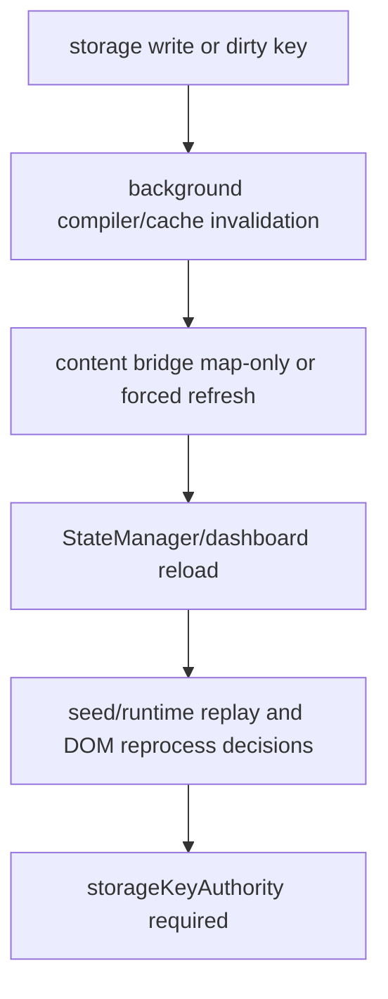

# FilterTube Storage Key Authority Audit - 2026-05-18

Status: current-behavior audit. This is not an implementation patch.

## Why This Slice Exists

Storage is currently the place where several FilterTube authorities meet:
profile mode, rule lists, learned identity maps, runtime cache invalidation,
content-script refresh, dashboard state, backup/export, and Nanah/import writes.

The current code does not have one storage-key authority that says:

```text
storage key changed
        |
        v
owner + schema + target profile + target surface + compiled revision
        |
        +--> invalidate background cache?
        +--> refresh content bridge?
        +--> reload dashboard state?
        +--> force DOM reprocess?
        +--> schedule backup?
        +--> ignore because map-only/no UI impact?
```

Instead, each layer owns its own watched-key list and cache behavior.

## Current Storage Access Surface

Authoritative scan command:

```bash
node - <<'NODE'
const fs=require('fs'), cp=require('child_process');
const files=cp.execFileSync('git',['ls-files','*.js','*.mjs'],{encoding:'utf8'}).trim().split('\n').filter(Boolean).filter(f=>!f.includes('/vendor/'));
const patterns=[/storage\.local\.get/g,/storage\.local\.set/g,/storage\.local\.remove/g,/storage\.onChanged\.addListener/g,/STORAGE_NAMESPACE\?\.get/g,/STORAGE_NAMESPACE\?\.set/g,/STORAGE_NAMESPACE\.get/g,/STORAGE_NAMESPACE\.set/g,/readStorage\(/g,/writeStorage\(/g];
for(const f of files){ const t=fs.readFileSync(f,'utf8'); let c=0, parts=[]; for(const p of patterns){ const n=(t.match(p)||[]).length; if(n){c+=n; parts.push(`${p.source}:${n}`)} } if(c) console.log(f,c,parts.join(' '));}
NODE
```

Current tracked non-vendor storage access count: 72 call sites.

| File | Count | Notes |
| --- | ---: | --- |
| `js/background.js` | 36 | Main storage compiler, migrations, learned maps, stats, release/prompt state, mode/channel writes, and background cache invalidation. |
| `js/io_manager.js` | 17 | Import/export, profile persistence, backup payload reads/writes, Nanah restore helpers. |
| `js/settings_shared.js` | 8 | UI settings load/save, V4 profile write-through, theme, and auto-backup keys. |
| `js/content_bridge.js` | 6 | Surface stats and direct `channelMap` custom URL writes. |
| `js/tab-view.js` | 2 | Direct Nanah/UI storage helper path. |
| `js/content/bridge_settings.js` | 1 | Content runtime storage-change listener. |
| `js/content/handle_resolver.js` | 1 | Content-side `channelMap` lookup. |
| `js/state_manager.js` | 1 | Dashboard/settings storage-change listener. |

This count intentionally excludes `js/vendor/*` and ignored root captures.

## Current Split Watch Lists

### Background Compiler Reads More Than Background Invalidates

`getCompiledSettings()` reads a broad key list including:

- `enabled`
- `contentFilters`
- `useExactWordMatching`
- `filterChannelsAdditionalKeywords`
- `videoChannelMap`
- `videoMetaMap`
- many watch/player UI flags
- `ftProfilesV3`
- `ftProfilesV4`

Source: `js/background.js:1784-1828`.

The background storage invalidation listener watches a narrower list:

- `uiKeywords`
- `filterKeywords`
- `filterKeywordsComments`
- `uiChannels`
- `filterChannels`
- `contentFilters`
- several visible hide flags
- `ftProfilesV3`
- `ftProfilesV4`

Source: `js/background.js:4458-4495`.

Current gap: background invalidation currently omits keys that the compiler
reads, including `enabled`, `categoryFilters`, `videoChannelMap`,
`videoMetaMap`, `useExactWordMatching`, `filterChannelsAdditionalKeywords`,
`showQuickBlockButton`, `showBlockMenuItem`, and many watch/player flags.

Some of this may be intentionally compensated by content-script listeners or
direct refresh messages, but there is no single authority that proves which
layer owns each key.

### Content Bridge Watches More Learned Identity Keys

The content bridge storage listener watches `channelMap`, `videoChannelMap`,
and `videoMetaMap`, but handles map-only changes specially:

- `channelMap` only: return without refresh.
- `videoChannelMap` only: refresh settings but do not force DOM reprocess.
- `videoMetaMap` only: refresh settings but do not force DOM reprocess.

Source: `js/content/bridge_settings.js:547-604`.

Current gap: this is a useful performance optimization, but it is local to the
content bridge. Background cache invalidation and dashboard reload behavior do
not share a named map-key policy.

### StateManager Watches A Different UI Reload List

StateManager ignores `channelMap`-only changes, but its settings reload list
includes `stats` and `channelMap` while omitting `videoChannelMap`,
`videoMetaMap`, `contentFilters`, `categoryFilters`, `useExactWordMatching`,
and `filterChannelsAdditionalKeywords`.

Source: `js/state_manager.js:2334-2407`.

Current gap: UI reload, background cache invalidation, and content bridge
refresh can disagree about whether a key is settings, stats, identity,
map-only, or rule-affecting.

### Shared Settings Loads A UI-Oriented Key Set

`FilterTubeSettings.loadSettings()` loads `SETTINGS_KEYS`, theme,
auto-backup, V3 profiles, and V4 profiles.

Source: `js/settings_shared.js:564-620`.

Current gap: this UI-oriented load path does not own learned identity maps
such as `videoChannelMap` or `videoMetaMap`, and its `SETTINGS_KEYS` list is
not the same as the background compiler or content bridge refresh lists.

## High-Risk Interaction Patterns

| Pattern | Current behavior | Risk |
| --- | --- | --- |
| Read-path writes | `getCompiledSettings()` can write migrations and V4 profile updates while compiling. | A read can become a write, which can trigger listeners and cache churn. |
| Learned-map writes | `channelMap`, `videoChannelMap`, and `videoMetaMap` can be written through multiple owners. | Stale or untrusted identity can affect compiled settings, DOM identity, or refresh timing. |
| Split invalidation | Background, content bridge, and StateManager watch different key lists. | A mutation can refresh one layer but not another, causing stale UI/runtime state. |
| Map-only fast paths | Content bridge avoids forced DOM reprocess for video map-only changes. | Good for performance, but not globally documented as the only valid map behavior. |
| Stats reload drift | StateManager watches legacy `stats`, while dashboard logic can read `statsBySurface`. | Dashboard and runtime counters can drift or fail to refresh. |
| Profile write-through | V4 profile writes happen in background, StateManager, IO import, Nanah apply, and UI save paths. | Profile/list mode migration can lose actor/target/revision context. |

## Required Future Authority

Future token: `storageKeyAuthority`

Required shape:

```text
storageKeyAuthority.classify(key, change, actor) -> {
  owner,
  schema,
  targetProfile,
  targetSurface,
  cacheInvalidation,
  contentRefresh,
  dashboardReload,
  forceDomReprocess,
  backupTrigger,
  revision
}
```

This authority should not be a large rewrite by itself. It should first exist
as a report used by background, content bridge, StateManager, import/Nanah, and
UI save paths.

## P0 Fixture Gates

```text
storage_key_background_invalidation_covers_compiler_dependencies
storage_key_content_bridge_map_only_refresh_policy_is_named
storage_key_state_manager_reload_keys_match_ui_claims
storage_key_settings_shared_load_keys_are_classified
storage_key_video_channel_map_change_has_cache_and_dom_policy
storage_key_video_meta_map_change_has_cache_and_dom_policy
storage_key_stats_by_surface_change_refreshes_dashboard
storage_key_channel_map_only_change_does_not_force_dom_reprocess
storage_key_read_path_write_reports_migration_revision
storage_key_import_nanah_profile_write_reports_target_profile_revision
storage_key_unknown_key_is_ignored_with_no_runtime_reprocess
storage_key_raw_capture_evidence_never_becomes_storage_authority
```

## Implementation Rule

Do not change storage invalidation, map refresh, settings cache, profile
migration, stats refresh, import/Nanah writes, or learned identity writes until
the relevant fixture above is runnable. The likely safe first patch later is a
read-only classifier/report, not behavior changes.

## Storage/Cache Key Convergence Boundary - 2026-05-30

This continuation joins the split storage/cache proof into one audit-only
boundary before any whitelist/cache optimization, map-only refresh pruning,
compiled-cache invalidation change, settings-refresh pruning, profile import
cleanup, or dashboard stats refresh change. Runtime behavior changed by this
addendum: no.

| Boundary row | Current proof | Remaining risk |
| --- | --- | --- |
| `storage_cache_compiler_invalidation_split` | `getCompiledSettings()` starts at `js/background.js:1774` and reads broader storage inputs than the background invalidation list at `js/background.js:4487`. | Compiler dependencies still lack one revisioned invalidation report. |
| `storage_cache_bridge_map_only_refresh_split` | Content bridge storage coalescing starts at `js/content/bridge_settings.js:557`; `handleStorageChanges()` starts at `js/content/bridge_settings.js:589`; map keys are classified in the local `relevantKeys` list at `js/content/bridge_settings.js:599`. | Map-only refresh is local content-script policy, not shared storage authority. |
| `storage_cache_force_reprocess_coalescing_guard` | `docs/audit/FILTERTUBE_STORAGE_REFRESH_FORCE_REPROCESS_COALESCING_CURRENT_BEHAVIOR_2026-05-30.md` proves map-only pending refresh upgrade is present and map-only non-forcing proof is present. | The fix prevents dropped forced reprocess, but it does not approve map-only pruning or broad whitelist/cache optimization. |
| `storage_cache_state_manager_reload_split` | Dashboard/UI reload owns a third key list at `js/state_manager.js:2356`, while `state.statsBySurface` is loaded separately at `js/state_manager.js:243-244`. | UI reload, runtime refresh, and stats refresh still lack one key-owner matrix. |
| `storage_cache_shared_settings_load_split` | Shared settings include `statsBySurface` in the key list at `js/settings_shared.js:52` and load settings at `js/settings_shared.js:564`, but this path remains UI-oriented. | Shared load does not prove compiled-cache, DOM, dashboard, backup, and import semantics for every key. |
| `storage_cache_background_map_flush_dirty_state` | Background video-channel and video-meta queue owners start at `js/background.js:1648` and `js/background.js:1673`, and runtime message writes enter at `js/background.js:4429` and `js/background.js:4446`. | Dirty map writes can patch caches and flush storage without one stale-card freshness budget. |
| `storage_cache_profile_import_nanah_revision_gap` | List-mode mutation starts at `js/background.js:3292`, batch whitelist import at `js/background.js:3545`, and the UI sender starts that batch import at `js/state_manager.js:1809`. | Profile/list writes, cache invalidation, backup, and tab refresh still lack one actor/profile/list revision report. |
| `storage_cache_stats_dashboard_reload_gap` | Runtime stats paths read/write `stats` and `statsBySurface` at `js/content_bridge.js:3713-3718` and `js/content_bridge.js:3926-3944`. | Dashboard reload and runtime counter writes still need surface-scoped refresh proof. |
| `storage_cache_settings_refresh_evidence_packet_gap` | `docs/audit/FILTERTUBE_SETTINGS_REFRESH_OPTIMIZATION_CANDIDATE_EVIDENCE_PACKET_CONTRACT_CURRENT_BEHAVIOR_2026-05-29.md` defines 12 settings-refresh evidence packet rows and 29 required packet fields. | Implementation-ready settings-refresh evidence packets remain 0. |
| `storage_cache_whitelist_spa_metric_gap` | `docs/audit/FILTERTUBE_WHITELIST_CACHE_HOT_PATH_BOUNDARY_CURRENT_BEHAVIOR_2026-05-25.md` pins five whitelist-cache hot-path source files and keeps broader runtime whitelist cache optimization at `NO-GO`. | Source-only cache proof is not live SPA route/mode metric evidence. |

Status tokens:

```text
storage/cache convergence rows: 10
implementation-ready storage/cache convergence rows: 0
storageKeyAuthority product source symbol: absent
settings refresh evidence packets defined: 12
required settings refresh packet fields: 29
implementation-ready settings refresh evidence packets: 0
map-only pending refresh upgrade proof: PRESENT
map-only pruning approval from this convergence: NO-GO
compiled-cache invalidation approval from this convergence: NO-GO
whitelist/cache optimization approval from this convergence: NO-GO
JSON-first promotion approval from this convergence: NO-GO
runtime behavior changed by this addendum: no
```

Source and fixture ledger links:

```text
docs/audit/FILTERTUBE_SETTINGS_REFRESH_FANOUT_CURRENT_BEHAVIOR_2026-05-19.md
tests/runtime/settings-refresh-fanout-current-behavior.test.mjs
docs/audit/FILTERTUBE_COMPILED_CACHE_AUTHORITY_CURRENT_BEHAVIOR_2026-05-19.md
tests/runtime/compiled-cache-authority-current-behavior.test.mjs
docs/audit/FILTERTUBE_SETTINGS_REFRESH_DIRTY_KEY_PRODUCER_CONSUMER_JOIN_MATRIX_CURRENT_BEHAVIOR_2026-05-29.md
tests/runtime/settings-refresh-dirty-key-producer-consumer-join-matrix-current-behavior.test.mjs
docs/audit/FILTERTUBE_SETTINGS_REFRESH_OPTIMIZATION_CANDIDATE_EVIDENCE_PACKET_CONTRACT_CURRENT_BEHAVIOR_2026-05-29.md
tests/runtime/settings-refresh-optimization-candidate-evidence-packet-contract-current-behavior.test.mjs
docs/audit/FILTERTUBE_STORAGE_REFRESH_FORCE_REPROCESS_COALESCING_CURRENT_BEHAVIOR_2026-05-30.md
tests/runtime/storage-refresh-force-reprocess-coalescing-current-behavior.test.mjs
docs/audit/FILTERTUBE_WHITELIST_CACHE_HOT_PATH_BOUNDARY_CURRENT_BEHAVIOR_2026-05-25.md
tests/runtime/whitelist-cache-hot-path-boundary-current-behavior.test.mjs
docs/audit/FILTERTUBE_LEARNED_IDENTITY_MAP_CACHE_PERSISTENCE_BOUNDARY_CURRENT_BEHAVIOR_2026-05-22.md
tests/runtime/learned-identity-map-cache-persistence-boundary-current-behavior.test.mjs
docs/audit/FILTERTUBE_STORAGE_ACCESS_CALLSITE_REGISTER_CURRENT_BEHAVIOR_2026-05-21.md
tests/runtime/storage-access-callsite-register-current-behavior.test.mjs
```

ASCII storage/cache convergence diagram: present

```text
storage write or dirty key
  -> background compiler/cache invalidation
  -> content bridge map-only or forced refresh
  -> StateManager/dashboard reload
  -> seed/runtime replay and DOM reprocess decisions
  -> required storageKeyAuthority before optimization
```

Mermaid storage/cache convergence diagram: present



## Method Semantic Proof Gap Boundary

`docs/audit/FILTERTUBE_METHOD_SEMANTIC_PROOF_GAP_INDEX_CURRENT_BEHAVIOR_2026-05-25.md`
is a required source input before this background/settings/storage surface can
support runtime optimization. Current proof pins:

```text
method semantic proof gap files covered: 69
method semantic proof gap lexical callables covered: 5720
files with complete per-callable semantic proof: 0
lexical callables requiring semantic proof before behavior changes: 5720
affected callable semantic proof: NO-GO
runtime behavior changed: no
```

These counts are audit-only blockers. They do not approve runtime
optimization, JSON-first behavior, settings behavior, background message
behavior, storage behavior, cache invalidation behavior, whitelist behavior,
metric collectors, artifact creation, native sync, release package changes, or
public claims.
