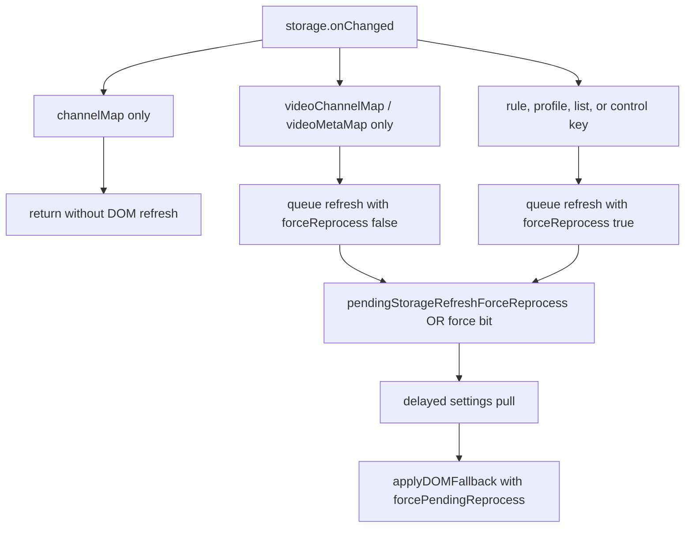

# FilterTube Storage Refresh Force-Reprocess Coalescing - Current Behavior - 2026-05-30

Status: audit-only current-behavior storage refresh coalescing proof. Runtime
behavior is unchanged. This is not a storage-key refactor, settings-refresh
optimization, DOM fallback optimization, whitelist cache optimization,
JSON-first promotion, metric collector insertion, release package patch, or
public-claim approval.

## Purpose

This slice isolates one release-critical regression boundary: a pending
map-only refresh must not swallow a later rule/profile/list change that needs
already-rendered YouTube cards to reprocess. This protects the observed
`shakira`-style case where the popup/list shows the new rule but visible cards
could otherwise stay stale until another interaction.

Current answer:

```text
storage refresh force-reprocess coalescing rows: 6
map-only pending refresh upgrade proof: PRESENT
map-only non-forcing proof: PRESENT
rule/profile forced refresh preservation: PRESENT
settings refresh optimization approval from this proof: NO-GO
runtime behavior changed by this boundary: no
```

## Current Flow

```text
storage.onChanged
  -> lone channelMap: return
  -> videoChannelMap/videoMetaMap: schedule settings pull with forceReprocess false
  -> rule/profile/list/control keys: schedule settings pull with forceReprocess true
  -> if a timer is already pending, OR the force bit into pendingStorageRefreshForceReprocess
  -> delayed timer applies forcePendingReprocess to DOM fallback
```



## Source Rows

| Row | Source pins | Current behavior | Release risk controlled |
| --- | --- | --- | --- |
| `storage_force_reprocess_refreshnow_forced` | `js/content/bridge_settings.js:223-229` | `FilterTube_RefreshNow` pulls settings and forces DOM fallback. | Correctness-critical manual/background refresh cannot silently skip visible cards. |
| `storage_force_reprocess_applysettings_forced` | `js/content/bridge_settings.js:283-313` | Pushed `FilterTube_ApplySettings` sends settings to Main World and forces DOM fallback. | UI/profile writes remain visible without waiting for SPA churn. |
| `storage_force_reprocess_pending_upgrade_bit` | `js/content/bridge_settings.js:557-587` | The delayed scheduler stores `pendingStorageRefreshForceReprocess = pendingStorageRefreshForceReprocess || shouldForceReprocess` and later applies `forcePendingReprocess`. | A map-only pending timer cannot drop a later keyword/profile/list forced reprocess. |
| `storage_force_reprocess_map_only_nonforcing` | `js/content/bridge_settings.js:597-645` | `videoChannelMap` and `videoMetaMap` refresh settings with `forceReprocess:false`; lone `channelMap` returns earlier. | Map-only identity/meta writes avoid broad DOM work unless another rule-changing key joins the pending timer. |
| `storage_force_reprocess_executable_upgrade_fixture` | `tests/runtime/storage-refresh-force-reprocess-coalescing-current-behavior.test.mjs` | The VM harness fires `videoChannelMap`, then `ftProfilesV4`, then runs the queued timer and proves `forceReprocess:true`. | Prevents visible blocklist/whitelist stale-card leak after rule/profile changes coalesce with lightweight map refreshes. |
| `storage_force_reprocess_executable_nonforcing_fixture` | `tests/runtime/storage-refresh-force-reprocess-coalescing-current-behavior.test.mjs` | The VM harness fires only `videoChannelMap`, then runs the timer and proves `forceReprocess:false`. | Keeps the lag fix from turning every video map update into a full visible-card reprocess. |

## Boundary Decision

```text
accept storage force-reprocess coalescing as current correctness proof: GO
accept storage force-reprocess coalescing as broad refresh pruning approval: NO-GO
accept storage force-reprocess coalescing as map-only pruning approval: NO-GO
accept storage force-reprocess coalescing as visible-tab stale-card parity proof: NO-GO
accept storage force-reprocess coalescing as JSON-first promotion approval: NO-GO
accept storage force-reprocess coalescing as whitelist cache optimization approval: NO-GO
```

## Remaining Proof Gap

This proof protects the narrow coalescing regression. It does not prove one
first-class settings refresh decision authority. Future optimization still needs
changed keys, producer path, profile type, list mode, rule delta, route, surface,
active JSON work, active DOM work, active menu/quick work, no-op decision,
visible-card stale proof, metrics, rollback proof, and installed-tab parity.

Missing product authority symbols:

```text
storageRefreshForceReprocessDecisionReport
storageRefreshVisibleCardStaleProof
storageRefreshMapOnlyOptimizationApproval
storageRefreshInstalledTabParityTrace
storageRefreshMetricArtifact
storageRefreshRollbackProof
```

Verification:

```bash
node --test --test-reporter=spec tests/runtime/storage-refresh-force-reprocess-coalescing-current-behavior.test.mjs
```
