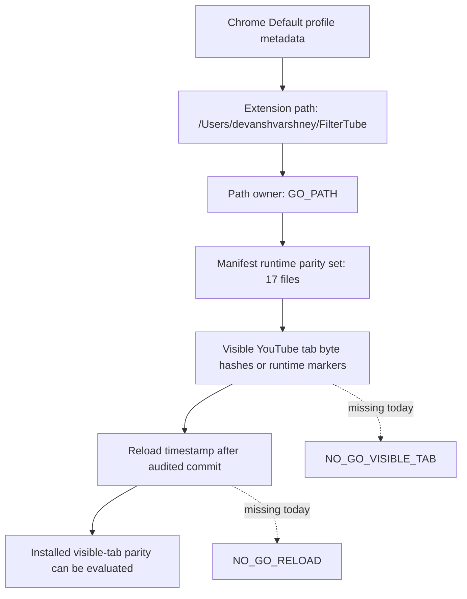

# FilterTube Visible Installed-Tab Byte Parity Preflight Current Behavior - 2026-05-31

Status: audit-only preflight contract. Runtime behavior changed: no.

## Question

The Default Chrome profile now proves that extension id
`gkgjigdfdccckblmglboobikfcpeelio` is unpacked from
`/Users/devanshvarshney/FilterTube`. That is path ownership, not proof that an
already-open YouTube tab has reloaded and is executing the latest workspace
bytes.

This preflight makes the remaining visible-tab byte-parity requirement
first-class so release/debug conclusions do not confuse:

- installed source path parity
- service worker reload freshness
- content-script injected byte freshness
- automation-profile evidence
- user-visible Default-profile evidence

## Source Anchors

| Source | Current proof supplied |
| --- | --- |
| `manifest.json` | MV3 service worker, content-script worlds, web-accessible MAIN-world resources, version `3.3.1`, YouTube/YTKids host scope. |
| `docs/audit/FILTERTUBE_INSTALLED_CHROME_UNPACKED_PATH_PARITY_CURRENT_BEHAVIOR_2026-05-30.md` | Default-profile extension entry points at `/Users/devanshvarshney/FilterTube`; incognito is not proved; already-open tab bytes are not proved. |
| `docs/audit/FILTERTUBE_P0_RELEASE_PACKAGE_CURRENT_BEHAVIOR_2026-05-19.md` | Live Chrome process boundary separates visible Default Chrome from automation Chrome using `/private/tmp/filtertube-live-spa-chrome-profile`. |
| `docs/audit/FILTERTUBE_IMPLEMENTATION_READINESS_GATE_2026-05-18.md` | Broad implementation/release behavior remains blocked until live byte/reload proof is present. |

## Runtime Parity Set

The visible-tab byte-parity report must cover these current Chrome runtime
entrypoints before it can be used as release evidence:

| Class | Files |
| --- | --- |
| Service worker | `js/background.js` |
| MAIN declarative content script | `js/seed.js` |
| ISOLATED declarative content scripts | `js/shared/identity.js`, `js/content/menu.js`, `js/content/dom_helpers.js`, `js/content/dom_extractors.js`, `js/content/dom_fallback.js`, `js/content/block_channel.js`, `js/content/bridge_injection.js`, `js/content/bridge_settings.js`, `js/content/handle_resolver.js`, `js/content/collab_dialog.js`, `js/content/release_notes_prompt.js`, `js/content/first_run_prompt.js`, `js/content_bridge.js` |
| MAIN web-accessible/injected resources | `js/injector.js`, `js/filter_logic.js`, `js/seed.js`, `js/shared/identity.js` |

Unique runtime files in this parity set: 17.

## Required Evidence Fields

A future visible-tab byte-parity report must include all fields below. Missing
one field keeps the release/use claim at `NO-GO`.

| Field | Required value or shape | Status today |
| --- | --- | --- |
| `profile_owner` | User-visible Chrome Default profile, not automation profile. | `NO_GO_VISIBLE_TAB` |
| `target_url` | Actual user-visible `youtube.com` or `youtubekids.com` tab URL. | `NO_GO_VISIBLE_TAB` |
| `extension_id` | `gkgjigdfdccckblmglboobikfcpeelio`. | `GO_PATH_ONLY` |
| `extension_path` | `/Users/devanshvarshney/FilterTube`. | `GO_PATH_ONLY` |
| `manifest_version` | `3.3.1`. | `GO_PATH_ONLY` |
| `service_worker_source_hash` | Hash for active `js/background.js` service worker bytes, compared to workspace. | `NO_GO_RELOAD` |
| `content_script_hashes` | Hashes or equivalent runtime markers for every file in the 17-file parity set. | `NO_GO_VISIBLE_TAB` |
| `runtime_injection_markers` | Loaded-page markers proving MAIN and ISOLATED worlds both ran current FilterTube bytes. | `NO_GO_VISIBLE_TAB` |
| `reload_timestamp` | Extension reload time after the audited workspace commit. | `NO_GO_RELOAD` |
| `open_tab_staleness` | Explicit stale-tab status for tabs open before extension reload. | `NO_GO_VISIBLE_TAB` |
| `incognito_status` | Default and incognito availability split. | `NO_GO_INCOGNITO` |
| `automation_profile_excluded` | Evidence that `/private/tmp/filtertube-live-spa-chrome-profile` was not used for the visible-tab claim. | `NO_GO_VISIBLE_TAB` |

## Current Decision

| Decision row | Finding | Status |
| --- | --- | --- |
| `installed_path_owner` | Default-profile metadata says the installed extension path is the workspace. | `GO_PATH` |
| `manifest_entrypoint_set` | Chrome manifest entrypoints are enumerated and count to 17 unique runtime files including the service worker. | `PREFLIGHT_ONLY` |
| `visible_tab_byte_parity` | No active visible YouTube tab byte/hash/runtime-marker report is committed. | `NO_GO_VISIBLE_TAB` |
| `service_worker_reload_freshness` | No reload timestamp tied to the audited commit is committed. | `NO_GO_RELOAD` |
| `automation_profile_substitution_guard` | Existing docs distinguish Default Chrome from automation Chrome, but no visible-tab report is committed. | `NO_GO_VISIBLE_TAB` |
| `release_claim_use` | Path parity alone cannot support release/public behavior claims. | `NO_GO_RELEASE` |

## Flow Boundary

```text
Default Secure Preferences path proof
  -> GO_PATH for workspace ownership
  -> manifest runtime parity set known
  -> visible tab still needs active bytes and reload timestamp
  -> release/use claim remains NO-GO
```



## Release Meaning

This document does not require or approve any runtime code change. It prevents
the audit from treating installed path parity as proof that the current visible
YouTube document is running current bytes.

Implementation, release, and public claims remain blocked until a live
visible-tab report proves:

- Default-profile tab ownership
- active YouTube URL
- extension id/path/version
- 17-file runtime parity set hashes or equivalent markers
- service worker reload timestamp
- stale open-tab handling
- incognito availability split
- automation-profile exclusion
