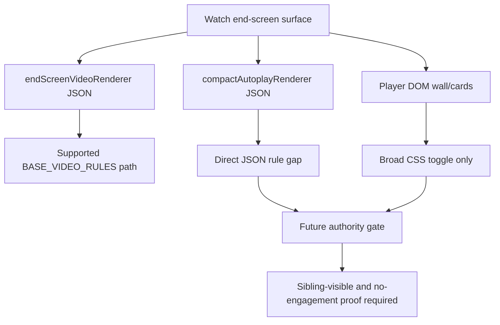

# FilterTube Watch End-Screen Authority Current Behavior - 2026-05-19

Status: audit proof only. No runtime behavior was changed.

This slice narrows the user-reported end-screen leak risk. The direct JSON
`endScreenVideoRenderer` path is not the primary missing behavior: it already
uses `BASE_VIDEO_RULES` and keyword/channel rules can remove it, including when
it is nested under a watch-player overlay result list. The remaining risk is
that watch end-screen surfaces are split between JSON renderer filtering,
compact/autoplay renderer gaps, and broad player DOM CSS controls.

## 2026-05-30 Store-Feedback Linkage

The store feedback that blocked videos can reappear in the end-screen video
wall remains a valid product risk. Current source proof splits that risk into
three paths:

- Direct and nested `endScreenVideoRenderer` JSON rows are supported by
  `BASE_VIDEO_RULES`.
- `compactAutoplayRenderer` still has no direct JSON rule.
- Rendered player DOM video-wall and end-card overlays are broad CSS toggle
  targets, not per-card blocklist or whitelist decisions.

This report is therefore linked to
`docs/audit/FILTERTUBE_ENGAGEMENT_BUDGET_CURRENT_BEHAVIOR_2026-05-19.md`.
The future fix must prove both visibility correctness and non-engagement
behavior: blocked end-screen cards should disappear, nonmatching siblings should
remain visible, whitelist should not false-hide unrelated cards, and the fix
must not synthesize clicks, playback transitions, direct identity fetches, or
watch-page metadata hides as a side effect.

```text
ASCII end-screen split:
endScreenVideoRenderer JSON -> supported filter decision
compactAutoplayRenderer JSON -> unsupported direct-rule gap
player DOM wall/card -> broad CSS feature toggle only
future safe gate -> per-card decision + sibling-visible + no-engagement proof
runtime behavior changed by this continuation: no
```



## Source Evidence

| Surface | Current owner | Source proof | Current verdict |
| --- | --- | --- | --- |
| Direct end-screen JSON video | JSON engine | `js/filter_logic.js:435` maps `endScreenVideoRenderer` to `BASE_VIDEO_RULES`. | Supported for direct renderer objects. |
| Nested watch overlay end-screen JSON | Recursive JSON engine traversal | `js/filter_logic.js:2524` includes `endScreenVideoRenderer` as a known nested content key. | Supported for nested player-overlay result lists. |
| Compact autoplay JSON suggestion | No direct JSON rule | `js/filter_logic.js:426-435` has no `compactAutoplayRenderer` rule. | Current gap; matching titles pass through. |
| Player video wall DOM | Dynamic content-control CSS | `js/content/dom_fallback.js:1316-1323` hides `#movie_player .ytp-endscreen-content` and `.ytp-fullscreen-grid-stills-container` only when `hideEndscreenVideowall` is enabled. | Feature toggle, not per-card block/allow decision. |
| Player end-card DOM | Dynamic content-control CSS | `js/content/dom_fallback.js:1325-1330` hides `#movie_player .ytp-ce-element` only when `hideEndscreenCards` is enabled. | Feature toggle, not per-card block/allow decision. |
| Autonav end-screen UI | Dynamic content-control CSS | `js/content/dom_fallback.js:1333-1339` hides `.autonav-endscreen` only when `disableAutoplay` is enabled. | Autoplay-control toggle, not renderer filtering. |
| Card selectors and quick-block targets | DOM selector lists | `js/content/dom_extractors.js:10-60` and `js/content/block_channel.js:762-806` do not include `.ytp-videowall-still`, `.ytp-ce-element`, or `.ytp-endscreen-content`. | End-screen player overlays are not ordinary FilterTube card targets today. |

## Current Flow

```text
/youtubei/v1/next or ytInitialData
        |
        +--> endScreenVideoRenderer
        |       |
        |       v
        |   BASE_VIDEO_RULES
        |       |
        |       v
        |   can remove matching JSON renderer
        |
        +--> compactAutoplayRenderer
        |       |
        |       v
        |   no direct FILTER_RULES entry today
        |
        v
player DOM overlay
        |
        +--> .ytp-endscreen-content / .ytp-ce-element
                |
                v
            broad feature CSS only
```

## Why This Matters

The browser-store review said blocked videos can reappear in the end-screen
video wall. The current code explains how that can happen without contradicting
the working direct `endScreenVideoRenderer` rule:

- If YouTube sends a direct `endScreenVideoRenderer`, the JSON engine can remove
  a matching entry.
- If YouTube sends an alternate compact/autoplay renderer, there is no direct
  renderer rule today.
- If YouTube renders a player overlay card in DOM, the current selector lists do
  not treat it as a normal FilterTube card.
- The DOM controls for end-screen/player cards are whole-feature toggles. They
  can hide the full video wall or all end cards, but they do not prove that a
  blocked card is removed while non-matching cards stay visible.

## Required Future Gate

Do not patch this by broadening player DOM hides. The safe future gate is a
`watchEndscreenAuthority` report with fixtures for:

- direct `endScreenVideoRenderer` positive and negative cases
- nested `watchNextEndScreenRenderer.results[*].endScreenVideoRenderer`
- `compactAutoplayRenderer` positive and negative cases
- real Main watch DOM video-wall cards such as `.ytp-videowall-still`
- end-card overlays such as `.ytp-ce-element`
- blocklist and whitelist mode
- empty blocklist and disabled no-work mode
- negative sibling-visible proof
- fullscreen/native-overlay quiet mode
- no synthetic click, no playback transition, and no watch-page metadata hide

Until those fixtures exist, end-screen support is only partially proven:
JSON direct renderers work, but player DOM and compact/autoplay variants remain
under-proven leak surfaces.

## Method Semantic Proof Gap Boundary

`docs/audit/FILTERTUBE_METHOD_SEMANTIC_PROOF_GAP_INDEX_CURRENT_BEHAVIOR_2026-05-25.md`
is a required source input before this watch/player/end-screen surface can
support runtime optimization. Current proof pins:

```text
method semantic proof gap files covered: 69
method semantic proof gap lexical callables covered: 5681
files with complete per-callable semantic proof: 0
lexical callables requiring semantic proof before behavior changes: 5681
affected callable semantic proof: NO-GO
runtime behavior changed: no
```

These counts are audit-only blockers. They do not approve runtime
optimization, JSON-first behavior, watch-card behavior, player behavior,
end-screen behavior, whitelist behavior, metric collectors, artifact creation,
native sync, release package changes, or public claims.
