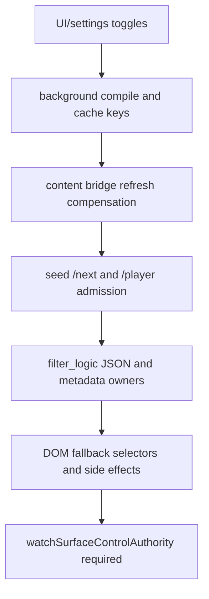

# FilterTube Watch / Player Control Authority Audit - 2026-05-18

Status: current-behavior audit. This is not an implementation patch.

Purpose: pin the authority boundary for comments, live chat, watch-side
recommendations, watch playlist panels, playlist/mix cards, video metadata
chrome, end-screen overlays, autoplay, and annotations before any performance or
renderer cleanup touches watch-page behavior.

Future authority name:

```text
watchSurfaceControlAuthority
```

## Current Verdict

FilterTube has watch/player controls, but it does not yet have one
watch-surface authority that says:

```text
for this profile + surface + route + player state:
  which watch/player controls are active,
  which endpoint payloads may be mutated,
  which DOM selectors may hide containers,
  which comments/live-chat/player overlays may be touched,
  which controls are blocklist-only versus whitelist-safe,
  which storage keys invalidate the compiled runtime cache.
```

Today those decisions are split across:

- UI catalog labels: `js/content_controls_catalog.js:65-88`,
  `js/content_controls_catalog.js:130-145`
- shared settings storage schema: `js/settings_shared.js:15-44`
- StateManager save/load and storage reload: `js/state_manager.js:61-78`,
  `js/state_manager.js:1994-2034`, `js/state_manager.js:2350-2390`
- background compile and cache invalidation: `js/background.js:2474-2506`,
  `js/background.js:4458-4476`
- seed endpoint interception and comment continuation rewrite:
  `js/seed.js:205-223`, `js/seed.js:610-675`
- DOM fallback style injection and direct scans:
  `js/content/dom_fallback.js:1131-1342`,
  `js/content/dom_fallback.js:1575-1738`,
  `js/content/dom_fallback.js:1949-1975`,
  `js/content/dom_fallback.js:2253-2292`,
  `js/content/dom_fallback.js:4308-4342`
- content storage refresh compensation:
  `js/content/bridge_settings.js:547-603`
- JSON renderer rules for comments and end-screen videos:
  `js/filter_logic.js:426-433`, `js/filter_logic.js:827-834`,
  `js/filter_logic.js:2076-2085`

## Current Control Families

| Family | UI key(s) | Current enforcement owners | Current risk |
| --- | --- | --- | --- |
| Comments | `hideComments`, legacy `filterComments` | Seed `/next` comment continuation rewrite, JSON comment renderer rules, DOM comment fallback, CSS comments selectors | Multiple owners can hide comments. `/next` is broad and comment detection happens after response JSON parse. |
| Watch sidebar / recommendations | `hideVideoSidebar`, `hideRecommended` | DOM CSS selectors for `#secondary`, `#related`, and watch-next secondary results | DOM-only authority; background compiles these flags but does not list them in its storage invalidation keys. |
| Live chat | `hideLiveChat` | DOM CSS selectors for `ytd-live-chat-frame#chat` and `#chat-container` | DOM-only authority; same background invalidation gap. |
| Watch playlist panel | `hideWatchPlaylistPanel` | DOM CSS selectors for desktop and mobile playlist panels | DOM-only authority; watch playlist rows also participate in 3-dot and identity fallback paths. |
| Playlist / Mix cards | `hidePlaylistCards`, `hideMixPlaylists` | CSS `:has()` selectors plus JS lockup/chip scans | Feed/watch/search scopes are mixed; playlist cards are hidden by direct DOM writes that need explicit restore ownership. |
| Video info chrome | `hideVideoInfo`, `hideVideoButtonsBar`, `hideAskButton`, `hideVideoChannelRow`, `hideVideoDescription`, `hideMerchTicketsOffers` | DOM CSS selectors; some are gated out in whitelist mode, others are not | Blocklist-only versus whitelist-safe rules are local to DOM style generation, not one surface authority. |
| End-screen / player overlays | `hideEndscreenVideowall`, `hideEndscreenCards`, `disableAutoplay`, `disableAnnotations` | DOM CSS selectors on `#movie_player` and player overlay classes; JSON has `endScreenVideoRenderer` support | The user-visible end-screen wall can still have alternate DOM/player surfaces beyond current JSON and CSS selectors. |

## Background Cache Invalidation Gap

The background compiler emits these watch/player flags:

```text
hideWatchPlaylistPanel
hidePlaylistCards
hideMixPlaylists
hideVideoSidebar
hideRecommended
hideLiveChat
hideVideoInfo
hideVideoButtonsBar
hideAskButton
hideVideoChannelRow
hideVideoDescription
hideMerchTicketsOffers
hideEndscreenVideowall
hideEndscreenCards
disableAutoplay
disableAnnotations
```

Evidence: `js/background.js:2482-2498`.

The background storage invalidation listener currently watches only this subset
of the watch/control family:

```text
hideMembersOnly
hideAllShorts
hideComments
filterComments
hideHomeFeed
hideSponsoredCards
ftProfilesV3
ftProfilesV4
```

Evidence: `js/background.js:4461-4476`.

That means a watch/player toggle can be present in compiled settings but not be
a background-owned cache invalidation dependency unless it also arrives through a
profile V4 write, forced content refresh, or a later compile request. The content
bridge watches a broader key list in `js/content/bridge_settings.js:547-603`,
which can mask the background gap while a content script is alive. It does not
make the background compiler dependency schema complete.

## Endpoint Authority Gap

Seed endpoint active-rule detection treats only these watch-adjacent JSON flags
as active JSON filtering:

```text
hideAllComments
hideAllShorts
categoryFilters.enabled
```

Evidence: `js/seed.js:214-223`.

`/youtubei/v1/next` then has a special comment-continuation rewrite when
`hideAllComments` is true, but otherwise falls through to `processWithEngine()`
after `response.clone().json()`.

Evidence: `js/seed.js:636-675`.

This is not a full `watchSurfaceControlAuthority`. It does not distinguish:

- watch recommendations versus comments versus playlist panel payloads,
- player metadata versus end-screen payloads,
- no-rule pass-through versus metadata-only harvest,
- route-specific watch controls versus global feed controls,
- a comment continuation that should return an end marker versus a watch rail
  payload that should be untouched.

## DOM Authority Gap

`dom_fallback.js` owns broad CSS and JS hide behavior for the same control
family. Examples:

- watch playlist panel selectors: `js/content/dom_fallback.js:1131-1139`
- playlist card and mix/radio selectors: `js/content/dom_fallback.js:1141-1172`
- watch sidebar/recommended/live-chat selectors:
  `js/content/dom_fallback.js:1223-1247`
- comments selectors: `js/content/dom_fallback.js:1249-1264`
- video info / channel row / description selectors:
  `js/content/dom_fallback.js:1266-1314`
- end-screen/autoplay/annotation selectors:
  `js/content/dom_fallback.js:1316-1342`
- comments DOM scanning: `js/content/dom_fallback.js:1575-1738`
- boolean active gate: `js/content/dom_fallback.js:1949-1975`
- playlist/mix JS scans: `js/content/dom_fallback.js:2253-2292`
- shelf/container cleanup with a whitelist watch-rail exception:
  `js/content/dom_fallback.js:4308-4342`

The active gate is broad: any true watch/player boolean makes DOM fallback
"active" without a route-specific control report. Some individual selectors are
watch-only by CSS shape, but the scheduler still cannot prove route-scoped
zero-work from one central authority.

## JSON Renderer Gap

`endScreenVideoRenderer` is currently mapped through `BASE_VIDEO_RULES`, so some
end-screen JSON video cards can be filtered by the engine. Evidence:
`js/filter_logic.js:426-433`.

Comments have JSON renderer entries for `commentRenderer` and
`commentThreadRenderer`. Evidence: `js/filter_logic.js:827-834`.

That does not prove the full player end-screen wall or every watch recommendation
surface is covered. The renderer inventory and user review both make the same
point: end-screen behavior needs specific JSON and DOM fixtures for the player
videowall, end-card overlays, watch-card variants, compact autoplay, and watch
rail payloads.

## Required Future Contract

Before changing watch/page filtering behavior, add a single
`watchSurfaceControlAuthority` report with at least these fields:

```text
profileId
surface: main | kids | ytm
route: watch | shorts | search | home | channel | playlist | unknown
playerState: inline | fullscreen | mini | ended | unknown
activeControls: comments, watchSidebar, watchRecommendations, liveChat,
  watchPlaylistPanel, playlistCards, mixPlaylists, videoInfoChrome,
  endscreenVideowall, endscreenCards, autoplay, annotations
endpointPolicy: passThrough | metadataOnly | commentsContinuationRewrite | mutateRecommendations
domSelectorOwners: string[]
jsonRendererOwners: string[]
blocklistOnlyControls: string[]
whitelistSafeControls: string[]
cacheDependencyKeys: string[]
reprocessReason
```

Required invariants:

1. Background compiler dependency keys and invalidation keys must match for all
   watch/player controls.
2. Content storage refresh may be broader than background only when the
   background schema explicitly marks the key as DOM-only and route-scoped.
3. No-rule `/next` and `/player` requests must be pass-through unless a valid
   active watch/player rule requires a mutation.
4. Comment hiding must distinguish whole-section DOM hiding, comment
   continuation rewriting, and keyword/channel comment filtering.
5. End-screen blocking must have fixtures for JSON `endScreenVideoRenderer`,
   player videowall DOM, end-card overlays, compact autoplay, and watch-card
   recommendation variants.
6. Whitelist mode must never hide watch scaffolding or rails through broad
   container cleanup without an explicit fail-closed reason.
7. Fullscreen, mini-player, and native app overlays must be able to pause
   non-player DOM work without losing the user's watch/player control settings.

## P0 Fixtures Before Behavior Changes

```text
watch_controls_background_invalidation_covers_all_compiled_keys
watch_controls_content_refresh_is_derived_from_background_schema
watch_next_no_rule_pass_through_without_json_rewrite
watch_player_no_rule_metadata_only_without_recommendation_mutation
watch_comments_hide_all_uses_comment_continuation_rewrite_only_for_comments
watch_comments_keyword_filter_does_not_hide_non_comment_watch_scaffolding
watch_sidebar_toggle_is_route_scoped_to_watch
watch_playlist_panel_toggle_does_not_disable_playlist_card_identity_fixtures
watch_endscreen_videowall_json_and_dom_have_separate_fixtures
watch_endscreen_cards_do_not_depend_on_broad_movie_player_hide
watch_whitelist_mode_keeps_watch_metadata_and_rail_scaffolding_visible
watch_fullscreen_pauses_non_player_dom_work
```

## Current Audit Test

This document is pinned by:

```text
tests/runtime/watch-player-control-authority-current-behavior.test.mjs
```

## Watch/Player Route Convergence Boundary - 2026-05-30

This continuation joins the already-scattered watch/player proof into one
route-level boundary before optimization work touches `/youtubei/v1/next`,
`/youtubei/v1/player`, comments, playlist panels, right-rail recommendations,
player overlays, autoplay endpoints, or fullscreen quiet behavior. It is
audit-only and changes no product runtime source.

| Boundary row | Current proof | Remaining risk |
| --- | --- | --- |
| `watch_player_ui_settings_cache_split` | UI catalog and shared settings expose independent watch/player toggles; background emits compiled booleans at `js/background.js:2484-2500`, while the background storage invalidation list still has a narrower key owner at `js/background.js:4487-4504`. | A toggle can be present in compiled settings without one central cache-dependency report. |
| `watch_player_content_refresh_compensation` | Content bridge owns a broader local refresh list at `js/content/bridge_settings.js:599-645`, including watch/player keys and map-only refresh decisions. | Content refresh can mask background drift, but it is not an authority schema. |
| `watch_next_no_rule_endpoint_policy_gap` | Seed fetch still clones/parses `/next` before deciding comment continuation behavior at `js/seed.js:701-740`; active JSON admission remains narrower than the watch/player UI control family. | No shared endpoint policy proves pass-through, harvest-only, comments-only rewrite, or mutation per route and rule state. |
| `watch_player_metadata_only_gap` | `/player` snapshots are stashed at `js/seed.js:87-90`, and player details/microformat metadata are harvested at `js/filter_logic.js:1175-1226`; the Main player fragment addendum proves metadata-only pass-through for one reduced fixture. | No `playerMetadataOnly` runtime decision report proves zero recommendation mutation for every player payload. |
| `watch_comments_continuation_scaffold_split` | `hideAllComments` continuation rewriting is seed-owned, comment renderer decisions are `filter_logic`-owned, and DOM comment fallback remains a separate owner. | Comment hiding can drift between JSON continuation, JSON renderer, and DOM scaffold behavior. |
| `watch_recommendation_renderer_topology_gap` | Existing addenda separate supported `endScreenVideoRenderer`, `lockupViewModel`, compact video, universal watch-card wrapper, direct watch-card child rows, and missing literal `compactAutoplayRenderer` proof. | Watch recommendation changes still need `watchRecommendationRendererAuthority` and no-rule side-effect budgets. |
| `watch_playlist_selected_row_side_effect_gap` | DOM fallback playlist guards install ended/click navigation logic at `js/content/dom_fallback.js:2403-2434` and selected-row fallback navigation at `js/content/dom_fallback.js:3819`. | JSON-first playlist filtering cannot replace selected/current row DOM policy without no-playback side-effect proof. |
| `watch_whitelist_fullscreen_no_work_gap` | Watch rail container cleanup has a whitelist exception at `js/content/dom_fallback.js:4316-4341`; native/fullscreen quiet-mode proof is separate from watch/player route policy. | Whitelist-safe scaffold visibility and fullscreen non-player pause decisions are not produced by one route authority. |

Status tokens:

```text
watch/player convergence rows: 8
implementation-ready watch/player convergence rows: 0
watchSurfaceControlAuthority product source symbol: absent
watchRecommendationRendererAuthority product source symbol: absent
route-scoped /next optimization approval: NO-GO
metadata-only /player optimization approval: NO-GO
watch playlist selected-row JSON-first approval: NO-GO
watch whitelist/fullscreen no-work approval: NO-GO
runtime behavior changed by this addendum: no
```

Source and fixture ledger links:

```text
docs/audit/FILTERTUBE_MAIN_WATCH_PLAYER_FRAGMENT_METADATA_CURRENT_BEHAVIOR_2026-05-23.md
tests/runtime/main-watch-player-fragment-metadata-current-behavior.test.mjs
docs/audit/FILTERTUBE_MAIN_WATCH_AUTOPLAY_VIDEO_ENDPOINT_CURRENT_BEHAVIOR_2026-05-23.md
tests/runtime/main-watch-autoplay-video-endpoint-current-behavior.test.mjs
docs/audit/FILTERTUBE_MAIN_UPNEXT_FEED_WATCHPAGE3_AUTOPLAY_PREVIOUS_END_SCREEN_CURRENT_BEHAVIOR_2026-05-23.md
tests/runtime/main-upnext-feed-watchpage3-autoplay-previous-end-screen-current-behavior.test.mjs
docs/audit/FILTERTUBE_COMPACT_AUTOPLAY_AUTHORITY_CURRENT_BEHAVIOR_2026-05-19.md
tests/runtime/compact-autoplay-authority-current-behavior.test.mjs
docs/audit/FILTERTUBE_DIRECT_WATCH_CARD_AUTHORITY_CURRENT_BEHAVIOR_2026-05-19.md
tests/runtime/direct-watch-card-authority-current-behavior.test.mjs
docs/audit/FILTERTUBE_WATCH_PLAYLIST_PANEL_DOM_CLEANUP_BOUNDARY_CURRENT_BEHAVIOR_2026-05-22.md
tests/runtime/watch-playlist-panel-dom-cleanup-boundary-current-behavior.test.mjs
docs/audit/FILTERTUBE_MAIN_FILTER_ALL_COMMENTS_SCOPE_CURRENT_BEHAVIOR_2026-05-28.md
tests/runtime/main-filter-all-comments-scope-current-behavior.test.mjs
docs/audit/FILTERTUBE_NATIVE_OVERLAY_FULLSCREEN_QUIET_MODE_BOUNDARY_CURRENT_BEHAVIOR_2026-05-30.md
tests/runtime/native-overlay-fullscreen-quiet-mode-boundary-current-behavior.test.mjs
```

ASCII watch/player route convergence diagram: present

```text
UI/settings toggles
  -> background compile/cache keys
  -> content bridge refresh compensation
  -> seed /next and /player endpoint admission
  -> filter_logic JSON renderer and metadata harvest
  -> DOM fallback CSS/scans/navigation side effects
  -> required watchSurfaceControlAuthority before optimization
```

Mermaid watch/player route convergence diagram: present



## Method Semantic Proof Gap Boundary

`docs/audit/FILTERTUBE_METHOD_SEMANTIC_PROOF_GAP_INDEX_CURRENT_BEHAVIOR_2026-05-25.md`
is a required source input before this watch/player/end-screen surface can
support runtime optimization. Current proof pins:

```text
method semantic proof gap files covered: 69
method semantic proof gap lexical callables covered: 5701
files with complete per-callable semantic proof: 0
lexical callables requiring semantic proof before behavior changes: 5701
affected callable semantic proof: NO-GO
runtime behavior changed: no
```

These counts are audit-only blockers. They do not approve runtime
optimization, JSON-first behavior, watch-card behavior, player behavior,
end-screen behavior, whitelist behavior, metric collectors, artifact creation,
native sync, release package changes, or public claims.
