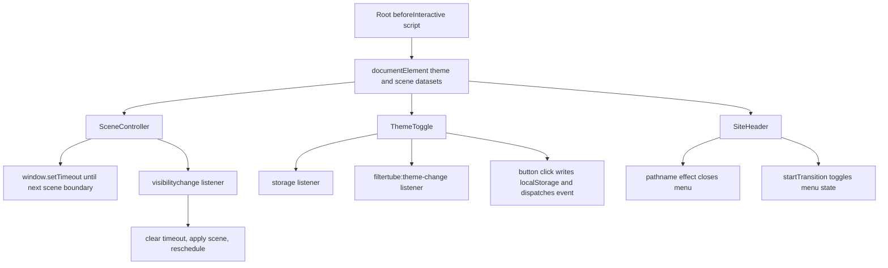

# FilterTube Website Client Lifecycle Surface - Current Behavior

Date: 2026-05-21

Status: audit-only proof. Runtime behavior is unchanged. This is not an
implementation patch, website behavior change, build proof, analytics approval,
or first-class JSON filter public-claim gate.

This slice extends the active audit goal for tracked website client lifecycle
code. It complements the website route/asset and package/config slices by
pinning the current client components, root hydration script, listener/timer
ownership, localStorage theme path, menu interactions, and missing proof gates.

## Source Boundary

Current `git ls-files website/app/*.js website/components/*.js` contains 22
tracked JavaScript files. Only three files start with `"use client";`:

- `website/components/scene-controller.js`
- `website/components/site-header.js`
- `website/components/theme-toggle.js`

The root route layout is server-authored React code, but it embeds one
`beforeInteractive` script that mutates the document before hydration.

Representative lifecycle-source fingerprints:

| Path | Lines | Bytes | SHA-256 |
| --- | ---: | ---: | --- |
| `website/app/layout.js` | 129 | 3,621 | `9821e403c734a9b40c311be208a35fd6a3afc09e0ac240fa7c681e8aaba410b4` |
| `website/components/scene-controller.js` | 88 | 1,871 | `9a396c57e3e91249916e3d0d1ecc3ce11a85885b32bd8dd8640311fbc1394a67` |
| `website/components/site-header.js` | 186 | 7,700 | `6ffe1ff1815300d7e9f407c27bebe7bff14e2e6c1a794ce5290b9c0eb8c6f734` |
| `website/components/theme-toggle.js` | 106 | 3,577 | `17352421ab9eee46d72aded73f0b1dacb27e8ab0b93dad7096c7343b4bdd323d` |

## Lifecycle Primitive Totals

Across the 22 tracked website app/component JavaScript files, current source has:

| Primitive | Count | Current owner |
| --- | ---: | --- |
| `useEffect(...)` calls | 3 | scene controller, site header, theme toggle |
| `useEffectEvent(...)` calls | 1 | scene controller |
| `useState(...)` calls | 2 | site header, theme toggle |
| `startTransition(...)` calls | 1 | site header menu toggle |
| `window`/`document` `addEventListener(...)` calls | 3 | scene controller, theme toggle |
| `window`/`document` `removeEventListener(...)` calls | 3 | scene controller, theme toggle |
| `window.setTimeout(...)` calls | 1 | scene controller |
| `window.clearTimeout(...)` calls | 2 | scene controller |
| `window.localStorage.getItem(...)` calls | 2 | layout bootstrap, theme toggle |
| `window.localStorage.setItem(...)` calls | 1 | theme toggle |
| `window.dispatchEvent(...)` calls | 1 | theme toggle |
| JSX `onClick=` props | 4 | site header and theme toggle |

Current tracked website app/component JavaScript has zero `fetch(...)`,
`MutationObserver`, `IntersectionObserver`, `ResizeObserver`, `setInterval`,
`clearInterval`, `requestAnimationFrame`, `cancelAnimationFrame`, and
`sessionStorage` references.

## Root Hydration Script

`website/app/layout.js` renders `<Script id="filtertube-js"
strategy="beforeInteractive">`. That inline script currently:

- adds the `js` class to `document.documentElement`;
- reads `window.localStorage.getItem('filtertube-theme')`;
- derives scene from local hour thresholds: night at `hour >= 20 || hour < 5`,
  sunset at `hour >= 17`, day at `hour >= 10`, otherwise dawn;
- writes `data-theme-preference`, `data-theme`, `data-scene`, and
  `style.colorScheme`;
- falls back to light/day state if any script step throws.

This bootstrap is a hydration-consistency behavior, not a filtering behavior.
Future website theme changes still need a named hydration-script contract before
the page claims deterministic first paint or local preference correctness.

## Scene Controller

`website/components/scene-controller.js` defines four scene boundaries:

- 05:00 `dawn`
- 10:00 `day`
- 17:00 `sunset`
- 20:00 `night`

`SceneController` currently uses one `useEffectEvent` and one `useEffect`. The
effect applies the current scene, schedules the next boundary with
`window.setTimeout(..., nextBoundary.getTime() - now.getTime() + 250)`, and
registers `document.addEventListener("visibilitychange", handleVisibility)`.

When visibility returns to visible, it clears the prior timeout, reapplies the
scene, and schedules again. Cleanup clears the timeout and removes the
visibility listener.

This is a bounded lifecycle surface, but it is not yet performance-proofed:
there is no route-level timer budget, long-sleep drift fixture, background-tab
fixture, hydration mismatch fixture, or screenshot proving scene transitions
across routes.

## Theme Toggle

`website/components/theme-toggle.js` owns:

- storage key `filtertube-theme`;
- custom event name `filtertube:theme-change`;
- one `storage` listener that syncs when `event.key` is missing or equals the
  storage key;
- one custom theme-sync listener;
- two matching cleanup removals;
- one theme-write path through `window.localStorage.setItem(storageKey,
  resolvedTheme)`;
- one `window.dispatchEvent(new CustomEvent(themeSyncEvent, ...))` call.

The root script and the React component both normalize non-dark values to
`light`. That keeps current behavior simple, but no `localStorage` error
fixture, cross-tab fixture, or duplicated-toggle fixture exists yet. The mobile
and desktop toggles can coexist through the custom event path, but that is
source-local behavior rather than a named theme preference authority.

## Site Header

`website/components/site-header.js` is the only other client component. It has
one `useState(false)` menu state, one `useEffect` that closes the menu whenever
`pathname` changes, and one `startTransition` call around the mobile menu
toggle.

The file has no DOM listeners, timers, observers, storage access, or direct
document/window mutation. Interaction is delegated through four JSX `onClick=`
props across the header and theme toggle surface:

- mobile menu button calls `toggleMenu`;
- mobile nav links call `setMenuOpen(false)`;
- theme toggle button calls `handleThemeChange(nextTheme)`;
- shared `NavLink` passes an optional click handler to `next/link`.

This keeps listener risk low, but route-change menu closure, focus management,
body scroll behavior, escape-key behavior, and mobile overlay click-away behavior
remain unproven.

## Website Client Method Semantic Addendum - 2026-05-27

This addendum promotes the website client lifecycle slice from primitive counts
to selected method/callback semantics. It is still audit-only and does not
approve website behavior changes, client lifecycle cleanup, listener/timer
changes, route copy changes, public-claim changes, or first-class JSON filter
promotion.

Current selected rows:

```text
website client method/callback rows covered: 22
scene controller rows: 8
theme toggle rows: 8
site header rows: 5
reveal rows: 1
website client listener rows covered: 3
website client timer rows covered: 1
website client storage-write rows covered: 1
website client dispatch rows covered: 1
runtime behavior changed by this addendum: no
```

ASCII lifecycle flow:

```text
root layout bootstrap
        |
        v
documentElement data-theme/data-scene set before hydration
        |
        +--> SceneController
        |       |
        |       +--> apply scene
        |       +--> set timeout for next scene boundary
        |       +--> visibilitychange listener refreshes after background tab
        |
        +--> ThemeToggle
        |       |
        |       +--> read localStorage / root dataset
        |       +--> storage listener
        |       +--> filtertube:theme-change listener
        |       +--> click writes localStorage and dispatches custom event
        |
        +--> SiteHeader
                |
                +--> pathname effect closes mobile menu
                +--> startTransition toggles menu state
```

Mermaid lifecycle flow:



| Semantic row | Source | Owner / trigger / inputs | Side effects and no-work behavior | Missing proof before behavior changes |
| --- | --- | --- | --- | --- |
| `website_scene_getSceneForHour` | `website/components/scene-controller.js:12` | Pure scene classifier. Input is local hour. | No DOM, storage, listener, timer, or network side effect. | Timezone/first-paint parity and visual snapshot proof. |
| `website_scene_getNextSceneBoundary` | `website/components/scene-controller.js:25` | Pure next-boundary calculator. Input is a `Date`. | No DOM side effect; prepares the next timer deadline. | Long sleep, clock drift, and background-tab fixtures. |
| `website_scene_SceneController` | `website/components/scene-controller.js:50` | Client component mounted from the website layout. Inputs are current time and document visibility. | Installs one timeout owner and one visibility listener through the effect. | Route-level timer budget and teardown proof across navigation. |
| `website_scene_applyScene` | `website/components/scene-controller.js:51` | `useEffectEvent` callback. Input is `document.documentElement` and `new Date()`. | Writes `documentElement.dataset.scene`. | Hydration mismatch and first-paint parity proof. |
| `website_scene_scheduleNextUpdate` | `website/components/scene-controller.js:60` | Effect-local scheduler. Inputs are `getNextSceneBoundary(now)` and `applyScene`. | Writes one `timeoutId` via `window.setTimeout`. | Negative timer duplication fixture and route remount proof. |
| `website_scene_timerCallback` | `website/components/scene-controller.js:63` | Timeout callback owned by `scheduleNextUpdate`. | Calls `applyScene()` then recursively schedules the next boundary. | Long-running tab drift and shutdown proof. |
| `website_scene_handleVisibility` | `website/components/scene-controller.js:69` | `visibilitychange` listener. Input is `document.visibilityState`. | Clears prior timeout, applies scene, and reschedules only when visible. | Hidden-to-visible fixture and event-listener idempotence proof. |
| `website_scene_effectCleanup` | `website/components/scene-controller.js:81` | Effect cleanup. | Clears timeout and removes the visibility listener. | Unmount/remount listener-count proof. |
| `website_theme_normalizeThemePreference` | `website/components/theme-toggle.js:9` | Pure preference normalizer. Input is caller-provided theme text. | Converts every non-`dark` value to `light`. | Public copy and localStorage schema authority. |
| `website_theme_applyTheme` | `website/components/theme-toggle.js:13` | Theme DOM writer. Input is normalized preference. | Writes `data-theme-preference`, `data-theme`, and `style.colorScheme`. | Hydration parity, style ownership, and no-DOM fallback proof. |
| `website_theme_getStoredThemePreference` | `website/components/theme-toggle.js:22` | Client preference reader. Inputs are `window.localStorage` and root dataset fallback. | Reads localStorage when `window` exists; no write. | localStorage error and cross-tab fixture. |
| `website_theme_ThemeToggle` | `website/components/theme-toggle.js:34` | Client theme control component. Inputs are `mobile`, local state, storage, and custom events. | Installs storage/theme listeners and renders one click button. | Duplicate-toggle and mobile/desktop sync fixture. |
| `website_theme_syncPreference` | `website/components/theme-toggle.js:38` | Effect-local sync callback. | Reads preference, sets React state, and applies theme. | Cross-tab and stale dataset fixture. |
| `website_theme_handleStorage` | `website/components/theme-toggle.js:46` | `storage` listener. Input is `event.key`. | Syncs when key is absent or equals `filtertube-theme`. | Other-key negative fixture and multi-window proof. |
| `website_theme_handleThemeSync` | `website/components/theme-toggle.js:51` | Custom `filtertube:theme-change` listener. Input is `event.detail.themePreference`. | Normalizes, updates state, and applies theme. | Spoofed-event and malformed-detail fixture. |
| `website_theme_handleThemeChange` | `website/components/theme-toggle.js:67` | Button click handler. Input is requested next theme. | Writes localStorage, applies theme, and dispatches the custom event. | localStorage failure, duplicate listener, and accessibility fixture. |
| `website_header_NavLink` | `website/components/site-header.js:16` | Shared navigation link renderer. Inputs are href, label, pathname, mobile, and platform-active state. | No listener registration; passes optional click handler to `next/link`. | Active-link route matrix and keyboard/focus proof. |
| `website_header_SiteHeader` | `website/components/site-header.js:47` | Client header component. Inputs are `usePathname()`, route data, theme toggle, and menu state. | Renders fixed header, mobile overlay, links, and theme toggles. | Body scroll, focus trap, escape key, and click-away fixture. |
| `website_header_routeCloseEffect` | `website/components/site-header.js:52` | Route-change effect. Input is `pathname`. | Calls `setMenuOpen(false)` after route changes. | Route transition and pending-transition fixture. |
| `website_header_toggleMenu` | `website/components/site-header.js:56` | Mobile menu button handler. | Wraps menu state inversion in `startTransition`. | Rapid-click, focus, and overlay-state proof. |
| `website_header_transitionCallback` | `website/components/site-header.js:57` | `startTransition` callback. | Toggles React state from current value. | Transition ordering proof with route-change close. |
| `website_reveal_Reveal` | `website/components/reveal.js:1` | Server/simple component wrapper. Inputs are component type, children, and className. | Writes `data-reveal="true"` only in rendered markup; no client lifecycle primitive. | Reveal CSS/JS ownership and no-JS visibility proof. |

Current website client method status:

```text
website client method semantic proof: PARTIAL
website client lifecycle cleanup approval: NO-GO
website theme preference authority approval: NO-GO
website timer/listener budget approval: NO-GO
website first-class JSON public-claim use: NO-GO
runtime behavior changed: no
```

## Public-Claim And JSON-First Boundary

This website lifecycle slice does not make JSON filtering a first-class runtime
path. It only proves the website shell currently has a small client lifecycle
surface and no tracked website `fetch(...)` or observer usage. Public website
claims about filtering, performance, Android/iOS availability, and local-first
behavior still need runtime parity, artifact, route screenshot, and current
release evidence before they can support implementation or marketing changes.

## Missing Authority Symbols

No tracked website app/component source currently implements:

- `websiteClientLifecycleAuthority`
- `websiteHydrationScriptContract`
- `websiteSceneScheduleBudget`
- `websiteThemePreferenceAuthority`
- `websiteClientListenerRegistry`
- `websiteClientTimerBudget`
- `websiteLocalStorageContract`
- `websiteHeaderMenuInteractionAuthority`
- `websiteClientLifecycleFixtureProvenance`
- `websiteFirstClassJsonPublicClaimGate`

## Completion Boundary

This register does not close website tracked-file obligations. It pins current
client component ownership, lifecycle primitive counts, theme bootstrap and
storage behavior, scene timer/listener behavior, and mobile menu interaction
facts. Before changing website lifecycle behavior, optimizing hydration, making
performance claims, removing client components, adding remote/client fetches,
or using website copy as evidence for first-class JSON filtering, future work
still needs route smoke proof, browser screenshots, accessibility fixtures,
timer/listener budgets, localStorage error and cross-tab fixtures, analytics and
remote request policy, deploy artifact evidence, and public-claim parity proof.

## Method Semantic Proof Gap Boundary

`docs/audit/FILTERTUBE_METHOD_SEMANTIC_PROOF_GAP_INDEX_CURRENT_BEHAVIOR_2026-05-25.md`
is a required source input before this website/build-route surface can support
runtime optimization. Current proof pins:

```text
method semantic proof gap files covered: 69
method semantic proof gap lexical callables covered: 5736
files with complete per-callable semantic proof: 0
lexical callables requiring semantic proof before behavior changes: 5736
affected callable semantic proof: NO-GO
runtime behavior changed: no
```

These counts are audit-only blockers. They do not approve runtime
optimization, JSON-first behavior, website route behavior, website public copy,
deployment claims, remote request changes, whitelist behavior, metric
collectors, artifact creation, native sync, release package changes, or public
claims.
