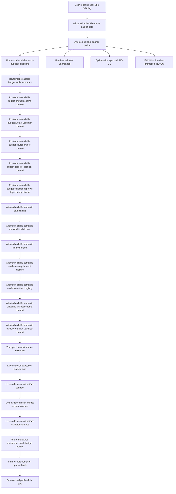

# FilterTube Whitelist/Cache SPA Affected Callable Proof Boundary - Current Behavior - 2026-05-30

Status: audit-only current-behavior whitelist/cache SPA affected-callable proof boundary.
Runtime behavior is unchanged. This is not an implementation patch,
optimization patch, metric collector patch, JSON-first behavior patch, whitelist
policy patch, cache behavior patch, release package patch, live smoke completion
claim, native sync patch, or public performance claim.

## Purpose

The whitelist/cache SPA metric packet still blocks broad optimization because
the exact affected runtime callables must be named before any patch can prune,
move, or skip work. This document converts that blocker into a concrete
current-source callable packet for the user-reported YouTube lag path: whitelist
pending work, learned video/channel cache writes, settings refresh fanout,
DOM fallback reruns, handle resolution, and JSON transport gates.

Current answer:

```text
selected affected-callable packet: FT-WLCACHE-SPA-AFFECTED-00-boundary
affected callable proof rows: 12
affected source files covered: 8
line or branch anchors covered: 26
affected source fingerprint rows: 8
route/mode callable obligation rows: 8
route/mode states considered: 6
route/mode callable budget fields required: 14
route/mode callable budget contract rows: 8
route/mode callable budget artifact paths reserved: 1
committed route/mode callable budget artifacts: 0
route/mode callable budget artifact root exists: no
route/mode callable budget JSON sections: 8
route/mode callable budget route cells required: 36
route/mode callable budget counter families required: 6
route/mode callable budget artifact required fields: 24
route/mode callable budget artifact schema rows: 8
route/mode callable budget artifact schema field groups required: 8
route/mode callable budget artifact schemas approved: 0
route/mode callable budget artifact schema fields required: 24
route/mode callable budget artifact validator rows: 8
route/mode callable budget artifact validator check families required: 8
route/mode callable budget artifact validators approved: 0
route/mode callable budget artifact validator fields required: 26
route/mode callable budget source-owner contract rows: 8
route/mode callable budget source-owner files covered: 8
route/mode callable budget source-owner anchors reused: 26
route/mode callable budget source-owner required fields: 18
route/mode callable budget collector preflight rows: 8
route/mode callable budget collector preflight fields required: 20
route/mode callable budget collector preflight counter families covered: 6
route/mode callable budget collector approval dependency rows: 12
route/mode callable budget collector approval upstream docs covered: 10
route/mode callable budget collector approval dependency fields required: 20
affected callable semantic gap binding rows: 8
affected source files with method-gap rows: 8
affected lexical callables requiring semantic proof: 2871
affected semantic proof required fields: 8
affected callable semantic required-field closure rows: 8
affected callable semantic file-field cells required: 64
affected callable semantic required-field closure fields required: 16
affected callable semantic file-field matrix rows: 8
affected callable semantic file-field matrix cells required: 64
affected callable semantic file-field matrix approved cells: 0
affected callable semantic file-field matrix fields required: 18
affected callable semantic evidence requirement rows: 8
affected callable semantic evidence file-field cells gated: 64
affected callable semantic evidence required artifacts: 8
affected callable semantic evidence approved artifacts: 0
affected callable semantic evidence closure fields required: 18
affected callable semantic evidence artifact registry rows: 8
affected callable semantic evidence artifact paths reserved: 8
committed affected callable semantic evidence artifacts: 0
affected callable semantic evidence artifact registry fields required: 20
affected callable semantic evidence artifact root exists: no
affected callable semantic evidence artifact schema rows: 8
affected callable semantic evidence artifact schema field groups required: 8
affected callable semantic evidence artifact schemas approved: 0
affected callable semantic evidence artifact schema fields required: 20
affected callable semantic evidence artifact validator rows: 8
affected callable semantic evidence artifact validator check families required: 8
affected callable semantic evidence artifact validators approved: 0
affected callable semantic evidence artifact validator fields required: 22
affected files with complete per-callable semantic proof: 0
transport no-work source evidence rows: 8
transport no-work source anchors covered: 25
live evidence execution blocker rows: 8
live evidence execution blocker fields required: 15
live evidence result artifact contract rows: 8
live evidence result artifact path reserved: 1
committed live evidence result artifacts: 0
live evidence result artifact root exists: no
live evidence result artifact route cells required: 36
live evidence result artifact counter families covered: 6
live evidence result artifact fields required: 24
live evidence result artifact schema rows: 8
live evidence result artifact schema field groups required: 8
live evidence result artifact schemas approved: 0
live evidence result artifact schema fields required: 24
live evidence result artifact validator rows: 8
live evidence result artifact validator check families required: 8
live evidence result artifact validators approved: 0
live evidence result artifact validator fields required: 26
current implementation-ready affected callable rows: 0
implementation-ready route/mode callable rows: 0
route/mode callable budget implementation-ready rows: 0
route/mode callable budget artifact schema implementation-ready rows: 0
route/mode callable budget artifact validator implementation-ready rows: 0
route/mode callable budget source-owner implementation-ready rows: 0
route/mode callable budget collector preflight implementation-ready rows: 0
route/mode callable budget collector approval dependency implementation-ready rows: 0
implementation-ready affected semantic rows: 0
implementation-ready affected semantic field rows: 0
implementation-ready affected semantic matrix rows: 0
implementation-ready affected semantic evidence rows: 0
implementation-ready affected semantic artifact rows: 0
implementation-ready affected semantic artifact schema rows: 0
implementation-ready affected semantic artifact validator rows: 0
implementation-ready transport no-work rows: 0
implementation-ready live evidence execution blocker rows: 0
implementation-ready live evidence result artifact rows: 0
implementation-ready live evidence result artifact schema rows: 0
implementation-ready live evidence result artifact validator rows: 0
runtime whitelist/cache optimization approvals: 0
runtime route/mode callable budget approvals: 0
runtime route/mode callable budget artifact schema approvals: 0
runtime route/mode callable budget artifact validator approvals: 0
runtime route/mode callable budget source-owner approvals: 0
runtime route/mode callable budget collector insertion approvals: 0
runtime route/mode callable budget collector approvals: 0
runtime route/mode callable budget collector approval dependencies approved: 0
runtime affected callable semantic approvals: 0
runtime affected callable semantic field approvals: 0
runtime affected callable semantic matrix approvals: 0
runtime affected callable semantic evidence approvals: 0
runtime affected callable semantic artifact approvals: 0
runtime affected callable semantic artifact schema approvals: 0
runtime affected callable semantic artifact validator approvals: 0
runtime transport no-work approvals: 0
runtime live evidence execution approvals: 0
runtime live evidence result artifact approvals: 0
runtime live evidence result artifact schema approvals: 0
runtime live evidence result artifact validator approvals: 0
runtime JSON-first first-class promotion approvals: 0
release readiness from affected callable proof: NO-GO
source fingerprint release readiness: NO-GO
route/mode callable budget release readiness: NO-GO
route/mode callable budget artifact promotion decision: NO-GO
route/mode callable budget artifact schema promotion decision: NO-GO
route/mode callable budget artifact validator promotion decision: NO-GO
route/mode callable budget source-owner promotion decision: NO-GO
route/mode callable budget collector preflight promotion decision: NO-GO
route/mode callable budget collector approval dependency promotion decision: NO-GO
affected callable semantic proof promotion decision: NO-GO
affected callable semantic required-field promotion decision: NO-GO
affected callable semantic file-field matrix promotion decision: NO-GO
affected callable semantic evidence promotion decision: NO-GO
affected callable semantic evidence artifact registry promotion decision: NO-GO
affected callable semantic evidence artifact schema promotion decision: NO-GO
affected callable semantic evidence artifact validator promotion decision: NO-GO
transport no-work release readiness: NO-GO
live evidence execution release readiness: NO-GO
live evidence result artifact promotion decision: NO-GO
live evidence result artifact schema promotion decision: NO-GO
live evidence result artifact validator promotion decision: NO-GO
runtime behavior changed: no
not completion proof for whitelist/cache optimization
```

## Source Inputs

| Input | Current proof used |
| --- | --- |
| `docs/audit/FILTERTUBE_WHITELIST_CACHE_SPA_METRIC_PACKET_GATE_CURRENT_BEHAVIOR_2026-05-29.md` | Keeps live SPA, installed-byte parity, route/mode, work-budget, pending/cache, settings/behavior, JSON-first rollout, and release readiness at `NO-GO`. |
| `docs/audit/FILTERTUBE_WHITELIST_CACHE_HOT_PATH_BOUNDARY_CURRENT_BEHAVIOR_2026-05-25.md` | Proves duplicate map persistence and DOM rerun suppression for selected hot paths while keeping broader cache behavior blocked. |
| `docs/audit/FILTERTUBE_METHOD_SEMANTIC_PROOF_GAP_INDEX_CURRENT_BEHAVIOR_2026-05-25.md` | Keeps complete per-callable semantic proof absent across runtime files. |
| `docs/audit/FILTERTUBE_JSON_FIRST_IMPLEMENTATION_AUTHORITY_BOUNDARY_CURRENT_BEHAVIOR_2026-05-24.md` | Keeps JSON-first implementation authority and first-class promotion absent. |
| `docs/audit/FILTERTUBE_FIRST_OPTIMIZATION_SOURCE_LOCUS_CALLABLE_ANCHOR_BOUNDARY_CURRENT_BEHAVIOR_2026-05-24.md` | Requires exact callable and branch anchors before optimization implementation work can be approved. |
| `docs/audit/FILTERTUBE_SETTINGS_REFRESH_OPTIMIZATION_CANDIDATE_EVIDENCE_PACKET_CONTRACT_CURRENT_BEHAVIOR_2026-05-29.md` | Keeps settings-refresh pruning blocked until producer, consumer, route/mode, and evidence packets are complete. |
| `docs/audit/FILTERTUBE_CONTENT_FILTER_ROUTE_SURFACE_NO_WORK_BUDGET_CURRENT_BEHAVIOR_2026-05-29.md` | Keeps route/surface no-work budgets required before JSON/DOM/filter work can be skipped broadly. |

## Current Source Fingerprint Closure

This closure pins the file revisions that own the affected callable anchors.
It does not approve implementation work; it only prevents the callable packet
from being treated as current if any of these source files drift without a
matching audit refresh.

```text
affected source fingerprint rows: 8
affected source files covered: 8
source fingerprint release readiness: NO-GO
runtime source-owner approvals: 0
runtime behavior changed: no
```

| Source file | Line count | Bytes | SHA-256 | Current role |
| --- | ---: | ---: | --- | --- |
| `js/filter_logic.js` | 3653 | 172174 | `953ef0f14970e6cfbc11215fe9eaa078ced34f001908e1c6d5903a8fd2d9a1f5` | JSON decision, map producers, whitelist branch. |
| `js/content_bridge.js` | 13637 | 604184 | `8d55d0c8995e5b68bb9142c41f95046a676f5af2b83f8545b00f91a6a5a3776d` |
| `js/content/bridge_settings.js` | 846 | 34241 | `aea46dd241248db1d1d9bcbdfdf65320d1399ecd84cc7792678f29b1b26ee092` |
| `js/background.js` | 6344 | 286370 | `ce17fee7a80398be91f89e286ef0dea8c85deff0b4363729d79a957c9989cd36` |
| `js/content/dom_fallback.js` | 5031 | 235555 | `fdc4391aed06849c1ba0a9afbb5b05e5e115b0929639e7014738d1462bf13ec5` | rendered-card fallback pass and whitelist-pending recheck. |
| `js/content/handle_resolver.js` | 283 | 9785 | `67cc877a0a97e4c4c5aaf5a0d1c37c15000af5238f8f37d7c5dc6efee27e34ff` | handle resolution and pending DOM fallback rerun trigger. |
| `js/seed.js` | 1137 | 50026 | `a9d86cd973b998ffbd58faf316ca679267ce7267af36969683f32b760f49054d` | MAIN-world fetch/XHR active-work and no-work gates. |
| `js/injector.js` | 3594 | 155830 | `634041581ec84db2edd4f07d46f4bfb9d3a7d97036a0fb83db7739856bdc3e04` | MAIN-world initial data processing, replay queue, and no-work gates. |

## Affected Callable Rows

| Row | Callable or branch anchors | Current optimization risk | Current state |
| --- | --- | --- | --- |
| `FT-WLCACHE-AFFECTED-00-filter-map-producers` | `js/filter_logic.js:58` `queueVideoChannelMapping`; `js/filter_logic.js:94` `queueVideoMetaMapping` | These producers enqueue learned video/channel and metadata side effects from JSON decisions. Skipping them without proof can break later channel blocking, whitelist identity resolution, and metadata content filters. | Anchor-only proof; implementation readiness `NO-GO`. |
| `FT-WLCACHE-AFFECTED-01-filter-whitelist-decision` | `js/filter_logic.js:1957` `_shouldBlock`; `js/filter_logic.js:2065` whitelist branch | This is the central list-mode decision path. Any pruning must preserve blocklist hide, whitelist allow-only, comment exemption, scaffolding preservation, and collaborator identity semantics. | Anchor-only proof; implementation readiness `NO-GO`. |
| `FT-WLCACHE-AFFECTED-02-right-rail-whitelist-refresh` | `js/content_bridge.js:1219` `installRightRailWhitelistObserver`; `js/content_bridge.js:1227` `runWhitelistRefreshPass` | The watch/right-rail SPA refresh path can become a lag source if it schedules fallback work on routes or modes that do not need pending whitelist processing. | Anchor-only proof; implementation readiness `NO-GO`. |
| `FT-WLCACHE-AFFECTED-03-visible-card-identity-prefetch` | `js/content_bridge.js:1391` `prefetchIdentityForCard`; `js/content/handle_resolver.js:149` `fetchIdForHandle` | Visible-card identity prefetch can improve whitelist correctness but can also add network/cache work during SPA scroll and hydration. | Anchor-only proof; implementation readiness `NO-GO`. |
| `FT-WLCACHE-AFFECTED-04-video-channel-content-cache` | `js/content_bridge.js:1638` `persistVideoChannelMapping`; `js/content_bridge.js:5913` `FilterTube_UpdateVideoChannelMap` message branch | Channel-map persistence and DOM stamping can trigger fallback reruns. Optimizing it must preserve learned channel blocking and avoid duplicate rerun churn. | Anchor-only proof; implementation readiness `NO-GO`. |
| `FT-WLCACHE-AFFECTED-05-video-meta-content-cache` | `js/content_bridge.js:1649` `persistVideoMetaMapping`; `js/content_bridge.js:1714` `scheduleVideoMetaDomRerun`; `js/content_bridge.js:5962` `FilterTube_UpdateVideoMetaMap` message branch | Metadata map persistence feeds duration/date/category filters and can schedule DOM reruns after JSON mapping. Pruning must preserve metadata correctness and avoid stale pending cards. | Anchor-only proof; implementation readiness `NO-GO`. |
| `FT-WLCACHE-AFFECTED-06-background-video-channel-cache` | `js/background.js:1648` `enqueueVideoChannelMapUpdate`; `js/background.js:1774` `getCompiledSettings` | Background channel-map cache updates influence compiled settings returned to content scripts. Optimization must preserve refresh ordering and profile isolation. | Anchor-only proof; implementation readiness `NO-GO`. |
| `FT-WLCACHE-AFFECTED-07-background-video-meta-cache` | `js/background.js:1673` `enqueueVideoMetaMapUpdate`; `js/background.js:1774` `getCompiledSettings` | Background metadata cache updates influence compiled settings and can drift from content cache behavior if load order or eviction changes. | Anchor-only proof; implementation readiness `NO-GO`. |
| `FT-WLCACHE-AFFECTED-08-storage-refresh-fanout` | `js/content/bridge_settings.js:751` `scheduleSettingsRefreshFromStorage`; `js/content/bridge_settings.js:783` `handleStorageChanges` | Storage refresh coalescing controls forced reprocess behavior after rule/profile/cache updates. It must not drop force-reprocess semantics or wake heavy work for map-only changes. | Anchor-only proof; implementation readiness `NO-GO`. |
| `FT-WLCACHE-AFFECTED-09-dom-fallback-pending-recheck` | `js/content/dom_fallback.js:2219` `applyDOMFallback`; `js/content/dom_fallback.js:4139` `onlyWhitelistPending` branch | DOM fallback is the broad rendered-card pass. It must keep cheap gates before selector traversal and avoid running full fallback when only whitelist pending rows are needed. | Anchor-only proof; implementation readiness `NO-GO`. |
| `FT-WLCACHE-AFFECTED-10-handle-resolver-pending-cache` | `js/content/handle_resolver.js:136` `scheduleDomFallbackRerun`; `js/content/handle_resolver.js:149` `fetchIdForHandle` | Handle resolution can fill missing channel identity, but pending or failed identity work can repeatedly wake fallback processing if not bounded. | Anchor-only proof; implementation readiness `NO-GO`. |
| `FT-WLCACHE-AFFECTED-11-transport-active-work-gates` | `js/seed.js:220` `hasActiveJsonFilterRules`; `js/seed.js:253` `shouldBypassYouTubeiNetworkResponse`; `js/seed.js:263` `shouldSkipEngineProcessing`; `js/injector.js:171` `hasActiveJsonFilterRules`; `js/injector.js:3405` `processDataWithFilterLogic` | JSON transport work must stay gated when settings are disabled or no active JSON work exists, while whitelist mode and active rules still process correctly. | Anchor-only proof; implementation readiness `NO-GO`. |

## Route/Mode Callable Work-Budget Obligations

This matrix does not measure runtime work and does not approve pruning. It
names the route/mode obligations that any future metric artifact or
implementation patch must prove for the affected callable rows above.

```text
route/mode callable obligation rows: 8
route/mode states considered: disabled, empty-blocklist, active-blocklist, empty-whitelist, active-whitelist, no-useful-rule
route/mode callable budget fields required: 14
implementation-ready route/mode callable rows: 0
runtime route/mode callable budget approvals: 0
route/mode callable budget release readiness: NO-GO
```

Required future fields:

```text
packet_id
affected_callable_row_id
route_start
route_end
surface
list_mode_state
settings_enabled
rule_state
expected_work_family
allowed_work_reason
forbidden_work_reason
observed_counter_required
side_effect_preservation
verdict
```

| Row | Covered affected row(s) | Route/mode obligation | Current state |
| --- | --- | --- | --- |
| `FT-WLCACHE-ROUTEMODE-CALLABLE-00-disabled-transport` | `FT-WLCACHE-AFFECTED-11-transport-active-work-gates` | Disabled settings and missing settings must bypass JSON clone/parse/replay work while preserving page data. | Obligation named; metric proof `NO-GO`. |
| `FT-WLCACHE-ROUTEMODE-CALLABLE-01-empty-blocklist-transport` | `FT-WLCACHE-AFFECTED-11-transport-active-work-gates` | Empty blocklist or no useful rule state should avoid JSON processing unless an active content-control field still needs JSON work. | Obligation named; metric proof `NO-GO`. |
| `FT-WLCACHE-ROUTEMODE-CALLABLE-02-active-blocklist-json` | `FT-WLCACHE-AFFECTED-00-filter-map-producers`; `FT-WLCACHE-AFFECTED-01-filter-whitelist-decision`; `FT-WLCACHE-AFFECTED-11-transport-active-work-gates` | Active blocklist rules must preserve JSON hide decisions, learned map producers, and blocklist side effects while avoiding unrelated whitelist pending work. | Obligation named; metric proof `NO-GO`. |
| `FT-WLCACHE-ROUTEMODE-CALLABLE-03-empty-whitelist-json` | `FT-WLCACHE-AFFECTED-01-filter-whitelist-decision`; `FT-WLCACHE-AFFECTED-09-dom-fallback-pending-recheck`; `FT-WLCACHE-AFFECTED-11-transport-active-work-gates` | Empty whitelist mode must preserve current fail-closed whitelist behavior, selected/scaffold exceptions, and no-leak expectations before work is skipped. | Obligation named; metric proof `NO-GO`. |
| `FT-WLCACHE-ROUTEMODE-CALLABLE-04-active-whitelist-pending-rail` | `FT-WLCACHE-AFFECTED-02-right-rail-whitelist-refresh`; `FT-WLCACHE-AFFECTED-09-dom-fallback-pending-recheck`; `FT-WLCACHE-AFFECTED-10-handle-resolver-pending-cache` | Active whitelist watch/right-rail routes must bound pending-card fallback passes while still resolving identity enough to avoid false hides and leaks. | Obligation named; metric proof `NO-GO`. |
| `FT-WLCACHE-ROUTEMODE-CALLABLE-05-visible-identity-prefetch` | `FT-WLCACHE-AFFECTED-03-visible-card-identity-prefetch`; `FT-WLCACHE-AFFECTED-10-handle-resolver-pending-cache` | Visible-card prefetch and handle resolution need route/surface limits so scroll and SPA hydration do not repeatedly wake network or fallback work. | Obligation named; metric proof `NO-GO`. |
| `FT-WLCACHE-ROUTEMODE-CALLABLE-06-map-only-refresh` | `FT-WLCACHE-AFFECTED-04-video-channel-content-cache`; `FT-WLCACHE-AFFECTED-05-video-meta-content-cache`; `FT-WLCACHE-AFFECTED-06-background-video-channel-cache`; `FT-WLCACHE-AFFECTED-07-background-video-meta-cache`; `FT-WLCACHE-AFFECTED-08-storage-refresh-fanout` | Map-only refreshes must avoid broad forced reprocess when bytes are unchanged, while real rule/profile changes must still force visible-card reprocessing. | Obligation named; metric proof `NO-GO`. |
| `FT-WLCACHE-ROUTEMODE-CALLABLE-07-meta-rerun` | `FT-WLCACHE-AFFECTED-05-video-meta-content-cache`; `FT-WLCACHE-AFFECTED-09-dom-fallback-pending-recheck` | Metadata DOM reruns must preserve duration/date/category filters while bounding rerun fanout and stale pending-card cleanup after SPA navigation. | Obligation named; metric proof `NO-GO`. |

## Route/Mode Callable Budget Artifact Contract

This section defines the future artifact shape required before the affected
callable packet can be promoted from source anchors to measured work-budget
evidence. It reserves one path only; it does not create the artifact directory,
write a metric artifact, approve collectors, or change runtime behavior.

```text
route/mode callable budget contract rows: 8
route/mode callable budget artifact paths reserved: 1
reserved route/mode callable budget artifact path: docs/audit/artifacts/whitelist-cache-spa/route-mode-callable-budget.json
committed route/mode callable budget artifacts: 0
route/mode callable budget artifact root exists: no
route/mode callable budget JSON sections: 8
route/mode callable budget route cells required: 36
route/mode callable budget counter families required: 6
route/mode callable budget artifact required fields: 24
route/mode callable budget runtime approvals: 0
route/mode callable budget implementation-ready rows: 0
route/mode callable budget artifact promotion decision: NO-GO
runtime behavior changed: no
```

Required future artifact shape:

```json
{
  "schemaVersion": "whitelist-cache-spa-route-mode-callable-budget-contract-2026-05-30",
  "packetId": "FT-WLCACHE-SPA-AFFECTED-00-boundary",
  "artifactPath": "docs/audit/artifacts/whitelist-cache-spa/route-mode-callable-budget.json",
  "artifactPromotionDecision": "NO-GO",
  "runtimeBehaviorChanged": false,
  "routeRows": [
    "FT-LIVE-SPA-00-home-to-search",
    "FT-LIVE-SPA-01-search-to-channel",
    "FT-LIVE-SPA-02-channel-to-watch",
    "FT-LIVE-SPA-03-watch-to-home",
    "FT-LIVE-SPA-04-watch-rail-scroll",
    "FT-LIVE-SPA-05-cache-repeat-navigation"
  ],
  "listModeStates": [
    "FT-WLCACHE-MODE-00-disabled",
    "FT-WLCACHE-MODE-01-empty-blocklist",
    "FT-WLCACHE-MODE-02-active-blocklist",
    "FT-WLCACHE-MODE-03-empty-whitelist",
    "FT-WLCACHE-MODE-04-active-whitelist",
    "FT-WLCACHE-MODE-05-no-useful-rule"
  ],
  "sections": [
    {
      "id": "FT-WLCACHE-ROUTEMODE-BUDGET-00-contract-binding",
      "purpose": "Bind the artifact to the affected-callable packet, installed runtime, and source-owner snapshot."
    },
    {
      "id": "FT-WLCACHE-ROUTEMODE-BUDGET-01-route-list-mode-grid",
      "purpose": "Cover every required route row against every required list-mode state."
    },
    {
      "id": "FT-WLCACHE-ROUTEMODE-BUDGET-02-affected-callable-link",
      "purpose": "Map observed work counters back to the affected callable row that owns the work."
    },
    {
      "id": "FT-WLCACHE-ROUTEMODE-BUDGET-03-transport-counter-family",
      "purpose": "Measure JSON transport clone, parse, mutation, pass-through, and replay behavior."
    },
    {
      "id": "FT-WLCACHE-ROUTEMODE-BUDGET-04-dom-lifecycle-counter-family",
      "purpose": "Measure DOM selector traversal, observer, listener, timer, fallback, menu, and quick-block work."
    },
    {
      "id": "FT-WLCACHE-ROUTEMODE-BUDGET-05-pending-cache-counter-family",
      "purpose": "Measure whitelist pending rail, learned map, cache refresh, rerun, and force-reprocess work."
    },
    {
      "id": "FT-WLCACHE-ROUTEMODE-BUDGET-06-settings-behavior-family",
      "purpose": "Measure settings mutations while proving blocklist, whitelist, menu, quick-block, and Topic behavior invariants."
    },
    {
      "id": "FT-WLCACHE-ROUTEMODE-BUDGET-07-approval-boundary",
      "purpose": "Keep optimization, JSON-first promotion, release, and public performance claims at NO-GO unless every row passes."
    }
  ],
  "requiredCounterFamilies": [
    "transport",
    "domLifecycle",
    "pendingRail",
    "cacheRefresh",
    "settingsMutation",
    "behaviorInvariant"
  ],
  "requiredFields": [
    "packet_id",
    "route_row_id",
    "list_mode_state",
    "profile_type",
    "settings_revision",
    "affected_callable_row_id",
    "budget_family",
    "counter_name",
    "expected_max",
    "observed_count",
    "observed_duration_ms",
    "observed_bytes",
    "allowed_work_reason",
    "forbidden_work_reason",
    "side_effect_result",
    "false_hide_result",
    "leak_result",
    "menu_quick_result",
    "transport_no_work_result",
    "cache_refresh_result",
    "fixture_or_live_artifact",
    "installed_byte_parity",
    "source_owner",
    "verdict"
  ]
}
```

| Row | Required proof | Current state |
| --- | --- | --- |
| `FT-WLCACHE-ROUTEMODE-BUDGET-00-contract-binding` | Artifact must bind `FT-WLCACHE-SPA-AFFECTED-00-boundary`, installed-byte parity, source fingerprint, source owner, and runner provenance before any counter can be trusted. | Contract-only; artifact `NO-GO`. |
| `FT-WLCACHE-ROUTEMODE-BUDGET-01-route-list-mode-grid` | Artifact must cover 6 live SPA route rows by 6 list-mode states, for 36 route/mode cells, including disabled, empty blocklist, active blocklist, empty whitelist, active whitelist, and no-useful-rule states. | Contract-only; artifact `NO-GO`. |
| `FT-WLCACHE-ROUTEMODE-BUDGET-02-affected-callable-link` | Every observed counter must point back to one affected callable row so pruning does not orphan learned cache writes, pending whitelist work, refresh fanout, or transport work. | Contract-only; artifact `NO-GO`. |
| `FT-WLCACHE-ROUTEMODE-BUDGET-03-transport-counter-family` | Transport counters must prove clone, parse, replay, mutation, pass-through, and no-work behavior for seed and injector routes. | Contract-only; artifact `NO-GO`. |
| `FT-WLCACHE-ROUTEMODE-BUDGET-04-dom-lifecycle-counter-family` | DOM lifecycle counters must prove selector traversal, observer callbacks, listener callbacks, timers, fallback reruns, menu scans, quick-block work, and identity prefetch stay bounded. | Contract-only; artifact `NO-GO`. |
| `FT-WLCACHE-ROUTEMODE-BUDGET-05-pending-cache-counter-family` | Pending/cache counters must prove whitelist-pending rail, learned map writes, duplicate map bypass, cache refresh, force-reprocess upgrade, and stale identity cleanup behavior. | Contract-only; artifact `NO-GO`. |
| `FT-WLCACHE-ROUTEMODE-BUDGET-06-settings-behavior-family` | Settings and behavior counters must prove rule mutation, mode transition, blocklist hide, whitelist allow-only, native menu, quick-block, and Topic ampersand invariants. | Contract-only; artifact `NO-GO`. |
| `FT-WLCACHE-ROUTEMODE-BUDGET-07-approval-boundary` | Artifact promotion must remain `NO-GO` until every route/mode cell passes with installed-byte parity, false-hide/leak samples, no-work proof, side-effect proof, and source-owner coverage. | Contract-only; artifact `NO-GO`. |

## Route/Mode Callable Budget Artifact Schema Contract

The reserved route/mode callable budget artifact path is not enough to approve
measurement. A future artifact must satisfy this schema contract before it can
be used as work-budget, optimization, JSON-first, release, or public performance
claim evidence.

Current budget schema status:

```text
route/mode callable budget artifact schema rows: 8
route/mode callable budget artifact schema field groups required: 8
route/mode callable budget artifact schemas approved: 0
route/mode callable budget artifact schema fields required: 24
runtime route/mode callable budget artifact schema approvals: 0
route/mode callable budget artifact schema implementation-ready rows: 0
route/mode callable budget artifact schema promotion decision: NO-GO
```

Required future budget schema shape:

```json
{
  "schemaVersion": "whitelist-cache-spa-route-mode-callable-budget-artifact-schema-contract-2026-05-30",
  "packetId": "FT-WLCACHE-SPA-AFFECTED-00-boundary",
  "artifactPath": "docs/audit/artifacts/whitelist-cache-spa/route-mode-callable-budget.json",
  "schemaPromotionDecision": "NO-GO",
  "runtimeBehaviorChanged": false,
  "schemaRows": [
    "FT-WLCACHE-ROUTEMODE-SCHEMA-00-contract-binding",
    "FT-WLCACHE-ROUTEMODE-SCHEMA-01-route-list-mode-grid",
    "FT-WLCACHE-ROUTEMODE-SCHEMA-02-affected-callable-link",
    "FT-WLCACHE-ROUTEMODE-SCHEMA-03-transport-counter-family",
    "FT-WLCACHE-ROUTEMODE-SCHEMA-04-dom-lifecycle-counter-family",
    "FT-WLCACHE-ROUTEMODE-SCHEMA-05-pending-cache-counter-family",
    "FT-WLCACHE-ROUTEMODE-SCHEMA-06-settings-behavior-family",
    "FT-WLCACHE-ROUTEMODE-SCHEMA-07-approval-boundary"
  ],
  "requiredFieldGroups": [
    "contract_binding",
    "route_list_mode_grid",
    "affected_callable_link",
    "transport_counter_family",
    "dom_lifecycle_counter_family",
    "pending_cache_counter_family",
    "settings_behavior_family",
    "approval_boundary"
  ],
  "requiredFields": [
    "packet_id",
    "route_row_id",
    "list_mode_state",
    "profile_type",
    "settings_revision",
    "affected_callable_row_id",
    "budget_family",
    "counter_name",
    "expected_max",
    "observed_count",
    "observed_duration_ms",
    "observed_bytes",
    "allowed_work_reason",
    "forbidden_work_reason",
    "side_effect_result",
    "false_hide_result",
    "leak_result",
    "menu_quick_result",
    "transport_no_work_result",
    "cache_refresh_result",
    "fixture_or_live_artifact",
    "installed_byte_parity",
    "source_owner",
    "verdict"
  ],
  "approvalCounts": {
    "schemaRows": 8,
    "fieldGroupsRequired": 8,
    "approvedSchemas": 0,
    "implementationReadyRows": 0,
    "runtimeSchemaApprovals": 0
  }
}
```

| Row | Required schema proof | Current state |
| --- | --- | --- |
| `FT-WLCACHE-ROUTEMODE-SCHEMA-00-contract-binding` | Schema must require packet id, artifact path, installed-byte parity, source owner, and verdict binding. | Schema-only; schema approval `NO-GO`. |
| `FT-WLCACHE-ROUTEMODE-SCHEMA-01-route-list-mode-grid` | Schema must require route row id, list-mode state, profile type, settings revision, and all 36 route/list cells. | Schema-only; schema approval `NO-GO`. |
| `FT-WLCACHE-ROUTEMODE-SCHEMA-02-affected-callable-link` | Schema must require affected callable row id and budget family linkage for every counter row. | Schema-only; schema approval `NO-GO`. |
| `FT-WLCACHE-ROUTEMODE-SCHEMA-03-transport-counter-family` | Schema must require transport no-work, counter name, expected max, observed count, duration, and byte fields. | Schema-only; schema approval `NO-GO`. |
| `FT-WLCACHE-ROUTEMODE-SCHEMA-04-dom-lifecycle-counter-family` | Schema must require DOM lifecycle counter rows and side-effect result fields. | Schema-only; schema approval `NO-GO`. |
| `FT-WLCACHE-ROUTEMODE-SCHEMA-05-pending-cache-counter-family` | Schema must require cache refresh and pending/cache result fields. | Schema-only; schema approval `NO-GO`. |
| `FT-WLCACHE-ROUTEMODE-SCHEMA-06-settings-behavior-family` | Schema must require false-hide, leak, menu/quick, allowed-work, and forbidden-work result fields. | Schema-only; schema approval `NO-GO`. |
| `FT-WLCACHE-ROUTEMODE-SCHEMA-07-approval-boundary` | Schema must require fixture/live artifact, installed-byte parity, source owner, and verdict without making the artifact self-approving. | Schema-only; schema approval `NO-GO`. |

## Route/Mode Callable Budget Artifact Validator Contract

A schema-valid route/mode callable budget artifact still cannot approve
runtime changes unless a fail-closed validator proves complete route coverage,
field coverage, installed-byte parity, source-owner binding, budget counters,
behavior invariants, side-effect preservation, and approval provenance.

Current budget validator status:

```text
route/mode callable budget artifact validator rows: 8
route/mode callable budget artifact validator check families required: 8
route/mode callable budget artifact validators approved: 0
route/mode callable budget artifact validator fields required: 26
runtime route/mode callable budget artifact validator approvals: 0
route/mode callable budget artifact validator implementation-ready rows: 0
route/mode callable budget artifact validator promotion decision: NO-GO
```

Required future budget validator shape:

```json
{
  "schemaVersion": "whitelist-cache-spa-route-mode-callable-budget-artifact-validator-contract-2026-05-30",
  "packetId": "FT-WLCACHE-SPA-AFFECTED-00-boundary",
  "artifactPath": "docs/audit/artifacts/whitelist-cache-spa/route-mode-callable-budget.json",
  "validatorPromotionDecision": "NO-GO",
  "runtimeBehaviorChanged": false,
  "validatorRows": [
    "FT-WLCACHE-ROUTEMODE-VALIDATOR-00-contract-binding",
    "FT-WLCACHE-ROUTEMODE-VALIDATOR-01-route-list-mode-grid",
    "FT-WLCACHE-ROUTEMODE-VALIDATOR-02-affected-callable-link",
    "FT-WLCACHE-ROUTEMODE-VALIDATOR-03-transport-counter-family",
    "FT-WLCACHE-ROUTEMODE-VALIDATOR-04-dom-lifecycle-counter-family",
    "FT-WLCACHE-ROUTEMODE-VALIDATOR-05-pending-cache-counter-family",
    "FT-WLCACHE-ROUTEMODE-VALIDATOR-06-settings-behavior-family",
    "FT-WLCACHE-ROUTEMODE-VALIDATOR-07-approval-boundary"
  ],
  "requiredCheckFamilies": [
    "packet_binding",
    "route_mode_grid",
    "affected_callable_link",
    "transport_budget",
    "dom_lifecycle_budget",
    "pending_cache_budget",
    "settings_behavior_invariants",
    "approval_boundary"
  ],
  "requiredFields": [
    "validator_row_id",
    "packet_id",
    "artifact_path",
    "schema_version",
    "check_family",
    "route_row_id",
    "list_mode_state",
    "required_cell_count",
    "observed_cell_count",
    "missing_cell_count",
    "affected_callable_row_id",
    "budget_family",
    "counter_name",
    "expected_max",
    "observed_count",
    "observed_duration_ms",
    "observed_bytes",
    "installed_byte_parity_status",
    "source_owner_status",
    "side_effect_status",
    "false_hide_status",
    "leak_status",
    "menu_quick_status",
    "failure_mode",
    "approval_required",
    "verdict"
  ],
  "failClosedRules": [
    "missing_route_mode_cell_fails",
    "missing_required_field_fails",
    "missing_installed_byte_parity_fails",
    "missing_source_owner_fails",
    "missing_behavior_invariant_fails",
    "missing_approval_boundary_fails"
  ],
  "approvalCounts": {
    "validatorRows": 8,
    "checkFamiliesRequired": 8,
    "approvedValidators": 0,
    "implementationReadyRows": 0,
    "runtimeValidatorApprovals": 0
  }
}
```

| Row | Required validator proof | Current state |
| --- | --- | --- |
| `FT-WLCACHE-ROUTEMODE-VALIDATOR-00-contract-binding` | Validator must fail when packet id, artifact path, installed-byte parity, source owner, or verdict binding is missing. | Validator-only; validator approval `NO-GO`. |
| `FT-WLCACHE-ROUTEMODE-VALIDATOR-01-route-list-mode-grid` | Validator must fail when any of the 36 route/list cells is absent or bound to the wrong route or list mode. | Validator-only; validator approval `NO-GO`. |
| `FT-WLCACHE-ROUTEMODE-VALIDATOR-02-affected-callable-link` | Validator must fail when a counter row cannot be traced to an affected callable row and budget family. | Validator-only; validator approval `NO-GO`. |
| `FT-WLCACHE-ROUTEMODE-VALIDATOR-03-transport-counter-family` | Validator must fail when transport no-work counters are missing, over-budget, or unclassified. | Validator-only; validator approval `NO-GO`. |
| `FT-WLCACHE-ROUTEMODE-VALIDATOR-04-dom-lifecycle-counter-family` | Validator must fail when DOM lifecycle counters or side-effect preservation fields are missing. | Validator-only; validator approval `NO-GO`. |
| `FT-WLCACHE-ROUTEMODE-VALIDATOR-05-pending-cache-counter-family` | Validator must fail when pending/cache counters are missing, stale, or not tied to route/list mode. | Validator-only; validator approval `NO-GO`. |
| `FT-WLCACHE-ROUTEMODE-VALIDATOR-06-settings-behavior-family` | Validator must fail when blocklist, whitelist, menu, quick-block, Topic byline, false-hide, or leak outcomes are absent. | Validator-only; validator approval `NO-GO`. |
| `FT-WLCACHE-ROUTEMODE-VALIDATOR-07-approval-boundary` | Validator must fail when approval required, failure mode, release boundary, or public-claim boundary is missing. | Validator-only; validator approval `NO-GO`. |

## Route/Mode Callable Budget Source-Owner Contract

The artifact contract above requires a `source_owner` field. This section names
the current-source ownership handoff that a future measured artifact must carry
before any counter can be trusted. It reuses the affected callable anchors and
fingerprints already pinned in this document; it does not install collectors,
approve source owners, create artifacts, or change runtime behavior.

```text
route/mode callable budget source-owner contract rows: 8
route/mode callable budget source-owner files covered: 8
route/mode callable budget source-owner anchors reused: 26
route/mode callable budget source-owner counter families covered: 6
route/mode callable budget source-owner required fields: 18
route/mode callable budget source-owner runtime approvals: 0
route/mode callable budget source-owner implementation-ready rows: 0
route/mode callable budget source-owner promotion decision: NO-GO
runtime behavior changed: no
```

Required future source-owner shape:

```json
{
  "schemaVersion": "whitelist-cache-spa-route-mode-callable-budget-source-owner-contract-2026-05-30",
  "packetId": "FT-WLCACHE-SPA-AFFECTED-00-boundary",
  "artifactPath": "docs/audit/artifacts/whitelist-cache-spa/route-mode-callable-budget.json",
  "sourceOwnerPromotionDecision": "NO-GO",
  "runtimeBehaviorChanged": false,
  "sourceOwnerRows": [
    "FT-WLCACHE-ROUTEMODE-OWNER-00-binding",
    "FT-WLCACHE-ROUTEMODE-OWNER-01-transport",
    "FT-WLCACHE-ROUTEMODE-OWNER-02-filter-decision",
    "FT-WLCACHE-ROUTEMODE-OWNER-03-dom-lifecycle",
    "FT-WLCACHE-ROUTEMODE-OWNER-04-pending-cache",
    "FT-WLCACHE-ROUTEMODE-OWNER-05-settings-mutation",
    "FT-WLCACHE-ROUTEMODE-OWNER-06-behavior-invariant",
    "FT-WLCACHE-ROUTEMODE-OWNER-07-approval-boundary"
  ],
  "sourceFiles": [
    "js/filter_logic.js",
    "js/content_bridge.js",
    "js/content/bridge_settings.js",
    "js/background.js",
    "js/content/dom_fallback.js",
    "js/content/handle_resolver.js",
    "js/seed.js",
    "js/injector.js"
  ],
  "counterFamilyOwners": [
    {
      "family": "transport",
      "ownerRows": [
        "FT-WLCACHE-AFFECTED-11-transport-active-work-gates"
      ],
      "sourceFiles": [
        "js/seed.js",
        "js/injector.js"
      ]
    },
    {
      "family": "domLifecycle",
      "ownerRows": [
        "FT-WLCACHE-AFFECTED-02-right-rail-whitelist-refresh",
        "FT-WLCACHE-AFFECTED-09-dom-fallback-pending-recheck",
        "FT-WLCACHE-AFFECTED-10-handle-resolver-pending-cache"
      ],
      "sourceFiles": [
        "js/content_bridge.js",
        "js/content/dom_fallback.js",
        "js/content/handle_resolver.js"
      ]
    },
    {
      "family": "pendingRail",
      "ownerRows": [
        "FT-WLCACHE-AFFECTED-02-right-rail-whitelist-refresh",
        "FT-WLCACHE-AFFECTED-09-dom-fallback-pending-recheck",
        "FT-WLCACHE-AFFECTED-10-handle-resolver-pending-cache"
      ],
      "sourceFiles": [
        "js/content_bridge.js",
        "js/content/dom_fallback.js",
        "js/content/handle_resolver.js"
      ]
    },
    {
      "family": "cacheRefresh",
      "ownerRows": [
        "FT-WLCACHE-AFFECTED-04-video-channel-content-cache",
        "FT-WLCACHE-AFFECTED-05-video-meta-content-cache",
        "FT-WLCACHE-AFFECTED-06-background-video-channel-cache",
        "FT-WLCACHE-AFFECTED-07-background-video-meta-cache",
        "FT-WLCACHE-AFFECTED-08-storage-refresh-fanout"
      ],
      "sourceFiles": [
        "js/content_bridge.js",
        "js/content/bridge_settings.js",
        "js/background.js"
      ]
    },
    {
      "family": "settingsMutation",
      "ownerRows": [
        "FT-WLCACHE-AFFECTED-08-storage-refresh-fanout",
        "FT-WLCACHE-AFFECTED-06-background-video-channel-cache",
        "FT-WLCACHE-AFFECTED-07-background-video-meta-cache"
      ],
      "sourceFiles": [
        "js/content/bridge_settings.js",
        "js/background.js"
      ]
    },
    {
      "family": "behaviorInvariant",
      "ownerRows": [
        "FT-WLCACHE-AFFECTED-01-filter-whitelist-decision",
        "FT-WLCACHE-AFFECTED-09-dom-fallback-pending-recheck",
        "FT-WLCACHE-AFFECTED-11-transport-active-work-gates"
      ],
      "sourceFiles": [
        "js/filter_logic.js",
        "js/content/dom_fallback.js",
        "js/seed.js",
        "js/injector.js"
      ]
    }
  ],
  "requiredFields": [
    "source_owner_id",
    "packet_id",
    "affected_callable_row_id",
    "source_file",
    "source_line_anchor",
    "counter_family",
    "produced_fields",
    "consumed_fields",
    "expected_counter_names",
    "route_rows",
    "list_mode_states",
    "no_work_obligation",
    "side_effect_obligation",
    "false_hide_leak_obligation",
    "installed_byte_parity_required",
    "collector_approval_required",
    "artifact_path",
    "verdict"
  ]
}
```

| Row | Required owner proof | Current state |
| --- | --- | --- |
| `FT-WLCACHE-ROUTEMODE-OWNER-00-binding` | Source-owner rows must bind to `FT-WLCACHE-SPA-AFFECTED-00-boundary`, the current source fingerprint table, installed-byte parity, and the reserved budget artifact path. | Contract-only; owner approval `NO-GO`. |
| `FT-WLCACHE-ROUTEMODE-OWNER-01-transport` | Transport counters must be owned by `js/seed.js` and `js/injector.js` active-work, bypass, route-skip, processing, and queue gates before clone/parse/replay claims are trusted. | Contract-only; owner approval `NO-GO`. |
| `FT-WLCACHE-ROUTEMODE-OWNER-02-filter-decision` | Filter-decision counters must be owned by `js/filter_logic.js` map producers and `_shouldBlock` whitelist branch before hide/allow-only side effects are trusted. | Contract-only; owner approval `NO-GO`. |
| `FT-WLCACHE-ROUTEMODE-OWNER-03-dom-lifecycle` | DOM lifecycle counters must be owned by `js/content_bridge.js`, `js/content/dom_fallback.js`, and `js/content/handle_resolver.js` lifecycle anchors before selector, observer, timer, fallback, and prefetch claims are trusted. | Contract-only; owner approval `NO-GO`. |
| `FT-WLCACHE-ROUTEMODE-OWNER-04-pending-cache` | Pending/cache counters must be owned by content map persistence, metadata rerun scheduling, background map updates, storage refresh fanout, DOM fallback pending recheck, and handle resolution anchors. | Contract-only; owner approval `NO-GO`. |
| `FT-WLCACHE-ROUTEMODE-OWNER-05-settings-mutation` | Settings mutation counters must be owned by storage refresh fanout and compiled settings assembly before force-reprocess and map-only refresh claims are trusted. | Contract-only; owner approval `NO-GO`. |
| `FT-WLCACHE-ROUTEMODE-OWNER-06-behavior-invariant` | Behavior invariant counters must tie blocklist, whitelist, Topic ampersand, menu/quick, false-hide, leak, and no-work results back to the affected callable rows that can change those outcomes. | Contract-only; owner approval `NO-GO`. |
| `FT-WLCACHE-ROUTEMODE-OWNER-07-approval-boundary` | Source-owner promotion must remain `NO-GO` until every owner row has installed-byte parity, route/mode coverage, source fingerprints, side-effect/no-work proof, and collector approval. | Contract-only; owner approval `NO-GO`. |

## Route/Mode Callable Budget Collector Preflight Contract

The artifact, schema, validator, and source-owner contracts above are not
collector approval. This preflight names the future proof required before any
runtime collector can be installed or trusted. It does not install collectors,
create artifacts, approve instrumentation, or change runtime behavior.

```text
route/mode callable budget collector preflight rows: 8
route/mode callable budget collector preflight fields required: 20
route/mode callable budget collector preflight counter families covered: 6
runtime route/mode callable budget collector insertion approvals: 0
runtime route/mode callable budget collector approvals: 0
route/mode callable budget collector preflight implementation-ready rows: 0
route/mode callable budget collector preflight promotion decision: NO-GO
runtime behavior changed: no
```

Required future collector preflight shape:

```json
{
  "schemaVersion": "whitelist-cache-spa-route-mode-callable-budget-collector-preflight-contract-2026-05-30",
  "packetId": "FT-WLCACHE-SPA-AFFECTED-00-boundary",
  "artifactPath": "docs/audit/artifacts/whitelist-cache-spa/route-mode-callable-budget.json",
  "collectorPreflightPromotionDecision": "NO-GO",
  "runtimeBehaviorChanged": false,
  "collectorPreflightRows": [
    "FT-WLCACHE-ROUTEMODE-COLLECTOR-00-binding",
    "FT-WLCACHE-ROUTEMODE-COLLECTOR-01-installed-byte-parity",
    "FT-WLCACHE-ROUTEMODE-COLLECTOR-02-route-mode-coverage",
    "FT-WLCACHE-ROUTEMODE-COLLECTOR-03-no-work-preservation",
    "FT-WLCACHE-ROUTEMODE-COLLECTOR-04-side-effect-neutrality",
    "FT-WLCACHE-ROUTEMODE-COLLECTOR-05-false-hide-leak-sampling",
    "FT-WLCACHE-ROUTEMODE-COLLECTOR-06-diagnostic-privacy",
    "FT-WLCACHE-ROUTEMODE-COLLECTOR-07-approval-boundary"
  ],
  "collectorFamilies": [
    "transport",
    "domLifecycle",
    "pendingRail",
    "cacheRefresh",
    "settingsMutation",
    "behaviorInvariant"
  ],
  "upstreamContracts": [
    "whitelist-cache-spa-route-mode-callable-budget-contract-2026-05-30",
    "whitelist-cache-spa-route-mode-callable-budget-artifact-schema-contract-2026-05-30",
    "whitelist-cache-spa-route-mode-callable-budget-artifact-validator-contract-2026-05-30",
    "whitelist-cache-spa-route-mode-callable-budget-source-owner-contract-2026-05-30"
  ],
  "requiredFields": [
    "collector_preflight_id",
    "packet_id",
    "artifact_path",
    "collector_family",
    "source_owner_id",
    "route_rows",
    "list_mode_states",
    "installed_byte_parity_required",
    "no_work_result_required",
    "side_effect_result_required",
    "false_hide_result_required",
    "leak_result_required",
    "diagnostic_privacy_required",
    "fixture_or_live_artifact_required",
    "verification_output_required",
    "rollback_switch_required",
    "runtime_collector_insertion_approved",
    "collector_approval_required",
    "runtime_behavior_changed",
    "verdict"
  ]
}
```

| Row | Required collector preflight proof | Current state |
| --- | --- | --- |
| `FT-WLCACHE-ROUTEMODE-COLLECTOR-00-binding` | Must bind the packet, reserved artifact path, source-owner rows, and six counter families before a collector can be proposed. | Contract-only; collector insertion `NO-GO`. |
| `FT-WLCACHE-ROUTEMODE-COLLECTOR-01-installed-byte-parity` | Must prove the normal installed Chrome profile, extension id/path/version, content script marker, and reload timestamps before counters are trusted. | Contract-only; collector insertion `NO-GO`. |
| `FT-WLCACHE-ROUTEMODE-COLLECTOR-02-route-mode-coverage` | Must cover every 6 route rows by 6 list-mode states before any partial route claim is accepted. | Contract-only; collector insertion `NO-GO`. |
| `FT-WLCACHE-ROUTEMODE-COLLECTOR-03-no-work-preservation` | Must prove disabled, empty, and no-useful states preserve zero or near-zero clone, parse, selector, timer, and menu work before instrumentation is trusted. | Contract-only; collector insertion `NO-GO`. |
| `FT-WLCACHE-ROUTEMODE-COLLECTOR-04-side-effect-neutrality` | Counters must not mutate YouTube JSON, DOM, storage, click state, focus, menu state, stats, learned maps, or recommendation engagement. | Contract-only; collector insertion `NO-GO`. |
| `FT-WLCACHE-ROUTEMODE-COLLECTOR-05-false-hide-leak-sampling` | Blocklist, whitelist, native menu, quick-block, and Topic invariants must be sampled alongside counters. | Contract-only; collector insertion `NO-GO`. |
| `FT-WLCACHE-ROUTEMODE-COLLECTOR-06-diagnostic-privacy` | Diagnostics must avoid noisy console output, persisted diagnostic artifacts, and raw private YouTube payload retention. | Contract-only; collector insertion `NO-GO`. |
| `FT-WLCACHE-ROUTEMODE-COLLECTOR-07-approval-boundary` | Collector promotion remains `NO-GO` until upstream contracts, live artifact, verification output, rollback switch, and public-claim boundary all pass. | Contract-only; collector insertion `NO-GO`. |

## Route/Mode Callable Budget Collector Approval Dependency Closure

The preflight contract above still is not collector approval. This closure maps
the route/mode collector preflight to the existing first-optimization collector
approval gates that must all pass before any route/mode budget counter can be
trusted. It does not create the budget artifact, insert collectors, approve
instrumentation, or change runtime behavior.

```text
route/mode callable budget collector approval dependency rows: 12
route/mode callable budget collector approval upstream docs covered: 10
route/mode callable budget collector approval dependency fields required: 20
runtime route/mode callable budget collector approvals: 0
runtime route/mode callable budget collector approval dependencies approved: 0
route/mode callable budget collector approval dependency implementation-ready rows: 0
route/mode callable budget collector approval dependency promotion decision: NO-GO
runtime behavior changed: no
```

Required future collector approval dependency shape:

```json
{
  "schemaVersion": "whitelist-cache-spa-route-mode-callable-budget-collector-approval-dependency-closure-2026-05-30",
  "packetId": "FT-WLCACHE-SPA-AFFECTED-00-boundary",
  "artifactPath": "docs/audit/artifacts/whitelist-cache-spa/route-mode-callable-budget.json",
  "collectorApprovalDependencyPromotionDecision": "NO-GO",
  "runtimeBehaviorChanged": false,
  "dependencyRows": [
    "FT-WLCACHE-ROUTEMODE-COLLECTOR-APPROVAL-00-packet-binding",
    "FT-WLCACHE-ROUTEMODE-COLLECTOR-APPROVAL-01-source-owner",
    "FT-WLCACHE-ROUTEMODE-COLLECTOR-APPROVAL-02-insertion-point",
    "FT-WLCACHE-ROUTEMODE-COLLECTOR-APPROVAL-03-no-work",
    "FT-WLCACHE-ROUTEMODE-COLLECTOR-APPROVAL-04-side-effect",
    "FT-WLCACHE-ROUTEMODE-COLLECTOR-APPROVAL-05-fixture-provenance",
    "FT-WLCACHE-ROUTEMODE-COLLECTOR-APPROVAL-06-diagnostic-privacy",
    "FT-WLCACHE-ROUTEMODE-COLLECTOR-APPROVAL-07-parity-rollout",
    "FT-WLCACHE-ROUTEMODE-COLLECTOR-APPROVAL-08-verification-output",
    "FT-WLCACHE-ROUTEMODE-COLLECTOR-APPROVAL-09-rollback-unclaimed",
    "FT-WLCACHE-ROUTEMODE-COLLECTOR-APPROVAL-10-release-public",
    "FT-WLCACHE-ROUTEMODE-COLLECTOR-APPROVAL-11-ledger-runtime-results"
  ],
  "upstreamBoundaryDocs": [
    "docs/audit/FILTERTUBE_FIRST_OPTIMIZATION_COLLECTOR_APPROVAL_AUTHORITY_BOUNDARY_CURRENT_BEHAVIOR_2026-05-24.md",
    "docs/audit/FILTERTUBE_FIRST_OPTIMIZATION_SOURCE_OWNER_APPROVAL_BOUNDARY_CURRENT_BEHAVIOR_2026-05-24.md",
    "docs/audit/FILTERTUBE_FIRST_OPTIMIZATION_COLLECTOR_INSERTION_APPROVAL_BOUNDARY_CURRENT_BEHAVIOR_2026-05-24.md",
    "docs/audit/FILTERTUBE_FIRST_OPTIMIZATION_COLLECTOR_NO_WORK_APPROVAL_BOUNDARY_CURRENT_BEHAVIOR_2026-05-24.md",
    "docs/audit/FILTERTUBE_FIRST_OPTIMIZATION_COLLECTOR_SIDE_EFFECT_APPROVAL_BOUNDARY_CURRENT_BEHAVIOR_2026-05-24.md",
    "docs/audit/FILTERTUBE_FIRST_OPTIMIZATION_COLLECTOR_FIXTURE_PROVENANCE_APPROVAL_BOUNDARY_CURRENT_BEHAVIOR_2026-05-24.md",
    "docs/audit/FILTERTUBE_FIRST_OPTIMIZATION_COLLECTOR_DIAGNOSTIC_PRIVACY_APPROVAL_BOUNDARY_CURRENT_BEHAVIOR_2026-05-24.md",
    "docs/audit/FILTERTUBE_FIRST_OPTIMIZATION_COLLECTOR_PARITY_ROLLOUT_APPROVAL_BOUNDARY_CURRENT_BEHAVIOR_2026-05-24.md",
    "docs/audit/FILTERTUBE_FIRST_OPTIMIZATION_COLLECTOR_VERIFICATION_OUTPUT_APPROVAL_BOUNDARY_CURRENT_BEHAVIOR_2026-05-24.md",
    "docs/audit/FILTERTUBE_FIRST_OPTIMIZATION_COLLECTOR_ROLLBACK_UNCLAIMED_APPROVAL_BOUNDARY_CURRENT_BEHAVIOR_2026-05-24.md"
  ],
  "requiredMissingApprovals": [
    "sourceOwner",
    "collectorInsertion",
    "collectorNoWork",
    "collectorSideEffect",
    "fixtureProvenance",
    "diagnosticPrivacy",
    "parityRollout",
    "verificationOutput",
    "rollbackUnclaimed",
    "releasePublic",
    "collectorApprovalAuthority",
    "affectedCallableSemanticProof"
  ],
  "approvalCounts": {
    "runtimeCollectorApprovals": 0,
    "runtimeCollectorInsertionApprovals": 0,
    "runtimeCollectorNoWorkApprovals": 0,
    "runtimeCollectorSideEffectApprovals": 0,
    "runtimeCollectorFixtureApprovals": 0,
    "runtimeCollectorDiagnosticPrivacyApprovals": 0,
    "runtimeCollectorParityRolloutApprovals": 0,
    "runtimeCollectorVerificationOutputApprovals": 0,
    "runtimeRollbackApprovals": 0,
    "runtimeUnclaimedSurfaceApprovals": 0,
    "implementationReadyDependencyRows": 0
  },
  "requiredFields": [
    "collector_approval_dependency_id",
    "packet_id",
    "artifact_path",
    "collector_preflight_id",
    "collector_family",
    "required_approval_row",
    "upstream_boundary_doc",
    "upstream_boundary_row_count",
    "upstream_approval_status",
    "source_owner_required",
    "insertion_required",
    "no_work_required",
    "side_effect_required",
    "fixture_provenance_required",
    "diagnostic_privacy_required",
    "parity_rollout_required",
    "verification_output_required",
    "rollback_required",
    "release_public_required",
    "verdict"
  ]
}
```

| Row | Required collector approval dependency | Current state |
| --- | --- | --- |
| `FT-WLCACHE-ROUTEMODE-COLLECTOR-APPROVAL-00-packet-binding` | Route/mode budget collector approval must bind to `FT-WLCACHE-SPA-AFFECTED-00-boundary`, the reserved artifact path, and the collector preflight contract. | Dependency-only; collector approval `NO-GO`. |
| `FT-WLCACHE-ROUTEMODE-COLLECTOR-APPROVAL-01-source-owner` | Source-owner approval must be a scoped approval packet, not inferred from the source-owner contract rows above. | Dependency-only; collector approval `NO-GO`. |
| `FT-WLCACHE-ROUTEMODE-COLLECTOR-APPROVAL-02-insertion-point` | Runtime insertion approval must prove passive read-only insertion, observer/timer budget, teardown, and no menu or focus interference. | Dependency-only; collector approval `NO-GO`. |
| `FT-WLCACHE-ROUTEMODE-COLLECTOR-APPROVAL-03-no-work` | No-work approval must prove disabled, empty-list, no-rule, pass-through, clone-free, selector-free, timer-free, and menu-free states. | Dependency-only; collector approval `NO-GO`. |
| `FT-WLCACHE-ROUTEMODE-COLLECTOR-APPROVAL-04-side-effect` | Side-effect approval must budget JSON reads, DOM queries, storage writes, learned maps, visual state, menu state, focus, and recommendation engagement. | Dependency-only; collector approval `NO-GO`. |
| `FT-WLCACHE-ROUTEMODE-COLLECTOR-APPROVAL-05-fixture-provenance` | Fixture approval must bind raw-source exclusion, positive/negative fixtures, live artifact provenance, and route/list-mode coverage. | Dependency-only; collector approval `NO-GO`. |
| `FT-WLCACHE-ROUTEMODE-COLLECTOR-APPROVAL-06-diagnostic-privacy` | Diagnostic privacy approval must prove redaction, console budget, debug gates, metric replacement, and no raw private YouTube payload retention. | Dependency-only; collector approval `NO-GO`. |
| `FT-WLCACHE-ROUTEMODE-COLLECTOR-APPROVAL-07-parity-rollout` | Parity and rollout approval must keep unmeasured native, mobile, TV, incognito, and public-claim surfaces out of scope. | Dependency-only; collector approval `NO-GO`. |
| `FT-WLCACHE-ROUTEMODE-COLLECTOR-APPROVAL-08-verification-output` | Verification output approval must provide exact commands, TAP or machine output, artifact absence checks, and authority absence checks. | Dependency-only; collector approval `NO-GO`. |
| `FT-WLCACHE-ROUTEMODE-COLLECTOR-APPROVAL-09-rollback-unclaimed` | Rollback and unclaimed-surface approval must define collector disable/removal behavior and keep unclaimed surfaces explicit. | Dependency-only; collector approval `NO-GO`. |
| `FT-WLCACHE-ROUTEMODE-COLLECTOR-APPROVAL-10-release-public` | Release/public approval must prove native sync limits, release package limits, raw-capture exclusion, and public claim boundaries. | Dependency-only; collector approval `NO-GO`. |
| `FT-WLCACHE-ROUTEMODE-COLLECTOR-APPROVAL-11-ledger-runtime-results` | Ledger/runtime approval must cite exact runtime output and ledgers without treating audit counts as collector approval. | Dependency-only; collector approval `NO-GO`. |

## Affected Callable Semantic Gap Binding

The collector approval dependency closure names `affectedCallableSemanticProof`
as a missing approval. This binding ties the whitelist/cache affected packet to
the repo-wide method semantic gap index so the 12 anchor rows cannot be treated
as complete per-callable semantic proof. It does not close any method proof,
approve runtime optimization, insert collectors, or change runtime behavior.

```text
affected callable semantic gap binding rows: 8
affected source files with method-gap rows: 8
affected lexical callables requiring semantic proof: 2871
affected semantic proof required fields: 8
affected files with complete per-callable semantic proof: 0
runtime affected callable semantic approvals: 0
implementation-ready affected semantic rows: 0
affected callable semantic proof promotion decision: NO-GO
runtime behavior changed: no
```

Required future affected-callable semantic gap binding shape:

```json
{
  "schemaVersion": "whitelist-cache-spa-affected-callable-semantic-gap-binding-2026-05-30",
  "packetId": "FT-WLCACHE-SPA-AFFECTED-00-boundary",
  "methodGapPath": "docs/audit/FILTERTUBE_METHOD_SEMANTIC_PROOF_GAP_INDEX_CURRENT_BEHAVIOR_2026-05-25.md",
  "affectedSemanticPromotionDecision": "NO-GO",
  "runtimeBehaviorChanged": false,
  "methodGapTotals": {
    "filesCovered": 69,
    "lexicalCallablesCovered": 5701,
    "filesWithCompletePerCallableSemanticProof": 0,
    "requiredSemanticProofFields": 8
  },
  "affectedFiles": [
    {
      "id": "FT-WLCACHE-SEMANTIC-GAP-00-filter-logic",
      "file": "js/filter_logic.js",
      "family": "Hot page/background runtime",
      "lexicalCallables": 313,
      "semanticStatus": "semantic proof incomplete"
    },
    {
      "id": "FT-WLCACHE-SEMANTIC-GAP-01-content-bridge",
      "file": "js/content_bridge.js",
      "family": "Hot page/background runtime",
      "lexicalCallables": 1203,
      "semanticStatus": "semantic proof incomplete"
    },
    {
      "id": "FT-WLCACHE-SEMANTIC-GAP-02-bridge-settings",
      "file": "js/content/bridge_settings.js",
      "family": "Hot page/background runtime",
      "lexicalCallables": 78,
      "semanticStatus": "semantic proof incomplete"
    },
    {
      "id": "FT-WLCACHE-SEMANTIC-GAP-03-background",
      "file": "js/background.js",
      "family": "Hot page/background runtime",
      "lexicalCallables": 442,
      "semanticStatus": "semantic proof incomplete"
    },
    {
      "id": "FT-WLCACHE-SEMANTIC-GAP-04-dom-fallback",
      "file": "js/content/dom_fallback.js",
      "family": "Hot page/background runtime",
      "lexicalCallables": 431,
      "semanticStatus": "semantic proof incomplete"
    },
    {
      "id": "FT-WLCACHE-SEMANTIC-GAP-05-handle-resolver",
      "file": "js/content/handle_resolver.js",
      "family": "Hot page/background runtime",
      "lexicalCallables": 22,
      "semanticStatus": "semantic proof incomplete"
    },
    {
      "id": "FT-WLCACHE-SEMANTIC-GAP-06-seed",
      "file": "js/seed.js",
      "family": "Hot page/background runtime",
      "lexicalCallables": 92,
      "semanticStatus": "semantic proof incomplete"
    },
    {
      "id": "FT-WLCACHE-SEMANTIC-GAP-07-injector",
      "file": "js/injector.js",
      "family": "Hot page/background runtime",
      "lexicalCallables": 314,
      "semanticStatus": "semantic proof incomplete"
    }
  ],
  "requiredSemanticFields": [
    "owner_family_and_source_file",
    "trigger_path_and_caller_class",
    "settings_profile_list_mode_inputs",
    "route_surface_scope",
    "observable_side_effects",
    "active_no_rule_disabled_behavior",
    "teardown_or_idempotence_behavior",
    "positive_and_negative_fixtures"
  ],
  "approvalCounts": {
    "affectedFileRows": 8,
    "affectedLexicalCallablesRequiringSemanticProof": 2871,
    "filesWithCompletePerCallableSemanticProof": 0,
    "implementationReadyAffectedSemanticRows": 0,
    "runtimeAffectedCallableSemanticApprovals": 0
  },
  "blockingMissingProof": [
    "perCallableOwnerTriggerInputSurfaceProof",
    "noWorkDisabledEmptyRuleProof",
    "sideEffectAndTeardownProof",
    "positiveNegativeFixtureSet",
    "liveRouteModeBudgetArtifact",
    "behaviorChangeApproval"
  ],
  "requiredFields": [
    "semantic_gap_binding_id",
    "packet_id",
    "source_file",
    "method_gap_source_path",
    "method_gap_family",
    "lexical_callable_count",
    "semantic_status",
    "required_semantic_fields",
    "owner_trigger_input_surface_proof",
    "side_effect_no_work_teardown_proof",
    "positive_negative_fixture_set",
    "live_route_mode_budget_artifact",
    "behavior_change_approval",
    "verdict"
  ]
}
```

| Row | Method gap source | Current blocker | Current state |
| --- | --- | --- | --- |
| `FT-WLCACHE-SEMANTIC-GAP-00-filter-logic` | `js/filter_logic.js` / Hot page/background runtime / 313 lexical callables | JSON traversal, harvest/map mutation, block decision, recursion, and no-rule budget proof remain incomplete. | Gap-bound only; semantic proof `NO-GO`. |
| `FT-WLCACHE-SEMANTIC-GAP-01-content-bridge` | `js/content_bridge.js` / Hot page/background runtime / 1203 lexical callables | Content bridge caller graph, menu/quick action authority, lifecycle callback ownership, and identity confidence proof remain incomplete. | Gap-bound only; semantic proof `NO-GO`. |
| `FT-WLCACHE-SEMANTIC-GAP-02-bridge-settings` | `js/content/bridge_settings.js` / Hot page/background runtime / 78 lexical callables | Settings relay/import/storage listener authority and caller-class proof remain incomplete. | Gap-bound only; semantic proof `NO-GO`. |
| `FT-WLCACHE-SEMANTIC-GAP-03-background` | `js/background.js` / Hot page/background runtime / 442 lexical callables | Message, mutation, resolver, storage, stats, and script-injection branches still need per-action authority. | Gap-bound only; semantic proof `NO-GO`. |
| `FT-WLCACHE-SEMANTIC-GAP-04-dom-fallback` | `js/content/dom_fallback.js` / Hot page/background runtime / 431 lexical callables | Hide/restore, selector target, playlist/player side effect, and no-work proof remain incomplete. | Gap-bound only; semantic proof `NO-GO`. |
| `FT-WLCACHE-SEMANTIC-GAP-05-handle-resolver` | `js/content/handle_resolver.js` / Hot page/background runtime / 22 lexical callables | Resolver fetch budget, cache source, identity confidence, and route negative proof remain incomplete. | Gap-bound only; semantic proof `NO-GO`. |
| `FT-WLCACHE-SEMANTIC-GAP-06-seed` | `js/seed.js` / Hot page/background runtime / 92 lexical callables | Fetch/XHR/page-global patch ownership, replay budget, JSON mutation, and pass-through proof remain incomplete. | Gap-bound only; semantic proof `NO-GO`. |
| `FT-WLCACHE-SEMANTIC-GAP-07-injector` | `js/injector.js` / Hot page/background runtime / 314 lexical callables | Main-world message dispatch, settings capability, and injection idempotence proof remain incomplete. | Gap-bound only; semantic proof `NO-GO`. |

## Affected Callable Semantic Required-Field Closure

The gap binding above proves that the affected files are still incomplete. This
closure makes the missing per-callable semantic fields explicit before any
whitelist/cache optimization can use those callables as implementation-safe. It
does not prove any method complete, create fixtures, approve behavior changes,
or change runtime behavior.

```text
affected callable semantic required-field closure rows: 8
affected source files with method-gap rows: 8
affected callable semantic file-field cells required: 64
affected callable semantic required-field closure fields required: 16
runtime affected callable semantic field approvals: 0
implementation-ready affected semantic field rows: 0
affected callable semantic required-field promotion decision: NO-GO
runtime behavior changed: no
```

Required future affected-callable semantic required-field shape:

```json
{
  "schemaVersion": "whitelist-cache-spa-affected-callable-semantic-required-field-closure-2026-05-30",
  "packetId": "FT-WLCACHE-SPA-AFFECTED-00-boundary",
  "methodGapPath": "docs/audit/FILTERTUBE_METHOD_SEMANTIC_PROOF_GAP_INDEX_CURRENT_BEHAVIOR_2026-05-25.md",
  "semanticGapBindingSchema": "whitelist-cache-spa-affected-callable-semantic-gap-binding-2026-05-30",
  "semanticRequiredFieldPromotionDecision": "NO-GO",
  "runtimeBehaviorChanged": false,
  "affectedSourceFiles": [
    "js/filter_logic.js",
    "js/content_bridge.js",
    "js/content/bridge_settings.js",
    "js/background.js",
    "js/content/dom_fallback.js",
    "js/content/handle_resolver.js",
    "js/seed.js",
    "js/injector.js"
  ],
  "fieldRows": [
    "FT-WLCACHE-SEMANTIC-FIELD-00-owner-source",
    "FT-WLCACHE-SEMANTIC-FIELD-01-trigger-caller",
    "FT-WLCACHE-SEMANTIC-FIELD-02-settings-profile-list-mode",
    "FT-WLCACHE-SEMANTIC-FIELD-03-route-surface",
    "FT-WLCACHE-SEMANTIC-FIELD-04-observable-side-effects",
    "FT-WLCACHE-SEMANTIC-FIELD-05-active-no-rule-disabled",
    "FT-WLCACHE-SEMANTIC-FIELD-06-teardown-idempotence",
    "FT-WLCACHE-SEMANTIC-FIELD-07-positive-negative-fixtures"
  ],
  "requiredSemanticFields": [
    "owner_family_and_source_file",
    "trigger_path_and_caller_class",
    "settings_profile_list_mode_inputs",
    "route_surface_scope",
    "observable_side_effects",
    "active_no_rule_disabled_behavior",
    "teardown_or_idempotence_behavior",
    "positive_and_negative_fixtures"
  ],
  "approvalCounts": {
    "affectedSemanticFieldRows": 8,
    "affectedSourceFiles": 8,
    "fileFieldCellsRequired": 64,
    "implementationReadySemanticFieldRows": 0,
    "runtimeAffectedCallableSemanticFieldApprovals": 0
  },
  "requiredFields": [
    "semantic_field_row_id",
    "packet_id",
    "method_gap_source_path",
    "affected_source_file",
    "semantic_field",
    "proof_owner",
    "trigger_caller_evidence",
    "input_mode_evidence",
    "route_surface_evidence",
    "side_effect_evidence",
    "no_work_disabled_empty_rule_evidence",
    "teardown_idempotence_evidence",
    "positive_negative_fixture_set",
    "live_route_mode_budget_artifact",
    "behavior_change_approval",
    "verdict"
  ]
}
```

| Row | Required semantic proof field | Why this blocks whitelist/cache optimization now | Current state |
| --- | --- | --- | --- |
| `FT-WLCACHE-SEMANTIC-FIELD-00-owner-source` | `owner_family_and_source_file` | Every affected callable must prove which runtime owner owns it before pruning can avoid cross-file drift between seed, injector, bridge, fallback, and background paths. | Field-only; semantic field approval `NO-GO`. |
| `FT-WLCACHE-SEMANTIC-FIELD-01-trigger-caller` | `trigger_path_and_caller_class` | SPA lag work can be triggered by network responses, storage changes, observers, timers, hover affordances, and menu actions; each trigger/caller must be proven before work is skipped. | Field-only; semantic field approval `NO-GO`. |
| `FT-WLCACHE-SEMANTIC-FIELD-02-settings-profile-list-mode` | `settings_profile_list_mode_inputs` | Blocklist, whitelist, disabled, empty-list, no-useful-rule, profile, Kids/Main, and imported settings must be distinguished before cache or pending work is pruned. | Field-only; semantic field approval `NO-GO`. |
| `FT-WLCACHE-SEMANTIC-FIELD-03-route-surface` | `route_surface_scope` | Home, search, channel, watch, right rail, Shorts, comments, playlist/Mix, and YouTube Music surfaces cannot share optimization assumptions without route/surface proof. | Field-only; semantic field approval `NO-GO`. |
| `FT-WLCACHE-SEMANTIC-FIELD-04-observable-side-effects` | `observable_side_effects` | JSON mutation, DOM hide/restore, learned maps, storage refreshes, menus, focus, stats, and recommendation non-interaction must be accounted for before pruning work. | Field-only; semantic field approval `NO-GO`. |
| `FT-WLCACHE-SEMANTIC-FIELD-05-active-no-rule-disabled` | `active_no_rule_disabled_behavior` | The user-reported lag path depends on preserving no-work states while still blocking/allowing correctly when blocklist or whitelist rules are active. | Field-only; semantic field approval `NO-GO`. |
| `FT-WLCACHE-SEMANTIC-FIELD-06-teardown-idempotence` | `teardown_or_idempotence_behavior` | SPA reuse, observer/timer lifecycles, native dropdown reuse, and pending cache reruns need teardown/idempotence proof to avoid leaks and duplicate work. | Field-only; semantic field approval `NO-GO`. |
| `FT-WLCACHE-SEMANTIC-FIELD-07-positive-negative-fixtures` | `positive_and_negative_fixtures` | Each semantic claim needs positive and negative fixtures for blocklist, whitelist, no-rule, menu, quick-block, Topic, and cache behavior before implementation approval. | Field-only; semantic field approval `NO-GO`. |

## Affected Callable Semantic File-Field Matrix

This matrix binds the eight required semantic fields to each affected source
file. It prevents the audit from treating a field-level contract as proof that
a particular file is implementation-ready. Every file-field cell remains
unapproved until source-specific evidence and positive/negative fixtures exist.

```text
affected callable semantic file-field matrix rows: 8
affected source files with method-gap rows: 8
affected callable semantic file-field matrix cells required: 64
affected callable semantic file-field matrix approved cells: 0
affected callable semantic file-field matrix fields required: 18
runtime affected callable semantic matrix approvals: 0
implementation-ready affected semantic matrix rows: 0
affected callable semantic file-field matrix promotion decision: NO-GO
runtime behavior changed: no
```

Required future affected-callable semantic file-field matrix shape:

```json
{
  "schemaVersion": "whitelist-cache-spa-affected-callable-semantic-file-field-matrix-2026-05-30",
  "packetId": "FT-WLCACHE-SPA-AFFECTED-00-boundary",
  "methodGapPath": "docs/audit/FILTERTUBE_METHOD_SEMANTIC_PROOF_GAP_INDEX_CURRENT_BEHAVIOR_2026-05-25.md",
  "semanticRequiredFieldSchema": "whitelist-cache-spa-affected-callable-semantic-required-field-closure-2026-05-30",
  "semanticFileFieldMatrixPromotionDecision": "NO-GO",
  "runtimeBehaviorChanged": false,
  "matrixRows": [
    {
      "id": "FT-WLCACHE-SEMANTIC-MATRIX-00-filter-logic",
      "file": "js/filter_logic.js",
      "lexicalCallables": 313,
      "fileFieldCellsRequired": 8,
      "approvedFileFieldCells": 0
    },
    {
      "id": "FT-WLCACHE-SEMANTIC-MATRIX-01-content-bridge",
      "file": "js/content_bridge.js",
      "lexicalCallables": 1203,
      "fileFieldCellsRequired": 8,
      "approvedFileFieldCells": 0
    },
    {
      "id": "FT-WLCACHE-SEMANTIC-MATRIX-02-bridge-settings",
      "file": "js/content/bridge_settings.js",
      "lexicalCallables": 78,
      "fileFieldCellsRequired": 8,
      "approvedFileFieldCells": 0
    },
    {
      "id": "FT-WLCACHE-SEMANTIC-MATRIX-03-background",
      "file": "js/background.js",
      "lexicalCallables": 442,
      "fileFieldCellsRequired": 8,
      "approvedFileFieldCells": 0
    },
    {
      "id": "FT-WLCACHE-SEMANTIC-MATRIX-04-dom-fallback",
      "file": "js/content/dom_fallback.js",
      "lexicalCallables": 431,
      "fileFieldCellsRequired": 8,
      "approvedFileFieldCells": 0
    },
    {
      "id": "FT-WLCACHE-SEMANTIC-MATRIX-05-handle-resolver",
      "file": "js/content/handle_resolver.js",
      "lexicalCallables": 22,
      "fileFieldCellsRequired": 8,
      "approvedFileFieldCells": 0
    },
    {
      "id": "FT-WLCACHE-SEMANTIC-MATRIX-06-seed",
      "file": "js/seed.js",
      "lexicalCallables": 92,
      "fileFieldCellsRequired": 8,
      "approvedFileFieldCells": 0
    },
    {
      "id": "FT-WLCACHE-SEMANTIC-MATRIX-07-injector",
      "file": "js/injector.js",
      "lexicalCallables": 314,
      "fileFieldCellsRequired": 8,
      "approvedFileFieldCells": 0
    }
  ],
  "requiredSemanticFields": [
    "owner_family_and_source_file",
    "trigger_path_and_caller_class",
    "settings_profile_list_mode_inputs",
    "route_surface_scope",
    "observable_side_effects",
    "active_no_rule_disabled_behavior",
    "teardown_or_idempotence_behavior",
    "positive_and_negative_fixtures"
  ],
  "approvalCounts": {
    "matrixRows": 8,
    "fileFieldCellsRequired": 64,
    "approvedFileFieldCells": 0,
    "implementationReadyMatrixRows": 0,
    "runtimeAffectedCallableSemanticMatrixApprovals": 0
  },
  "requiredFields": [
    "semantic_matrix_row_id",
    "packet_id",
    "method_gap_source_path",
    "source_file",
    "lexical_callable_count",
    "required_semantic_fields",
    "file_field_cells_required",
    "owner_source_status",
    "trigger_caller_status",
    "settings_profile_list_mode_status",
    "route_surface_status",
    "side_effect_status",
    "active_no_rule_disabled_status",
    "teardown_idempotence_status",
    "positive_negative_fixture_status",
    "implementation_ready",
    "behavior_change_approval",
    "verdict"
  ]
}
```

| Row | Source file | Required cells | Approved cells | Current state |
| --- | --- | ---: | ---: | --- |
| `FT-WLCACHE-SEMANTIC-MATRIX-00-filter-logic` | `js/filter_logic.js` | 8 | 0 | Matrix-only; file semantic approval `NO-GO`. |
| `FT-WLCACHE-SEMANTIC-MATRIX-01-content-bridge` | `js/content_bridge.js` | 8 | 0 | Matrix-only; file semantic approval `NO-GO`. |
| `FT-WLCACHE-SEMANTIC-MATRIX-02-bridge-settings` | `js/content/bridge_settings.js` | 8 | 0 | Matrix-only; file semantic approval `NO-GO`. |
| `FT-WLCACHE-SEMANTIC-MATRIX-03-background` | `js/background.js` | 8 | 0 | Matrix-only; file semantic approval `NO-GO`. |
| `FT-WLCACHE-SEMANTIC-MATRIX-04-dom-fallback` | `js/content/dom_fallback.js` | 8 | 0 | Matrix-only; file semantic approval `NO-GO`. |
| `FT-WLCACHE-SEMANTIC-MATRIX-05-handle-resolver` | `js/content/handle_resolver.js` | 8 | 0 | Matrix-only; file semantic approval `NO-GO`. |
| `FT-WLCACHE-SEMANTIC-MATRIX-06-seed` | `js/seed.js` | 8 | 0 | Matrix-only; file semantic approval `NO-GO`. |
| `FT-WLCACHE-SEMANTIC-MATRIX-07-injector` | `js/injector.js` | 8 | 0 | Matrix-only; file semantic approval `NO-GO`. |

## Affected Callable Semantic Evidence Requirement Closure

This closure defines the evidence artifacts required before any of the 64
affected semantic file-field cells can be treated as approved. It is intentionally
stricter than the matrix: the matrix says which file and field pair exists; this
closure says what proof artifact would be needed before runtime pruning, cache
skips, JSON-first promotion, or route/mode collectors can rely on that pair.

```text
affected callable semantic evidence requirement rows: 8
affected callable semantic evidence file-field cells gated: 64
affected callable semantic evidence required artifacts: 8
affected callable semantic evidence approved artifacts: 0
affected callable semantic evidence closure fields required: 18
runtime affected callable semantic evidence approvals: 0
implementation-ready affected semantic evidence rows: 0
affected callable semantic evidence promotion decision: NO-GO
runtime behavior changed: no
```

Required future affected-callable semantic evidence requirement shape:

```json
{
  "schemaVersion": "whitelist-cache-spa-affected-callable-semantic-evidence-requirement-closure-2026-05-30",
  "packetId": "FT-WLCACHE-SPA-AFFECTED-00-boundary",
  "methodGapPath": "docs/audit/FILTERTUBE_METHOD_SEMANTIC_PROOF_GAP_INDEX_CURRENT_BEHAVIOR_2026-05-25.md",
  "semanticFileFieldMatrixSchema": "whitelist-cache-spa-affected-callable-semantic-file-field-matrix-2026-05-30",
  "semanticEvidencePromotionDecision": "NO-GO",
  "runtimeBehaviorChanged": false,
  "evidenceRows": [
    "FT-WLCACHE-SEMANTIC-EVIDENCE-00-source-owner",
    "FT-WLCACHE-SEMANTIC-EVIDENCE-01-trigger-caller",
    "FT-WLCACHE-SEMANTIC-EVIDENCE-02-settings-mode",
    "FT-WLCACHE-SEMANTIC-EVIDENCE-03-route-surface",
    "FT-WLCACHE-SEMANTIC-EVIDENCE-04-side-effect",
    "FT-WLCACHE-SEMANTIC-EVIDENCE-05-no-work",
    "FT-WLCACHE-SEMANTIC-EVIDENCE-06-teardown-idempotence",
    "FT-WLCACHE-SEMANTIC-EVIDENCE-07-fixtures"
  ],
  "evidenceArtifactClasses": [
    "sourceAnchorAndOwnerTrace",
    "callerGraphAndTriggerTrace",
    "settingsProfileListModeTrace",
    "routeSurfaceCoverageTrace",
    "sideEffectBudgetTrace",
    "noWorkDisabledEmptyRuleTrace",
    "teardownIdempotenceTrace",
    "positiveNegativeFixtureSet"
  ],
  "approvalCounts": {
    "evidenceRows": 8,
    "fileFieldCellsGated": 64,
    "requiredEvidenceArtifacts": 8,
    "approvedEvidenceArtifacts": 0,
    "implementationReadyEvidenceRows": 0,
    "runtimeAffectedCallableSemanticEvidenceApprovals": 0
  },
  "requiredFields": [
    "semantic_evidence_row_id",
    "packet_id",
    "method_gap_source_path",
    "semantic_matrix_row_id",
    "evidence_artifact_class",
    "affected_source_file",
    "semantic_field",
    "source_anchor_trace",
    "caller_graph_trace",
    "settings_mode_trace",
    "route_surface_trace",
    "side_effect_trace",
    "no_work_trace",
    "teardown_idempotence_trace",
    "positive_negative_fixture_set",
    "approved_artifact_path",
    "behavior_change_approval",
    "verdict"
  ]
}
```

| Row | Evidence artifact class | File-field cells gated | Current state |
| --- | --- | ---: | --- |
| `FT-WLCACHE-SEMANTIC-EVIDENCE-00-source-owner` | `sourceAnchorAndOwnerTrace` | 64 | Evidence-only; semantic evidence approval `NO-GO`. |
| `FT-WLCACHE-SEMANTIC-EVIDENCE-01-trigger-caller` | `callerGraphAndTriggerTrace` | 64 | Evidence-only; semantic evidence approval `NO-GO`. |
| `FT-WLCACHE-SEMANTIC-EVIDENCE-02-settings-mode` | `settingsProfileListModeTrace` | 64 | Evidence-only; semantic evidence approval `NO-GO`. |
| `FT-WLCACHE-SEMANTIC-EVIDENCE-03-route-surface` | `routeSurfaceCoverageTrace` | 64 | Evidence-only; semantic evidence approval `NO-GO`. |
| `FT-WLCACHE-SEMANTIC-EVIDENCE-04-side-effect` | `sideEffectBudgetTrace` | 64 | Evidence-only; semantic evidence approval `NO-GO`. |
| `FT-WLCACHE-SEMANTIC-EVIDENCE-05-no-work` | `noWorkDisabledEmptyRuleTrace` | 64 | Evidence-only; semantic evidence approval `NO-GO`. |
| `FT-WLCACHE-SEMANTIC-EVIDENCE-06-teardown-idempotence` | `teardownIdempotenceTrace` | 64 | Evidence-only; semantic evidence approval `NO-GO`. |
| `FT-WLCACHE-SEMANTIC-EVIDENCE-07-fixtures` | `positiveNegativeFixtureSet` | 64 | Evidence-only; semantic evidence approval `NO-GO`. |

## Affected Callable Semantic Evidence Artifact Registry

This registry reserves the artifact paths that would have to exist before the
semantic evidence requirement rows can approve any file-field cell. The root and
artifacts intentionally remain absent in this current-behavior slice.

```text
affected callable semantic evidence artifact registry rows: 8
affected callable semantic evidence artifact paths reserved: 8
committed affected callable semantic evidence artifacts: 0
affected callable semantic evidence artifact registry fields required: 20
affected callable semantic evidence artifact root exists: no
runtime affected callable semantic artifact approvals: 0
implementation-ready affected semantic artifact rows: 0
affected callable semantic evidence artifact registry promotion decision: NO-GO
runtime behavior changed: no
```

Required future affected-callable semantic evidence artifact registry shape:

```json
{
  "schemaVersion": "whitelist-cache-spa-affected-callable-semantic-evidence-artifact-registry-2026-05-30",
  "packetId": "FT-WLCACHE-SPA-AFFECTED-00-boundary",
  "methodGapPath": "docs/audit/FILTERTUBE_METHOD_SEMANTIC_PROOF_GAP_INDEX_CURRENT_BEHAVIOR_2026-05-25.md",
  "semanticEvidenceRequirementSchema": "whitelist-cache-spa-affected-callable-semantic-evidence-requirement-closure-2026-05-30",
  "artifactRegistryPromotionDecision": "NO-GO",
  "runtimeBehaviorChanged": false,
  "artifactRoot": "docs/audit/artifacts/whitelist-cache-spa-affected-callable-semantic-evidence",
  "artifactRows": [
    {
      "id": "FT-WLCACHE-SEMANTIC-ARTIFACT-00-source-owner",
      "evidenceRow": "FT-WLCACHE-SEMANTIC-EVIDENCE-00-source-owner",
      "artifactClass": "sourceAnchorAndOwnerTrace",
      "artifactPath": "docs/audit/artifacts/whitelist-cache-spa-affected-callable-semantic-evidence/source-anchor-owner-trace.json",
      "committed": false,
      "approved": false
    },
    {
      "id": "FT-WLCACHE-SEMANTIC-ARTIFACT-01-trigger-caller",
      "evidenceRow": "FT-WLCACHE-SEMANTIC-EVIDENCE-01-trigger-caller",
      "artifactClass": "callerGraphAndTriggerTrace",
      "artifactPath": "docs/audit/artifacts/whitelist-cache-spa-affected-callable-semantic-evidence/caller-graph-trigger-trace.json",
      "committed": false,
      "approved": false
    },
    {
      "id": "FT-WLCACHE-SEMANTIC-ARTIFACT-02-settings-mode",
      "evidenceRow": "FT-WLCACHE-SEMANTIC-EVIDENCE-02-settings-mode",
      "artifactClass": "settingsProfileListModeTrace",
      "artifactPath": "docs/audit/artifacts/whitelist-cache-spa-affected-callable-semantic-evidence/settings-profile-list-mode-trace.json",
      "committed": false,
      "approved": false
    },
    {
      "id": "FT-WLCACHE-SEMANTIC-ARTIFACT-03-route-surface",
      "evidenceRow": "FT-WLCACHE-SEMANTIC-EVIDENCE-03-route-surface",
      "artifactClass": "routeSurfaceCoverageTrace",
      "artifactPath": "docs/audit/artifacts/whitelist-cache-spa-affected-callable-semantic-evidence/route-surface-coverage-trace.json",
      "committed": false,
      "approved": false
    },
    {
      "id": "FT-WLCACHE-SEMANTIC-ARTIFACT-04-side-effect",
      "evidenceRow": "FT-WLCACHE-SEMANTIC-EVIDENCE-04-side-effect",
      "artifactClass": "sideEffectBudgetTrace",
      "artifactPath": "docs/audit/artifacts/whitelist-cache-spa-affected-callable-semantic-evidence/side-effect-budget-trace.json",
      "committed": false,
      "approved": false
    },
    {
      "id": "FT-WLCACHE-SEMANTIC-ARTIFACT-05-no-work",
      "evidenceRow": "FT-WLCACHE-SEMANTIC-EVIDENCE-05-no-work",
      "artifactClass": "noWorkDisabledEmptyRuleTrace",
      "artifactPath": "docs/audit/artifacts/whitelist-cache-spa-affected-callable-semantic-evidence/no-work-disabled-empty-rule-trace.json",
      "committed": false,
      "approved": false
    },
    {
      "id": "FT-WLCACHE-SEMANTIC-ARTIFACT-06-teardown-idempotence",
      "evidenceRow": "FT-WLCACHE-SEMANTIC-EVIDENCE-06-teardown-idempotence",
      "artifactClass": "teardownIdempotenceTrace",
      "artifactPath": "docs/audit/artifacts/whitelist-cache-spa-affected-callable-semantic-evidence/teardown-idempotence-trace.json",
      "committed": false,
      "approved": false
    },
    {
      "id": "FT-WLCACHE-SEMANTIC-ARTIFACT-07-fixtures",
      "evidenceRow": "FT-WLCACHE-SEMANTIC-EVIDENCE-07-fixtures",
      "artifactClass": "positiveNegativeFixtureSet",
      "artifactPath": "docs/audit/artifacts/whitelist-cache-spa-affected-callable-semantic-evidence/positive-negative-fixture-set.json",
      "committed": false,
      "approved": false
    }
  ],
  "approvalCounts": {
    "artifactRows": 8,
    "reservedArtifactPaths": 8,
    "committedEvidenceArtifacts": 0,
    "approvedEvidenceArtifacts": 0,
    "implementationReadyArtifactRows": 0,
    "runtimeAffectedCallableSemanticArtifactApprovals": 0
  },
  "requiredFields": [
    "semantic_artifact_row_id",
    "packet_id",
    "method_gap_source_path",
    "semantic_evidence_row_id",
    "evidence_artifact_class",
    "artifact_root",
    "artifact_path",
    "artifact_schema",
    "required_file_field_cells",
    "source_anchor_trace",
    "caller_graph_trace",
    "settings_mode_trace",
    "route_surface_trace",
    "side_effect_trace",
    "no_work_trace",
    "teardown_idempotence_trace",
    "positive_negative_fixture_set",
    "approval_authority",
    "behavior_change_approval",
    "verdict"
  ]
}
```

| Row | Evidence artifact path | Current state |
| --- | --- | --- |
| `FT-WLCACHE-SEMANTIC-ARTIFACT-00-source-owner` | `docs/audit/artifacts/whitelist-cache-spa-affected-callable-semantic-evidence/source-anchor-owner-trace.json` | Reserved only; artifact absent; artifact approval `NO-GO`. |
| `FT-WLCACHE-SEMANTIC-ARTIFACT-01-trigger-caller` | `docs/audit/artifacts/whitelist-cache-spa-affected-callable-semantic-evidence/caller-graph-trigger-trace.json` | Reserved only; artifact absent; artifact approval `NO-GO`. |
| `FT-WLCACHE-SEMANTIC-ARTIFACT-02-settings-mode` | `docs/audit/artifacts/whitelist-cache-spa-affected-callable-semantic-evidence/settings-profile-list-mode-trace.json` | Reserved only; artifact absent; artifact approval `NO-GO`. |
| `FT-WLCACHE-SEMANTIC-ARTIFACT-03-route-surface` | `docs/audit/artifacts/whitelist-cache-spa-affected-callable-semantic-evidence/route-surface-coverage-trace.json` | Reserved only; artifact absent; artifact approval `NO-GO`. |
| `FT-WLCACHE-SEMANTIC-ARTIFACT-04-side-effect` | `docs/audit/artifacts/whitelist-cache-spa-affected-callable-semantic-evidence/side-effect-budget-trace.json` | Reserved only; artifact absent; artifact approval `NO-GO`. |
| `FT-WLCACHE-SEMANTIC-ARTIFACT-05-no-work` | `docs/audit/artifacts/whitelist-cache-spa-affected-callable-semantic-evidence/no-work-disabled-empty-rule-trace.json` | Reserved only; artifact absent; artifact approval `NO-GO`. |
| `FT-WLCACHE-SEMANTIC-ARTIFACT-06-teardown-idempotence` | `docs/audit/artifacts/whitelist-cache-spa-affected-callable-semantic-evidence/teardown-idempotence-trace.json` | Reserved only; artifact absent; artifact approval `NO-GO`. |
| `FT-WLCACHE-SEMANTIC-ARTIFACT-07-fixtures` | `docs/audit/artifacts/whitelist-cache-spa-affected-callable-semantic-evidence/positive-negative-fixture-set.json` | Reserved only; artifact absent; artifact approval `NO-GO`. |

## Affected Callable Semantic Evidence Artifact Schema Contract

This contract defines the minimum schema every reserved semantic evidence
artifact must satisfy before that artifact can be considered proof. It still
does not create artifact files, approve artifact contents, or approve runtime
changes.

```text
affected callable semantic evidence artifact schema rows: 8
affected callable semantic evidence artifact schema field groups required: 8
affected callable semantic evidence artifact schemas approved: 0
affected callable semantic evidence artifact schema fields required: 20
runtime affected callable semantic artifact schema approvals: 0
implementation-ready affected semantic artifact schema rows: 0
affected callable semantic evidence artifact schema promotion decision: NO-GO
runtime behavior changed: no
```

Required future affected-callable semantic evidence artifact schema shape:

```json
{
  "schemaVersion": "whitelist-cache-spa-affected-callable-semantic-evidence-artifact-schema-contract-2026-05-30",
  "packetId": "FT-WLCACHE-SPA-AFFECTED-00-boundary",
  "methodGapPath": "docs/audit/FILTERTUBE_METHOD_SEMANTIC_PROOF_GAP_INDEX_CURRENT_BEHAVIOR_2026-05-25.md",
  "artifactRegistrySchema": "whitelist-cache-spa-affected-callable-semantic-evidence-artifact-registry-2026-05-30",
  "artifactSchemaPromotionDecision": "NO-GO",
  "runtimeBehaviorChanged": false,
  "requiredTopLevelFields": [
    "schemaVersion",
    "packetId",
    "artifactId",
    "artifactClass",
    "artifactPath",
    "generatedAt",
    "sourceRevision",
    "methodGapPath",
    "semanticEvidenceRows",
    "fileFieldCells",
    "evidencePayload",
    "fixtures",
    "approval",
    "verdict"
  ],
  "artifactSchemaRows": [
    {
      "id": "FT-WLCACHE-SEMANTIC-SCHEMA-00-source-owner",
      "artifactRow": "FT-WLCACHE-SEMANTIC-ARTIFACT-00-source-owner",
      "artifactClass": "sourceAnchorAndOwnerTrace",
      "artifactPath": "docs/audit/artifacts/whitelist-cache-spa-affected-callable-semantic-evidence/source-anchor-owner-trace.json",
      "requiredEvidencePayload": "sourceAnchorAndOwnerTrace"
    },
    {
      "id": "FT-WLCACHE-SEMANTIC-SCHEMA-01-trigger-caller",
      "artifactRow": "FT-WLCACHE-SEMANTIC-ARTIFACT-01-trigger-caller",
      "artifactClass": "callerGraphAndTriggerTrace",
      "artifactPath": "docs/audit/artifacts/whitelist-cache-spa-affected-callable-semantic-evidence/caller-graph-trigger-trace.json",
      "requiredEvidencePayload": "callerGraphAndTriggerTrace"
    },
    {
      "id": "FT-WLCACHE-SEMANTIC-SCHEMA-02-settings-mode",
      "artifactRow": "FT-WLCACHE-SEMANTIC-ARTIFACT-02-settings-mode",
      "artifactClass": "settingsProfileListModeTrace",
      "artifactPath": "docs/audit/artifacts/whitelist-cache-spa-affected-callable-semantic-evidence/settings-profile-list-mode-trace.json",
      "requiredEvidencePayload": "settingsProfileListModeTrace"
    },
    {
      "id": "FT-WLCACHE-SEMANTIC-SCHEMA-03-route-surface",
      "artifactRow": "FT-WLCACHE-SEMANTIC-ARTIFACT-03-route-surface",
      "artifactClass": "routeSurfaceCoverageTrace",
      "artifactPath": "docs/audit/artifacts/whitelist-cache-spa-affected-callable-semantic-evidence/route-surface-coverage-trace.json",
      "requiredEvidencePayload": "routeSurfaceCoverageTrace"
    },
    {
      "id": "FT-WLCACHE-SEMANTIC-SCHEMA-04-side-effect",
      "artifactRow": "FT-WLCACHE-SEMANTIC-ARTIFACT-04-side-effect",
      "artifactClass": "sideEffectBudgetTrace",
      "artifactPath": "docs/audit/artifacts/whitelist-cache-spa-affected-callable-semantic-evidence/side-effect-budget-trace.json",
      "requiredEvidencePayload": "sideEffectBudgetTrace"
    },
    {
      "id": "FT-WLCACHE-SEMANTIC-SCHEMA-05-no-work",
      "artifactRow": "FT-WLCACHE-SEMANTIC-ARTIFACT-05-no-work",
      "artifactClass": "noWorkDisabledEmptyRuleTrace",
      "artifactPath": "docs/audit/artifacts/whitelist-cache-spa-affected-callable-semantic-evidence/no-work-disabled-empty-rule-trace.json",
      "requiredEvidencePayload": "noWorkDisabledEmptyRuleTrace"
    },
    {
      "id": "FT-WLCACHE-SEMANTIC-SCHEMA-06-teardown-idempotence",
      "artifactRow": "FT-WLCACHE-SEMANTIC-ARTIFACT-06-teardown-idempotence",
      "artifactClass": "teardownIdempotenceTrace",
      "artifactPath": "docs/audit/artifacts/whitelist-cache-spa-affected-callable-semantic-evidence/teardown-idempotence-trace.json",
      "requiredEvidencePayload": "teardownIdempotenceTrace"
    },
    {
      "id": "FT-WLCACHE-SEMANTIC-SCHEMA-07-fixtures",
      "artifactRow": "FT-WLCACHE-SEMANTIC-ARTIFACT-07-fixtures",
      "artifactClass": "positiveNegativeFixtureSet",
      "artifactPath": "docs/audit/artifacts/whitelist-cache-spa-affected-callable-semantic-evidence/positive-negative-fixture-set.json",
      "requiredEvidencePayload": "positiveNegativeFixtureSet"
    }
  ],
  "approvalCounts": {
    "artifactSchemaRows": 8,
    "requiredSchemaFieldGroups": 8,
    "approvedArtifactSchemas": 0,
    "implementationReadyArtifactSchemaRows": 0,
    "runtimeAffectedCallableSemanticArtifactSchemaApprovals": 0
  },
  "requiredFields": [
    "semantic_artifact_schema_row_id",
    "packet_id",
    "method_gap_source_path",
    "artifact_registry_schema",
    "semantic_artifact_row_id",
    "evidence_artifact_class",
    "artifact_path",
    "schema_version",
    "required_top_level_fields",
    "required_evidence_payload",
    "file_field_cell_reference",
    "source_revision_reference",
    "fixture_reference",
    "approval_state_field",
    "runtime_behavior_change_field",
    "privacy_redaction_field",
    "artifact_generation_command",
    "schema_approval_authority",
    "behavior_change_approval",
    "verdict"
  ]
}
```

| Row | Artifact row | Required payload key | Current state |
| --- | --- | --- | --- |
| `FT-WLCACHE-SEMANTIC-SCHEMA-00-source-owner` | `FT-WLCACHE-SEMANTIC-ARTIFACT-00-source-owner` | `sourceAnchorAndOwnerTrace` | Schema-only; artifact schema approval `NO-GO`. |
| `FT-WLCACHE-SEMANTIC-SCHEMA-01-trigger-caller` | `FT-WLCACHE-SEMANTIC-ARTIFACT-01-trigger-caller` | `callerGraphAndTriggerTrace` | Schema-only; artifact schema approval `NO-GO`. |
| `FT-WLCACHE-SEMANTIC-SCHEMA-02-settings-mode` | `FT-WLCACHE-SEMANTIC-ARTIFACT-02-settings-mode` | `settingsProfileListModeTrace` | Schema-only; artifact schema approval `NO-GO`. |
| `FT-WLCACHE-SEMANTIC-SCHEMA-03-route-surface` | `FT-WLCACHE-SEMANTIC-ARTIFACT-03-route-surface` | `routeSurfaceCoverageTrace` | Schema-only; artifact schema approval `NO-GO`. |
| `FT-WLCACHE-SEMANTIC-SCHEMA-04-side-effect` | `FT-WLCACHE-SEMANTIC-ARTIFACT-04-side-effect` | `sideEffectBudgetTrace` | Schema-only; artifact schema approval `NO-GO`. |
| `FT-WLCACHE-SEMANTIC-SCHEMA-05-no-work` | `FT-WLCACHE-SEMANTIC-ARTIFACT-05-no-work` | `noWorkDisabledEmptyRuleTrace` | Schema-only; artifact schema approval `NO-GO`. |
| `FT-WLCACHE-SEMANTIC-SCHEMA-06-teardown-idempotence` | `FT-WLCACHE-SEMANTIC-ARTIFACT-06-teardown-idempotence` | `teardownIdempotenceTrace` | Schema-only; artifact schema approval `NO-GO`. |
| `FT-WLCACHE-SEMANTIC-SCHEMA-07-fixtures` | `FT-WLCACHE-SEMANTIC-ARTIFACT-07-fixtures` | `positiveNegativeFixtureSet` | Schema-only; artifact schema approval `NO-GO`. |

## Affected Callable Semantic Evidence Artifact Validator Contract

This validator contract defines how future semantic evidence artifacts must fail
closed before any artifact can be treated as proof. It does not create validator
code, run validators, approve evidence artifacts, or approve runtime changes.

```text
affected callable semantic evidence artifact validator rows: 8
affected callable semantic evidence artifact validator check families required: 8
affected callable semantic evidence artifact validators approved: 0
affected callable semantic evidence artifact validator fields required: 22
runtime affected callable semantic artifact validator approvals: 0
implementation-ready affected semantic artifact validator rows: 0
affected callable semantic evidence artifact validator promotion decision: NO-GO
runtime behavior changed: no
```

Required future affected-callable semantic evidence artifact validator shape:

```json
{
  "schemaVersion": "whitelist-cache-spa-affected-callable-semantic-evidence-artifact-validator-contract-2026-05-30",
  "packetId": "FT-WLCACHE-SPA-AFFECTED-00-boundary",
  "methodGapPath": "docs/audit/FILTERTUBE_METHOD_SEMANTIC_PROOF_GAP_INDEX_CURRENT_BEHAVIOR_2026-05-25.md",
  "artifactSchemaContractSchema": "whitelist-cache-spa-affected-callable-semantic-evidence-artifact-schema-contract-2026-05-30",
  "artifactValidatorPromotionDecision": "NO-GO",
  "runtimeBehaviorChanged": false,
  "requiredValidatorChecks": [
    "rejectMissingArtifact",
    "rejectSchemaVersionMismatch",
    "rejectSourceRevisionMismatch",
    "rejectIncompleteFileFieldCells",
    "rejectMissingEvidencePayload",
    "rejectMissingPositiveNegativeFixtures",
    "rejectUnapprovedBehaviorChange",
    "rejectReleaseClaimWithoutApproval"
  ],
  "validatorRows": [
    {
      "id": "FT-WLCACHE-SEMANTIC-VALIDATOR-00-source-owner",
      "artifactSchemaRow": "FT-WLCACHE-SEMANTIC-SCHEMA-00-source-owner",
      "artifactRow": "FT-WLCACHE-SEMANTIC-ARTIFACT-00-source-owner",
      "artifactClass": "sourceAnchorAndOwnerTrace",
      "artifactPath": "docs/audit/artifacts/whitelist-cache-spa-affected-callable-semantic-evidence/source-anchor-owner-trace.json",
      "requiredCheckCount": 8,
      "approved": false
    },
    {
      "id": "FT-WLCACHE-SEMANTIC-VALIDATOR-01-trigger-caller",
      "artifactSchemaRow": "FT-WLCACHE-SEMANTIC-SCHEMA-01-trigger-caller",
      "artifactRow": "FT-WLCACHE-SEMANTIC-ARTIFACT-01-trigger-caller",
      "artifactClass": "callerGraphAndTriggerTrace",
      "artifactPath": "docs/audit/artifacts/whitelist-cache-spa-affected-callable-semantic-evidence/caller-graph-trigger-trace.json",
      "requiredCheckCount": 8,
      "approved": false
    },
    {
      "id": "FT-WLCACHE-SEMANTIC-VALIDATOR-02-settings-mode",
      "artifactSchemaRow": "FT-WLCACHE-SEMANTIC-SCHEMA-02-settings-mode",
      "artifactRow": "FT-WLCACHE-SEMANTIC-ARTIFACT-02-settings-mode",
      "artifactClass": "settingsProfileListModeTrace",
      "artifactPath": "docs/audit/artifacts/whitelist-cache-spa-affected-callable-semantic-evidence/settings-profile-list-mode-trace.json",
      "requiredCheckCount": 8,
      "approved": false
    },
    {
      "id": "FT-WLCACHE-SEMANTIC-VALIDATOR-03-route-surface",
      "artifactSchemaRow": "FT-WLCACHE-SEMANTIC-SCHEMA-03-route-surface",
      "artifactRow": "FT-WLCACHE-SEMANTIC-ARTIFACT-03-route-surface",
      "artifactClass": "routeSurfaceCoverageTrace",
      "artifactPath": "docs/audit/artifacts/whitelist-cache-spa-affected-callable-semantic-evidence/route-surface-coverage-trace.json",
      "requiredCheckCount": 8,
      "approved": false
    },
    {
      "id": "FT-WLCACHE-SEMANTIC-VALIDATOR-04-side-effect",
      "artifactSchemaRow": "FT-WLCACHE-SEMANTIC-SCHEMA-04-side-effect",
      "artifactRow": "FT-WLCACHE-SEMANTIC-ARTIFACT-04-side-effect",
      "artifactClass": "sideEffectBudgetTrace",
      "artifactPath": "docs/audit/artifacts/whitelist-cache-spa-affected-callable-semantic-evidence/side-effect-budget-trace.json",
      "requiredCheckCount": 8,
      "approved": false
    },
    {
      "id": "FT-WLCACHE-SEMANTIC-VALIDATOR-05-no-work",
      "artifactSchemaRow": "FT-WLCACHE-SEMANTIC-SCHEMA-05-no-work",
      "artifactRow": "FT-WLCACHE-SEMANTIC-ARTIFACT-05-no-work",
      "artifactClass": "noWorkDisabledEmptyRuleTrace",
      "artifactPath": "docs/audit/artifacts/whitelist-cache-spa-affected-callable-semantic-evidence/no-work-disabled-empty-rule-trace.json",
      "requiredCheckCount": 8,
      "approved": false
    },
    {
      "id": "FT-WLCACHE-SEMANTIC-VALIDATOR-06-teardown-idempotence",
      "artifactSchemaRow": "FT-WLCACHE-SEMANTIC-SCHEMA-06-teardown-idempotence",
      "artifactRow": "FT-WLCACHE-SEMANTIC-ARTIFACT-06-teardown-idempotence",
      "artifactClass": "teardownIdempotenceTrace",
      "artifactPath": "docs/audit/artifacts/whitelist-cache-spa-affected-callable-semantic-evidence/teardown-idempotence-trace.json",
      "requiredCheckCount": 8,
      "approved": false
    },
    {
      "id": "FT-WLCACHE-SEMANTIC-VALIDATOR-07-fixtures",
      "artifactSchemaRow": "FT-WLCACHE-SEMANTIC-SCHEMA-07-fixtures",
      "artifactRow": "FT-WLCACHE-SEMANTIC-ARTIFACT-07-fixtures",
      "artifactClass": "positiveNegativeFixtureSet",
      "artifactPath": "docs/audit/artifacts/whitelist-cache-spa-affected-callable-semantic-evidence/positive-negative-fixture-set.json",
      "requiredCheckCount": 8,
      "approved": false
    }
  ],
  "approvalCounts": {
    "validatorRows": 8,
    "requiredValidatorCheckFamilies": 8,
    "approvedArtifactValidators": 0,
    "implementationReadyValidatorRows": 0,
    "runtimeAffectedCallableSemanticArtifactValidatorApprovals": 0
  },
  "requiredFields": [
    "semantic_artifact_validator_row_id",
    "packet_id",
    "method_gap_source_path",
    "artifact_schema_contract",
    "semantic_artifact_schema_row_id",
    "semantic_artifact_row_id",
    "evidence_artifact_class",
    "artifact_path",
    "validator_entrypoint",
    "validator_checks",
    "missing_artifact_rejection",
    "schema_version_rejection",
    "source_revision_rejection",
    "file_field_cell_coverage_rejection",
    "evidence_payload_rejection",
    "fixture_rejection",
    "behavior_change_rejection",
    "release_claim_rejection",
    "validator_output_path",
    "validator_approval_authority",
    "behavior_change_approval",
    "verdict"
  ]
}
```

| Row | Artifact schema row | Required checks | Current state |
| --- | --- | ---: | --- |
| `FT-WLCACHE-SEMANTIC-VALIDATOR-00-source-owner` | `FT-WLCACHE-SEMANTIC-SCHEMA-00-source-owner` | 8 | Validator-only; artifact validator approval `NO-GO`. |
| `FT-WLCACHE-SEMANTIC-VALIDATOR-01-trigger-caller` | `FT-WLCACHE-SEMANTIC-SCHEMA-01-trigger-caller` | 8 | Validator-only; artifact validator approval `NO-GO`. |
| `FT-WLCACHE-SEMANTIC-VALIDATOR-02-settings-mode` | `FT-WLCACHE-SEMANTIC-SCHEMA-02-settings-mode` | 8 | Validator-only; artifact validator approval `NO-GO`. |
| `FT-WLCACHE-SEMANTIC-VALIDATOR-03-route-surface` | `FT-WLCACHE-SEMANTIC-SCHEMA-03-route-surface` | 8 | Validator-only; artifact validator approval `NO-GO`. |
| `FT-WLCACHE-SEMANTIC-VALIDATOR-04-side-effect` | `FT-WLCACHE-SEMANTIC-SCHEMA-04-side-effect` | 8 | Validator-only; artifact validator approval `NO-GO`. |
| `FT-WLCACHE-SEMANTIC-VALIDATOR-05-no-work` | `FT-WLCACHE-SEMANTIC-SCHEMA-05-no-work` | 8 | Validator-only; artifact validator approval `NO-GO`. |
| `FT-WLCACHE-SEMANTIC-VALIDATOR-06-teardown-idempotence` | `FT-WLCACHE-SEMANTIC-SCHEMA-06-teardown-idempotence` | 8 | Validator-only; artifact validator approval `NO-GO`. |
| `FT-WLCACHE-SEMANTIC-VALIDATOR-07-fixtures` | `FT-WLCACHE-SEMANTIC-SCHEMA-07-fixtures` | 8 | Validator-only; artifact validator approval `NO-GO`. |

## Transport No-Work Current-Source Evidence

This evidence narrows the transport side of the lag audit. It proves where the
current source admits or avoids JSON work for disabled, missing-settings,
empty-list, active-list, whitelist, and route-specific states. It still does not
measure live work, approve route/mode budgets, or authorize a pruning patch.

```text
transport no-work source evidence rows: 8
transport no-work source anchors covered: 25
implementation-ready transport no-work rows: 0
runtime transport no-work approvals: 0
transport no-work release readiness: NO-GO
```

| Row | Source anchors | Current behavior observed from source | Current state |
| --- | --- | --- | --- |
| `FT-WLCACHE-TRANSPORT-NOWORK-00-seed-network-predicate` | `js/seed.js:234` `hasNetworkJsonWork`; `js/seed.js:235` disabled/missing gate; `js/seed.js:236` whitelist gate | Seed transport currently treats disabled or missing settings as no JSON work, treats whitelist mode as active JSON work, and otherwise defers to strict content-filter or active-rule predicates. | Source evidence only; live budget proof `NO-GO`. |
| `FT-WLCACHE-TRANSPORT-NOWORK-01-seed-raw-snapshot-gate` | `js/seed.js:240` `shouldCaptureRawSnapshot`; `js/seed.js:241` `cachedSettings && hasNetworkJsonWork` | Raw network snapshot capture is gated by loaded settings and active network JSON work, so no-work states should not retain raw snapshots through this gate. | Source evidence only; live budget proof `NO-GO`. |
| `FT-WLCACHE-TRANSPORT-NOWORK-02-seed-pre-parse-bypass` | `js/seed.js:253` `shouldBypassYouTubeiNetworkResponse`; `js/seed.js:258` active-work bypass rejection; `js/seed.js:260` no-work return | Seed can pass YouTubei responses through before JSON parse when settings are not loaded or no active JSON work exists. | Source evidence only; live budget proof `NO-GO`. |
| `FT-WLCACHE-TRANSPORT-NOWORK-03-seed-route-skip-gates` | `js/seed.js:263` `shouldSkipEngineProcessing`; `js/seed.js:311` blocklist-only search gate; `js/seed.js:337` channel no-rule gate; `js/seed.js:352` whitelist home-feed rejection | Search, channel, and home-feed route skip gates are conditional: blocklist/no-rule states can skip engine mutation, while whitelist mode rejects the home-feed skip and remains fail-closed. | Source evidence only; live budget proof `NO-GO`. |
| `FT-WLCACHE-TRANSPORT-NOWORK-04-seed-process-pass-through` | `js/seed.js:406` no active JSON work pass-through; `js/seed.js:416` route skip branch; `js/seed.js:423` harvest-only call | Seed processing passes data through without engine mutation when no active JSON work exists, but route skips can still harvest learned mappings before returning unmodified data. | Source evidence only; live budget proof `NO-GO`. |
| `FT-WLCACHE-TRANSPORT-NOWORK-05-seed-settings-queue-clear` | `js/seed.js:1002` no active JSON work after settings update; `js/seed.js:1003` pending queue clear; `js/seed.js:1004` raw initial data clear | Settings updates clear pending data and raw initial snapshots when no network JSON work remains, reducing stale replay risk in no-work states. | Source evidence only; live budget proof `NO-GO`. |
| `FT-WLCACHE-TRANSPORT-NOWORK-06-injector-network-predicate` | `js/injector.js:185` `hasNetworkJsonWork`; `js/injector.js:186` disabled/missing gate; `js/injector.js:187` whitelist gate | Injector duplicates the seed network-work predicate shape, so predicate drift remains a cross-file risk until a shared authority exists. | Source evidence only; live budget proof `NO-GO`. |
| `FT-WLCACHE-TRANSPORT-NOWORK-07-injector-processing-queue-gates` | `js/injector.js:3405` `processDataWithFilterLogic`; `js/injector.js:3412` no-work pass-through; `js/injector.js:3427` `processInitialDataQueue`; `js/injector.js:3433` queued data clear | Injector processing returns unmodified data when no JSON work is active and clears queued initial data under the same predicate. | Source evidence only; live budget proof `NO-GO`. |

## Live Evidence Execution Blocker Map

The affected-callable packet is source-backed, but it is not a substitute for
the live installed-profile proof the lag report needs. This map records the
blocking evidence that must exist before any normal-profile YouTube result can
be treated as release evidence. It also keeps scratch, private, incognito, or
new Chrome profile probes out of the proof chain unless they bind to the same
installed extension bytes, profile state, and active YouTube tab under test.

```text
live evidence execution blocker rows: 8
live evidence execution blocker fields required: 15
runtime live evidence execution approvals: 0
implementation-ready live evidence execution blocker rows: 0
live evidence execution release readiness: NO-GO
runtime behavior changed: no
```

Required future fields:

```text
live_blocker_id
packet_id
route_row_id
list_mode_state
chrome_profile_label
extension_id
installed_byte_parity
source_revision_or_hash
affected_callable_row_id
counter_family
behavior_invariant_id
side_effect_risk
privacy_boundary
approval_required
verdict
```

Required future live evidence blocker shape:

```json
{
  "schemaVersion": "whitelist-cache-spa-live-evidence-execution-blocker-map-2026-05-30",
  "packetId": "FT-WLCACHE-SPA-AFFECTED-00-boundary",
  "metricPacketGate": "FT-WLCACHE-SPA-PACKET-00-binding",
  "liveEvidenceExecutionReleaseReadiness": "NO-GO",
  "runtimeBehaviorChanged": false,
  "liveSmokeRows": [
    "FT-LIVE-SPA-00-home-to-search",
    "FT-LIVE-SPA-01-search-to-channel",
    "FT-LIVE-SPA-02-channel-to-watch",
    "FT-LIVE-SPA-03-watch-to-home",
    "FT-LIVE-SPA-04-watch-rail-scroll",
    "FT-LIVE-SPA-05-cache-repeat-navigation"
  ],
  "listModeStates": [
    "FT-WLCACHE-MODE-00-disabled",
    "FT-WLCACHE-MODE-01-empty-blocklist",
    "FT-WLCACHE-MODE-02-active-blocklist",
    "FT-WLCACHE-MODE-03-empty-whitelist",
    "FT-WLCACHE-MODE-04-active-whitelist",
    "FT-WLCACHE-MODE-05-no-useful-rule"
  ],
  "blockerRows": [
    "FT-WLCACHE-LIVE-BLOCKER-00-normal-profile-binding",
    "FT-WLCACHE-LIVE-BLOCKER-01-installed-byte-parity",
    "FT-WLCACHE-LIVE-BLOCKER-02-route-sequence-binding",
    "FT-WLCACHE-LIVE-BLOCKER-03-list-mode-fixtures",
    "FT-WLCACHE-LIVE-BLOCKER-04-transport-counter-proof",
    "FT-WLCACHE-LIVE-BLOCKER-05-dom-lifecycle-counter-proof",
    "FT-WLCACHE-LIVE-BLOCKER-06-behavior-invariant-samples",
    "FT-WLCACHE-LIVE-BLOCKER-07-artifact-and-approval-boundary"
  ],
  "rejectedSubstitutes": [
    "connectedChromeProfileInventoryWithoutRelevantYouTubeTab",
    "scratchOrPrivateChromeProfile",
    "incognitoProfileWithoutSeparateInstalledByteParity",
    "userScreenshotOnly",
    "sourceAnchorOnly",
    "runnerReadinessWithoutInstalledByteParity"
  ],
  "requiredFields": [
    "live_blocker_id",
    "packet_id",
    "route_row_id",
    "list_mode_state",
    "chrome_profile_label",
    "extension_id",
    "installed_byte_parity",
    "source_revision_or_hash",
    "affected_callable_row_id",
    "counter_family",
    "behavior_invariant_id",
    "side_effect_risk",
    "privacy_boundary",
    "approval_required",
    "verdict"
  ],
  "approvalCounts": {
    "blockerRows": 8,
    "implementationReadyBlockerRows": 0,
    "runtimeLiveEvidenceExecutionApprovals": 0
  }
}
```

| Row | Required proof before live result counts | Rejected substitute | Current state |
| --- | --- | --- | --- |
| `FT-WLCACHE-LIVE-BLOCKER-00-normal-profile-binding` | The evidence must come from the normal installed Chrome profile and visible YouTube tab where the extension is installed and the user observes lag. | A new, scratch, private, or disconnected Chrome profile cannot prove the installed profile. | Blocker only; release proof `NO-GO`. |
| `FT-WLCACHE-LIVE-BLOCKER-01-installed-byte-parity` | Extension id, extension path, manifest version, content script marker/hash, source hash, reload timestamp, and tab reload timestamp must match the loaded bytes. | Screenshots, source fingerprints, or extension id alone do not prove loaded-byte parity. | Blocker only; release proof `NO-GO`. |
| `FT-WLCACHE-LIVE-BLOCKER-02-route-sequence-binding` | The six live SPA route rows must run in one bound profile with route start/end URLs and route transition type recorded. | A route template or already-open stale tab cannot stand in for executed navigation. | Blocker only; release proof `NO-GO`. |
| `FT-WLCACHE-LIVE-BLOCKER-03-list-mode-fixtures` | Disabled, empty blocklist, active blocklist, empty whitelist, active whitelist, and no-useful-rule states must be installed in the same profile before each row. | Source-only fixtures or popup state screenshots do not prove active compiled settings in the YouTube tab. | Blocker only; release proof `NO-GO`. |
| `FT-WLCACHE-LIVE-BLOCKER-04-transport-counter-proof` | Fetch/XHR clone, parse, replay, mutation, pass-through, and raw snapshot counters must prove active-work and no-work paths. | Source-only `hasNetworkJsonWork` anchors do not measure live transport cost. | Blocker only; release proof `NO-GO`. |
| `FT-WLCACHE-LIVE-BLOCKER-05-dom-lifecycle-counter-proof` | Selector traversal, observer callback, listener callback, timer, fallback rerun, menu, quick-block, and identity prefetch counters must be present. | A smooth manual impression without counters does not prove bounded DOM lifecycle work. | Blocker only; release proof `NO-GO`. |
| `FT-WLCACHE-LIVE-BLOCKER-06-behavior-invariant-samples` | Blocklist keyword/channel hide, whitelist allow-only, menu open/close, quick-cross visibility, and Topic ampersand single-channel invariants must be sampled beside counters. | Performance-only evidence cannot prove false-hide/leak safety. | Blocker only; release proof `NO-GO`. |
| `FT-WLCACHE-LIVE-BLOCKER-07-artifact-and-approval-boundary` | The result artifact, validator output, approval row, rollback boundary, and public-claim boundary must exist before promotion. | A non-executed template, source-only packet, or unapproved local observation cannot approve release. | Blocker only; release proof `NO-GO`. |

## Live Evidence Result Artifact Contract

The blocker map above says which live evidence is missing. This contract names
the exact result artifact that a future installed-profile run must write before
the whitelist/cache SPA packet can be treated as measured evidence. It reserves
the result path only; it does not create `docs/audit/artifacts/`, run Chrome,
install collectors, approve runtime instrumentation, or change product
behavior.

```text
live evidence result artifact contract rows: 8
live evidence result artifact path reserved: 1
reserved live evidence result artifact path: docs/audit/artifacts/whitelist-cache-spa/live-evidence-result.json
committed live evidence result artifacts: 0
live evidence result artifact root exists: no
live evidence result artifact route cells required: 36
live evidence result artifact counter families covered: 6
live evidence result artifact fields required: 24
runtime live evidence result artifact approvals: 0
implementation-ready live evidence result artifact rows: 0
live evidence result artifact promotion decision: NO-GO
runtime behavior changed: no
```

Required future fields:

```text
live_result_row_id
packet_id
artifact_path
chrome_profile_label
extension_id
installed_byte_parity
source_revision_or_hash
route_row_id
list_mode_state
settings_revision
affected_callable_row_id
counter_family
counter_name
observed_count
observed_duration_ms
observed_bytes
behavior_invariant_id
false_hide_result
leak_result
menu_quick_result
privacy_redaction_result
rollback_result
approval_required
verdict
```

Required future live evidence result shape:

```json
{
  "schemaVersion": "whitelist-cache-spa-live-evidence-result-artifact-contract-2026-05-30",
  "packetId": "FT-WLCACHE-SPA-AFFECTED-00-boundary",
  "artifactPath": "docs/audit/artifacts/whitelist-cache-spa/live-evidence-result.json",
  "artifactPromotionDecision": "NO-GO",
  "runtimeBehaviorChanged": false,
  "routeRows": [
    "FT-LIVE-SPA-00-home-to-search",
    "FT-LIVE-SPA-01-search-to-channel",
    "FT-LIVE-SPA-02-channel-to-watch",
    "FT-LIVE-SPA-03-watch-to-home",
    "FT-LIVE-SPA-04-watch-rail-scroll",
    "FT-LIVE-SPA-05-cache-repeat-navigation"
  ],
  "listModeStates": [
    "FT-WLCACHE-MODE-00-disabled",
    "FT-WLCACHE-MODE-01-empty-blocklist",
    "FT-WLCACHE-MODE-02-active-blocklist",
    "FT-WLCACHE-MODE-03-empty-whitelist",
    "FT-WLCACHE-MODE-04-active-whitelist",
    "FT-WLCACHE-MODE-05-no-useful-rule"
  ],
  "counterFamilies": [
    "transport",
    "domLifecycle",
    "pendingRail",
    "cacheRefresh",
    "settingsMutation",
    "behaviorInvariant"
  ],
  "resultRows": [
    "FT-WLCACHE-LIVE-RESULT-00-profile-byte-binding",
    "FT-WLCACHE-LIVE-RESULT-01-route-mode-grid",
    "FT-WLCACHE-LIVE-RESULT-02-transport-counters",
    "FT-WLCACHE-LIVE-RESULT-03-dom-lifecycle-counters",
    "FT-WLCACHE-LIVE-RESULT-04-cache-pending-counters",
    "FT-WLCACHE-LIVE-RESULT-05-settings-behavior-invariants",
    "FT-WLCACHE-LIVE-RESULT-06-privacy-redaction",
    "FT-WLCACHE-LIVE-RESULT-07-approval-boundary"
  ],
  "requiredFields": [
    "live_result_row_id",
    "packet_id",
    "artifact_path",
    "chrome_profile_label",
    "extension_id",
    "installed_byte_parity",
    "source_revision_or_hash",
    "route_row_id",
    "list_mode_state",
    "settings_revision",
    "affected_callable_row_id",
    "counter_family",
    "counter_name",
    "observed_count",
    "observed_duration_ms",
    "observed_bytes",
    "behavior_invariant_id",
    "false_hide_result",
    "leak_result",
    "menu_quick_result",
    "privacy_redaction_result",
    "rollback_result",
    "approval_required",
    "verdict"
  ],
  "approvalCounts": {
    "resultRows": 8,
    "routeCellsRequired": 36,
    "committedArtifacts": 0,
    "implementationReadyRows": 0,
    "runtimeLiveEvidenceResultApprovals": 0
  }
}
```

| Row | Required result proof | Current state |
| --- | --- | --- |
| `FT-WLCACHE-LIVE-RESULT-00-profile-byte-binding` | Result rows must bind the normal Chrome profile, extension id, installed bytes, source hash, extension reload timestamp, and tab reload timestamp. | Contract only; result proof `NO-GO`. |
| `FT-WLCACHE-LIVE-RESULT-01-route-mode-grid` | Result rows must cover all 6 SPA route rows across all 6 list-mode states, for 36 route/list cells. | Contract only; result proof `NO-GO`. |
| `FT-WLCACHE-LIVE-RESULT-02-transport-counters` | Result rows must carry fetch/XHR clone, parse, replay, pass-through, mutation, and snapshot counters for active-work and no-work cases. | Contract only; result proof `NO-GO`. |
| `FT-WLCACHE-LIVE-RESULT-03-dom-lifecycle-counters` | Result rows must carry selector, observer, listener, timer, fallback rerun, menu, quick-block, and identity-prefetch counters. | Contract only; result proof `NO-GO`. |
| `FT-WLCACHE-LIVE-RESULT-04-cache-pending-counters` | Result rows must carry pending-rail, duplicate learned-map, changed learned-map, force-reprocess, DOM rerun, and stale-invalidation counters. | Contract only; result proof `NO-GO`. |
| `FT-WLCACHE-LIVE-RESULT-05-settings-behavior-invariants` | Result rows must carry blocklist, whitelist, menu, quick-cross, and ampersand Topic behavior samples beside the performance counters. | Contract only; result proof `NO-GO`. |
| `FT-WLCACHE-LIVE-RESULT-06-privacy-redaction` | Result rows must redact or classify raw URLs, profile labels, channel/video identifiers, and diagnostic payloads before commit or public claim use. | Contract only; result proof `NO-GO`. |
| `FT-WLCACHE-LIVE-RESULT-07-approval-boundary` | Result rows must link validator output, rollback status, collector approvals, release boundary, and public-claim boundary. | Contract only; result proof `NO-GO`. |

## Live Evidence Result Artifact Schema Contract

The live evidence result artifact contract is still not enough by itself. A
future result file must also satisfy this schema contract before it can be
treated as executed smoke proof, route/mode budget proof, release proof, or
public performance claim evidence.

Current result schema status:

```text
live evidence result artifact schema rows: 8
live evidence result artifact schema field groups required: 8
live evidence result artifact schemas approved: 0
live evidence result artifact schema fields required: 24
runtime live evidence result artifact schema approvals: 0
implementation-ready live evidence result artifact schema rows: 0
live evidence result artifact schema promotion decision: NO-GO
```

Required future result schema shape:

```json
{
  "schemaVersion": "whitelist-cache-spa-live-evidence-result-artifact-schema-contract-2026-05-30",
  "packetId": "FT-WLCACHE-SPA-AFFECTED-00-boundary",
  "artifactPath": "docs/audit/artifacts/whitelist-cache-spa/live-evidence-result.json",
  "schemaPromotionDecision": "NO-GO",
  "runtimeBehaviorChanged": false,
  "schemaRows": [
    "FT-WLCACHE-LIVE-SCHEMA-00-profile-byte-binding",
    "FT-WLCACHE-LIVE-SCHEMA-01-route-mode-grid",
    "FT-WLCACHE-LIVE-SCHEMA-02-transport-counters",
    "FT-WLCACHE-LIVE-SCHEMA-03-dom-lifecycle-counters",
    "FT-WLCACHE-LIVE-SCHEMA-04-cache-pending-counters",
    "FT-WLCACHE-LIVE-SCHEMA-05-settings-behavior-invariants",
    "FT-WLCACHE-LIVE-SCHEMA-06-privacy-redaction",
    "FT-WLCACHE-LIVE-SCHEMA-07-approval-boundary"
  ],
  "requiredFieldGroups": [
    "profile_byte_binding",
    "route_mode_grid",
    "transport_counters",
    "dom_lifecycle_counters",
    "cache_pending_counters",
    "settings_behavior_invariants",
    "privacy_redaction",
    "approval_boundary"
  ],
  "requiredFields": [
    "live_result_row_id",
    "packet_id",
    "artifact_path",
    "chrome_profile_label",
    "extension_id",
    "installed_byte_parity",
    "source_revision_or_hash",
    "route_row_id",
    "list_mode_state",
    "settings_revision",
    "affected_callable_row_id",
    "counter_family",
    "counter_name",
    "observed_count",
    "observed_duration_ms",
    "observed_bytes",
    "behavior_invariant_id",
    "false_hide_result",
    "leak_result",
    "menu_quick_result",
    "privacy_redaction_result",
    "rollback_result",
    "approval_required",
    "verdict"
  ],
  "approvalCounts": {
    "schemaRows": 8,
    "fieldGroupsRequired": 8,
    "approvedSchemas": 0,
    "implementationReadyRows": 0,
    "runtimeSchemaApprovals": 0
  }
}
```

| Row | Required schema proof | Current state |
| --- | --- | --- |
| `FT-WLCACHE-LIVE-SCHEMA-00-profile-byte-binding` | Schema must require profile label, extension id, installed-byte parity, source revision/hash, and artifact path fields. | Schema-only; schema approval `NO-GO`. |
| `FT-WLCACHE-LIVE-SCHEMA-01-route-mode-grid` | Schema must require route row id, list-mode state, settings revision, and all 36 route/list cells. | Schema-only; schema approval `NO-GO`. |
| `FT-WLCACHE-LIVE-SCHEMA-02-transport-counters` | Schema must require counter family/name and transport count/duration/byte fields. | Schema-only; schema approval `NO-GO`. |
| `FT-WLCACHE-LIVE-SCHEMA-03-dom-lifecycle-counters` | Schema must require DOM lifecycle counter rows for selectors, observers, listeners, timers, fallback reruns, menu, quick-block, and identity prefetch. | Schema-only; schema approval `NO-GO`. |
| `FT-WLCACHE-LIVE-SCHEMA-04-cache-pending-counters` | Schema must require affected callable row id and pending/cache counter linkage. | Schema-only; schema approval `NO-GO`. |
| `FT-WLCACHE-LIVE-SCHEMA-05-settings-behavior-invariants` | Schema must require behavior invariant id plus false-hide, leak, menu, quick-cross, and Topic byline outcomes. | Schema-only; schema approval `NO-GO`. |
| `FT-WLCACHE-LIVE-SCHEMA-06-privacy-redaction` | Schema must require privacy redaction result before any artifact can be committed or cited externally. | Schema-only; schema approval `NO-GO`. |
| `FT-WLCACHE-LIVE-SCHEMA-07-approval-boundary` | Schema must require rollback result, approval required, and verdict fields without treating the artifact as self-approving. | Schema-only; schema approval `NO-GO`. |

## Live Evidence Result Artifact Validator Contract

A schema-valid future result file still cannot approve optimization unless a
fail-closed validator proves route coverage, field coverage, privacy, byte
parity, behavior invariants, rollback status, and approval provenance.

Current result validator status:

```text
live evidence result artifact validator rows: 8
live evidence result artifact validator check families required: 8
live evidence result artifact validators approved: 0
live evidence result artifact validator fields required: 26
runtime live evidence result artifact validator approvals: 0
implementation-ready live evidence result artifact validator rows: 0
live evidence result artifact validator promotion decision: NO-GO
```

Required future result validator shape:

```json
{
  "schemaVersion": "whitelist-cache-spa-live-evidence-result-artifact-validator-contract-2026-05-30",
  "packetId": "FT-WLCACHE-SPA-AFFECTED-00-boundary",
  "artifactPath": "docs/audit/artifacts/whitelist-cache-spa/live-evidence-result.json",
  "validatorPromotionDecision": "NO-GO",
  "runtimeBehaviorChanged": false,
  "validatorRows": [
    "FT-WLCACHE-LIVE-VALIDATOR-00-profile-byte-binding",
    "FT-WLCACHE-LIVE-VALIDATOR-01-route-mode-grid",
    "FT-WLCACHE-LIVE-VALIDATOR-02-transport-counters",
    "FT-WLCACHE-LIVE-VALIDATOR-03-dom-lifecycle-counters",
    "FT-WLCACHE-LIVE-VALIDATOR-04-cache-pending-counters",
    "FT-WLCACHE-LIVE-VALIDATOR-05-settings-behavior-invariants",
    "FT-WLCACHE-LIVE-VALIDATOR-06-privacy-redaction",
    "FT-WLCACHE-LIVE-VALIDATOR-07-approval-boundary"
  ],
  "requiredCheckFamilies": [
    "profile_byte_binding",
    "route_mode_grid",
    "transport_counter_budget",
    "dom_lifecycle_budget",
    "cache_pending_budget",
    "settings_behavior_invariants",
    "privacy_redaction",
    "approval_boundary"
  ],
  "requiredFields": [
    "validator_row_id",
    "packet_id",
    "artifact_path",
    "schema_version",
    "check_family",
    "route_row_id",
    "list_mode_state",
    "required_cell_count",
    "observed_cell_count",
    "missing_cell_count",
    "counter_family",
    "counter_name",
    "counter_budget_status",
    "installed_byte_parity_status",
    "source_revision_or_hash_status",
    "settings_revision_status",
    "behavior_invariant_status",
    "false_hide_status",
    "leak_status",
    "menu_quick_status",
    "privacy_redaction_status",
    "rollback_status",
    "approval_status",
    "failure_mode",
    "approval_required",
    "verdict"
  ],
  "failClosedRules": [
    "missing_route_mode_cell_fails",
    "missing_required_field_fails",
    "missing_installed_byte_parity_fails",
    "missing_behavior_invariant_fails",
    "missing_privacy_redaction_fails",
    "missing_approval_boundary_fails"
  ],
  "approvalCounts": {
    "validatorRows": 8,
    "checkFamiliesRequired": 8,
    "approvedValidators": 0,
    "implementationReadyRows": 0,
    "runtimeValidatorApprovals": 0
  }
}
```

| Row | Required validator proof | Current state |
| --- | --- | --- |
| `FT-WLCACHE-LIVE-VALIDATOR-00-profile-byte-binding` | Validator must fail when normal-profile binding, extension id, installed-byte parity, source hash, reload time, or artifact path proof is missing. | Validator-only; validator approval `NO-GO`. |
| `FT-WLCACHE-LIVE-VALIDATOR-01-route-mode-grid` | Validator must fail when any of the 36 route/list cells is absent or unbound to the expected route and list-mode ids. | Validator-only; validator approval `NO-GO`. |
| `FT-WLCACHE-LIVE-VALIDATOR-02-transport-counters` | Validator must fail when fetch/XHR clone, parse, replay, pass-through, mutation, or snapshot counters are missing or unclassified. | Validator-only; validator approval `NO-GO`. |
| `FT-WLCACHE-LIVE-VALIDATOR-03-dom-lifecycle-counters` | Validator must fail when selector, observer, listener, timer, fallback rerun, menu, quick-block, or identity-prefetch counters are missing. | Validator-only; validator approval `NO-GO`. |
| `FT-WLCACHE-LIVE-VALIDATOR-04-cache-pending-counters` | Validator must fail when pending/cache counters are not linked to affected callable rows and list-mode state. | Validator-only; validator approval `NO-GO`. |
| `FT-WLCACHE-LIVE-VALIDATOR-05-settings-behavior-invariants` | Validator must fail when blocklist, whitelist, menu, quick-cross, false-hide, leak, or ampersand Topic behavior samples are absent. | Validator-only; validator approval `NO-GO`. |
| `FT-WLCACHE-LIVE-VALIDATOR-06-privacy-redaction` | Validator must fail when raw URLs, profile identifiers, or diagnostic payloads are not redacted or explicitly classified. | Validator-only; validator approval `NO-GO`. |
| `FT-WLCACHE-LIVE-VALIDATOR-07-approval-boundary` | Validator must fail when rollback status, collector approval provenance, release boundary, or public-claim boundary is missing. | Validator-only; validator approval `NO-GO`. |

## Boundary Flow

ASCII flow:

```text
user-reported SPA lag
  -> whitelist/cache metric packet gate
  -> affected callable anchor packet
  -> route/mode callable work-budget obligations
  -> route/mode callable budget artifact contract
  -> route/mode callable budget artifact schema contract
  -> route/mode callable budget artifact validator contract
  -> route/mode callable budget source-owner contract
  -> route/mode callable budget collector preflight contract
  -> route/mode callable budget collector approval dependency closure
  -> affected callable semantic gap binding
  -> affected callable semantic required-field closure
  -> affected callable semantic file-field matrix
  -> affected callable semantic evidence requirement closure
  -> affected callable semantic evidence artifact registry
  -> affected callable semantic evidence artifact schema contract
  -> affected callable semantic evidence artifact validator contract
  -> transport no-work source evidence
  -> live evidence execution blocker map
  -> live evidence result artifact contract
  -> live evidence result artifact schema contract
  -> live evidence result artifact validator contract
  -> future route/mode work-budget packet
  -> future implementation approval gate
  -> release/public claim gate
```

Mermaid flow:



## Missing Future Authority

The affected-callable packet does not create or approve any of these product
runtime authorities:

```text
whitelistCacheSpaAffectedCallableAuthority
whitelistCacheSpaAffectedCallableReport
whitelistCacheSpaAffectedCallableApproval
whitelistCacheRouteModeCallableAuthority
whitelistCacheSpaRouteModeCallableBudgetAuthority
whitelistCacheSpaRouteModeCallableBudgetReport
whitelistCacheSpaRouteModeCallableBudgetApproval
whitelistCacheSpaRouteModeCallableBudgetArtifactContract
whitelistCacheSpaRouteModeCallableBudgetArtifactReport
whitelistCacheSpaRouteModeCallableBudgetArtifactPromotion
whitelistCacheSpaRouteModeCallableBudgetArtifactSchemaContract
whitelistCacheSpaRouteModeCallableBudgetArtifactSchemaReport
whitelistCacheSpaRouteModeCallableBudgetArtifactSchemaApproval
whitelistCacheSpaRouteModeCallableBudgetArtifactSchemaAuthority
whitelistCacheSpaRouteModeCallableBudgetArtifactValidatorContract
whitelistCacheSpaRouteModeCallableBudgetArtifactValidatorReport
whitelistCacheSpaRouteModeCallableBudgetArtifactValidatorApproval
whitelistCacheSpaRouteModeCallableBudgetArtifactValidatorAuthority
whitelistCacheSpaRouteModeCallableBudgetSourceOwnerContract
whitelistCacheSpaRouteModeCallableBudgetSourceOwnerReport
whitelistCacheSpaRouteModeCallableBudgetSourceOwnerApproval
whitelistCacheSpaRouteModeCallableBudgetCollectorPreflightContract
whitelistCacheSpaRouteModeCallableBudgetCollectorPreflightReport
whitelistCacheSpaRouteModeCallableBudgetCollectorPreflightApproval
whitelistCacheSpaRouteModeCallableBudgetCollectorApprovalDependencyClosure
whitelistCacheSpaRouteModeCallableBudgetCollectorApprovalDependencyReport
whitelistCacheSpaRouteModeCallableBudgetCollectorApprovalDependencyApproval
whitelistCacheSpaRouteModeCallableBudgetRuntimeCollectorApproval
whitelistCacheSpaAffectedCallableSemanticGapBinding
whitelistCacheSpaAffectedCallableSemanticGapReport
whitelistCacheSpaAffectedCallableSemanticGapApproval
whitelistCacheSpaAffectedCallableSemanticProofAuthority
whitelistCacheSpaAffectedCallableSemanticFieldClosure
whitelistCacheSpaAffectedCallableSemanticFieldReport
whitelistCacheSpaAffectedCallableSemanticFieldApproval
whitelistCacheSpaAffectedCallableSemanticFieldProofAuthority
whitelistCacheSpaAffectedCallableSemanticFileFieldMatrix
whitelistCacheSpaAffectedCallableSemanticFileFieldReport
whitelistCacheSpaAffectedCallableSemanticFileFieldApproval
whitelistCacheSpaAffectedCallableSemanticFileFieldProofAuthority
whitelistCacheSpaAffectedCallableSemanticEvidenceRequirement
whitelistCacheSpaAffectedCallableSemanticEvidenceReport
whitelistCacheSpaAffectedCallableSemanticEvidenceApproval
whitelistCacheSpaAffectedCallableSemanticEvidenceArtifactAuthority
whitelistCacheSpaAffectedCallableSemanticEvidenceArtifactRegistry
whitelistCacheSpaAffectedCallableSemanticEvidenceArtifactRegistryReport
whitelistCacheSpaAffectedCallableSemanticEvidenceArtifactRegistryApproval
whitelistCacheSpaAffectedCallableSemanticEvidenceArtifactPathAuthority
whitelistCacheSpaAffectedCallableSemanticEvidenceArtifactSchemaContract
whitelistCacheSpaAffectedCallableSemanticEvidenceArtifactSchemaReport
whitelistCacheSpaAffectedCallableSemanticEvidenceArtifactSchemaApproval
whitelistCacheSpaAffectedCallableSemanticEvidenceArtifactSchemaAuthority
whitelistCacheSpaAffectedCallableSemanticEvidenceArtifactValidatorContract
whitelistCacheSpaAffectedCallableSemanticEvidenceArtifactValidatorReport
whitelistCacheSpaAffectedCallableSemanticEvidenceArtifactValidatorApproval
whitelistCacheSpaAffectedCallableSemanticEvidenceArtifactValidatorAuthority
whitelistCacheSpaTransportNoWorkAuthority
whitelistCacheSpaTransportNoWorkReport
whitelistCacheSpaTransportNoWorkApproval
whitelistCacheSpaLiveEvidenceExecutionBlockerMap
whitelistCacheSpaLiveEvidenceExecutionReport
whitelistCacheSpaLiveEvidenceExecutionApproval
whitelistCacheSpaLiveEvidenceResultArtifactContract
whitelistCacheSpaLiveEvidenceResultArtifactReport
whitelistCacheSpaLiveEvidenceResultArtifactApproval
whitelistCacheSpaLiveEvidenceResultArtifactPromotion
whitelistCacheSpaLiveEvidenceResultArtifactSchemaContract
whitelistCacheSpaLiveEvidenceResultArtifactSchemaReport
whitelistCacheSpaLiveEvidenceResultArtifactSchemaApproval
whitelistCacheSpaLiveEvidenceResultArtifactSchemaAuthority
whitelistCacheSpaLiveEvidenceResultArtifactValidatorContract
whitelistCacheSpaLiveEvidenceResultArtifactValidatorReport
whitelistCacheSpaLiveEvidenceResultArtifactValidatorApproval
whitelistCacheSpaLiveEvidenceResultArtifactValidatorAuthority
whitelistCacheSpaAffectedCallableSourceFingerprint
whitelistCacheSpaAffectedCallableSourceOwnerApproval
jsonFirstCacheAffectedCallableAuthority
liveSmokeAffectedCallableTrace
```

## Decision

```text
affected callable packet defined: GO
line anchors current-source verified: GO
affected source fingerprints current-source verified: GO
route/mode callable obligation matrix defined: GO
define route/mode callable budget artifact contract: GO
parse inline route/mode callable budget JSON contract: GO
define route/mode callable budget artifact schema contract: GO
parse inline route/mode callable budget artifact schema JSON contract: GO
define route/mode callable budget artifact validator contract: GO
parse inline route/mode callable budget artifact validator JSON contract: GO
define route/mode callable budget source-owner contract: GO
parse inline route/mode callable budget source-owner JSON contract: GO
define route/mode callable budget collector preflight contract: GO
parse inline route/mode callable budget collector preflight JSON contract: GO
define route/mode callable budget collector approval dependency closure: GO
parse inline route/mode callable budget collector approval dependency JSON contract: GO
define affected callable semantic gap binding: GO
parse inline affected callable semantic gap JSON contract: GO
define affected callable semantic required-field closure: GO
parse inline affected callable semantic required-field JSON contract: GO
define affected callable semantic file-field matrix: GO
parse inline affected callable semantic file-field matrix JSON contract: GO
define affected callable semantic evidence requirement closure: GO
parse inline affected callable semantic evidence requirement JSON contract: GO
define affected callable semantic evidence artifact registry: GO
parse inline affected callable semantic evidence artifact registry JSON contract: GO
define affected callable semantic evidence artifact schema contract: GO
parse inline affected callable semantic evidence artifact schema JSON contract: GO
define affected callable semantic evidence artifact validator contract: GO
parse inline affected callable semantic evidence artifact validator JSON contract: GO
transport no-work source evidence defined: GO
define live evidence execution blocker map: GO
parse inline live evidence execution blocker JSON contract: GO
define live evidence result artifact contract: GO
parse inline live evidence result artifact JSON contract: GO
define live evidence result artifact schema contract: GO
parse inline live evidence result artifact schema JSON contract: GO
define live evidence result artifact validator contract: GO
parse inline live evidence result artifact validator JSON contract: GO
commit route/mode callable budget artifact now: NO-GO
create route/mode callable budget artifact root now: NO-GO
promote route/mode callable budget artifact schema contract now: NO-GO
use route/mode callable budget artifact schema as metric proof now: NO-GO
use route/mode callable budget artifact schema as optimization approval now: NO-GO
promote route/mode callable budget artifact validator contract now: NO-GO
use route/mode callable budget artifact validator as metric proof now: NO-GO
use route/mode callable budget artifact validator as optimization approval now: NO-GO
promote route/mode callable budget source-owner contract now: NO-GO
use route/mode callable budget source-owner contract as collector approval now: NO-GO
promote route/mode callable budget collector preflight contract now: NO-GO
use route/mode callable budget collector preflight as runtime collector insertion approval now: NO-GO
use route/mode callable budget collector preflight as artifact promotion approval now: NO-GO
promote route/mode callable budget collector approval dependency closure now: NO-GO
use route/mode callable budget collector approval dependency closure as runtime collector approval now: NO-GO
use route/mode callable budget collector approval dependency closure as whitelist/cache optimization approval now: NO-GO
promote affected callable semantic proof from gap binding now: NO-GO
use affected callable semantic gap binding as optimization approval now: NO-GO
use affected callable semantic gap binding as route/mode collector approval now: NO-GO
promote affected callable semantic required-field closure now: NO-GO
use affected callable semantic required-field closure as per-callable proof now: NO-GO
use affected callable semantic required-field closure as optimization approval now: NO-GO
promote affected callable semantic file-field matrix now: NO-GO
use affected callable semantic file-field matrix as per-file proof now: NO-GO
use affected callable semantic file-field matrix as optimization approval now: NO-GO
promote affected callable semantic evidence requirement closure now: NO-GO
use affected callable semantic evidence requirement closure as file-field proof now: NO-GO
use affected callable semantic evidence requirement closure as optimization approval now: NO-GO
create affected callable semantic evidence artifact root now: NO-GO
commit affected callable semantic evidence artifacts now: NO-GO
promote affected callable semantic evidence artifact registry now: NO-GO
use affected callable semantic evidence artifact registry as proof now: NO-GO
use affected callable semantic evidence artifact registry as optimization approval now: NO-GO
promote affected callable semantic evidence artifact schema contract now: NO-GO
use affected callable semantic evidence artifact schema as artifact proof now: NO-GO
use affected callable semantic evidence artifact schema as optimization approval now: NO-GO
promote affected callable semantic evidence artifact validator contract now: NO-GO
use affected callable semantic evidence artifact validator as artifact proof now: NO-GO
use affected callable semantic evidence artifact validator as optimization approval now: NO-GO
treat affected-callable anchors as measured budget evidence now: NO-GO
use source-only transport no-work evidence as live budget approval now: NO-GO
accept connected Chrome profile inventory as live evidence now: NO-GO
accept scratch/private Chrome profile as installed-profile proof now: NO-GO
accept source-only affected-callable packet as live execution proof now: NO-GO
accept live evidence blocker map as executed smoke proof now: NO-GO
commit live evidence result artifact now: NO-GO
create live evidence result artifact root now: NO-GO
promote live evidence result artifact contract now: NO-GO
use live evidence result artifact contract as executed smoke proof now: NO-GO
use live evidence result artifact contract as release approval now: NO-GO
promote live evidence result artifact schema contract now: NO-GO
use live evidence result artifact schema as artifact proof now: NO-GO
use live evidence result artifact schema as optimization approval now: NO-GO
promote live evidence result artifact validator contract now: NO-GO
use live evidence result artifact validator as executed smoke proof now: NO-GO
use live evidence result artifact validator as release approval now: NO-GO
approve whitelist/cache optimization from this contract now: NO-GO
approve JSON-first first-class filtering from this contract now: NO-GO
approve release/public performance claim from this contract now: NO-GO
use affected callable packet as optimization approval now: NO-GO
use affected source fingerprints as source-owner approval now: NO-GO
use route/mode callable matrix as work-budget approval now: NO-GO
use transport no-work evidence as live budget approval now: NO-GO
use affected callable packet as JSON-first promotion approval now: NO-GO
use affected callable packet as release readiness now: NO-GO
continue proof-backed audit: GO
```
