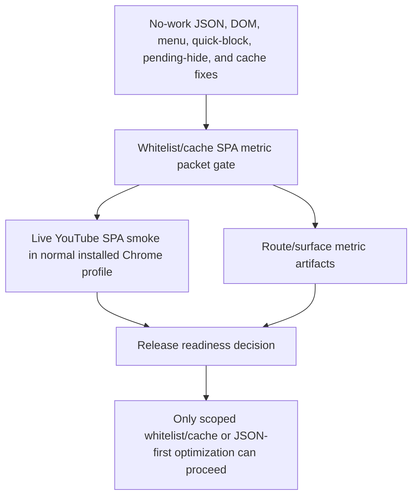

# FilterTube Whitelist Cache SPA Metric Packet Gate - Current Behavior - 2026-05-29

Status: audit-only current-behavior whitelist/cache SPA metric packet gate.
Runtime behavior is unchanged. This is not an implementation patch,
optimization patch, metric collector patch, JSON-first behavior patch,
whitelist policy patch, cache behavior patch, release package patch, live smoke
completion claim, native sync patch, or public performance claim.

## Purpose

The release-lag fixes removed several proven hot paths, but the broader
whitelist/cache optimization question is still open. The next useful proof
artifact is one scoped metric packet that ties live YouTube SPA behavior to the
source-level no-work, pending-hide, cache, settings-refresh, menu, quick-block,
and JSON-first gates already documented under `docs/audit`.

Current answer:

```text
selected metric packet gate: FT-WLCACHE-SPA-PACKET-00-binding
whitelist/cache SPA metric packet rows: 12
live YouTube SPA smoke rows required: 6
route/surface metric artifact files required: 5
committed whitelist/cache SPA metric packet files: 0
committed live YouTube SPA smoke result files: 0
runtime metric collectors approved: 0
runtime whitelist/cache optimization approvals: 0
runtime JSON-first first-class promotion approvals: 0
release readiness from this gate: NO-GO
runtime behavior changed: no
not completion proof for whitelist/cache optimization
```

## Source Inputs

| Input | Current proof used |
| --- | --- |
| `docs/audit/FILTERTUBE_YOUTUBE_LAG_COMMIT_ATTRIBUTION_2026-05-26.md` | Attributes the user-visible slowdown to a mix of pre-existing eager DOM/menu work plus May 5+ whitelist/JSON-first amplifiers. |
| `docs/audit/FILTERTUBE_RELEASE_FIX_AUDIT_STATUS_2026-05-26.md` | Records the dated lag/menu/quick-block fix flow and focused verification history. |
| `docs/audit/FILTERTUBE_WHITELIST_PENDING_INTAKE_NO_WORK_CONTRACT_CURRENT_BEHAVIOR_2026-05-25.md` | Pins the narrow pending-hide no-work intake behavior while keeping broader whitelist/cache/JSON-first optimization blocked. |
| `docs/audit/FILTERTUBE_WHITELIST_CACHE_HOT_PATH_BOUNDARY_CURRENT_BEHAVIOR_2026-05-25.md` | Pins duplicate learned-map persistence and DOM rerun suppression while keeping broader cache behavior blocked. |
| `docs/audit/FILTERTUBE_RELEASE_LIVE_YOUTUBE_SPA_SMOKE_BOUNDARY_CURRENT_BEHAVIOR_2026-05-25.md` | Defines the six live SPA rows that must be recorded before release readiness is claimed. |
| `docs/audit/artifacts/release-live-youtube-spa-smoke/template.json` | Provides the non-executed live smoke artifact template; all rows remain `missing`. |
| `docs/audit/artifacts/release-live-youtube-spa-smoke/run-live-smoke.mjs` | Defines the CDP runner that can generate a dated live smoke artifact when run against the real installed Chrome profile. |
| `docs/audit/FILTERTUBE_JSON_FIRST_ROUTE_SURFACE_METRIC_ARTIFACT_CONTRACT_COVERAGE_GATE_CURRENT_BEHAVIOR_2026-05-24.md` | Confirms per-file route/surface metric contracts exist for all five reserved artifact files while committed artifacts remain absent. |
| `docs/audit/FILTERTUBE_JSON_FIRST_ROUTE_SURFACE_METRIC_ARTIFACT_APPROVAL_BOUNDARY_CURRENT_BEHAVIOR_2026-05-24.md` | Proves route/surface metric artifact approval is still absent. |
| `docs/audit/FILTERTUBE_FIRST_OPTIMIZATION_PATCH_EVIDENCE_PACKET_CONTRACT_CURRENT_BEHAVIOR_2026-05-24.md` | Defines the broader first optimization evidence packet and keeps first optimization implementation at NO-GO. |
| `docs/audit/FILTERTUBE_CONTENT_BRIDGE_COLLABORATOR_IDENTITY_PROMOTION_HANDOFF_CURRENT_BEHAVIOR_2026-05-23.md` | Keeps installed-tab byte parity missing for the latest Topic collaborator fix, so release smoke must use the normal installed profile and current workspace bytes. |
| `docs/audit/FILTERTUBE_CONTENT_BRIDGE_MENU_ACTION_LIST_TARGET_CURRENT_BEHAVIOR_2026-05-23.md` | Pins the May 29 Topic menu guard that demotes literal ampersand Topic name-only collaborator-shaped state before menu rendering, while keeping installed-tab byte parity missing. |
| `docs/audit/FILTERTUBE_P0_RELEASE_PACKAGE_CURRENT_BEHAVIOR_2026-05-19.md` | Proves the Default Chrome profile points at the workspace root, while active already-open tab byte parity remains a separate gate. |

## Installed Byte Parity Gate Addendum

This addendum pins the byte-parity evidence required by
`FT-WLCACHE-SPA-PACKET-01-installed-profile-bytes`. It prevents live smoke from
being accepted when it comes from the wrong Chrome profile, a stale already-open
YouTube tab, an incognito session without runtime proof, or the non-executed
template.

Current byte-parity answer:

```text
selected packet row: FT-WLCACHE-SPA-PACKET-01-installed-profile-bytes
installed byte parity gate rows: 12
required installed byte parity fields: 14
runner installed byte parity schema: PRESENT
runner smoke-slice readiness without byte parity: NONRELEASE_ONLY
visible Default profile workspace path proof: PARTIAL
active YouTube tab content-script byte authority: NO-GO
extension reload timestamp authority: NO-GO
automation profile substitution authority: NO-GO
incognito runtime availability authority: NO-GO
connected Chrome profile parity probe: NOT-PARITY
installed Chrome CDP preflight: UNAVAILABLE
live smoke acceptance from this gate: NO-GO
runtime behavior changed: no
not completion proof for whitelist/cache SPA release readiness
```

Installed byte parity rows:

| Row | Required proof | Current state |
| --- | --- | --- |
| `FT-WLCACHE-BYTE-00-scope-binding` | Bind the packet to `FT-WLCACHE-SPA-PACKET-01-installed-profile-bytes`, one live smoke artifact, and the current workspace revision. | Gate defined; packet absent. |
| `FT-WLCACHE-BYTE-01-visible-profile-id` | Record the visible Chrome profile label/user-data-dir used for the manual lag report. | Default profile path proof exists; live profile packet absent. |
| `FT-WLCACHE-BYTE-02-extension-id-path-version` | Record extension id, extension path, install location, manifest version, and service-worker version from the tested profile. | Default Secure Preferences proof is partial; active-tab packet absent. |
| `FT-WLCACHE-BYTE-03-manifest-surface` | Record content-script entries, worlds, host matches, and script order from the loaded manifest. | Source/package proof exists; loaded extension context proof missing. |
| `FT-WLCACHE-BYTE-04-source-byte-snapshot` | Record workspace hashes for `manifest.json`, `package.json`, `js/content_bridge.js`, and any touched content scripts. | Workspace snapshot exists for selected files; packet-level hash set missing. |
| `FT-WLCACHE-BYTE-05-active-youtube-tab-url` | Record the exact YouTube URL and route when byte parity is measured. | Missing. |
| `FT-WLCACHE-BYTE-06-loaded-runtime-marker` | Prove the active YouTube document has current content-script bytes by marker, hash, or equivalent runtime attestation. | Missing. |
| `FT-WLCACHE-BYTE-07-reload-timestamp` | Record extension reload and tab reload timestamps after the last relevant workspace edit. | Missing. |
| `FT-WLCACHE-BYTE-08-source-loaded-comparison` | Compare workspace source bytes to the loaded runtime marker/hash and record pass/fail. | Missing. |
| `FT-WLCACHE-BYTE-09-automation-profile-exclusion` | State whether evidence came from the visible Default profile or a separate automation profile, and forbid substitution. | Current docs distinguish profiles; runner output now records the source path/profile fields but still cannot substitute automation proof for visible-tab proof. |
| `FT-WLCACHE-BYTE-10-incognito-session-separation` | For incognito tests, record explicit extension runtime availability in that incognito session. | Profile JSON proof is insufficient; live incognito runtime proof missing. |
| `FT-WLCACHE-BYTE-11-live-smoke-acceptance` | Attach this parity packet to the live smoke artifact before accepting any SPA route result. | Runner schema now attaches an `installedByteParity` block, but the template and any route-only run remain release `NO-GO` until the block passes. |

Required installed byte parity fields:

```text
packet_id
workspace_revision_or_hash
tester_initials
manual_timestamp
chrome_profile_label
chrome_user_data_dir
extension_id
extension_path
manifest_version
service_worker_version
active_tab_url
content_script_marker_or_hash
extension_reload_timestamp
tab_reload_timestamp
```

Installed byte parity decision:

```text
define installed byte parity gate: GO
accept Default Secure Preferences as active-tab parity proof now: NO-GO
accept automation CDP profile proof as visible-tab proof now: NO-GO
accept live smoke template as executed proof now: NO-GO
accept runner smokeSliceReadiness as release proof without byte parity now: NO-GO
accept incognito test without incognito runtime proof now: NO-GO
accept stale already-open YouTube tabs for release smoke now: NO-GO
approve whitelist/cache SPA live smoke from this gate now: NO-GO
approve whitelist/cache optimization from this gate now: NO-GO
approve JSON-first first-class filtering from this gate now: NO-GO
approve public performance claim from this gate now: NO-GO
continue proof-backed audit: GO
```

## 2026-05-30 Connected Chrome Profile Probe Addendum

This addendum records the attempted read-only connected-Chrome probe from the
Codex Chrome endpoint. It is intentionally treated as a negative parity result,
because the connected profile did not expose the already-open FilterTube or
YouTube tabs visible in the user's Chrome screenshots.

```text
connected Chrome profile parity probe rows: 5
connected Chrome profile label observed: Devansh
FilterTube extension id from user-visible screenshots: gkgjigdfdccckblmglboobikfcpeelio
connected open-tab matches for FilterTube or YouTube: 0
connected Chrome profile accepted as installed-byte parity: NO-GO
new Chrome profile/window opened for this probe: no
runtime behavior changed: no
```

Connected Chrome profile probe rows:

| Row | Observation | Parity consequence |
| --- | --- | --- |
| `FT-WLCACHE-CHROME-PROBE-00-scope` | The probe used only the connected Chrome tab inventory endpoint and did not claim or mutate a tab. | Read-only orientation only; not runtime proof. |
| `FT-WLCACHE-CHROME-PROBE-01-connected-profile` | The connected endpoint reported Chrome profile label `Devansh`. | Profile label is recorded, but it is not enough to prove it is the lag-reporting profile. |
| `FT-WLCACHE-CHROME-PROBE-02-relevant-tab-match` | The connected open-tab inventory returned zero matches for `youtube`, `filtertube`, or `chrome-extension://gkgjigdfdccckblmglboobikfcpeelio`. | The visible YouTube/FilterTube tabs were not available through this endpoint. |
| `FT-WLCACHE-CHROME-PROBE-03-substitution-guard` | The probe did not open a scratch Chrome, private Chrome, or replacement profile. | Automation/profile substitution remains forbidden for release parity. |
| `FT-WLCACHE-CHROME-PROBE-04-release-consequence` | No active YouTube document marker, content-script hash, extension reload timestamp, or tab reload timestamp was collected. | Installed-byte parity remains `NO-GO`; live smoke remains blocked. |

Connected Chrome profile probe decision:

```text
accept connected Chrome profile tab inventory as installed-byte parity now: NO-GO
accept missing relevant tabs as active YouTube tab proof now: NO-GO
accept user-visible screenshots as content-script byte proof now: NO-GO
accept scratch/private Chrome profile as substitute proof now: NO-GO
continue proof-backed audit: GO
```

## 2026-05-31 Installed Chrome CDP Preflight Addendum

This addendum records a read-only attempt to prepare the live YouTube SPA smoke
runner against the user's already-open installed Chrome session. Chrome was
running, but the runner's default CDP endpoint was not exposed, so no tab was
claimed, no extension storage was changed, and no live smoke artifact was
created.

```text
installed Chrome CDP preflight rows: 4
Chrome running process observed: yes
CDP endpoint checked: http://127.0.0.1:9222/json/version
CDP endpoint status: unavailable
live smoke runner executed: no
executed live smoke artifacts committed: 0
installed Chrome CDP preflight accepted as live smoke proof: NO-GO
runtime behavior changed: no
```

Installed Chrome CDP preflight rows:

| Row | Observation | Release consequence |
| --- | --- | --- |
| `FT-WLCACHE-CDP-PREFLIGHT-00-scope` | The preflight only checked whether the live runner could attach to `http://127.0.0.1:9222`; it did not open a new Chrome profile or mutate extension storage. | Orientation only; not a smoke run. |
| `FT-WLCACHE-CDP-PREFLIGHT-01-running-chrome` | `Google Chrome` processes were present in the current desktop session. | Chrome being open is necessary but not sufficient for CDP-backed tab proof. |
| `FT-WLCACHE-CDP-PREFLIGHT-02-endpoint` | `curl -s http://127.0.0.1:9222/json/version` and `/json/list` exited with connection failure. | The existing runner cannot attach to the visible installed-profile tab from this session. |
| `FT-WLCACHE-CDP-PREFLIGHT-03-consequence` | No dated result JSON or screenshot directory was created under `docs/audit/artifacts/release-live-youtube-spa-smoke/`. | Live installed-tab byte parity and route smoke remain `NO-GO`. |

## Route Sequence And List-Mode Matrix Gate Addendum

This addendum pins the route and mode evidence required by
`FT-WLCACHE-SPA-PACKET-02-route-sequence` and
`FT-WLCACHE-SPA-PACKET-03-list-modes`. It prevents a narrow smoke pass from
being treated as release evidence when it only covers one route, one list mode,
or one active-rule state.

Current route-mode answer:

```text
selected packet rows: FT-WLCACHE-SPA-PACKET-02-route-sequence, FT-WLCACHE-SPA-PACKET-03-list-modes
route sequence rows required: 6
list-mode states required: 6
route-mode observation cells required: 36
required route-mode fields: 16
committed route-mode matrix files: 0
runtime route-mode smoke approvals: 0
route-mode release readiness: NO-GO
runtime behavior changed: no
not completion proof for whitelist/cache SPA release readiness
```

Required route rows:

| Row | Required route/action | Current state |
| --- | --- | --- |
| `FT-LIVE-SPA-00-home-to-search` | Home to Search through YouTube SPA navigation. | Template row exists; no executed route-mode observation exists. |
| `FT-LIVE-SPA-01-search-to-channel` | Search to Channel through YouTube SPA navigation. | Template row exists; no executed route-mode observation exists. |
| `FT-LIVE-SPA-02-channel-to-watch` | Channel to Watch through YouTube SPA navigation. | Template row exists; no executed route-mode observation exists. |
| `FT-LIVE-SPA-03-watch-to-home` | Watch to Home through YouTube SPA navigation. | Template row exists; no executed route-mode observation exists. |
| `FT-LIVE-SPA-04-watch-rail-scroll` | Watch right-rail scroll and hydration. | Template row exists; no executed route-mode observation exists. |
| `FT-LIVE-SPA-05-cache-repeat-navigation` | Repeat cached Home/Search/Watch navigation after learned maps populate. | Template row exists; no executed route-mode observation exists. |

Required list-mode states:

| Row | Required mode state | Current state |
| --- | --- | --- |
| `FT-WLCACHE-MODE-00-disabled` | Extension disabled or filtering disabled on the route. | Source proof exists; no live route-mode cell exists. |
| `FT-WLCACHE-MODE-01-empty-blocklist` | Blocklist mode with no useful rules. | Source proof exists; no live route-mode cell exists. |
| `FT-WLCACHE-MODE-02-active-blocklist` | Blocklist mode with matching keyword/channel rule. | Source proof exists; no live route-mode cell exists. |
| `FT-WLCACHE-MODE-03-empty-whitelist` | Whitelist mode with empty allow lists, preserving intentional fail-closed behavior where admitted. | Source proof exists; no live route-mode cell exists. |
| `FT-WLCACHE-MODE-04-active-whitelist` | Whitelist mode with matching allow-list rule and nonmatching sibling. | Source proof exists; no live route-mode cell exists. |
| `FT-WLCACHE-MODE-05-no-useful-rule` | Enabled settings with controls present but no route-relevant work. | Source proof exists; no live route-mode cell exists. |

Required route-mode fields:

```text
packet_id
route_row_id
list_mode_state
profile_type
extension_enabled
rule_state
route_start
route_end
navigation_type
observed_stall
false_hide_result
leak_result
menu_quick_result
transport_budget_result
dom_lifecycle_budget_result
cache_refresh_result
```

Route-mode decision:

```text
define route sequence and list-mode matrix gate: GO
accept six route template rows as executed route-mode proof now: NO-GO
accept source-only list-mode fixtures as live route-mode proof now: NO-GO
accept route-mode matrix without installed byte parity now: NO-GO
accept route-mode matrix without behavior invariants now: NO-GO
approve whitelist/cache SPA live smoke from route-only proof now: NO-GO
approve whitelist/cache optimization from route-mode matrix now: NO-GO
approve JSON-first first-class filtering from route-mode matrix now: NO-GO
approve public performance claim from route-mode matrix now: NO-GO
continue proof-backed audit: GO
```

## Transport And DOM Lifecycle Budget Gate Addendum

This addendum pins the work-budget evidence required by
`FT-WLCACHE-SPA-PACKET-04-transport-no-work` and
`FT-WLCACHE-SPA-PACKET-05-dom-lifecycle`. It prevents release, optimization,
or public performance claims from source-only no-work gates unless the
route-mode packet also records transport clone/parse/replay counts and DOM
selector/observer/listener/timer work.

Current work-budget answer:

```text
selected packet rows: FT-WLCACHE-SPA-PACKET-04-transport-no-work, FT-WLCACHE-SPA-PACKET-05-dom-lifecycle
transport budget rows required: 8
DOM lifecycle budget rows required: 10
required work-budget fields: 18
committed route-mode work-budget files: 0
runtime work-budget collectors approved: 0
work-budget release readiness: NO-GO
runtime behavior changed: no
not completion proof for whitelist/cache SPA release readiness
```

Transport budget rows:

| Row | Required counter | Current state |
| --- | --- | --- |
| `FT-WLCACHE-WORK-TRANSPORT-00-settings-revision` | Record the settings revision/list mode attached to the transport decision. | Source proof exists; no route-mode counter artifact exists. |
| `FT-WLCACHE-WORK-TRANSPORT-01-fetch-clone-count` | Count fetch response clones performed by the injected transport path. | Source proof exists; no route-mode counter artifact exists. |
| `FT-WLCACHE-WORK-TRANSPORT-02-fetch-json-parse-count` | Count JSON parses performed for fetch responses. | Source proof exists; no route-mode counter artifact exists. |
| `FT-WLCACHE-WORK-TRANSPORT-03-xhr-json-parse-count` | Count JSON parses performed for XHR responses. | Source proof exists; no route-mode counter artifact exists. |
| `FT-WLCACHE-WORK-TRANSPORT-04-process-data-count` | Count calls into JSON `processData` filtering for each route/mode cell. | Source proof exists; no route-mode counter artifact exists. |
| `FT-WLCACHE-WORK-TRANSPORT-05-response-rebuild-count` | Count rebuilt response bodies after JSON filtering. | Source proof exists; no route-mode counter artifact exists. |
| `FT-WLCACHE-WORK-TRANSPORT-06-queued-snapshot-replay-count` | Count queued snapshot replays after settings/profile refresh. | Source proof exists; no route-mode counter artifact exists. |
| `FT-WLCACHE-WORK-TRANSPORT-07-pass-through-reason` | Record why transport skipped work when no useful filtering rule existed. | Source proof exists; no route-mode counter artifact exists. |

DOM lifecycle budget rows:

| Row | Required counter | Current state |
| --- | --- | --- |
| `FT-WLCACHE-WORK-DOM-00-selector-traversal-count` | Count selector traversals before and after cheap route/mode gates. | Source proof exists; no route-mode counter artifact exists. |
| `FT-WLCACHE-WORK-DOM-01-node-visited-count` | Count nodes visited by card/menu/pending-hide paths. | Source proof exists; no route-mode counter artifact exists. |
| `FT-WLCACHE-WORK-DOM-02-observer-callback-count` | Count MutationObserver and IntersectionObserver callbacks. | Source proof exists; no route-mode counter artifact exists. |
| `FT-WLCACHE-WORK-DOM-03-listener-callback-count` | Count runtime DOM listener callbacks relevant to menu, quick block, and settings refresh. | Source proof exists; no route-mode counter artifact exists. |
| `FT-WLCACHE-WORK-DOM-04-timer-scheduled-count` | Count timers scheduled by fallback, cache, pending-hide, and quick-block paths. | Source proof exists; no route-mode counter artifact exists. |
| `FT-WLCACHE-WORK-DOM-05-whitelist-pending-intake-count` | Count whitelist pending-hide card intake by route/mode cell. | Source proof exists; no route-mode counter artifact exists. |
| `FT-WLCACHE-WORK-DOM-06-menu-scan-count` | Count native menu scans and injected menu mutations. | Source proof exists; no route-mode counter artifact exists. |
| `FT-WLCACHE-WORK-DOM-07-quick-block-work-count` | Count quick-block host detection, event binding, and hover/open work. | Source proof exists; no route-mode counter artifact exists. |
| `FT-WLCACHE-WORK-DOM-08-identity-prefetch-count` | Count collaborator/channel identity prefetch work triggered by visible cards. | Source proof exists; no route-mode counter artifact exists. |
| `FT-WLCACHE-WORK-DOM-09-dom-fallback-rerun-count` | Count fallback reruns caused by cache/settings/SPA refresh. | Source proof exists; no route-mode counter artifact exists. |

Required work-budget fields:

```text
packet_id
route_row_id
list_mode_state
settings_revision
budget_family
counter_name
expected_max
observed_count
observed_duration_ms
observed_bytes
source_owner
allowed_work_reason
forbidden_work_reason
pass_through_reason
side_effect_result
no_work_result
fixture_or_live_artifact
verdict
```

Work-budget decision:

```text
define transport and DOM lifecycle budget gate: GO
accept source-only no-work gates as route-mode budget proof now: NO-GO
accept live smoke without transport counters now: NO-GO
accept live smoke without DOM lifecycle counters now: NO-GO
accept work-budget matrix without route-mode coverage now: NO-GO
approve whitelist/cache optimization from work-budget gate now: NO-GO
approve JSON-first first-class filtering from work-budget gate now: NO-GO
approve public performance claim from work-budget gate now: NO-GO
continue proof-backed audit: GO
```

## Whitelist Pending Rail And Cache Refresh Gate Addendum

This addendum pins the behavior evidence required by
`FT-WLCACHE-SPA-PACKET-06-whitelist-pending-rail` and
`FT-WLCACHE-SPA-PACKET-07-cache-refresh`. It prevents the pending-hide
right-rail path or learned-map cache refresh path from being treated as release
safe until the packet proves false-hide, leak, stale-cache, and forced
reprocess behavior across the route-mode matrix.

Current pending/cache answer:

```text
selected packet rows: FT-WLCACHE-SPA-PACKET-06-whitelist-pending-rail, FT-WLCACHE-SPA-PACKET-07-cache-refresh
pending-hide rail rows required: 10
cache refresh rows required: 10
required pending/cache fields: 20
committed pending/cache metric files: 0
runtime pending/cache collectors approved: 0
pending/cache release readiness: NO-GO
runtime behavior changed: no
not completion proof for whitelist/cache SPA release readiness
```

Pending-hide rail rows:

| Row | Required proof | Current state |
| --- | --- | --- |
| `FT-WLCACHE-PENDING-RAIL-00-route-binding` | Bind each pending-hide sample to route, surface, list mode, profile, and settings revision. | Source proof exists; no route-mode packet sample exists. |
| `FT-WLCACHE-PENDING-RAIL-01-eligible-surface-gate` | Prove pending-hide only arms on eligible whitelist surfaces and skips excluded routes. | Source proof exists; no route-mode packet sample exists. |
| `FT-WLCACHE-PENDING-RAIL-02-pending-intake-count` | Count cards admitted to pending-hide before final allow/block decision. | Source proof exists; no route-mode packet sample exists. |
| `FT-WLCACHE-PENDING-RAIL-03-right-rail-observer-fanout` | Count right-rail observer callbacks and fanout while the watch rail hydrates. | Source proof exists; no route-mode packet sample exists. |
| `FT-WLCACHE-PENDING-RAIL-04-delayed-pass-cancellation` | Prove delayed pending passes cancel when route/mode/settings state changes. | Source proof exists; no route-mode packet sample exists. |
| `FT-WLCACHE-PENDING-RAIL-05-selected-row-preservation` | Prove selected playlist/current-video rows are preserved when whitelist rules are evaluated. | Source proof exists; no route-mode packet sample exists. |
| `FT-WLCACHE-PENDING-RAIL-06-scaffold-preservation` | Prove shelves, section scaffolds, comments, and non-video containers are not false-hidden. | Source proof exists; no route-mode packet sample exists. |
| `FT-WLCACHE-PENDING-RAIL-07-false-hide-sample` | Record at least one matching allow-list sibling and one non-video scaffold sample per route/mode cell. | Missing. |
| `FT-WLCACHE-PENDING-RAIL-08-leak-sample` | Record at least one nonmatching blocked sibling per route/mode cell. | Missing. |
| `FT-WLCACHE-PENDING-RAIL-09-queue-drain-on-settings-refresh` | Prove pending queues drain or re-evaluate after profile/list/settings refresh. | Source proof exists; no route-mode packet sample exists. |

Cache refresh rows:

| Row | Required proof | Current state |
| --- | --- | --- |
| `FT-WLCACHE-CACHE-REFRESH-00-settings-revision` | Bind each cache refresh sample to the settings revision that triggered it. | Source proof exists; no route-mode packet sample exists. |
| `FT-WLCACHE-CACHE-REFRESH-01-learned-map-duplicate-row-count` | Count duplicate learned-map rows suppressed by the cache path. | Source proof exists; no route-mode packet sample exists. |
| `FT-WLCACHE-CACHE-REFRESH-02-learned-map-changed-row-count` | Count changed learned-map rows accepted by the cache path. | Source proof exists; no route-mode packet sample exists. |
| `FT-WLCACHE-CACHE-REFRESH-03-storage-refresh-count` | Count storage reloads caused by settings/profile/list updates. | Source proof exists; no route-mode packet sample exists. |
| `FT-WLCACHE-CACHE-REFRESH-04-background-handoff-count` | Count background-to-content handoffs for cache/settings refresh. | Source proof exists; no route-mode packet sample exists. |
| `FT-WLCACHE-CACHE-REFRESH-05-force-reprocess-upgrade-count` | Count queued refreshes that upgrade from lightweight to `forceReprocess`. | Source proof exists; no route-mode packet sample exists. |
| `FT-WLCACHE-CACHE-REFRESH-06-dom-rerun-count` | Count DOM reruns caused by cache/settings refresh after rules change. | Source proof exists; no route-mode packet sample exists. |
| `FT-WLCACHE-CACHE-REFRESH-07-route-cache-hit-count` | Count repeated SPA route cache hits after Home/Search/Watch repeat navigation. | Missing. |
| `FT-WLCACHE-CACHE-REFRESH-08-stale-identity-invalidation-count` | Count stale channel/collaborator identity invalidations after refresh. | Source proof exists; no route-mode packet sample exists. |
| `FT-WLCACHE-CACHE-REFRESH-09-no-rule-cache-bypass-count` | Prove no-rule and disabled states bypass cache/DOM refresh work that cannot change output. | Source proof exists; no route-mode packet sample exists. |

Required pending/cache fields:

```text
packet_id
route_row_id
list_mode_state
settings_revision
surface_name
candidate_video_id
candidate_channel_id
pending_intake_count
right_rail_observer_count
delayed_pass_cancelled
selected_row_preserved
scaffold_preserved
false_hide_result
leak_result
learned_map_duplicate_rows
learned_map_changed_rows
force_reprocess_upgraded
dom_rerun_count
cache_refresh_result
verdict
```

Pending/cache decision:

```text
define whitelist pending-rail and cache refresh gate: GO
accept source-only pending-hide tests as route-mode behavior proof now: NO-GO
accept source-only cache hot-path tests as route-mode behavior proof now: NO-GO
accept live smoke without false-hide and leak samples now: NO-GO
accept live smoke without forceReprocess upgrade samples now: NO-GO
accept pending/cache matrix without installed byte parity now: NO-GO
approve whitelist/cache optimization from pending/cache gate now: NO-GO
approve JSON-first first-class filtering from pending/cache gate now: NO-GO
approve public performance claim from pending/cache gate now: NO-GO
continue proof-backed audit: GO
```

## Settings Mutation And Behavior Invariant Gate Addendum

This addendum pins the mutation and invariant evidence required by
`FT-WLCACHE-SPA-PACKET-08-settings-mutation` and
`FT-WLCACHE-SPA-PACKET-09-behavior-invariants`. It prevents whitelist/cache
optimization from being treated as safe unless settings changes, profile/list
mode transitions, compiled-cache invalidation, and the user-visible blocking
invariants are proven in the same route-mode packet.

Current settings/behavior answer:

```text
selected packet rows: FT-WLCACHE-SPA-PACKET-08-settings-mutation, FT-WLCACHE-SPA-PACKET-09-behavior-invariants
settings mutation rows required: 10
behavior invariant rows required: 10
required settings/behavior fields: 20
committed settings/behavior metric files: 0
runtime settings/behavior collectors approved: 0
settings/behavior release readiness: NO-GO
runtime behavior changed: no
not completion proof for whitelist/cache SPA release readiness
```

Settings mutation rows:

| Row | Required proof | Current state |
| --- | --- | --- |
| `FT-WLCACHE-SETTINGS-MUTATION-00-profile-id` | Record the active profile id/name and source of settings authority for the route-mode sample. | Source proof exists; no route-mode mutation packet exists. |
| `FT-WLCACHE-SETTINGS-MUTATION-01-settings-revision` | Record settings revision before and after each list/profile mutation. | Source proof exists; no route-mode mutation packet exists. |
| `FT-WLCACHE-SETTINGS-MUTATION-02-list-mode-transition` | Record blocklist/whitelist/disabled transitions and their refresh fanout. | Source proof exists; no route-mode mutation packet exists. |
| `FT-WLCACHE-SETTINGS-MUTATION-03-keyword-alias-compile` | Prove UI keyword aliases and runtime compiled keyword aliases agree. | Source proof exists; no route-mode mutation packet exists. |
| `FT-WLCACHE-SETTINGS-MUTATION-04-channel-list-compile` | Prove UI channel list state and runtime compiled channel state agree. | Source proof exists; no route-mode mutation packet exists. |
| `FT-WLCACHE-SETTINGS-MUTATION-05-whitelist-list-compile` | Prove whitelist channels/keywords compile into the active route-mode decision. | Source proof exists; no route-mode mutation packet exists. |
| `FT-WLCACHE-SETTINGS-MUTATION-06-import-merge-state` | Record import/merge state and whether stale compiled caches were invalidated. | Source proof exists; no route-mode mutation packet exists. |
| `FT-WLCACHE-SETTINGS-MUTATION-07-compiled-cache-invalidation` | Count compiled-cache invalidations caused by mutation. | Source proof exists; no route-mode mutation packet exists. |
| `FT-WLCACHE-SETTINGS-MUTATION-08-refresh-fanout-count` | Count content, background, storage, and DOM refresh fanout after mutation. | Source proof exists; no route-mode mutation packet exists. |
| `FT-WLCACHE-SETTINGS-MUTATION-09-force-reprocess-request` | Prove relevant mutations request `forceReprocess` for already-rendered cards. | Source proof exists; no route-mode mutation packet exists. |

Behavior invariant rows:

| Row | Required proof | Current state |
| --- | --- | --- |
| `FT-WLCACHE-BEHAVIOR-00-blocklist-keyword-hide` | Prove a matching keyword blocklist rule hides matching visible content. | Focused proof exists; no combined live route-mode packet exists. |
| `FT-WLCACHE-BEHAVIOR-01-blocklist-channel-hide` | Prove a matching channel blocklist rule hides matching visible content. | Focused proof exists; no combined live route-mode packet exists. |
| `FT-WLCACHE-BEHAVIOR-02-whitelist-allows-matching` | Prove whitelist mode keeps matching allowed content visible. | Focused proof exists; no combined live route-mode packet exists. |
| `FT-WLCACHE-BEHAVIOR-03-whitelist-hides-nonmatching` | Prove whitelist mode hides nonmatching content without leaking stale cards. | Focused proof exists; no combined live route-mode packet exists. |
| `FT-WLCACHE-BEHAVIOR-04-empty-blocklist-no-work` | Prove empty/no-useful blocklist state avoids clone/parse/eager DOM work. | Focused proof exists; no combined live route-mode packet exists. |
| `FT-WLCACHE-BEHAVIOR-05-quick-cross-first-channel` | Prove quick-cross first channel block remains available on Home/Search/Watch cards. | Focused proof exists; no combined live route-mode packet exists. |
| `FT-WLCACHE-BEHAVIOR-06-comment-native-menu-open-close` | Prove YouTube comment/native 3-dot menus open and outside-click closes them. | Focused proof exists; no combined live route-mode packet exists. |
| `FT-WLCACHE-BEHAVIOR-07-topic-ampersand-single-channel` | Prove literal ampersand Topic bylines stay single-channel unless stronger collaborator evidence exists. | Focused proof exists; no combined live route-mode packet exists. |
| `FT-WLCACHE-BEHAVIOR-08-collab-menu-multi-channel` | Prove real collaborator cards still expose multi-channel quick-block/menu behavior. | Focused proof exists; no combined live route-mode packet exists. |
| `FT-WLCACHE-BEHAVIOR-09-json-first-gated-no-leak` | Prove JSON-first remains gated and does not become first-class authority without packet proof. | Source proof exists; no combined live route-mode packet exists. |

Required settings/behavior fields:

```text
packet_id
route_row_id
list_mode_state
profile_id
settings_revision_before
settings_revision_after
mutation_source
mutation_type
keyword_state
channel_state
whitelist_state
compiled_cache_invalidated
refresh_fanout_count
force_reprocess_requested
behavior_invariant_id
expected_result
observed_result
false_hide_result
leak_result
verdict
```

Settings/behavior decision:

```text
define settings mutation and behavior invariant gate: GO
accept source-only settings refresh tests as route-mode mutation proof now: NO-GO
accept source-only behavior fixture tests as live invariant proof now: NO-GO
accept live smoke without settings revision before/after now: NO-GO
accept live smoke without blocklist and whitelist invariant samples now: NO-GO
accept live smoke without menu and quick-block invariant samples now: NO-GO
accept settings/behavior matrix without installed byte parity now: NO-GO
approve whitelist/cache optimization from settings/behavior gate now: NO-GO
approve JSON-first first-class filtering from settings/behavior gate now: NO-GO
approve public performance claim from settings/behavior gate now: NO-GO
continue proof-backed audit: GO
```

## JSON-First Promotion And Rollout Nonclaim Gate Addendum

This addendum pins the promotion and rollout limits required by
`FT-WLCACHE-SPA-PACKET-10-json-first-first-class-gate` and
`FT-WLCACHE-SPA-PACKET-11-rollout-nonclaim`. It prevents JSON response paths
from becoming first-class filter authority, and prevents release/public claims,
unless the packet proves route/surface parity, no-work budgets, side-effect
budgets, fixture provenance, rollback, and unclaimed-surface boundaries.

Current JSON-first/rollout answer:

```text
selected packet rows: FT-WLCACHE-SPA-PACKET-10-json-first-first-class-gate, FT-WLCACHE-SPA-PACKET-11-rollout-nonclaim
JSON-first promotion rows required: 10
rollout nonclaim rows required: 10
required JSON-first/rollout fields: 20
committed JSON-first/rollout metric files: 0
runtime JSON-first/rollout collectors approved: 0
JSON-first/rollout release readiness: NO-GO
runtime behavior changed: no
not completion proof for whitelist/cache SPA release readiness
```

JSON-first promotion rows:

| Row | Required proof | Current state |
| --- | --- | --- |
| `FT-WLCACHE-JSON-FIRST-00-route-surface-binding` | Bind JSON-first promotion to one route, surface, renderer family, and list mode. | Contract proof exists; no promotion packet exists. |
| `FT-WLCACHE-JSON-FIRST-01-dom-json-parity` | Prove JSON-derived decisions match DOM decisions for matching and nonmatching samples. | Contract proof exists; no promotion packet exists. |
| `FT-WLCACHE-JSON-FIRST-02-no-work-budget` | Attach no-work budget proof for disabled, empty blocklist, and no-useful-rule states. | Contract proof exists; artifact absent. |
| `FT-WLCACHE-JSON-FIRST-03-side-effect-budget` | Attach side-effect budget proof for hidden/visible mutations and recommendation engagement risk. | Contract proof exists; artifact absent. |
| `FT-WLCACHE-JSON-FIRST-04-fixture-provenance` | Record fixture origin, route, capture freshness, and raw-capture exclusion boundary. | Contract proof exists; artifact absent. |
| `FT-WLCACHE-JSON-FIRST-05-verification-output` | Attach machine-verifiable output for route/surface samples. | Contract proof exists; artifact absent. |
| `FT-WLCACHE-JSON-FIRST-06-first-class-authority-decision` | Record explicit approval or rejection for first-class JSON filtering on the scoped route only. | Approval absent; remains `NO-GO`. |
| `FT-WLCACHE-JSON-FIRST-07-dom-fallback-retention` | Prove DOM fallback remains authoritative where JSON proof is incomplete. | Source proof exists; no promotion packet exists. |
| `FT-WLCACHE-JSON-FIRST-08-recommendation-engagement-noninteraction` | Prove hiding behavior does not create accidental YouTube engagement signals. | Missing. |
| `FT-WLCACHE-JSON-FIRST-09-promotion-rollback` | Record rollback switch, disabled state, and revert conditions for JSON-first promotion. | Missing. |

Rollout nonclaim rows:

| Row | Required proof | Current state |
| --- | --- | --- |
| `FT-WLCACHE-ROLLOUT-00-release-scope-binding` | Bind the packet to a scoped release candidate and forbid broad release claims. | Source proof exists; release packet absent. |
| `FT-WLCACHE-ROLLOUT-01-unclaimed-surface-list` | List routes/surfaces not covered by the packet and keep them outside claims. | Source proof exists; release packet absent. |
| `FT-WLCACHE-ROLLOUT-02-native-mobile-tv-exclusion` | Keep native Android/iOS/tablet/TV parity outside this browser-only packet. | Source proof exists; release packet absent. |
| `FT-WLCACHE-ROLLOUT-03-firefox-mobile-exclusion` | Keep Firefox mobile claims outside this packet unless separately proven. | Source proof exists; release packet absent. |
| `FT-WLCACHE-ROLLOUT-04-incognito-profile-exclusion` | Keep incognito claims outside this packet without explicit incognito runtime proof. | Source proof exists; release packet absent. |
| `FT-WLCACHE-ROLLOUT-05-raw-capture-exclusion` | Prevent raw captured fixtures from being shipped or treated as live proof. | Source proof exists; release packet absent. |
| `FT-WLCACHE-ROLLOUT-06-public-performance-claim-boundary` | Forbid public speed claims without live route-mode metrics and installed byte parity. | Source proof exists; release packet absent. |
| `FT-WLCACHE-ROLLOUT-07-rollback-plan` | Record rollback command/path, disable switch, and post-release observation boundary. | Missing. |
| `FT-WLCACHE-ROLLOUT-08-manual-release-checklist` | Record manual installed Chrome checks for blocklist, whitelist, menu, quick block, and route navigation. | Missing. |
| `FT-WLCACHE-ROLLOUT-09-ship-decision` | Record final ship/no-ship decision with evidence links. | Missing; remains `NO-GO`. |

Required JSON-first/rollout fields:

```text
packet_id
route_row_id
surface_name
renderer_family
list_mode_state
json_path
dom_selector
fixture_provenance_id
dom_json_parity_result
no_work_budget_result
side_effect_budget_result
verification_output_path
first_class_authority_decision
rollback_switch
unclaimed_surfaces
native_scope_result
public_claim_boundary
manual_release_checklist_result
ship_decision
verdict
```

JSON-first/rollout decision:

```text
define JSON-first promotion and rollout nonclaim gate: GO
accept JSON-first as first-class authority now: NO-GO
accept route/surface contracts without committed artifacts now: NO-GO
accept promotion without recommendation-engagement noninteraction proof now: NO-GO
accept rollout without explicit rollback plan now: NO-GO
accept browser packet as native/mobile/TV proof now: NO-GO
accept public performance claims from this packet now: NO-GO
approve whitelist/cache optimization from JSON-first/rollout gate now: NO-GO
approve JSON-first first-class filtering from JSON-first/rollout gate now: NO-GO
approve release ship decision from JSON-first/rollout gate now: NO-GO
continue proof-backed audit: GO
```

## Packet Flow

ASCII flow:

```text
source-level fixes
  -> metric packet gate
  -> live normal-profile YouTube SPA smoke
  -> route/surface metric artifact files
  -> whitelist/cache optimization decision
```

Mermaid flow:



## Required Packet Rows

| Row | Required proof | Current state |
| --- | --- | --- |
| `FT-WLCACHE-SPA-PACKET-00-binding` | Bind one candidate, route/surface obligation, source locus, list mode, and release-lag fix family. | Selected gate exists; implementation packet absent. |
| `FT-WLCACHE-SPA-PACKET-01-installed-profile-bytes` | Prove the normal Chrome installed extension is loaded from the workspace and the active YouTube tab has current content-script bytes. | Default profile workspace path proof is partial; active-tab byte parity remains missing. |
| `FT-WLCACHE-SPA-PACKET-02-route-sequence` | Cover Home to Search, Search to Channel, Channel to Watch, Watch to Home, Watch rail scroll, and repeat cache navigation. | Live smoke template defines six rows; no executed result artifact exists. |
| `FT-WLCACHE-SPA-PACKET-03-list-modes` | Cover disabled, empty blocklist, active blocklist, empty whitelist, active whitelist, and no useful rule states. | Split across source tests; no single SPA packet artifact covers all modes. |
| `FT-WLCACHE-SPA-PACKET-04-transport-no-work` | Count fetch/XHR clone, parse, processData, response rebuild, pass-through reason, and queued snapshot replay. | Source gates exist; no live metric artifact exists. |
| `FT-WLCACHE-SPA-PACKET-05-dom-lifecycle` | Count DOM selectors, nodes visited, listener callbacks, observer callbacks, timers, menu scans, and quick-block work. | Source gates exist; no live metric artifact exists. |
| `FT-WLCACHE-SPA-PACKET-06-whitelist-pending-rail` | Count pending-hide intake, right-rail observer fanout, delayed pass cancellation, selected-row/scaffold preservation, false-hide, and leaks. | Automated proof exists for narrow loci; live SPA packet missing. |
| `FT-WLCACHE-SPA-PACKET-07-cache-refresh` | Count learned-map duplicate rows, changed rows, background handoffs, DOM reruns, storage refreshes, and forceReprocess upgrades. | Hot-path tests pass; route-level metric packet missing. |
| `FT-WLCACHE-SPA-PACKET-08-settings-mutation` | Record settings revision, profile id, list-mode transition, import state, compiled-cache invalidation, and refresh fanout. | Source proof exists; packet-level revision and mutation report missing. |
| `FT-WLCACHE-SPA-PACKET-09-behavior-invariants` | Prove blocklist keyword/channel hides, whitelist allows only matching content, channel quick-block works, comment 3-dot menu opens/closes, and Topic byline stays single-channel. | Focused tests exist; combined live packet missing. |
| `FT-WLCACHE-SPA-PACKET-10-json-first-first-class-gate` | Decide whether JSON paths may become first-class filter inputs for the scoped route only after parity, no-work, side-effect, and fixture proof. | JSON-first remains inspected direction, not first-class release authority. |
| `FT-WLCACHE-SPA-PACKET-11-rollout-nonclaim` | Preserve rollback, unclaimed-surface, native/release, raw-capture exclusion, and public-claim limits. | Release readiness and public performance claims remain NO-GO. |

## Packet Row Expansion Coverage

This coverage table closes the documentation expansion loop for the
whitelist/cache SPA packet only. It proves that every packet row above has a
named gate section in this file. It does not prove any live smoke artifact,
metric collector, optimization approval, JSON-first promotion, or release
readiness.

Current expansion answer:

```text
packet row expansion rows: 7
packet rows covered by expansion rows: 12
packet rows without an expansion row: 0
implementation packet artifacts committed: 0
executed live smoke artifacts committed: 0
packet row expansion closure: ROW-EXPANSION-CLOSED
release readiness from expansion closure: NO-GO
runtime behavior changed: no
not completion proof for whitelist/cache SPA release readiness
```

Expansion coverage rows:

| Row | Packet rows covered | Expansion section | Current state |
| --- | --- | --- | --- |
| `FT-WLCACHE-SPA-EXPANSION-00-binding` | `FT-WLCACHE-SPA-PACKET-00-binding` | Purpose and current answer. | Expanded as audit gate; implementation packet absent. |
| `FT-WLCACHE-SPA-EXPANSION-01-installed-byte-parity` | `FT-WLCACHE-SPA-PACKET-01-installed-profile-bytes` | Installed Byte Parity Gate Addendum. | Expanded as audit gate; active-tab byte parity missing. |
| `FT-WLCACHE-SPA-EXPANSION-02-route-mode` | `FT-WLCACHE-SPA-PACKET-02-route-sequence`, `FT-WLCACHE-SPA-PACKET-03-list-modes` | Route Sequence And List-Mode Matrix Gate Addendum. | Expanded as audit gate; route-mode matrix absent. |
| `FT-WLCACHE-SPA-EXPANSION-03-work-budget` | `FT-WLCACHE-SPA-PACKET-04-transport-no-work`, `FT-WLCACHE-SPA-PACKET-05-dom-lifecycle` | Transport And DOM Lifecycle Budget Gate Addendum. | Expanded as audit gate; work-budget artifacts absent. |
| `FT-WLCACHE-SPA-EXPANSION-04-pending-cache` | `FT-WLCACHE-SPA-PACKET-06-whitelist-pending-rail`, `FT-WLCACHE-SPA-PACKET-07-cache-refresh` | Whitelist Pending Rail And Cache Refresh Gate Addendum. | Expanded as audit gate; pending/cache metric artifacts absent. |
| `FT-WLCACHE-SPA-EXPANSION-05-settings-behavior` | `FT-WLCACHE-SPA-PACKET-08-settings-mutation`, `FT-WLCACHE-SPA-PACKET-09-behavior-invariants` | Settings Mutation And Behavior Invariant Gate Addendum. | Expanded as audit gate; settings/behavior metric artifacts absent. |
| `FT-WLCACHE-SPA-EXPANSION-06-json-rollout` | `FT-WLCACHE-SPA-PACKET-10-json-first-first-class-gate`, `FT-WLCACHE-SPA-PACKET-11-rollout-nonclaim` | JSON-First Promotion And Rollout Nonclaim Gate Addendum. | Expanded as audit gate; JSON-first/rollout metric artifacts absent. |

Expansion closure decision:

```text
close packet row documentation expansion now: GO
accept row expansion as live smoke evidence now: NO-GO
accept row expansion as route-mode metric artifact evidence now: NO-GO
accept row expansion as optimization approval now: NO-GO
accept row expansion as JSON-first first-class approval now: NO-GO
accept row expansion as release ship decision now: NO-GO
continue proof-backed audit: GO
```

## Required Artifact Files

The packet cannot be considered complete until the future route/surface metric
artifact root contains all five files defined by the existing contracts:

```text
docs/audit/artifacts/json-first/route-surface-metric-artifact/metric-sample.json
docs/audit/artifacts/json-first/route-surface-metric-artifact/no-work-budget.json
docs/audit/artifacts/json-first/route-surface-metric-artifact/side-effect-budget.json
docs/audit/artifacts/json-first/route-surface-metric-artifact/fixture-provenance.json
docs/audit/artifacts/json-first/route-surface-metric-artifact/verification-output.tap
```

The live smoke result must also be a dated JSON file under:

```text
docs/audit/artifacts/release-live-youtube-spa-smoke/
```

Required live smoke row ids:

```text
FT-LIVE-SPA-00-home-to-search
FT-LIVE-SPA-01-search-to-channel
FT-LIVE-SPA-02-channel-to-watch
FT-LIVE-SPA-03-watch-to-home
FT-LIVE-SPA-04-watch-rail-scroll
FT-LIVE-SPA-05-cache-repeat-navigation
```

The current directory only contains `template.json` and `run-live-smoke.mjs`;
that is contract/tooling, not execution proof.

## Behavior Invariants To Preserve

```text
blocklist keyword match hides matching content: required
blocklist channel match hides matching content: required
whitelist mode allows only matching content: required
empty blocklist avoids clone/parse/eager DOM work: required
quick-cross first channel block affordance remains available: required
comment/native 3-dot menu opens and outside-click closes: required
literal ampersand Topic byline stays single-channel unless stronger evidence exists: required
JSON-first filtering remains gated by route/surface metric proof: required
```

## Current Decision

```text
define whitelist/cache SPA metric packet gate: GO
use existing source-level lag fixes as release-ready proof now: NO-GO
use live smoke template as executed proof now: NO-GO
commit route/surface metric artifact files now: NO-GO
approve broad whitelist/cache optimization now: NO-GO
approve JSON-first as first-class filter authority now: NO-GO
approve public performance claim now: NO-GO
continue proof-backed audit: GO
```

## 2026-05-30 Current-Source Freshness Addendum

This continuation reruns the whitelist/cache SPA packet gate against current
audit inputs after the Topic menu guard and hot SPA lifecycle source rerun. It
does not create the future packet artifacts and does not approve runtime
optimization. It only records that this gate is still the correct release
blocker for the user-visible whitelist/cache lag path.

```text
current-source freshness rows: 8
packet rows still covered by expansion rows: 12
executed live smoke artifacts committed: 0
route/surface metric artifacts committed: 0
runtime metric collectors approved: 0
installed-tab byte parity trace: MISSING
release readiness from current-source freshness: NO-GO
runtime behavior changed: no
```

Current-source freshness rows:

| Row | Current proof | Release consequence |
| --- | --- | --- |
| `FT-WLCACHE-FRESH-00-source-inputs` | Source inputs include the release-lag attribution, release fix status, whitelist pending intake, cache hot path, live SPA smoke boundary, JSON-first metric gates, collaborator handoff, menu action target, and release package proof. | The packet is anchored to the current lag, menu, quick-block, Topic, and installed-profile evidence. |
| `FT-WLCACHE-FRESH-01-topic-menu-guard` | The menu action target audit records `contentBridgeAmpersandTopicSingleChannelMenuGuard()` as the current source-level guard. | Topic menu parity remains source-backed, not installed-tab byte-proven. |
| `FT-WLCACHE-FRESH-02-hot-spa-lifecycle` | The lifecycle rerun keeps observer/listener/timer inventories source-fresh but still marks lifecycle cleanup approval `NO-GO`. | SPA lag work cannot claim broad lifecycle pruning from source freshness alone. |
| `FT-WLCACHE-FRESH-03-live-smoke-absence` | The live smoke directory still contains the template/runner contract, not a dated executed result. | Manual installed Chrome route-mode evidence is still required. |
| `FT-WLCACHE-FRESH-04-metric-artifact-absence` | The route/surface metric artifact files remain absent. | JSON-first cannot become first-class authority from source contracts alone. |
| `FT-WLCACHE-FRESH-05-settings-behavior-invariants` | Source tests cover blocklist, whitelist, force reprocess, quick-block, menu, and Topic invariants separately. | A combined route-mode packet is still needed before optimization. |
| `FT-WLCACHE-FRESH-06-installed-byte-parity` | Default profile path proof remains partial and active YouTube tab byte parity remains missing. | Running-tab release readiness is still `NO-GO`. |
| `FT-WLCACHE-FRESH-07-public-claim-boundary` | Public speed, release, native, mobile, TV, and incognito claims remain outside this packet. | Release/public claims remain blocked until the packet is executed and attached. |

Freshness decision:

```text
accept current-source freshness as packet-row expansion proof: GO
accept current-source freshness as live smoke evidence now: NO-GO
accept current-source freshness as installed-tab byte parity now: NO-GO
accept current-source freshness as metric artifact creation now: NO-GO
accept current-source freshness as whitelist/cache optimization approval now: NO-GO
accept current-source freshness as JSON-first first-class approval now: NO-GO
accept current-source freshness as release ship decision now: NO-GO
continue proof-backed audit: GO
```

## Missing Product Authority Symbols

No product runtime, build, script, website, manifest, CSS, source, or asset file
currently defines:

```text
whitelistCacheSpaMetricPacketGate
whitelistCacheSpaMetricPacketReport
whitelistCacheSpaRouteMetricArtifact
whitelistCacheSpaLiveSmokeArtifact
whitelistCacheSpaInstalledByteParity
whitelistCacheSpaTransportBudget
whitelistCacheSpaDomLifecycleBudget
whitelistCacheSpaBehaviorInvariantReport
whitelistCacheSpaJsonFirstFirstClassGate
whitelistCacheSpaOptimizationApproval
whitelistCacheSpaInstalledByteParityGate
whitelistCacheSpaInstalledByteParityPacket
whitelistCacheSpaActiveTabRuntimeMarker
whitelistCacheSpaExtensionReloadTimestamp
whitelistCacheSpaLoadedContentScriptHash
whitelistCacheSpaAutomationProfileSubstitution
whitelistCacheSpaIncognitoRuntimeProof
whitelistCacheSpaLiveSmokeAcceptance
whitelistCacheSpaReleaseReadinessApproval
whitelistCacheSpaRouteModeMatrixGate
whitelistCacheSpaRouteModeObservation
whitelistCacheSpaListModeStateMatrix
whitelistCacheSpaRouteModeReleaseApproval
whitelistCacheSpaWorkBudgetGate
whitelistCacheSpaTransportBudgetMatrix
whitelistCacheSpaDomLifecycleBudgetMatrix
whitelistCacheSpaRouteModeWorkBudget
whitelistCacheSpaWorkBudgetReleaseApproval
whitelistCacheSpaPendingCacheGate
whitelistCacheSpaPendingRailMatrix
whitelistCacheSpaCacheRefreshMatrix
whitelistCacheSpaFalseHideLeakSample
whitelistCacheSpaForceReprocessMetric
whitelistCacheSpaPendingCacheReleaseApproval
whitelistCacheSpaSettingsBehaviorGate
whitelistCacheSpaSettingsMutationMatrix
whitelistCacheSpaBehaviorInvariantMatrix
whitelistCacheSpaSettingsRevisionSample
whitelistCacheSpaMenuQuickInvariantSample
whitelistCacheSpaSettingsBehaviorReleaseApproval
whitelistCacheSpaJsonFirstRolloutGate
whitelistCacheSpaJsonFirstPromotionMatrix
whitelistCacheSpaRolloutNonclaimMatrix
whitelistCacheSpaRecommendationNoninteractionProof
whitelistCacheSpaRollbackPlan
whitelistCacheSpaReleaseShipDecision
whitelistCacheSpaPacketExpansionClosure
whitelistCacheSpaPacketExpansionClosureApproval
```

## Verification

Current proof command:

```bash
node --test tests/runtime/whitelist-cache-spa-metric-packet-gate-current-behavior.test.mjs --test-reporter=spec
```

This gate is not a completion claim. It records the next concrete proof packet
needed before broader whitelist/cache optimization or JSON-first first-class
filtering can proceed.
