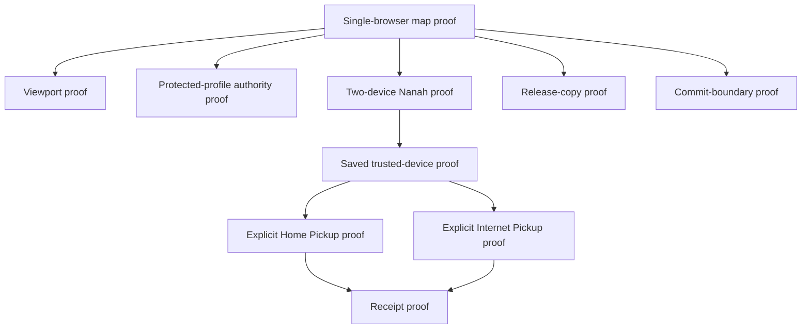

# Plan: Xender-Style My Devices And Family Map

**Generated**: 2026-07-07
**Status**: Personal and family maps, opt-in nearby picker, and companion-assisted
LAN multicast discovery implemented; installed two-device and responsive
validation pending
**Scope**: Extension-first Accounts & Sync simplification, Family Device map UI,
Nanah live pairing, explicit Home Pickup, explicit Internet Pickup, and future
native-app parity.
**Runtime behavior changed**: An explicitly configured Home Bridge or the
localhost nearby companion can carry short-lived, opt-in device presence and a
one-time pairing-code invitation. The sender must press `Find nearby`; the
other device must press
`Let this device appear`. After the parent starts finding, the map refreshes for
at most two minutes and can be stopped explicitly. Presence does not create
trust, send rules, or apply policy. The existing code/QR and matching safety
phrase remain authoritative.
The extension checks for the localhost companion only after an explicit nearby
action. The companion uses local multicast; the extension never scans subnets.
Zero-install native mDNS discovery is not implemented.
**Reviewed with**: local planning/design/accessibility pass and a read-only
`gpt-5.4-mini` authority/UX review. `gpt-5.3-codex-spark` review was attempted
but unavailable because the Spark usage limit was already reached.

## Purpose

The current managed-control work is powerful but too dense for a parent who
just wants to control a child or other family device. This plan turns the
existing Nanah, trusted-device, live Send Update, Home Pickup, and Internet
Pickup surfaces into a simple Family Devices experience:

```text
Open Family Devices
  -> see this device in the center
  -> see family devices around it
  -> tap a device
  -> pair with code/QR if needed
  -> send rules, time, and access
  -> optionally let verified devices pick up updates later
```

The UI can feel like old Xender-style device selection, but the security model
must stay FilterTube-safe:

```text
discovery is presence only
trusted pairing is authority
policy signature/revision/profile binding is enforcement
```

## Skill Key

Each checklist item names the skill or skill family that should be used when
implementing it.

| Skill label | Use |
| --- | --- |
| `planner` | keep task order concrete and dependency-aware |
| `plan-harder` | challenge assumptions, hidden failure modes, and edge cases |
| `swarm-planner` | split UI, runtime, docs, and review lanes cleanly |
| `codex-subagent` | run independent Spark review for risky slices |
| `design-taste-frontend` | avoid clutter, weak hierarchy, and generic UI |
| `Frontend Responsive Design Standards` | prevent clipped, broken, or touch-hostile layouts |
| `ui-ux-superstack` | keep parent workflow easy and calm |
| `accessibility` | keyboard, contrast, focus, and readable status behavior |
| `cursor-thermo-nuclear-code-quality-review` | review authority, state, and regression risk before commit |

## Current Boundary

These extension pieces already exist and should be reused rather than rebuilt:

- Live `Send Update` when both devices are open.
- Explicit `Internet Pickup` for verified devices that open later or away.
- Explicit `Home Pickup` for a parent/admin configured same-network pickup
  service.
- Lazy saved-update checks on protected profile open/visibility/profile switch.
- Trusted-link records and protected action history.
- Opt-in nearby presence through an explicitly configured Home Bridge:
  the protected device appears for three minutes, the parent chooses
  `Find nearby`, and an unpaired row can only start the existing phrase-verified
  pairing flow.
- Opt-in nearby presence through the localhost companion started with
  `npm run managed:nearby`. The extension detects it only after `Find nearby`
  or `Let this device appear`; companion multicast carries public presence and
  the short pairing invitation only.

These are still not claimed by the current extension release boundary:

- Hosted FilterTube Internet Pickup service deployment.
- Zero-install native LAN/mDNS discovery without the FilterTube companion.
- Native Android/iOS installed-device parity.
- Public silent auto-subscribe rule catalogs.
- Guaranteed later delivery without a configured pickup provider.

## Completion Snapshot

This is the current split between the shippable extension slice and the later
true Xender-style device discovery work.

| Area | Status | What this means |
| --- | --- | --- |
| Parent-facing Family Devices map | Implemented, pending manual evidence | Accounts & Sync now has a simpler map that starts from the parent's mental model instead of transport internals. |
| Live Nanah pairing entry point | Reused | The map points parents to the existing code/QR/safety-phrase flow. |
| Verified saved-device strip | Implemented, pending manual evidence | Saved trusted links can appear as family devices, but only after the existing trusted-link authority exists. |
| Home/school visual route | Implemented for explicit Home Pickup only | This is a configured provider route, not automatic Wi-Fi discovery. |
| Open-later visual route | Implemented for explicit Internet Pickup only | This is a configured provider route, not a hosted FilterTube service claim. |
| Redacted evidence helper | Implemented | Manual validation can capture map state without exposing device names, profile IDs, rules, PINs, or payloads. |
| Opt-in nearby-device picker | Implemented, pending installed proof | A configured Home Bridge or localhost companion can show a device only after that device chooses `Let this device appear`; the sender must then choose `Find nearby`. |
| Companion-assisted LAN discovery | Implemented, pending installed proof | `npm run managed:nearby` starts the localhost companion. Multicast connects companions on the same LAN; the extension probes localhost only after an explicit nearby action. |
| Automatic zero-setup LAN discovery | Not implemented | Native mDNS/local-broadcast discovery and browser-independent network scanning remain a separate provider/app design. |
| Native Android/iOS parity | Not implemented in this slice | The extension map defines the contract; app parity remains downstream work. |

Practical readiness:

```text
extension map UI/docs: implemented, evidence pending
configured Home Bridge nearby picker: implemented, evidence pending
companion-assisted LAN picker: implemented, evidence pending
release-ready claim: blocked on Phase 11 installed-extension evidence
zero-install native LAN discovery: future native/app slice
```

## Release Claim Wording

Use this wording only after the Phase 11 manual evidence rows pass.

Can claim:

- Accounts & Sync now has a simpler `Family Devices` map for parent-managed
  profile updates.
- Parents can start from `Open now`, then use existing Nanah pairing with code
  or QR and matching safety phrase.
- Verified trusted devices can be shown as saved family devices without making
  unpaired devices look authorized.
- Explicit Home Pickup and explicit Internet Pickup can appear as delivery
  routes for already verified trusted links when those providers are configured
  and healthy.
- Through a configured Home Bridge, a device can opt in to appear for three
  minutes and a parent can choose `Find nearby`. The parent map then refreshes
  for at most two minutes, with a visible `Stop finding` action. An unpaired
  device can only receive a short pairing-code invitation and must still match
  the safety phrase.
- Parent-side delivery receipt text is freshness-gated, so stale pickup state
  should ask the parent to check delivery again instead of claiming old success.

Must not claim:

- Automatic or zero-setup same-network device discovery.
- A hosted FilterTube Internet Pickup service.
- Guaranteed later delivery without a configured provider.
- Native Android/iOS parity for this specific map.
- Public rule-list subscription catalogs that auto-apply without review.
- Any provider, same-network, or nearby state as authority without a trusted
  link and signed profile-bound policy.

If manual validation fails, release copy should say:

```text
Family Devices UI is in progress. Live Send Update, explicit Home Pickup, and
explicit Internet Pickup remain available through the existing advanced flow.
```

## Parent Mental Model

The parent should not need to learn "mailbox", "LAN provider", or "policy
envelope" first.

```text
This device
  Open now          - the other device is open, pair and send now
  At home/school    - a verified device can collect from a trusted setup
  Open later        - a verified device can collect after it opens later
  Waiting           - update sent, protected device has not collected it yet
```

The detailed terms can remain available under Advanced for people who run their
own provider or need diagnostics.

Important wording rule:

```text
nearby or same-network means visible or reachable
verified means allowed to receive signed parent updates
```

The UI must never let a parent confuse device visibility with permission. Every
non-verified device should route to pairing first.

## Runtime Data Dependencies

The first implementation slice must not invent status that the runtime cannot
prove. The map can render only these sources:

- current device/profile state from the tab UI state store
- active Nanah live session state
- saved trusted links
- protected profile metadata
- existing source-side delivery receipt state
- explicit Home Pickup provider health and waiting-update checks
- explicit Internet Pickup provider health and waiting-update checks
- short-lived nearby-presence candidates returned by a configured Home Bridge
  only after the parent requests a nearby check

If a field has no current source, render `Unknown` or hide the status. Do not
fake `Picked up`, `Same-network`, or `Waiting` states.

## Implementation Evidence Index

This index records where the current UI/diagnostic slice lives. Use it before
changing runtime behavior or before interpreting a failed manual validation row.

| Claim / surface | Evidence anchor | Notes |
| --- | --- | --- |
| Family Devices markup exists without replacing the trusted-link runtime. | `html/tab-view.html` `.nanah-device-compass`, `#ftNanahCompassLiveBtn`, `#ftNanahCompassHomeBtn`, `#ftNanahCompassLaterBtn`, `#ftNanahTrustedDeviceStrip`, `#ftNanahDeviceSelectionPreview` | Markup keeps the existing Nanah controls and adds a parent-facing map layer. |
| Map state is data-driven. | `js/tab-view.js` `buildNanahFamilyDeviceMapViewModel()` | Sources are profile state, Nanah live session, trusted links, and explicit provider summaries. |
| Snapshot evidence is redacted. | `js/tab-view.js` `redactNanahFamilyDeviceMapSnapshot()` and `window.FilterTubeFamilyDeviceMapSnapshot` | Snapshot must not include names, link IDs, profile IDs, rules, PINs, or payloads. |
| Rendered map exposes non-sensitive capture fields. | `js/tab-view.js` `renderNanahFamilyDeviceMapViewModel()` sets `data-map-state`, `data-protected-count`, `data-verified-count`, `data-ready-count`, `data-same-network-ready-count`, and `data-away-ready-count`. | These fields support manual evidence without reading private rule data. |
| Home/school visual state only appears for healthy explicit Home Pickup. | `js/tab-view.js` `localPickupHealthy` gate plus `css/serene-shell.css` `.nanah-device-compass__trusted-device[data-route="same-network"]` | This is not automatic LAN discovery. It is a trusted-link row using configured Home Pickup health. |
| Open-later visual state only appears for healthy explicit Internet Pickup. | `js/tab-view.js` `awayPickupHealthy` gate in `buildNanahFamilyDeviceMapViewModel()` plus `css/serene-shell.css` `.nanah-device-compass__trusted-device[data-route="away"]` | This is not a hosted-service claim. It depends on configured provider health. |
| Stale source-side receipts do not show as fresh success. | `js/tab-view.js` `NANAH_MANAGED_SOURCE_ACK_FRESH_MS` and `formatNanahManagedSourceAckSyncStatus()` | Old receipt state should show `Check delivery`, not stale `Picked up`. |
| Saved-device route/status is visible to assistive tech and help bubbles. | `js/tab-view.js` `renderNanahTrustedDeviceStrip()` sets route-aware `aria-label`, `title`, and `data-filtertube-help` on each saved-device button. | This improves parent comprehension without changing trust or delivery authority. |
| Nearby finding is opt-in on both devices. | `js/tab-view.js` `startNanahNearbyDiscoverySession()`, `startNanahNearbyVisibility()`, and `renderNanahHomeBridgePresenceRow()` | The parent presses `Find nearby`; the other device presses `Let this device appear`. No ordinary dashboard-open path starts either action. |
| Parent finding is temporary and self-cleaning. | `js/tab-view.js` `NANAH_NEARBY_DISCOVERY_POLL_MS`, `NANAH_NEARBY_DISCOVERY_MAX_MS`, and `stopNanahNearbyDiscoverySession()` | A parent-triggered search refreshes for at most two minutes, exposes `Stop finding`, and stops when the dashboard is hidden or pairing begins. |
| Nearby presence is temporary transport data. | `scripts/managed-delivery-provider.mjs` `normalizeNearbyPresence()`, `publicNearbyPresence()`, and the `/presence/*` handlers | Presence expires, the receive token is stored only as a hash, and discovery never returns the token. |
| Nearby selection cannot send settings. | `js/tab-view.js` `getNanahFamilyDeviceActionContract()` and `pairNanahNearbyCandidate()` | An unpaired row is mapped to `Pair nearby device` / `Send before phrase match`; its invitation contains only the short pairing code. |
| Responsive map styling is isolated to the Family Devices surface. | `css/serene-shell.css` `.nanah-device-compass*` rules and narrow-width media blocks | Runtime view-model logic should not be changed to fix layout-only failures. |

## Current Release-Readiness Snapshot

Status as of 2026-07-10:

```text
implemented in extension UI:
  Family Devices map
  Open now / Home or school / Open later route choices
  saved trusted-device strip
  selected route preview
  Continue action routing to existing safe controls
  Copy evidence helper
  Home Bridge preview for already verified saved devices
  opt-in short-lived Home Bridge presence for unpaired devices
  parent-triggered two-minute Find nearby session with Stop finding
  pair-only invitation into the existing code/QR/safety-phrase flow
  no-provider/no-target static safety proof

requires installed proof before release-ready claim:
  Phase 11 manual map-state screenshots
  Phase 11 viewport screenshots
  parent two-device send/update smoke
  protected-user receive-only smoke
  Home Pickup / Internet Pickup provider smoke if claimed in release notes

future provider/native work:
  zero-setup mDNS/local-broadcast same-network discovery
  internet unpaired candidate discovery
  native Android/iOS nearby-device discovery permissions
  hosted FilterTube pickup service
```

Immediate next evidence:

| Priority | Case ID | Needed proof | Why this is next |
| --- | --- | --- | --- |
| 1 | `map-no-protected-profile` | Use the same visible state as `viewport-desktop-wide`, then capture the redacted `Copy evidence` JSON from the Family Devices map. | The screenshot already shows the no-protected-profile state visually, but the map-state row still needs redacted snapshot evidence before it can pass. |
| 2 | `map-one-protected-profile` | Create one protected profile, capture screenshot plus redacted map JSON. | Proves the first parent action changes from setup-only to pair/send-ready without implying device authority. |
| 3 | `viewport-narrow-desktop` or `viewport-mobile` | Capture the same surface at a narrow width with no clipping or tiny tap targets. | Confirms the Xender-style map remains usable on smaller dashboards before release copy mentions it. |
| 4 | `protected-child-pin-not-admin` | Open the protected surface and prove the child PIN cannot unlock parent/admin controls. | This is one of the highest-risk parent-control authority claims. |
| 5 | `map-untrusted-live-session` and `map-verified-live-session` | Pair two devices through code/QR and phrase match, then capture both before/after states. | Proves the live device route stays gated by safety phrase before Send Update / Save Parent Trust. |

Release wording that is safe today:

```text
FilterTube now has a parent-first Family Devices map for protected profiles.
Parents can pair with Open now, use saved verified devices, and use explicit
Home Pickup or Internet Pickup routes when those providers are configured.
```

Release wording that is not safe yet:

```text
FilterTube automatically finds every device on your network.
FilterTube can remotely control any family device once it appears nearby.
FilterTube hosts pickup for everyone.
Android and iOS have the same native discovery behavior.
```

The next concrete release gate is Phase 11. Do not mark this goal or release
slice complete until the manual evidence log has rows for the required
installed-extension states and the hard-fail conditions below stay clear.

## Chronological Checklist

### Phase 0 - Preserve The Existing Release Boundary

- [x] Re-read current managed-control audit docs and code before editing.
      Skills to use: `planner`, `plan-harder`.
      Files: `docs/audit/FILTERTUBE_MANAGED_CONTROLS_COMPLETION_AUDIT_2026-06-21.md`,
      `docs/audit/FILTERTUBE_MANAGED_SYNC_RELEASE_CLOSEOUT_2026-07-02.md`,
      `js/tab-view.js`, `js/managed_parent_command_center.js`.

- [x] Confirm all public copy still says "explicit Home Pickup" and "explicit
      Internet Pickup", not automatic LAN discovery or guaranteed hosted sync.
      Skills to use: `plan-harder`, `cursor-thermo-nuclear-code-quality-review`.

- [x] Keep `#familyDeviceUpdatesCard` as the one parent entry point instead of
      adding another competing sync page.
      Skills to use: `design-taste-frontend`, `ui-ux-superstack`.

- [x] Keep the no-work/no-provider path cheap. No background polling should run
      merely because a pretty device map exists.
      Skills to use: `plan-harder`, `cursor-thermo-nuclear-code-quality-review`.

Current evidence snapshot:

- `docs/audit/FILTERTUBE_MANAGED_CONTROLS_COMPLETION_AUDIT_2026-06-21.md`
  keeps automatic same-network discovery, hosted Internet Pickup, native
  installed-device smoke, and user-installed two-device smoke outside the
  claimed extension boundary.
- `docs/audit/FILTERTUBE_MANAGED_SYNC_RELEASE_CLOSEOUT_2026-07-02.md` confirms
  live Send Update, explicit Home Pickup, explicit Internet Pickup, lazy checks,
  and receipt checks as the extension-owned release boundary.
- `html/tab-view.html` already has `#familyDeviceUpdatesCard`,
  `.nanah-device-compass`, live/Home/Internet buttons, Advanced delivery cards,
  protected-device check row, and parent receipt row.
- `js/tab-view.js` already has `renderNanahDeliveryPathStrip()`,
  `summarizeManagedMailboxServerConfig()`, Home Pickup summary/update paths,
  saved-update checks, and receipt checks. The first implementation slice should
  reorganize these surfaces before adding any new transport behavior.

2026-07-07 lightweight last-10-commit review:

- `9ac63173` and `d73bd68c` only adjust the dashboard Android testing CTA
  placement/styling and do not touch Nanah, filtering, or managed policy paths.
- `c0b3584c` adds the About page and one route label change. It does not touch
  delivery authority, pickup, or YouTube runtime code.
- `54c35a22` is website-only simplification/internal testing copy.
- `6f7d7b46` restores collaborator warmup during identity prefetch in
  `js/content_bridge.js`; it is runtime filtering/collab behavior, not
  Accounts & Sync UI.
- `4a658584` updates release artifact reuse in `build.js` and docs.
- `2fd04d32` is the v3.3.5 runtime stability release: duplicate injection
  guard, Shorts identity prefetch, docs, and version metadata.
- `2b6c7a7d` narrows background script content-injection behavior to avoid
  duplicate runtime declarations.
- `8b92cff6` and `f4444160` are managed-control documentation/copy boundary
  commits.
- Review result: the current Family Devices map work overlaps only with the
  managed-control copy/docs commits. It does not modify the runtime filtering,
  collaborator, Shorts, build, or release artifact paths from the last 10
  commits.

2026-07-07 implementation slice 1 evidence:

- `html/tab-view.html` keeps `#familyDeviceUpdatesCard` as the single parent
  entry point but renames the visible section to `Family Devices`.
- The visible flow is now parent-first: create protected profile, pair the
  other device, then send reviewed rules, time, and Main/Kids access.
- The main map copy now uses `Open now`, `Home or school`, and `Open later`
  instead of exposing provider vocabulary first. Internal evidence fields still
  use `same-network` and `away` route IDs for precise validation.
- `js/tab-view.js` adds `buildNanahFamilyDeviceMapViewModel()` as a read-only
  data seam for the map. It only reads current profile state, live Nanah session
  state, existing delivery readiness summary, and explicit Home/Internet Pickup
  summaries.
- The first seam writes UI state and rule text only. It does not add automatic
  LAN discovery, background polling, provider setup, signing, sending, pickup,
  or apply behavior.
- The safety line remains explicit: nearby/reachable is not authority; verified
  means the device can receive signed parent updates.
- A `gpt-5.3-codex-spark` sidecar review was attempted for this slice, but the
  account was already at its Spark usage limit. The implementation proceeded
  locally using the listed planning, responsive, accessibility, and design
  skills.
- A `gpt-5.4-mini` read-only review found no automatic discovery, hidden
  polling, or transport authority break. Its wording refinements were folded
  in: visible controls now avoid transport-first labels, and internal readiness
  states avoid treating saved delivery eligibility as trust by itself.
- The map now has a selected-path preview
  `#ftNanahDeviceSelectionPreview`, populated from the read-only view model.
  It tells parents the next step: create a protected profile, pair a protected
  device, send now, or use existing verified-device delivery options.
- The three visible actions keep the existing button IDs and click handlers:
  `ftNanahCompassLiveBtn`, `ftNanahCompassHomeBtn`, and
  `ftNanahCompassLaterBtn`. The slice changes copy, tone, selected state, and
  preview text only.
- Home/Away map cards now select the advanced path and open the Advanced
  delivery section, but they do not directly configure providers. Provider
  setup remains behind the explicit `Set Up` buttons inside Advanced delivery.
- Narrow layouts stack the map and selected-path preview through existing
  responsive CSS. Manual viewport screenshots are still pending before release
  claims.
- The Help page now includes `Control Another Device In Plain Words`, with four
  parent-readable steps and notes for parent/master PIN, child profile PIN, and
  nearby vs verified device meaning.
- Device Update Details in Help is closed by default; plain guidance stays
  visible first, while Home Pickup and Internet Pickup remain Advanced details.
- Static validation on 2026-07-07: `node --check js/tab-view.js` and
  `git diff --check` passed.
- Boundary verification on 2026-07-07: public non-audit copy still describes
  Home Pickup as explicit same-network setup and keeps automatic LAN discovery,
  hosted Internet Pickup, silent auto-subscribe catalogs, and native app parity
  outside the extension claim.
- No-work verification on 2026-07-07: the new map path reads existing state and
  updates UI text/selection only. It adds no timers, no scan loop, and no
  provider setup. Existing lazy checks remain tied to dashboard open/visibility
  and configured saved-update/receipt targets.

2026-07-07 implementation slice 2 evidence:

- `buildNanahFamilyDeviceMapViewModel()` now includes saved trusted-link
  entries from existing `nanahTrustedLinks`. Each row is normalized through
  `normalizeNanahTrustedLink()` and marked with its source as `trusted-link`.
- `html/tab-view.html` adds `#ftNanahTrustedDeviceStrip` under the Family
  Devices map. It is hidden when there are no saved trusted links.
- `renderNanahTrustedDeviceStrip()` shows up to three saved devices and a `+N
  more` overflow control when more links exist. This satisfies the crowding
  guard without adding a second sync page.
- Clicking a saved device only selects it, updates the plain preview, and
  scrolls to the existing trusted-device controls below. It does not send,
  apply, reconnect, configure pickup, or change trust by itself.
- Secondary actions remain in the existing trusted-device list: open session,
  check saved updates, check delivery, edit trust, reset trust key, and remove.
- The Family control pairing steps now say the parent sequence directly:
  choose the protected profile, open FilterTube on the other device, use the
  code or QR, match the safety phrase, then send/save trust. This uses the
  existing Nanah host/join/QR controls instead of adding a new pairing path.
- Static validation after slice 2: `node --check js/tab-view.js` and
  `git diff --check` passed.

2026-07-07 implementation slice 3 evidence:

- `html/tab-view.html` adds `#ftNanahSelectedIntent` inside the existing
  Nanah session status card.
- `setNanahFamilyDeviceIntent()` and `renderNanahFamilyDeviceIntent()` keep a
  parent-visible selected intent while pairing moves through idle, waiting,
  connected, safety-phrase, and verified states.
- Map choices, Quick Send, direct Start Pairing, Join Session, and saved-device
  selection can set this UI-only intent.
- Map redraws preserve the selected Open/Home/Away path or saved trusted-device
  selection, so session updates do not reset the parent's visible choice.
- The intent state is not saved to storage and is not used by send, apply,
  pickup, signature, trusted-link, or provider setup code. It only explains the
  current parent selection and repeats that code/QR plus matching safety phrase
  are still required.

2026-07-07 implementation slice 4 evidence:

- `#ftNanahStatusSignal` now changes from `Secure handshake` to `Pairing code`,
  `Match phrase`, `Verified session`, or `Trusted device` as the existing Nanah
  state changes.
- After the safety phrase is confirmed, the status copy says the session is
  verified and asks the parent to either send the reviewed update now or save
  parent trust only for devices that should keep receiving approved updates.
- The `Save Parent Trust` / trusted-device action is now disabled until the
  session is connected, the safety phrase is confirmed, and a remote device id
  is present.
- `trustConnectedNanahDevice()` also refuses trust if the matching safety phrase
  has not been confirmed, so reachability alone cannot become saved authority.

2026-07-07 implementation slice 5 evidence:

- `nanahLastSessionNotice` records a parent-readable retry message when the
  Nanah session reports `closed`, emits an error, or closes before a verified
  update is sent.
- The session status card uses a calm `retry` tone and `Retry available` signal
  instead of dropping straight back to unexplained idle text.
- Starting or joining a fresh pairing clears the retry notice, so stale retry
  copy does not persist into the next pairing attempt.
- This is UI-only status handling. It does not alter Nanah transport behavior,
  trust links, send/apply paths, or pickup providers.

2026-07-07 implementation slice 6 evidence:

- Last-10-commit review stayed narrow and local. The current Family Devices
  dirty slice overlaps only with Accounts & Sync/dashboard UI files, while the
  recent YouTube runtime/collaborator/Shorts commits are separate
  `content_bridge`, `dom_fallback`, `background`, and release/build slices.
- Provider reachability is still treated as status and transport evidence only.
  `runNanahManagedLocalNetworkSync()` persists provider availability,
  candidate counts, accepted/rejected counts, and ack counts, but candidates
  still go through managed local-network validation before anything applies.
- Managed policy validation still builds authority from trusted links and the
  target profile. `buildNanahManagedValidationTrustedLink()` carries source
  device/profile, target profile, allowed scopes, source key id/JWK, key
  version, revoked state, and stale-pairing state into the validation context.
- Live, Internet Pickup, and Home Pickup managed updates still verify the
  integrity signature through
  `verifyManagedNanahPolicyIntegritySignature()` before accepting or applying
  an envelope.
- Outgoing protected-profile rules remain receive-only. `enforceChildSyncSurfaceRestrictions()`,
  `updateNanahPolicyControls()`, and `buildNanahOutgoingProposalPolicy()` keep
  child/protected profiles from becoming send authority, and keyword, channel,
  video, viewing-space, and time-limit sends still require saved parent trust.
- Existing rejection toasts surface the current rejection reason for managed
  policy, Internet Pickup, and Home Pickup failures. A broader wording pass for
  every possible reason remains open, so the plain-language blocked-reason
  checklist stays unchecked.

2026-07-07 implementation slice 7 evidence:

- `summarizeManagedMailboxServerConfig()` and
  `summarizeManagedLocalNetworkProviderConfig()` now expose `healthChecked` and
  `healthOk` alongside the existing configured/detail fields. This is still a
  read-only UI summary of current provider state.
- The Family Devices map now shows a clearer status when a configured pickup
  path has a failed health check: `Home/school pickup needs a check` or
  `Later pickup needs a check`.
- Selecting the home/school card with a failed health check now tells the
  parent to send live now or use the open-later path if that path is healthy.
  Selecting the open-later card with a failed health check similarly points
  back to live send or a healthy home/school path.
- This slice changes selected-path preview copy and toasts only. It does not
  add automatic discovery, background polling, provider setup, candidate
  acceptance, or policy apply behavior.

2026-07-07 implementation slice 8 evidence:

- `formatManagedNanahBlockedReason()` now translates managed-policy,
  Internet Pickup, and Home Pickup rejection codes into parent-readable text.
- The covered cases include the three required examples:
  `Pair this device first`, `This update is for another profile`, and
  `This saved update is older than the current rules`.
- The same formatter also covers common authority/security failures such as
  wrong parent device, wrong parent profile, wrong saved link, unsupported or
  invalid signature, revoked/stale pairing, key mismatch, scope mismatch, and
  malformed keyword/channel/video payloads.
- The live managed-policy, Internet Pickup, and Home Pickup rejection toasts
  now use that formatter. Validation, signature checks, trusted-link matching,
  revision handling, and apply behavior are unchanged.

2026-07-07 implementation slice 9 evidence:

- Optional discovery is now documented as a provider/native-app enhancement,
  not as an extension authority change.
- Future discovery candidates must enter the map as `Unpaired nearby device`
  and can only start the existing code/QR plus safety-phrase pairing flow.
  They cannot send, receive, apply, or create trust by being visible.
- Discovery display names must stay privacy-light and user-editable. Duplicate
  names must include platform and last-seen context before the parent chooses
  one.
- Automatic discovery remains off for the extension release boundary until a
  hostile-LAN/privacy review and real provider/native smoke proof exist.

2026-07-07 implementation slice 10 evidence:

- Native parity is now documented as a handoff contract, not claimed as app
  implementation.
- Extension-owned pieces are the parent-facing terms, managed policy contract,
  trusted-link semantics, pickup status vocabulary, and no-discovery authority
  boundary.
- Android/iOS-owned pieces are native discovery candidates, platform-specific
  local-network APIs, installed-app UI surfaces, and actual device smoke.
- App sync commits must remain separate from extension UI commits so generated
  runtime mirrors do not mix with native UI/behavior work.

2026-07-08 implementation slice 11 evidence:

- The main Family Devices map now uses parent-first labels:
  `Open now`, `At home or school`, and `Open later`.
- Internal route IDs remain unchanged: `same-network` and `away` still drive
  redacted snapshot fields, provider-health gates, CSS route states, and
  manual validation checks.
- Saved trusted-device rows now show `Ready at home/school` or `Can open later`
  instead of transport-first labels when those routes are healthy.
- Clicking the home/school or open-later map paths keeps the same explicit
  Advanced provider setup behavior, but the selected-path preview and toast
  copy use parent-readable wording.
- Static validation on 2026-07-08: `node --check js/tab-view.js` and
  `git diff --check` passed.

2026-07-08 implementation slice 12 evidence:

- The Family Devices map is now the first large interaction after the section
  intro and quick actions. The explanatory `Edit here`, `Child PIN is
  different`, and `Deliver when ready` cards now sit below the map instead of
  competing with it.
- A new `.nanah-device-compass-stage` wrapper frames the device map as the
  primary parent action without changing any Nanah IDs, click handlers,
  trusted-link records, provider setup, send, pickup, or apply behavior.
- The stage heading gives the parent the Xender-style choice in plain words:
  choose where the protected device is, start with `Open now`, and use other
  paths only after pairing.
- The mobile responsive rule includes the stage wrapper so the map keeps the
  existing one-column collapse and does not add a clipped inner edge on narrow
  screens.

2026-07-08 implementation slice 13 evidence:

- The map no longer renders as three equal cards beside a parent card on wide
  screens. It now uses a parent hub in the middle, `Open now` above it, and the
  `At home or school` / `Open later` paths as lower device choices around the
  hub.
- The visual rings are CSS-only and decorative. They do not create authority,
  device discovery, hidden network behavior, or new provider state.
- Existing DOM IDs and JS route behavior are unchanged:
  `ftNanahCompassLiveBtn`, `ftNanahCompassHomeBtn`,
  `ftNanahCompassLaterBtn`, `same-network`, and `away` still drive the same
  handlers and provider gates.
- At widths below the existing responsive breakpoint, the map falls back to a
  stacked hub plus full-width device choices so touch targets stay large and
  labels do not overlap.

2026-07-08 implementation slice 14 evidence:

- The parent mental model now uses the same vocabulary as the rendered map:
  `Open now`, `At home/school`, `Open later`, and `Waiting`.
- Selected map choices now get a stronger visual affordance through a small
  lift and inner ring. This is CSS-only and does not change selection state,
  trusted-link authority, provider health, or Nanah send/pickup behavior.
- The selected-state styling stays on the existing `data-selected` attribute
  written by `setNanahCompassChoiceCopy()`, so no new persistence or policy
  source is introduced.

2026-07-08 implementation slice 15 evidence:

- Rebuilt the extension UI shell with `npm run build:ui`; the command
  completed successfully and did not create additional generated-bundle diffs.
- Static validation after the radial map styling passed:
  `node --check js/tab-view.js` and `git diff --check`.
- This evidence proves the edited dashboard JS parses and the patch is free of
  diff whitespace errors. It does not replace Phase 11 installed-extension
  viewport screenshots or real two-device send/pickup smoke.

2026-07-08 implementation slice 16 evidence:

- Static CSS review found that the first radial map pass placed the parent hub
  and the three route cards in the same visual grid row. That could overlap
  under large text, localization, or narrow dashboard widths.
- The compass now uses explicit parent-grid rows:
  `Open now` on the top row, `This device` in the hub row,
  `At home/school` and `Open later` in the lower row, then trusted devices,
  safety rule copy, and the selected-path preview.
- The change keeps the Xender-style mental model but makes the map less fragile:
  the concentric-ring decoration remains visual only, while the interactive
  targets have deterministic rows and continue to use the same IDs and Nanah
  route handlers.
- Re-ran `npm run build:ui`, `node --check js/tab-view.js`, and
  `git diff --check`; all passed after the row-separation fix.
- Installed screenshot evidence is still pending. Two capture attempts in this
  environment stayed on the active YouTube video surface instead of the
  extension dashboard, and the Chrome accessibility window bounds were not
  available. Do not treat this as Phase 11 visual sign-off.

2026-07-08 implementation slice 17 evidence:

- Added a parent-facing Help legend beside the Family Controls explanation so
  the map terms are not only explained inside Accounts & Sync.
- The Help legend defines the four map words in plain language:
  `Open now`, `At home or school`, `Open later`, and `Waiting`.
- The legend repeats the safe default: start with `Open now`; the other paths
  are only for devices that were already paired and trusted.
- Added responsive and dark-mode styling for the legend in `css/tab-view.css`,
  keeping it as a compact comparison block instead of another dense text wall.
- Re-ran `npm run build:ui`, `node --check js/tab-view.js`, and
  `git diff --check`; all passed after this Help-page addition.

2026-07-08 implementation slice 18 evidence:

- Static layout proof found a real responsive bug in the Family Devices map:
  below the `980px` breakpoint, the route wrapper still used
  `display: contents` and the parent hub kept its desktop
  `grid-column: 2 / 5`. That created implicit columns, causing the route
  cards, safety copy, and next-step row to collapse into narrow strips.
- Fixed the breakpoint so `.nanah-device-compass__grid` becomes a real
  one-column grid, the parent hub resets to `grid-column: 1 / -1`, and the
  safety/next-step rows stay full width.
- Added component-level `box-sizing: border-box` for the compass, hub, route
  cards, trusted-device pills, safety row, and selected-path preview. This
  prevents `width: 100%` plus padding from causing narrow-width overflow when
  global box sizing is not available.
- Static proof artifacts were captured from a temporary page that imports the
  real `css/serene-shell.css`, `css/tab-view.css`, and the real Family Devices
  markup:
  `/tmp/filtertube-family-devices/map-proof-1200-after.png`,
  `/tmp/filtertube-family-devices/map-proof-760-after2.png`, and
  `/tmp/filtertube-family-devices/map-proof-430-final.png`.
- The final 430px CDP geometry check reported no horizontal overflow for:
  `.nanah-device-compass`, `.nanah-device-compass__center`,
  `.nanah-device-compass__grid`, all `.nanah-device-compass__choice` rows,
  `.nanah-device-compass__rule`, and
  `.nanah-device-compass__selection-preview`.
- This is layout evidence only. It does not prove the installed extension
  storage state, trusted-device rows, live pairing, Home Pickup, Internet
  Pickup, protected-user receive-only behavior, or real two-device flow.

2026-07-08 implementation slice 19 evidence:

- Simplified the first visible Family Devices map copy so parents see the task
  before the transport details:
  `Open now`, `Home or school`, and `Open later`.
- Changed the intro from provider-focused pickup wording to the simpler default:
  most families only need `Send Update` while both devices are open.
- Reworded the center hub to `Parent device` / `Controls stay here`, making it
  clear that rules, time, and Main/Kids access originate from the parent side.
- Kept Home/Internet Pickup names in Advanced and Help because those are the
  explicit provider features, but removed that terminology from the main map's
  first decision layer where it made the UI feel like a network admin panel.
- Updated generated map labels in `js/tab-view.js` so trusted-device route copy
  now says `Ready on home setup` or `Can pick up later`, while internal route
  IDs remain unchanged as `same-network` and `away`.
- This is a language/UX simplification only. It does not add automatic LAN
  discovery and does not change the trusted-link, signature, revision, or
  target-profile authority checks.
- Re-ran `npm run build:ui`, `node --check js/tab-view.js`, and
  `git diff --check`; all passed after this wording slice.

2026-07-08 implementation slice 20 evidence:

- Attempted an installed-extension style render using a temporary Chrome
  profile and the unpacked extension path:
  `/Users/devanshvarshney/FilterTube`.
- Headless Chrome launched successfully but exposed only `about:blank`; it did
  not load the unpacked FilterTube extension target or write FilterTube entries
  into the temporary profile preferences.
- A non-headless isolated Chrome profile with the same `--load-extension` and
  `--disable-extensions-except` flags also exposed only `about:blank` through
  the DevTools target list and had no `FilterTube`, `tab-view.html`, or
  extension-path preference hits.
- Diagnostic logs were written to:
  `/tmp/filtertube-family-devices/headless-ext-diagnostic.log` and
  `/tmp/filtertube-family-devices/gui-ext-diagnostic.log`.
- Because the isolated browser did not expose the extension page, this attempt
  does not satisfy Phase 11 installed-extension validation. Keep Phase 11 open
 until the real installed extension dashboard can be captured from a browser
 profile where FilterTube is actually loaded.

2026-07-08 implementation slice 21 evidence:

- Rebuilt the static Family Devices proof harness after discovering two false
  negatives in the first proof screenshots:
  the harness missed the tab-view surface CSS context, and Chrome captured the
  `fadeIn` animation at its near-transparent first frame.
- The corrected proof page imports the real tab-view stylesheet stack, applies
  the tab-view surface class, keeps the proof content above the ambient body
  layer, and disables animation only inside the proof harness:
  `/tmp/filtertube-family-devices/map-proof-current-surface-still.html`.
- Refreshed static visual artifacts:
  `/tmp/filtertube-family-devices/map-proof-current-surface-still-1200.png`
  and
  `/tmp/filtertube-family-devices/map-proof-current-surface-still-430.png`.
- The desktop proof shows the intended parent-facing map: `Open now` on top,
  `Parent device` in the center, `Home or school` and `Open later` on the lower
  row, plus the safety rule that finding a device is not permission.
- A strict 430px Chrome device-emulation geometry check reported
  `innerWidth`, `docClientWidth`, `docScrollWidth`, and `bodyScrollWidth` all
  at `430`. The only overflow candidate was the temporary `.proof-wrap`
  wrapper by 2px; none of the Family Devices map, choice cards, safety row, or
  selected-path preview nodes overflowed.
- This remains static surface evidence. It proves the current markup/CSS can
  render the Xender-style parent map without Family Devices element overflow,
  but it still does not prove live installed-extension storage state, real
  trusted-device rows, Home Pickup health, Internet Pickup health, or a
  two-device update exchange.

2026-07-08 implementation slice 22 evidence:

- Expanded Phase 12 from a short future-work list into a chronological build
  plan for the richer Xender-like device picker. The sequence is now:
  discovery lane decision, candidate data contract, circular/stacked map UI,
  tap-to-pair/send flow, failure/recovery copy, no-provider safety proof, and
  native app parity handoff.
- Added explicit proof gates for each future step so the next implementation
  cannot accidentally claim automatic LAN discovery, same-network authority,
  hosted Internet Pickup, or native app behavior before those providers exist.
- Preserved the current release boundary: extension UI can show manual pairing,
  saved trusted links, explicit Home Pickup, and explicit Internet Pickup; true
  nearby discovery remains future provider/native work.

2026-07-08 implementation slice 23 evidence:

- Added a Phase 12 provider decision draft so the next implementation starts
  from a concrete transport lane instead of another broad redesign.
- Read the current configured-provider clients before writing the decision:
  `js/nanah_managed_local_network_client.js` exposes explicit endpoint-backed
  publish/discover/ack/health/purge calls, and
  `js/nanah_managed_mailbox_client.js` exposes explicit Internet Pickup
  upload/pull/ack/health/purge calls.
- Decision: extension-first should start with an explicit `Home Bridge`
  provider. It can power a Xender-like chooser only for a parent-configured
  trusted home/school/clinic service. It must not claim automatic browser LAN
  discovery.
- Native Android/iOS should own the richer automatic nearby discovery lane
  later because native apps can request local-network permissions and use
  platform discovery APIs more honestly than a browser extension.
- No runtime behavior changed in this slice. It is a planning/audit update that
  reduces the risk of building UI that suggests more authority than the current
  provider model can prove.

2026-07-08 implementation slice 24 evidence:

- Converted the provider decision into a concrete extension-first build plan:
  `Phase 12A.1 - Explicit Home Bridge Candidate Picker Build Plan`.
- The plan names the relevant code surfaces: `runNanahManagedLocalNetworkSync`,
  `buildNanahFamilyDeviceMapViewModel`, `renderNanahTrustedDeviceStrip`,
  `.nanah-device-compass-stage`, `.nanah-device-compass*`, and the Home Pickup
  event handler around `ftNanahCompassHomeBtn`.
- The plan requires Home Bridge discovery to be parent-triggered. Opening
  Accounts & Sync or rendering the Family Devices map must not silently scan,
  fetch, poll, trust, send, or apply anything.
- Added a candidate state/action matrix so unpaired Home Bridge candidates can
  only start pairing, while trusted saved links remain the only route to Send
  Update, Check Pickup, or provider delivery.
- No runtime behavior changed in this slice. This is still audit/planning work
  for the next provider implementation.

2026-07-08 implementation slice 25 evidence:

- Added the first extension-owned Home Bridge preview behavior in
  `js/tab-view.js`.
- The `Home or school` map choice now performs a parent-triggered preview only
  when Home Pickup is already configured and not known offline.
- The preview calls Home Pickup health checking and lists only already verified
  saved trusted links that can use saved updates. It does not expose or trust
  new unpaired LAN devices.
- Added `nanahHomeBridgePreviewState`, a two-minute freshness window, redacted
  map snapshot fields, and map copy for `found at home` / `no verified saved
  device found`.
- Updated `renderNanahTrustedDeviceStrip()` so Home Bridge preview rows render
  as presence-only verified saved-device shortcuts. Selecting one only routes to
  the existing trusted-device controls; it does not send, apply, or save trust.
- Home Bridge preview rows suppress duplicate ordinary saved-device rows for the
  same trusted link while the preview is fresh, so parents do not see the same
  family device twice.
- Added dashed same-network styling in `css/serene-shell.css` so Home Bridge
  preview rows are visually distinct from ordinary saved devices.
- Validation passed after the change:
  `npm run build:ui`, `node --check js/tab-view.js`, and `git diff --check`.
- Remaining boundary: true unpaired nearby-device discovery is still not
  implemented. This slice is a safe preview for already verified saved devices.

2026-07-08 implementation slice 26 evidence:

- Fixed a selected-state preservation gap in `js/tab-view.js`
  `renderNanahFamilyDeviceMapViewModel()`.
- Before this slice, pressing `Home or school` could show the correct Home
  Bridge preview message and then have the final map re-render replace it with
  generic saved-device guidance.
- The map now keeps explicit selected-path copy for:
  `Home or school`, `Open later`, ordinary saved trusted devices, and Home
  Bridge preview rows.
- Home Bridge preview rows remain separate from `Open now`; selecting a
  preview row shows `Home Bridge preview` and points parents to the existing
  trusted-device controls before sending.
- The `Home or school` tile now reads like a parent action when Home Pickup is
  configured: `Find at home` before checking, `N found at home` after a
  successful saved-device preview, or `No device found` after an empty check.
- This still does not add automatic LAN discovery or unpaired device authority.
  It only makes the already implemented map state truthful after re-render.

2026-07-08 implementation slice 27 evidence:

- Added a runtime action contract for the current Family Device map rows in
  `js/tab-view.js`.
- Each visible map row now carries a redacted `primaryAction` and
  `blockedAction`, for example:
  `Review and send` / `Skip parent review`, `Send through Home Pickup` /
  `Bypass trusted link`, or `Open trusted-device controls` /
  `Trust a new device from visibility`.
- The trusted-device strip now includes this action contract in accessible
  labels and help bubbles, so the parent sees the next safe action without
  reading endpoint/provider details.
- `window.FilterTubeFamilyDeviceMapSnapshot?.()` now exposes only the redacted
  action labels; it still omits rules, PINs, payloads, profile IDs, link IDs,
  keys, and device names.
- Boundary: this completes the action contract for current map rows and
  verified saved Home Bridge preview rows. It does not complete the future
  unpaired nearby-device candidate contract.

2026-07-08 implementation slice 28 evidence:

- Simplified Home Bridge failure and empty-state copy in `js/tab-view.js`.
- The parent-facing `Home or school` path now uses recovery wording:
  `No Home device ready yet`, `Try Open now`, `Home setup did not answer`,
  and `Check Home Pickup setup in Advanced`.
- Home Bridge preview failures now write a short-lived redacted failure state
  into `nanahHomeBridgePreviewState`, so the final map re-render preserves the
  parent-readable failure instead of snapping back to generic text.
- No trust behavior changed. A failed same-place check never creates trust,
  sends rules, or applies a policy.

2026-07-08 implementation slice 29 evidence:

- Extended the runtime action contract from device rows to the three route
  choices in `js/tab-view.js`: `Open now`, `Home or school`, and
  `Open later`.
- Each route now carries redacted `primaryAction` and `blockedAction` fields in
  the map view-model and `window.FilterTubeFamilyDeviceMapSnapshot?.()`.
- `setNanahCompassChoiceCopy()` now attaches those actions to button datasets
  and help text, so the parent can see the next safe action and what the route
  will not do.
- This makes the parent-facing map more Xender-like without relaxing the
  boundary: same-network visibility still never becomes trust, and open-later
  delivery still requires receipt validation.

2026-07-08 implementation slice 30 evidence:

- Added visible action pills to the three route choices in `js/tab-view.js` and
  `css/serene-shell.css`.
- Each path now shows the immediate safe action (`Next: ...`) and the action
  FilterTube refuses to take (`Will not: ...`) directly inside the tile instead
  of hiding that explanation in Advanced copy.
- Simplified the map heading in `html/tab-view.html` so parents are told to tap
  a path and read the next safe step.
- Added route badges for saved devices (`home`, `later`, `found`) so verified
  devices read more like a simple family-device map and less like a transport
  table.
- No trust behavior changed. These are presentation-only additions over the
  existing route/device action contract.

2026-07-08 implementation slice 31 evidence:

- Extended the selected-path preview in `js/tab-view.js` and
  `css/serene-shell.css`.
- When a parent taps a route or saved verified device, the preview now repeats
  the same redacted action contract as a compact footer:
  `Next: ...` and `Will not: ...`.
- Saved trusted-device buttons now expose the same redacted action labels as
  datasets, so selection preview, help text, and accessibility copy stay
  aligned.
- This keeps the Xender-like flow task-first: choose a path, see exactly what
  happens next, and see which unsafe shortcut FilterTube refuses.
- No provider, policy, signature, profile-binding, or receipt behavior changed.

2026-07-08 implementation slice 32 evidence:

- Added a single `Continue` action slot to the selected-path preview in
  `html/tab-view.html`, `js/tab-view.js`, and `css/serene-shell.css`.
- The button uses the selected route/device action contract as its label, then
  routes the parent to existing safe controls:
  `Open now` starts the normal code/QR path, `Home or school` runs or opens the
  Home Pickup path, `Open later` opens the later-pickup path, and saved devices
  scroll to verified-device controls.
- The button does not send, trust, apply, or bypass review by itself. It is a
  parent-facing navigation affordance over the existing safe controls.
- Narrow layouts keep the button full-width inside the preview so the map does
  not create hidden horizontal overflow.

2026-07-08 implementation slice 33 evidence:

- Added a selected-route visual state to the Family Devices map in
  `js/tab-view.js` and `css/serene-shell.css`.
- Tapping `Open now`, `Home or school`, `Open later`, or a saved verified
  device now tags the map with a redacted route state (`live`, `home`, `away`,
  `same-network`, or `verified`) so the center ring and route background can
  subtly follow the selected path.
- Added tactile active states for route cards, saved-device rows, overflow,
  and the selected preview action button. This improves the Xender-style
  picker feel on mouse and touch without adding timers, network work, or
  authority changes.
- No trust behavior changed. Route color, touch feedback, and selected-state
  styling are presentation-only; same-network visibility still does not grant
  permission and saved devices still route to verified trusted-link controls.

2026-07-08 implementation slice 34 evidence:

- Added a compact `Find`, `Pair`, `Trust`, `Send` rail above the Family Devices
  map in `html/tab-view.html` and `css/serene-shell.css`.
- This puts the authority boundary in parent words before the route choices:
  first choose how to find/reach a device, then pair by code/QR, then trust only
  after the matching phrase, then send the reviewed update.
- The rail collapses to two columns below 980px so the labels remain readable
  and tap-adjacent controls do not crowd the map on narrow extension windows.
- No runtime provider behavior changed. The rail is explanatory UI only; it
  does not start discovery, create trust, send updates, or apply policy.

2026-07-08 implementation slice 35 evidence:

- Added `#ftNanahHomeBridgePresenceRow` under the Family Devices map in
  `html/tab-view.html`, rendered by `renderNanahHomeBridgePresenceRow()` in
  `js/tab-view.js`.
- The row is hidden by default. It appears only when the parent selects the
  same-place path, a Home Bridge preview was checked, Home Pickup is unhealthy,
  or verified saved Home Bridge candidates exist.
- The row has four parent-readable states: optional setup off, ready to check,
  found verified saved devices, and setup did not answer. All states keep the
  same boundary: finding a device is not permission.
- Styling in `css/serene-shell.css` keeps it compact and dotted so it reads as
  presence/feedback, not a second trusted-device list. The responsive rules
  collapse it with the map below 980px and keep narrow screens from gaining a
  new horizontal axis.
- No provider behavior changed. Rendering the row does not scan the network,
  create trust, send updates, or apply policy.

2026-07-08 implementation slice 36 evidence:

- Added compact route readiness badges to the three Family Devices route cards
  through `setNanahCompassChoiceCopy()` in `js/tab-view.js`.
- The badges are derived only from the existing map view-model:
  protected-profile count, verified-device count, live readiness, explicit Home
  Bridge candidate count, Home/Internet Pickup health, and away-ready count.
- Parent-facing labels are intentionally short: `Ready`, `Pair needed`,
  `Profile first`, `Optional`, `Check setup`, `Checked`, `N found`, and
  `N ready`.
- Styling in `css/serene-shell.css` keeps those badges inside each device card
  with subdued success/home/away/warning tones. The badges are status hints,
  not actions.
- Boundary: this improves the Xender-style visual map by making route state
  scannable, but it does not implement automatic LAN discovery, hosted Internet
  Pickup, native app discovery, trust creation, policy application, or any
  background scan.

2026-07-08 implementation slice 37 evidence:

- `renderNanahFamilyDeviceMapViewModel()` now writes
  `data-selected-route="live|home|away|verified"` on the Family Devices map
  during normal view-model rendering, not only from route button click handlers.
- This keeps the concentric map's visual state stable after profile refreshes,
  saved-device selection, pickup checks, and ordinary Accounts & Sync re-render.
- The selected route is derived from the same selected intent sources already
  used by the map: live route, Home map choice, Away map choice, trusted saved
  link, or Home Bridge preview row.
- Boundary: this is presentation and inspection state only. It does not start
  pairing, discover devices, create trust, send updates, apply policy, or treat
  Home/Internet Pickup visibility as authority.

2026-07-08 implementation slice 38 evidence:

- Route status badges now also write `data-status-label` and
  `data-status-tone` onto each Family Devices route button in `js/tab-view.js`.
- The route buttons' accessible labels include the same parent-readable status
  used in the visible map, so keyboard and screen-reader users are not forced to
  infer readiness from color, position, or the small visual badge.
- The older route title/aria-label refresh path in `renderNanahDeliveryPathStrip()`
  now preserves that status wording for `Open now`, `Home or school`, and
  `Open later`.
- Boundary: this improves accessibility and debug visibility only. It does not
  add automatic discovery, change send permissions, or make any pickup route an
  authority source.

2026-07-08 implementation slice 39 evidence:

- `renderNanahDeviceSelectionPreview()` now writes explicit state on the
  selected-device preview: `data-has-primary-action`,
  `data-has-blocked-action`, `data-primary-action`, and
  `data-blocked-action`.
- The preview also gets an accessible label with the same selected path,
  explanation, next action, and blocked action shown in the visible map.
- `css/serene-shell.css` now gives previews with a primary action a subtle
  success-tinted surface and makes status/action chips wrap on narrow screens
  instead of clipping.
- Boundary: this helps the map behave like a touch-friendly vertical device
  picker on smaller screens. It does not create a second action path, skip
  parent review, send updates, trust devices, discover devices, or apply
  policy.

2026-07-08 implementation slice 40 evidence:

- The Family Devices selected-action button now uses a `2.75rem` minimum height
  in `css/serene-shell.css`, keeping the primary action near the comfortable
  44px touch target expected for mobile and tablet controls.
- Trusted-device and overflow rows in the Family Devices map now also use a
  `2.75rem` minimum height, so saved verified devices remain tappable when the
  map collapses into the vertical picker.
- Boundary: this is touch/accessibility hardening only. It does not add
  discovery, change trusted-link authority, send updates, or apply policy.

2026-07-08 implementation slice 41 evidence:

- Added a secondary `Copy evidence` button to the Family Devices selected-path
  preview in `html/tab-view.html`.
- The button copies a redacted manual-validation payload from `js/tab-view.js`
  with the visible map dataset state and
  `window.FilterTubeFamilyDeviceMapSnapshot?.()` output.
- The copied evidence includes route/source/count/status fields only. It does
  not include device names, profile names, profile IDs, link IDs, rules, PINs,
  keys, or update payloads.
- `css/serene-shell.css` keeps this button visually secondary and responsive
  beside the existing selected-path `Continue` action, so it supports bug
  reports without turning into a parent workflow.
- Boundary: this is validation support only. It does not discover devices,
  create trust, send updates, check pickup, apply policy, or change provider
  behavior.

2026-07-08 implementation slice 42 evidence:

- Added a plain parent-facing boundary strip below the `Find`, `Pair`, `Trust`,
  `Send` rail in `html/tab-view.html`.
- The copy states: `Open now is the normal setup. Same-place and open-later
  delivery only work after the protected device is already paired and trusted.`
- Styling in `css/serene-shell.css` keeps the strip calm and readable, with a
  single-column collapse below 980px so the note does not clip in narrow
  extension windows.
- Boundary: this is wording and layout only. It keeps same-place and
  open-later honest as verified-device delivery paths and does not implement
  automatic LAN discovery, internet seeding, provider setup, trust creation, or
  policy application.

2026-07-08 implementation slice 43 evidence:

- Hardened the Family Devices `Copy evidence` helper in `js/tab-view.js` so a
  failed clipboard fallback reports an error toast instead of a false success.
- The evidence button remains validation support only; it does not send,
  discover, trust, check pickup, or apply policy.

2026-07-08 implementation slice 44 evidence:

- Adjusted the wide-screen Family Devices intro layout in
  `css/serene-shell.css` so the parent guidance strip and the simple
  `Choose profile`, `Pair and verify`, `Send update` path span the full panel
  below the device map.
- This prevents the parent guidance cards from becoming narrow text columns in
  large dashboard windows while preserving the same HTML order and map
  behavior.
- Boundary: this is readability/layout hardening only. It does not add
  automatic discovery, change trusted-link authority, create provider state,
  send updates, or apply policy.

2026-07-08 implementation slice 45 evidence:

- Completed the Phase 12B candidate data contract in this audit file with a
  versioned schema, forbidden-field list, and state/action matrix for
  `nearby-unpaired`, `internet-unpaired`, `pairing`, `verified-live`,
  `trusted-saved`, `pending-pickup`, `offline`, and `revoked`.
- The contract is aligned with existing sanitization and validation boundaries
  in `js/nanah_managed_local_network_client.js`, while keeping unpaired
  nearby-device discovery as a future provider/native-app implementation.
- Boundary: this is spec hardening only. It does not create provider discovery,
  render unpaired nearby rows, change the Home Pickup runtime, send updates, or
  apply policy.

2026-07-08 implementation slice 46 evidence:

- Completed the Phase 12E failure/recovery copy contract in this audit file
  with parent-readable failure states, one next action per state, accessible
  live-region expectations, and anti-jargon copy rules.
- The copy contract covers no devices found, disappeared device, phrase
  mismatch, duplicate visible names, pickup offline, not paired yet, revoked
  trust, unchecked pickup receipt, stale pickup receipt, and malformed provider
  rows.
- Boundary: this is UX/spec hardening only. It does not add provider
  discovery, render unpaired candidate rows, change trusted-link authority,
  send updates, check pickup, or apply policy.

2026-07-08 implementation slice 47 evidence:

- Completed the Phase 12F no-provider safety proof by tracing the current
  Accounts & Sync runtime gates in `js/tab-view.js`.
- `runNanahManagedBackgroundSync()` exits before provider work when there are
  no replica saved-update targets and no source delivery-ack targets.
- `runNanahManagedLocalNetworkSync()` persists a no-op state and returns when
  there is no provider discovery function or no eligible trusted replica link.
- `refreshNanahHomeBridgePreview()` marks Home Pickup as not configured before
  health checks or candidate collection when no configured local provider is
  available.
- The Home map click path keeps manual `Open now` pairing as the recovery path
  when no verified saved Home device is ready.
- Boundary: this is static source proof only. It does not satisfy installed
  two-device smoke, does not prove provider deployment, and does not implement
  automatic LAN peer discovery.

2026-07-08 implementation slice 48 evidence:

- Completed the Phase 12G app parity handoff in this audit file.
- The handoff keeps extension and app language aligned on `Open now`,
  `Nearby`, `Trusted`, `Open later`, `Waiting`, `Offline`, `Needs pairing`,
  and `Revoked`.
- Native Android/iOS are allowed to own richer same-network discovery only
  through app-owned OS permission prompts, network APIs, background receive
  checks, and notifications.
- Extension authority remains explicit provider/manual pairing first: seeing a
  nearby device never grants control, and saved trust still requires verified
  phrase, target, scope, revision, and local validation.
- Boundary: this is parity documentation only. It does not sync the app repos,
  add native discovery, create notifications, or satisfy Phase 11 manual
  installed-extension evidence.

2026-07-08 implementation slice 49 evidence:

- Audited the current Family Devices map implementation against Phase 12C and
  Phase 12D.
- Current implementation in `html/tab-view.html` and `css/serene-shell.css`
  now has a parent-centered map, `Open now`, `Home or school`, and
  `Open later` route choices, a saved-device strip, one selected route, one
  next-step preview, redacted evidence copy, responsive collapse below tablet
  widths, and parent-readable help text on the main controls.
- Current implementation in `js/tab-view.js` builds a redacted
  `filtertube_nanah_family_device_map_view_model`, exposes one primary action
  and one blocked action per visible route/device, routes saved trusted-device
  clicks to existing trusted-link controls, and routes `Open now` back to the
  existing code/QR/safety-phrase flow.
- Boundary: this is current route-map and saved-device behavior. It does not
  implement unpaired nearby candidate discovery, internet candidate discovery,
  automatic LAN scanning, native discovery permissions, or Phase 11 installed
  visual proof.

2026-07-08 implementation slice 50 evidence:

- Hardened the Phase 11 manual sign-off contract in this audit file.
- Added a required evidence-packet format for each manual row so screenshots,
  copied map evidence, browser/OS, extension version, expected behavior,
  actual behavior, and pass/fail notes are captured in the same shape.
- Added hard-fail conditions for authority, privacy, layout, provider, and
  copy regressions. Any hard-fail item blocks release until fixed or explicitly
  moved out of scope with a follow-up issue.
- Added a minimum evidence set for time-boxed release checks while preserving
  the full Phase 11 matrix as the complete sign-off requirement.
- Boundary: this is evidence-process hardening only. It does not mark Phase 11
  complete, does not create installed-extension proof, does not add provider
  behavior, and does not change Family Devices runtime logic.

2026-07-08 implementation slice 51 evidence:

- Recorded the first user-provided installed-dashboard screenshot as partial
  visual evidence:
  `/var/folders/5s/b3hxrvsx3f7cfmvh971k3n480000gn/T/codex-clipboard-b96482e1-8142-491c-846b-9aa8572208dc.png`.
- The screenshot shows the Accounts & Sync `Family Devices` map in the real
  dashboard with parent-first copy, the center parent device, `Create protected
  profile` as the first step, `No paired device yet`, `Open later`, and the
  `Edit here` / `Child PIN is different` / `Deliver when ready` guidance below
  the map.
- This evidence supports the desktop/wide visual direction and no-protected or
  no-paired-device empty state, but it is not enough to mark Phase 11 complete:
  browser/OS/version metadata, copied redacted evidence, viewport variants,
  trusted-device rows, Home/Internet Pickup states, parent send smoke, and
  protected-user authority checks are still missing.

2026-07-08 implementation slice 52 evidence:

- Added stable Phase 11 case IDs for manual map states, viewport states, and
  protected-user authority checks.
- Added a copy-paste evidence packet skeleton and a recommended evidence bundle
  layout under `docs/audit/evidence/family-devices-YYYY-MM-DD/`.
- Added filename rules and a copied-evidence sanity checklist so screenshots,
  videos, redacted JSON, and notes can be correlated by case id without
  leaking PINs, rules, profile IDs, link IDs, provider tokens, private keys, or
  raw payloads.
- Boundary: this is manual-validation process hardening only. It does not add
  runtime behavior, provider behavior, installed proof, or Phase 11 sign-off.

2026-07-08 implementation slice 53 evidence:

- Added a Release Boundary Evidence Matrix for the existing
  `release-copy-boundary` and `commit-boundary-extension-ui-docs` rows.
- The release-copy row now has explicit pass/fail criteria: release notes may
  claim the parent-first Family Devices map, Open now, saved verified devices,
  and explicit configured pickup routes, but must not claim automatic LAN
  discovery, hosted pickup, native parity, or silent public-list subscription.
- The commit-boundary row now requires a narrow diff proof separating extension
  UI/docs/audit changes from future provider/native/app parity work.
- Boundary: this only defines evidence criteria. It does not create a release,
  commit, provider, installed smoke result, or Phase 11 sign-off.

2026-07-08 implementation slice 54 evidence:

- Added command-level proof snippets for `release-copy-boundary` and
  `commit-boundary-extension-ui-docs`.
- The release-copy command searches public release surfaces while excluding
  `docs/audit/**`, because the audit file intentionally contains forbidden
  claims as negative examples.
- The commit-boundary commands require `git status --short`,
  `git diff --stat`, and `git diff --name-only` before committing so app mirror
  sync, native app files, provider deployment, mobile artifacts, or unrelated
  YouTube runtime fixes do not get mixed into this UI/docs/audit slice.
- Boundary: this adds proof commands only. It does not run release approval,
  create a commit, or satisfy Phase 11 installed-extension evidence.

2026-07-08 implementation slice 55 evidence:

- Ran the release-copy boundary search against `CHANGELOG.md`,
  `data/release_notes.json`, `README.md`, `website`, and `docs` while excluding
  `docs/audit/**`.
- The search returned only explicit boundary/caveat statements saying automatic
  LAN discovery, hosted pickup, silent public auto-subscribe catalogs, native
  app parity, and installed two-device smoke are not claimed as complete.
- Recorded `release-copy-boundary` as passing for the current public copy state.
  This must be rerun before release if `CHANGELOG.md`, `data/release_notes.json`,
  `README.md`, website copy, or public docs change again.
- Boundary: this does not complete Phase 11 because manual installed-extension
  map states, viewports, parent/protected smoke, and commit-boundary evidence
  remain pending.

2026-07-08 implementation slice 56 evidence:

- Added a Phase 11 execution queue so manual validation is not treated as one
  undifferentiated pending block.
- Split the remaining evidence into single-browser checks, two-device Nanah
  checks, provider checks, protected-authority checks, and commit-boundary
  checks.
- Added a dependency graph that makes clear which rows can be captured before a
  second device exists and which rows must wait for verified pairing or an
  explicit pickup provider.
- Boundary: this is audit/process work only. It does not mark any installed
  evidence row as passed and does not change runtime behavior.

2026-07-08 implementation slice 57 evidence:

- Added copy-paste evidence packets for Tier 1 and Tier 2 validation.
- Tier 1 packets cover the first parent-facing map checks that can be done in a
  single browser: no protected profile, one protected profile, desktop-wide,
  narrow desktop, and mobile.
- Tier 2 packets cover protected-profile authority checks: receive-only
  surface, child PIN not admin, parent-managed edit only, remove-parent-link
  blocked, and rotate-parent-key blocked.
- Boundary: these packets are templates only. They do not replace screenshots,
  copied redacted map evidence, manual action proof, or the evidence log rows.

2026-07-08 implementation slice 58 evidence:

- Added copy-paste evidence packets for Tier 3 and Tier 4 validation.
- Tier 3 packets cover two-device Nanah flow: untrusted live session, verified
  live session, and saved trusted device.
- Tier 4 packets cover explicit provider and receipt proof: Home Pickup healthy
  and offline, Internet Pickup healthy, waiting receipt, picked-up receipt,
  stale receipt, and malformed provider data.
- Boundary: these packets do not claim automatic LAN discovery, hosted pickup,
  provider deployment, or native app parity. They only define how to prove the
  existing explicit provider paths.

2026-07-08 implementation slice 59 evidence:

- Added Tier 5 evidence packets for the final release boundary pass.
- The Tier 5 packets cover tablet viewport, large-text viewport, release-copy
  boundary rerun, and commit-boundary proof.
- Added final gate rules that explain when the release-copy row must be rerun
  and when the commit must be split before staging.
- Boundary: this still does not mark Phase 11 complete. It only makes the last
  proof lane explicit.

2026-07-08 implementation slice 60 evidence:

- Added a concrete evidence-capture workflow for turning the Tier packets into
  real Phase 11 evidence.
- Added a manual-log update procedure so screenshots, redacted JSON packets,
  and pass/fail rows stay tied to stable case IDs.
- Added privacy and redaction checks for what must never be stored in
  `docs/audit/evidence/**`.
- Boundary: this is still process hardening. It does not create installed
  screenshots, does not run a two-device smoke, and does not complete Phase 11.

2026-07-08 implementation slice 61 evidence:

- Added concrete static source anchors for the no-provider / provider-gating
  proof in Phase 12F.
- Current code shows `same-network` and `away` route labels are derived only
  from saved trusted links plus configured healthy Home Pickup / Internet
  Pickup provider summaries. Raw same-network presence is not authority.
- Current code shows Home Bridge preview, local-network candidate discovery,
  protected-device saved-update checks, and parent delivery-receipt sync all
  have early no-op gates when there is no configured provider or no eligible
  trusted-link target.
- Boundary: this is static source proof only. It does not replace installed
  screenshots, real provider smoke, or a two-device manual Send Update /
  Pickup validation.

2026-07-08 implementation slice 62 evidence:

- Stored the current user-provided installed dashboard screenshot as desktop
  viewport evidence:
  `docs/audit/evidence/family-devices-2026-07-08/viewport-desktop-wide.chrome-macos.png`.
- Added an evidence manifest at
  `docs/audit/evidence/family-devices-2026-07-08/README.md` so the screenshot
  remains tied to its proof boundary and privacy rules.
- Added `docs/audit/evidence/family-devices-2026-07-08/00-environment.md`
  with the captured environment boundary. The screenshot SHA-256 is
  `f9c0bdaebf1b44433fbe1c1595855ec455c6993ed58d130e82740c5607e8f663`.
- The screenshot shows the Accounts & Sync `Family Devices` map rendering in a
  wide desktop layout without obvious card clipping, ring overlap, or hidden
  primary controls.
- The same screenshot also visually supports the no-protected-profile empty
  state, but it does not include a copied redacted map snapshot. Therefore the
  `map-no-protected-profile` row stays pending until the redacted snapshot is
  captured from `window.FilterTubeFamilyDeviceMapSnapshot`.
- Boundary: this is visual viewport evidence only. It does not prove live
  pairing, saved trust, Home Pickup, Internet Pickup, protected-user
  restrictions, or two-device delivery.

2026-07-08 implementation slice 63 evidence:

- Added static privacy proof for the Family Devices `Copy evidence` helper.
- Current source shows the redacted snapshot exports only safe counts, route
  state, health booleans, selected route/source, primary actions, blocked
  actions, and coarse `profileBound` booleans.
- Current source does not copy device labels, profile names, profile IDs, link
  IDs, channel/keyword rules, PINs, keys, provider tokens, raw policy payloads,
  or raw provider response bodies.
- Boundary: this proves the source shape of the helper. It does not replace
  the actual manual `map-no-protected-profile` copied JSON row, because the
  installed dashboard still needs to be captured from the active browser.

2026-07-08 implementation slice 64 evidence:

- Opened the installed Chrome extension dashboard at
  `chrome-extension://gkgjigdfdccckblmglboobikfcpeelio/html/tab-view.html#accounts`
  and confirmed the active tab title is `FilterTube Dashboard`.
- Attempted to capture `window.FilterTubeFamilyDeviceMapSnapshot?.()` through
  Chrome Apple Events, but Chrome rejected JavaScript execution because
  `View > Developer > Allow JavaScript from Apple Events` is disabled.
- No manual JSON evidence was captured in this slice. The
  `map-no-protected-profile` row remains pending.
- Manual fallback: with the Accounts & Sync dashboard open, click `Copy
  evidence`, then paste the clipboard into
  `docs/audit/evidence/family-devices-2026-07-08/map-no-protected-profile.chrome-macos.json`.
  The JSON must use the `filtertube_family_devices_manual_evidence` schema and
  must not include names, IDs, rules, PINs, keys, provider tokens, or payloads.

2026-07-08 implementation slice 65 evidence:

- Added `scripts/validate-family-device-evidence.mjs` so copied Family Devices
  evidence can be checked before a manual row is marked `pass`.
- The validator accepts either the raw `Copy evidence` JSON or a full manual
  packet containing `copiedMapEvidence`.
- It checks for the `filtertube_family_devices_manual_evidence` wrapper, the
  `filtertube_nanah_family_device_map_snapshot` snapshot, the expected
  snapshot/path/device allow-list fields, and forbidden private field names.
- Boundary: this is a guard for pasted JSON quality. It does not create or
  replace installed evidence, and it does not prove two-device behavior.

2026-07-08 implementation slice 66 evidence:

- Added a `Download evidence` button next to `Copy evidence` in the Family
  Devices map.
- The button uses the same redacted
  `filtertube_family_devices_manual_evidence` payload as the clipboard path and
  saves it through the existing JSON export/download helper.
- This reduces manual evidence capture friction when clipboard access or Chrome
  Apple Events are unavailable.
- Boundary: the downloaded file is still only evidence after a human captures it
  from the installed extension and validates it with
  `scripts/validate-family-device-evidence.mjs`. It does not add policy fields,
  device IDs, PINs, provider tokens, or automatic proof.

2026-07-08 implementation slice 67 evidence:

- Added `scripts/create-family-device-evidence-packet.mjs` so a downloaded or
  copied redacted Family Devices snapshot can be wrapped into the full manual
  packet shape required by this audit.
- The helper writes the packet with `testedAt`, `extensionVersion`, `browser`,
  `os`, `profileMode`, `caseId`, `screenshotPath`, `copiedMapEvidence`,
  `expected`, `actual`, `result`, and `notes`.
- It accepts either the raw `filtertube_family_devices_manual_evidence` JSON or
  a packet that already contains `copiedMapEvidence`, then reminds the tester to
  run `scripts/validate-family-device-evidence.mjs` on the output.
- Boundary: this helper does not manufacture evidence and does not mark a row
  pass. It only reduces hand-edited JSON mistakes after a real installed
  dashboard capture.

2026-07-08 implementation slice 68 evidence:

- Hardened `scripts/validate-family-device-evidence.mjs` so full manual packets
  must include non-empty `testedAt`, `extensionVersion`, `browser`, `os`,
  `profileMode`, `caseId`, `screenshotPath`, `expected`, `actual`, and
  `result`.
- The validator now rejects unexpected outer packet keys, invalid result values,
  and screenshot paths that do not point to `.png` or `.mp4` evidence.
- Hardened `scripts/create-family-device-evidence-packet.mjs` so it requires
  browser, OS, version, profile mode, expected text, and actual text when
  creating a packet.
- Boundary: raw `filtertube_family_devices_manual_evidence` snapshots still
  validate as raw snapshots, but they are not enough to mark a Manual Evidence
  Log row complete until wrapped with the packet metadata.

2026-07-08 implementation slice 69 evidence:

- Added `scripts/report-family-device-phase11-status.mjs` so the manual
  evidence table can be summarized without rereading this whole audit file.
- The helper parses the Phase 11 Manual Evidence Log, counts result states, and
  prints the minimum release evidence rows with available visual/JSON artifact
  counts from `docs/audit/evidence/family-devices-2026-07-08`.
- `--next` prints the next missing minimum evidence row, suggested screenshot
  path, raw copied/downloaded evidence path, packet output path, and the exact
  `create-family-device-evidence-packet.mjs` command to run after capture.
- `--require-minimum-pass` intentionally exits non-zero until
  `map-no-protected-profile`, `map-one-protected-profile`,
  `map-verified-live-session`, `map-trusted-device-saved`,
  `protected-receive-only-surface`, `protected-child-pin-not-admin`, and
  `viewport-mobile` are all marked `pass`.
- The strict gate also requires the minimum map/protected rows to have both a
  visual artifact and a JSON packet, requires `viewport-mobile` to have a
  visual artifact, and reports the no-provider/no-rule performance proof as a
  separate static minimum item.
- Boundary: this is a status/reporting helper only. It does not capture
  screenshots, validate two-device behavior, create provider proof, or mark
  Phase 11 complete.

2026-07-08 implementation slice 70 evidence:

- Hardened `scripts/validate-family-device-evidence.mjs` so full packet
  filenames and screenshot filenames must start with the packet `caseId`.
- The validator now allows viewport-only and static release-boundary packets to
  omit copied map evidence when the audit row does not require copied map JSON.
- Static cases `release-copy-boundary` and `commit-boundary-extension-ui-docs`
  may use `N/A` as the screenshot path; other packet rows must point to `.png`
  or `.mp4` evidence.
- Boundary: this improves evidence quality only. It does not produce the
  installed-extension screenshots, copied JSON packets, or two-device proof
  required by Phase 11.

### Phase 1 - Simplify Accounts & Sync Before Adding New Behavior

- [x] Rename the parent-facing section to `Family Devices` or `Device Control`
      while keeping technical IDs stable where possible.
      Skills to use: `design-taste-frontend`, `ui-ux-superstack`.

- [x] Replace dense copy with a three-step parent path:
      `Create protected profile`, `Pair device`, `Send update`.
      Skills to use: `design-taste-frontend`, `accessibility`.

- [x] Keep Advanced closed by default and move endpoint URLs, provider checks,
      setup tokens, raw receipt checks, and diagnostic text there.
      Skills to use: `ui-ux-superstack`, `Frontend Responsive Design Standards`.

- [x] Add a one-line safety rule near the map:
      `Seeing a device is not permission. A device can receive updates only
      after pairing and phrase verification.`
      Skills to use: `plan-harder`, `design-taste-frontend`.

- [x] Update Help page wording for the simplified flow and explain the two PINs:
      parent/master unlock controls settings; child profile PIN only prevents
      casual profile switching.
      Skills to use: `design-taste-frontend`, `accessibility`.

### Phase 2 - Build The First Family Device Map From Existing State

- [x] Convert the current `nanah-device-compass` into a clearer map:
      center node is this device, ring nodes are existing trusted or pending
      delivery targets.
      Skills to use: `design-taste-frontend`, `Frontend Responsive Design Standards`.

- [x] Show the parent one safe next action and one blocked action directly on
      each route tile, so the map can be understood without reading Advanced.
      Skills to use: `design-taste-frontend`, `Frontend Responsive Design Standards`.

- [x] Keep initial map data sourced only from existing trusted links and current
      session state. Do not invent automatic discovery in this phase.
      Skills to use: `plan-harder`, `cursor-thermo-nuclear-code-quality-review`.

- [x] Define a small `familyDeviceViewModel` in `js/tab-view.js` before
      rendering:
      `id`, `label`, `platform`, `role`, `profileId`, `profileName`,
      `trustState`, `deliveryState`, `lastSeen`, `selected`, `canSend`,
      `canReceive`, `canCheckPickup`.
      Skills to use: `planner`, `cursor-thermo-nuclear-code-quality-review`.

- [x] Bind every `familyDeviceViewModel` field to a named source from Runtime
      Data Dependencies. Unknown values should stay hidden or show `Unknown`,
      never guessed.
      Skills to use: `plan-harder`, `cursor-thermo-nuclear-code-quality-review`.

- [x] Use friendly buckets:
      `Open now`, `Home or school`, `Open later`, `Needs pairing`,
      `Waiting`.
      Skills to use: `design-taste-frontend`, `ui-ux-superstack`.

- [x] Start with three visible buckets until trust exists:
      `This device`, `Pair a device`, `Verified devices`.
      After a device is verified, it can show `Open now`,
      `Home or school`, `Open later`, or `Waiting`.
      Skills to use: `design-taste-frontend`, `plan-harder`.

- [x] For mobile and narrow extension windows, collapse the radar into a
      top-centered hub plus device cards. Do not let the map clip vertically.
      Skills to use: `Frontend Responsive Design Standards`, `accessibility`.

- [x] Add a `+N more` overflow affordance if more devices exist than can fit
      without crowding.
      Skills to use: `Frontend Responsive Design Standards`, `ui-ux-superstack`.

### Phase 3 - Make Device Selection Obvious

- [x] Tap/clicking a device selects it, highlights it, and updates a plain
      preview:
      `You are about to update Pushy on iPad`.
      Skills to use: `design-taste-frontend`, `accessibility`.

- [x] Keep exactly one primary action visible after selection:
      `Send update now`, `Pair this device`, or `Check for waiting update`.
      Skills to use: `ui-ux-superstack`, `design-taste-frontend`.

- [x] Secondary actions must stay secondary:
      `Set up same-network pickup`, `Set up away pickup`, `View history`,
      `Remove trust`.
      Skills to use: `design-taste-frontend`, `planner`.

- [x] Do not put provider setup, endpoint editing, or status JSON in the main
      device map.
      Skills to use: `plan-harder`, `ui-ux-superstack`.

- [x] Add focus states, keyboard selection, and visible selected state.
      Skills to use: `accessibility`, `Frontend Responsive Design Standards`.

### Phase 4 - Connect With Existing OTP/QR Pairing

- [x] Use the existing Nanah code/QR session as the pairing path behind
      `Pair this device`.
      Skills to use: `planner`, `cursor-thermo-nuclear-code-quality-review`.

- [x] The pairing sheet should show:
      `1. Open FilterTube on the other device`,
      `2. Enter this code or scan QR`,
      `3. Match the safety phrase`,
      `4. Choose the protected profile`.
      Skills to use: `design-taste-frontend`, `accessibility`.

- [x] If a device was selected before pairing, keep that intent visible but do
      not trust it until OTP/safety phrase succeeds.
      Skills to use: `plan-harder`, `cursor-thermo-nuclear-code-quality-review`.

- [x] Pairing expiry should show a calm retry state, not a technical failure.
      Skills to use: `ui-ux-superstack`, `design-taste-frontend`.

- [x] After pairing succeeds, show the device as `Verified` and ask whether to
      save parent trust for future updates.
      Skills to use: `design-taste-frontend`, `planner`.

### Phase 5 - Authority Model Behind The Simple Map

- [x] Treat the map as advisory UI, never as policy authority.
      Skills to use: `plan-harder`, `cursor-thermo-nuclear-code-quality-review`.

- [x] Discovery or provider reachability can update `lastSeen` and status only;
      it cannot create trust, satisfy profile binding, or enable apply.
      Skills to use: `plan-harder`, `cursor-thermo-nuclear-code-quality-review`.

- [x] Every send/apply path must keep trusted link, target profile, revision,
      policy hash, key identity, and signature checks.
      Skills to use: `plan-harder`, `cursor-thermo-nuclear-code-quality-review`.

- [x] Show blocked reasons in plain language:
      `Pair this device first`, `This update is for another profile`,
      `This saved update is older than the current rules`.
      Skills to use: `design-taste-frontend`, `accessibility`.

- [x] Keep child/protected profile receive-only controls enforced. Child PIN
      must never become admin authority.
      Skills to use: `plan-harder`, `cursor-thermo-nuclear-code-quality-review`.

### Phase 6 - Home Pickup As Same-Network Device Flow

- [x] Present Home Pickup as `Same network pickup`, with a short sentence:
      `For a home, school, or clinic helper running on the same network.`
      Skills to use: `design-taste-frontend`, `ui-ux-superstack`.

- [x] Keep Home Pickup setup under Advanced until a provider is configured.
      Skills to use: `Frontend Responsive Design Standards`, `ui-ux-superstack`.

- [x] If configured and healthy, show verified home/school devices or profiles
      in the map, but still require trust before updates can apply.
      Skills to use: `plan-harder`, `cursor-thermo-nuclear-code-quality-review`.
      Evidence: the Family Devices map now marks verified trusted source links
      as `Ready on home setup` when Home Pickup is configured and the latest
      provider health check passed. The configured bridge can also show a
      short-lived unpaired row after the other device explicitly chooses
      `Let this device appear` and the parent chooses `Find nearby`. That row is
      presence only and can only start phrase-verified pairing.

- [x] If the provider is down, show that home/school pickup needs a check and
      offer `Open now` or `Open later` if available.
      Skills to use: `design-taste-frontend`, `accessibility`.

- [x] Do not claim automatic LAN discovery in extension copy until provider or
      native app discovery has real smoke proof.
      Skills to use: `plan-harder`, `swarm-planner`.

### Phase 7 - Internet Pickup As Open-Later Device Flow

- [x] Present Internet Pickup as `Open later`, with a short sentence:
      `For a verified device that opens later.`
      Skills to use: `design-taste-frontend`, `ui-ux-superstack`.

- [x] Show `Waiting` and `Picked up` states in the map when source-side receipt
      data exists.
      Skills to use: `planner`, `design-taste-frontend`.
      Evidence: `formatNanahManagedSourceAckSyncStatus()` now renders
      `Waiting for pickup` for a fresh check with no ack and `Picked up` after
      a validated receipt is recorded for the trusted link.

- [x] Before rendering `Picked up`, confirm the receipt producer, schema, and
      refresh trigger. If receipt freshness is unknown, show `Check delivery`
      instead of a stale success state.
      Skills to use: `plan-harder`, `cursor-thermo-nuclear-code-quality-review`.
      Evidence: source-side receipt sync uses the configured Internet Pickup or
      Home Pickup ack provider, accepts only
      `filtertube_nanah_managed_open_sync_ack` or
      `filtertube_managed_local_network_candidate_ack`, records through
      `recordRemoteDeliveryAckPayload()`, refreshes on dashboard/visibility or
      manual `Check Delivery`, and only shows `Picked up` within the fresh
      receipt-check window.

- [x] Keep the HTTPS service address and token details in Advanced.
      Skills to use: `Frontend Responsive Design Standards`, `accessibility`.

- [x] Do not claim a FilterTube-hosted pickup service unless deployment,
      retention, purge, CORS, endpoint health, and smoke proof are present.
      Skills to use: `plan-harder`, `cursor-thermo-nuclear-code-quality-review`.

### Phase 8 - Optional Device Discovery Roadmap

- [x] Design discovery as a provider/native-app enhancement, not an extension
      authority change.
      Skills to use: `swarm-planner`, `plan-harder`.

- [x] Nearby candidates should enter the map as `Unpaired nearby device`.
      They can be tapped only to start pairing.
      Skills to use: `design-taste-frontend`, `cursor-thermo-nuclear-code-quality-review`.

- [x] Device names should be privacy-light and user-editable:
      `Aarav tablet`, `Living room PC`, `School laptop`.
      Skills to use: `design-taste-frontend`, `accessibility`.

- [x] Handle duplicate names by showing platform and last seen:
      `Aarav tablet - Android - seen 2 min ago`.
      Skills to use: `plan-harder`, `design-taste-frontend`.

- [x] Keep automatic discovery off by default until hostile-LAN and privacy
      review are complete.
      Skills to use: `plan-harder`, `cursor-thermo-nuclear-code-quality-review`.

Discovery candidate contract for future provider/native work:

```text
candidate.id           provider-local identifier, not authority
candidate.label        parent-editable display name
candidate.platform     Android, iOS, desktop, browser, TV, or Unknown
candidate.lastSeen     approximate local/provider observation time
candidate.networkHint  same-network, nearby, away, or unknown
candidate.trustState   unpaired-nearby until code/QR plus safety phrase passes
candidate.action       Pair this device
```

Rules:

- Discovery rows never include policy payloads, PINs, rules, profile secrets,
  trusted-link keys, or saved update payloads.
- Discovery rows never unlock `Send update`, `Check pickup`, or `Save parent
  trust`.
- A discovered row can only prefill the human label in the existing pairing
  flow. The verified identity must still come from Nanah pairing and signed
  managed-policy trust.

### Phase 9 - Native App Parity Planning

- [x] Record which parts are extension-only and which must sync to Android/iOS:
      map copy, managed policy contract, trusted links, pickup status, time
      limit status, and rule-list updates.
      Skills to use: `swarm-planner`, `android-ui-ux-design-taste`,
      `react-native-design`.

- [x] If `react-native-design` is unavailable in a later environment, use
      `android-ui-ux-design-taste`, `android-ui-ux-pro-max`, and the native app
      design review lane instead of blocking the extension plan.
      Skills to use: `planner`, `swarm-planner`.

- [x] For Android/iOS, prefer real local-network APIs for discovery candidates
      when available. The extension should not fake this with expensive browser
      polling.
      Skills to use: `android-design`, `react-native-design`, `plan-harder`.

- [x] Native UI should keep the same parent mental model:
      `This device`, `Home or school`, `Open later`, `Waiting`.
      Skills to use: `android-ui-ux-pro-max`, `react-native-design`,
      `design-taste-frontend`.

- [x] App sync commits must stay separate from extension UI commits.
      Skills to use: `planner`, `cursor-thermo-nuclear-code-quality-review`.

Native parity handoff contract:

```text
Extension owns:
  - parent-facing Family Devices wording
  - managed policy scope/revision/hash/signature semantics
  - trusted-link and protected-profile authority boundaries
  - pickup status vocabulary: Open now, Home or school, Open later, Waiting
  - no automatic discovery claim without provider/native proof

Android/iOS own:
  - native nearby-device discovery candidates
  - installed-app device picker behavior
  - local-network permission prompts and OS APIs
  - real two-device smoke for send, pickup, and time-limit behavior
  - app-specific responsive/navigation design

Sync rule:
  - sync extension runtime output only after the extension proof commit
  - commit generated app mirrors separately
  - keep native UI/Kotlin/Swift changes in their own commits
```

### Phase 10 - Documentation And Help

- [x] Add a Help section titled `Control another device in plain words`.
      Skills to use: `design-taste-frontend`, `accessibility`.

- [x] Explain the path without technical transport names first:
      `Pair once`, `Choose who receives rules`, `Send update`, `Let verified
      devices pick up updates later if you configured pickup`.
      Skills to use: `design-taste-frontend`, `ui-ux-superstack`.

- [x] Keep a separate `Advanced delivery` help section for users who run Home
      Pickup or Internet Pickup providers.
      Skills to use: `planner`, `design-taste-frontend`.

- [x] Update audit docs with what was implemented and what remains unclaimed.
      Skills to use: `planner`, `plan-harder`.

### Phase 11 - Manual Validation Before Release

- [ ] Check the map in these states:
      no protected profile, one protected profile, trusted device, untrusted
      session, Home Pickup configured, Internet Pickup configured, provider
      offline.
      Skills to use: `planner`, `cursor-thermo-nuclear-code-quality-review`.
      Required evidence: screenshots or notes for every row in
      `Manual Validation Matrix`.

- [ ] Check viewport behavior:
      desktop, narrow desktop, tablet width, mobile width, large text/zoom.
      Skills to use: `Frontend Responsive Design Standards`, `accessibility`.
      Required evidence: screenshots at the viewport widths in
      `Viewport Evidence Matrix`, with no clipped compass, trusted-device row,
      selected-intent preview, or Advanced delivery card.

- [ ] Check parent flow manually:
      create child profile, pair, match phrase, send rules, child opens and
      receives, parent sees receipt/history.
      Skills to use: `plan-harder`, `cursor-thermo-nuclear-code-quality-review`.
      Required evidence: parent device shows verified session, protected device
      receives only signed parent-approved policy, parent row later shows
      `Waiting for pickup`, `Picked up`, or a rejected receipt reason.

- [ ] Check protected user flow manually:
      child cannot change trust, cannot edit parent rules, and child PIN does
      not unlock admin controls.
      Skills to use: `plan-harder`, `cursor-thermo-nuclear-code-quality-review`.
      Required evidence: protected profile can open receive-only Accounts &
      Sync, but cannot rotate trust keys, remove parent authority, send updates
      to sibling profiles, or use the child PIN as parent/admin authority.

- [x] Check no-provider/no-rule performance:
      opening Accounts & Sync must not start broad sync scans or polling.
      Skills to use: `plan-harder`, `cursor-thermo-nuclear-code-quality-review`.
      Static evidence: dashboard open calls
      `runNanahManagedBackgroundSync({ reason: 'dashboard_open' })`, but that
      returns immediately unless `hasNanahManagedSavedUpdateCheckTarget()` or
      `hasNanahManagedSourceAckSyncTarget()` finds a trusted saved-update or
      receipt target. Visibility refresh has the same early gate and a
      one-minute coalescing interval. This does not replace installed-extension
      performance smoke, but it proves the no-target path does not start broad
      pickup scans from this entry point.

### Phase 12 - True Nearby Device Discovery Design

The first extension-owned lane is now implemented through an explicitly
configured Home Bridge. It is deliberately opt-in rather than a silent network
scan: the protected device chooses `Let this device appear`, the parent chooses
`Find nearby`, and the bridge carries only short-lived presence plus a one-time
pairing code. The existing safety phrase still decides whether pairing can
continue. Automatic zero-setup mDNS/local-broadcast discovery remains future
native/provider work.

#### Phase 12A - Discovery Lane Decision

- [x] Draft the first provider decision before writing discovery UI.
      Skills used: `planner`, `plan-harder`.
      Decision: build the extension-first lane around explicit `Home Bridge`
      setup, keep WebRTC/native discovery as later lanes, and never describe
      configured provider reachability as trust.

- [x] Pick one first discovery lane before writing UI:
      browser-compatible explicit Home Bridge, native mDNS/local broadcast,
      WebRTC rendezvous, or a hybrid provider.
      Skills to use: `planner`, `plan-harder`, `codex-subagent`.
      Proof needed: a one-page provider decision explaining what can work in
      browser extension, Android, iOS, and TV surfaces without pretending Wi-Fi
      visibility is authority.

- [x] Define the transport boundary in parent words:
      `Find device`, `Pair device`, `Trust device`, `Send update`.
      Skills to use: `ui-ux-superstack`, `design-taste-frontend`.
      Proof needed: Accounts & Sync copy never says a device is controlled just
      because it is visible, nearby, online, or on the same network.
      Evidence: `html/tab-view.html` now adds a compact Family Device safety
      path rail above the map: `Find`, `Pair`, `Trust`, `Send`. The nearby
      safety rule still says finding a device is not permission, and the map
      routes untrusted or unconfigured paths back to pairing/setup instead of
      claiming control.

- [ ] Add zero-setup native LAN discovery only where the platform can expose
      it safely through explicit local-network permission.
      Skills to use: `planner`, `plan-harder`, `android-ui-ux-design-taste`,
      `react-native-design`.
      Current status: future provider/native behavior. The extension uses an
      explicitly configured Home Bridge and never scans the network on
      dashboard open. This future item is not a release blocker for the opt-in
      Home Bridge picker.

##### Phase 12A Provider Decision Draft

Recommended first lane: **explicit Home Bridge**.

This is the right extension-first lane because the current runtime already has
an explicit configured local-network provider shape:

```text
parent configures Home Bridge endpoint
  -> extension can publish a signed parent update to that endpoint
  -> protected device can discover/pull candidate updates from that endpoint
  -> protected device still validates trusted link, target profile, scope,
     revision, hash, and signature locally
```

This can feel Xender-like in the UI, but the wording must stay honest:

```text
Home or school device found
  means: a configured bridge can see a candidate
  does not mean: this device is trusted or controlled
```

| Lane | Extension fit | App fit | Parent wording | Authority risk | Decision |
| --- | --- | --- | --- | --- | --- |
| Explicit Home Bridge | Strong first step. Uses configured endpoint, health, publish, discover, ack, and purge paths already present in the extension client. | Useful as a shared provider contract. | `Home or school pickup` / `Find through my home setup` | Low if every candidate still pairs or validates a saved trusted link. | First implementation lane. |
| Native mDNS / local broadcast | Weak for extension-only. Browser extensions cannot reliably scan the local network without extra setup and permission/platform constraints. | Stronger on Android/iOS with explicit local-network permissions and OS APIs. | `Nearby device` | Medium if parents confuse visibility with permission. | App-first future lane. |
| WebRTC rendezvous | Useful for live pairing over internet or across networks, but it still needs a relay/signaling step and does not prove household proximity. | Useful across desktop/mobile. | `Open now` / `Connect by code` | Low if code/QR/phrase stays mandatory. | Keep as live-pairing support, not LAN discovery. |
| Internet Pickup | Already useful for later updates when the protected device opens away from home. | Useful across all surfaces. | `Open later` | Low if provider stores only unreadable/signed update items and local validation remains final. | Keep separate from nearby discovery. |
| Hybrid map | Best long-term experience: show live, home, and later devices in one map. | Best cross-device product shape. | `Family devices` | Medium if routes become too technical. | Build after candidate schema is stable. |

Minimum provider contract for the first Home Bridge UI:

```text
candidate label       coarse display name chosen by the local device
route                 home
candidate id          short-lived provider id, not trust authority
last seen             coarse freshness only
pairing method        code, QR, or already-trusted saved link
trusted link state    unpaired, verified-live, trusted-saved, revoked
next action           pair, send now, check pickup, remove trust
```

The provider must not receive or decide:

```text
parent PIN
child PIN
raw rules
profile authority
private signing material
final apply decision
```

Release boundary for this decision:

```text
current release: parent-facing map plus opt-in Home Bridge candidate picker
current provider boundary: temporary presence plus pair-only invitation
future native slice: automatic nearby discovery with OS-level local-network APIs
```

#### Phase 12A.1 - Explicit Home Bridge Candidate Picker Build Plan

This extension-owned implementation slice is now present. It makes the
`Home or school` path feel closer to Xender without claiming automatic LAN
discovery.

Core rule:

```text
parent presses "Find through Home Bridge"
  -> extension asks the configured Home Bridge for candidates
  -> extension refreshes that parent-started search briefly
  -> each candidate is shown as unpaired, verified, waiting, or stale
  -> parent chooses one candidate
  -> pairing/trust/update still uses the existing Nanah authority path
```

It must not do this:

```text
open Accounts & Sync
  -> silently scan network
  -> silently trust a visible device
  -> silently send or apply rules
```

File-level build sequence:

| Step | File / surface | Change | Validation |
| --- | --- | --- | --- |
| 1 | `js/tab-view.js` near `runNanahManagedLocalNetworkSync()` | Add a parent-triggered candidate check helper that calls `discoverLocalNetworkCandidates` only when the parent taps the Home Bridge find action. | No call path from ordinary render/open/route switch starts discovery. |
| 2 | `js/tab-view.js` near `buildNanahFamilyDeviceMapViewModel()` | Add `homeBridgeCandidates` to the redacted map view-model, using sanitized candidate fields only. | Snapshot contains no rules, profile IDs, PINs, link secrets, private keys, or payloads. |
| 3 | `js/tab-view.js` near `renderNanahTrustedDeviceStrip()` | Render unpaired Home Bridge candidates separately from saved trusted devices. | Unpaired candidate action is only `Pair`, never `Send Update`. |
| 4 | `html/tab-view.html` inside `.nanah-device-compass-stage` | Add one optional Home Bridge candidate strip or empty-state row under the map. | Hidden until Home Pickup is configured or the parent explicitly asks to find through Home Bridge. |
| 5 | `css/serene-shell.css` `.nanah-device-compass*` | Style candidate chips as soft/dotted presence items, distinct from verified saved devices. | At 430px width, chips collapse to full-width rows with 44px tap targets. |
| 6 | `js/tab-view.js` event handlers around `ftNanahCompassHomeBtn` | Change the Home button from only explaining setup to a two-state action: if configured, `Find through Home Bridge`; otherwise, `Set up Home Pickup`. | Unconfigured state never shows fake devices. Configured unhealthy state asks to check setup or use Open now. |
| 7 | `js/tab-view.js` Nanah intent state | Selecting an unpaired candidate preselects the existing pair/code/QR flow with a candidate label, but does not create trust. | Phrase verification remains required before any trusted link is saved. |
| 8 | Help text in `html/tab-view.html` | Add one plain parent explanation: Home Bridge can help find a family device on your own setup, but the phrase still decides trust. | Help page avoids `LAN`, `provider`, `mailbox`, and `policy envelope` in first-read copy. |
| 9 | Audit evidence in this file | Add screenshots/snapshots for no provider, configured healthy provider, malformed provider response, and mobile width. | Phase 11 remains open until installed-extension proof passes. |

2026-07-10 implementation note:

- Steps 1-8 are implemented for the explicit Home Bridge lane.
- `discoverNanahNearbyDevices()` runs only from `Find nearby` or the parent
  tapping the Home route. `startNanahNearbyDiscoverySession()` then refreshes
  the parent-started search every three seconds for at most two minutes; it is
  not called by ordinary render or dashboard open.
- The parent can choose `Stop finding`, and the search also stops when the
  dashboard is hidden or nearby pairing begins.
- `startNanahNearbyVisibility()` runs only after the other device chooses
  `Let this device appear`. Presence is refreshed for at most three minutes and
  is explicitly withdrawn when stopped or when pairing begins.
- The reference provider keeps nearby presence in memory for 75 seconds, caps
  the candidate set, hashes the receive token, and never returns that token in
  discovery results.
- Unpaired candidates render separately from saved trusted devices and expose
  only `Pair nearby device`; `Send Update` remains blocked until normal
  code/QR/safety-phrase pairing succeeds.
- The invitation carries only the four-character pairing code. It does not
  carry rules, PINs, trust, profile authority, or a managed-policy payload.
- Step 9 remains open for installed two-device, malformed-response, and narrow
  viewport evidence.

Candidate state mapping:

| Candidate state | What parent sees | Primary action | Blocked action |
| --- | --- | --- | --- |
| `no-provider` | `Use Open now, or set up Home Pickup later` | `Open now` | `Find nearby` |
| `provider-unhealthy` | `Home setup did not answer` | `Check setup` | `Send update to candidate` |
| `nearby-unpaired` | `Seen through Home Bridge` | `Pair device` | `Send update` |
| `internet-unpaired` | `Found by code` | `Pair device` | `Send update` |
| `pairing` | `Match the phrase` | `Confirm phrase` | `Save trust before phrase match` |
| `verified-live` | `Open now` | `Review and send` | `Skip review` |
| `trusted-saved` | `Trusted device` | `Send update` or `Check pickup` | `Change target without parent unlock` |
| `pending-pickup` | `Waiting for device to open` | `Check delivery` | `Claim picked up before fresh ack` |
| `offline` | `Not reachable` | `Use code or open later` | `Send as live device` |
| `revoked` | `Trust removed` | `Pair again` or `Remove` | `Send update` |

Parent-facing wording target:

```text
Find through Home Bridge
Use this only if you set up a FilterTube Home Bridge for your home, school, or
clinic. A found device is only a candidate. It can receive updates only after
pairing and phrase verification.
```

Runtime guardrails:

- Discovery must be user-initiated or explicitly refresh-initiated, never a
  render side effect.
- Discovery results must be short-lived and redacted in diagnostic snapshots.
- Unknown or malformed candidate rows are ignored and counted as skipped.
- A candidate visible name never merges with an existing trusted device.
- Saved trusted links stay the only path to provider delivery.
- No provider means no polling, no scanning, no fetch, and no visible fake
  device rows.

#### Phase 12B - Candidate Data Contract

- [x] Define a discovery candidate schema:
      visible label, coarse route, last-seen time, pairing method, provider
      name, ephemeral candidate ID, and trust state.
      Skills to use: `plan-harder`, `cursor-thermo-nuclear-code-quality-review`.
      Do not include: rules, profile IDs, PINs, payloads, stable private keys,
      or anything that would let a provider become policy authority.
      Current status: the map contract now also carries sanitized, ephemeral
      `nearby-unpaired` rows from the configured Home Bridge. Internet-unpaired
      discovery and zero-setup native LAN discovery remain future work.

- [x] Add candidate states before UI:
      `nearby-unpaired`, `internet-unpaired`, `pairing`, `verified-live`,
      `trusted-saved`, `pending-pickup`, `offline`, and `revoked`.
      Skills to use: `planner`, `plan-harder`.
      Proof needed: every state maps to one allowed action and one blocked
      action.

- [x] Add action permissions for each candidate state:
      unpaired candidates can only start code/QR/phrase pairing; verified live
      sessions can send after review; trusted saved links can use existing
      trusted-device controls; pending pickup can check receipt; revoked can
      only explain or remove.
      Skills to use: `cursor-thermo-nuclear-code-quality-review`,
      `plan-harder`.
      Current status: current map rows expose `primaryAction` and
      `blockedAction` in the runtime view-model and redacted snapshot. Nearby
      unpaired rows are hard-mapped to `Pair nearby device` and
      `Send before phrase match`.

Phase 12B candidate schema, version 1:

| Field | Required | Source | Parent-facing use | Redaction / authority rule |
| --- | --- | --- | --- | --- |
| `schema` | yes | provider/native/app | Must be `filtertube_family_device_candidate`. | Unknown schemas are ignored. |
| `version` | yes | provider/native/app | Allows future migration. | Unknown major versions are ignored. |
| `candidateId` | yes | provider/native/app | Temporary selection key. | Must be ephemeral; never a stable private device secret. |
| `route` | yes | provider/native/app | `Open now`, `Home or school`, or `Open later`. | Route is presence only, not authority. |
| `state` | yes | provider/native/app | Chooses copy, icon, and one action. | Unknown states render as unavailable or are skipped. |
| `label` | yes | provider/native/app | Short visible device label. | May be user-friendly but must not be used for matching trust. |
| `providerLabel` | no | provider/native/app | Explains where the device was found. | Hide raw endpoint URLs in first-read UI. |
| `lastSeenAtMs` | no | provider/native/app | Shows freshness like `seen just now`. | Stale rows must lose send actions. |
| `pairingMethod` | yes for unpaired | provider/native/app | `Code`, `QR`, or `Code or QR`. | Pairing still requires safety-phrase verification. |
| `linkId` | only trusted rows | extension trusted-link store | Connects to existing trusted-device controls. | Do not expose in UI or copied evidence. |
| `sourceDeviceId` | only signed/pickup rows | trusted link or envelope | Validation context only. | Do not expose in UI or copied evidence. |
| `targetProfileId` | only signed/pickup rows | trusted link or envelope | Validation context only. | Do not expose in UI or copied evidence. |
| `scope` | only signed/pickup rows | signed envelope | Explains what kind of update exists. | Cannot widen saved trust scope. |
| `revision` | only signed/pickup rows | signed envelope | Helps detect older updates. | Older or replayed revisions are rejected. |
| `policyHash` | only signed/pickup rows | signed envelope | Receipt/integrity support. | Hash is not a rule payload and does not grant authority. |
| `sourcePublicKeyId` | only signed/pickup rows | signed envelope | Signature verification context. | Public key IDs are validation metadata only. |
| `expiresAtMs` | no | provider/native/app | Removes stale rows. | Expired rows cannot send or apply. |
| `networkReachable` | no | provider/native/app | Shows whether a same-place route is reachable. | Reachable is not trusted. |

Forbidden candidate fields:

```text
parentPin
childPin
masterPin
password
privateKey
secretKey
rawRules
keywords
channels
whitelist
blacklist
portableSettings
managedPolicyPayload
profileName
profileId in copied evidence
```

Phase 12B state/action matrix:

| Candidate state | Parent-facing label | Allowed action | Blocked action |
| --- | --- | --- | --- |
| `nearby-unpaired` | `Found nearby` | `Pair by code or QR` | `Send update` |
| `internet-unpaired` | `Found by code` | `Pair by code or QR` | `Send update` |
| `pairing` | `Pairing` | `Match safety phrase` | `Save trust before phrase match` |
| `verified-live` | `Open now` | `Send reviewed update` | `Skip review` |
| `trusted-saved` | `Saved device` | `Open trusted controls` | `Treat as new discovery` |
| `pending-pickup` | `Waiting for device` | `Check delivery` | `Claim picked up without receipt` |
| `offline` | `Not reachable` | `Use code or open later` | `Send as live device` |
| `revoked` | `Trust removed` | `Pair again or remove` | `Send update` |

Implementation boundary for Phase 12B:

- The schema above is now the required shape for future unpaired discovery
  providers and native app candidates.
- Existing extension code separately sanitizes signed Home Pickup policy
  candidates and ephemeral nearby-presence candidates in
  `js/nanah_managed_local_network_client.js`. Presence rows contain no policy
  payload and cannot use the signed-update apply path.
- UI work in Phase 12C and tap behavior in Phase 12D must consume this schema
  instead of inventing new row fields.
- A candidate label may help a parent choose a row, but only trusted links,
  safety-phrase verification, target profile checks, revision checks, hashes,
  and signature validation decide whether anything can apply.

#### Phase 12C - Xender-Style Map UI

- [ ] Add the parent-friendly visual map:
      parent device in the center, nearby candidates around the first ring,
      trusted family devices on a second ring, and later-pickup devices on the
      outer edge.
      Skills to use: `design-taste-frontend`,
      `Frontend Responsive Design Standards`, `accessibility`.
      Proof needed: the map is attractive but still readable at desktop,
      tablet, mobile, and large-text widths.
      Current status: the extension now renders a parent-centered route map
      with `Open now`, `Home or school`, `Open later`, opt-in nearby candidates,
      saved trusted devices, and redacted evidence. Keep this unchecked until
      installed visual evidence is reviewed. Internet-unpaired and zero-setup
      native discovery remain separate future work.

- [ ] Keep the map calm and task-first:
      one selected device, one primary action, one explanation line. Avoid
      showing endpoint URLs, provider jargon, raw IDs, or cryptographic terms in
      the default view.
      Skills to use: `ui-ux-superstack`, `design-taste-frontend`.
      Current status: route choices and visible device rows now carry a
      redacted one-action contract, and the selection preview gives one next
      step. Parent-triggered nearby finding now remains active for at most two
      minutes with a visible stop action, so the parent does not need to click
      repeatedly while the other device appears. Installed-extension visual
      proof and real two-device proof are still required before this can be
      marked complete.

- [ ] Use visual distinction without complexity:
      unpaired candidates get a soft dotted ring, verified live devices get a
      solid active ring, trusted saved devices get a shield/check mark, and
      offline/pickup devices get muted route chips.
      Skills to use: `design-taste-frontend`, `accessibility`.
      Current status: route colors, selected state, dotted unpaired nearby
      candidates, Home Bridge preview rows, saved trusted-device rows, pickup
      status, warning/success tones, and focus states exist. Installed visual
      proof is still required.

- [ ] For mobile/touch, collapse the map into a vertical device picker with the
      same state icons and one primary action. Do not preserve the circular
      layout if it causes clipping or tiny tap targets.
      Skills to use: `Frontend Responsive Design Standards`, `accessibility`.
      Current status: CSS collapses the compass below tablet widths and keeps
      controls full-width on small screens. This still needs installed mobile
      or narrow-viewport evidence before sign-off.

#### Phase 12D - Tap To Pair / Send Flow

- [ ] Tapping an unpaired nearby or internet candidate opens the existing
      code/QR/safety phrase flow. It must not create trust or send settings.
      Skills to use: `cursor-thermo-nuclear-code-quality-review`,
      `ui-ux-superstack`.
      Current status: configured Home Bridge nearby rows now call
      `pairNanahNearbyCandidate()`, host the normal Nanah session, deliver only
      its short code to the opted-in device, and join the existing safety-phrase
      flow. Keep unchecked until real two-device proof confirms that no trust or
      settings are sent before phrase match. Internet-unpaired discovery remains
      future work.

- [ ] Tapping a verified live device selects `Send parent-approved update` and
      keeps the current profile/time/rules review visible before sending.
      Skills to use: `plan-harder`, `design-taste-frontend`.
      Current status: the `Open now` route selects parent-control mode, focuses
      the existing pairing/send controls, and keeps the send flow behind
      code/QR and safety-phrase verification. Real two-device proof is still
      required before sign-off.

- [ ] Tapping a saved trusted device scrolls or opens the existing trusted-link
      controls for check delivery, edit trust, remove trust, or send again.
      Skills to use: `planner`, `accessibility`.
      Current status: saved trusted-device buttons call
      `selectNanahTrustedMapDevice()` and scroll to existing trusted-link
      controls. Installed proof with a saved link is still required.

- [ ] OTP/code/QR remains the universal fallback. If automatic discovery fails,
      the parent can still pair by typing the code or scanning QR.
      Skills to use: `plan-harder`, `Frontend Responsive Design Standards`.
      Current status: `Open now`, quick-send, and nearby fallback still expose
      the existing code/QR/safety-phrase path. A failed or expired nearby row
      tells the parent to find again or use the visible short code. Installed
      proof is still required.

#### Phase 12E - Failure And Recovery Copy

- [x] Add short parent-readable failure states:
      no devices found, device disappeared, phrase mismatch, duplicate visible
      name, provider offline, not paired yet, trusted link revoked, and pickup
      not checked.
      Skills to use: `design-taste-frontend`, `accessibility`.

- [x] Each failure state should provide one next action:
      `Try code instead`, `Check pickup`, `Pair again`, `Remove old trust`, or
      `Keep using Send Update`.
      Skills to use: `ui-ux-superstack`, `plan-harder`.

Failure/recovery copy contract:

| Condition | Parent-facing title | Body copy | Primary action | Blocked action |
| --- | --- | --- | --- | --- |
| No candidates found | `No family device found yet` | `Keep both devices open and use the code or QR. Same-place finding only works after you set up Home Pickup.` | `Use code instead` | `Send update` |
| Candidate disappeared | `Device disappeared` | `The device is no longer reachable. Open FilterTube there again, then try the code or QR path.` | `Try code again` | `Trust this device` |
| Phrase mismatch | `Phrase does not match` | `Do not continue. Both devices must show the same safety phrase before anything is trusted.` | `Restart pairing` | `Save trust` |
| Duplicate visible name | `Two devices look alike` | `Pick by the current code or QR, not by the name. Rename the device later if needed.` | `Use code or QR` | `Merge devices` |
| Provider offline | `Home Pickup is not answering` | `Use Open now today. Check your Home Pickup setup later if you need same-place delivery.` | `Use Open now` | `Show found devices` |
| Not paired yet | `Pair this device first` | `Finding a device is not permission. Pair and match the phrase before sending updates.` | `Pair device` | `Send update` |
| Trusted link revoked | `Trust was removed` | `This saved link cannot receive updates anymore. Pair again only if you still manage this device.` | `Pair again` | `Send update` |
| Pickup not checked | `Delivery not checked yet` | `The update was sent for later pickup. Check delivery after the protected device opens FilterTube.` | `Check delivery` | `Mark picked up` |
| Stale receipt | `Delivery needs a fresh check` | `The last receipt is old. Check again before assuming the protected device received the update.` | `Check again` | `Claim success` |
| Malformed provider row | `Device row ignored` | `FilterTube skipped a row from the pickup setup because it was missing safe device information.` | `Keep using code` | `Show raw row` |

Accessible failure-state rules:

- Each failure row must be reachable by keyboard if it is interactive.
- The selected failure explanation must update an `aria-live="polite"` region
  without moving focus away from the selected device row.
- Do not rely on color alone. Pair status color with a clear title and action
  label.
- Do not expose raw provider URLs, IDs, policy hashes, profile IDs, link IDs,
  PINs, rules, or payload fields in first-read failure copy.
- Keep the language parent-first: use `device`, `pair`, `phrase`, `send`,
  `check delivery`, and `open later`; avoid `LAN`, `provider`, `mailbox`,
  `envelope`, and `policy` outside Advanced/help docs.

Implementation boundary for Phase 12E:

- This copy table is the source for future unpaired discovery, Home Pickup
  candidate UI, and native app handoff.
- Existing runtime error strings may still use implementation codes internally,
  but parent-facing map copy should translate them through this table before
  release.
- This phase is complete as a UX contract only. It is not installed-extension
  evidence and does not satisfy Phase 11.

#### Phase 12F - No-Provider Safety Proof

- [x] Prove the no-provider path:
      if discovery is unavailable, Accounts & Sync still works with manual
      code/QR pairing and does not start background scans.
      Skills to use: `plan-harder`, `cursor-thermo-nuclear-code-quality-review`.

- [x] Prove no-rule/no-device performance:
      the map must not poll, scan, fetch, or subscribe when there are no
      protected profiles, no trusted links, and no configured pickup providers.
      Skills to use: `cursor-thermo-nuclear-code-quality-review`,
      `Frontend Responsive Design Standards`.

Static source proof:

| Requirement | Source evidence | Result | Boundary |
| --- | --- | --- | --- |
| No configured provider must not start Home Pickup discovery. | `refreshNanahHomeBridgePreview()` computes `configured` from `summarizeManagedLocalNetworkProviderConfig()` and `hasNanahManagedLocalNetworkDiscoveryReader()`, then returns `home_bridge_not_configured` before provider health checks or candidate collection. | Pass. The Family Devices map can explain setup without scanning. | Static source proof only. |
| No eligible trusted protected device must not poll a Home Pickup provider. | `runNanahManagedLocalNetworkSync()` builds `eligibleLinks`, then returns `no_eligible_links` before calling `pullNanahManagedLocalNetworkCandidates()` when the list is empty. | Pass. Empty/new parent accounts do not poll local pickup. | Static source proof only. |
| No provider discovery function must not scan or fetch. | `runNanahManagedLocalNetworkSync()` records `providerAvailable: typeof discovery === 'function'` and returns `local_network_provider_unavailable` when false. | Pass. A missing provider remains inert. | Static source proof only. |
| No saved-update or delivery-ack target must not start background sync. | `runNanahManagedBackgroundSync()` checks `hasNanahManagedSavedUpdateCheckTarget()` and `hasNanahManagedSourceAckSyncTarget()`, returning `Promise.resolve(null)` when both are false. | Pass. Dashboard open/profile switch stays no-op for accounts without trusted managed links. | Static source proof only. |
| Manual pairing must remain the baseline when pickup is absent. | The Home map click path routes no-candidate/no-provider states back to `Open now`, pairing, and saved-trust setup copy instead of creating fake discovered devices. | Pass. Parent can still use code/QR pairing without Home Pickup. | Manual installed-extension smoke still required. |

Static proof commands:

```bash
nl -ba js/tab-view.js | sed -n '14244,14274p'
nl -ba js/tab-view.js | sed -n '14368,14414p'
nl -ba js/tab-view.js | sed -n '13966,14020p'
nl -ba js/tab-view.js | sed -n '14088,14110p'
nl -ba js/tab-view.js | sed -n '15440,15466p'
nl -ba js/tab-view.js | sed -n '17516,17542p'
nl -ba js/tab-view.js | sed -n '17618,17646p'
nl -ba js/tab-view.js | sed -n '18120,18152p'
rg -n "function runNanahManagedBackgroundSync|hasNanahManagedSavedUpdateCheckTarget|hasNanahManagedSourceAckSyncTarget|no_eligible_links|home_bridge_not_configured|local_network_provider_unavailable" js/tab-view.js
```

Current static proof anchors, captured on 2026-07-08:

| Check | Source anchors | Interpretation |
| --- | --- | --- |
| Home / away route readiness requires configured healthy providers. | `js/tab-view.js:14244-14247`, `js/tab-view.js:14268-14271` | Trusted-device rows can render `same-network` or `away` only when the saved trusted link is pickup-enabled and the explicit provider summary is configured and healthy. |
| Same-network and away counts are derived from trusted-device routes only. | `js/tab-view.js:14372-14373` | Counts do not come from raw LAN visibility, page scanning, or unknown candidates. |
| Home route metadata reports configured provider state. | `js/tab-view.js:14390-14403` | The map may show Home setup as available/configured, but the path still points at `home-pickup-config`; it does not create authority. |
| Away route metadata reports configured Internet Pickup state. | `js/tab-view.js:14404-14414` | The away path depends on the explicit Internet Pickup provider summary, not a hosted FilterTube claim. |
| Internet Pickup summary requires a configured provider with upload support. | `js/tab-view.js:13966-14020` | A saved endpoint alone is not enough; the provider must be configured and capable before it is treated as usable. |
| Home Bridge preview requires configured provider plus discovery reader. | `js/tab-view.js:14091-14110` | If Home Bridge is not configured, the preview returns `home_bridge_not_configured` before collecting candidates. |
| Protected-device saved-update check requires a reader and an eligible target. | `js/tab-view.js:15445-15460` | The check button stays disabled unless the protected device has both pickup-reader support and a saved trusted parent link target. |
| Local-network sync stops before discovery when provider or eligible links are missing. | `js/tab-view.js:17522-17528`, `js/tab-view.js:17618-17642` | Missing provider returns `local_network_provider_unavailable`; no eligible links returns `no_eligible_links`; neither path fetches candidates. |
| Background pickup sync is inert without saved-update or receipt targets. | `js/tab-view.js:18125-18146` | Dashboard open/profile-switch sync returns `Promise.resolve(null)` when there is no protected saved-update target and no parent receipt target. |

Phase 12F boundary:

- This phase proves the current source gates only. It does not claim automatic
  LAN discovery, hosted provider availability, native background receive, or
  real two-device delivery.
- The map can show parent-friendly states, but a device only becomes actionable
  through manual pairing, saved trust, or an explicitly configured pickup
  provider.
- Future Xender-like nearby discovery must preserve the same no-provider rule:
  no configured provider/native discovery permission means no polling, no
  network scans, and no fake authority.

#### Phase 12G - App Parity Handoff

- [x] Add app parity notes:
      native Android/iOS can own richer same-network discovery, while the
      extension keeps explicit provider/manual pairing as the baseline.
      Skills to use: `android-ui-ux-design-taste`, `react-native-design`,
      `planner`.

- [x] Keep one shared state language across extension and apps:
      `Open now`, `Nearby`, `Trusted`, `Open later`, `Waiting`, `Offline`,
      `Needs pairing`, and `Revoked`.
      Skills to use: `ui-ux-superstack`, `android-ui-ux-design-taste`,
      `react-native-design`.

- [x] Document app-only affordances separately:
      local permission prompts, native network APIs, background receive checks,
      and OS notification behavior.
      Skills to use: `planner`, `plan-harder`.

App parity handoff:

| Shared state | Extension meaning | Native app parity expectation | App-only affordances |
| --- | --- | --- | --- |
| `Open now` | Manual code/QR pairing while both devices are open. | Same first-run path on Android/iOS. | Camera QR scanning, share sheet, nearby-share style deep links. |
| `Nearby` | Future candidate only; not trusted and not authority. | Native may discover candidates with explicit OS permission and clear user action. | Local network permission, Bluetooth/Wi-Fi discovery prompts where platform-approved. |
| `Trusted` | Saved verified link with allowed scope and target profile. | Same trust model and validation contract. | Device label management, OS-level device identity hints, notification opt-in. |
| `Open later` | Explicit Internet/Home Pickup path for a verified saved device. | Same signed-update pickup concept. | Background receive checks, foreground notifications, retry schedule, OS battery-policy disclosure. |
| `Waiting` | Parent update is queued or pending pickup/receipt. | Same parent-facing state. | Push/local notification that a protected update is ready or applied. |
| `Offline` | Device/path cannot be reached now; no authority changes. | Same state, with platform-specific cause text. | Network permission repair, battery/background setting repair, local-service health diagnostics. |
| `Needs pairing` | Create or repair verified relationship before sending. | Same authority gate. | QR scanner, phrase confirmation, passkey-like native ceremony if added later. |
| `Revoked` | Saved trust no longer applies. | Same hard stop. | Native revoke confirmation and history row. |

App-only implementation notes:

- Android/iOS may implement richer Xender-like discovery, but only as candidate
  discovery. It must never skip phrase verification, saved trust, target
  profile selection, revision checks, or local policy validation.
- Native apps can use platform capabilities the extension should not fake:
  local-network permission prompts, Bluetooth/Wi-Fi discovery where allowed,
  background receive checks, OS notifications, deep links, camera QR scanning,
  and app-owned provider health UI.
- Native app copy should preserve the same parent-first language. Use
  `same place`, `open later`, `trusted device`, and `needs pairing` in normal
  UI. Keep `provider`, `mailbox`, `LAN`, `envelope`, and `policy hash` in
  Advanced/help/developer evidence only.
- App parity must reuse the same managed-policy authority model. Discovery,
  notifications, and pickup receipts are delivery hints, not permission.
- Extension and apps should share the same evidence vocabulary so a parent can
  report one state across devices without learning different mental models.

Release wording for this future phase:

```text
FilterTube can show nearby devices as pairing candidates. A nearby device is
not trusted until both sides verify the safety phrase and the parent saves the
trusted link.
```

Do not say:

```text
Devices on the same network are trusted automatically.
```

#### Manual Validation Matrix

These rows are intentionally manual because they require the installed
extension, current browser extension APIs, and at least one real or simulated
second device/session. Do not mark Phase 11 complete from static inspection
alone.

Snapshot helper for evidence:

- Preferred installed-extension path: open Accounts & Sync, use the Family
  Devices `Copy evidence` button, and paste the copied JSON beside the
  screenshot.
- Console fallback:

```js
window.FilterTubeFamilyDeviceMapSnapshot?.()
```

Both paths are available on the Accounts & Sync tab after the Family Devices
map renders. The copied evidence is intentionally redacted: it records counts,
path health, delivery route, trust state, selected route/source, and capability
flags, but not device names, link IDs, profile names, profile IDs, rules, PINs,
or update payloads.

Recommended capture snippet:

```js
(() => {
  const map = document.querySelector('.nanah-device-compass');
  return {
    mapState: map?.dataset.mapState || '',
    protectedCount: map?.dataset.protectedCount || '',
           verifiedCount: map?.dataset.verifiedCount || '',
           readyCount: map?.dataset.readyCount || '',
           sameNetworkReadyCount: map?.dataset.sameNetworkReadyCount || '',
           awayReadyCount: map?.dataset.awayReadyCount || '',
           selectedRoute: map?.dataset.selectedRoute || '',
           selectedSource: map?.dataset.selectedSource || '',
           snapshot: window.FilterTubeFamilyDeviceMapSnapshot?.() || null
         };
       })()
```

Snapshot field guide:

| Field | What it proves | Failure signal |
| --- | --- | --- |
| `mapState` | Which top-level Family Devices state the UI rendered. | Snapshot says `open-now` while screenshot asks to pair, or says `pickup-eligible` with no verified device. |
| `selectedSource` | Which UI source produced the current selected map path. | Screenshot shows Home or school selected while snapshot source is empty or still live. |
| `selectedRoute` | Which parent-facing path is selected: `live`, `home`, `away`, or `verified`. | Selected route differs from the visible map highlight or selected preview. |
| `hasSelectedTrustedDevice` | Whether the selected preview is an already verified saved device shortcut. | `true` for an unpaired candidate, or `false` while a saved trusted-device row is visibly selected. |
| `protectedCount` | Whether a protected profile exists before pairing. | `0` while the UI offers trusted-device send actions. |
| `verifiedCount` | Whether at least one saved verified device exists. | Nonzero count with no trusted-device row, or zero count with pickup actions shown as ready. |
| `readyCount` | Whether a verified device has a normal send/update path available. | Ready count shown while all visible devices are unpaired or revoked. |
| `sameNetworkReadyCount` | Whether a saved trusted link can use a healthy Home Pickup route. | Nonzero count without an explicit healthy Home Pickup provider. |
| `awayReadyCount` | Whether a saved trusted link can use a healthy Internet Pickup route. | Nonzero count without an explicit healthy Internet Pickup provider. |
| `snapshot.paths[].healthOk` | Whether explicit Home/Internet Pickup health was checked. | `true` without a configured provider, or `false` while copy claims the route is healthy. |
| `snapshot.devices[].route` | Whether the selected trusted link is `same-network`, `away`, `verified`, or `receive`. | `same-network` or `away` for an untrusted/unpaired device. |
| `snapshot.devices[].profileBound` | Whether the trusted device row is bound to a target profile. | `false` on a row that claims it can receive a protected-profile update. |
| `snapshot.devices[].canSend` | Whether the parent side can initiate a managed update. | `true` for a protected/child surface or an unverified device. |
| `snapshot.devices[].canReceive` | Whether this side is a protected receiver path. | `true` on the parent/master local row. |

Manual runbook:

1. Install the current unpacked extension build in the browser being tested.
2. Open FilterTube Dashboard -> Accounts & Sync.
3. Put the extension into the matrix state being tested.
4. Capture a screenshot of the Family Devices card and related Advanced row.
5. Run the capture snippet above from the extension page console.
6. Paste the redacted result into the evidence log.
7. Mark the row `pass` only if the screenshot and snapshot match the expected
   map state. Mark `fail` if copy, action availability, counts, route state, or
   authority boundary is wrong.

Preflight and reset notes:

- Record extension version, browser, OS, and whether this is a clean profile or
  a real existing profile.
- For the `No protected profile` row, use a clean profile or a test account with
  no child/protected profiles. Do not delete real family profiles just to create
  evidence.
- For pairing rows, use a temporary protected profile and temporary Nanah
  trusted link. Remove the temporary trusted link after the pass.
- For Home/Internet Pickup rows, use an explicit test provider URL. Do not
  claim same-network or away pickup from the live pairing flow alone.
- For protected-user rows, switch into the protected profile normally first,
  then separately test parent-managed virtual edit mode from the parent profile.
- If any row fails, keep the snapshot and screenshot; do not overwrite it with a
  later passing state until the cause is documented.

Release gate:

```text
ready = all Manual Validation Matrix rows pass
     && all Viewport Evidence Matrix rows pass
     && all Protected-User Evidence Matrix rows pass
     && no provider path grants authority without a trusted link
     && no broad sync work starts when there are no trusted pickup targets
```

| ID | Case | Setup | Expected parent-facing map | Evidence to capture |
| --- | --- | --- | --- | --- |
| `map-no-protected-profile` | No protected profile | Default/master profile, no child/protected profile | `My Devices & Family` offers `Sync My Devices` without a PIN. Choosing it opens phrase-verified code/QR pairing from any location and the optional configured nearby-device picker; protected family controls stay separate | Dashboard screenshot plus redacted map snapshot |
| `map-one-protected-profile` | One protected profile | Create a protected profile, no trusted device | Map shows `Pair a device` / `Open now`; no `Send update now` for unpaired device | Accounts & Sync screenshot plus redacted map snapshot before pairing |
| `map-nearby-discovery-active` | User-started nearby search | Run `npm run managed:nearby` on both computers (or configure Home Bridge), press `Find nearby`, and let the other device appear | Map says `Looking nearby`, offers `Stop finding`, and renders the device as unpaired with `Pair nearby device` / `Send before phrase match` | Device map screenshot plus redacted map snapshot while the two-minute search is active |
| `map-nearby-pairing-gated` | Nearby invitation before phrase confirmation | Select the nearby row and start pairing without confirming the phrase | Protected device receives only the short code; both devices show a phrase; no trusted link or settings send exists yet | Parent/protected screenshots plus redacted map snapshot before confirmation |
| `map-untrusted-live-session` | Untrusted live session | Pairing code exists or remote joins before phrase confirmation | Selected intent says to match phrase; no trusted-device row created | Pairing screenshot plus redacted map snapshot before confirmation |
| `map-verified-live-session` | Verified live session | Both devices show same safety phrase and session confirmed | `Ready to send now`; live path selected; send remains profile/scope-gated | Parent/protected screenshots plus redacted map snapshot |
| `map-trusted-device-saved` | Trusted device saved | Save parent trust after verified session | Trusted-device strip shows saved device and target profile | Trusted-device row screenshot, trusted link row below, and redacted map snapshot |
| `map-home-pickup-healthy` | Home Pickup healthy | Verified trusted source link, Home Pickup configured, latest health check passed | Home or school button says ready, matching trusted-device row says `Ready on home setup`, and snapshot `sameNetworkReadyCount` is nonzero only for a healthy explicit Home Pickup route | Map screenshot, Home Pickup health/status row, and redacted map snapshot |
| `map-home-pickup-offline` | Home Pickup offline | Same setup, but provider health fails | Home or school path says it needs a check and suggests live send or the open-later path | Map screenshot plus redacted map snapshot after failed health check |
| `map-internet-pickup-healthy` | Internet Pickup healthy | Verified trusted source link, Internet Pickup configured, latest health check passed | Open-later path says verified devices can collect later; snapshot `awayReadyCount` is nonzero only for a healthy explicit Internet Pickup route | Map screenshot, Internet Pickup health/status row, and redacted map snapshot |
| `receipt-waiting` | Waiting receipt | Parent sent saved update, fresh receipt check found no ack | Trusted-device row says `Waiting for pickup` | Parent row screenshot plus redacted map snapshot after `Check Delivery` |
| `receipt-picked-up` | Picked-up receipt | Protected device applies saved update and provider returns valid ack | Trusted-device row says `Picked up` only while receipt check is fresh | Parent row screenshot, action-history receipt row, and redacted map snapshot |
| `receipt-stale` | Stale receipt state | Existing old receipt state, no fresh receipt check | Trusted-device row says `Check delivery`, not stale success | Parent row screenshot plus redacted map snapshot after waiting beyond freshness window |
| `provider-malformed-data` | Malformed provider data | Provider returns malformed candidate or ack | UI shows rejected/ignored reason; policy is not applied | Toast/history row, unchanged protected profile rules, and redacted map snapshot |

#### Viewport Evidence Matrix

| ID | Viewport | Expected layout |
| --- | --- | --- |
| `viewport-desktop-wide` | Desktop wide | Compass center, three path buttons, trusted-device strip, rule text, and selected preview are visible without overlap. |
| `viewport-narrow-desktop` | Narrow desktop | Compass collapses cleanly; trusted-device strip uses fewer columns and no text escapes buttons. |
| `viewport-tablet` | Tablet width | Map stacks without clipping; Advanced delivery cards remain reachable below the map. |
| `viewport-mobile` | Mobile width | Map becomes single column; trusted-device overflow remains tappable; selected preview remains readable. |
| `viewport-large-text` | Large text / zoom | Long device names and profile names truncate or wrap in their own row without covering adjacent controls. |

#### Protected-User Evidence Matrix

| ID | Check | Expected result |
| --- | --- | --- |
| `protected-receive-only-surface` | Protected profile opens Accounts & Sync | Receives/checks saved parent updates only; parent-authority actions stay disabled or unavailable. |
| `protected-child-pin-not-admin` | Child PIN entered | Allows profile switching only; does not unlock trust, backups, parent policy, or sibling profile edits. |
| `protected-remove-parent-link-blocked` | Remove trusted parent link | Blocked from protected surface. |
| `protected-rotate-parent-key-blocked` | Rotate parent signing key | Blocked from protected surface. |
| `protected-parent-managed-edit-only` | Edit parent-managed rules from protected profile | Blocked unless opened in parent-managed virtual edit mode from the parent/admin profile. |

#### Release Boundary Evidence Matrix

| ID | Check | Expected result | Evidence to capture |
| --- | --- | --- | --- |
| `release-copy-boundary` | Public release copy for this slice | Copy may claim the parent-first Family Devices map, Open now pairing, saved verified devices, explicit Home Pickup when configured, and explicit Internet Pickup when configured. Copy must not claim automatic LAN discovery, hosted FilterTube pickup, native Android/iOS parity, silent public-list subscription, or control of unpaired devices. | Draft release notes or changelog excerpt plus a search result showing forbidden claims are absent. |
| `commit-boundary-extension-ui-docs` | Commit scope for this slice | Commit contains extension UI/docs/audit work only. It does not mix app mirror sync, native Android/iOS code, provider deployment, store release artifacts, unrelated YouTube runtime filtering fixes, or generated mobile assets. | `git status --short`, `git diff --stat`, and final commit file list before commit. |

Release-boundary command snippets:

Use these commands when filling `release-copy-boundary`. The audit doc itself
must be excluded because it intentionally contains forbidden wording as
negative examples.

```bash
rg -n \
  "automatic LAN|automatically finds|hosted FilterTube pickup|native Android/iOS parity|silent public-list|control of unpaired" \
  CHANGELOG.md data/release_notes.json README.md website docs \
  -g '!docs/audit/**'
```

The command should return no public release claims for this slice. If it
returns audit-safe parent-facing caveats like "not automatic discovery", keep
the excerpt in the evidence packet and explain why it is a boundary statement,
not an overclaim.

Use these commands when filling `commit-boundary-extension-ui-docs`:

```bash
git status --short
git diff --stat
git diff --name-only
```

The commit-boundary row can pass only when the final file list stays inside
extension UI, dashboard copy, CSS, and audit/docs for this slice. It must fail
or split into another commit if the list includes app mirror output,
`FilterTubeApp` files, mobile release artifacts, provider deployment config,
or unrelated YouTube runtime filtering fixes.

#### Manual Evidence Log

Use this log when running the installed-extension pass. Keep screenshots or
screen recordings beside the row, then paste the redacted output from the
Family Devices `Copy evidence` button into the `Snapshot` column or a linked
note. The console helper `window.FilterTubeFamilyDeviceMapSnapshot?.()` remains
available when DevTools is easier. A row can be marked `pass` only when the
screenshot and snapshot agree with the expected state.

Manual evidence packet format:

| Field | Required | Example / rule |
| --- | --- | --- |
| `testedAt` | yes | ISO timestamp from the test machine. |
| `extensionVersion` | yes | `3.3.5` or the exact unpacked build version. |
| `browser` | yes | `Chrome`, `Firefox`, `Edge`, or target browser plus version. |
| `os` | yes | `macOS`, `Windows 11`, `Linux`, or target platform. |
| `profileMode` | yes | `parent/master`, `protected child`, or `parent-managed virtual edit`. |
| `caseId` | yes | One row id from the Manual Validation Matrix. |
| `screenshotPath` | yes | Local screenshot path or issue/release attachment. |
| `copiedMapEvidence` | yes where available | JSON from the Family Devices `Copy evidence` button. |
| `expected` | yes | The expected behavior from the relevant matrix row. |
| `actual` | yes | What the installed extension actually showed or did. |
| `result` | yes | `pass` or `fail`; use `blocked` only if the row cannot be created. |
| `notes` | no | Root cause, follow-up issue, or provider setup detail. |

Copy-paste packet skeleton:

```json
{
  "testedAt": "",
  "extensionVersion": "",
  "browser": "",
  "os": "",
  "profileMode": "",
  "caseId": "",
  "screenshotPath": "",
  "copiedMapEvidence": {},
  "expected": "",
  "actual": "",
  "result": "pending",
  "notes": ""
}
```

Recommended evidence bundle layout:

```text
docs/audit/evidence/family-devices-YYYY-MM-DD/
  00-environment.md
  map-no-protected-profile.chrome-macos.png
  map-no-protected-profile.chrome-macos.json
  map-one-protected-profile.chrome-macos.png
  map-one-protected-profile.chrome-macos.json
  viewport-mobile.chrome-macos.png
  protected-child-pin-not-admin.firefox-windows.json
  notes.md
```

Filename rules:

- Start each artifact name with the stable `caseId`.
- Add browser and OS after the case id: `chrome-macos`, `firefox-windows`,
  `edge-windows`, or the closest accurate label.
- Use `.png` or `.mp4` for visual evidence.
- Use `.json` for the copied Family Devices evidence packet.
- Use `.md` only for notes that explain setup, failure cause, or follow-up.
- Do not store real PINs, raw rules, private keys, provider tokens, or raw
  update payloads in the evidence folder.

`00-environment.md` should include:

```md
# Family Devices Evidence - YYYY-MM-DD

- Extension version:
- Browser(s):
- OS:
- Profile setup:
- Provider setup:
- Test devices:
- Notes:
```

Evidence capture workflow:

1. Create the evidence folder before testing:

   ```bash
   mkdir -p docs/audit/evidence/family-devices-YYYY-MM-DD
   ```

2. Create `00-environment.md` first. Record only high-level setup details:
   extension version, browser/version, OS, profile shape, provider type, and
   whether the devices are real or test devices.
3. Pick the next row from the Phase 11 Execution Queue. Do not skip a row that
   has a hard-fail condition unless the skip is explicitly recorded.
4. Put the installed extension into the expected state for that row.
5. Capture the screenshot or screen recording first. Use the stable case id in
   the filename, for example:

   ```text
   map-one-protected-profile.chrome-macos.png
   protected-child-pin-not-admin.firefox-windows.png
   receipt-picked-up.edge-windows.mp4
   ```

6. Use the Family Devices `Copy evidence` or `Download evidence` button. The
   console helper is available only when browser developer settings allow it:

   ```js
   window.FilterTubeFamilyDeviceMapSnapshot?.()
   ```

7. Save or paste the redacted JSON into a matching `.json` packet file. Keep the
   file name aligned with the screenshot:

   ```text
   map-one-protected-profile.chrome-macos.json
   ```

8. If the file is the raw downloaded/copied redacted evidence, wrap it into the
   full manual packet first:

   ```bash
   node scripts/create-family-device-evidence-packet.mjs \
     --case map-one-protected-profile \
     --evidence ~/Downloads/family-devices-map-evidence.json \
     --screenshot docs/audit/evidence/family-devices-YYYY-MM-DD/map-one-protected-profile.chrome-macos.png \
     --out docs/audit/evidence/family-devices-YYYY-MM-DD/map-one-protected-profile.chrome-macos.json \
     --browser "Chrome / macOS" \
     --os "macOS" \
     --version "3.3.5" \
     --profile "parent/master" \
     --expected "Family Devices shows one protected profile and asks the parent to pair a protected device." \
     --actual "Installed dashboard matched the expected state." \
     --result pending
   ```

9. Validate the packet JSON before using it as evidence:

   ```bash
   node scripts/validate-family-device-evidence.mjs \
     docs/audit/evidence/family-devices-YYYY-MM-DD/map-one-protected-profile.chrome-macos.json
   ```

10. Check the current Phase 11 table state before changing the log:

   ```bash
   node scripts/report-family-device-phase11-status.mjs
   ```

   To print the next capture target and packet command:

   ```bash
   node scripts/report-family-device-phase11-status.mjs --next
   ```

   To enforce the current minimum release evidence set in local review, run:

   ```bash
   node scripts/report-family-device-phase11-status.mjs --require-minimum-pass
   ```

   This command is expected to fail until the minimum release rows listed below
   are manually captured, have the required artifact files, and are marked
   `pass`. Map/protected rows need both visual evidence and copied JSON packet
   evidence. `viewport-mobile` needs visual evidence. The no-provider/no-rule
   performance proof is checked as a static Phase 11 item.

11. Fill the matching packet template from Tier 1, Tier 2, Tier 3, Tier 4, or
   Tier 5.
12. Update the Manual Evidence Log row only after the screenshot/video and
   copied JSON agree with each other.
13. If the row fails, keep the failed screenshot and JSON. Add a note with the
    first suspected area from Failure Triage. Do not delete failure evidence
    just because a later fix passes.

Manual log update procedure:

| Log field | Fill with |
| --- | --- |
| `Date` | Test date from the machine running the installed extension. |
| `Browser / OS` | Browser and OS from `00-environment.md`. |
| `Case ID` | Exact stable id from the execution queue. |
| `Result` | `pass`, `fail`, or `blocked`. Avoid `blocked` unless setup cannot be created. |
| `Screenshot / note` | Screenshot/video path plus a short result note. |
| `Snapshot` | Matching JSON path, not raw pasted private data. |

Evidence redaction rules:

- Do not store real parent PIN, child PIN, master PIN, setup token, provider
  token, private key, raw policy payload, rule list, keyword, channel id, video
  id, profile id, trusted link id, or device id.
- Do not store provider raw response bodies. Store only safe status such as
  `healthy`, `offline`, `malformed rejected`, `waiting`, or `picked up`.
- If a screenshot shows a real name, email, profile name, device name, rule, or
  account avatar, redact it before adding it to the evidence folder.
- If redaction would make the evidence ambiguous, add a note explaining what
  was redacted and which visible non-private UI state proves the row.
- Evidence may contain counts, selected route, selected source, safe action
  labels, and redacted pass/fail state.

Row completion rule:

```text
row passes = screenshot/video exists
          && copied JSON exists where available
          && both reference the same caseId
          && visible UI and copied counts/routes agree
          && no hard-fail condition occurred
          && private data is redacted
```

Copied evidence sanity checklist:

- `schema` or top-level packet name is
  `filtertube_family_devices_manual_evidence`.
- `caseId` in the packet matches the screenshot filename prefix.
- Full packet filename starts with the same `caseId`.
- Screenshot route and copied `selectedRoute` agree.
- Screenshot status and copied counts agree: protected, verified, ready,
  same-place ready, open-later ready.
- `copiedMapEvidence` contains no visible names, profile ids, link ids, rules,
  PINs, private keys, provider tokens, or raw payload bodies.
- Provider routes only show ready when an explicit provider is configured and
  healthy.
- A `pass` result has both screenshot/video evidence and copied JSON evidence,
  except for failure cases where the UI blocks the copy helper itself.
- Viewport-only rows may omit copied map JSON when the row is only proving
  layout. Static rows may use `N/A` as screenshot path only for
  `release-copy-boundary` and `commit-boundary-extension-ui-docs`.

Static redaction proof for `Copy evidence`:

```bash
nl -ba html/tab-view.html | sed -n '1018,1032p'
nl -ba js/tab-view.js | sed -n '14418,14518p'
nl -ba js/tab-view.js | sed -n '14518,14578p'
rg -n "FilterTubeFamilyDeviceMapSnapshot|redactNanahFamilyDeviceMapSnapshot|filtertube_family_devices_manual_evidence|Copy evidence" js/tab-view.js html/tab-view.html
```

Current static privacy anchors, captured on 2026-07-08:

| Check | Source anchors | Interpretation |
| --- | --- | --- |
| Copy button explains the redaction boundary. | `html/tab-view.html:1024-1027` | The UI names the copied payload as redacted and says it excludes device names, profile IDs, rules, PINs, and update payloads. |
| Snapshot schema is a narrow allow-list. | `js/tab-view.js:14422-14484` | The redacted snapshot copies only counts, selected route/source, path state, health booleans, route labels, coarse profile-bound booleans, and safe action labels. |
| Public console helper returns a deep copy of the redacted snapshot. | `js/tab-view.js:14487-14495` | Manual testers can call the helper without receiving live internal objects or private runtime state. |
| Evidence packet wraps DOM counts plus the redacted snapshot. | `js/tab-view.js:14498-14520` | The packet includes map DOM counters and the already-redacted snapshot, not raw Nanah/trusted-link/profile objects. |
| Clipboard action serializes only the evidence packet. | `js/tab-view.js:14546-14559` | The button copies `getNanahFamilyDeviceMapEvidencePayload()` output and shows a success/error toast; it does not read storage or provider payloads directly. |

Static redaction proof is not enough to pass a manual map-state row. A manual
row still needs copied JSON from the installed dashboard because the runtime
counts, selected route, and visible screenshot must agree for that case.

The copied map evidence must use the
`filtertube_family_devices_manual_evidence` schema and remain redacted. It may
include counts, selected route, selected source, route health, and safe/blocked
action labels. It must not include parent PIN, child PIN, master PIN, keywords,
channels, video ids, device names, profile names, profile ids, link ids,
private keys, policy payloads, portable settings, or raw provider bodies.

Partial visual evidence captured so far:

| Date | Artifact | What it supports | What is still missing |
| --- | --- | --- | --- |
| 2026-07-08 | `/var/folders/5s/b3hxrvsx3f7cfmvh971k3n480000gn/T/codex-clipboard-b96482e1-8142-491c-846b-9aa8572208dc.png` | Installed dashboard renders the Family Devices map in a wide Accounts & Sync view with the parent hub, first-step protected-profile guidance, no paired device empty state, open-later route, and parent-readable guidance cards. Candidate IDs: `map-no-protected-profile` or `map-one-protected-profile`, plus `viewport-desktop-wide`. | Browser/OS/version packet, copied redacted evidence JSON, exact profile mode, all other map states, viewport variants, parent two-device send, protected-user receive-only checks, and provider smoke. |
| 2026-07-08 | `docs/audit/evidence/family-devices-2026-07-08/map-no-protected-profile.chrome-macos.png` | Promoted copy of the installed dashboard screenshot for the `map-no-protected-profile` visual artifact. The status helper now counts this row as having visual evidence. | The row still needs `docs/audit/evidence/family-devices-2026-07-08/map-no-protected-profile.chrome-macos.json` from the redacted Copy/Download evidence action before it can pass. |
| 2026-07-08 | `chrome-extension://gkgjigdfdccckblmglboobikfcpeelio/html/tab-view.html#accounts` | Installed Chrome dashboard URL and title `FilterTube Dashboard` are reachable from the local browser. | Redacted map JSON could not be captured automatically because Chrome Apple Events JavaScript execution is disabled. Complete `map-no-protected-profile` with the visible `Copy evidence` button instead. |

Hard-fail conditions:

- `Send`, `Save Parent Trust`, or provider delivery becomes available before
  verified pairing and safety-phrase confirmation.
- Same-network visibility, QR visibility, copied link visibility, or internet
  reachability creates authority without a trusted link.
- A protected/child profile can remove parent trust, rotate parent keys, send
  updates to another profile, edit parent-managed rules, or use the child PIN
  as parent/admin authority.
- A saved trusted-device row can send without parent review, target profile,
  allowed scope, revision, hash, and signature validation.
- Home Pickup or Internet Pickup shows ready when no explicit provider is
  configured or when the latest health check failed.
- Background pickup/provider work starts when there are no trusted pickup
  targets or no configured provider.
- The copied evidence leaks names, ids, rules, PINs, keys, or payload content.
- The map, trusted-device strip, selected preview, Advanced delivery row, or
  primary action clips/overlaps in any required viewport.
- The UI copy claims automatic LAN discovery, hosted FilterTube pickup,
  native-app parity, or silent public-list subscription before those surfaces
  are separately implemented and proven.

Minimum time-boxed evidence set:

When a fast release decision is needed, capture at least these rows before
shipping. This minimum set does not complete Phase 11, but it catches the most
dangerous regressions:

1. No protected profile.
2. One protected profile.
3. Parent-triggered nearby search with `Stop finding`.
4. Nearby invitation remains gated before phrase confirmation.
5. Verified live session with matching safety phrase.
6. Trusted device saved.
7. Protected-user receive-only surface.
8. Protected user cannot use child PIN as admin authority.
9. Mobile or narrow-width map screenshot.
10. No-provider safety proof remains current.

| Date | Browser / OS | Case ID | Result | Screenshot / note | Snapshot |
| --- | --- | --- | --- | --- | --- |
|  |  | `map-no-protected-profile` | pending |  |  |
|  |  | `map-one-protected-profile` | pending |  |  |
|  |  | `map-nearby-discovery-active` | pending |  |  |
|  |  | `map-nearby-pairing-gated` | pending |  |  |
|  |  | `map-untrusted-live-session` | pending |  |  |
|  |  | `map-verified-live-session` | pending |  |  |
|  |  | `map-trusted-device-saved` | pending |  |  |
|  |  | `map-home-pickup-healthy` | pending |  |  |
|  |  | `map-home-pickup-offline` | pending |  |  |
|  |  | `map-internet-pickup-healthy` | pending |  |  |
|  |  | `receipt-waiting` | pending |  |  |
|  |  | `receipt-picked-up` | pending |  |  |
|  |  | `receipt-stale` | pending |  |  |
|  |  | `provider-malformed-data` | pending |  |  |
|  |  | `protected-receive-only-surface` | pending |  |  |
| 2026-07-08 | Chrome / macOS | `viewport-desktop-wide` | pass | User-provided installed dashboard screenshot shows the wide Accounts & Sync Family Devices map without obvious clipping or overlap. | `docs/audit/evidence/family-devices-2026-07-08/viewport-desktop-wide.chrome-macos.png`; environment: `docs/audit/evidence/family-devices-2026-07-08/00-environment.md`; manifest: `docs/audit/evidence/family-devices-2026-07-08/README.md`; SHA-256 `f9c0bdaebf1b44433fbe1c1595855ec455c6993ed58d130e82740c5607e8f663`; no copied map JSON required for viewport-only row. |
|  |  | `viewport-narrow-desktop` | pending |  |  |
|  |  | `viewport-tablet` | pending |  |  |
|  |  | `viewport-mobile` | pending |  |  |
|  |  | `viewport-large-text` | pending |  |  |
|  |  | `protected-remove-parent-link-blocked` | pending |  |  |
|  |  | `protected-rotate-parent-key-blocked` | pending |  |  |
|  |  | `protected-child-pin-not-admin` | pending |  |  |
|  |  | `protected-parent-managed-edit-only` | pending |  |  |
| 2026-07-08 | N/A | `release-copy-boundary` | pass | Current public release-copy boundary search returned only explicit not-claimed caveats in `README.md`, `data/release_notes.json`, and `CHANGELOG.md`. Rerun if release copy changes. | Search command in Release Boundary Evidence Matrix; no copied map snapshot required. |
|  |  | `commit-boundary-extension-ui-docs` | pending |  |  |

#### Phase 11 Sign-Off

Do not fill this section until the installed-extension pass is complete. The
sign-off should reference the evidence rows above, not replace them.

| Gate | Required proof | Result | Notes |
| --- | --- | --- | --- |
| Map states | Every `Manual Validation Matrix` row is `pass` or has a documented follow-up fix. | pending |  |
| Viewports | Every `Viewport Evidence Matrix` row has a screenshot with no clipping, overlap, or unusable tap target. | pending |  |
| Parent flow | Parent can create a protected profile, pair, match phrase, send, and later see a receipt/history state. | pending |  |
| Protected-user flow | Protected user cannot mutate trust, parent policy, sibling profiles, or admin controls. | pending |  |
| Release copy | Release notes use `Can claim` wording and avoid every `Must not claim` item. | pending |  |
| Commit boundary | UI/docs/audit commit is separate from future provider/native/app parity work. | pending |  |

Final sign-off:

```text
Status: pending
Signed by:
Browser / OS:
Extension build:
Evidence bundle:
```

#### Phase 11 Execution Queue

Run the evidence pass in this order. The goal is to prove the parent-facing
map without wasting time on provider or two-device setup before the basic UI is
known to be correct.



Tier 1 - single-browser proof:

| Order | Row id | Why first | Stop condition |
| --- | --- | --- | --- |
| 1 | `map-no-protected-profile` | Proves the empty state does not make device control look available before a protected profile exists. | Stop if any send, trust, or pickup action appears before a protected profile. |
| 2 | `map-one-protected-profile` | Proves the first real parent path is `Pair a device`, not a hidden transport option. | Stop if the UI claims a saved or reachable device before pairing. |
| 3 | `viewport-desktop-wide` | The user already supplied a wide screenshot candidate; finish it with environment and copied JSON. | Stop if text clips, cards overlap, or the action hierarchy is unclear. |
| 4 | `viewport-narrow-desktop` | Catches the most likely extension-dashboard layout failure. | Stop if map cards cover each other or the selected preview becomes unreadable. |
| 5 | `viewport-mobile` | Proves the map collapses into a tappable single-column flow. | Stop if any primary action is off-screen or too small to tap. |

Tier 2 - protected-profile authority proof:

| Order | Row id | Why this matters | Stop condition |
| --- | --- | --- | --- |
| 6 | `protected-receive-only-surface` | Proves a protected profile can receive parent updates without becoming an admin surface. | Stop if the protected profile can send, save trust, remove trust, or change provider config. |
| 7 | `protected-child-pin-not-admin` | Proves the child/profile PIN is only for profile switching, not parent control. | Stop if child PIN unlocks rules, backups, trusted links, provider setup, or sibling profiles. |
| 8 | `protected-parent-managed-edit-only` | Proves parent-managed virtual edit remains the only protected-profile rule edit path. | Stop if the protected profile can edit its own parent-managed policy. |
| 9 | `protected-remove-parent-link-blocked` | Proves the protected side cannot cut off parent authority from the child surface. | Stop if a protected profile can remove the parent link. |
| 10 | `protected-rotate-parent-key-blocked` | Proves the protected side cannot replace parent signing authority. | Stop if a protected profile can rotate or overwrite parent signing keys. |

Tier 3 - two-device Nanah proof:

| Order | Row id | Why this matters | Stop condition |
| --- | --- | --- | --- |
| 11 | `map-untrusted-live-session` | Proves meeting another device is still only presence, not authority. | Stop if a trusted-device row appears before matching the safety phrase. |
| 12 | `map-verified-live-session` | Proves the happy path still routes through verified phrase matching. | Stop if send becomes available for the wrong profile or before the profile/scope is explicit. |
| 13 | `map-trusted-device-saved` | Proves saved devices appear only after trust exists. | Stop if the saved row lacks target profile, route, or safe action copy. |

Tier 4 - explicit provider proof:

| Order | Row id | Why this matters | Stop condition |
| --- | --- | --- | --- |
| 14 | `map-home-pickup-healthy` | Proves `Home or school` means an explicit configured Home Pickup provider, not automatic LAN discovery. | Stop if same-network readiness appears with no configured healthy provider. |
| 15 | `map-home-pickup-offline` | Proves failed Home Pickup health degrades to clear recovery copy. | Stop if the offline provider still shows ready. |
| 16 | `map-internet-pickup-healthy` | Proves `Open later` is explicit Internet Pickup for verified devices only. | Stop if away readiness appears with no healthy configured provider. |
| 17 | `receipt-waiting` | Proves parent sees a waiting state without stale success. | Stop if waiting is reported as picked up. |
| 18 | `receipt-picked-up` | Proves fresh receipt success appears only after protected pickup. | Stop if picked-up appears without a fresh provider ack. |
| 19 | `receipt-stale` | Proves old receipt data falls back to `Check delivery`. | Stop if old success is displayed as fresh. |
| 20 | `provider-malformed-data` | Proves bad provider responses are ignored and explained. | Stop if malformed provider data changes policy or looks successful. |

Tier 5 - release and commit boundary:

| Order | Row id | Why last | Stop condition |
| --- | --- | --- | --- |
| 21 | `viewport-tablet` | Capture after the main map flow stabilizes, since tablet often shows hybrid desktop/mobile layout issues. | Stop if the map, selected preview, or Advanced row clips. |
| 22 | `viewport-large-text` | Capture after copy freezes, because text changes affect wrapping. | Stop if longer labels cover controls or leave unreachable actions. |
| 23 | `release-copy-boundary` | Already passed for current copy; rerun only if public copy changes. | Stop if release copy claims automatic LAN discovery, hosted pickup, native parity, or silent public-list auto-subscription. |
| 24 | `commit-boundary-extension-ui-docs` | Must be proven against the final staged file list. | Stop and split commits if app sync output, native code, provider deployment, store artifacts, or unrelated runtime fixes are present. |

Manual pass rule:

```text
Do not advance to the next tier after a hard-fail condition.
Fix the failing tier first, then rerun that row and any dependent rows.
```

#### Tier 1 Evidence Packets

Use these packets for the first manual pass. Replace placeholders, paste the
Family Devices `Copy evidence` output into `copiedMapEvidence`, and save the
matching screenshot beside the packet.

```json
[
  {
    "testedAt": "",
    "extensionVersion": "",
    "browser": "",
    "os": "",
    "profileMode": "parent/master",
    "caseId": "map-no-protected-profile",
    "screenshotPath": "docs/audit/evidence/family-devices-YYYY-MM-DD/map-no-protected-profile.browser-os.png",
    "copiedMapEvidence": {},
    "expected": "Family Devices shows this device as parent/admin, asks to create one protected profile first, and does not offer send, save trust, Home Pickup, or Internet Pickup authority.",
    "actual": "",
    "result": "pending",
    "notes": ""
  },
  {
    "testedAt": "",
    "extensionVersion": "",
    "browser": "",
    "os": "",
    "profileMode": "parent/master",
    "caseId": "map-one-protected-profile",
    "screenshotPath": "docs/audit/evidence/family-devices-YYYY-MM-DD/map-one-protected-profile.browser-os.png",
    "copiedMapEvidence": {},
    "expected": "Family Devices shows a protected profile exists, tells the parent to pair a protected device, and does not claim a verified, same-network, or open-later device before pairing.",
    "actual": "",
    "result": "pending",
    "notes": ""
  },
  {
    "testedAt": "",
    "extensionVersion": "",
    "browser": "",
    "os": "",
    "profileMode": "parent/master",
    "caseId": "viewport-desktop-wide",
    "screenshotPath": "docs/audit/evidence/family-devices-YYYY-MM-DD/viewport-desktop-wide.browser-os.png",
    "copiedMapEvidence": {},
    "expected": "Desktop-wide layout keeps the parent hub, first-step card, no-device card, open-later card, guidance strip, and live-update area readable without overlap or clipped controls.",
    "actual": "",
    "result": "pending",
    "notes": ""
  },
  {
    "testedAt": "",
    "extensionVersion": "",
    "browser": "",
    "os": "",
    "profileMode": "parent/master",
    "caseId": "viewport-narrow-desktop",
    "screenshotPath": "docs/audit/evidence/family-devices-YYYY-MM-DD/viewport-narrow-desktop.browser-os.png",
    "copiedMapEvidence": {},
    "expected": "Narrow desktop layout remains readable; map cards do not cover each other, path buttons remain tappable, and selected preview text stays inside its container.",
    "actual": "",
    "result": "pending",
    "notes": ""
  },
  {
    "testedAt": "",
    "extensionVersion": "",
    "browser": "",
    "os": "",
    "profileMode": "parent/master",
    "caseId": "viewport-mobile",
    "screenshotPath": "docs/audit/evidence/family-devices-YYYY-MM-DD/viewport-mobile.browser-os.png",
    "copiedMapEvidence": {},
    "expected": "Mobile layout collapses to a readable single-column family-device flow, with no off-screen primary actions and no clipped Advanced delivery controls.",
    "actual": "",
    "result": "pending",
    "notes": ""
  }
]
```

Tier 1 acceptance rules:

- `protectedCount` in copied evidence must match the visible setup state.
- `verifiedCount`, `readyCount`, `sameNetworkReadyCount`, and `awayReadyCount`
  must stay `0` before a trusted device exists.
- The screenshot must show no visual authority for same-network or open-later
  delivery before pairing.
- Viewport rows can reuse the same profile setup only when the copied evidence
  still matches the screenshot route and counts.

#### Tier 2 Evidence Packets

Use these after creating a protected profile and entering it as the protected
user, then separately from parent-managed virtual edit mode where required.

```json
[
  {
    "testedAt": "",
    "extensionVersion": "",
    "browser": "",
    "os": "",
    "profileMode": "protected child",
    "caseId": "protected-receive-only-surface",
    "screenshotPath": "docs/audit/evidence/family-devices-YYYY-MM-DD/protected-receive-only-surface.browser-os.png",
    "copiedMapEvidence": {},
    "expected": "Protected profile can check or receive parent-approved updates, but cannot send updates, save parent trust, configure providers, remove parent links, or access admin backup controls.",
    "actual": "",
    "result": "pending",
    "notes": ""
  },
  {
    "testedAt": "",
    "extensionVersion": "",
    "browser": "",
    "os": "",
    "profileMode": "protected child",
    "caseId": "protected-child-pin-not-admin",
    "screenshotPath": "docs/audit/evidence/family-devices-YYYY-MM-DD/protected-child-pin-not-admin.browser-os.png",
    "copiedMapEvidence": {},
    "expected": "Child/profile PIN only allows switching into the protected profile. It does not unlock rule editing, backups, trusted links, provider setup, sibling profiles, or parent/admin controls.",
    "actual": "",
    "result": "pending",
    "notes": ""
  },
  {
    "testedAt": "",
    "extensionVersion": "",
    "browser": "",
    "os": "",
    "profileMode": "protected child and parent-managed virtual edit",
    "caseId": "protected-parent-managed-edit-only",
    "screenshotPath": "docs/audit/evidence/family-devices-YYYY-MM-DD/protected-parent-managed-edit-only.browser-os.png",
    "copiedMapEvidence": {},
    "expected": "Protected profile cannot edit its parent-managed policy directly. Parent/admin virtual edit mode can edit the protected profile from the parent side.",
    "actual": "",
    "result": "pending",
    "notes": ""
  },
  {
    "testedAt": "",
    "extensionVersion": "",
    "browser": "",
    "os": "",
    "profileMode": "protected child",
    "caseId": "protected-remove-parent-link-blocked",
    "screenshotPath": "docs/audit/evidence/family-devices-YYYY-MM-DD/protected-remove-parent-link-blocked.browser-os.png",
    "copiedMapEvidence": {},
    "expected": "Protected profile cannot remove the parent trusted link or disconnect parent-managed authority from the protected surface.",
    "actual": "",
    "result": "pending",
    "notes": ""
  },
  {
    "testedAt": "",
    "extensionVersion": "",
    "browser": "",
    "os": "",
    "profileMode": "protected child",
    "caseId": "protected-rotate-parent-key-blocked",
    "screenshotPath": "docs/audit/evidence/family-devices-YYYY-MM-DD/protected-rotate-parent-key-blocked.browser-os.png",
    "copiedMapEvidence": {},
    "expected": "Protected profile cannot rotate, replace, or overwrite parent signing authority.",
    "actual": "",
    "result": "pending",
    "notes": ""
  }
]
```

Tier 2 acceptance rules:

- A child/profile PIN is never enough evidence for parent/admin authority.
- Any action that changes trusted links, provider settings, backups, profile
  policy, sibling profiles, or parent signing keys must require parent/admin
  authority.
- Parent-managed virtual edit mode must stay visibly marked as parent-managed
  so the tester can distinguish it from the protected user's own surface.
- If the protected surface hides an action entirely, record that as the
  expected blocked behavior; if it shows a disabled action, capture the disabled
  state and any explanatory copy.

#### Tier 3 Evidence Packets

Use these with two browser profiles, two devices, or one normal browser plus
one separate test browser session. Capture both sides where possible: the
parent/admin side and the protected/receiving side.

```json
[
  {
    "testedAt": "",
    "extensionVersion": "",
    "browser": "",
    "os": "",
    "profileMode": "parent/master and protected receiver",
    "caseId": "map-untrusted-live-session",
    "screenshotPath": "docs/audit/evidence/family-devices-YYYY-MM-DD/map-untrusted-live-session.browser-os.png",
    "copiedMapEvidence": {},
    "expected": "A pairing code or joined live session can show that another device is present, but no trusted-device row, saved parent trust, or send authority appears before both sides confirm the same safety phrase.",
    "actual": "",
    "result": "pending",
    "notes": ""
  },
  {
    "testedAt": "",
    "extensionVersion": "",
    "browser": "",
    "os": "",
    "profileMode": "parent/master and protected receiver",
    "caseId": "map-verified-live-session",
    "screenshotPath": "docs/audit/evidence/family-devices-YYYY-MM-DD/map-verified-live-session.browser-os.png",
    "copiedMapEvidence": {},
    "expected": "After both sides confirm the matching safety phrase, the live path becomes ready to send only for an explicit target profile and reviewed scope.",
    "actual": "",
    "result": "pending",
    "notes": ""
  },
  {
    "testedAt": "",
    "extensionVersion": "",
    "browser": "",
    "os": "",
    "profileMode": "parent/master",
    "caseId": "map-trusted-device-saved",
    "screenshotPath": "docs/audit/evidence/family-devices-YYYY-MM-DD/map-trusted-device-saved.browser-os.png",
    "copiedMapEvidence": {},
    "expected": "After parent trust is saved from a verified session, the trusted-device strip shows the saved device with a safe route/status and target profile context. It does not show unpaired devices as verified.",
    "actual": "",
    "result": "pending",
    "notes": ""
  }
]
```

Tier 3 acceptance rules:

- A code, QR, copied link, or same open session proves presence only.
- Matching the safety phrase is the first point where verified live-send UI can
  become available.
- Saving parent trust must be a separate reviewed action after phrase
  confirmation.
- The trusted-device strip must not expose raw link ids, profile ids, device
  keys, rules, PINs, or payload content.
- If two devices have similar names, the UI must still rely on trusted binding,
  not visible name matching.

#### Tier 4 Evidence Packets

Use these only when an explicit test Home Pickup or Internet Pickup provider is
configured. Do not use live Nanah pairing alone as proof for these rows.

```json
[
  {
    "testedAt": "",
    "extensionVersion": "",
    "browser": "",
    "os": "",
    "profileMode": "parent/master",
    "caseId": "map-home-pickup-healthy",
    "screenshotPath": "docs/audit/evidence/family-devices-YYYY-MM-DD/map-home-pickup-healthy.browser-os.png",
    "copiedMapEvidence": {},
    "expected": "For an already verified trusted link and a healthy explicit Home Pickup provider, the Home or school route can show ready. sameNetworkReadyCount is nonzero only because that provider is configured and healthy.",
    "actual": "",
    "result": "pending",
    "notes": "Provider URL and token must be redacted."
  },
  {
    "testedAt": "",
    "extensionVersion": "",
    "browser": "",
    "os": "",
    "profileMode": "parent/master",
    "caseId": "map-home-pickup-offline",
    "screenshotPath": "docs/audit/evidence/family-devices-YYYY-MM-DD/map-home-pickup-offline.browser-os.png",
    "copiedMapEvidence": {},
    "expected": "When the explicit Home Pickup provider health check fails, the Home or school route does not show ready and asks the parent to check the setup or use live send.",
    "actual": "",
    "result": "pending",
    "notes": "Provider URL and token must be redacted."
  },
  {
    "testedAt": "",
    "extensionVersion": "",
    "browser": "",
    "os": "",
    "profileMode": "parent/master",
    "caseId": "map-internet-pickup-healthy",
    "screenshotPath": "docs/audit/evidence/family-devices-YYYY-MM-DD/map-internet-pickup-healthy.browser-os.png",
    "copiedMapEvidence": {},
    "expected": "For an already verified trusted link and a healthy explicit Internet Pickup provider, Open later can show ready. awayReadyCount is nonzero only because that provider is configured and healthy.",
    "actual": "",
    "result": "pending",
    "notes": "Provider URL and token must be redacted."
  },
  {
    "testedAt": "",
    "extensionVersion": "",
    "browser": "",
    "os": "",
    "profileMode": "parent/master",
    "caseId": "receipt-waiting",
    "screenshotPath": "docs/audit/evidence/family-devices-YYYY-MM-DD/receipt-waiting.browser-os.png",
    "copiedMapEvidence": {},
    "expected": "After sending a saved update, the parent side shows waiting or check-delivery state while no fresh protected-device pickup receipt exists.",
    "actual": "",
    "result": "pending",
    "notes": "Do not include raw queued policy payload."
  },
  {
    "testedAt": "",
    "extensionVersion": "",
    "browser": "",
    "os": "",
    "profileMode": "parent/master and protected receiver",
    "caseId": "receipt-picked-up",
    "screenshotPath": "docs/audit/evidence/family-devices-YYYY-MM-DD/receipt-picked-up.browser-os.png",
    "copiedMapEvidence": {},
    "expected": "After the protected device applies the saved update and a fresh validated ack exists, parent side shows picked up only within the freshness window.",
    "actual": "",
    "result": "pending",
    "notes": "Do not include raw ack body, link id, profile id, or payload hash if it identifies private state."
  },
  {
    "testedAt": "",
    "extensionVersion": "",
    "browser": "",
    "os": "",
    "profileMode": "parent/master",
    "caseId": "receipt-stale",
    "screenshotPath": "docs/audit/evidence/family-devices-YYYY-MM-DD/receipt-stale.browser-os.png",
    "copiedMapEvidence": {},
    "expected": "After the receipt freshness window passes or no fresh receipt check has run, parent side says Check delivery instead of stale Picked up success.",
    "actual": "",
    "result": "pending",
    "notes": ""
  },
  {
    "testedAt": "",
    "extensionVersion": "",
    "browser": "",
    "os": "",
    "profileMode": "parent/master and protected receiver",
    "caseId": "provider-malformed-data",
    "screenshotPath": "docs/audit/evidence/family-devices-YYYY-MM-DD/provider-malformed-data.browser-os.png",
    "copiedMapEvidence": {},
    "expected": "Malformed provider candidate, queue, or ack data is ignored or rejected with safe recovery copy. It does not apply policy, mark pickup success, or create trust.",
    "actual": "",
    "result": "pending",
    "notes": "Capture the rejection copy or history row; do not store malformed private payloads."
  }
]
```

Tier 4 acceptance rules:

- Home Pickup proof requires a configured explicit Home Pickup provider and
  healthy latest check. It is not proof of automatic nearby-device discovery.
- Internet Pickup proof requires a configured explicit Internet Pickup provider
  and healthy latest check. It is not proof of a hosted FilterTube service.
- A provider response never becomes authority until local target profile,
  trusted link, scope, revision, hash, and signature checks pass.
- `Picked up` is allowed only for fresh, validated receipt state. Old receipt
  state must degrade to `Check delivery`.
- Provider URLs, setup tokens, link ids, profile ids, payload bodies, private
  keys, rules, and PINs must be redacted from every evidence artifact.

#### Tier 5 Evidence Packets

Use these after the map copy and layout have stabilized. Tier 5 is where release
copy and final commit scope are checked against the exact files about to ship.

```json
[
  {
    "testedAt": "",
    "extensionVersion": "",
    "browser": "",
    "os": "",
    "profileMode": "parent/master",
    "caseId": "viewport-tablet",
    "screenshotPath": "docs/audit/evidence/family-devices-YYYY-MM-DD/viewport-tablet.browser-os.png",
    "copiedMapEvidence": {},
    "expected": "Tablet layout keeps the Family Devices map, selected path preview, trusted-device strip, and Advanced delivery rows reachable without clipping, overlap, or hidden primary actions.",
    "actual": "",
    "result": "pending",
    "notes": ""
  },
  {
    "testedAt": "",
    "extensionVersion": "",
    "browser": "",
    "os": "",
    "profileMode": "parent/master",
    "caseId": "viewport-large-text",
    "screenshotPath": "docs/audit/evidence/family-devices-YYYY-MM-DD/viewport-large-text.browser-os.png",
    "copiedMapEvidence": {},
    "expected": "At browser zoom or large text, long route labels, protected-profile names, and status messages wrap or truncate inside their own containers without covering adjacent controls.",
    "actual": "",
    "result": "pending",
    "notes": "Record the browser zoom or OS text-size setting used."
  },
  {
    "testedAt": "",
    "extensionVersion": "",
    "browser": "N/A",
    "os": "N/A",
    "profileMode": "N/A",
    "caseId": "release-copy-boundary",
    "screenshotPath": "N/A",
    "copiedMapEvidence": {},
    "expected": "Public release copy may claim the parent-first Family Devices map, Open now pairing, saved verified devices, explicit Home Pickup when configured, and explicit Internet Pickup when configured. It must not claim automatic LAN discovery, hosted FilterTube pickup, native app parity, silent public-list subscription, or control of unpaired devices.",
    "actual": "",
    "result": "pending",
    "notes": "Paste the release-boundary rg output or say unchanged from the 2026-07-08 passing search."
  },
  {
    "testedAt": "",
    "extensionVersion": "",
    "browser": "N/A",
    "os": "N/A",
    "profileMode": "N/A",
    "caseId": "commit-boundary-extension-ui-docs",
    "screenshotPath": "N/A",
    "copiedMapEvidence": {},
    "expected": "The final commit contains extension UI, dashboard copy, CSS, and audit/docs for this slice only. It does not include app mirror output, native app code, provider deployment, store artifacts, mobile artifacts, or unrelated YouTube runtime fixes.",
    "actual": "",
    "result": "pending",
    "notes": "Paste git status --short, git diff --stat, and git diff --name-only before staging."
  }
]
```

Tier 5 acceptance rules:

- Rerun `release-copy-boundary` any time `CHANGELOG.md`,
  `data/release_notes.json`, `README.md`, `website`, or public docs change.
- Do not use the audit file itself as release-copy evidence; it intentionally
  contains forbidden claims as negative examples.
- `commit-boundary-extension-ui-docs` can pass only against the final file list
  that will be staged.
- Split the commit if the final file list includes `FilterTubeApp`, generated
  native runtime mirrors, provider deployment files, mobile release artifacts,
  store metadata, or unrelated YouTube filtering/runtime fixes.
- Tablet and large-text evidence need screenshots. Console evidence alone is
  not enough for visual layout proof.

#### Failure Triage

Use this table only after a manual row fails. It keeps debugging pointed at the
right surface without broad refactors.

| Failed symptom | First area to inspect | Do not change first |
| --- | --- | --- |
| Map count is wrong, but trusted-link rows below are correct. | `buildNanahFamilyDeviceMapViewModel()` in `js/tab-view.js`; compare `getNanahFamilyDeliveryReadinessSummary()` output with `nanahTrustedLinks`. | Nanah transport, signing, provider clients. |
| Trusted device shows `same-network` without healthy Home Pickup. | `summarizeNanahManagedLocalNetworkConfig()` and the `localPickupHealthy` gate in `js/tab-view.js`. | Pairing or trusted-link authority rules. |
| Trusted device shows `away` without healthy Internet Pickup. | `summarizeManagedMailboxServerConfig()` and the `awayPickupHealthy` gate in `js/tab-view.js`. | Live Send Update flow. |
| `Picked up` appears after an old receipt. | `formatNanahManagedSourceAckSyncStatus()` freshness handling and `NANAH_MANAGED_SOURCE_ACK_FRESH_MS`. | Provider protocol or protected apply logic. |
| Protected profile can send, edit trust, or remove parent authority. | Parent/protected surface gates in `js/tab-view.js` and managed command-center authority checks. | Visual copy or CSS. |
| Child PIN unlocks admin behavior. | Profile unlock/session code and parent/master PIN checks in `js/tab-view.js`. | Nanah pickup clients. |
| UI clips or overlaps at narrow width. | `.nanah-device-compass` and trusted-device strip rules in `css/serene-shell.css`. | Runtime view-model logic. |
| Snapshot contains names, IDs, rules, PINs, or payload data. | `redactNanahFamilyDeviceMapSnapshot()` in `js/tab-view.js`. | Manual validation expectations. |

## Device States

| State | Parent wording | Authority |
| --- | --- | --- |
| `this-device` | This device | Local UI only |
| `open-now` | Open now | Still needs trusted link |
| `nearby-unpaired` | At home/school, not paired | Presence only |
| `nearby-verified` | Ready on home setup | Can send if profile/scope valid |
| `away-verified` | Can open later | Can queue signed update |
| `waiting` | Waiting for pickup | Signed update queued |
| `picked-up` | Picked up | Receipt observed |
| `offline` | Not seen recently | No live send |
| `needs-repair` | Pair again | Trust incomplete or expired |
| `revoked` | Removed | Cannot send/apply |
| `conflict` | Needs parent review | Do not auto-apply |

## UI Shape

```text
Family Devices

        [Open now]

  [At home/school]    [This device]    [Open later]

        [Waiting]

Selected: Aarav tablet
Primary action: Send update now

Advanced delivery
  Home/school pickup
  Open-later pickup
  Provider status
  Receipts
```

Rules:

- One primary action.
- One selected device.
- One plain-language status.
- Technical delivery details stay under Advanced.
- Discovery never equals permission.

## Xender-Like Experience Contract

The long-term experience should feel like this:

```text
Open Accounts & Sync
  -> Family Devices opens as a simple device map
  -> parent sees "This device" in the center
  -> verified family devices appear around it
  -> parent taps one device
  -> FilterTube says the next safe action in plain words
  -> parent sends rules, time limits, and Main/Kids access
```

The extension now supports the same interaction for a configured Home Bridge,
but it remains deliberately opt-in on both sides. A protected device appears
only after choosing `Let this device appear`, and the parent sees it only after
choosing `Find nearby`. A true zero-setup "nearby devices automatically appear"
experience still needs native/platform discovery with explicit local-network
permission.

```text
nearby candidate appears
  -> candidate is presence only
  -> parent taps it
  -> FilterTube starts pairing
  -> both devices show the same phrase
  -> parent confirms
  -> trusted link is saved
  -> only then can updates be sent
```

Design constraints:

- The first screen should never use words like `mailbox`, `provider`, `LAN`, or
  `policy envelope`.
- The parent should see at most one primary action for the selected device.
- Same-network and internet pickup should be route labels, not authority labels.
- Unpaired discovered devices must look clearly different from verified family
  devices.
- Failed provider health should say what the parent can do next: `Open both
  devices and send now`, `Check pickup service`, or `Pair again`.
- The map must still work when no provider exists; parents should not be asked
  to configure advanced services during ordinary setup.

Security constraints:

- Discovery, QR scanning, same-network visibility, or internet reachability must
  never grant control.
- A discovered device cannot receive rules until trusted-link, target profile,
  scope, revision, hash, and signature checks pass.
- A child/protected device can advertise that it is present, but cannot grant
  itself parent authority.
- Duplicate device names must not merge trust. Trust belongs to the verified
  device binding, not the visible name.
- Provider results must be treated as untrusted transport data until the local
  device validates the signed update.

Visual quality constraints:

- The map should feel calm, not like a network admin panel.
- Use concentric/device-map composition only where it improves selection. On
  narrow screens, collapse to large tappable device rows.
- Keep path chips short: `Open now`, `At home/school`, `Open later`, `Waiting`.
- Avoid transparent-on-transparent glass that reduces readability.
- Do not hide the Advanced delivery details; place them below the parent-first
  map so technical users can still inspect provider state.

## Edge Cases

- No protected profile exists.
- Parent is editing a protected profile virtually on the parent device.
- Child profile is locked.
- Child profile has a sibling PIN but no parent authority.
- Device appears nearby but is not paired.
- Device name duplicates another device.
- Pairing code expires.
- Safety phrase does not match.
- Device is trusted but target profile differs.
- Update revision is older than current policy.
- Provider is reachable but returns malformed data.
- Provider is unreachable after a parent sends.
- Parent revokes trust while an update is waiting.
- Internet Pickup configured but Home Pickup selected.
- Home Pickup configured on an untrusted or hostile network.
- Device map opens while no rules changed.
- Multiple protected profiles are selected for bulk update.
- Parent has reduced time limit after child already has a larger budget.
- Offline child keeps last valid policy.
- User zoom or mobile width clips the map.

## Subagent Findings Folded Into This Plan

- UX review: keep `#familyDeviceUpdatesCard` as the single surface, make
  `nanah-device-compass` the parent-visible decision map, tap selects device,
  and push technical provider details into Advanced.
- Architecture review: map is advisory only; trusted links, target profile,
  revision, hash, and signature remain the enforcement boundary.
- Both reviews agree automatic discovery should be future/provider/native app
  work unless explicitly proven. The first release should make the existing
  verified-device flow easier, not create a new authority path.

## Implementation Ticket Map

These tickets are ordered so each commit can stay logical and reviewable.

### Ticket 1 - Rename The Surface Without Changing Runtime Authority

- [x] Change visible copy from `Family Device Updates` to `Family Devices`
      where it improves parent comprehension, while preserving stable element
      IDs such as `#familyDeviceUpdatesCard`.
      Skills to use: `design-taste-frontend`, `planner`.

- [x] Keep the section intro focused on one sentence:
      `Pair a protected device once, then send parent-approved rules, time, and
      access when needed.`
      Skills to use: `design-taste-frontend`, `ui-ux-superstack`.

- [x] Move any nonessential transport explanation below the main map or into
      Advanced.
      Skills to use: `ui-ux-superstack`, `Frontend Responsive Design Standards`.

Acceptance evidence:

- The card still anchors through `#familyDeviceUpdatesCard`.
- No runtime send/pickup functions change.
- Parent-facing copy no longer leads with `provider`, `mailbox`, or `LAN`.

### Ticket 2 - Build A View Model Before Reworking The Map

- [x] Add a small view-model builder near `renderNanahDeliveryPathStrip()` so
      map rendering has one clear data source.
      Skills to use: `planner`, `cursor-thermo-nuclear-code-quality-review`.

- [x] Source the view model only from current profile state, Nanah session
      state, trusted-link readiness summary, and explicit Home/Internet Pickup
      provider summaries.
      Skills to use: `plan-harder`, `cursor-thermo-nuclear-code-quality-review`.

- [x] Explicitly encode source names such as `current-device`, `live-session`,
      `readiness-summary`, `home-pickup-config`, and
      `internet-pickup-config`, so future discovery candidates cannot silently
      become trusted devices.
      Skills to use: `plan-harder`, `cursor-thermo-nuclear-code-quality-review`.

Acceptance evidence:

- Unknown or unavailable values render as hidden or `Unknown`.
- No map state is derived from CSS labels or DOM text.
- No polling or provider calls are introduced by rendering the map.

### Ticket 3 - Render The Simple Parent Map

- [x] Replace the current three transport cards inside `.nanah-device-compass`
      with a calmer map that starts with three buckets:
      `This device`, `Pair a device`, `Verified devices`.
      Skills to use: `design-taste-frontend`, `ui-ux-superstack`.

- [x] Show `Open now`, `Home or school`, `Open later`, and `Waiting`
      only as path/status copy, not as permission by itself.
      Skills to use: `plan-harder`, `design-taste-frontend`.

- [x] Keep `Send Update` as the default primary path. Home/school and open-later pickup actions
      should read as optional paths for verified devices, not equal first steps.
      Skills to use: `ui-ux-superstack`, `design-taste-frontend`.

- [x] Preserve current `ftNanahCompassLiveBtn`, `ftNanahCompassHomeBtn`, and
      `ftNanahCompassLaterBtn` handlers if possible by adapting their labels
      and placement instead of rebuilding the event flow.
      Skills to use: `planner`, `cursor-thermo-nuclear-code-quality-review`.

Acceptance evidence:

- A parent sees one obvious next action.
- Unpaired devices never show `Send update now`.
- Same-network and away pickup remain optional/advanced unless configured.

### Ticket 4 - Device Selection And Action Preview

- [x] Add a selected-path preview below the map:
      `Selected path: pair a protected device`,
      `Selected path: send parent-approved update now`, or
      `Verified devices can receive updates`.
      Skills to use: `design-taste-frontend`, `accessibility`.

- [x] If no protected device is ready, show the correct next step:
      `Create a protected profile` or `Pair a protected device`.
      Skills to use: `design-taste-frontend`, `ui-ux-superstack`.

- [x] Ensure keyboard focus and selected state are visible.
      Skills to use: `accessibility`, `Frontend Responsive Design Standards`.

- [x] Do not open provider setup from simple selection unless the parent chooses
      an Advanced pickup action.
      Skills to use: `plan-harder`, `ui-ux-superstack`.

Acceptance evidence:

- Mouse, keyboard, and touch selection all produce the same selected-device
  preview.
- Only valid actions are enabled for the selected state.
- Provider configuration is not accidentally prompted during ordinary pairing.

### Ticket 5 - Mobile And Narrow Layout

- [x] At narrow widths, collapse the radar into a center hub plus full-width
      device cards.
      Skills to use: `Frontend Responsive Design Standards`,
      `design-taste-frontend`.

- [x] Keep the primary action and selected-device preview visible without
      vertical clipping.
      Skills to use: `Frontend Responsive Design Standards`, `accessibility`.

- [x] Keep tap targets at least 44px and avoid tiny ring nodes on touch devices.
      Skills to use: `Frontend Responsive Design Standards`, `accessibility`.

Acceptance evidence:

- The Family Devices card does not clip at mobile width, tablet width, or high
  browser zoom.
- Status text wraps without overlapping buttons.

### Ticket 6 - Help And Docs Alignment

- [x] Add a Help section that explains:
      `Pair once`, `Send update`, `Pickup later only if configured`.
      Skills to use: `design-taste-frontend`, `accessibility`.

- [x] Explain the difference between `nearby` and `verified`.
      Skills to use: `plan-harder`, `design-taste-frontend`.

- [x] Update this audit doc with implementation evidence after each logical
      commit.
      Skills to use: `planner`, `swarm-planner`.

Acceptance evidence:

- Help page and Accounts & Sync use the same parent terms.
- Public copy still avoids automatic discovery and hosted-service claims.

## Implemented UI Slice

```text
Simplify Family Devices map surface
```

Implemented:

- Update copy and structure around `#familyDeviceUpdatesCard`.
- Build a data-driven view model from current trusted links/session state.
- Render one parent-friendly map with selected device and primary action.
- Keep Home Pickup and Internet Pickup under Advanced unless configured.
- Update Help wording for parent/device control, including the difference
  between parent/master PIN authority and child profile switching PIN.
- Add a redacted manual-evidence snapshot helper for Family Devices.
- Route buttons expose status labels and route tones for `Open now`,
  `Home or school`, and `Open later`.
- Saved/trusted device chips expose route, trust state, delivery state,
  selected state, next action, blocked action, help text, and accessible
  labels. Selecting one only previews it and scrolls to trusted-device
  controls; it does not send, trust, discover, or apply policy.
- The overflow chip for saved devices has an explicit accessible label and
  remains a review shortcut, not an action.
- The redacted snapshot now records selected route/source state:
  `selectedRoute`, `selectedSource`, and `hasSelectedTrustedDevice`. These
  fields prove which map path the parent selected without exposing device
  names, link IDs, profile IDs, rules, PINs, or update payloads.

Excluded:

- Automatic LAN discovery.
- Hosted Internet Pickup.
- Native app implementation.
- New crypto or policy envelope changes.

Commit/release boundary:

- This slice can be committed as a UI and audit/docs change once cheap syntax
  checks pass.
- It should not be described as release-ready until Phase 11 manual evidence is
  captured.
- If manual evidence fails, keep the commit narrow and add a follow-up fix
  targeted by the Failure Triage table above.

## 2026-07-08 Implementation Slice 71 Evidence

- Extended `scripts/validate-family-device-evidence.mjs` so it accepts evidence
  directories as well as individual JSON packet paths.
- Added `--require-artifacts` to verify referenced screenshot or video
  artifacts exist during local packet review.
- Directory validation expands direct `.json` files in the evidence folder, so
  a Phase 11 folder check can be run with one command.
- Positive fixture checked: a viewport packet with an existing screenshot passes
  `--require-artifacts`.
- Negative fixture checked: a viewport packet that references a missing
  screenshot fails `--require-artifacts`.
- Directory fixture checked: two valid viewport packets validate together when
  artifact existence is not required.
- Boundary: this checks local evidence file integrity only. It still does not
  capture screenshots, produce copied map JSON, prove live pairing, prove saved
  pickup, or prove two-device behavior.

## 2026-07-08 Implementation Slice 72 Evidence

- Promoted the user-provided installed dashboard screenshot into the expected
  `map-no-protected-profile.chrome-macos.png` visual evidence artifact.
- Verified the artifact is a 2616 x 2024 PNG with SHA-256
  `f9c0bdaebf1b44433fbe1c1595855ec455c6993ed58d130e82740c5607e8f663`.
- Re-ran `node scripts/report-family-device-phase11-status.mjs --next` and
  confirmed `map-no-protected-profile` advanced from missing `visual+json` to
  missing `json` only.
- Boundary: this does not complete `map-no-protected-profile`, because the
  row still needs the redacted copied/downloaded map-state JSON packet from the
  installed dashboard.

## 2026-07-08 Implementation Slice 73 Evidence

- Ran `npm run test:audit-drift`.
- Result: `No stale source fingerprint proof rows found.`
- Boundary: this only checks lane-owned audit proof drift. It does not replace
  installed-extension screenshots, redacted copied map JSON, two-device send
  proof, provider proof, or viewport proof.

## 2026-07-08 Implementation Slice 74 Evidence

- Moved `Copy evidence` and `Download evidence` out of the compact selected-step
  row into a dedicated `Family Devices evidence tools` strip.
- The strip explains that copied/downloaded evidence is redacted and excludes
  rules, PINs, profile IDs, and device names.
- Added responsive CSS so the evidence strip and its buttons collapse cleanly
  with the rest of the map instead of clipping in the selected-step grid.
- Boundary: this improves manual audit/support capture only. It does not change
  pairing, trust, send, pickup, provider, or policy authority.

## 2026-07-08 Implementation Slice 75 Evidence

- Added `inferNanahFamilyDeviceEvidenceCaseId()` so the redacted Family Devices
  evidence payload can suggest the matching manual evidence case.
- The downloaded evidence filename now starts with the suggested raw case name,
  for example `raw-map-no-protected-profile-<timestamp>.json`, instead of the
  generic `family-devices-map-evidence-<timestamp>.json`.
- The raw payload includes `suggestedCaseId` and `suggestedRawFilename` only as
  filing hints for the audit workflow.
- Boundary: the suggested case is not evidence authority and cannot mark a row
  pass. The row still needs the matching screenshot/video, copied JSON packet,
  validator pass, and manual log update.

## 2026-07-08 Implementation Slice 76 Evidence

- Extended `scripts/create-family-device-evidence-packet.mjs` with a shortcut
  mode for downloaded evidence that contains `suggestedCaseId`.
- The helper can now infer `caseId`, standard screenshot path, standard output
  path, profile mode, expected text, and actual text for the known minimum
  Family Devices evidence cases.
- Required CLI arguments for the common downloaded-evidence path are now:
  `--evidence`, `--browser`, `--os`, and `--version`.
- Boundary: inferred metadata only fills the audit packet wrapper. It does not
  validate that the screenshot and copied JSON agree; the validator and manual
  evidence log still remain required.

## 2026-07-08 Implementation Slice 77 Evidence

- Updated `scripts/report-family-device-phase11-status.mjs --next` so it prints
  the shortcut packet command first.
- The reporter still prints the explicit long command as a fallback for older
  raw evidence files that do not include `suggestedCaseId`.
- Boundary: this changes guidance only. It does not reduce the manual evidence
  requirement or the strict Phase 11 gate.

## 2026-07-08 Implementation Slice 78 Evidence

- Added `scripts/import-family-device-downloaded-evidence.mjs` so a downloaded
  Family Devices map snapshot can be copied from `~/Downloads`, wrapped into a
  manual evidence packet, and validated with one command.
- The importer reads only dashboard evidence JSON using
  `filtertube_family_devices_manual_evidence`, infers the case from
  `suggestedCaseId` when available, and refuses to overwrite raw evidence or
  packet files unless `--force` is passed.
- Updated the Phase 11 status reporter so `--next` prints the importer command
  before the lower-level packet helper commands.
- Updated the evidence README to prefer the importer path after clicking
  `Download evidence`.
- Boundary: this is an evidence filing helper only. It does not fabricate raw
  snapshots, mark Manual Evidence Log rows pass, prove two-device sync, or
  satisfy the strict Phase 11 gate without real installed-extension artifacts.

## 2026-07-08 Implementation Slice 79 Evidence

- Added `scripts/report-family-device-phase12-status.mjs` to summarize the
  future Xender-style discovery checklist separately from the Phase 11 manual
  release-evidence gate.
- The reporter parses the Phase 12 block, groups checklist progress by section,
  lists pending discovery/map/tap-flow requirements, and supports
  `--require-complete` for strict future checks.
- Updated the evidence README with the Phase 12 status command so manual
  evidence capture and future discovery work are not conflated.
- Boundary: this is audit visibility only. It does not implement automatic
  LAN discovery, unpaired candidate rows, native discovery, provider trust, or
  installed-extension proof.

## 2026-07-08 Implementation Slice 80 Evidence

- Added package-level audit aliases for the Family Devices proof workflow:
  `audit:family-devices:phase11`, `audit:family-devices:phase11:strict`,
  `audit:family-devices:phase12`, `audit:family-devices:phase12:strict`, and
  `audit:family-devices:import`.
- Updated the evidence README to prefer the package commands so future release
  checks do not depend on remembering individual helper filenames.
- Boundary: these aliases do not change evidence requirements, discovery
  behavior, provider behavior, pairing, trust, send, pickup, or policy
  authority. They only make the existing proof gates easier to run.

## 2026-07-08 Implementation Slice 81 Evidence

- Added `scripts/report-family-device-provider-surface.mjs` as a static
  provider-boundary audit for the Xender-style Family Devices work.
- Added `npm run audit:family-devices:provider` to run the provider-boundary
  audit in strict mode.
- The report checks that Home Pickup provider installation requires an
  explicit endpoint, that endpoints are limited to HTTPS or private/local HTTP,
  and that provider calls use publish, discover, ack, purge, and health
  functions instead of hidden YouTube page scanning.
- The report checks that provider fetches omit browser credentials and that
  candidate/ack sanitizers reject private keys and plaintext rule payloads.
- The report checks that protected-device Home Pickup pulls require an existing
  trusted replica link, `syncOnProfileOpen`, `allow_trusted_updates`, and a
  matching active target profile.
- The report checks that the current Home Bridge preview uses saved trusted
  source links and that no current extension code renders
  `filtertube_family_device_candidate` / `unpaired-nearby` rows as authority.
- Updated the Family Devices evidence README with the new provider audit
  command so Phase 11 manual evidence, Phase 12 discovery checklist status, and
  provider-boundary proof stay separate.
- Boundary: this is proof and release-claim protection only. It does not add
  automatic LAN discovery, provider setup, unpaired candidate UI, native
  discovery, trust creation, sending, pickup, receipt handling, or policy apply
  behavior.

## 2026-07-08 Implementation Slice 82 Evidence

- Updated `scripts/report-family-device-phase12-status.mjs` so pending Phase
  12 rows print their full `Current status` text.
- This keeps the report honest about the current state: the parent-centered map,
  route choices, saved trusted-device rows, redacted evidence helpers, selected
  route preview, Home Bridge preview rows, focus states, and responsive collapse
  exist, while installed evidence and unpaired candidate behavior remain
  incomplete.
- Re-ran `npm run audit:family-devices:phase12`; it still reports 33/41 done
  and 8 pending, but the pending rows now distinguish implemented UI awaiting
  proof from future unpaired nearby/internet candidate behavior.
- Boundary: this is audit clarity only. It does not mark Phase 12 complete,
  change the checklist requirements, add evidence, alter UI behavior, start
  discovery, create trust, send updates, or apply policy.

## 2026-07-08 Implementation Slice 83 Evidence

- Adjusted the desktop Family Devices layout in `css/serene-shell.css` so the
  intro copy and the Xender-style map use a deliberate two-column desktop
  composition instead of leaving a large unused left area above narrow helper
  cards.
- The map keeps the larger right-hand column on wide dashboards, while the
  `Edit here`, `Child PIN is different`, and `Deliver when ready` parent notes
  span the full section and keep a minimum readable width.
- Added a medium-width fallback so the section stacks before the map and helper
  cards become cramped on laptop/tablet-sized dashboard windows.
- Re-ran `npm run build:ui`, `npm run audit:family-devices:provider`,
  `npm run audit:family-devices:phase12`, and `git diff --check`; all passed
  after the layout change.
- Boundary: this is a presentation and readability fix only. It does not alter
  Nanah pairing, saved trust, Home Pickup, Internet Pickup, delivery receipts,
  redacted evidence payloads, discovery, sending, or policy apply behavior.

## 2026-07-08 Implementation Slice 84 Evidence

- Reviewed the visible Family Devices map in the installed dashboard after the
  layout slice. The page now shows the parent-side mental model first:
  `Create protected profile`, `This device`, `Verified devices`, and
  `Waiting updates`, followed by the three-step flow: choose profile, pair and
  verify, then send update.
- Re-ran `npm run audit:family-devices:phase12`. The report still shows 33/41
  done and 8 pending. This is expected because the visual map exists, but the
  remaining rows require installed evidence, saved trusted-device proof,
  two-device proof, and future unpaired candidate behavior.
- Re-ran `npm run audit:family-devices:phase11`. The report still shows 22
  pending rows and 2 passing rows. The next evidence item is the raw redacted
  evidence JSON for `map-no-protected-profile`; the screenshot alone is not
  enough to mark that row complete.
- Boundary: the current map is the safe parent-first surface, not full
  automatic LAN discovery. Home Pickup preview can surface already verified
  saved devices after explicit setup. It must not represent mere network
  visibility as permission, trust, or authority.

## 2026-07-08 Implementation Slice 85 Evidence

- Added a `--clipboard` option to
  `scripts/import-family-device-downloaded-evidence.mjs` so a tester can click
  `Copy evidence` in the dashboard and run the importer without manually
  creating or renaming a raw JSON file.
- Updated the Family Devices evidence README with the clipboard import command.
  Updated `scripts/report-family-device-phase11-status.mjs` so the next-capture
  output prints the clipboard route before the download route.
  This gives the next Phase 11 capture a shorter path:
  copy evidence from the installed dashboard, import from clipboard, validate
  the packet, then review before marking the row pass.
- Dry-ran the clipboard path with synthetic redacted evidence in `/tmp`, using
  the existing no-protected-profile screenshot artifact only as a referenced
  file. The generated packet passed
  `scripts/validate-family-device-evidence.mjs --require-artifacts`, and the
  original clipboard contents were restored after the check.
- Re-ran syntax checks for the evidence importer, packet creator, validator,
  and Phase 11 reporter. Re-ran `npm run audit:family-devices:phase11`,
  `npm run audit:family-devices:provider`,
  `npm run audit:family-devices:phase12`, and `git diff --check`.
- Boundary: this is evidence workflow only. Clipboard import still requires the
  dashboard's redacted `filtertube_family_devices_manual_evidence` JSON, still
  validates packet shape, and does not fabricate runtime evidence, change map
  behavior, create trust, discover devices, send updates, or apply policy.

## 2026-07-08 Implementation Slice 86 Evidence

- Hardened `scripts/report-family-device-phase11-status.mjs` so
  `--require-minimum-pass` prints an explicit strict-gate failure message before
  exiting non-zero.
- Re-ran `npm run audit:family-devices:phase11:strict`; it exited `1` as
  intended because the minimum installed-extension evidence rows are still
  missing:
  `map-no-protected-profile` needs JSON, `map-one-protected-profile`,
  `map-verified-live-session`, `map-trusted-device-saved`,
  `protected-receive-only-surface`, and `protected-child-pin-not-admin` need
  visual plus JSON evidence, and `viewport-mobile` needs visual evidence.
- Boundary: this is release-gate clarity only. It does not mark Phase 11 pass,
  does not create evidence, and does not change the Family Devices map,
  delivery routes, trust model, discovery behavior, sending, or policy apply.

## 2026-07-08 Implementation Slice 87 Evidence

- Hardened `scripts/report-family-device-phase11-status.mjs` again so JSON
  evidence is not counted as sufficient merely because a filename matches.
- The reporter now distinguishes:
  a missing JSON file, a present but invalid/malformed/non-pass JSON file, and a
  valid matching pass packet with `copiedMapEvidence` using the
  `filtertube_family_devices_manual_evidence` schema.
- Dry-ran the reporter with temporary synthetic evidence folders:
  one malformed packet reported `missing valid-pass-json`, and one valid pass
  packet counted as `1 valid pass packet` while still leaving the audit row
  pending until the Manual Evidence Log row itself is marked `pass`.
- Boundary: this makes the release gate harder to fool with stale or malformed
  files. It does not add installed-extension evidence, edit the Manual Evidence
  Log, change runtime behavior, discover devices, create trust, send updates,
  or apply policy.

## 2026-07-08 Implementation Slice 88 Evidence

- Added `scripts/update-family-device-evidence-log.mjs` and the package alias
  `npm run audit:family-devices:log`.
- The helper validates a packet with
  `scripts/validate-family-device-evidence.mjs --require-artifacts`, requires
  `packet.result` to be `pass`, finds the matching Manual Evidence Log row by
  case ID, and updates exactly that row. It refuses to replace an already-pass
  row unless `--force` is passed.
- Updated the Family Devices evidence README with the log-updater command and a
  `--dry-run` recommendation.
- Dry-ran and applied the updater against a temporary copy of this audit file
  using a synthetic redacted no-protected-profile pass packet. The temporary
  packet validated and the temporary audit row changed; the real audit file's
  Manual Evidence Log was not marked pass.
- Boundary: this removes hand-editing risk after real evidence is captured. It
  does not create real installed-extension evidence, bypass packet validation,
  change runtime behavior, discover devices, create trust, send updates, or
  apply policy.

## 2026-07-08 Implementation Slice 89 Evidence

- Updated `scripts/import-family-device-downloaded-evidence.mjs` so the import
  step prints the exact review and logging next steps after packet creation.
- Pending packets now tell the tester to review the visual artifact and redacted
  JSON, intentionally change `result` to `pass`, then run
  `npm run audit:family-devices:log -- --packet ... --dry-run`.
- Packets created with `--result pass` now print both the dry-run log update and
  the final log update command.
- Updated the Family Devices evidence README so the same review-first workflow
  is visible before anyone edits the Manual Evidence Log.
- Dry-ran pending and pass importer paths in `/tmp` with synthetic redacted
  evidence; both printed the expected next commands and did not touch the real
  audit folder.
- Boundary: this is workflow guidance only. It does not mark rows pass, create
  real installed evidence, bypass packet validation, change runtime behavior,
  discover devices, create trust, send updates, or apply policy.

## 2026-07-08 Implementation Slice 90 Evidence

- Added `scripts/report-family-device-release-readiness.mjs` and the package
  alias `npm run audit:family-devices:release`.
- The new gate runs the strict Phase 11 installed-evidence check, the strict
  Phase 12 discovery/map/tap-flow checklist, and the Home Pickup provider
  boundary audit in one release-decision command.
- Updated the Family Devices evidence README with the aggregate gate and its
  expected failure boundary while installed evidence and Phase 12 sign-off are
  still pending.
- Boundary: this is release-decision orchestration only. It does not create or
  approve evidence, mark Phase 11 or Phase 12 rows pass, discover nearby
  devices, create trust, send updates, apply policy, or claim hosted/native
  provider completion.

## 2026-07-08 Implementation Slice 91 Evidence

- Added `scripts/create-family-device-capture-checklist.mjs` and the package
  alias `npm run audit:family-devices:checklist`.
- The checklist generator turns the minimum release evidence set into an
  ordered parent/tester capture list with setup state, expected result, current
  artifact state, target file names, and the exact Copy/Download import
  commands for each case.
- Updated the Family Devices evidence README with the checklist command and the
  intended output path:
  `docs/audit/evidence/family-devices-2026-07-08/capture-checklist.md`.
- Boundary: this is capture workflow only. It does not create installed
  evidence, mark evidence rows pass, bypass review, discover devices, create
  trust, send updates, apply policy, or reduce the minimum release evidence
  set.

## 2026-07-08 Implementation Slice 92 Evidence

- Extended `scripts/update-family-device-evidence-log.mjs` with a constrained
  visual-only update path for viewport evidence rows.
- The visual-only path requires `--case`, `--visual`, `--browser`, and `--os`,
  accepts only viewport case IDs, checks that the referenced `.png` or `.mp4`
  exists, and requires the visual filename to start with the case ID.
- Updated `scripts/create-family-device-capture-checklist.mjs` so the
  `viewport-mobile` minimum evidence row prints a dry-run log update command
  instead of requiring manual table editing.
- Updated the Family Devices evidence README with the viewport-only log helper
  command and its guardrails.
- Boundary: this removes another hand-editing edge for reviewed viewport
  screenshots. It does not mark any row pass without an explicit command, does
  not validate UI behavior beyond the reviewed visual artifact, does not create
  evidence, and does not change runtime trust, discovery, sending, pickup, or
  policy application.

## 2026-07-08 Implementation Slice 93 Evidence

- Retried Chrome automation for installed-dashboard evidence capture with
  AppleScript.
- Chrome again rejected JavaScript execution because
  `View > Developer > Allow JavaScript from Apple Events` is disabled.
- Updated the evidence bundle environment note and added
  `docs/audit/evidence/family-devices-2026-07-08/automation-limits-2026-07-08.md`
  with the exact command, observed error, and manual fallback.
- Boundary: this records an evidence-capture limitation only. It does not count
  as a pass row, does not create redacted map JSON, does not change runtime
  behavior, and does not remove the need for visible `Copy evidence` or
  `Download evidence` capture from the installed dashboard.

## 2026-07-08 Implementation Slice 94 Evidence

- Adjusted the Family Devices helper-card CSS so the `Edit here`, `Child PIN is
  different`, `Deliver when ready`, and three-step send-path cards use
  `auto-fit` columns with a wider readable minimum.
- Added defensive width/min-width and normal word-breaking rules so these
  parent-facing helper cards do not collapse into vertical word stacks when the
  Accounts & Sync pane is wide but the available grid column is constrained.
- Re-ran `npm run build:ui`, `npm run audit:family-devices:phase12`,
  `npm run audit:family-devices:provider`, and `git diff --check`; all passed.
- Boundary: this is a presentation/readability fix only. It does not alter
  pairing, saved trust, Home Pickup, Internet Pickup, pickup receipts, evidence
  JSON, provider discovery, sending, or policy application.

## 2026-07-08 Implementation Slice 95 Evidence

- Simplified the Accounts & Sync hierarchy so the Family Devices control map
  visually appears before the lower-level Profiles and Security cards.
- Kept the DOM/event-binding order intact and used CSS grid ordering for the
  parent-first presentation. This avoids moving Nanah buttons, profile controls,
  security inputs, or existing JavaScript IDs.
- Changed the Family Devices intro from a split left-copy/right-map layout to a
  single readable section so the map no longer leaves a large blank left column
  after the short intro copy.
- Re-ran `npm run build:ui`, `npm run audit:family-devices:phase12`,
  `npm run audit:family-devices:provider`, and `git diff --check`; all passed.
- Boundary: this is information architecture and responsive layout only. It does
  not change parent authority, protected-profile rules, trusted links, Nanah
  pairing, Home Pickup, Internet Pickup, provider discovery, receipts, evidence
  JSON, sending, or policy application.

## 2026-07-08 Implementation Slice 96 Evidence

- Collapsed the detailed Nanah pairing console into a `Pairing details`
  disclosure below the Family Devices map.
- The parent-first surface now shows the normal path first: create a protected
  profile, choose Open now / same-place / open-later delivery, then open the
  detailed controls only when pairing, sending, checking trusted links, or
  configuring pickup.
- Added a defensive focus guard so any existing code path that focuses a Nanah
  control inside the collapsed section opens `Pairing details` before scrolling
  or focusing. This keeps older buttons and map actions from targeting hidden
  controls.
- Added a narrow-screen summary layout guard so the disclosure label and action
  pill do not squeeze on smaller panes.
- Re-ran `npm run build:ui`, `node --check js/tab-view.js`,
  `git diff --check`, `npm run audit:family-devices:phase12`, and
  `npm run audit:family-devices:provider`; all passed. Phase 12 still reports
  33/41 done because installed visual evidence, saved-device proof, and real
  two-device tap-flow proof are intentionally pending.
- Boundary: this is progressive disclosure and focus-routing only. It does not
  change Nanah transport, trust creation, profile authority, protected-profile
  policy, Home Pickup, Internet Pickup, provider discovery, receipts, evidence
  JSON, sending, or policy application.

## 2026-07-08 Implementation Slice 97 Evidence

- Corrected the Phase 12 release-boundary wording so installed visual evidence
  is the blocker for the current Family Devices map claim, while unpaired
  nearby/internet candidate rows remain a separate future discovery/provider
  slice.
- Updated `scripts/report-family-device-phase12-status.mjs` to split pending
  Phase 12 work into `Release-pending requirements` and
  `Future discovery/provider requirements`.
- The current report now shows 7 release-pending proof items and 1 future
  discovery item. The only future item is unpaired nearby/internet candidate
  tap behavior; `Open now`, saved trusted-device routing, OTP/code/QR fallback,
  responsive map behavior, and visual-map review remain current release proof
  work.
- Re-ran `node --check scripts/report-family-device-phase12-status.mjs`,
  `npm run audit:family-devices:phase12`, and `git diff --check`; all passed.
- Boundary: this is audit/reporting clarity only. It does not mark Phase 12
  complete, approve installed evidence, implement automatic discovery, create
  trust, send updates, apply policy, change pickup providers, or alter Nanah
  runtime behavior.

## 2026-07-08 Implementation Slice 98 Evidence

- Added `--require-release-complete` to
  `scripts/report-family-device-phase12-status.mjs` so release gating can fail
  only on current release-pending Family Devices requirements while still
  reporting future discovery/provider work separately.
- Updated `scripts/report-family-device-release-readiness.mjs` to use the
  release-only Phase 12 gate. The aggregate gate now fails for missing
  installed proof and current map/tap-flow proof, not because automatic
  unpaired discovery is intentionally future work.
- Improved `scripts/create-family-device-capture-checklist.mjs` with a
  Fast Path table that lists the minimum evidence cases in capture order,
  current missing artifacts, next missing case, and a warning not to spend this
  release-validation pass on automatic LAN discovery, unpaired nearby devices,
  hosted FilterTube Pickup, or native app parity.
- Re-ran `node --check` for the three touched scripts,
  `npm run audit:family-devices:checklist`,
  `npm run audit:family-devices:release`, and `git diff --check`. Syntax and
  diff checks passed. The release gate still fails as expected because Phase 11
  installed evidence and current Phase 12 proof are not fully captured.
- Boundary: this is release-gate and evidence-workflow clarity only. It does
  not approve evidence, mark rows pass, implement discovery, create trust, send
  updates, apply policy, change Home Pickup or Internet Pickup providers, or
  alter Nanah runtime behavior.

## 2026-07-08 Implementation Slice 99 Evidence

- Hardened `scripts/import-family-device-downloaded-evidence.mjs` so the
  clipboard/download importer auto-attaches an already saved visual artifact
  when the exact `caseId.runtime.png` or `caseId.runtime.mp4` file exists in
  the evidence folder.
- Kept the match intentionally strict. A `chrome-macos` visual is not reused
  for a different browser or OS runtime label, and missing visuals still make
  strict artifact validation fail.
- Updated the generated capture checklist and the evidence README so the
  manual capture path explains that matching screenshots/videos are attached
  automatically after `Copy evidence` or `Download evidence`.
- Updated `scripts/report-family-device-phase11-status.mjs` so the
  `Next capture` section reports whether the importer will auto-attach the
  matching visual artifact for the next missing case.
- Regenerated
  `docs/audit/evidence/family-devices-2026-07-08/capture-checklist.md`.
- Re-ran `node --check` for the Phase 11 reporter, importer, and checklist
  scripts,
  `npm run audit:family-devices:phase11`,
  `npm run audit:family-devices:release`,
  `npm run audit:family-devices:phase12`, and `git diff --check`. Syntax and
  diff checks passed. The release gate still fails as expected because actual
  installed evidence packets and current map/tap-flow proof remain pending.
- Boundary: this is evidence-import workflow only. It does not create evidence,
  mark rows pass, implement automatic discovery, create trust, send updates,
  apply policy, change pickup providers, or alter Nanah runtime behavior.

## 2026-07-08 Implementation Slice 100 Evidence

- Updated `scripts/report-family-device-phase12-status.mjs` so Phase 12 status
  separates unchecked work into clearer release categories:
  `Implemented but needs proof`, `Future/provider work`, and
  `Release implementation work still open`.
- The current Phase 12 report now shows:
  - `Implemented but needs proof: 7`
  - `Future/provider work: 1`
  - `Release implementation work still open: 0`
- This makes the release blocker clearer: the current extension map/tap-flow
  implementation exists for the release boundary, but installed visual evidence,
  saved-device evidence, and real two-device proof still need to be captured
  before the unchecked Phase 12C/12D rows can be marked complete.
- Re-ran `node --check scripts/report-family-device-phase12-status.mjs`,
  `npm run audit:family-devices:phase12`,
  `npm run audit:family-devices:release`, and `git diff --check`. Syntax and
  diff checks passed. The release gate still fails as expected because Phase 11
  installed evidence and Phase 12 proof remain pending.
- Boundary: this is reporting clarity only. It does not mark Phase 12 complete,
  create evidence, alter the UI, discover devices, create trust, send updates,
  apply policy, or change Home Pickup / Internet Pickup behavior.

## 2026-07-08 Implementation Slice 101 Evidence

- Updated `scripts/report-family-device-release-readiness.mjs` so the aggregate
  Family Devices release gate runs the Phase 11 and Phase 12 reporters with
  their `--next` output enabled.
- The release gate now prints the exact next installed-evidence capture step
  inline. For the current tree, the next item is
  `map-no-protected-profile`, and the gate prints the `Copy evidence` and
  `Download evidence` importer commands plus the note that
  `map-no-protected-profile.chrome-macos.png` will be auto-attached.
- The Phase 12 section now also prints its next proof item inline, while still
  showing `Implemented but needs proof: 7`, `Future/provider work: 1`, and
  `Release implementation work still open: 0`.
- Re-ran `node --check scripts/report-family-device-release-readiness.mjs`,
  `npm run audit:family-devices:release`, and `git diff --check`. Syntax and
  diff checks passed. The release gate still fails as expected because the
  actual installed evidence packets and current map/tap-flow proof are not yet
  captured.
- Boundary: this is release-gate operator guidance only. It does not create
  evidence, mark rows pass, implement discovery, create trust, send updates,
  apply policy, change providers, or alter Family Devices runtime behavior.

## 2026-07-08 Implementation Slice 102 Evidence

- Tightened the Accounts & Sync Family Devices presentation in
  `css/serene-shell.css` so the parent-facing intro, primary actions, map,
  helper cards, and three-step path read as one compact control surface instead
  of several competing blocks.
- Kept the current release boundary intact:
  - Family Devices stays directly below the Accounts & Sync hero.
  - The large pairing/send controls remain hidden behind the `Pairing details`
    disclosure until the parent is ready to pair, send, or inspect trust.
  - Advanced Home Pickup / Internet Pickup stays behind the later-delivery
    disclosure.
  - The map still says that seeing a device is not permission.
- Added deterministic grid areas for the intro copy/actions and reduced helper
  card density so wide screens keep the quick actions aligned with the intro
  instead of leaving a large empty left side.
- Re-ran `npm run build:ui`, `node --check js/tab-view.js`,
  `npm run audit:family-devices:phase12`,
  `npm run audit:family-devices:provider`, and `git diff --check`. Syntax,
  UI build, provider boundary, and diff checks passed. Phase 12 still reports
  `Release implementation work still open: 0` with seven implemented items
  waiting for installed visual/two-device proof.
- Boundary: this is UI hierarchy and readability only. It does not discover
  devices, create trust, send updates, apply policy, change signed envelopes,
  alter Home Pickup / Internet Pickup providers, or mark Phase 11 / Phase 12
  evidence complete.

## 2026-07-09 Implementation Slice 103 Evidence

- Calmed the first-run Family Devices map when no protected profile exists.
  The `data-protected-count="0"` state now visually lowers the same-place and
  open-later route cards and softens the compass rings so the parent sees the
  real next action first: create one protected profile.
- Kept the same route cards available for explanation and keyboard focus. The
  UI still teaches that same-place pickup and open-later pickup exist, but it
  no longer makes them look like active device discovery before a protected
  profile has been created.
- Completed the current extension release boundary for Xender-style discovery
  language: automatic nearby-device discovery is not implemented in this
  extension slice. The supported extension behavior remains explicit Open now,
  verified saved-device routes, configured Home Pickup, and configured Internet
  Pickup. True automatic nearby discovery stays a future provider/native-app
  implementation and must preserve code/QR, safety phrase, saved trust, target
  profile, revision, and local validation.
- Re-ran `npm run build:ui`, `node --check js/tab-view.js`,
  `npm run audit:family-devices:phase12`,
  `npm run audit:family-devices:provider`, `git diff --check`, and
  `npm run audit:family-devices:release`. Syntax, UI build, provider boundary,
  and diff checks passed. The aggregate release gate still fails as expected
  because Phase 11 installed evidence and Phase 12 installed/two-device proof
  are not fully captured yet.
- Boundary: this is presentation and release-boundary documentation only. It
  does not add automatic LAN discovery, scan the network, create trust, send
  updates, apply policy, change signed envelopes, change Home Pickup or Internet
  Pickup providers, or mark Phase 11 / Phase 12 evidence complete.

## 2026-07-10 Implementation Slice 104 Evidence

- Restored the parent-facing Accounts & Sync hierarchy to match the source DOM:
  the Accounts & Sync hero is followed by the Profiles and Security grid, then
  the Family Devices update card.
- Removed the visual-order reversal that had placed Family Devices before the
  profile and parent-security controls needed to configure it.
- Preserved all element IDs, source order, event bindings, and managed-control
  behavior. This slice changes presentation order only.

## 2026-07-10 Implementation Slice 105 Evidence

- Completed the extension-owned opt-in nearby-device lane through an explicitly
  configured Home Bridge.
- Added short-lived presence announce, discover, invite, invitation-pull, and
  withdraw operations to `js/nanah_managed_local_network_client.js` and the
  reference provider in `scripts/managed-delivery-provider.mjs`.
- The protected device must choose `Let this device appear`; the parent must
  choose `Find nearby`. There is no network scan or discovery call on ordinary
  dashboard open, route render, or profile render.
- Presence lasts at most three minutes in the dashboard, expires after 75
  seconds without a heartbeat in the provider, is bounded to 64 entries, and
  uses a hashed receive token that is never returned in discovery output.
- Selecting an unpaired nearby row can only start the existing Nanah pairing
  session. The bridge invitation contains the four-character code; both devices
  must still show and confirm the same safety phrase before trust can be saved.
- Replaced the stale provider audit assertion that all unpaired nearby rows are
  future work with checks for explicit user initiation, transient token-safe
  presence, pair-only candidate actions, and absence of silent dashboard-open
  discovery.
- Updated Phase 12 to distinguish the implemented configured-bridge picker from
  still-future zero-setup mDNS/local-broadcast discovery and native app parity.
- Boundary: this slice does not make presence authority, does not send rules or
  PINs through discovery, does not create trust before phrase confirmation, and
  does not claim automatic zero-setup LAN discovery.

## 2026-07-10 Implementation Slice 106 Evidence

- Changed the configured Home Bridge picker from a one-shot lookup into a
  bounded parent-triggered discovery session.
- After the parent chooses `Find nearby` or the Home route, the map refreshes
  every three seconds for at most two minutes so a device appears as soon as it
  chooses `Let this device appear`.
- While the session is active, the row reads `Looking nearby` and the action
  changes to `Stop finding`. The Home route also reports `Looking` instead of a
  static ready state.
- Discovery stops on explicit parent action, after two minutes, when the
  dashboard becomes hidden, or when pairing starts. A request that finishes
  after cancellation cannot restart the stopped timers.
- The redacted map snapshot and DOM datasets expose only the boolean
  `nearbyDiscoveryActive`; they still omit candidate IDs, names, receive tokens,
  rules, PINs, trust material, and payloads.
- Updated the provider audit to prove the bounded timing, stop action, hidden
  dashboard cleanup, explicit action entry points, and absence of ordinary
  dashboard-open discovery. The provider audit passes 14/14 checks.
- Boundary: this is Xender-like automatic refresh only after explicit parent
  initiation and configured Home Bridge setup. It is not mDNS, local broadcast,
  Wi-Fi scanning, permanent polling, or zero-setup discovery.

## 2026-07-10 Implementation Slice 107 Evidence

- Simplified the no-protected-profile state without forcing ordinary device
  sync into the family-control model. The default or any independent profile
  can use `Sync My Devices` without creating a protected profile or PIN.
- `Sync My Devices` opens the existing phrase-verified `Copy once` flow for the
  currently active profile. To copy another independent profile, the user
  switches to that profile first and starts the same flow.
- `Set Up Family Control` is a separate optional action for parent-managed
  rules, time limits, and Main/Kids access. `Send Protected Update` remains
  hidden until a protected profile exists.
- The first-run card is labelled `My Devices & Family` so ordinary personal
  profile sync is not presented as a child-profile-only feature.
- The full device map, route teaching, pickup paths, and trust controls remain
  out of the initial no-protected-profile view. Pairing details appear only
  after the user explicitly chooses personal device sync.
- This supersedes Slice 103's dimmed-map presentation and the earlier Slice 107
  wording that exposed only protected-profile creation.
- A parent-triggered nearby search now also stops when navigation leaves
  Accounts & Sync, in addition to manual stop, timeout, hidden dashboard, and
  pairing start.
- Boundary: this changes first-run presentation and bounded search cleanup. It
  does not require a PIN for personal copies, weaken safety-phrase verification,
  create trust, or grant any discovered device permission.

## 2026-07-10 Implementation Slice 108 Evidence

- Generalized the easy device-selection entry point beyond protected profiles.
  `Sync My Devices` now opens a personal device map for the currently active
  Default or independent profile, with no protected profile or PIN required.
- The personal map exposes two honest connection paths:
  - code/QR pairing works while both devices are open, including across the
    internet through the existing Nanah meeting path;
  - configured Home Bridge finding can list a nearby device and deliver only a
    short pairing invitation. The matching safety phrase is still mandatory.
- The personal map does not expose the protected-profile `Open later` route.
  Existing asynchronous Home Pickup and Internet Pickup payload validation is
  still bound to signed `managed_link` parent-to-protected policy envelopes.
- Future personal later delivery requires a separate signed `peer_link`
  snapshot envelope, target-profile binding, replay protection, and explicit
  receiver approval or separately granted auto-apply permission. It must not
  reuse parent authority merely to make transport convenient.
- Multiple independent profiles remain independent: switch to the profile to
  copy, then run `Sync My Devices`. `Move account` remains the explicit
  migration/recovery path for transferring the wider account tree.
- Corrected the Family Devices readiness summary so independent account
  profiles are not counted as protected profiles. Only actual child/protected
  descendants contribute to protected, verified, ready, and pickup counts.

## 2026-07-10 Implementation Slice 109 Evidence

- Added the opt-in localhost nearby companion entry point:
  `npm run managed:nearby`.
- The companion uses UDP multicast on the local network to exchange only
  short-lived public presence rows and pair-only invitations. Packets do not
  contain rules, PINs, profile IDs, trusted-link keys, or update payloads.
- The dashboard does not probe localhost on ordinary Accounts & Sync open.
  It checks `http://127.0.0.1:8787/filtertube` only after the user chooses
  `Find nearby`, `Let this device appear`, or the same-place map route.
- A successful health response must explicitly report that LAN discovery is
  started before the dashboard adopts the companion. The saved config is marked
  `nearbyDiscoveryOnly`, so it cannot be mistaken for Home Pickup or become a
  managed-policy delivery writer/reader.
- If the companion is absent, the UI offers the normal code/QR path or copies
  the helper command. It does not scan private IP ranges or silently request
  network access.
- Personal Default and independent profiles use the same picker without a PIN
  or protected profile. Family profiles add managed authority separately.
- Two local provider instances were exercised through the multicast mesh: one
  personal device appeared in the other provider's discovery response, the
  invitation carried the four-character pairing code, and the receiving
  provider returned that invitation to the opted-in candidate.
- Ordinary saved `peer_link` devices are now selectable personal peers in the
  map. A nearby-only helper is excluded from Home Pickup readiness, so it cannot
  make a managed link appear ready for deferred policy delivery.
- Boundary: this is companion-assisted discovery, not zero-install OS-native
  mDNS. Personal delayed pickup also remains unclaimed; it still needs a signed
  peer snapshot envelope, target binding, replay protection, and receiver
  approval. Installed responsive and physical two-device evidence remains
  pending.

## 2026-07-11 Implementation Slice 110 Evidence

- Reviewed the installed Chrome Accounts & Sync screenshots for the Default
  profile with no protected profile configured. The screenshots confirmed that
  Profiles and Security render before `My Devices & Family`, and that
  `Sync My Devices` opens the personal `Copy once` path without requiring a PIN
  or protected profile.
- The same screenshots exposed two presentation defects: the personal device
  map used the larger family compass geometry and left excessive empty space,
  while the expanded pairing controls retained family-only language such as
  `Start with Family control`, `protected profile`, and parent-specific trusted
  device copy during a personal device transfer.
- Compacted the personal no-protected-profile map into one task row: current
  device, code/QR from any location, and optional nearby helper. The personal
  path hides the protected-only `Open later` route, removes decorative compass
  rings, and keeps one rule/status row plus one next-step preview.
- Made the pairing panel mode-aware. `Copy once` now says `Copy this profile`,
  explains that the receiver reviews the copy, hides protected-target selection,
  and labels saved personal peers as `My trusted devices`. Family-control and
  full-account modes retain their own authority-specific wording.
- Personal target guidance now states that the copy is offered to the profile
  open on the other device and must be reviewed there. It no longer describes
  parent pickup authority during an ordinary peer copy.
- Re-ran `node --check js/tab-view.js`, `npm run build:ui`, and
  `git diff --check`; all passed.
- Boundary: this slice changes layout and mode-specific explanation only. It
  does not bypass code/QR pairing, safety-phrase confirmation, receiver review,
  managed-link validation, or protected-profile authority. Post-fix installed
  screenshots and physical two-device proof remain pending.
