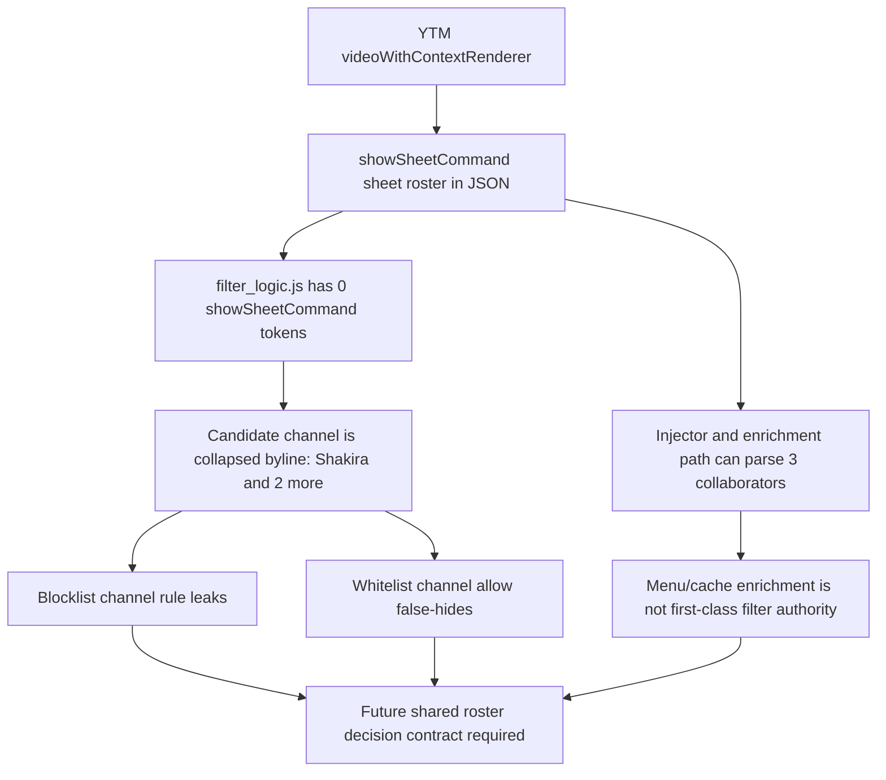

# FilterTube YTM Show Sheet Collaborator Roster Current Behavior - 2026-05-24

Status: audit-only current-behavior fixture slice. Runtime behavior is unchanged.
This is not an implementation patch, renderer expansion, whitelist patch, or
YTM optimization patch.

## Scope

This slice reuses the committed `YTM-XHR.json` `videoWithContextRenderer`
fixture with a modern `showSheetCommand` collaborator roster. The goal is to
separate field availability from first-class JSON filter authority before
collaborator, whitelist, or no-work optimization changes are made.

## Evidence

| Artifact | Lines | Bytes | SHA-256 | Classification |
| --- | ---: | ---: | --- | --- |
| `YTM-XHR.json` | 49806 logical lines | 5141307 | `8c3f3695c69dc865d2eade43eb8e0dc7b44e2fdeff19417269a8cb24a7b54773` | YouTube Music mobile/XHR watch capture with modern sheet roster tokens. |
| `tests/runtime/fixtures/captures/ytm-show-sheet-collab-video-with-context-renderer.json` | 104 | 3818 | `e23da0992cec33040ce286d767c002a9171543dc07c5f5983cc505265fbaabfc` | Reduced `videoWithContextRenderer` fixture. |
| `tests/runtime/ytm-show-sheet-collaborator-roster-current-behavior.test.mjs` | audit test | audit test | audit test | Pins roster fields, extraction omission, list-mode behavior, disabled/no-rule side effects, and missing future authority. |

Raw source token counts:

```text
YTM-XHR showSheetCommand tokens: 116
YTM-XHR showDialogCommand tokens: 0
YTM-XHR videoWithContextRenderer tokens: 59
YTM-XHR listItemViewModel tokens: 67
YTM-XHR browseEndpoint tokens: 274
YTM-XHR UCGnjeahCJW1AF34HBmQTJ-Q tokens: 5
YTM-XHR UCYLNGLIzMhRTi6ZOLjAPSmw tokens: 20
YTM-XHR UCRMqQWxCWE0VMvtUElm-rEA tokens: 10
```

Reduced fixture facts:

```text
source: YTM-XHR.json
rendererType: videoWithContextRenderer
path: onResponseReceivedEndpoints.0.appendContinuationItemsAction.continuationItems.3.videoWithContextRenderer
videoId: capture-show-sheet-collab
title: Shakira, Ed Sheeran, Beele - Hips Don't Lie (Anniversary Version)
byline: Shakira and 2 more
fixture showSheetCommand text tokens: 2
fixture showDialogCommand text tokens: 0
fixture roster listItemViewModel entries: 3
fixture browseEndpoint entries: 3
```

## Roster Evidence

| Roster row | Display title | UC id | Canonical handle |
| ---: | --- | --- | --- |
| 0 | `shakiraVEVO` | `UCGnjeahCJW1AF34HBmQTJ-Q` | `/@shakiraVEVO` |
| 1 | `Spotify` | `UCYLNGLIzMhRTi6ZOLjAPSmw` | `/@spotify` |
| 2 | `Beele` | `UCRMqQWxCWE0VMvtUElm-rEA` | `/@beele` |

These fields are real JSON evidence, but current filtering does not use this
roster as collaborator decision authority. In `_buildCandidate()` with channel
identity extraction enabled, current code returns a single channel-like object:

```text
accepted candidate videoId: empty because the reduced fixture id is synthetic
name: Shakira and 2 more
id: empty
handle: empty
customUrl: empty
collaborators length: 1
showSheet roster messages during candidate extraction: 0
```

## Current Runtime Behavior

The current harness behavior is:

- `videoWithContextRenderer` title keyword filtering works, so the renderer
  itself is not an unsupported container.
- no-rule mode preserves the row and still queues three
  `FilterTube_UpdateChannelMap` messages from the nested sheet roster.
- disabled mode also preserves the row and still queues the same three map
  messages because `processData()` harvests before the enabled guard.
- blocklist channel rules for any of the three roster UC ids or handles preserve
  the row today.
- whitelist keyword allow on the title preserves the row.
- whitelist channel allow for any of the three roster UC ids or handles removes
  the row today because the allow identity is not extracted into the candidate.

The map side effects are:

```text
UCGnjeahCJW1AF34HBmQTJ-Q -> @shakiraVEVO
UCYLNGLIzMhRTi6ZOLjAPSmw -> @spotify
UCRMqQWxCWE0VMvtUElm-rEA -> @beele
```

This is the optimization boundary: the JSON tree already exposes the roster and
current harvest can learn the mappings, but that learned mapping is not the same
thing as blocklist or whitelist authority for the row.

## Filter-Authority Flow - 2026-05-27

The captured row has two different collaborator paths today. The enrichment
path can see the `showSheetCommand` roster, while the filtering path still
builds a single collapsed byline candidate:

```text
YTM-XHR.json
  videoWithContextRenderer
    shortBylineText.runs[0].navigationEndpoint.showSheetCommand
      sheetViewModel.content.listViewModel.listItems
        shakiraVEVO | UCGnjeahCJW1AF34HBmQTJ-Q | /@shakiraVEVO
        Spotify    | UCYLNGLIzMhRTi6ZOLjAPSmw | /@spotify
        Beele      | UCRMqQWxCWE0VMvtUElm-rEA | /@beele
              |
              +--> injector/enrichment lookup can recover roster
              |
              +--> filter_logic candidate extraction ignores showSheetCommand
                     channel.name = "Shakira and 2 more"
                     channel.id/handle/customUrl = empty
                     collaborators.length = 1
```



Cross-slice proof inputs:

- `docs/audit/FILTERTUBE_YTM_SHOW_SHEET_INJECTOR_FILTER_LOGIC_PARITY_CURRENT_BEHAVIOR_2026-05-24.md`
  proves the injector can recover the roster while `filter_logic.js` cannot use
  it for blocklist or whitelist decisions.
- `docs/audit/FILTERTUBE_YTM_SHOW_SHEET_ENRICHMENT_HANDOFF_CURRENT_BEHAVIOR_2026-05-24.md`
  proves the bridge-to-injector lookup can enrich a partial seed, but that
  enrichment is still outside the JSON filter decision.
- `docs/audit/FILTERTUBE_RELEASE_REGRESSION_LAG_AND_BLOCKLIST_FIX_2026-05-26.md`
  documents the separate 2026-05-27 Topic ampersand fix so
  `Kully B & Gussy G - Topic` no longer enters collaborator mode from `&`
  alone.

## Risk Before Optimization

| Risk class | Current boundary |
| --- | --- |
| Reliability | A future collaborator promotion must name exactly which `showSheetCommand.sheetViewModel` paths are accepted and how they differ from legacy `showDialogCommand.dialogViewModel`. |
| False-hide/leak | Blocklist mode leaks roster collaborators today, while whitelist channel allow falsely removes the row. |
| Performance | Disabled and no-rule passes still traverse the nested sheet roster and queue map writes, so a JSON-first optimization needs a no-work and side-effect budget. |
| Code burden | Direct renderer rules, broad harvest, candidate extraction, learned-map writes, and collaborator list-mode decisions are separate layers today. |
| Cross-feature | Menu collaborator actions, learned identity maps, whitelist mode, YTM mobile rows, and future JSON-first row decisions can disagree unless the roster becomes a first-class decision record. |

## Future Proof Required

Before changing `showSheetCommand` collaborator behavior, add a fixture-backed
policy that names:

```text
ytmShowSheetCollaboratorContract
ytmShowSheetCollaboratorDecisionReport
ytmShowSheetCollaboratorWhitelistPolicy
ytmShowSheetCollaboratorBlocklistPolicy
ytmShowSheetCollaboratorCandidateExtractionReport
ytmShowSheetCollaboratorSideEffectBudget
ytmShowSheetCollaboratorNoWorkBudget
ytmShowSheetCollaboratorJsonFirstGate
```

None of those authority symbols exists in product runtime source today.

## Verification

Current proof command:

```bash
node --test tests/runtime/ytm-show-sheet-collaborator-roster-current-behavior.test.mjs --test-reporter=spec
```

This report is not completion proof for the broad audit. It narrows one
JSON-first collaborator and whitelist optimization gap into a captured
current-behavior boundary only.

## Method Semantic Proof Gap Boundary

`docs/audit/FILTERTUBE_METHOD_SEMANTIC_PROOF_GAP_INDEX_CURRENT_BEHAVIOR_2026-05-25.md`
is a required source input before this YouTube Music/YTM surface can support
runtime optimization. Current proof pins:

```text
method semantic proof gap files covered: 69
method semantic proof gap lexical callables covered: 5701
files with complete per-callable semantic proof: 0
lexical callables requiring semantic proof before behavior changes: 5701
affected callable semantic proof: NO-GO
runtime behavior changed: no
```

These counts are audit-only blockers. They do not approve runtime
optimization, JSON-first behavior, YTM behavior, Music surface behavior,
whitelist behavior, metric collectors, artifact creation, native sync, release
package changes, or public claims.
