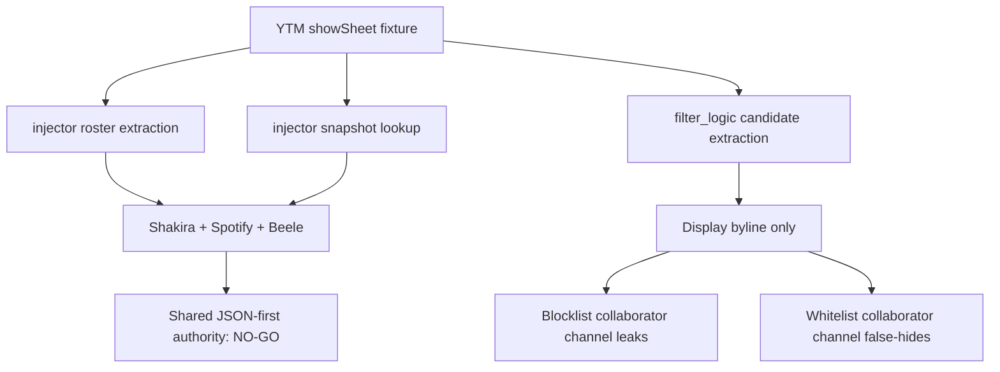

# FilterTube YTM Show Sheet Injector / Filter Logic Parity Current Behavior - 2026-05-24

Status: audit-only current-behavior fixture slice. Runtime behavior is unchanged.
This is not an implementation patch, extractor patch, page-message patch,
whitelist patch, or YTM optimization patch.

## Scope

This slice records a cross-owner mismatch for modern YTM collaborator rosters.
`js/injector.js` can parse the captured `showSheetCommand.sheetViewModel`
collaborator roster from `YTM-XHR.json`, while `js/filter_logic.js` still does
not parse `showSheetCommand` into the candidate used for blocklist and whitelist
decisions.

That means the same JSON field can be usable for main-world collaborator lookup
but not first-class JSON filtering authority.

## Source Facts

| Artifact | Lines | Bytes | SHA-256 | Role |
| --- | ---: | ---: | --- | --- |
| `js/injector.js` | 3593 | 155830 | `634041581ec84db2edd4f07d46f4bfb9d3a7d97036a0fb83db7739856bdc3e04` | Main-world snapshot/collaborator extraction and lookup owner. |
| `js/filter_logic.js` | 3498 | 165151 | `4159fd729e04a82fc54bf39a79b179872205df841e1c6fe067f81ffcf1d11641` | JSON filtering and candidate decision owner. |
| `tests/runtime/fixtures/captures/ytm-show-sheet-collab-video-with-context-renderer.json` | 104 | 3818 | `e23da0992cec33040ce286d767c002a9171543dc07c5f5983cc505265fbaabfc` | Reduced YTM showSheet roster fixture. |

Relevant token counts:

```text
injector showSheetCommand tokens: 14
injector showDialogCommand tokens: 15
injector extractCollaboratorsFromDataObject tokens: 4
injector searchYtInitialDataForCollaborators tokens: 2
filter_logic showSheetCommand tokens: 0
filter_logic showDialogCommand tokens: 11
filter_logic extractCollaboratorsFromDataObject tokens: 0
filter_logic searchYtInitialDataForCollaborators tokens: 0
```

## Current Parity Matrix

| Owner/path | Current behavior | Decision implication |
| --- | --- | --- |
| Injector direct data extraction | `extractCollaboratorsFromDataObject()` returns the three captured collaborators from the fixture: `@shakiraVEVO`, `@spotify`, and `@beele`. | Main-world lookup can recover the modern roster. |
| Injector snapshot search | `searchYtInitialDataForCollaborators("capture-show-sheet-collab")` returns the same three collaborators when the fixture is present in `lastYtNextResponse`. | Snapshot lookup can find the roster by video id. |
| Filter logic candidate extraction | `_buildCandidate(..., { extractChannelIdentity: true })` returns display byline `Shakira and 2 more` with no UC id, handle, or custom URL. | Filter decisions do not see the roster as channel identity. |
| Filter logic blocklist mode | Channel blocklist rules matching Shakira, Spotify, or Beele preserve the row. | Blocklist leak. |
| Filter logic whitelist mode | Channel whitelist rules matching Shakira, Spotify, or Beele remove the row. | Whitelist false-hide. |
| Harvest side effect | No-rule and disabled passes still queue three `FilterTube_UpdateChannelMap` messages from the nested roster. | Map learning and filtering authority are separate effects. |

## 2026-05-30 Central Ledger Linkage

This parity gap now has explicit master-ledger linkage in
`docs/audit/FILTERTUBE_OBJECTIVE_COVERAGE_LEDGER_2026-05-18.md` and
`docs/audit/FILTERTUBE_AUDIT_COMPLETION_GAP_REGISTER_2026-05-20.md`.
The linkage does not change runtime behavior. It exists so the JSON-first,
whitelist, blocklist, performance, false-hide/leak, and cross-owner extraction
objectives do not appear complete while `injector` and `filter_logic` still
disagree about the same captured `showSheetCommand.sheetViewModel` roster.

```text
ASCII flow:
YTM showSheet fixture
  -> injector direct extraction: Shakira + Spotify + Beele
  -> injector snapshot lookup: Shakira + Spotify + Beele
  -> filter_logic candidate: "Shakira and 2 more" display byline only
  -> blocklist collaborator channel: leak
  -> whitelist collaborator channel: false-hide
  -> runtime behavior changed by this continuation: no
```



## Why This Matters

The mismatch is high-risk for JSON-first optimization because a future patch can
look correct if it only checks that the main world can find collaborators. That
does not prove the filtering engine is applying the same roster in blocklist,
whitelist, disabled, no-rule, side-effect, route, or sibling-preservation paths.

This is also a code-burden signal: two owners understand different subsets of
the same collaborator model. The clean fix later should avoid duplicating more
shape-specific branches in busy paths without a shared collaborator decision
contract.

## Future Proof Required

Before using YTM showSheet rosters for behavior changes, add a fixture-backed
policy that names:

```text
ytmShowSheetInjectorFilterLogicParityContract
ytmShowSheetInjectorFilterLogicDecisionReport
ytmShowSheetMainWorldRosterFilterParityReport
ytmShowSheetSnapshotToFilterCandidateContract
ytmShowSheetCollaboratorSharedExtractionPolicy
ytmShowSheetWhitelistParityFixture
ytmShowSheetBlocklistParityFixture
ytmShowSheetParitySideEffectBudget
ytmShowSheetParityNoWorkBudget
ytmShowSheetParityJsonFirstGate
```

None of those authority symbols exists in product runtime source today.

## Verification

Current proof command:

```bash
node --test tests/runtime/ytm-show-sheet-injector-filter-logic-parity-current-behavior.test.mjs --test-reporter=spec
```

This report narrows one cross-owner collaborator parity gap only. It does not
complete the broad audit or grant permission to change filtering behavior.

## Method Semantic Proof Gap Boundary

`docs/audit/FILTERTUBE_METHOD_SEMANTIC_PROOF_GAP_INDEX_CURRENT_BEHAVIOR_2026-05-25.md`
is a required source input before this YouTube Music/YTM surface can support
runtime optimization. Current proof pins:

```text
method semantic proof gap files covered: 63
method semantic proof gap lexical callables covered: 5469
files with complete per-callable semantic proof: 0
lexical callables requiring semantic proof before behavior changes: 5469
affected callable semantic proof: NO-GO
runtime behavior changed: no
```

These counts are audit-only blockers. They do not approve runtime
optimization, JSON-first behavior, YTM behavior, Music surface behavior,
whitelist behavior, metric collectors, artifact creation, native sync, release
package changes, or public claims.
